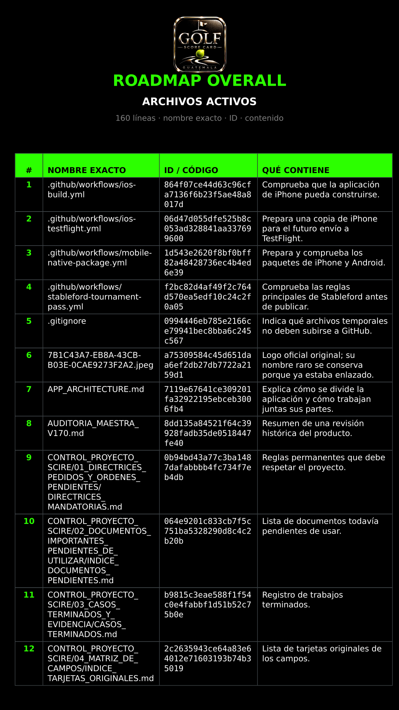
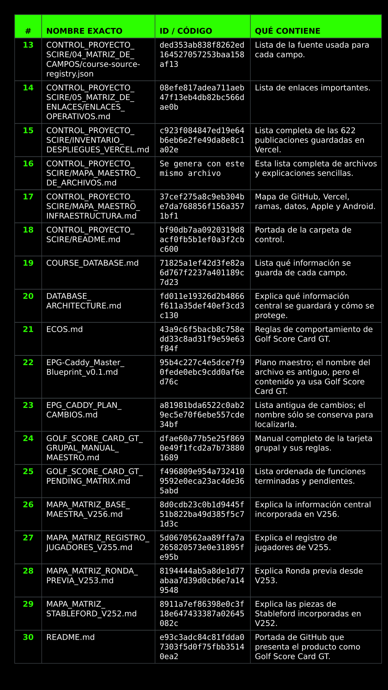
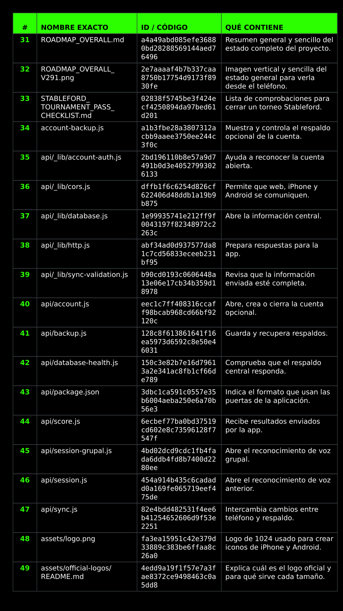
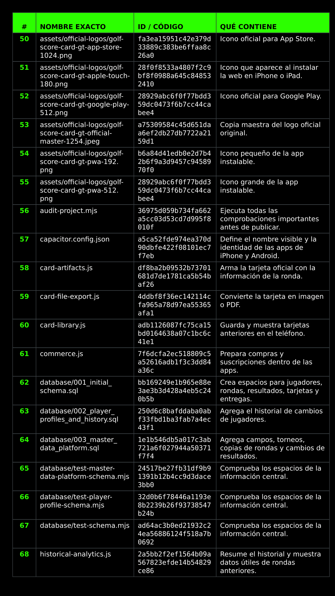
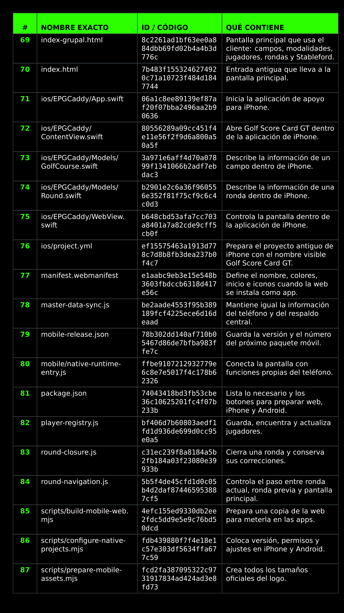
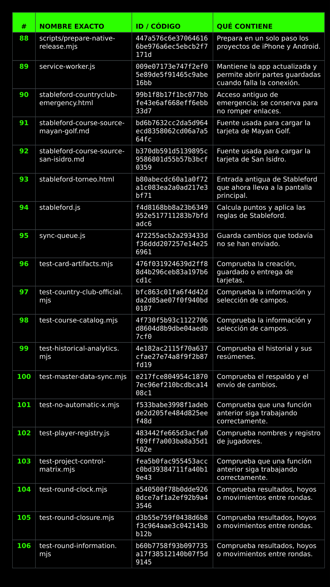
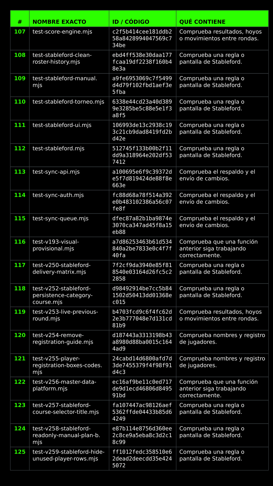
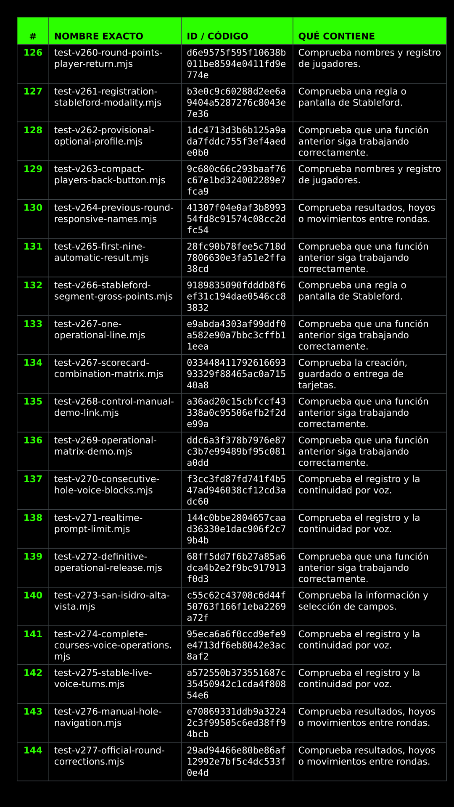
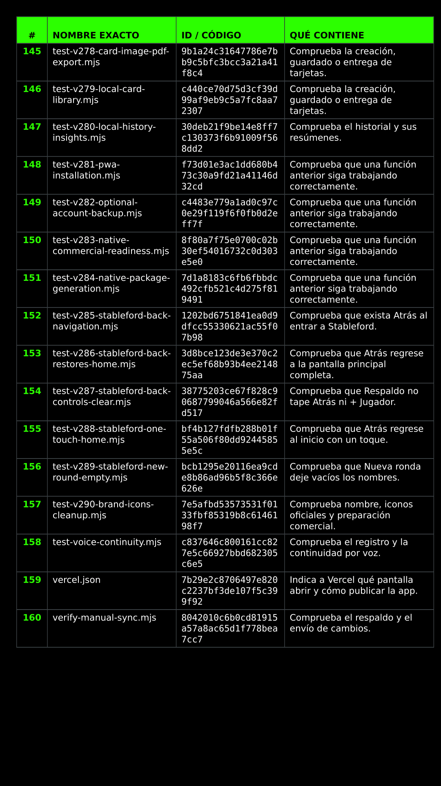

# ROADMAP A DETALLE

## Registro técnico V332 · moneda dual y matriz común de información

El propietario amplía `PEND-SKI-006`: todos los juegos nuevos deben ofrecer dos casillas excluyentes, `Q · QUETZALES` y `$ · DÓLARES`, guardar la selección y usarla sin conversiones ni mezclas en todo resultado. También exige una arquitectura de información completa y comprensible para quien desconoce las apuestas de golf.

| Archivo exacto | Control V332 | Resultado exigido |
|---|---|---|
| `skins.js` | `CURRENCY / ACCUMULATION / SETTLEMENT` | Conserva GTQ/USD y calcula hoyos, Skins, carry, dinero movido, neto a liquidar, líder y mayor pozo. |
| `wolf.js` | `CURRENCY / RISK / ACCUMULATION` | Conserva GTQ/USD y calcula estado, pendientes, carry, exposición, dinero movido, neto, líder y liquidación por diferencia. |
| `vegas.js` | `CURRENCY / POINT MATRIX / DUEL RISK` | Conserva GTQ/USD y calcula hoyos, duelos, volteos, puntos, dinero, neto, líder, mayor cambio y exposición máxima por duelo. |
| `dots.js` | `CURRENCY / EVENT MATRIX / POINT IMPACT` | Conserva GTQ/USD y calcula hoyos resueltos/pendientes, eventos, puntos positivos/negativos, dinero, neto, líder e impacto de un punto por jugador. |
| `index-grupal.html` | `V332-DUAL-CURRENCY-MATRIX-20260826` | Ocho radios —dos por juego—, sólo una moneda marcada por juego, símbolos dinámicos y matriz común en vivo. |
| `card-artifacts.js` | `AUDITABLE SIDE-GAME MATRIX` | Global y personales conservan moneda, acumulados, riesgo, saldos y pago exacto. |
| `test-v329-skins.mjs`, `test-v330-side-games.mjs` | `DUAL CURRENCY / COMMON MATRIX REGRESSION` | Comprueban exclusividad, símbolos, métricas, cero-suma, cierre, corrección, Historial, nube y restauración. |
| `service-worker.js` | `gscg-mobile-v332-dual-currency-matrix` | Obliga al iPhone a cargar el shell nuevo. |
| Documentación e inventarios | `HONEST STATUS / DIGEST` | Registran PASS de 89 paquetes, 325 fuentes y tres PDF sellados; conservan Producción intacta hasta Preview y PASS físico. |

La matriz común visible se define así: acuerdos previos; moneda y unidad; estado actual; hoyos resueltos y pendientes; acumulado de puntos/unidades; dinero bruto movido; saldo neto por jugador o pareja; líder/empate; riesgo propio del juego; neto a liquidar; y transferencias exactas. Ninguna cifra económica escribe scores. El banco integral V332 terminó con 89 paquetes PASS, 325 fuentes y tres inventarios sellados; queda pendiente la publicación Preview y la prueba física.

## Registro PEND-DID-017 · fichas didácticas por modalidad

El propietario solicita una hoja por cada modalidad y por cada esquema que cambie el resultado, explicada con claridad suficiente para un niño de 10 años y utilizable en blanco y negro. El pendiente abarca Ronda Normal, Stableford, Match Play, Four Ball, Práctica, Skins, Wolf, Vegas, Dots y hojas complementarias para empates, decisiones, volteos y eventos configurables.

| Control obligatorio | Resultado exigido |
|---|---|
| Lenguaje de 10 años | Frases cortas, glosario español y ningún término inglés sin explicar. |
| Blanco y negro real | Texto, bordes, patrones e iconos; ningún estado o ganador depende sólo del color. |
| Ejemplo auditable | Scores, operación, acumulado anterior/nuevo y liquidación coinciden con el motor. |
| Aprendizaje y estrategia | Explica qué acordar, qué registrar, cómo leer el estado, cómo jugar mejor y qué errores evitar. |
| Dinero general y opcional | Todas las hojas muestran Q/$, unidad, multiplicador, tope y liquidación; cada grupo decide si liquida dinero o juega sólo con puntos/unidades. |
| Versionado | Cada hoja declara fuente, variante universal/configurable/de grupo y versión del motor compatible. |

Archivo rector: `CONTROL_PROYECTO_SCIRE/01_DIRECTRICES_PEDIDOS_Y_ORDENES_PENDIENTES/PEND_DID_017_FICHAS_MODALIDADES_PARA_APRENDER.md`. El trabajo se ejecutará después de validar físicamente las modalidades V332; no interrumpe la prueba activa ni modifica Producción.

## Registro técnico V331 · matriz investigada de apuestas

La evidencia física `IMG_1960.png` aprueba V330-R3: sólo `WOLF` permanece verde y `RONDA NORMAL` queda desmarcada. V331 continúa el mismo pendiente y reemplaza controles ambiguos por reglas, estados, métricas y liquidaciones explicables en español. Las variantes que las fuentes describen de forma distinta nunca se presentan como universales.

| Archivo exacto | Control V331 | Resultado exigido |
|---|---|---|
| `wolf.js` | `PARTNER / LONE / BLIND / RISK / CAP / METRICS` | Migra `solo` legado a Lobo solitario; configura Wolf primero/último, multiplicadores y tope; calcula exposición por rival, unidades ganadas/perdidas, acumulado, dinero movido y pago por diferencia. |
| `vegas.js` | `PAIR NUMBER / 10+ / BOTH BIRDIES / LIVE METRICS` | 4+5→45; 10+4→104; ambos birdies cancelan el volteo por defecto o voltean ambos como regla del grupo; cada duelo conserva diferencia, tope, águila, puntos y cero-suma. |
| `dots.js` | `PLAIN SPANISH / POSITIVE-NEGATIVE / AUTO-MANUAL` | Sandy, Greenie, Chippie, Poley, Barkie, Arnie, Ferret y Snake incluyen definición; Ferret/Amigo/izquierda/derecha empiezan apagados; el resultado separa premios, penalizaciones y eventos por hoyo. |
| `index-grupal.html` | `V331-RESEARCHED-SIDE-GAMES-20260826 / LIVE CONTROL` | Configuración previa comprensible, estados por hoyo, riesgos, acumulados, métricas, detalle de cálculos y liquidación; la tarjeta deportiva permanece intacta. |
| `card-artifacts.js` | `WOLF AUDIT PANEL` | Tarjeta final conserva acuerdos, unidades netas, acumulados, dinero movido y quién paga a quién. |
| `test-v330-side-games.mjs` | `RESEARCH MATRIX REGRESSION` | Cubre migración, exposición, tope Wolf, dos políticas de birdies Vegas, score 10+, métricas Dots y selección visual única. |
| `service-worker.js` | `gscg-mobile-v331-researched-side-games` | Obliga al iPhone a sustituir la copia V330-R3. |
| `scripts/update-inventory-v328.py` | `V331 INVENTORY COVER` | Regenera las tres portadas con matriz investigada, PASS físico R3 y prueba completa todavía pendiente. |
| `ROADMAP_OVERALL.md`, `ROADMAP_A_DETALLE.md`, `GOLF_SCORE_CARD_GT_PENDING_MATRIX.md`, `CONTROL_PROYECTO_SCIRE/01_DIRECTRICES_PEDIDOS_Y_ORDENES_PENDIENTES/COLA_DE_PENDIENTES.md`, `CONTROL_PROYECTO_SCIRE/MAPA_MAESTRO_DE_ARCHIVOS.md`, `CONTROL_PROYECTO_SCIRE/INVENTARIOS_V311.lock.json` | `HONEST STATUS / DIGEST` | Registran el PASS físico R3, el alcance V331 y las pruebas físicas todavía pendientes. |

Fuentes consultadas: 18Birdies documenta Wolf por mejor bola, punto por unidad, Lobo solitario/ciego y pagos por diferencia; Wolf Golf Scorecard confirma Wolf primero/último, carry, multiplicadores y liquidación; Mashie, 18Birdies y Golf Digest documentan la formación del número Vegas, volteos, scores de dos dígitos y topes; 18Birdies, MyScorecard y SCGA describen Dots/Junk como eventos acordados antes de salir. La aplicación conserva las adaptaciones de 3, 5 o 6 jugadores y tres parejas claramente rotuladas como propias de Golf Score Card GT.

## Registro técnico V330 · juegos laterales y tres parejas

**Hotfix V330-R3 · selección única después de rechazo físico:** la captura real de iPhone mostró simultáneamente verdes `RONDA NORMAL` y `WOLF`; V330-R2 queda rechazada. `enforceExclusiveDraftGame()` elimina estados laterales múltiples heredados y `syncDraftModeSelection()` se convierte en el único escritor de las siete opciones. `selectSideGameRoundMode()` sincroniza antes de renderizar y `renderSideGameDrafts()` vuelve a sincronizar al terminar. `test-v330-side-games.mjs` ejecuta el caso WOLF y exige seis `aria-pressed=false` y sólo WOLF en `true`. `index-grupal.html` identifica `V330-R3-PHYSICAL-SINGLE-MODE-20260826` y `service-worker.js` fuerza `gscg-mobile-v330-side-games-r3`.

**Registro PEND-VOZ-003 pospuesto:** la observación física nueva queda documentada en `CONTROL_PROYECTO_SCIRE/01_DIRECTRICES_PEDIDOS_Y_ORDENES_PENDIENTES/COLA_DE_PENDIENTES.md` y `GOLF_SCORE_CARD_GT_PENDING_MATRIX.md`: respuestas generales demasiado vagas sin una petición adicional, corte del ciclo en la quinta conversación y necesidad de estados exactos `ESCUCHANDO` / `RESPONDIENDO` en rojo parpadeante. No existe cambio funcional de voz en este corte; el trabajo activo regresa a las modalidades nuevas.

**Registro de pendientes nuevos:** `CONTROL_PROYECTO_SCIRE/01_DIRECTRICES_PEDIDOS_Y_ORDENES_PENDIENTES/PEND_UBI_015_DETECCION_CAMPO_POR_GPS.md` documenta catálogo geográfico, perímetros, propuesta y confirmación del campo; `CONTROL_PROYECTO_SCIRE/01_DIRECTRICES_PEDIDOS_Y_ORDENES_PENDIENTES/PEND_RSG_016_SINCRONIZACION_REGLAS_GOLF.md` documenta fuente oficial, manifiesto, SHA-256, caché, actualización y reversión. `CONTROL_PROYECTO_SCIRE/01_DIRECTRICES_PEDIDOS_Y_ORDENES_PENDIENTES/COLA_DE_PENDIENTES.md`, `GOLF_SCORE_CARD_GT_PENDING_MATRIX.md` y `CONTROL_PROYECTO_SCIRE/MAPA_MAESTRO_DE_ARCHIVOS.md` incorporan ambos IDs sin duplicar `PEND-GPS-010` ni `PEND-REG-001`.

| Archivo exacto | Control V330 | Resultado comprobado |
|---|---|---|
| `skins.js` | `2–6 / GROSS-NET / CARRY-SPLIT-VOID / ZERO-SUM` | Ganador o empate por hoyo, bolsa, carry final, X y saldo económico separado. |
| `wolf.js` | `3–6 / ROTATION / PARTNER-SOLO-LONE-BLIND / CLOSE GUARD` | Decisión por hoyo, multiplicadores ×1/×2/×3, cobro cruzado, empate y bloqueo de cierre si falta una decisión. |
| `vegas.js` | `4 OR 6 / 2 OR 3 PAIRS / CAP / ZERO-SUM` | Número menor por pareja, comparaciones par a par, empate, volteo, águila y tope. |
| `dots.js` | `2–6 / ENABLED EVENTS / CUSTOM VALUES` | Eventos clásicos configurables y reglas Amigo/izquierda/derecha apagadas por defecto. |
| `match-play.js`, `four-ball.js` | `GREEN 1–2 / GOLD 3–4 / BLUE 5–6` | Tres parejas completas; Match independiente y Four Ball por mejor Neto. |
| `index-grupal.html` | `TWO-COLUMN SETUP / MAIN CARD UNCHANGED / VOICE` | Existentes a la izquierda, nuevos a la derecha, moneda, reglas, resultados y controles; sin rediseñar la tarjeta principal. |
| `round-closure.js` | `SIDE GAMES SNAPSHOT / SHA-256 / CORRECTION` | Cierre auditable, Wolf completo obligatorio y recálculo versionado. |
| `card-artifacts.js`, `card-library.js`, `historical-analytics.js` | `GLOBAL / PERSONAL / SEARCH / HISTORY` | Configuración, ganadores, empates y saldos visibles y consultables. |
| `master-data-sync.js`, `account-backup.js` | `CLOUD / RESTORE` | El snapshot de juegos sobrevive sincronización y restauración. |
| `service-worker.js`, `scripts/build-mobile-web.mjs`, `vercel.json` | `CACHE V330 / MOBILE ASSETS / NO-STORE MODULES` | Los cuatro motores viajan en la copia instalable y no quedan congelados por caché anterior. |
| `test-v329-skins.mjs`, `test-v330-side-games.mjs` | `ENGINE + E2E + UI + PERSISTENCE` | Regla, empate, X, tope, cero-suma, cierre, corrección, artefactos, historial, nube, restauración y voz aprobados localmente. |
| `audit-project.mjs` | `89 PACKAGES + LIVE VERCEL GATE` | Regresión local completa y build Preview aprobados; la puerta real confirmó modelo, búsqueda web, seis fuentes oficiales y `scoreChanged:false`. |

Estado honesto: el Preview `dpl_4k5V9rFwkVXVwuRwktBjtgG4arAv` quedó `READY` desde `ea18aafb214731d44b41ea069fe27228407f9f47`; 89 paquetes, 322 fuentes, tres inventarios y la puerta viva aprobaron. La protección de acceso de Vercel impidió la inspección visual automática externa; revisión visual/táctil y prueba física de iPhone siguen abiertas antes de cualquier montaje en Producción.

## Registro técnico V328-R2 · Reglas oficiales y respaldo básico sin conexión

El centro reglamentario reutiliza panel, conversación temporal, micrófono bilateral, síntesis, fuentes y contexto de la aplicación. `api/golf-rules.js` obliga a investigar en USGA/The R&A, filtra de nuevo las fuentes recibidas y falla si no existe autoridad oficial. La tarjeta entrega únicamente campo y modalidad; no expone coordenadas, nombres ni scores. El modo REGLAS evita deliberadamente `routeAiUniversalAppText`, por lo que una consulta no puede convertirse en escritura. El Preview V328-R1 quedó `READY` con árbol remoto `f0de0f6328c34ed2788faf1009ba04a19f47e6c1` después de aprobar 86 paquetes y la consulta oficial real. V328-R2 añade respaldo local de respuestas oficiales ya confirmadas, sin convertirlo en una base cerrada de reglas ni simular AI.

| Archivo exacto | Control V328 | Resultado comprobado |
|---|---|---|
| `api/golf-rules.js` | `OFFICIAL_RULE_DOMAINS / tool_choice required / scoreChanged false` | Modelo real GPT-5.6, Web limitada a `usga.org` y `randa.org`, fuentes oficiales obligatorias, edición 2023, clarificaciones vigentes y cero escritura. |
| `index-grupal.html` | `REGLAS / get_official_golf_rule / RULES MODE ISOLATION` | Acceso global, texto, voz, controles bilaterales, fuentes visibles, contexto de modalidad y bypass de órdenes locales. |
| `test-v328-official-golf-rules.mjs` | `15 RULE SCENARIOS / 2 DOMAINS / 0 SCORE WRITES` | Fuera de límites, provisional, penalidad, alivios, Match Play, Four-Ball, Stableford, Comité y Regla Local. |
| `test-v328-live-official-rules.mjs` | `REAL MODEL / REAL WEB / OFFICIAL SOURCE / 0 SCORE WRITES` | Ejecuta el handler real dentro de Vercel con la credencial Preview; bloquea el build si falta respuesta, autoridad USGA/The R&A o aislamiento de score. |
| `golf-rules-offline.js` | `24 ENTRIES / 90 DAYS / TOKEN MATCH / SAME MODE` | Conserva sólo respuestas previamente confirmadas con fuente oficial; no guarda la pregunta completa, no llama servicios externos y no escribe scores. |
| `test-v328-offline-official-rules.mjs` | `OFFICIAL CACHE / PRIVACY / EXPIRY / NEGATIVE MATCH / 0 SCORE WRITES` | Prueba límites, caducidad, modalidad, coincidencias débiles, PWA y rechazo de fuentes o cambios no autorizados. |
| `vercel.json` | `AUDIT 87 + LIVE RULE GATE` | Obliga regresión completa y consulta oficial real antes de entregar cada Preview V328-R2. |
| `manual.html`, `docs/manual/v311/manual-pages-17-35.json`, `scripts/update-manual-page-73.py`, `docs/manual/v311/page-73.png` | `MANUAL PAGE 73 V328` | Explicación sencilla para elegir canal, describir, verificar fuente y conservar la tarjeta. |
| `docs/manual/v311/Manual_Golf_Score_Card_GT_COMPLETO.pdf`, `docs/manual/v311/Manual_de_Funciones_Golf_Score_Card_GT_01-16.pdf` | `74 PAGES / 4K / 300 DPI` | PDF completo y alias estable regenerados; extracción y control visual aprobados. |
| `service-worker.js` | `gscg-mobile-v328-official-golf-rules-offline-r2` | Instala el módulo de respaldo y fuerza sustitución de la copia anterior. |
| `scripts/update-inventory-v328.py` | `3 INVENTORY COVERS / OFFLINE DELIVERED / IDEMPOTENT` | Actualiza la portada V328-R2 de los tres inventarios sin duplicarla al repetir el proceso. |
| `audit-project.mjs` | `87 PACKAGES` | Agrega los paquetes reglamentarios conectado y sin conexión a la regresión maestra. |
| `CONTROL_PROYECTO_SCIRE/01_DIRECTRICES_PEDIDOS_Y_ORDENES_PENDIENTES/COLA_DE_PENDIENTES.md`, `GOLF_SCORE_CARD_GT_PENDING_MATRIX.md`, `GOLF_SCORE_CARD_GT_GRUPAL_MANUAL_MAESTRO.md`, `CONTROL_PROYECTO_SCIRE/MAPA_MAESTRO_DE_ARCHIVOS.md` | `PEND-REG-001 V328-R2` | Distinguen modo offline entregado de voz física y eventual licencia comercial todavía pendientes. |

Todos los archivos tocados por la firma/caché V328 quedan registrados aquí para el candado: `test-v327-tool-followup-no-silence.mjs`, `test-v326-no-silent-conversation.mjs`, `test-v325-ideal-microphone-timings.mjs`, `test-v324-real-traffic.mjs`, `test-v323-long-multitopic-context.mjs`, `test-v322-real-sustained-caddie.mjs`, `test-v321-ai-universal-infinity.mjs`, `test-v312-general-caddie.mjs`, `test-v307-match-arrows-format.mjs`, `test-v305-history-navigation-zero-error.mjs`, `test-v304-homogeneous-registration-actions.mjs`, `test-v290-brand-icons-cleanup.mjs`, `test-v284-native-package-generation.mjs`, `test-v281-pwa-installation.mjs`, `test-v280-local-history-insights.mjs`, `test-v279-local-card-library.mjs`, `test-v278-card-image-pdf-export.mjs`, `test-v277-official-round-corrections.mjs`, `test-v276-manual-hole-navigation.mjs`, `test-v275-stable-live-voice-turns.mjs`, `test-v274-complete-courses-voice-operations.mjs`, `test-v272-definitive-operational-release.mjs` y `test-stableford-ui.mjs`. También se actualizan `CONTROL_PROYECTO_SCIRE/INVENTARIOS_V311.lock.json`, `ROADMAP_OVERALL.md` y `ROADMAP_A_DETALLE.md`; los tres inventarios PDF externos se regeneran antes de validar.

## Registro detallado V327-R1-PEND · pendientes completos, inventarios y ejecución autónoma

El propietario dispone el **26 de agosto de 2026** que la cola se adapte completa y que el trabajo continúe sin autorizaciones intermedias: cada pendiente se diseña dentro de la arquitectura única, se implementa, se prueba en automático y en su dispositivo físico, se despliega en Preview y sólo se monta después de PASS íntegro. Una dependencia externa real se registra como bloqueo; no se falsifica una licencia, credencial, cuenta, contrato ni dato oficial.

| Archivo o artefacto exacto | Control actualizado | Resultado exigido |
|---|---|---|
| `CONTROL_PROYECTO_SCIRE/01_DIRECTRICES_PEDIDOS_Y_ORDENES_PENDIENTES/DIRECTRICES_MANDATORIAS.md` | `AUTORIZACIÓN PERMANENTE / REGLAS 22–26 / FAIL BLOQUEA` | Elimina autorizaciones intermedias, prohíbe trasladar trabajo técnico, exige siguiente acción inequívoca, impide simular trabajo en segundo plano y conserva Producción intacta ante cualquier falla. |
| `CONTROL_PROYECTO_SCIRE/01_DIRECTRICES_PEDIDOS_Y_ORDENES_PENDIENTES/COLA_DE_PENDIENTES.md` | `PEND-REG-001` a `PEND-QA-014` | Reúne voz, tráfico, reglas, handicap, campos, GPS, juegos/apuestas, relojes, nube, estadísticas, monetización, QA, clima y Guía Rápida. |
| `GOLF_SCORE_CARD_GT_PENDING_MATRIX.md` | `CORTE V327-R1 / 24 BLOQUES` | Separa funciones entregadas, fases parciales, bloqueos externos y condiciones reales de cierre. |
| `CONTROL_PROYECTO_SCIRE/MAPA_MAESTRO_DE_ARCHIVOS.md` | `MAPA V327-R1-PEND` | Permite localizar la autorización y los catorce identificadores oficiales sin revisar conversaciones antiguas. |
| `Inventario_Golf_Score_Card_GT_OVERALL_V311.pdf`, `Inventario_Golf_Score_Card_GT_A_DETALLE_V311.pdf`, `Inventario_Golf_Score_Card_GT_POR_IMAGENES_Y_RUBROS_V311.pdf` | `PORTADA V327-R1-PEND` | Los tres inventarios PDF abren con estado, cola maestra, directriz de ejecución y puerta física pendiente. |
| `CONTROL_PROYECTO_SCIRE/INVENTARIOS_V311.lock.json` | `DIGEST + 3 PDF` | Sella fuentes, tamaños y SHA-256 nuevos después de renderizar e inspeccionar los inventarios. |
| `ROADMAP_OVERALL.md`, `ROADMAP_A_DETALLE.md` | `REGISTRO DOBLE` | Satisfacen el candado mandatorio activado el 23 de agosto de 2026, 17:05:00, hora de Guatemala, después de la línea 185. |

V327-R1 conserva 44 llamadas reales desplegadas, 24 áreas, ocho turnos con memoria, 550 secuencias de voz, tráfico exacto/futuro, clima, investigación y cero 5xx. La prueba física larga en iPhone sigue siendo la puerta inmediata; no se abre otra implementación funcional ni se monta Producción antes de cerrarla.

## Registro detallado V327 · continuidad real después de tráfico e investigación web

La prueba física de V326-R2 quedó rechazada. Después de unas seis preguntas, el usuario recibió silencios con el micrófono rojo: una consulta sobre una persona conocida en Colima sí terminó en `/api/research` con HTTP 200 y Google Routes también estaba operativo, pero el cliente no terminó la segunda respuesta hablada. La evidencia demuestra una falla de estados WebRTC y no una lista angosta de vocabulario.

| Archivo exacto | Control V327 | Resultado exigido |
|---|---|---|
| `index-grupal.html` | `TRANSCRIPTION UNTIL FINAL / FOLLOWUP AUDIO START / PLAYBACK 60S` | `speech_stopped` no cancela la vigilancia; un cierre tardío sin `response_id` se atribuye a la respuesta fuente hasta que empiece el audio final; generación y reproducción tienen recuperación independiente; el canal perdido nunca retorna en silencio. |
| `api/voice-health.js` | `ALLOWLIST / NO CONTENT / 202` | Conserva sólo etapa, build, contexto, número de turno, duración, herramienta y banderas técnicas; descarta pregunta, transcripción, nombre, GPS y credenciales. |
| `api/_lib/traffic.js` | `AMBIGUOUS DESTINATION → ONE QUESTION` | Una ruta inexistente o un destino fragmentario pide nombre completo, zona o municipio. La ruta exacta El Pulté Golf → Pradera Concepción permanece calculable. |
| `api/universal-ai.js` | `TEXT TRAFFIC CLARIFICATION` | El canal de texto tampoco invoca tráfico con un fragmento ambiguo y, si el proveedor no identifica la ruta, formula solamente una pregunta breve. |
| `test-v327-tool-followup-no-silence.mjs` | `550 TOOL/AUDIO SEQUENCES + 100 PRIVACY EVENTS` | Prueba cierres antes y después de crear el follow-up, con y sin ID, audio final, vigilancia de entrada/reproducción, recuperación de canal, aclaración de destino y exclusión de contenido privado. |
| `test-v326-no-silent-conversation.mjs`, `test-v325-ideal-microphone-timings.mjs`, `test-v324-real-traffic.mjs`, `test-v323-long-multitopic-context.mjs`, `test-v322-real-sustained-caddie.mjs`, `test-v312-general-caddie.mjs` | `REGRESSION-V327` | Conservan VAD 2.2 s, entrada 15/90 s, respuesta 30 s, contexto largo, búsqueda universal y tráfico real. |
| `service-worker.js` | `gscg-mobile-v327-tool-followup-no-silence` | Fuerza al iPhone a sustituir la copia V326-R2. |
| `audit-project.mjs`, `test-stableford-ui.mjs`, `test-v272-definitive-operational-release.mjs`, `test-v274-complete-courses-voice-operations.mjs`, `test-v275-stable-live-voice-turns.mjs`, `test-v276-manual-hole-navigation.mjs`, `test-v277-official-round-corrections.mjs`, `test-v278-card-image-pdf-export.mjs`, `test-v279-local-card-library.mjs`, `test-v280-local-history-insights.mjs`, `test-v281-pwa-installation.mjs`, `test-v284-native-package-generation.mjs`, `test-v290-brand-icons-cleanup.mjs`, `test-v304-homogeneous-registration-actions.mjs`, `test-v305-history-navigation-zero-error.mjs`, `test-v307-match-arrows-format.mjs` | `BUILD/CACHE-V327` | Toda la regresión exige el nuevo corte sin alterar funciones anteriores. |
| `CONTROL_PROYECTO_SCIRE/01_DIRECTRICES_PEDIDOS_Y_ORDENES_PENDIENTES/COLA_DE_PENDIENTES.md`, `GOLF_SCORE_CARD_GT_PENDING_MATRIX.md`, `GOLF_SCORE_CARD_GT_GRUPAL_MANUAL_MAESTRO.md`, `CONTROL_PROYECTO_SCIRE/MAPA_MAESTRO_DE_ARCHIVOS.md`, `CONTROL_PROYECTO_SCIRE/INVENTARIOS_V311.lock.json`, `ROADMAP_OVERALL.md`, `ROADMAP_A_DETALLE.md` | `HONEST STATUS / MAP / DIGEST` | Registran V326-R2 rechazada, V327 en banco y la prohibición de montaje hasta PASS físico prolongado. |

El cálculo directo real ejecutado durante el diagnóstico devolvió para El Pulté Golf → Pradera Concepción 15 km y cerca de 33 minutos en ese instante. `Concepción` sin más datos no debe convertirse arbitrariamente en Pradera Concepción ni en otro municipio: el modelo hace una sola pregunta breve. Producción permanece en V322 sin modificación.

## Registro detallado V326-R1 · recarga controlada de la credencial de tráfico

El usuario indicó que Google Routes podría estar habilitado. Como Vercel congela las variables disponibles al momento de cada construcción, se solicitó un deployment nuevo con el mismo árbol funcional V326. El intento inicial `ffc45545d77182c6904f74f664cef5d8f12eb95a` fue rechazado antes de publicar por `ROADMAP GATE`: no contenía actualización simultánea de `ROADMAP_OVERALL.md` y `ROADMAP_A_DETALLE.md`. El rechazo prueba que el candado de gobernanza funciona y no constituye una falla de la aplicación ni una modificación de producción.

V326-R1 modifica únicamente `ROADMAP_OVERALL.md`, `ROADMAP_A_DETALLE.md` y `CONTROL_PROYECTO_SCIRE/INVENTARIOS_V311.lock.json`; no cambia HTML, API, Service Worker ni lógica del micrófono. El deployment Preview resultante debe ejecutar la consulta literal «mañana a las 12:30 PM, de El Pulté hacia colonia Oakland zona 10» y sólo puede aprobarse si recibe `ok:true`, ETA, `staticDuration`, demora, distancia, proveedor y hora de cálculo. La comparación contra Waze en Guatemala y el micrófono físico prolongado continúan como pruebas finales obligatorias.

La construcción `dpl_F7cu9YVHovcxWiMMJAR2pm6dnkRx` cargó efectivamente `GOOGLE_MAPS_API_KEY` y expuso un defecto exclusivo del banco: la aserción de credencial ausente inyectaba `apiKey:""`, valor que el operador `||` reemplazaba por la credencial real de Preview. El test recibió `TRAFFIC_ROUTE_UNAVAILABLE` al alcanzar Google y se detuvo antes de publicar. La corrección queda limitada a `test-v324-real-traffic.mjs`, usando `apiKey:" "` para comprobar el recorte a vacío sin heredar el entorno; no cambia el contrato ni la ejecución real de `api/_lib/traffic.js`.

## Registro detallado V326 · recuperación comprobable del micrófono rojo

La evidencia física invalida el criterio V325: `semantic_vad` con `eagerness: low` podía conservar indefinidamente un turno abierto y el watchdog de transcripción sólo nacía después de `input_audio_buffer.speech_stopped`. Por eso el círculo seguía rojo aunque el usuario ya hubiera terminado de hablar. V326 reemplaza únicamente el perfil conversacional por `server_vad` 0.2/700/2,200 ms; la captura operativa de scores, navegación y registro conserva 0.2/700/1,000 ms.

| Archivo exacto | Control V326 | Resultado exigido |
|---|---|---|
| `index-grupal.html` | `CONVERSATION 2200 / INPUT 15S / HARD 90S / RESPONSE 30S` | Cierra una pausa conversacional amplia, renueva vigilancia con deltas, desmonta la captura atascada, apaga el micrófono rojo y recupera una respuesta que no comenzó. El consumo aproximado de A/C se atiende directamente con supuestos. |
| `test-v326-no-silent-conversation.mjs` | `REAL TIMER STATE MACHINE / 30 TURNS` | Ejecuta los callbacks de entrada y respuesta, comprueba el apagado del rojo, mensajes de recuperación y 30 alternancias conversación/orden. |
| `test-v325-ideal-microphone-timings.mjs` | `V326 REGRESSION` | Sustituye la expectativa semántica no determinista por la pausa conversacional fija de 2.2 segundos. |
| `audit-project.mjs` | `AUDIT-V326` | Incorpora el nuevo candado a la auditoría maestra. |
| `service-worker.js` | `gscg-mobile-v327-tool-followup-no-silence` | Obliga a reemplazar la copia V325 instalada en la vista previa. |
| `test-v324-real-traffic.mjs`, `test-v323-long-multitopic-context.mjs`, `test-v322-real-sustained-caddie.mjs`, `test-v312-general-caddie.mjs`, `test-stableford-ui.mjs`, `test-v272-definitive-operational-release.mjs`, `test-v274-complete-courses-voice-operations.mjs`, `test-v275-stable-live-voice-turns.mjs`, `test-v276-manual-hole-navigation.mjs`, `test-v277-official-round-corrections.mjs`, `test-v278-card-image-pdf-export.mjs`, `test-v279-local-card-library.mjs`, `test-v280-local-history-insights.mjs`, `test-v281-pwa-installation.mjs`, `test-v284-native-package-generation.mjs`, `test-v290-brand-icons-cleanup.mjs`, `test-v304-homogeneous-registration-actions.mjs`, `test-v305-history-navigation-zero-error.mjs` y `test-v307-match-arrows-format.mjs` | `BUILD/CACHE-V326` | Conservan todas las funciones previas y exigen la copia corregida. |
| `GOLF_SCORE_CARD_GT_GRUPAL_MANUAL_MAESTRO.md`, `GOLF_SCORE_CARD_GT_PENDING_MATRIX.md` | `REJECT-V325 / VALIDATE-V326` | Documentan el fallo real, la corrección y que no existe autorización de montaje. |
| `CONTROL_PROYECTO_SCIRE/MAPA_MAESTRO_DE_ARCHIVOS.md`, `CONTROL_PROYECTO_SCIRE/INVENTARIOS_V311.lock.json`, `ROADMAP_OVERALL.md` y `ROADMAP_A_DETALLE.md` | `MAP/DIGEST/EVIDENCE-V326` | Mapa, tres inventarios, sello y evidencia coinciden con el corte corregido. |

La prueba de aceptación pendiente repite literalmente: tráfico mañana, salida 12:30 PM de El Pulté hacia colonia Oakland zona 10; consumo eléctrico aproximado de un aire acondicionado; y una conversación multitema bilateral prolongada. V326 no se monta sin aprobar esas tres rutas físicas. Google Routes continúa siendo un bloqueo externo separado mientras no exista credencial Preview y comparación simultánea contra Waze en Guatemala.

## Registro detallado V325 · tiempos ideales del micrófono bilateral

V325 mantiene dos perfiles deliberados. `operational` conserva `server_vad` 0.2/700/1,000 ms para registros, scores y órdenes breves. `conversation` utiliza `semantic_vad` con `eagerness: low` para que AI UNIVERSAL ∞ espere el cierre semántico de una idea y no fragmente una conversación por una pausa fija. Toda actualización de sesión queda serializada y validada contra el perfil esperado antes de generar la respuesta; una orden reconocida restaura el perfil operativo.

La continuidad exige apertura siempre manual, micrófono disponible durante la respuesta, guardia de interrupción de 250 ms, transcripción humana mínima de ocho caracteres, filtro de eco de 1,800 ms, reescucha inmediata, cierre por inactividad de 30 minutos, watchdog de diez segundos y aviso `Falta NOMBRE` después de 2,000 ms más 450 ms de confirmación. `test-v325-ideal-microphone-timings.mjs` compila el script y ejecuta 30 alternancias conversación/operación. La validación física prolongada en iPhone continúa abierta, al igual que credencial y comparación real del tráfico en Guatemala. Se agregan a pendientes USGA/Reglas de Golf, Skins y Apple Watch/Wear OS.

Archivos exactos V325: `index-grupal.html`, `service-worker.js`, `audit-project.mjs`, `test-v325-ideal-microphone-timings.mjs`, `test-v324-real-traffic.mjs`, `test-v323-long-multitopic-context.mjs`, `test-v322-real-sustained-caddie.mjs`, `test-v312-general-caddie.mjs`, `test-stableford-ui.mjs`, `test-v272-definitive-operational-release.mjs`, `test-v274-complete-courses-voice-operations.mjs`, `test-v275-stable-live-voice-turns.mjs`, `test-v276-manual-hole-navigation.mjs`, `test-v277-official-round-corrections.mjs`, `test-v278-card-image-pdf-export.mjs`, `test-v279-local-card-library.mjs`, `test-v280-local-history-insights.mjs`, `test-v281-pwa-installation.mjs`, `test-v284-native-package-generation.mjs`, `test-v290-brand-icons-cleanup.mjs`, `test-v304-homogeneous-registration-actions.mjs`, `test-v305-history-navigation-zero-error.mjs`, `test-v307-match-arrows-format.mjs`, `CONTROL_PROYECTO_SCIRE/01_DIRECTRICES_PEDIDOS_Y_ORDENES_PENDIENTES/COLA_DE_PENDIENTES.md`, `GOLF_SCORE_CARD_GT_PENDING_MATRIX.md`, `GOLF_SCORE_CARD_GT_GRUPAL_MANUAL_MAESTRO.md`, `CONTROL_PROYECTO_SCIRE/MAPA_MAESTRO_DE_ARCHIVOS.md`, `CONTROL_PROYECTO_SCIRE/INVENTARIOS_V311.lock.json`, `ROADMAP_OVERALL.md` y `ROADMAP_A_DETALLE.md`.

## Registro detallado V324 · tráfico actual/futuro, privacidad y recuperación

V324 añade tráfico como herramienta dinámica de AI UNIVERSAL ∞, no como lista de palabras ni respuesta fija. El modelo decide cuándo pedir `get_live_traffic`; el servidor consulta Google Maps Routes en modo óptimo y devuelve un resumen auditable. El GPS se usa únicamente como origen efímero, se elimina del contexto presentado al modelo y nunca aparece en la respuesta. La integración distingue Google Routes de Waze y conserva pendiente la calibración física necesaria antes del montaje.

| Archivo exacto | Control V324 | Resultado exigido |
|---|---|---|
| `api/_lib/traffic.js`, `api/traffic.js` | `TRAFFIC_AWARE_OPTIMAL / 15S / NO COORDINATES` | Ruta real actual o futura, clave sólo en servidor, ETA/demora/distancia y fallos recuperables. |
| `api/universal-ai.js` | `get_live_traffic / TWO-STEP / 55S` | Clasifica la intención sin catálogo, solicita GPS cuando falta y vuelve a consultar al modelo con un temporizador independiente. |
| `index-grupal.html` | `VOICE + TEXT + GPS EPHEMERAL / 20S` | La misma función opera por micrófono y teclado, no guarda coordenadas y permite continuar tras éxito o error. |
| `test-v324-real-traffic.mjs` | `CURRENT / FUTURE / PRIVACY / FAILURE / TIMEOUT` | Prueba ETA, demora, huso horario, proveedor, privacidad, texto, voz y recuperación. |
| `audit-project.mjs` | `AUDIT-V324` | Añade V324 a toda la regresión antes de construir. |
| `service-worker.js`, `test-v323-long-multitopic-context.mjs`, `test-v322-real-sustained-caddie.mjs`, `test-v321-ai-universal-infinity.mjs`, `test-v312-general-caddie.mjs`, `test-stableford-ui.mjs`, `test-v272-definitive-operational-release.mjs`, `test-v274-complete-courses-voice-operations.mjs`, `test-v275-stable-live-voice-turns.mjs`, `test-v276-manual-hole-navigation.mjs`, `test-v277-official-round-corrections.mjs`, `test-v278-card-image-pdf-export.mjs`, `test-v279-local-card-library.mjs`, `test-v280-local-history-insights.mjs`, `test-v281-pwa-installation.mjs`, `test-v284-native-package-generation.mjs`, `test-v290-brand-icons-cleanup.mjs`, `test-v304-homogeneous-registration-actions.mjs`, `test-v305-history-navigation-zero-error.mjs` y `test-v307-match-arrows-format.mjs` | `BUILD/CACHE-V324` | Conservan sus controles previos y exigen el nuevo build/caché. |
| `CONTROL_PROYECTO_SCIRE/01_DIRECTRICES_PEDIDOS_Y_ORDENES_PENDIENTES/COLA_DE_PENDIENTES.md`, `GOLF_SCORE_CARD_GT_PENDING_MATRIX.md`, `GOLF_SCORE_CARD_GT_GRUPAL_MANUAL_MAESTRO.md` | `HONEST-STATUS` | Registran código implementado y mantienen abiertas credencial, destino, Guatemala/Waze e iPhone. |
| `CONTROL_PROYECTO_SCIRE/MAPA_MAESTRO_DE_ARCHIVOS.md`, `CONTROL_PROYECTO_SCIRE/INVENTARIOS_V311.lock.json`, `ROADMAP_OVERALL.md` y `ROADMAP_A_DETALLE.md` | `MAP/DIGEST/EVIDENCE-V324` | Mapa, sello y evidencia coinciden con las fuentes exactas. |

## Registro detallado V323 · memoria bilateral multitema

La prueba conversacional real cambió de tema 14 veces sin cortar la comunicación, pero la pregunta 15 reveló que la clave inicial ya no llegaba al modelo. V323 unifica en 80 mensajes la memoria compartida por teclado, voz Realtime y API de texto. El límite equivale a 40 intercambios completos y conserva una ventana móvil controlada cuando se supera.

| Archivo exacto | Control V323 | Resultado exigido |
|---|---|---|
| `api/universal-ai.js` | `80-MESSAGE-SERVER-HISTORY` | La API real recibe hasta 80 mensajes limpios sin truncar la conversación a 8 intercambios. |
| `index-grupal.html` | `80-MESSAGE-BILATERAL-HISTORY` | Texto y voz comparten hasta 40 intercambios y preservan el primer dato después de 30 cambios de tema. |
| `service-worker.js` | `gscg-mobile-v323-long-multitopic-context` | Sustituye de inmediato el shell V322 instalado. |
| `test-v323-long-multitopic-context.mjs` | `30-TOPICS / 63-MESSAGES / FIRST-KEY` | Verifica memoria inicial, variedad temática, rutas de texto y voz, y límite móvil. |
| `audit-project.mjs` | `AUDIT-V323` | Ejecuta la prueba multitema junto con toda la regresión. |
| `test-v322-real-sustained-caddie.mjs`, `test-v312-general-caddie.mjs`, `test-stableford-ui.mjs`, `test-v272-definitive-operational-release.mjs`, `test-v274-complete-courses-voice-operations.mjs`, `test-v275-stable-live-voice-turns.mjs`, `test-v276-manual-hole-navigation.mjs`, `test-v277-official-round-corrections.mjs`, `test-v278-card-image-pdf-export.mjs`, `test-v279-local-card-library.mjs`, `test-v280-local-history-insights.mjs`, `test-v281-pwa-installation.mjs`, `test-v284-native-package-generation.mjs`, `test-v290-brand-icons-cleanup.mjs`, `test-v304-homogeneous-registration-actions.mjs`, `test-v305-history-navigation-zero-error.mjs` y `test-v307-match-arrows-format.mjs` | `BUILD/CACHE-V323` | Mantienen sus controles funcionales y exigen el build vigente. |
| `CONTROL_PROYECTO_SCIRE/MAPA_MAESTRO_DE_ARCHIVOS.md` | `MAPA-V323` | Registra la nueva prueba y el total de archivos vigentes. |
| `CONTROL_PROYECTO_SCIRE/INVENTARIOS_V311.lock.json` | `DIGEST-V323` | Sella el conjunto exacto de fuentes después de la corrección. |
| `ROADMAP_OVERALL.md` y `ROADMAP_A_DETALLE.md` | `EVIDENCIA-V323` | Conservan causa, cambio, alcance y criterio de aprobación. |

## Registro detallado V322 · micrófono sostenido, reapertura y recuperación

La evidencia real de iPhone mostró dos respuestas correctas seguidas de cierre automático; al tocar nuevamente, `/api/session-grupal` respondía HTTP 200 pero el cliente podía quedar sin reaccionar. La causa se encontraba en el cierre forzado de tres segundos, la reconstrucción innecesaria de una conexión sana y el tratamiento terminal de fallos recuperables. V322 corrige las tres rutas y conserva completa la AI UNIVERSAL ∞ incorporada simultáneamente en V321.

| Archivo exacto | Control V322 | Resultado exigido |
|---|---|---|
| `index-grupal.html` | `V322-REAL-SUSTAINED-CONVERSATION` | 30 minutos de inactividad, 24+ turnos, reutilización WebRTC sana, watchdogs visibles y recuperación sin silencio. |
| `api/research.js` | `RESEARCH-RECOVERY-40S` | Timeout, error upstream y respuesta vacía regresan HTTP 200 con explicación utilizable. |
| `service-worker.js` | `gscg-mobile-v322-real-sustained-conversation` | Reemplaza la copia V321 instalada. |
| `test-v322-real-sustained-caddie.mjs` | `24-TURNS / SUCCESS / TIMEOUT / UPSTREAM` | Prueba el contrato completo nuevo y las rutas de recuperación. |
| `test-v321-ai-universal-infinity.mjs` | `200/200-REGRESSION` | Conserva voz, texto, contexto, Web y 200 áreas sin lista cerrada. |
| `test-v312-general-caddie.mjs` | `VOICE-REGRESSION` | Conserva clima, score, conversación, interrupción y nueva duración. |
| `audit-project.mjs` | `AUDIT-V322` | Ejecuta V322 dentro de toda la batería antes de construir. |
| `test-stableford-ui.mjs`, `test-v272-definitive-operational-release.mjs`, `test-v274-complete-courses-voice-operations.mjs`, `test-v275-stable-live-voice-turns.mjs`, `test-v276-manual-hole-navigation.mjs`, `test-v277-official-round-corrections.mjs`, `test-v278-card-image-pdf-export.mjs`, `test-v279-local-card-library.mjs`, `test-v280-local-history-insights.mjs`, `test-v281-pwa-installation.mjs`, `test-v284-native-package-generation.mjs`, `test-v290-brand-icons-cleanup.mjs`, `test-v304-homogeneous-registration-actions.mjs`, `test-v305-history-navigation-zero-error.mjs` y `test-v307-match-arrows-format.mjs` | `BUILD/CACHE-V322` | Mantienen sus controles funcionales y reconocen la publicación vigente. |
| `CONTROL_PROYECTO_SCIRE/MAPA_MAESTRO_DE_ARCHIVOS.md` | `MAPA-V322` | Registra la prueba y el corte vigente. |
| `CONTROL_PROYECTO_SCIRE/INVENTARIOS_V311.lock.json` | `DIGEST-V322` | Sella fuentes y tres PDF regenerados con los mismos nombres. |
| `ROADMAP_OVERALL.md` y `ROADMAP_A_DETALLE.md` | `EVIDENCIA-V322` | Conservan causa, corrección, alcance y pruebas. |

## Registro detallado V321 · AI UNIVERSAL ∞

La comunicación universal deja de depender de ejemplos temáticos: una API de modelo avanzado atiende cualquier consulta permitida, mantiene contexto temporal, consulta la Web cuando el dato cambia y separa automáticamente las órdenes de Golf Score Card GT. La voz detecta el idioma, el texto comparte el mismo hilo y el usuario dispone de cinco controles. El Manual mantiene portada, orden y 74 páginas físicas.

Control visual final: `manual.html` identifica la página 73 como **AI UNIVERSAL ∞** y `test-v321-ai-universal-infinity.mjs` exige ese mismo nombre.

| Archivo exacto | Código V321 | Contenido verificado |
|---|---|---|
| `api/universal-ai.js` | `V321-AI-API` | Responses API, modelo avanzado, Web, fuentes, contexto, seguridad y privacidad sin almacenamiento del proveedor. |
| `api/session-grupal.js` | `V321-LANGUAGE-AUTO` | Transcripción Realtime sin candado de idioma y español predeterminado. |
| `index-grupal.html` | `V321-AI-UNIVERSAL-INFINITY` | UI AI ∞, voz/texto, historial temporal, respuesta escrita, clasificación, contexto y controles. |
| `service-worker.js` | `gscg-mobile-v321-ai-universal-infinity` | Renovación del shell PWA. |
| `audit-project.mjs` | `AUDIT-V321` | Ejecuta la prueba V321 dentro de la auditoría maestra. |
| `test-v321-ai-universal-infinity.mjs` | `200/200` | Prueba los 200 temas, temas futuros, API, Web, contexto, controles y rutas locales. |
| `test-v267-one-operational-line.mjs` | `V321-AUTO-LANG` | Contrato operativo Realtime actualizado. |
| `test-v271-realtime-prompt-limit.mjs` | `V321-AUTO-LANG` | Límite de prompt y transcripción automática. |
| `test-v312-general-caddie.mjs` | `V321-REGRESSION` | Conversación, idioma, micrófono, Web, clima, interrupción y cierre. |
| `test-stableford-ui.mjs` | `BUILD-V321` | Identificador de build vigente. |
| `test-v272-definitive-operational-release.mjs` | `BUILD-V321` | Identificador de build vigente. |
| `test-v274-complete-courses-voice-operations.mjs` | `BUILD-V321` | Identificador de build vigente. |
| `test-v275-stable-live-voice-turns.mjs` | `BUILD-V321` | Identificador de build vigente. |
| `test-v276-manual-hole-navigation.mjs` | `BUILD-V321` | Identificador de build vigente. |
| `test-v277-official-round-corrections.mjs` | `BUILD-V321` | Identificador de build vigente. |
| `test-v278-card-image-pdf-export.mjs` | `BUILD-V321` | Identificador de build vigente. |
| `test-v279-local-card-library.mjs` | `BUILD-V321` | Identificador de build vigente. |
| `test-v280-local-history-insights.mjs` | `BUILD-V321` | Identificador de build vigente. |
| `test-v281-pwa-installation.mjs` | `CACHE-V321` | Caché PWA vigente. |
| `test-v284-native-package-generation.mjs` | `BUILD-V321` | Build web del paquete nativo. |
| `test-v290-brand-icons-cleanup.mjs` | `BUILD-V321` | Identificador de build vigente. |
| `test-v304-homogeneous-registration-actions.mjs` | `BUILD-V321` | Identificador de build vigente. |
| `test-v305-history-navigation-zero-error.mjs` | `BUILD-V321` | Identificador de build vigente. |
| `test-v307-match-arrows-format.mjs` | `BUILD-V321` | Identificador de build vigente. |
| `GOLF_SCORE_CARD_GT_GRUPAL_MANUAL_MAESTRO.md` | `MANUAL-3.69` | Especificación completa y límites honestos de AI UNIVERSAL ∞. |
| `MANUAL_COBERTURA_FUNCIONAL_V311.md` | `PAGE-73` | Mapeo de función, recuperación y prueba. |
| `docs/manual/v311/manual-pages-17-35.json` | `PAGE-73-V321` | Explicación sencilla de voz, texto, orden/pregunta y continuidad. |
| `scripts/update-manual-page-73.py` | `PDF-V321` | Reemplaza sólo la última página y conserva portada y páginas 01-72. |
| `docs/manual/v311/page-73.png` | `4K-2160x4320` | Render final verificado sin recortes. |
| `docs/manual/v311/Manual_Golf_Score_Card_GT_COMPLETO.pdf` | `74-PAGES-V321` | Portada primero, páginas 01-73 y marcadores internos. |
| `docs/manual/v311/Manual_de_Funciones_Golf_Score_Card_GT_01-16.pdf` | `74-PAGES-V321` | Alias completo sincronizado. |
| `test-v311-manual-semantic-coverage.mjs` | `MANUAL-V321` | Bloquea pérdida de la explicación y controles. |
| `CONTROL_PROYECTO_SCIRE/INVENTARIOS_V311.lock.json` | `SOURCE-LOCK-V321` | Digest y cantidad de fuentes activas V321. |

## Golf Score Card GT

Inventario consolidado al corte **V314 · 25 de agosto de 2026**, con **295 archivos activos rastreados en Git**. Las nueve páginas visuales conservan la fotografía original de los 160 archivos activos al cierre de V292; las secciones posteriores incorporan, sin borrar ese antecedente, todos los cambios posteriores. Cada línea incluye:

> **CORTE DE REVISIÓN SOLICITADO:** desde la **línea 160 hacia abajo** se considera contenido nuevo para revisión.

- nombre exacto del archivo;
- ID o código único;
- explicación sencilla de lo que contiene.

### Página 1 de 9

### Página 2 de 9

### Página 3 de 9

### Página 4 de 9

### Página 5 de 9

### Página 6 de 9

### Página 7 de 9

### Página 8 de 9

### Página 9 de 9

## Referencias completas

- [ROADMAP OVERALL](ROADMAP_OVERALL.md)
- [Mapa maestro de archivos](CONTROL_PROYECTO_SCIRE/MAPA_MAESTRO_DE_ARCHIVOS.md)
- [Mapa de infraestructura](CONTROL_PROYECTO_SCIRE/MAPA_MAESTRO_INFRAESTRUCTURA.md)
- [Inventario de publicaciones Vercel](CONTROL_PROYECTO_SCIRE/INVENTARIO_DESPLIEGUES_VERCEL.md)

Este archivo permanece como entrada directa y amigable al directorio detallado del proyecto.

## Continuación del directorio · Corte nuevo desde la línea 160

| Línea | Nombre exacto | ID o código | Qué contiene |
|---:|---|---|---|
| 160 | `verify-manual-sync.mjs` | `8042010c6b0cd81915a57a8ac65d1f778bea7cc7` | Primera línea del corte nuevo solicitado; comprueba la sincronización entre el manual y la aplicación. |
| 161 | `ROADMAP_IMAGES/README.md` | `693f74b22cd9b885b473288f36c8437539429485` | Índice de todas las imágenes detalladas. |
| 162 | `ROADMAP_IMAGES/01_ARCHIVOS_ACTIVOS_COMPLETO.png` | `b3ac32312aaaa986e64684793b56539cf22e9280` | Imagen continua de los archivos activos. |
| 163 | `ROADMAP_IMAGES/02_ARCHIVOS_RETIRADOS_COMPLETO.png` | `eb46364dc267183bf0d6e2863d26aa0c657eee65` | Imagen continua de los archivos retirados. |
| 164 | `ROADMAP_IMAGES/03_INFRAESTRUCTURA_COMPLETO.png` | `0f66e7ac0a000573ffeb9f613d88815c829f9fa0` | Imagen continua de infraestructura e IDs. |
| 165 | `ROADMAP_IMAGES/04_RAMAS_GITHUB_COMPLETO.png` | `b0b615d5c147373000e84dcba10fe01304100ce2` | Imagen continua de las ramas de GitHub. |
| 166 | `ROADMAP_IMAGES/05_VERCEL_01_A_COMPLETO.png` | `a1cb219919df9d3c530799be9bf469863e59820f` | Publicaciones Vercel 1 a 78. |
| 167 | `ROADMAP_IMAGES/05_VERCEL_01_B_COMPLETO.png` | `f12aa1d1faa64eef046851e012e616ab0176093f` | Publicaciones Vercel 79 a 156. |
| 168 | `ROADMAP_IMAGES/06_VERCEL_02_A_COMPLETO.png` | `424bdb42ee60ccdd299c5d09648144fe76d6301b` | Publicaciones Vercel 157 a 234. |
| 169 | `ROADMAP_IMAGES/06_VERCEL_02_B_COMPLETO.png` | `d5a041447df51e6e7aeb8bd8c237ce4cf930300e` | Publicaciones Vercel 235 a 312. |
| 170 | `ROADMAP_IMAGES/07_VERCEL_03_A_COMPLETO.png` | `227e81e811a9dfff4ca83feaa6fcc35d1253b244` | Publicaciones Vercel 313 a 390. |
| 171 | `ROADMAP_IMAGES/07_VERCEL_03_B_COMPLETO.png` | `4037cfe4d9c5f6dbb731abcc37b4170e8f0359fb` | Publicaciones Vercel 391 a 468. |
| 172 | `ROADMAP_IMAGES/08_VERCEL_04_A_COMPLETO.png` | `c0cd9ad1fba1b07dbd607db175230bdc8092c1b0` | Publicaciones Vercel 469 a 545. |
| 173 | `ROADMAP_IMAGES/08_VERCEL_04_B_COMPLETO.png` | `3e94c9fc0bab3b7d7c5450846316ccffb5ff4ba3` | Publicaciones Vercel 546 a 622. |
| 174 | `ROADMAP_A_DETALLE.md` | Se genera con este mismo archivo | Este directorio visual y su norma permanente. |
| 175 | `ROADMAP_IMAGES/ROADMAP_A_DETALLE_01.png` | `2377b6bba6c886a2fddac44b2d01fbc7ebf3f0ca` | Página 1 de 9 del directorio visual. |
| 176 | `ROADMAP_IMAGES/ROADMAP_A_DETALLE_02.png` | `ba0d741c811283d33e53431b9a90cf3055a97bed` | Página 2 de 9 del directorio visual. |
| 177 | `ROADMAP_IMAGES/ROADMAP_A_DETALLE_03.png` | `feb9f2f6ebab3b7321f6e741fb5c6886625cb0d7` | Página 3 de 9 del directorio visual. |
| 178 | `ROADMAP_IMAGES/ROADMAP_A_DETALLE_04.png` | `8b1240dce80a451ff2274708317a303c220c2133` | Página 4 de 9 del directorio visual. |
| 179 | `ROADMAP_IMAGES/ROADMAP_A_DETALLE_05.png` | `3277fc72250970281438c00eb11f1e29a2ffaf4f` | Página 5 de 9 del directorio visual. |
| 180 | `ROADMAP_IMAGES/ROADMAP_A_DETALLE_06.png` | `0aa2913da74c26c396e114d9958f3d06e7f296b0` | Página 6 de 9 del directorio visual. |
| 181 | `ROADMAP_IMAGES/ROADMAP_A_DETALLE_07.png` | `f29b846a85639291b546149fe3a819b1bca23115` | Página 7 de 9 del directorio visual. |
| 182 | `ROADMAP_IMAGES/ROADMAP_A_DETALLE_08.png` | `50bb1bbb190bcee92bcecccc576d61bf2f89f44a` | Página 8 de 9 del directorio visual. |
| 183 | `ROADMAP_IMAGES/ROADMAP_A_DETALLE_09.png` | `2375cd4734decbc33ea9e778d9ae292e19dacd34` | Página 9 de 9 del directorio visual. |
| 184 | `.github/workflows/roadmap-gate.yml` | `2b0e0640e36c07e343f06414a9d2d703727237bb` | Candado automático que bloquea cambios no registrados. |
| 185 | `scripts/roadmap-gate.mjs` | `94694d94a956dc7a62fb17697447f5fb4916617c` | Comprueba que toda modificación aparezca en ambos ROADMAPS. |

## Registro obligatorio de la modificación V294

| Archivo modificado | ID o código actualizado | Explicación sencilla |
|---|---|---|
| `.github/workflows/ios-build.yml` | `8a61450069cd4ec9297204841a70788ae1f4ad0f` | La construcción de iPhone se detiene si faltan los dos ROADMAPS. |
| `.github/workflows/ios-testflight.yml` | `b67cfeef9a79cc4b419accece846a7e334a27636` | La preparación para TestFlight se detiene si faltan los dos ROADMAPS. |
| `.github/workflows/mobile-native-package.yml` | `ee0d6b5b72cfab49646b58a764dcb8d585c88ee5` | El paquete Apple/Android también se detiene si faltan los ROADMAPS. |
| `.github/workflows/roadmap-gate.yml` | `2b0e0640e36c07e343f06414a9d2d703727237bb` | Ejecuta automáticamente el candado en GitHub. |
| `.github/workflows/stableford-tournament-pass.yml` | `df70cf36092ddd72b59271bf241b1ac58fb21027` | Las pruebas principales de Stableford se detienen si faltan los dos ROADMAPS. |
| `CONTROL_PROYECTO_SCIRE/01_DIRECTRICES_PEDIDOS_Y_ORDENES_PENDIENTES/DIRECTRICES_MANDATORIAS.md` | `be454f43b458670199a7be029abf716dc49108d7` | Guarda la norma permanente, el punto de corte y la hora. |
| `CONTROL_PROYECTO_SCIRE/MAPA_MAESTRO_DE_ARCHIVOS.md` | Se genera con este mismo mapa | Registra los archivos nuevos y los códigos actualizados. |
| `audit-project.mjs` | `597a19619b0c7f64e8d6963f0d28ab02a329f6cf` | Toda comprobación maestra empieza ejecutando el candado. |
| `package.json` | `a9ffec0ea56adb2998235b502fd71ed092b13bb0` | Agrega el botón técnico `roadmap:gate`. |
| `scripts/roadmap-gate.mjs` | `94694d94a956dc7a62fb17697447f5fb4916617c` | Revisa los archivos cambiados contra ambos ROADMAPS. |

## Registro obligatorio del refuerzo técnico V295

| Archivo modificado | ID o código actualizado | Explicación sencilla |
|---|---|---|
| `vercel.json` | `7915a87799ed0549f7ef1f4f40a46ad719a922eb` | Vercel debe ejecutar el candado antes de publicar. |
| `scripts/roadmap-gate.mjs` | `94694d94a956dc7a62fb17697447f5fb4916617c` | Si Vercel no puede identificar los cambios, bloquea la publicación por seguridad. |
| `CONTROL_PROYECTO_SCIRE/01_DIRECTRICES_PEDIDOS_Y_ORDENES_PENDIENTES/DIRECTRICES_MANDATORIAS.md` | `be454f43b458670199a7be029abf716dc49108d7` | Incorpora Vercel a las rutas obligadas a ejecutar el candado. |
| `CONTROL_PROYECTO_SCIRE/MAPA_MAESTRO_DE_ARCHIVOS.md` | Se genera con este mismo mapa | Actualiza códigos y explicaciones del refuerzo. |
| `ROADMAP_A_DETALLE.md` | Se genera con este mismo archivo | Registra este refuerzo técnico línea por línea. |
| `ROADMAP_OVERALL.md` | Se genera con este mismo archivo | Registra este refuerzo en el resumen general. |

## Registro obligatorio del ajuste de salida V296

| Archivo modificado | ID o código actualizado | Explicación sencilla |
|---|---|---|
| `vercel.json` | `c6dbbe007a72b62ed141e39aac6128f2dce3eb8b` | Mantiene el candado y señala a Vercel la carpeta final que debe publicar. |
| `CONTROL_PROYECTO_SCIRE/MAPA_MAESTRO_DE_ARCHIVOS.md` | Se genera con este mismo mapa | Actualiza el código y la explicación del ajuste. |
| `ROADMAP_A_DETALLE.md` | Se genera con este mismo archivo | Registra el ajuste dentro del directorio detallado. |
| `ROADMAP_OVERALL.md` | Se genera con este mismo archivo | Registra el ajuste dentro del resumen general. |

## Registro obligatorio de la actualización operativa V297

Autorización: **24 de agosto de 2026**. Alcance: instalar el icono cuadrado cromado 3D con verde neón muy saturado en todos los formatos Apple, Android y web instalable; además, reducir 50 % el micrófono visible de registro y mostrar una figura clara de micrófono sin cambiar su función.

| Archivo modificado | ID o código actualizado | Explicación sencilla |
|---|---|---|
| `7B1C43A7-EB8A-43CB-B03E-0CAE9273F2A2.jpeg` | `1c3cdacf565de7b2ce42d57bb416a23c50af1b8e` | Fuente histórica del logo, ahora con cromado 3D y verde neón muy saturado. |
| `assets/logo.png` | `376f6237bbdddf4245ecd3da0f080ad5462f8178` | Imagen de 1024 usada para preparar los paquetes Apple y Android. |
| `assets/official-logos/README.md` | Registro V297 | Explica que la versión cromada 3D es la oficial. |
| `assets/official-logos/golf-score-card-gt-app-store-1024.png` | `376f6237bbdddf4245ecd3da0f080ad5462f8178` | Icono final de 1024 para App Store. |
| `assets/official-logos/golf-score-card-gt-apple-touch-180.png` | `ed44949eeb3aedad2ea1cf806091d216bc5e67e0` | Icono final que verá el usuario al instalarla en iPhone o iPad. |
| `assets/official-logos/golf-score-card-gt-google-play-512.png` | `0e85cc6995f9bafefb49dec5a8253aef3db7fffd` | Icono final de 512 para Google Play. |
| `assets/official-logos/golf-score-card-gt-official-master-1254.jpeg` | `1c3cdacf565de7b2ce42d57bb416a23c50af1b8e` | Copia maestra oficial del logo cromado 3D y verde neón. |
| `assets/official-logos/golf-score-card-gt-pwa-192.png` | `e28cd92c784748a2d4ff02bf3491b96c8121ed94` | Icono pequeño de la aplicación instalable. |
| `assets/official-logos/golf-score-card-gt-pwa-512.png` | `0e85cc6995f9bafefb49dec5a8253aef3db7fffd` | Icono grande de la aplicación instalable. |
| `index-grupal.html` | Registro V297 | Reduce 50 % el micrófono visible, conserva su botón y agrega una figura central clara. |
| `mobile-release.json` | Paquete `297` | Deja preparada la numeración móvil de esta versión. |
| `service-worker.js` | Caché `gscg-mobile-v297` | Obliga a descargar los nuevos iconos y retirar la caché anterior. |
| `test-v290-brand-icons-cleanup.mjs` | Validación V297 | Comprueba los iconos, el paquete móvil y la nueva caché. |
| `CONTROL_PROYECTO_SCIRE/MAPA_MAESTRO_DE_ARCHIVOS.md` | Se genera con este mismo mapa | Actualiza códigos, tamaños y explicaciones sencillas. |
| `ROADMAP_A_DETALLE.md` | Se genera con este mismo archivo | Registra toda la actualización a detalle. |
| `ROADMAP_OVERALL.md` | Se genera con este mismo archivo | Registra toda la actualización en el resumen general. |

## Registro obligatorio de la actualización operativa V298

Autorización: **24 de agosto de 2026**. Alcance: cambiar únicamente la explicación situada arriba del micrófono para que un usuario nuevo entienda, de izquierda a derecha y sin términos técnicos, qué debe dictar o escribir y cuándo presionar OK.

| Archivo modificado | ID o código actualizado | Explicación sencilla |
|---|---|---|
| `index-grupal.html` | Registro V298 | Coloca a la izquierda y con letra mayor: DICTA O ESCRIBE, 1-NOMBRE, 2-HDCP, 3-MARCAS, DE CADA JUGADOR y 4-OK. |
| `mobile-release.json` | Paquete `298` | Deja preparada la numeración móvil de esta versión. |
| `service-worker.js` | Caché `gscg-mobile-v298` | Hace que la aplicación descargue la guía nueva y retire la pantalla anterior. |
| `test-v290-brand-icons-cleanup.mjs` | Validación V298 | Comprueba el contenido, orden, alineación y tamaño de la guía. |
| `CONTROL_PROYECTO_SCIRE/MAPA_MAESTRO_DE_ARCHIVOS.md` | Se genera con este mismo mapa | Actualiza códigos, tamaños y explicaciones sencillas. |
| `ROADMAP_A_DETALLE.md` | Se genera con este mismo archivo | Registra V298 a detalle. |
| `ROADMAP_OVERALL.md` | Se genera con este mismo archivo | Registra V298 en el resumen general. |

## Registro obligatorio de la corrección operativa V299

Solicitud: **24 de agosto de 2026**. Alcance: corregir exclusivamente el logo superior que se veía agrandado en la aplicación instalada en iPhone. Se conserva sin cambios la guía para newbies y el micrófono aprobado.

| Archivo modificado | ID o código actualizado | Explicación sencilla |
|---|---|---|
| `index-grupal.html` | Registro V299 | Evita que el logo sea más ancho que su recuadro y deja libre la barra superior del iPhone. |
| `mobile-release.json` | Paquete `299` | Deja preparada la numeración móvil de esta corrección. |
| `service-worker.js` | Caché `gscg-mobile-v299` | Hace que la aplicación descargue la corrección y retire la pantalla anterior. |
| `test-v290-brand-icons-cleanup.mjs` | Validación V299 | Comprueba que el logo use 100 % máximo y respete el espacio seguro superior. |
| `CONTROL_PROYECTO_SCIRE/MAPA_MAESTRO_DE_ARCHIVOS.md` | Se genera con este mismo mapa | Actualiza códigos, tamaños y explicaciones sencillas. |
| `ROADMAP_A_DETALLE.md` | Se genera con este mismo archivo | Registra V299 a detalle. |
| `ROADMAP_OVERALL.md` | Se genera con este mismo archivo | Registra V299 en el resumen general. |

## Registro obligatorio de la documentación operativa V300

Solicitud: **24 de agosto de 2026**. Alcance: crear un compendio final, básico y amigable para que el consumidor conozca las funciones reales disponibles sin términos de ingeniería ni promesas de capacidades todavía pendientes.

| Archivo modificado o nuevo | ID o código actualizado | Explicación sencilla |
|---|---|---|
| `COMPENDIO_FINAL_FUNCIONES_USUARIO.md` | Documento V300 | Explica cómo usar inicio, campos, modalidades, jugadores, scores, tarjetas, historial, correcciones, respaldo e instalación. |
| `CONTROL_PROYECTO_SCIRE/MAPA_MAESTRO_DE_ARCHIVOS.md` | Se genera con este mismo mapa | Incorpora el documento nuevo al directorio completo. |
| `ROADMAP_A_DETALLE.md` | Se genera con este mismo archivo | Guarda V300 a detalle. |
| `ROADMAP_OVERALL.md` | Se genera con este mismo archivo | Guarda V300 en el resumen general. |

## Registro obligatorio de la actualización operativa V301

Solicitud: **24 de agosto de 2026**. Alcance: mostrar claramente la ruta normal, renombrar la tarjeta rápida y convertir el registro y la descripción de torneo en opciones expresamente identificadas como opcionales.

| Archivo modificado | ID o código actualizado | Explicación sencilla |
|---|---|---|
| `index-grupal.html` | Registro V301 | Muestra RONDA NORMAL, STABLEFORD y SCORE CARD - PRÁCTICA; además guarda la descripción opcional del torneo. |
| `COMPENDIO_FINAL_FUNCIONES_USUARIO.md` | Documento actualizado V301 | Explica al consumidor los nuevos nombres y el dato opcional. |
| `mobile-release.json` | Paquete `301` | Deja preparada la numeración móvil de esta actualización. |
| `service-worker.js` | Caché `gscg-mobile-v301` | Obliga a descargar la pantalla V301 y retirar la anterior. |
| `test-v290-brand-icons-cleanup.mjs` | Validación V301 | Comprueba nombres, orden, campo opcional, paquete y caché. |
| `CONTROL_PROYECTO_SCIRE/MAPA_MAESTRO_DE_ARCHIVOS.md` | Se genera con este mismo mapa | Actualiza códigos y explicaciones sencillas. |
| `ROADMAP_A_DETALLE.md` | Se genera con este mismo archivo | Registra V301 a detalle. |
| `ROADMAP_OVERALL.md` | Se genera con este mismo archivo | Registra V301 en el resumen general. |

## Registro obligatorio de la actualización operativa V302

Solicitud: **24 de agosto de 2026**. Alcance: hacer que el registro Stableford use la misma línea gráfica y descriptiva que la Score Card General, sin modificar el motor de voz ni las reglas de la modalidad.

| Archivo modificado | ID o código actualizado | Explicación sencilla |
|---|---|---|
| `stableford.js` | Registro V302 | Sustituye el micrófono grande con emoji por el mismo encabezado REGISTRO DE JUGADORES, bloque compacto, SVG y guía DICTA O ESCRIBE de la Score Card General; conserva el motor oficial de voz. |
| `mobile-release.json` | Paquete `302` | Deja preparada la numeración móvil de esta actualización. |
| `service-worker.js` | Caché `gscg-mobile-v302` | Obliga a descargar el componente Stableford actualizado y retirar la caché anterior. |
| `test-v290-brand-icons-cleanup.mjs` | Validación V302 | Comprueba que General y Stableford compartan guía, SVG, tamaño compacto, paquete y caché. |
| `CONTROL_PROYECTO_SCIRE/MAPA_MAESTRO_DE_ARCHIVOS.md` | Se genera con este mismo mapa | Registra en el inventario cada archivo modificado por V302. |
| `ROADMAP_A_DETALLE.md` | Se genera con este mismo archivo | Registra V302 a detalle. |
| `ROADMAP_OVERALL.md` | Se genera con este mismo archivo | Registra V302 en el resumen general. |

## Registro obligatorio de la actualización operativa V303

Solicitud: **24 de agosto de 2026**. Alcance: hacer que el paso 4-OK de las instrucciones Stableford corresponda al botón final visible, conservando exactamente la misma función de iniciar la ronda.

| Archivo modificado | ID o código actualizado | Explicación sencilla |
|---|---|---|
| `index-grupal.html` | Registro V303 | Cambia únicamente el botón de nueva ronda Stableford de INICIAR RONDA a OK; al editar conserva ACTUALIZAR DATOS. |
| `stableford.js` | Registro V303 | Cambia el aviso posterior al dictado a JUGADORES DETECTADOS · REVISA Y PRESIONA OK. |
| `mobile-release.json` | Paquete `303` | Deja preparada la numeración móvil de esta actualización. |
| `service-worker.js` | Caché `gscg-mobile-v303` | Obliga a descargar el vocabulario homologado y retirar la caché anterior. |
| `test-v290-brand-icons-cleanup.mjs` | Validación V303 | Comprueba el botón OK, el mensaje PRESIONA OK, el paquete y la caché. |
| `CONTROL_PROYECTO_SCIRE/MAPA_MAESTRO_DE_ARCHIVOS.md` | Se genera con este mismo mapa | Registra en el inventario cada archivo modificado por V303. |
| `ROADMAP_A_DETALLE.md` | Se genera con este mismo archivo | Registra V303 a detalle. |
| `ROADMAP_OVERALL.md` | Se genera con este mismo archivo | Registra V303 en el resumen general. |

## Registro obligatorio de la actualización operativa V304

Solicitud: **24 de agosto de 2026**. Alcance: homologar el brillo del OK y convertir las acciones inferiores de Registro General y Stableford en un solo sistema tipográfico, aproximadamente 30 % más grande, con control de calidad automático y sin modificar la operación de las modalidades.

| Archivo nuevo o modificado | ID o código actualizado | Explicación sencilla |
|---|---|---|
| `index-grupal.html` | Registro V304 | Aplica a las dos tarjetas la misma familia Arial/Sistema, peso 900, 18 px en escritorio y 14 px en iPhone; iguala la altura de ambos OK y sustituye el gris desvanecido de Stableford por un estado neón delineado que sigue bloqueado hasta completar los datos. |
| `mobile-release.json` | Paquete `304` | Deja preparada la numeración móvil de esta actualización. |
| `service-worker.js` | Caché `gscg-mobile-v304` | Obliga a descargar la homologación y retirar la caché anterior. |
| `test-v290-brand-icons-cleanup.mjs` | Validación V304 | Conserva las pruebas acumuladas y comprueba el paquete y la caché actualizados. |
| `test-v304-homogeneous-registration-actions.mjs` | Control visual V304 | Verifica automáticamente familia, tamaño, peso, alturas iguales, brillo del estado bloqueado y ausencia del gris anterior. |
| `audit-project.mjs` | Auditoría V304 | Ejecuta el nuevo control comparativo dentro de la auditoría maestra. |
| `.github/workflows/roadmap-gate.yml` | Candado GitHub V304 | Ejecuta el filtro hermano automáticamente en cada cambio y solicitud de incorporación. |
| `vercel.json` | Candado Vercel V304 | Ejecuta el filtro hermano después del candado ROADMAP y cancela una publicación que no lo supere. |
| `CONTROL_PROYECTO_SCIRE/MAPA_MAESTRO_DE_ARCHIVOS.md` | Se genera con este mismo mapa | Registra individualmente todos los archivos modificados y el nuevo control V304. |
| `ROADMAP_A_DETALLE.md` | Se genera con este mismo archivo | Registra V304 a detalle. |
| `ROADMAP_OVERALL.md` | Se genera con este mismo archivo | Registra V304 en el resumen general. |

## Registro obligatorio de la actualización operativa V305

Solicitud: **24 de agosto de 2026**. Alcance: auditar todas las pantallas, configuraciones, modalidades y botones desde V304; homologar el vocabulario visible, asegurar retornos ATRÁS operativos, retirar la superposición del acceso de cuenta, igualar estados equivalentes de OK y corregir la guía Stableford según su operación Scratch real.

| Archivo nuevo o modificado | ID o código actualizado | Explicación sencilla |
|---|---|---|
| `.github/workflows/roadmap-gate.yml` | Candado GitHub V305 | Ejecuta automáticamente el filtro de Historial, Atrás, Regístrate y superposiciones. |
| `COMPENDIO_FINAL_FUNCIONES_USUARIO.md` | Manual de usuario V305 | Cambia la orientación visible a Historial, explica Regístrate y separa los formatos reales de dictado General y Stableford. |
| `GOLF_SCORE_CARD_GT_GRUPAL_MANUAL_MAESTRO.md` | Manual 3.59 / App V305 | Actualiza versión, rama, fecha, estados de OK y memoria funcional de las guías operativas. |
| `GOLF_SCORE_CARD_GT_PENDING_MATRIX.md` | Matriz V305 | Corrige el género y el vocabulario de Historial sin alterar estados funcionales. |
| `ROADMAP_A_DETALLE.md` | Registro V305 | Conserva este inventario detallado de cada modificación. |
| `ROADMAP_OVERALL.md` | Registro V305 | Conserva el resumen general de la versión. |
| `CONTROL_PROYECTO_SCIRE/MAPA_MAESTRO_DE_ARCHIVOS.md` | Inventario V305 | Incorpora la prueba nueva y la relación completa de archivos modificados. |
| `audit-project.mjs` | Auditoría V305 | Ejecuta `test-v305-history-navigation-zero-error.mjs` en el PASS maestro. |
| `index-grupal.html` | Build V305 | Usa Historial en tres entradas y título; sitúa Atrás arriba; coloca Regístrate dentro del flujo; retira el texto huérfano y hace que el OK General comparta el estado bloqueado/activo de Stableford. |
| `mobile-release.json` | Paquete `305` | Identifica el paquete móvil de esta versión. |
| `service-worker.js` | Caché `gscg-mobile-v305` | Fuerza la entrega de la interfaz auditada. |
| `stableford.js` | Guía operativa V305 | Limita el texto visible a `1-# JUGADOR`, `2-NOMBRE`, `HASTA 6 JUGADORES` y `3-OK`; conserva el dictado obligatorio por posición y la configuración Scratch automática. |
| `test-course-catalog.mjs` | Compatibilidad V170/V305 | Conserva la prohibición de las falsas casillas históricas y reconoce que la guía vigente sí debe informar el máximo real de seis jugadores. |
| `test-stableford-ui.mjs` | Compatibilidad V305 | Reconoce el build vigente sin cambiar la matriz funcional Stableford. |
| `test-stableford-clean-roster-history.mjs` | Compatibilidad V289/V305 | Conserva el roster limpio y reconoce que la nueva ronda vacía se persiste para no revivir nombres anteriores. |
| `test-v255-player-registration-boxes-codes.mjs` | Compatibilidad V304/V305 | Comprueba la guía visual homogénea vigente y el micrófono accesible sin exigir rótulos retirados. |
| `test-v260-round-points-player-return.mjs` | Compatibilidad V289/V305 | Conserva retorno, puntos y aislamiento de modalidades con la persistencia vacía vigente. |
| `test-v261-registration-stableford-modality.mjs` | Compatibilidad V301/V304/V305 | Comprueba las tres modalidades y la guía Dicta o escribe vigente sin recuperar vocabulario retirado. |
| `test-v262-provisional-optional-profile.mjs` | Compatibilidad V262/V301/V305 | Conserva los perfiles opcionales y exige el nombre comercial vigente `SCORE CARD - PRÁCTICA`, prohibiendo el rótulo anterior. |
| `test-v253-live-previous-round.mjs` | Ruta V305 | Comprueba que el acceso Stableford use la URL oficial con `v=305`. |
| `test-v252-stableford-persistence-category-course.mjs` | Persistencia V289/V305 | Comprueba que Nueva ronda reemplace el activo por un estado vacío y no reviva nombres anteriores. |
| `test-v272-definitive-operational-release.mjs` | Contrato V305 | Verifica build, snapshot y ruta oficial vigentes. |
| `test-v274-complete-courses-voice-operations.mjs` | Contrato V305 | Conserva la prueba de campos y voz bajo la versión vigente. |
| `test-v275-stable-live-voice-turns.mjs` | Contrato V305 | Conserva la prueba de turnos vivos bajo la versión vigente. |
| `test-v276-manual-hole-navigation.mjs` | Contrato V305 | Conserva la prueba manual ANTERIOR/SIGUIENTE bajo la versión vigente. |
| `test-v277-official-round-corrections.mjs` | Contrato V305 | Verifica que correcciones y snapshots guarden V305. |
| `test-v278-card-image-pdf-export.mjs` | Contrato V305 | Verifica que los artefactos oficiales correspondan al build vigente. |
| `test-v279-local-card-library.mjs` | Historial V305 | Corrige la redacción y confirma que abrir Historial no sustituye la ronda. |
| `test-v280-local-history-insights.mjs` | Estadísticas V305 | Conserva las consultas escritas del Historial bajo la versión vigente. |
| `test-v281-pwa-installation.mjs` | PWA V305 | Comprueba la caché de instalación V305. |
| `test-v284-native-package-generation.mjs` | Nativo V305 | Comprueba paquete 305 y caché V305. |
| `test-v285-stableford-back-navigation.mjs` | Atrás V305 | Verifica el botón superior visible y su conexión. |
| `test-v287-stableford-back-controls-clear.mjs` | Superposición V305 | Prohíbe que Regístrate vuelva a una posición fija sobre controles. |
| `test-v290-brand-icons-cleanup.mjs` | Acumulada V305 | Mantiene logo, guía Stableford exacta, paquete y caché bajo el build vigente. |
| `test-v304-homogeneous-registration-actions.mjs` | Filtro hermano acumulado | Mantiene fuente, tamaño, peso, altura, brillo y estados homologados y prohíbe HDCP o marcas en la guía Stableford. |
| `test-v305-history-navigation-zero-error.mjs` | Filtro cero errores V305 | Recorre el vocabulario de archivos, botones de retorno, conexiones, estilos, validación Stableford y versiones. |
| `test-v305-registration-guides-parser-truth.mjs` | Filtro semántico V305 | Ejecuta los analizadores reales, valida el dictado General directo y el Stableford por posición, y compara los estados equivalentes de ambos OK. |
| `vercel.json` | Candado Vercel V305 | Cancela la publicación si falla el filtro V304 o V305. |

## Punto de corte y norma permanente estricta

- **Punto de activación original: línea 183.**
- **Directorio vigente después de instalar el candado: línea 185.**
- **Activación:** 23 de agosto de 2026, 17:05:00, hora de Guatemala.
- Desde ese instante, cualquier creación, modificación, cambio de nombre, movimiento o eliminación debe registrarse directamente y en la misma versión en `ROADMAP_OVERALL.md` y `ROADMAP_A_DETALLE.md`.
- Ninguna versión puede cerrarse ni publicarse en GitHub, Vercel, Apple o Android si falta ese registro doble.

## Autorización editorial · manual visual 01–02

Solicitud y autorización: **24 de agosto de 2026**.

| Archivo | Estado | Especificación y contenido |
|---|---|---|
| `docs/manual/MANUAL_GOLF_SCORE_CARD_GT_IPHONE_01_INICIO_4K.png` | AUTORIZADO · CONGELADO | PNG 2160 × 4320, 300 dpi. Configuración de campo y siete opciones: Ronda Normal, Stableford, Práctica, Match Play, Four Ball y Torneo opcional. |
| `docs/manual/MANUAL_GOLF_SCORE_CARD_GT_IPHONE_02_REGISTRO_4K.png` | AUTORIZADO · CONGELADO | PNG 2160 × 4320, 300 dpi. Nombre, HDCP, marcas, otro jugador, corrección manual y OK. |

Candado: no modificar contenido, tipografía, proporciones, colores, márgenes, logo ni retícula de estas dos páginas sin instrucción expresa del usuario. La página 03 debe heredar estos mismos tokens y documentar la tarjeta General real de V305.

## Actualización operativa V306 · Match Play sobre la tarjeta Normal

El **24 de agosto de 2026** se incorpora Match Play como extensión aislada de la Ronda Normal. La modalidad exige exactamente dos jugadores y conserva sin cambios el registro de nombre, HDCP y marcas; la distribución oficial de tiros; Gross, Neto, resultado, dictado por voz, ingreso manual, correcciones y resumen. El motor Match Play solo lee el Neto ya calculado: muestra **↑ verde** al ganador del hoyo, **↓ roja** al perdedor y no añade símbolo cuando existe empate. El marcador permanente informa AS, 1 UP, 2 UP y el cierre reglamentario anticipado, por ejemplo 3 & 2.

| Archivo nuevo o modificado | Registro V306 |
|---|---|
| `match-play.js` | Motor puro de comparación Neto, estados por hoyo, AS/UP y cierre anticipado. |
| `test-v306-match-play.mjs` | Prueba tarjeta Normal intacta, dos jugadores, Neto, ↑/↓, empate sin símbolo, 3 & 2, cierre, artefactos e Historial. |
| `index-grupal.html` | Añade selección Match Play, exige dos jugadores y superpone únicamente el rubro MATCH a la tarjeta Normal. |
| `round-closure.js` | Permite cierre oficial anticipado y recalcula Match Play después de una corrección oficial. |
| `card-artifacts.js` | Genera tarjeta global y personales Match Play con Gross/Neto e indicadores ↑/↓. |
| `card-library.js` | Conserva Match Play como modalidad propia en Historial. |
| `round-navigation.js` | Conserva la modalidad al recuperar una ronda Match Play. |
| `master-data-sync.js` | Sincroniza Match Play sin convertirlo en General. |
| `account-backup.js` | Restaura Match Play, su snapshot y su marcador. |
| `mobile-release.json` | Prepara el paquete móvil 306. |
| `service-worker.js` | Activa caché V306 e incluye el motor Match Play para uso sin conexión. |
| `scripts/build-mobile-web.mjs` | Incluye `match-play.js` en el paquete nativo iPhone/Android. |
| `audit-project.mjs` | Ejecuta el control V306 dentro de la auditoría maestra. |
| `.github/workflows/roadmap-gate.yml` | Ejecuta el candado Match Play en GitHub. |
| `vercel.json` | Exige la prueba V306 y entrega el módulo sin caché obsoleta. |
| `test-v305-registration-guides-parser-truth.mjs` | Conserva General y añade el requisito exacto de dos jugadores para Match Play. |
| `test-v305-history-navigation-zero-error.mjs` | Alinea paquete y caché con V306 sin retirar controles V305. |
| `test-stableford-ui.mjs` | Alinea únicamente la identificación del build vigente. |
| `test-v263-compact-players-back-button.mjs` | Conserva el alta de jugadores en General y confirma que Match Play permanezca limitado a exactamente dos. |
| `test-v267-one-operational-line.mjs` | Conserva una sola línea operacional y reconoce Match Play como modalidad persistida independiente. |
| `test-v272-definitive-operational-release.mjs` | Alinea únicamente la identificación del build vigente. |
| `test-v274-complete-courses-voice-operations.mjs` | Alinea únicamente la identificación del build vigente. |
| `test-v275-stable-live-voice-turns.mjs` | Alinea únicamente la identificación del build vigente. |
| `test-v276-manual-hole-navigation.mjs` | Alinea únicamente la identificación del build vigente. |
| `test-v277-official-round-corrections.mjs` | Alinea únicamente la identificación del build vigente. |
| `test-v278-card-image-pdf-export.mjs` | Alinea únicamente la identificación del build vigente. |
| `test-v279-local-card-library.mjs` | Alinea únicamente la identificación del build vigente. |
| `test-v280-local-history-insights.mjs` | Alinea únicamente la identificación del build vigente. |
| `docs/manual/MANUAL_GOLF_SCORE_CARD_GT_IPHONE_01_INICIO_4K.png` | Página 01 autorizada y congelada en 2160 × 4320 px a 300 dpi. |
| `docs/manual/MANUAL_GOLF_SCORE_CARD_GT_IPHONE_02_REGISTRO_4K.png` | Página 02 autorizada y congelada en 2160 × 4320 px a 300 dpi. |
| `CONTROL_PROYECTO_SCIRE/MAPA_MAESTRO_DE_ARCHIVOS.md` | Registra el inventario V306 completo. |
| `ROADMAP_A_DETALLE.md` | Registra esta actualización a detalle. |
| `ROADMAP_OVERALL.md` | Registra esta actualización en el resumen general. |

## Actualización operativa V307 · Flechas Match Play legibles y formato limpio

Solicitud: **25 de agosto de 2026**. Alcance: conservar íntegramente la tarjeta Normal y su fórmula Neto con HDCP por hoyo, sustituir los indicadores tipográficos débiles por geometría SVG robusta, reducir MODALIDAD a `MATCH PLAY` y expresar los resultados de cada vuelta y total como hoyos UP/DOWN/AS. La ventaja matemáticamente irreversible debe cerrar y anunciar el Match en ese instante.

| Archivo nuevo o modificado | ID o código actualizado | Explicación sencilla |
|---|---|---|
| `match-play.js` | Motor de segmentos V307 | Calcula por jugador el resultado escrito de OUT, IN y total como `NOMBRE · X UP`, `NOMBRE · X DOWN` o `NOMBRE · AS`. |
| `index-grupal.html` | Build `V307-MATCH-PLAY-THICK-ARROWS-FORMAT-20260825` | Dibuja flechas SVG 30 × 36 px y trazo 4.5; muestra solo MATCH PLAY; sustituye los totales Neto escritos por posiciones de hoyos; declara y anuncia FIN DEL MATCH al cierre matemático, impide anotar hoyos posteriores y conserva correcciones anteriores. |
| `card-artifacts.js` | Flechas oficiales V307 | Repite la misma geometría robusta en tarjetas globales y personales exportadas y sustituye la leyenda de glifos por texto inequívoco. |
| `mobile-release.json` | Paquete `307` | Identifica la nueva entrega móvil. |
| `service-worker.js` | Caché `gscg-mobile-v307` | Fuerza al iPhone a descargar la corrección. |
| `test-v307-match-arrows-format.mjs` | Candado visual y semántico V307 | Comprueba build, paquete, caché, flechas, MATCH PLAY, OUT/IN/TOTAL UP-DOWN y FIN DEL MATCH sin totales Neto. |
| `test-v306-match-play.mjs` | Compatibilidad funcional V306/V307 | Conserva dos jugadores, Neto por hoyo, AS/UP, 3 & 2, cierre e Historial; verifica posición por vuelta, bloqueo posterior y anuncio final. |
| `test-round-information.mjs` | Títulos de resumen V307 | Mantiene General y Stableford y exige `RESULTADO MATCH PLAY` en la tarjeta digital final. |
| `test-v261-registration-stableford-modality.mjs` | Compatibilidad V307 | Mantiene el aislamiento de Stableford y acepta el título independiente de Match Play. |
| `test-stableford-ui.mjs` | Compatibilidad V307 | Alinea únicamente el build vigente. |
| `test-v272-definitive-operational-release.mjs` | Contrato V307 | Alinea build y firma oficial. |
| `test-v274-complete-courses-voice-operations.mjs` | Contrato V307 | Conserva campos y voz con la versión vigente. |
| `test-v275-stable-live-voice-turns.mjs` | Contrato V307 | Conserva turnos vivos con la versión vigente. |
| `test-v276-manual-hole-navigation.mjs` | Contrato V307 | Conserva ANTERIOR/SIGUIENTE con la versión vigente. |
| `test-v277-official-round-corrections.mjs` | Contrato V307 | Verifica correcciones y snapshots V307. |
| `test-v278-card-image-pdf-export.mjs` | Contrato V307 | Verifica artefactos del build vigente. |
| `test-v279-local-card-library.mjs` | Historial V307 | Conserva la ronda e Historial bajo V307. |
| `test-v280-local-history-insights.mjs` | Estadísticas V307 | Conserva consultas del Historial bajo V307. |
| `test-v281-pwa-installation.mjs` | PWA V307 | Exige caché V307. |
| `test-v284-native-package-generation.mjs` | Nativo V307 | Exige paquete 307 y caché V307. |
| `test-v290-brand-icons-cleanup.mjs` | Acumulada V307 | Conserva marca y controles acumulados. |
| `test-v304-homogeneous-registration-actions.mjs` | Acumulada V307 | Conserva la hermandad de acciones y reconoce paquete/caché vigentes. |
| `test-v305-history-navigation-zero-error.mjs` | Acumulada V307 | Conserva navegación, Historial y cero superposiciones con V307. |
| `audit-project.mjs` | Auditoría V307 | Ejecuta automáticamente el candado nuevo. |
| `.github/workflows/roadmap-gate.yml` | GitHub V307 | Impide incorporar flechas delgadas o un formato distinto. |
| `vercel.json` | Vercel V307 | Cancela el despliegue si falla la prueba V307. |
| `GOLF_SCORE_CARD_GT_GRUPAL_MANUAL_MAESTRO.md` | Manual 3.61 / App V307 | Documenta la corrección sin alterar las reglas de juego. |
| `CONTROL_PROYECTO_SCIRE/MAPA_MAESTRO_DE_ARCHIVOS.md` | Inventario V307 | Registra cada archivo de esta intervención. |
| `ROADMAP_A_DETALLE.md` | Registro V307 | Conserva esta matriz detallada. |
| `ROADMAP_OVERALL.md` | Resumen V307 | Conserva el resumen general de la intervención. |

**Hotfix de despliegue V307:** el `buildCommand` extenso fue sustituido por `node audit-project.mjs` (22/256 caracteres). La auditoría maestra conserva ROADMAP Gate, pruebas Match Play V306/V307 y los 67 paquetes antes de cada publicación. Registro simultáneo: `vercel.json`, `ROADMAP_OVERALL.md`, `ROADMAP_A_DETALLE.md` y `CONTROL_PROYECTO_SCIRE/MAPA_MAESTRO_DE_ARCHIVOS.md`.

## V308 · Match Play acumulado por columna

| Archivo | Identificación | Función registrada |
|---|---|---|
| `index-grupal.html` | Build `V308-MATCH-PLAY-CUMULATIVE-STANDING-20260825` | Cada hoyo muestra el marcador acumulado del jugador después de esa columna. Una ventaja `+1` o `−1` y su flecha continúan en los hoyos empatados; cambia solamente al producirse un nuevo resultado. El empate global se identifica como `EVEN`. |
| `ROADMAP_A_DETALLE.md` | Registro V308 | Conserva esta definición detallada. |
| `ROADMAP_OVERALL.md` | Resumen V308 | Conserva la definición general y el ROADMAP Gate. |

**Firma compatible V308:** `index-grupal.html` mantiene `gscg-build = V307-MATCH-PLAY-THICK-ARROWS-FORMAT-20260825` para los controles acumulados y añade `gscg-match-cumulative = V308-CUMULATIVE-STANDING-EVERY-HOLE-20260825` para identificar esta corrección.

**Validación funcional V308:** la persistencia acumulada se limita estrictamente a hoyos ya registrados; los hoyos futuros continúan como `PENDIENTE` y no heredan anticipadamente la ventaja actual.

## V309 · Arquitectura Four Ball 2 vs 2

Solicitud: **25 de agosto de 2026**. Four Ball se construye como modalidad propia sobre la única línea operacional General. La partida exige dos parejas y cuatro jugadores: Pareja Verde = posiciones 1–2; Pareja Oro = posiciones 3–4. Voz y control manual escriben solamente Gross en el mismo `saveEntry → persist → render`; el motor común deriva handicap y Neto. El módulo Four Ball compara el menor Neto de cada pareja, conserva el marcador acumulado por columna, impide heredar resultados a hoyos futuros y cierra cuando la ventaja supera los hoyos restantes.

| Archivo nuevo o modificado | ID o código actualizado | Explicación sencilla |
|---|---|---|
| `four-ball.js` | `GSCFourBall` | Valida cuatro jugadores, agrupa 0–1 y 2–3, obtiene mejor Neto, resuelve hoyos, `EVEN/+N/−N` y cierre `N & restantes`. |
| `index-grupal.html` | `gscg-four-ball = V309-TWO-PAIRS-BEST-NET-CUMULATIVE-MATCH-20260825` | Añade botón Four Ball, cuatro filas rotuladas Verde/Oro, persistencia exclusiva, registro exacto, tarjeta Normal intacta, fila PAREJA, `★`, voz/manual, resumen, cierre y vista digital. |
| `round-closure.js` | Snapshot `fourBall` | Exige cuatro Gross por hoyo hasta la decisión, firma la ronda y recalcula el match después de correcciones. |
| `card-artifacts.js` | Artefactos Four Ball V309 | Genera Global y cuatro personales; muestra pareja, Gross/Neto, compañero, mejor Neto rival, mejor bola y acumulado. |
| `card-library.js` | Modo `four_ball` | Conserva y filtra las tarjetas Four Ball como modalidad propia. |
| `round-navigation.js` | `FOUR_BALL` | Recupera únicamente rondas de la misma modalidad. |
| `master-data-sync.js` | `mode: four_ball` | Evita degradar Four Ball a General al sincronizar. |
| `account-backup.js` | Restauración `fourBall` | Recupera la modalidad y el marcador desde el snapshot central. |
| `historical-analytics.js` | Filtro Four Ball | Reconoce consultas por `Four Ball`, `fourball` o `parejas`. |
| `service-worker.js` | `/four-ball.js` | Disponible sin conexión junto con la tarjeta. |
| `scripts/build-mobile-web.mjs` | Activo nativo `four-ball.js` | Copia el motor al paquete iPhone/Android. |
| `vercel.json` | Ruta `four-ball` | Aplica entrega sin caché obsoleta al motor nuevo. |
| `test-v309-four-ball.mjs` | Candado V309 | Comprueba equipos, mejor Neto, empate que conserva +1/−1, EVEN, hoyo pendiente, cierre, snapshot, Historial, Global, personales, PWA y paquete nativo. |
| `audit-project.mjs` | Auditoría V309 | Ejecuta automáticamente la prueba Four Ball antes de una publicación. |
| `APP_ARCHITECTURE.md` | Sección Four Ball 2 vs 2 | Fija responsabilidades y evita volver a tratarlo como etiqueta de Ronda Normal. |
| `GOLF_SCORE_CARD_GT_GRUPAL_MANUAL_MAESTRO.md` | Manual 3.62 / App V309 | Documenta la función operativa y su resultado visible. |
| `ROADMAP_A_DETALLE.md` | Registro técnico V309 | Conserva esta intervención completa. |
| `ROADMAP_OVERALL.md` | Resumen V309 | Conserva alcance, archivos y compatibilidad. |

**Puerta funcional V309:** un PASS exige que el hoyo permanezca pendiente hasta registrar los cuatro jugadores; que un empate posterior conserve la ventaja anterior; que el cierre oficial use mejor Neto por pareja; y que General, Stableford y Match Play mantengan sus pruebas anteriores.

## V310 · Denominación neutral FOUR BALL

Solicitud: **25 de agosto de 2026**. El nombre permanente de la modalidad deja de codificar la cantidad de parejas. Botones, encabezados, validaciones, control manual y tarjeta final muestran `FOUR BALL`; la asignación de parejas continúa dentro de la configuración operativa y puede evolucionar sin volver a renombrar la modalidad.

| Archivo modificado | ID o código actualizado | Explicación sencilla |
|---|---|---|
| `index-grupal.html` | Etiqueta visible V310 | Retira `2 PAREJAS` de selección, registro, encabezado, modalidad y tarjeta final. |
| `four-ball.js` | Estado de configuración neutral | Solicita jugadores sin usar la cantidad de parejas como apellido de Four Ball. |
| `test-v309-four-ball.mjs` | Candado V309/V310 | Exige FOUR BALL y prohíbe el sufijo anterior en la interfaz. |
| `APP_ARCHITECTURE.md` | Regla de denominación | Separa el nombre del modo de la composición de una partida. |
| `GOLF_SCORE_CARD_GT_GRUPAL_MANUAL_MAESTRO.md` | Manual 3.63 / App V310 | Documenta la homologación sin alterar la fórmula. |
| `ROADMAP_A_DETALLE.md` | Registro técnico V310 | Conserva esta matriz. |
| `ROADMAP_OVERALL.md` | Resumen V310 | Conserva la entrega y el ROADMAP Gate. |

## V311 · Denominación neutral MATCH PLAY y entrada principal directa

Solicitud: **25 de agosto de 2026**. El nombre permanente de Match Play deja de incorporar `HDCP`; HCP, Gross y Neto permanecen como datos de la tarjeta y del motor. Match Play y Four Ball admiten dos o cuatro jugadores organizados en una o dos parejas y una línea vacía separa las dos alternativas. Cada Match Play se resuelve por pareja de juego; Four Ball acumula el mejor Neto con una pareja o compara mejores Netos con dos. Primera vuelta, segunda vuelta y total se dictan con `arriba`, `abajo` y `empatado`. El dominio raíz abre `Configura la ronda` y persiste primero cualquier ronda activa.

| Archivo nuevo o modificado | ID o código actualizado | Explicación sencilla |
|---|---|---|
| `index-grupal.html` | Inicio, parejas, línea y voz V311 | Abre el registro directamente, muestra nombres neutrales, acepta 2/4 jugadores, separa parejas y traduce los tres reportes hablados. |
| `match-play.js` | `PAIR_PLAYER_INDEXES` | Calcula uno o dos Matches independientes y un hoyo final propio para cada pareja de juego. |
| `four-ball.js` | `teamCount = 1/2` | Acumula mejor Neto con una pareja y compara mejores Netos con dos. |
| `round-closure.js` | Límites por pareja V311 | Valida snapshots de 2/4 jugadores y respeta el cierre independiente de cada Match. |
| `card-artifacts.js` | Exportaciones por pareja V311 | Conserva HCP individual, resultados propios y línea vacía en la tarjeta Global. |
| `vercel.json` | Rutas `/`, `/index.html` y `/inicio` | Conduce al inicio directo oficial con `?inicio=1`; Stableford conserva su ruta independiente. |
| `test-v306-match-play.mjs` | Contrato Match Play acumulado | Exige nombre neutral, 2/4 jugadores, dos resultados independientes y cierres diferentes. |
| `test-v307-match-arrows-format.mjs` | Contrato visual acumulado | Conserva flechas, formato y bloqueo por pareja. |
| `test-v309-four-ball.mjs` | Contrato Four Ball ampliado | Prueba una o dos parejas, HCP, mejor Neto, línea, cierre y exportación. |
| `test-v272-definitive-operational-release.mjs` | Contrato de publicación | Comprueba el destino directo de los enlaces públicos. |
| `test-v270-consecutive-hole-voice-blocks.mjs` | Simulador de voz homologado | Carga el límite operativo por pareja al aislar las funciones de avance de hoyos. |
| `test-v255-player-registration-boxes-codes.mjs` | Registro visual homologado | Comprueba cuatro espacios disponibles para una o dos parejas en Match Play y Four Ball. |
| `test-v305-registration-guides-parser-truth.mjs` | Candado del registro homologado | Exige 2 o 4 jugadores en Match Play y Four Ball sin conservar la restricción antigua de solo dos. |
| `test-v311-neutral-match-home-link.mjs` | Candado V311 | Verifica nombre, parejas, líneas separadoras, arriba/abajo en los tres reportes, rutas y persistencia. |
| `audit-project.mjs` | Auditoría V311 | Ejecuta automáticamente el candado nuevo. |
| `APP_ARCHITECTURE.md` | Reglas Match/Four Ball e inicio | Define 1/2 parejas, HCP, resultados, separación, voz y entrada sin pérdida. |
| `GOLF_SCORE_CARD_GT_GRUPAL_MANUAL_MAESTRO.md` | Manual 3.64 / App V311 | Conserva el contrato funcional completo y el enlace de inicio. |
| `ROADMAP_A_DETALLE.md` | Registro técnico V311 | Conserva esta matriz completa. |
| `ROADMAP_OVERALL.md` | Resumen V311 | Conserva la entrega y el ROADMAP Gate. |

## Cierre documental V311 · Inventarios consolidados en PDF

Solicitud: **25 de agosto de 2026**. Los inventarios se cierran contra el commit oficial `e938fd4d1f1815fdfac3a4babc68c3beedfd96c5`, despliegue `dpl_FkfVRcQVUK8AnWdgtW5gU6eG9KEh`, estado READY y auditoría PASS de 69 paquetes. El corte solicitado comienza en la línea 160. Los tres PDF resultantes se entregan como artefactos externos para guardar y no alteran la aplicación.

| Archivo modificado | ID o código actualizado | Explicación sencilla |
|---|---|---|
| `ROADMAP_OVERALL.md` | Corte documental V311 | Actualiza el estado general y registra los tres inventarios PDF. |
| `ROADMAP_A_DETALLE.md` | Corte documental V311 | Conserva la base visual y agrega la continuación completa con línea 160 incluida. |
| `ROADMAP_IMAGES/README.md` | Índice visual V311 | Explica la relación entre la fotografía V292 y los inventarios consolidados. |
| `CONTROL_PROYECTO_SCIRE/MAPA_MAESTRO_DE_ARCHIVOS.md` | Total activo 197 | Corrige el total de archivos activos rastreados al corte V311. |

## Integración editorial V311 · manual completo 4K y enlace permanente

Solicitud: **25 de agosto de 2026**. El manual visual queda integrado como artefacto reproducible y alojable. Todas las páginas verticales tienen `2160 × 4320 px`, metadatos de `300 dpi`, texto negro sobre blanco, verde limitado a acentos, márgenes seguros y control automático de equilibrio. La Reunión conserva únicamente la retícula vacía porque el campo se encuentra en reconstrucción total.

| Archivo nuevo o modificado | ID o código actualizado | Explicación sencilla |
|---|---|---|
| `APP_ARCHITECTURE.md` | Norma editorial V311 | Define línea iPhone, 4K obligatorio, filtro y La Reunión vacía. |
| `CONTROL_PROYECTO_SCIRE/01_DIRECTRICES_PEDIDOS_Y_ORDENES_PENDIENTES/DIRECTRICES_MANDATORIAS.md` | Directriz 4K permanente | Bloquea publicaciones con imágenes pequeñas, recortadas, borrosas o descentradas. |
| `GOLF_SCORE_CARD_GT_GRUPAL_MANUAL_MAESTRO.md` | Manual V311 | Sincroniza versión, rama, composición, color y resolución. |
| `audit-project.mjs` | Auditoría V311 ampliada | Incorpora el test del manual web a la puerta maestra. |
| `package.json` | `manual:visual-qc` | Expone el filtro editorial como comando reproducible. |
| `vercel.json` | `/manual` y `/manual.pdf` | Publica el visor y PDF con revalidación para impedir caché obsoleta. |
| `manual.html` | Visor permanente | Abre la portada y las 73 páginas funcionales, incorpora índice por categorías y lupa, y permite navegación, regreso a la aplicación y PDF. |
| `manual.webmanifest` | Acceso directo MANUAL SCG | Abre el manual completo en modo independiente desde el escritorio del iPhone. |
| `scripts/manual-visual-qc.py` | Filtro visual V314 | Mide las 74 imágenes 4K, 300 dpi, márgenes, recortes, color y centrado vertical. |
| `scripts/inventory-gate.mjs` | Candado de inventarios V311 | Bloquea auditoría, construcción y publicación cuando los inventarios no están regenerados y sellados; en Vercel compara los blobs del commit y no el contenido transitorio del instalador. |
| `CONTROL_PROYECTO_SCIRE/INVENTARIOS_V311.lock.json` | Sello reproducible V311 | Registra huella de fuentes, conteo y SHA-256 de los tres PDF oficiales. |
| `test-v311-manual-hosting.mjs` | Candado de alojamiento V314 | Valida portada, rutas, 74 PNG, 2160 × 4320, marcadores y PDF físico de 74 páginas. |
| `verify-manual-sync.mjs` | Candado de versión documental | Exige correspondencia entre la firma V311 de la aplicación y el manual maestro. |
| `docs/manual/v311/Manual_de_Funciones_Golf_Score_Card_GT_01-16.pdf` | Alias PDF estable | Conserva el nombre histórico, pero contiene el manual completo de 73 páginas. |
| `docs/manual/v311/page-00.png` | 4K · portada | Logo aprobado al 50% de saturación y título Manual de Funciones y Aplicaciones. |
| `docs/manual/v311/manual-scg-escritorio-4k.png` | PNG 4K de escritorio | Imagen maestra del acceso MANUAL SCG. |
| `docs/manual/v311/manual-scg-escritorio-4k.jpg` | JPG 4K optimizado | Imagen ligera de 4096 × 4096 para descarga desde iPhone. |
| `docs/manual/v311/page-01.png` | 4K · página 01 | Configura la ronda. |
| `docs/manual/v311/page-02.png` | 4K · página 02 | Registra jugadores. |
| `docs/manual/v311/page-03.png` | 4K · página 03 | Confirma la ronda. |
| `docs/manual/v311/page-04.png` | 4K · página 04 | Configura Stableford. |
| `docs/manual/v311/page-05.png` | 4K · página 05 | Score Card - Práctica. |
| `docs/manual/v311/page-06.png` | 4K · página 06 | Ronda General. |
| `docs/manual/v311/page-07.png` | 4K · página 07 | Control Manual. |
| `docs/manual/v311/page-08.png` | 4K · página 08 | Match Play. |
| `docs/manual/v311/page-09.png` | 4K · página 09 | Four Ball. |
| `docs/manual/v311/page-10.png` | 4K · página 10 | El Pulté Golf. |
| `docs/manual/v311/page-11.png` | 4K · página 11 | Guatemala Country Club. |
| `docs/manual/v311/page-12.png` | 4K · página 12 | San Isidro. |
| `docs/manual/v311/page-13.png` | 4K · página 13 | Mayan Golf. |
| `docs/manual/v311/page-14.png` | 4K · página 14 | Hacienda Nueva Country Club. |
| `docs/manual/v311/page-15.png` | 4K · página 15 | Alta Vista Golf & Tennis Club. |
| `docs/manual/v311/page-16.png` | 4K · página 16 | La Reunión: retícula sin datos, marcas, yardas, PAR, HCP, Rating, Slope ni totales. |
| `CONTROL_PROYECTO_SCIRE/MAPA_MAESTRO_DE_ARCHIVOS.md` | 223 activos | Registra portada, acceso directo, candado, sello y todos los artefactos editoriales. |
| `ROADMAP_A_DETALLE.md` | Registro técnico actual | Conserva esta matriz completa. |
| `ROADMAP_OVERALL.md` | Resumen actual | Conserva la integración y satisface el ROADMAP Gate. |

**PDF externos actualizados con nombres estables:** `Inventario_Golf_Score_Card_GT_OVERALL_V311.pdf`, `Inventario_Golf_Score_Card_GT_A_DETALLE_V311.pdf` e `Inventario_Golf_Score_Card_GT_POR_IMAGENES_Y_RUBROS_V311.pdf`.

## PEND-REG-001 · Adaptar las Reglas de Golf a la aplicación

Solicitud: **25 de agosto de 2026**. Estado: **PENDIENTE · NO INICIADO**. Se registra como bloque principal futuro, recuperable mediante la frase `busca los pendientes por hacer`.

| Archivo nuevo o modificado | ID o código | Explicación sencilla |
|---|---|---|
| `CONTROL_PROYECTO_SCIRE/01_DIRECTRICES_PEDIDOS_Y_ORDENES_PENDIENTES/COLA_DE_PENDIENTES.md` | `PEND-REG-001` | Define adaptación reglamentaria, consultas naturales, modalidades, Reglas Locales, penalidades, fuentes, confirmaciones y pruebas. |
| `GOLF_SCORE_CARD_GT_PENDING_MATRIX.md` | Punto 11 | Agrega el trabajo al orden funcional de pendientes. |
| `CONTROL_PROYECTO_SCIRE/MAPA_MAESTRO_DE_ARCHIVOS.md` | Registro de cola | Permite ubicar el pendiente por nombre, ruta o código. |
| `ROADMAP_OVERALL.md` | Resumen PEND-REG-001 | Registra el alcance general sin declarar implementación. |
| `ROADMAP_A_DETALLE.md` | Matriz PEND-REG-001 | Conserva este detalle técnico. |

## PEND-CLI-002 · Clima sincronizado por ubicación del campo

Solicitud: **25 de agosto de 2026**. Estado: **EN PROGRESO**. V312 solicita automáticamente el GPS autorizado al abrir una tarjeta activa, muestra y guarda la lectura de Open-Meteo, la renueva cada diez minutos y usa el campo seleccionado sólo como respaldo. Siguen pendientes la vista previa en Configuración, snapshots formales de inicio/cierre, historial, PDF/imagen y comparación final de proveedores.

| Archivo nuevo o modificado | ID o código | Explicación sencilla |
|---|---|---|
| `CONTROL_PROYECTO_SCIRE/01_DIRECTRICES_PEDIDOS_Y_ORDENES_PENDIENTES/COLA_DE_PENDIENTES.md` | `PEND-CLI-002` | Define coordenadas, proveedor, datos climáticos, snapshots, voz, errores y pruebas. |
| `GOLF_SCORE_CARD_GT_PENDING_MATRIX.md` | Punto 12 | Añade el clima por campo a los trabajos proyectados. |
| `CONTROL_PROYECTO_SCIRE/MAPA_MAESTRO_DE_ARCHIVOS.md` | Registro climático | Permite localizar el pendiente por ruta o código. |
| `ROADMAP_OVERALL.md` | Resumen PEND-CLI-002 | Registra el alcance general sin declarar implementación. |
| `ROADMAP_A_DETALLE.md` | Matriz PEND-CLI-002 | Conserva este detalle técnico. |

## PEND-VOZ-003 · Caddie/Support conversacional humano

Solicitud ampliada: **25 de agosto de 2026**. Estado: **EN PROGRESO**. El micrófono V312 ya sostiene conversación de propósito general sin palabra clave, conserva especialidad de Golf Score Card GT, consulta clima vivo y separa escritura de scores. Siguen pendientes la conversación escrita del Manual y la validación física amplia con golfistas.

| Archivo nuevo o modificado | ID o código | Explicación sencilla |
|---|---|---|
| `CONTROL_PROYECTO_SCIRE/01_DIRECTRICES_PEDIDOS_Y_ORDENES_PENDIENTES/COLA_DE_PENDIENTES.md` | `PEND-VOZ-003` | Define texto, audio, contexto, herramientas, fuentes, seguridad médica, conexión, pruebas y cierre. |
| `GOLF_SCORE_CARD_GT_PENDING_MATRIX.md` | Punto 13 | Amplía el Caddie/Support conversacional a los trabajos proyectados. |
| `CONTROL_PROYECTO_SCIRE/MAPA_MAESTRO_DE_ARCHIVOS.md` | Registro de voz experta | Permite localizar el pendiente por nombre o código. |
| `ROADMAP_OVERALL.md` | Resumen PEND-VOZ-003 | Registra el alcance general sin declarar implementación. |
| `ROADMAP_A_DETALLE.md` | Matriz PEND-VOZ-003 | Conserva este detalle técnico. |

## Cierre V311 · TIMER OFF automático después de 30 minutos sin instrucciones

Aplicación: **25 de agosto de 2026**. Estado: **IMPLEMENTADO · EN AUDITORÍA**. Un único motor protege los TIMER visibles de todas las modalidades. Persiste la última instrucción válida, calcula el tiempo restante al reabrir la aplicación y pone el TIMER en OFF sin borrar la ronda.

| Archivo nuevo o modificado | ID o código | Explicación sencilla |
|---|---|---|
| `timer-inactivity.js` | Motor V311 | Calcula límite, tiempo restante y vencimiento. |
| `index-grupal.html` | Integración V311 | Reinicia con score, consulta o control válido; apaga tras 30 minutos. |
| `service-worker.js` | PWA V311 | Incluye el motor en el shell disponible. |
| `scripts/build-mobile-web.mjs` | Paquete móvil V311 | Copia el motor a iPhone y Android. |
| `test-v311-timer-inactivity.mjs` | Candado V311 | Comprueba 29:59, 30:00, TIMER ya detenido y archivos físicos. |
| `test-v263-compact-players-back-button.mjs` | Compatibilidad del simulador | Carga el programador del TIMER en la prueba aislada de Stableford y conserva jugadores y scores. |
| `audit-project.mjs` | Puerta maestra | Ejecuta el nuevo candado. |
| `docs/manual/v311/manual-pages-17-35.json` | Página 22 | Explica apagado, reinicio y conservación de datos. |
| `COMPENDIO_FINAL_FUNCIONES_USUARIO.md` | Manual sencillo | Registra la regla para todas las modalidades. |
| `GOLF_SCORE_CARD_GT_GRUPAL_MANUAL_MAESTRO.md` | Contrato técnico | Define instrucción válida, persistencia y reanudación. |
| `MANUAL_COBERTURA_FUNCIONAL_V311.md` | Cobertura | Une la función con página y pruebas. |
| `CONTROL_PROYECTO_SCIRE/MAPA_MAESTRO_DE_ARCHIVOS.md` | Inventario | Registra los dos archivos nuevos y el total activo. |
| `ROADMAP_OVERALL.md` | Resumen | Conserva el cierre general. |
| `ROADMAP_A_DETALLE.md` | Detalle | Conserva este registro. |

## Cierre ampliado V311 · manual localizable y asistente por micrófono

El **25 de agosto de 2026** el manual se amplía a **portada más 73 páginas funcionales**. El visor incorpora índice por categorías y una lupa que acepta preguntas naturales. La aplicación incorpora un asistente local de micrófono para explicar procedimientos y abrir destinos seguros, sin convertir preguntas en scores ni ejecutar cierres o modificaciones peligrosas. El PDF contiene 74 marcadores internos y todas las páginas conservan 2160 × 4320 px y 300 dpi.

### Archivos registrados por el candado ROADMAP

- `api/session.js`
- `test-v268-control-manual-demo-link.mjs`
- `test-v269-operational-matrix-demo.mjs`
- `MANUAL_COBERTURA_FUNCIONAL_V311.md`
- `docs/manual/v311/Manual_Golf_Score_Card_GT_COMPLETO.pdf`
- `docs/manual/v311/manual-pages-17-35.json`
- `docs/manual/v311/page-17.png`
- `docs/manual/v311/page-18.png`
- `docs/manual/v311/page-19.png`
- `docs/manual/v311/page-20.png`
- `docs/manual/v311/page-21.png`
- `docs/manual/v311/page-22.png`
- `docs/manual/v311/page-23.png`
- `docs/manual/v311/page-24.png`
- `docs/manual/v311/page-25.png`
- `docs/manual/v311/page-26.png`
- `docs/manual/v311/page-27.png`
- `docs/manual/v311/page-28.png`
- `docs/manual/v311/page-29.png`
- `docs/manual/v311/page-30.png`
- `docs/manual/v311/page-31.png`
- `docs/manual/v311/page-32.png`
- `docs/manual/v311/page-33.png`
- `docs/manual/v311/page-34.png`
- `docs/manual/v311/page-35.png`
- `docs/manual/v311/page-36.png`
- `docs/manual/v311/page-37.png`
- `docs/manual/v311/page-38.png`
- `docs/manual/v311/page-39.png`
- `docs/manual/v311/page-40.png`
- `docs/manual/v311/page-41.png`
- `docs/manual/v311/page-42.png`
- `docs/manual/v311/page-43.png`
- `docs/manual/v311/page-44.png`
- `docs/manual/v311/page-45.png`
- `docs/manual/v311/page-46.png`
- `docs/manual/v311/page-47.png`
- `docs/manual/v311/page-48.png`
- `docs/manual/v311/page-49.png`
- `docs/manual/v311/page-50.png`
- `docs/manual/v311/page-51.png`
- `docs/manual/v311/page-52.png`
- `docs/manual/v311/page-53.png`
- `docs/manual/v311/page-54.png`
- `docs/manual/v311/page-55.png`
- `docs/manual/v311/page-56.png`
- `docs/manual/v311/page-57.png`
- `docs/manual/v311/page-58.png`
- `docs/manual/v311/page-59.png`
- `docs/manual/v311/page-60.png`
- `docs/manual/v311/page-61.png`
- `docs/manual/v311/page-62.png`
- `docs/manual/v311/page-63.png`
- `docs/manual/v311/page-64.png`
- `docs/manual/v311/page-65.png`
- `docs/manual/v311/page-66.png`
- `docs/manual/v311/page-67.png`
- `docs/manual/v311/page-68.png`
- `docs/manual/v311/page-69.png`
- `docs/manual/v311/page-70.png`
- `docs/manual/v311/page-71.png`
- `docs/manual/v311/page-72.png`
- `manual-search.js`
- `scripts/publish-manual-pages.py`
- `test-v311-manual-search.mjs`
- `test-v311-manual-semantic-coverage.mjs`
- `test-v311-manual-voice-map.mjs`
- `test-v311-voice-assistant.mjs`
- `voice-assistant.js`

## Corrección editorial V311 · portada antes del compendio y sin textos añadidos

Solicitud: **25 de agosto de 2026**. Estado: **IMPLEMENTADO · EN AUDITORÍA**. La ruta `/manual` inicia con `docs/manual/v311/page-00.png`. La introducción, el buscador, el índice temático y el índice numérico permanecen disponibles después del cuerpo visual, pero ya no desplazan la portada a una segunda pantalla. En la portada se ocultan el estado superior, la píldora `PORTADA` y el texto central del paginador. **SIGUIENTE** conserva el salto directo a `page-01.png`.

| Archivo nuevo o modificado | ID o código | Explicación sencilla |
|---|---|---|
| `manual.html` | V311-COVER-FIRST | La portada abre primero, queda limpia y avanza a la página 01. |
| `test-v311-manual-hosting.mjs` | Candado de portada | Comprueba orden DOM, ausencia de etiqueta y ausencia de texto superpuesto. |
| `CONTROL_PROYECTO_SCIRE/INVENTARIOS_V311.lock.json` | Sello V311 | Registra la nueva huella de las fuentes. |
| `ROADMAP_OVERALL.md` | Resumen | Registra la corrección visible. |
| `ROADMAP_A_DETALLE.md` | Detalle | Conserva este bloque técnico. |

## Corrección funcional V311 · portada inmóvil y destinos exactos del buscador

Solicitud: **25 de agosto de 2026**. Estado: **IMPLEMENTADO · EN AUDITORÍA**. Se confirma que `scrollIntoView()` aplicado al enlace activo del índice horizontal podía mover también el documento completo hasta la barra numérica situada después del compendio. Se sustituye por `pageIndex.scrollTo()`, limitado al eje horizontal. La navegación central normaliza el número de página, actualiza el ancla `#pagina-NN` y desplaza únicamente la lámina solicitada. Antes de abrir un resultado, el buscador libera el foco del teclado móvil.

| Archivo nuevo o modificado | ID o código | Explicación sencilla |
|---|---|---|
| `manual.html` | V311-MANUAL-NAV | La portada permanece quieta y cada resultado abre su página real. |
| `test-v311-manual-hosting.mjs` | Candado de navegación | Prohíbe el desplazamiento vertical del índice y exige ancla, foco liberado y apertura directa. |
| `CONTROL_PROYECTO_SCIRE/INVENTARIOS_V311.lock.json` | Sello V311 | Registra la nueva huella de las fuentes. |
| `ROADMAP_OVERALL.md` | Resumen | Registra la corrección visible. |
| `ROADMAP_A_DETALLE.md` | Detalle | Conserva este bloque técnico. |

## Acceso permanente V311 · Support global al Manual vivo

Solicitud: **25 de agosto de 2026**. Estado: **IMPLEMENTADO · EN AUDITORÍA**. El enlace se monta como hijo directo de `body`, antes de `main.app` y fuera de todos los overlays. Usa `position:fixed` y `z-index:11000`, superior al bloqueo de actualización, para permanecer visible en toda presentación. Su URL es absoluta para funcionar en web y en los paquetes nativos; `target="_blank"` conserva la ronda abierta.

| Archivo nuevo o modificado | ID o código | Explicación sencilla |
|---|---|---|
| `index-grupal.html` | V311-LIVE-SUPPORT | Muestra Support siempre y abre el Manual vivo sin salir de la ronda. |
| `test-v311-live-support-link.mjs` | Candado Support | Exige una sola instancia, URL exacta, prioridad global y tamaño de 7 px en móvil. |
| `audit-project.mjs` | Puerta maestra | Ejecuta el candado Support dentro de la revisión general. |
| `CONTROL_PROYECTO_SCIRE/INVENTARIOS_V311.lock.json` | Sello V311 | Registra la nueva huella de las fuentes. |
| `ROADMAP_OVERALL.md` | Resumen | Registra el acceso permanente. |
| `ROADMAP_A_DETALLE.md` | Detalle | Conserva este bloque técnico. |

## Implementación V312 · micrófono conversacional universal sin cambio de modo

Solicitud: **25 de agosto de 2026**. Estado: **IMPLEMENTADO EN CÓDIGO · EN AUDITORÍA Y PUBLICACIÓN**. La escucha sólo comienza cuando el jugador pulsa el botón del micrófono; no existe activación automática, huella ni identificación biométrica de voz. Una vez abierto, el clasificador local conserva prioridad para scores, consultas, navegación y cambios autorizados. Si la transcripción es conversación general o no coincide con una operación válida, se crea una respuesta Realtime explícita dentro de la conversación activa. La respuesta tiene memoria; mientras el Caddie habla se pausa la entrada local para impedir cortes por eco o ruido, y al terminar continúa escuchando únicamente si el botón permanece abierto.

El tool `get_current_weather` consulta `api/weather.js`. Por defecto obtiene la geolocalización autorizada del teléfono; si no está disponible, envía la latitud/longitud propia del campo seleccionado como respaldo. La tarjeta ejecuta esa misma ruta al abrirse y cada diez minutos, muestra la lectura y la guarda sin conservar coordenadas exactas. La respuesta incluye `source`, `observedAt`, zona horaria, condición, temperatura, sensación, precipitación, viento y máxima probabilidad restante de lluvia. La instrucción conversacional exige atribución Open-Meteo, prohíbe clima inventado y aplica límites médicos seguros.

| Archivo nuevo o modificado | ID o código | Explicación sencilla |
|---|---|---|
| `index-grupal.html` | V312-CADDIE-GENERAL / GPS-WEATHER | Un micrófono abierto voluntariamente entiende score o plática; la tarjeta sincroniza clima por GPS sin abrir el micrófono. |
| `api/session-grupal.js` | V312-REALTIME-SESSION | Transcribe conversación natural y mantiene la respuesta bajo control del cliente. |
| `api/weather.js` | V312-WEATHER-TOOL | Obtiene clima vivo por coordenadas del campo o ubicación solicitada. |
| `voice-assistant.js` | V312-OPEN-FALLBACK | Una pregunta abierta ya no termina en el menú de funciones. |
| `service-worker.js` | V312-PWA-SHELL | Obliga a sustituir la copia V311 almacenada. |
| `test-v312-general-caddie.mjs` | Candado V312 | Prueba propósito general, GPS primero, respaldo por campo, clima visible y periódico, micrófono manual, salud y score protegido. |
| `test-course-catalog.mjs` | Regresión de catálogo | Verifica los siete campos y la ubicación meteorológica propia de Country Club sin exigir el formato anterior. |
| `test-v267-one-operational-line.mjs` | Regresión operacional | Mantiene un escritor de score y admite la salida `conversation` como razón independiente. |
| `test-v270-consecutive-hole-voice-blocks.mjs` | Regresión de bloques | Conserva scores consecutivos y admite conversación autorizada sin mezclarlos. |
| `test-voice-continuity.mjs` | Regresión de continuidad | Exige que la frase general converse sin modificar la ronda. |
| `test-v272-definitive-operational-release.mjs` | Regresión operacional | Acepta la interrupción conversacional antes de continuar la captura. |
| `test-v274-complete-courses-voice-operations.mjs` | Regresión de score | Mantiene prefijos válidos y ruta general separada. |
| `audit-project.mjs` | Puerta maestra V312 | Añade el nuevo paquete de pruebas. |
| `GOLF_SCORE_CARD_GT_PENDING_MATRIX.md` | Estado verificable | Registra voz entregada y tareas de texto/clima aún abiertas. |
| `CONTROL_PROYECTO_SCIRE/01_DIRECTRICES_PEDIDOS_Y_ORDENES_PENDIENTES/COLA_DE_PENDIENTES.md` | PEND-CLI-002 / PEND-VOZ-003 | Documenta el corte real V312 sin declarar terminado todo el proyecto. |
| `CONTROL_PROYECTO_SCIRE/MAPA_MAESTRO_DE_ARCHIVOS.md` | Inventario V312 | Registra archivos y responsabilidades. |
| `CONTROL_PROYECTO_SCIRE/INVENTARIOS_V311.lock.json` | Sello reproducible | Actualiza cantidad y digest final. |
| `ROADMAP_OVERALL.md` | Resumen V312 | Explica el resultado al propietario. |
| `ROADMAP_A_DETALLE.md` | Detalle V312 | Conserva esta matriz técnica. |

## Corrección V313 · continuidad de audio y Manual universal

Solicitud: **25 de agosto de 2026**. Estado: **IMPLEMENTADO · EN AUDITORÍA Y PUBLICACIÓN**. Una consulta meteorológica Realtime produce primero un `function_call`, después `function_call_output` y finalmente una segunda `response.create`. El evento `output_audio_buffer.stopped` de la primera respuesta podía limpiar la autorización compartida antes de la segunda. V313 conserva un estado explícito de transición con `callId`, `sourceResponseId`, `followupRequested` y `followupResponseId`; sólo la parada final puede limpiar la voz. La entrada del micrófono se desactiva durante la reproducción y se reactiva al terminar si el usuario todavía dejó abierta la escucha.

El Manual agrega la página 73 **PLATICA DE CUALQUIER TEMA** con cuatro pasos: tocar el micrófono, preguntar por clima, cambiar a frío sin comando y seguir conversando o dictar `NOMBRE + SCORE`. El visor, buscador, contador, PNG 4K, PDF y alias histórico quedan sincronizados en 74 páginas físicas.

| Archivo nuevo o modificado | ID o código | Explicación sencilla |
|---|---|---|
| `index-grupal.html` | V313-COMPLETE-TOOL-RESPONSE | La primera parada ya no corta el resultado; el micrófono no oye al propio Caddie. |
| `service-worker.js` | V313-PWA-SHELL | Obliga a actualizar la copia instalada. |
| `manual.html` | V311-PAGE-73-VIEWER | Muestra e indexa la explicación universal. |
| `manual-search.js` | UNIVERSAL-INTENT-73 | La búsqueda natural llega directamente a la página 73. |
| `docs/manual/v311/manual-pages-17-35.json` | PAGE-73-SOURCE | Fuente estructurada del ejemplo infantil. |
| `docs/manual/v311/page-73.png` | PAGE-73-4K | Lámina visual 2160×4320 a 300 dpi. |
| `docs/manual/v311/Manual_Golf_Score_Card_GT_COMPLETO.pdf` | PDF-74 | Portada más 73 páginas con marcadores internos. |
| `docs/manual/v311/Manual_de_Funciones_Golf_Score_Card_GT_01-16.pdf` | PDF-ALIAS-74 | Alias histórico idéntico al manual vigente. |
| `scripts/manual-visual-qc.py` | QC-74 | Revisa dimensión, densidad, bordes y color de las 74 láminas. |
| `MANUAL_COBERTURA_FUNCIONAL_V311.md` | MATRIX-PAGE-73 | Declara la página y prueba de conversación universal. |
| `test-v312-general-caddie.mjs` | AUDIO-CONTINUITY-GATE | Exige micrófono pausado, transición conservada y respuesta sin preámbulo. |
| `test-v311-manual-hosting.mjs` | HOSTING-74-GATE | Exige 74 páginas en PNG y PDF. |
| `test-v311-manual-semantic-coverage.mjs` | SEMANTIC-73-GATE | Exige ejemplos de clima, frío y activación manual. |
| `test-v311-manual-search.mjs` | SEARCH-73-GATE | Exige que la conversación universal abra 73. |
| `CONTROL_PROYECTO_SCIRE/INVENTARIOS_V311.lock.json` | DIGEST-V313 | Registra el mismo estado que se publica. |
| `ROADMAP_OVERALL.md` | Resumen V313 | Explica el resultado visible. |
| `ROADMAP_A_DETALLE.md` | Detalle V313 | Conserva este contrato técnico. |

## Implementación V314 · micrófono universal desde inicio y clima GPS inicial

Solicitud: **25 de agosto de 2026**. Estado: **IMPLEMENTADO EN CÓDIGO · EN AUDITORÍA Y PUBLICACIÓN**. Los micrófonos de Inicio, Registro, General y Stableford usan la misma ruta conversacional; la escucha sigue comenzando sólo por toque. `openSetup()` inicia una consulta meteorológica independiente: solicita GPS, usa el campo como respaldo, consulta `/api/weather` y presenta condición, temperatura, sensación, lluvia, viento y hora en `setupWeather`. Un número de solicitud impide que una respuesta vieja sustituya la lectura de un campo recién seleccionado.

El tránsito vehicular queda registrado como arquitectura pendiente, no como función viva. Los Deep Links de Waze abren Waze, pero no devuelven silenciosamente un ETA al navegador; para mostrar sólo tiempo y comentarios se requiere un backend con una API de rutas con tráfico, destino exacto, credencial protegida y facturación. La Guía Rápida derivada del Manual queda registrada como PEND-MAN-004.

| Archivo nuevo o modificado | ID o código | Explicación sencilla |
|---|---|---|
| `index-grupal.html` | V314-ALL-MICROPHONES / SETUP-WEATHER | Caddie universal en todos los micrófonos y clima visible al abrir. |
| `stableford.js` | V314-UNIVERSAL-SETUP | El registro Stableford acepta plática o jugadores sin cambio de modo. |
| `api/session-grupal.js` | V314-UNIVERSAL-TRANSCRIPTION | Transcribe cualquier tema permitido desde la primera pantalla. |
| `service-worker.js` | V314-PWA-SHELL | Sustituye caché anterior. |
| `manual.html` | PAGE-73-VIEWER | Conserva portada primero y 74 páginas físicas. |
| `manual-search.js` | UNIVERSAL-INTENT-73 | Dirige preguntas universales a la explicación nueva. |
| `docs/manual/v311/manual-pages-17-35.json` | PAGE-73-SOURCE-V314 | Explica todos los micrófonos, clima inicial y ejemplos generales. |
| `docs/manual/v311/page-73.png` | PAGE-73-4K-V314 | Lámina 2160×4320 a 300 dpi. |
| `docs/manual/v311/Manual_Golf_Score_Card_GT_COMPLETO.pdf` | PDF-74-V314 | PDF completo vigente. |
| `docs/manual/v311/Manual_de_Funciones_Golf_Score_Card_GT_01-16.pdf` | PDF-ALIAS-74-V314 | Alias histórico vigente. |
| `scripts/manual-visual-qc.py` | QC-74-V314 | Control visual de 74 imágenes. |
| `MANUAL_COBERTURA_FUNCIONAL_V311.md` | COVERAGE-73 | Une función y prueba. |
| `GOLF_SCORE_CARD_GT_GRUPAL_MANUAL_MAESTRO.md` | Manual 3.67 / App V314 | Registra alcance y límites reales. |
| `GOLF_SCORE_CARD_GT_PENDING_MATRIX.md` | MATRIX-V314 | Separa entregado y pendiente. |
| `CONTROL_PROYECTO_SCIRE/01_DIRECTRICES_PEDIDOS_Y_ORDENES_PENDIENTES/COLA_DE_PENDIENTES.md` | PEND-MAN-004 / PEND-TRA-005 | Guarda Guía Rápida y tránsito. |
| `CONTROL_PROYECTO_SCIRE/MAPA_MAESTRO_DE_ARCHIVOS.md` | MAPA-V314 | Registra 295 fuentes y página 73. |
| `CONTROL_PROYECTO_SCIRE/INVENTARIOS_V311.lock.json` | DIGEST-V314 | Sella el commit publicado. |
| `test-v312-general-caddie.mjs` | GATE-V314 | Exige universalidad, clima inicial, audio y protección de score. |
| `test-v254-remove-registration-guide.mjs` | HEADER-V314 | Alinea la cabecera universal sin restaurar las casillas falsas retiradas. |
| `test-v311-manual-hosting.mjs` | HOSTING-74-V314 | Exige 74 láminas y PDF. |
| `test-v311-manual-search.mjs` | SEARCH-73-V314 | Exige destino 73. |
| `test-v311-manual-semantic-coverage.mjs` | SEMANTIC-73-V314 | Exige medicinas, vuelos, cultura y activación manual. |
| `test-stableford-ui.mjs` | BUILD-V314 | Alinea firma. |
| `test-v272-definitive-operational-release.mjs` | BUILD-V314 | Alinea firma. |
| `test-v274-complete-courses-voice-operations.mjs` | BUILD-V314 | Alinea firma. |
| `test-v275-stable-live-voice-turns.mjs` | BUILD-V314 | Alinea firma. |
| `test-v276-manual-hole-navigation.mjs` | BUILD-V314 | Alinea firma. |
| `test-v277-official-round-corrections.mjs` | BUILD-V314 | Alinea firma. |
| `test-v278-card-image-pdf-export.mjs` | BUILD-V314 | Alinea firma. |
| `test-v279-local-card-library.mjs` | BUILD-V314 | Alinea firma. |
| `test-v280-local-history-insights.mjs` | BUILD-V314 | Alinea firma. |
| `test-v281-pwa-installation.mjs` | CACHE-V314 | Alinea caché. |
| `test-v284-native-package-generation.mjs` | PACKAGE-V314 | Alinea paquete. |
| `test-v290-brand-icons-cleanup.mjs` | BUILD-V314 | Alinea firma. |
| `test-v304-homogeneous-registration-actions.mjs` | BUILD-V314 | Alinea firma. |
| `test-v305-history-navigation-zero-error.mjs` | BUILD-CACHE-V314 | Alinea firma y caché. |
| `test-v307-match-arrows-format.mjs` | BUILD-V314 | Alinea firma. |
| `ROADMAP_OVERALL.md` | Resumen V314 | Explica el resultado al propietario. |
| `ROADMAP_A_DETALLE.md` | Detalle V314 | Conserva este contrato técnico. |

## Corrección V315 · asistente universal con web viva, interrupción y pronóstico natural

Solicitud: **25 de agosto de 2026**. Estado: **IMPLEMENTADO EN CÓDIGO · EN AUDITORÍA**. La escucha sólo se abre por toque. Cuando termina una respuesta, la pista del micrófono se reactiva correctamente aunque iPhone envíe `output_audio_buffer.stopped` sin `response_id`; comienza entonces una ventana de tres segundos. Una nueva voz cancela el cierre y continúa la plática; el silencio apaga el micrófono y elimina el estado rojo. El VAD usa un segundo para procesar con rapidez la frase completa. Durante una respuesta conversacional, la pista permanece habilitada con cancelación de eco: `speech_started` cancela el audio del Caddie y conserva el mismo mensaje humano para la transcripción siguiente.

El entendimiento universal no se limita a una expresión regular. En Inicio, toda frase que no sea un registro válido pasa al Caddie. En Tarjeta, score, órdenes y consultas operacionales conservan prioridad; cualquier otro contenido se responde como conversación, aunque el jugador solamente describa una situación. `search_live_web` permite al modelo pedir investigación actual de salud, viajes, vuelos, tráfico, noticias, ciencia, cultura o cualquier tema verificable. `api/research.js` ejecuta Responses API con `web_search`, limita longitud y tiempo, prioriza fuentes primarias y devuelve hasta cinco enlaces que la interfaz muestra de forma clicable.

La consulta meteorológica admite una fecha o un rango ISO derivado de lenguaje natural. `api/weather.js` solicita variables diarias y hasta 16 días, selecciona exactamente los días pedidos y devuelve condición, mínimas, máximas, sensación, lluvia y viento. Los datos por hora se agrupan en ventanas con hora pico para responder un seguimiento como “¿a qué hora?”. `setupWeather` permanece pegado visualmente al borde superior cuando el usuario baja hasta el micrófono.

| Archivo nuevo o modificado | ID o código | Explicación sencilla |
|---|---|---|
| `index-grupal.html` | V315-UNIVERSAL / BARGE-IN / 3S-IDLE / NATURAL-DATES | Entiende frases abiertas, acepta interrupción, cierra solo tras tres segundos y entiende fechas futuras. |
| `api/session-grupal.js` | V315-VAD-1000 | Considera terminada la frase después de un segundo de silencio para responder antes. |
| `api/research.js` | V315-WEB-SEARCH | Investiga cualquier tema actual y entrega respuesta con fuentes. |
| `.gitattributes` | PDF-BINARY | Evita que Git interprete o altere el contenido interno de los PDF. |
| `scripts/update-manual-page-73.py` | MANUAL-PAGE-73 | Regenera la explicación universal y reemplaza la última página de ambos PDF. |
| `api/weather.js` | V315-FORECAST-16 / RAIN-TIMING | Consulta un día o rango futuro y responde la hora probable de lluvia. |
| `service-worker.js` | V315-PWA-SHELL | Fuerza la actualización del teléfono. |
| `test-v312-general-caddie.mjs` | GATE-V315 | Prueba conversación universal, búsqueda web, fuentes, barge-in, clima → hora de lluvia → cierre sin ID → segundo turno. |
| `test-voice-continuity.mjs` | CONTINUITY-3000 | Bloquea regresiones del plazo solicitado. |
| `test-v275-stable-live-voice-turns.mjs` | VAD-1000 | Alinea cliente y sesión del servidor. |
| `test-stableford-ui.mjs`, `test-v272-definitive-operational-release.mjs`, `test-v274-complete-courses-voice-operations.mjs`, `test-v276-manual-hole-navigation.mjs`, `test-v277-official-round-corrections.mjs`, `test-v278-card-image-pdf-export.mjs`, `test-v279-local-card-library.mjs`, `test-v280-local-history-insights.mjs`, `test-v281-pwa-installation.mjs`, `test-v284-native-package-generation.mjs`, `test-v290-brand-icons-cleanup.mjs`, `test-v304-homogeneous-registration-actions.mjs`, `test-v305-history-navigation-zero-error.mjs` y `test-v307-match-arrows-format.mjs` | BUILD-CACHE-V315 | Conservan sus candados y reconocen la firma vigente. |
| `CONTROL_PROYECTO_SCIRE/INVENTARIOS_V311.lock.json` | DIGEST-V315 | Sella fuentes y artefactos vigentes. |
| `ROADMAP_OVERALL.md` | Resumen V315 | Registra el resultado visible. |
| `ROADMAP_A_DETALLE.md` | Detalle V315 | Conserva este contrato técnico. |

## Corrección V316 · interrupción confirmada y protección contra eco

Durante una respuesta, `input_audio_buffer.speech_started` sólo abre una candidatura de interrupción. La aplicación recibe `response.output_audio_transcript.delta`, compara lo que oye el micrófono con lo que el Caddie está pronunciando y descarta coincidencias de eco. Una frase humana diferente sí ejecuta `interruptConversationSpeech()` y continúa como el siguiente turno. La protección también cubre el último audio rezagado de iPhone. `index-grupal.html`, `service-worker.js`, `test-v312-general-caddie.mjs`, los candados de firma V316, `CONTROL_PROYECTO_SCIRE/INVENTARIOS_V311.lock.json`, `ROADMAP_OVERALL.md` y `ROADMAP_A_DETALLE.md` quedan registrados en la misma publicación.

## Corrección V317 · recuperación de voz en Inicio

La solicitud real `/api/session-grupal` de las 16:27 terminó con HTTP 200; no hubo una transcripción posterior. La causa se aisló en la detección demasiado estricta exclusiva de Inicio. Se elimina esa diferencia: `api/session-grupal.js` usa umbral 0.2, `prefix_padding_ms` 700, `far_field` y `gpt-live-transcribe` en español tanto para preguntas universales como para dictado de jugadores. `test-v312-general-caddie.mjs` bloquea la regresión y la caché V317 obliga a renovar la copia instalada.

## Corrección V318 · cierre de respuestas y pronóstico por horario

La batería viva de temas reveló que una respuesta web extensa podía consumir el límite y quedar incompleta. `api/research.js` exige un máximo de 120 palabras, elige tres opciones cuando existan muchas, aumenta el margen de salida a 900 tokens y separa las citas para que no sean habladas. Para clima futuro, `index-grupal.html` infiere `time_period` del lenguaje natural; `api/weather.js` obtiene temperatura, sensación, condición, viento y lluvia por hora y resume únicamente 06:00–11:59, 12:00–17:59, 18:00–21:59 o 22:00–23:59. `test-v312-general-caddie.mjs` prueba que la tarde no contamine una pregunta de mañana y que la investigación termine sin URL hablada. La firma y la caché V318 fuerzan la actualización instalada.

## Corrección V319 · enrutamiento universal antes de la tarjeta

La reproducción con las frases exactas del usuario aisló tres causas. Primero, `parseRoundQueryTranscript()` aceptaba palabras generales como `ronda`, `mejor` o `Match Play` antes de saber si la pregunta realmente pedía un score. Segundo, el asistente de navegación consideraba la sola mención de una modalidad como solicitud para abrirla. Tercero, durante la espera de `search_web` o clima aún no existía transcripción de salida y la voz del jugador podía clasificarse como eco. V319 introduce `isLocalRoundQueryIntent()`, exige orden directa para navegar a una modalidad y registra `conversationOutputStarted` para distinguir una espera web silenciosa de audio real del Caddie.

Se prueban de manera explícita: “Puedo tomar Tramadol en plena ronda de Golf”, “mi rival tira palos en Match Play”, zapatos impermeables, clima de mañana y viaje a Ciudad de México. Todas continúan hacia la conversación universal. “Cómo vamos”, “Quién va ganando”, birdies, hoyo de Miguel y handicap de Miguel permanecen en el motor local de la tarjeta. La batería completa de archivos `test-*.mjs` termina sin fallos antes de publicar.

| Archivo nuevo o modificado | Control V319 |
|---|---|
| `index-grupal.html` | Firma V319, intención local estricta, estado real de inicio de audio y barge-in durante una consulta viva. |
| `voice-assistant.js` | `NAVIGATION_ONLY` impide que una conversación sobre una modalidad ejecute navegación. |
| `service-worker.js` | `gscg-mobile-v319-universal-intent-routing`. |
| `test-v311-voice-assistant.mjs` | Protege conversación y explicación sobre Match Play. |
| `test-v312-general-caddie.mjs` | Banco de frases universales, regresión del score, espera web y protección contra eco. |
| `test-v268-control-manual-demo-link.mjs` | Comprueba que V268 está retirada y V269 continúa activa. |
| `test-stableford-ui.mjs`, `test-v272-definitive-operational-release.mjs`, `test-v274-complete-courses-voice-operations.mjs`, `test-v275-stable-live-voice-turns.mjs`, `test-v276-manual-hole-navigation.mjs`, `test-v277-official-round-corrections.mjs`, `test-v278-card-image-pdf-export.mjs`, `test-v279-local-card-library.mjs`, `test-v280-local-history-insights.mjs`, `test-v281-pwa-installation.mjs`, `test-v284-native-package-generation.mjs`, `test-v290-brand-icons-cleanup.mjs`, `test-v304-homogeneous-registration-actions.mjs`, `test-v305-history-navigation-zero-error.mjs` y `test-v307-match-arrows-format.mjs` | Reconocen la firma y la caché V319; su comportamiento original queda cubierto por la misma batería. |
| `CONTROL_PROYECTO_SCIRE/INVENTARIOS_V311.lock.json` | Huella final de las fuentes publicadas. |
| `ROADMAP_A_DETALLE.md` y `ROADMAP_OVERALL.md` | Evidencia técnica y resumen de V319. |

## Ampliación V320 · dominio abierto probado en 100 áreas

La precisión contractual cambia de “muchos temas” a “ninguna lista cerrada”. `conversationInstructions()` ordena comprender cualquier materia permitida y enumera capacidades, no categorías: explicar, enseñar, traducir, redactar, corregir, resumir, calcular, comparar, analizar, planificar, programar, generar ideas y orientar decisiones. Cuando se necesita actualidad o verificación, `search_live_web` conduce a `api/research.js`, cuya instrucción prohíbe expresamente un catálogo o whitelist. Cuando una solicitud exige una acción que el canal de voz no puede ejecutar —por ejemplo producir físicamente un archivo, imagen, video o actuar en una cuenta— el Caddie debe ayudar con contenido o pasos y declarar sólo esa limitación concreta.

El banco `test-v320-universal-100-domains.mjs` recorre literalmente las 100 áreas entregadas por el propietario y añade bioluminiscencia, una materia inventada y cualquier tema no listado. Cada frase debe superar dos barreras: no puede ser secuestrada por `voice-assistant.js` ni por `isLocalRoundQueryIntent()`. La primera ejecución reveló que `Estadística` coincidía con el historial de golf; V320 exige contexto adicional de ronda, tarjeta o resultados propios. Así, “Háblame de Estadística” llega a la IA y “Dame mis estadísticas de la ronda” continúa local.

Archivos: `api/research.js`, `audit-project.mjs`, `index-grupal.html`, `service-worker.js`, `test-v320-universal-100-domains.mjs`, `test-v312-general-caddie.mjs`, `test-stableford-ui.mjs`, `test-v272-definitive-operational-release.mjs`, `test-v274-complete-courses-voice-operations.mjs`, `test-v275-stable-live-voice-turns.mjs`, `test-v276-manual-hole-navigation.mjs`, `test-v277-official-round-corrections.mjs`, `test-v278-card-image-pdf-export.mjs`, `test-v279-local-card-library.mjs`, `test-v280-local-history-insights.mjs`, `test-v281-pwa-installation.mjs`, `test-v284-native-package-generation.mjs`, `test-v290-brand-icons-cleanup.mjs`, `test-v304-homogeneous-registration-actions.mjs`, `test-v305-history-navigation-zero-error.mjs`, `test-v307-match-arrows-format.mjs`, `CONTROL_PROYECTO_SCIRE/INVENTARIOS_V311.lock.json`, `ROADMAP_A_DETALLE.md` y `ROADMAP_OVERALL.md`.

## Candidato V333 · cierre técnico Manual + operativa

Base operativa: commit V332 `d9afc94ec826fc8c4c09247942fd82b8ac6d4efa`. Base protegida de Producción: `0dc1ba7a62b6bd6aec92752c539ca641cf950e26`. La unión no sustituye ni modifica Producción.

Matriz documental: `AGENTS.md`, `CONTROL_PROYECTO_SCIRE/01_DIRECTRICES_PEDIDOS_Y_ORDENES_PENDIENTES/MATRIZ_GATE_0_PROYECTO.md`, `CONTROL_PROYECTO_SCIRE/01_DIRECTRICES_PEDIDOS_Y_ORDENES_PENDIENTES/MATRIZ_GATE_0_PROYECTO.json`, `CONTROL_PROYECTO_SCIRE/01_DIRECTRICES_PEDIDOS_Y_ORDENES_PENDIENTES/MATRIZ_TECNICA_EDITORIAL_MANUAL.md`, `CONTROL_PROYECTO_SCIRE/01_DIRECTRICES_PEDIDOS_Y_ORDENES_PENDIENTES/MATRIZ_TECNICA_EDITORIAL_MANUAL.json` y `CONTROL_PROYECTO_SCIRE/01_DIRECTRICES_PEDIDOS_Y_ORDENES_PENDIENTES/REGISTRO_REINCIDENCIAS_CALIDAD.md`.

Fuente y reproducción del Manual: `docs/manual/v311/manual-pages-bets-live-data.json`, `scripts/manual-editorial-qc.py`, `scripts/manual-layout-normalize.py`, `scripts/rebuild-manual-bets-live-data.py`, `scripts/rebuild-manual-pdf-from-pages.py`, `MANUAL_COBERTURA_FUNCIONAL_V311.md`, `manual.html`, `manual-search.js`, `test-v311-manual-search.mjs`, `test-v311-manual-semantic-coverage.mjs`, `docs/manual/v311/Manual_Golf_Score_Card_GT_COMPLETO.pdf` y `docs/manual/v311/Manual_de_Funciones_Golf_Score_Card_GT_01-16.pdf`. Las 74 láminas `docs/manual/v311/page-00.png` a `docs/manual/v311/page-73.png` se validan a 2160×4320, 300 dpi y decodificación completa; las rutas individuales ya constan en el inventario histórico de este documento.

Candados e inventarios: `scripts/project-quality-gate.mjs`, `test-project-quality-gate.mjs`, `audit-project.mjs`, `package.json`, `scripts/inventory-gate.mjs`, `scripts/rebuild-inventory-pdfs.py`, `CONTROL_PROYECTO_SCIRE/INVENTARIOS_V311.lock.json`, `ROADMAP_OVERALL.md` y `ROADMAP_A_DETALLE.md`. El cierre exige primero Manual editorial/visual y después los 89 paquetes operativos V332.

`.gitignore` excluye `tmp/` para que los renders intermedios no alteren la huella de fuentes.

Mecanismo temporal de publicación: `.github/workflows/v333-rebuild-preview.yml` reconstruye en GitHub las 74 láminas y los dos PDF desde las fuentes versionadas, ejecuta la auditoría integral, publica sólo `v333-manual-operational-preview` y se elimina antes del commit final. El archivo nunca entra en Producción ni permanece en el candidato terminado.

<!-- V333-REMOTE-FINALIZED -->

## V333-R1 · validación canónica dentro del checkout separado de Vercel

| Archivo exacto | Control | Resultado exigido |
|---|---|---|
| `scripts/project-quality-gate.mjs` | `VERCEL REPOSITORY / HEAD / REMOTE MAIN` | Acepta la ausencia normal de `origin` sólo dentro de Vercel, rechaza otro repositorio o SHA y consulta la rama `main` canónica para conservar la base protegida. |
| `test-project-quality-gate.mjs` | `LOCAL + VERCEL + NEGATIVE` | Prueba camino local, checkout Vercel, repositorio incorrecto y control obligatorio ausente. |
| `ROADMAP_OVERALL.md`, `ROADMAP_A_DETALLE.md` | `REGISTRO DOBLE` | Conservan la causa exacta, la corrección y el alcance restringido a Preview. |
| `CONTROL_PROYECTO_SCIRE/INVENTARIOS_V311.lock.json` | `DIGEST V333-R1` | Sella el mismo árbol que vuelve a desplegarse. |

## V333-R2 · dependencias reproducibles del control editorial

| Archivo exacto | Control | Resultado exigido |
|---|---|---|
| `vercel.json` | `NODE + PYTHON AUDIT DEPENDENCIES` | Instala `numpy`, `pillow`, `pypdf` y `reportlab` antes de ejecutar los candados editorial, visual y PDF. |
| `test-v290-brand-icons-cleanup.mjs` | `DEPENDENCY CONFIG GATE` | Exige que el constructor conserve las cuatro dependencias Python del auditor. |
| `ROADMAP_OVERALL.md`, `ROADMAP_A_DETALLE.md` | `REGISTRO DOBLE` | Conservan el bloqueo exacto y la corrección limitada al constructor Preview. |
| `CONTROL_PROYECTO_SCIRE/INVENTARIOS_V311.lock.json` | `DIGEST V333-R2` | Sella la configuración que vuelve a desplegarse. |

## V333-R3 · compatibilidad PEP 668 en el constructor efímero

| Archivo exacto | Control | Resultado exigido |
|---|---|---|
| `vercel.json` | `PEP 668 EXPLICIT INSTALL` | Autoriza las dependencias Python únicamente durante el build aislado de Preview. |
| `test-v290-brand-icons-cleanup.mjs` | `PEP 668 CONFIG GATE` | Exige `--break-system-packages` y las cuatro dependencias editoriales. |
| `ROADMAP_OVERALL.md`, `ROADMAP_A_DETALLE.md` | `REGISTRO DOBLE` | Conservan el error real del constructor y el alcance limitado. |
| `CONTROL_PROYECTO_SCIRE/INVENTARIOS_V311.lock.json` | `DIGEST V333-R3` | Sella la configuración relanzada sin alterar Producción. |

## V333-R4 · separación entre metadata de hosting y fuente inventariada

| Archivo exacto | Control | Resultado exigido |
|---|---|---|
| `.gitignore` | `VERCEL BUILD METADATA` | Excluye sólo `.vercel/`, creado automáticamente fuera del commit durante el build. |
| `test-project-quality-gate.mjs` | `IGNORE CONFIG GATE` | Exige que la exclusión permanezca declarada. |
| `ROADMAP_OVERALL.md`, `ROADMAP_A_DETALLE.md` | `REGISTRO DOBLE` | Registra causa, alcance y ausencia de cambios funcionales. |
| `CONTROL_PROYECTO_SCIRE/INVENTARIOS_V311.lock.json` | `DIGEST V333-R4` | Sella el árbol que vuelve a auditarse y desplegarse. |

## V333-R5 · instalación Node sin mutar el árbol fuente

| Archivo exacto | Control | Resultado exigido |
|---|---|---|
| `vercel.json` | `NPM NO PACKAGE LOCK` | Instala dependencias sin crear un archivo nuevo fuera del commit. |
| `test-v290-brand-icons-cleanup.mjs` | `NPM INSTALL CONFIG GATE` | Exige `--omit=dev --no-package-lock` antes del auditor. |
| `ROADMAP_OVERALL.md`, `ROADMAP_A_DETALLE.md` | `REGISTRO DOBLE` | Conservan el bloqueo exacto y la corrección limitada al build. |
| `CONTROL_PROYECTO_SCIRE/INVENTARIOS_V311.lock.json` | `DIGEST V333-R5` | Sella la configuración que vuelve a publicarse sólo en Preview. |

## V334-M1 · fuente canónica y control de página completa del Manual

| Archivo exacto | Control V334-M1 | Resultado exigido |
|---|---|---|
| `docs/manual/v311/manual-pages-17-35.json` | `CANONICAL-57` | Contiene exactamente las páginas 17–73, en orden y sin huecos, con cuatro pasos didácticos y cinco ayudas obligatorias. |
| `docs/manual/v311/manual-pages-bets-live-data.json` | `NO-SILENT-OVERRIDE` | Permanece vacío salvo que un override futuro demuestre explícitamente que no desplaza una función. |
| `scripts/rebuild-manual-bets-live-data.py` | `RENDER-57` | Regenera todas las páginas funcionales o una selección indicada, distribuyendo contenido hasta la zona inferior. |
| `docs/manual/v311/page-17.png` a `docs/manual/v311/page-73.png` | `4K-300DPI-FULL-PAGE` | Conservan 2160×4320, 300 dpi, orden didáctico y ocupación vertical balanceada. |
| `docs/manual/v311/Manual_Golf_Score_Card_GT_COMPLETO.pdf`, `docs/manual/v311/Manual_de_Funciones_Golf_Score_Card_GT_01-16.pdf` | `PDF-74-SYNC` | Contienen las mismas 74 láminas vigentes y en el mismo orden. |
| `scripts/manual-editorial-qc.py` | `DIDACTIC-57` | Rechaza ausencia, desorden, página repetida o falta de error, recuperación, glosario, separación del score y ejemplo. |
| `scripts/manual-visual-qc.py` | `FUNCTIONAL-FULL-HEIGHT` | Rechaza páginas 17–73 con ocupación menor de 92 %, mayor de 98.5 % o menos de 20 % de filas activas en la franja y=2700–3900. |
| `manual.html`, `manual-search.js` | `WEB-SAME-ORDER` | Índice, títulos, lupa e intención abren la página canónica correcta. |
| `MANUAL_COBERTURA_FUNCIONAL_V311.md` | `COVERAGE-CLOSURE` | Relaciona todas las funciones, modalidades, apuestas, voz, IA, tráfico, clima, Reglas y recuperación con páginas exactas. |
| `CONTROL_PROYECTO_SCIRE/01_DIRECTRICES_PEDIDOS_Y_ORDENES_PENDIENTES/MATRIZ_TECNICA_EDITORIAL_MANUAL.md`, `CONTROL_PROYECTO_SCIRE/01_DIRECTRICES_PEDIDOS_Y_ORDENES_PENDIENTES/MATRIZ_TECNICA_EDITORIAL_MANUAL.json` | `EDITORIAL-CONTRACT` | Formalizan geometría, campos didácticos y cobertura. |
| `CONTROL_PROYECTO_SCIRE/01_DIRECTRICES_PEDIDOS_Y_ORDENES_PENDIENTES/REGISTRO_REINCIDENCIAS_CALIDAD.md` | `RC-010` | Conserva causa raíz, escape y control permanente del falso PASS anterior. |
| `test-v311-manual-semantic-coverage.mjs` | `SEMANTIC-57` | Prueba las 57 páginas, su orden y la cobertura completa. |
| `test-v311-manual-search.mjs` | `SEARCH-ORDER` | Prueba que índice y lupa abran el nuevo destino correcto. |
| `test-v311-manual-voice-map.mjs` | `VOICE-TERMS` | Prueba frases visibles, vocabulario de score y explicación de estados de voz. |
| `test-v321-ai-universal-infinity.mjs` | `AI-MANUAL-TITLES` | Conserva el dominio universal y exige los títulos canónicos de profundidad y datos vivos. |
| `CONTROL_PROYECTO_SCIRE/MAPA_MAESTRO_DE_ARCHIVOS.md` | `MAP-V334-M1` | Registra cada grupo de archivos modificado y su responsabilidad. |
| `scripts/rebuild-inventory-pdfs.py`, `CONTROL_PROYECTO_SCIRE/INVENTARIOS_V311.lock.json` | `DIGEST-V334-M1` | Regeneran y sellan fuentes y tres inventarios reproducibles del candidato. |
| `ROADMAP_OVERALL.md`, `ROADMAP_A_DETALLE.md` | `DOUBLE-REGISTER` | Conservan causa, alcance, controles, evidencia y protección de Producción. |
| `.github/workflows/v334-m1-finalize-preview.yml` | `TEMPORARY-REMOTE-REBUILD` | Reconstruye PNG/PDF e inventarios en GitHub, audita el SHA final y se elimina antes del commit desplegable. |

Estado local: `manual-editorial-qc.py` PASS en 74 páginas, 57 didácticas y 23 temas; `manual-visual-qc.py` PASS con ocupación funcional 94.2–97.5 % y densidad inferior 41.0–42.7 %; pruebas semántica, búsqueda, voz y hosting PASS. El rubro sólo se cierra después de repetir estos controles en el SHA publicado y verificar el Preview en navegador. Producción permanece en `0dc1ba7a62b6bd6aec92752c539ca641cf950e26`.

<!-- V334-M1-REMOTE-FINALIZED -->
<!-- V334-M1-REMOTE-REBUILD-R2 -->
<!-- V334-M1-REMOTE-REBUILD-R3 -->

## V334-M1-R4 · estabilidad de anclas durante carga diferida

| Archivo exacto | Control | Resultado exigido |
|---|---|---|
| `manual.html` | `IMAGE-ASPECT-2160x4320` | Cada imagen reserva proporción 1:2 antes de descargar; `#pagina-20` no retrocede visualmente a la 17. |
| `test-v311-manual-hosting.mjs` | `ANCHOR-LAYOUT-SHIFT-GATE` | Exige la reserva de altura además de las 74 imágenes, el PDF y el ancla inicial. |
| `CONTROL_PROYECTO_SCIRE/MAPA_MAESTRO_DE_ARCHIVOS.md` | `MAP-V334-M1-R4` | Registra el defecto descubierto en navegador y el control permanente. |
| `ROADMAP_OVERALL.md`, `ROADMAP_A_DETALLE.md` | `DOUBLE-REGISTER` | Conservan el rechazo, la causa y la corrección en el mismo cambio. |
| `CONTROL_PROYECTO_SCIRE/INVENTARIOS_V311.lock.json` | `DIGEST-V334-M1-R4` | Sella el SHA final sin modificar las láminas ni los PDF del Manual. |
| `.github/workflows/v334-m1-web-nav-finalize.yml` | `TEMPORARY-WEB-NAV-FINALIZE` | Regenera inventarios, audita y se elimina antes del commit desplegable. |

<!-- V334-M1-R4-REMOTE-FINALIZED -->

## V334-M1-R5 · sincronía entre ancla, lámina e indicador

| Archivo exacto | Control | Resultado exigido |
|---|---|---|
| `manual.html` | `VIEWPORT-REFERENCE-PAGE` | Selecciona como activa la primera lámina que atraviesa la línea útil del visor; un residuo superior no gobierna el encabezado. |
| `test-v311-manual-hosting.mjs` | `STALE-HEADER-GATE` | Impide volver al observador que elegía sólo entre entradas modificadas. |
| `ROADMAP_OVERALL.md`, `ROADMAP_A_DETALLE.md` | `DOUBLE-REGISTER` | Registra el defecto visible, su causa y el control. |
| `CONTROL_PROYECTO_SCIRE/INVENTARIOS_V311.lock.json` | `DIGEST-V334-M1-R5` | Sella el candidato exacto de Preview. |
| `.github/workflows/v334-m1-header-finalize.yml` | `TEMPORARY-HEADER-FINALIZE` | Actualiza el sello, audita el SHA exacto y se elimina antes del commit desplegable. |

<!-- V334-M1-R5-REMOTE-FINALIZED -->

## V334-M1-R6 · caja de página independiente de la red

| Archivo exacto | Control | Resultado exigido |
|---|---|---|
| `manual.html` | `SECTION-ASPECT-1x2` | La altura de las 74 secciones existe antes de descargar imágenes; ninguna ancla cambia por carga diferida. |
| `test-v311-manual-hosting.mjs` | `CONTAINER-GEOMETRY-GATE` | Exige relación 1:2 en sección y ocupación completa de la imagen. |
| `.github/workflows/v334-m1-layout-finalize.yml` | `TEMPORARY-LAYOUT-FINALIZE` | Actualiza inventario, audita el SHA exacto y se elimina antes del commit desplegable. |
| `CONTROL_PROYECTO_SCIRE/INVENTARIOS_V311.lock.json` | `DIGEST-V334-M1-R6` | Sella el candidato exacto. |

<!-- V334-M1-R6-REMOTE-FINALIZED -->

## V334-M1-R7 · orden semántico de la lupa

| Archivo exacto | Control | Resultado exigido |
|---|---|---|
| `manual-search.js` | `CORRECT-BEFORE-VOCABULARY` | “Corrijo un bogey que fue par” abre primero 21; “borro” conserva 07. |
| `test-v311-manual-search.mjs` | `VISIBLE-SUGGESTION-GATE` | Prueba literalmente corrección, borrado y lluvia. |
| `.github/workflows/v334-m1-search-finalize.yml` | `TEMPORARY-SEARCH-FINALIZE` | Regenera inventario, audita el SHA exacto y se elimina antes del commit final. |
| `CONTROL_PROYECTO_SCIRE/INVENTARIOS_V311.lock.json` | `DIGEST-V334-M1-R7` | Sella el candidato exacto. |

<!-- V334-M1-R7-REMOTE-FINALIZED -->

## V335-AI · contrato operativo de profundidad

| Archivo exacto | Control | Resultado exigido |
|---|---|---|
| `api/universal-ai.js` | `BRIEF/STANDARD/DEEP` | 700/2,400/3,200 tokens; razonamiento medio para contenido sustantivo; conclusión, mecanismo, límites, riesgos, alternativas y acción. |
| `test-v335-response-caliber.mjs` | `CALIBER-CONTRACT` | Prueba clasificación, configuración enviada al proveedor y frases obligatorias del contrato. |
| `audit-project.mjs` | `90-PACKAGE-BANK` | Ejecuta el nuevo control junto con el banco completo. |
| `REGISTRO_REINCIDENCIAS_CALIDAD.md` | `RC-010-CLOSED` | Cierra el Manual sólo con la evidencia del Preview `1fdf5a1`. |
| `.github/workflows/v335-ai-finalize.yml` | `TEMPORARY-AI-FINALIZE` | Regenera inventario, audita el SHA exacto y se elimina antes del commit final. |

<!-- V335-AI-REMOTE-FINALIZED -->

## V335-AI-R1 · frontera entre aplicación y conversación

| Archivo exacto | Control | Resultado exigido |
|---|---|---|
| `index-grupal.html` | `LOCAL-ONLY-IF-DIRECT` | Órdenes ejecutables y consultas breves de tarjeta siguen locales; consejo y análisis pasan al modelo. |
| `test-v335-response-caliber.mjs` | `140-YARDS-HIJACK-REGRESSION` | Reproduce `course_info`, rechaza el atajo y conserva “¿Cómo puedo ver las yardas del campo?” local. |
| `REGISTRO_REINCIDENCIAS_CALIDAD.md` | `RC-011` | Registra causa, escape, control y cierre pendiente de respuesta real. |
| `.github/workflows/v335-ai-routing-finalize.yml` | `TEMPORARY-ROUTING-FINALIZE` | Regenera inventario, audita el SHA exacto y se elimina antes del commit final. |

<!-- V335-AI-R1-REMOTE-FINALIZED -->

## V336-MIC · conexión, continuidad y diagnóstico

| Archivo exacto | Control | Resultado exigido |
|---|---|---|
| `index-grupal.html` | `5S-DISCONNECT-GRACE` | Una interrupción breve no apaga la escucha; failed/closed o más de 5 s limpian todo el transporte. |
| `index-grupal.html` | `ACTIONABLE-MIC-ERROR` | Distingue dispositivo, permiso, timeout y red en lugar de mostrar ERROR genérico. |
| `api/voice-health.js` | `PRIVATE-CONNECTION-EVENTS` | Registra started/ready/interrupted/failed sin contenido hablado ni ubicación. |
| `api/session-grupal.js` | `SESSION-RUNTIME-TRACE` | Registra creación, fallo upstream o excepción con contexto y código, sin datos personales. |
| `test-v336-microphone-transport.mjs`, `audit-project.mjs` | `91-PACKAGE-BANK` | Ejecuta el control nuevo junto con continuidad, eco, watchdogs y 550 secuencias existentes. |
| `.github/workflows/v336-mic-finalize.yml` | `TEMPORARY-MIC-FINALIZE` | Regenera inventario, audita el SHA exacto y se elimina antes del commit final. |

<!-- V336-MIC-REMOTE-FINALIZED -->

## V337-WEATHER · proveedor meteorológico único y verificable

| Archivo exacto | Control | Resultado exigido |
|---|---|---|
| `api/weather.js` | `SHARED-WEATHER-COMPUTE` | El endpoint y AI UNIVERSAL reutilizan la misma consulta Open-Meteo y el mismo resumen horario. |
| `api/universal-ai.js` | `WEATHER-TOOL-ONLY` | Clima usa `get_current_weather`; no usa búsqueda web ni mezcla proveedores; la síntesis conserva hora pico y porcentajes. |
| `index-grupal.html` | `PUBLIC-COURSE-WEATHER-ORIGIN` | El texto entrega nombre y coordenadas públicas del campo seleccionado sin exponer GPS personal. |
| `test-v337-universal-weather.mjs`, `audit-project.mjs` | `92-PACKAGE-BANK` | Simula herramienta, Open-Meteo y síntesis; exige proveedor, fecha, hora pico, porcentaje y cero búsquedas posteriores. |
| `REGISTRO_REINCIDENCIAS_CALIDAD.md` | `RC-006-CLOSED / RC-012` | Cierra tráfico con evidencia real y mantiene clima abierto hasta su prueba real de Preview. |
| `.github/workflows/v337-weather-finalize.yml` | `TEMPORARY-WEATHER-FINALIZE` | Regenera inventario, audita el SHA exacto y se elimina antes del commit desplegable. |

<!-- V337-WEATHER-REMOTE-FINALIZED -->

## V337-WEATHER-R1 · franja explícita, nunca inferida

| Archivo exacto | Control | Resultado exigido |
|---|---|---|
| `api/universal-ai.js` | `USER-OWNED-TIME-PERIOD` | Sólo el texto del usuario puede limitar morning/afternoon/evening/night; el argumento no solicitado del modelo se descarta. |
| `test-v337-universal-weather.mjs` | `FULL-DAY-WEATHER-REGRESSION` | Simula `time_period: morning` para “a qué hora lloverá hoy” y exige resumen del día completo. |
| `REGISTRO_REINCIDENCIAS_CALIDAD.md` | `RC-012-R1` | Conserva el rechazo del Preview `0aaf45a` hasta una nueva respuesta real completa. |
| `.github/workflows/v337-weather-r1-finalize.yml` | `TEMPORARY-WEATHER-R1-FINALIZE` | Regenera inventario, audita 92 paquetes y se elimina antes del commit final. |

<!-- V337-WEATHER-R1-REMOTE-FINALIZED -->

## V337-WEATHER-R2 · serie horaria íntegra

| Archivo exacto | Control | Resultado exigido |
|---|---|---|
| `api/weather.js` | `HOURLY-FORECAST-PRESERVED` | Para un día conserva cada hora y sus valores; para rangos largos evita inflar el contrato. |
| `api/universal-ai.js` | `HOURLY-ANSWER-CONTRACT` | “Por hora”, “por horario” y “a qué hora” enumeran todos los porcentajes recibidos. |
| `test-v337-universal-weather.mjs` | `NO-HOURLY-DATA-LOSS` | Exige la serie exacta 06:00, 07:00, 14:00 y 15:00 del proveedor simulado. |
| `.github/workflows/v337-weather-r2-finalize.yml` | `TEMPORARY-WEATHER-R2-FINALIZE` | Regenera inventario, audita 92 paquetes y se elimina antes del commit final. |

<!-- V337-WEATHER-R2-REMOTE-FINALIZED -->

## V337-WEATHER-CLOSE · cierre basado en Preview

| Evidencia | Resultado |
|---|---|
| Preview `6a2f845` | READY; misma consulta completa ejecutada en AI UNIVERSAL. |
| Proveedor | Open-Meteo exclusivo; sin fuentes web mezcladas. |
| Cobertura | Día completo y 24 probabilidades desde 00:00 hasta 23:00. |
| Pico y acción | 99% a las 16:00; recomendación de terminar antes de las 14:00. |
| Auditoría | 92 paquetes; Producción `0dc1ba7a62b6bd6aec92752c539ca641cf950e26` intacta. |
| `.github/workflows/v337-weather-close-finalize.yml` | Sella inventario y se elimina antes del commit final. |

<!-- V337-WEATHER-CLOSE-REMOTE-FINALIZED -->

## V337-WEATHER-RETRY · mismo ejecutable, nueva compilación

| Control | Resultado exigido |
|---|---|
| Causa | Vercel registró HTTP 429 de la fuente externa de Reglas; no hubo defecto de clima. |
| Ejecutable | `index-grupal.html`, `api/weather.js` y `api/universal-ai.js` permanecen idénticos al Preview aprobado `6a2f845`. |
| `.github/workflows/v337-weather-retry-finalize.yml` | Audita 92 paquetes, sella inventario, se elimina y vuelve a publicar únicamente Preview. |

<!-- V337-WEATHER-RETRY-REMOTE-FINALIZED -->

## V338-RULES-GATE · clasificación correcta del límite externo

| Archivo exacto | Control | Resultado exigido |
|---|---|---|
| `api/golf-rules.js` | `RATE-LIMIT-SIGNAL` | HTTP 429 se traduce en 503 reintentable y `Retry-After: 60`; otros fallos continúan siendo error. |
| `test-v328-official-golf-rules.mjs` | `DETERMINISTIC-429-CONTRACT` | Simula 429 y exige código, encabezado y bandera exactos. |
| `test-v328-live-official-rules.mjs` | `LIVE-WHEN-AVAILABLE` | Sólo difiere el 429 reconocido; una respuesta inválida o no oficial sigue bloqueando la publicación. |
| `.github/workflows/v338-rules-gate-finalize.yml` | `TEMPORARY-RULES-GATE-FINALIZE` | Sella inventario, ejecuta 92 paquetes y se elimina antes del commit final. |

<!-- V338-RULES-GATE-REMOTE-FINALIZED -->

## V339-WEATHER-DIRECT · respuesta determinista desde Open-Meteo

| Archivo exacto | Control | Resultado exigido |
|---|---|---|
| `api/universal-ai.js` | `DIRECT-WEATHER-ROUTE` | Una consulta explícita de clima salta modelo y búsqueda web; interpreta fecha y franja y usa coordenadas públicas del campo. |
| `api/universal-ai.js` | `STRUCTURED-WEATHER-FORMAT` | Conserva condición, temperatura, sensación, viento, lluvia, pico, acción y todas las horas recibidas. |
| `test-v337-universal-weather.mjs` | `ZERO-AI-WEATHER` | Exige una llamada Open-Meteo, cero llamadas al modelo y porcentajes exactos por hora. |
| `REGISTRO_REINCIDENCIAS_CALIDAD.md` | `RC-013` | Registra el 429 real hasta confirmar el Preview sin dependencia de cuota IA. |
| `.github/workflows/v339-weather-direct-finalize.yml` | `TEMPORARY-WEATHER-DIRECT-FINALIZE` | Actualiza inventario, audita 92 paquetes y se elimina antes del commit final. |

<!-- V339-WEATHER-DIRECT-REMOTE-FINALIZED -->

## V339-WEATHER-DIRECT-CLOSE · evidencia

| Evidencia | Resultado |
|---|---|
| Preview `8a62824` | READY y consulta real aprobada. |
| Latencia observada | Aproximadamente 13 segundos de extremo a extremo. |
| Integridad | 24 horas, 00:00–23:00; pico 99% a las 16:00. |
| Dependencias | Open-Meteo directo; cero modelo y cero búsqueda web. |
| Estado | RC-013 cerrado; Producción intacta. |

## V340-SUPPORT · aislamiento Preview/Producción del Manual vivo

| Archivo exacto | Control | Resultado exigido |
|---|---|---|
| `index-grupal.html` | `SAME-DEPLOYMENT-MANUAL` | `Support` usa `/manual-scg`; cada entorno abre su propio Manual sin cruzar a Producción. |
| `test-v311-live-support-link.mjs` | `NO-PRODUCTION-ESCAPE` | Exige la ruta relativa y rechaza la URL absoluta `https://epg-caddy.vercel.app/manual-scg`. |
| `CONTROL_PROYECTO_SCIRE/MAPA_MAESTRO_DE_ARCHIVOS.md` | `MAP-V340-SUPPORT` | Registra el defecto, la corrección y el candado permanente. |
| `ROADMAP_OVERALL.md`, `ROADMAP_A_DETALLE.md` | `DOUBLE-REGISTER` | Conservan alcance y protección de Producción. |
| `CONTROL_PROYECTO_SCIRE/INVENTARIOS_V311.lock.json` | `DIGEST-V340-SUPPORT` | Sella exactamente las fuentes corregidas. |

### Evidencia Preview V340-SUPPORT

| Evidencia | Resultado |
|---|---|
| Commit | `43dcb2c3fa7bf97d87953c6d7195a468c250ee91` |
| Deployment | `dpl_4MAeofErPXWFx5dK5QAEoSvycYLT` · READY |
| Support | `href=/manual-scg`; abrió el mismo dominio Preview. |
| Manual | 74 páginas; página 20 y 21 cargadas a 2160 × 4320. |
| Orden | Dictado → corrección → Gross/HDCP/Neto → OUT/IN/TOTAL. |
| Estado | RC-014 cerrado; Producción intacta. |

## V341-WEATHER-INTENT · frontera entre pronóstico y estrategia

| Archivo | Control | PASS obligatorio |
|---|---|---|
| `api/universal-ai.js` | `SHOT-WEATHER-BOUNDARY` | Viento dentro de análisis de golpe no activa clima directo. |
| `test-v335-response-caliber.mjs` | `140-YARD-DEEP` | La consulta compleja llega al modelo profundo. |
| `test-v337-universal-weather.mjs` | `EXPLICIT-WEATHER-ONLY` | Pronóstico explícito sigue directo; estrategia con viento queda fuera. |

## V342-AI-RESILIENCE · transporte recuperable para respuestas generales

| Archivo exacto | Control | PASS obligatorio |
|---|---|---|
| `api/universal-ai.js` | `THREE-ATTEMPT-MODEL-FAILOVER` | Un límite transitorio reintenta `gpt-5.6 → gpt-5.4 → gpt-5.6` dentro de 55 segundos; sólo el agotamiento devuelve 503 reintentable. |
| `api/universal-ai.js` | `PRIVATE-UPSTREAM-TRACE` | Registra estado, código, modelo, intento y request ID sin pregunta, historial, nombres, audio ni ubicación. |
| `index-grupal.html` | `TRANSPARENT-CLIENT-RETRY` | Un 503 reintentable conserva una sola pregunta y hace un segundo intento sin exigir repetición al usuario. |
| `test-v335-response-caliber.mjs` | `TWO-429-THEN-200` | Simula dos 429 consecutivos, exige cambio de modelo y termina en respuesta 200; también prueba el agotamiento seguro. |
| `CONTROL_PROYECTO_SCIRE/01_DIRECTRICES_PEDIDOS_Y_ORDENES_PENDIENTES/REGISTRO_REINCIDENCIAS_CALIDAD.md` | `RC-016` | Conserva causa, punto de escape, control y cierre pendiente de consulta real. |
| `CONTROL_PROYECTO_SCIRE/MAPA_MAESTRO_DE_ARCHIVOS.md` | `MAP-V342` | Registra el circuito completo de recuperación. |
| `CONTROL_PROYECTO_SCIRE/INVENTARIOS_V311.lock.json` | `DIGEST-V342` | Sella las fuentes exactas después de los bancos y ambos ROADMAPS. |
| `ROADMAP_OVERALL.md`, `ROADMAP_A_DETALLE.md` | `DOUBLE-REGISTER` | Documentan el mismo candidato y mantienen Producción en `0dc1ba7a62b6bd6aec92752c539ca641cf950e26`. |

## V343-AI-GATEWAY-FALLBACK · failover administrado y estrategia local

| Archivo exacto | Control | PASS obligatorio |
|---|---|---|
| `api/universal-ai.js` | `CREDIT-EXHAUSTED-TO-GATEWAY` | Sólo `credit_balance_exhausted` salta al Gateway; usa OIDC/clave administrada y el endpoint OpenResponses oficial. |
| `api/universal-ai.js` | `THREE-PROVIDER-GATEWAY` | Ordena `openai/gpt-5.6-sol`, `anthropic/claude-opus-5` y `google/gemini-3.1-pro-preview`. |
| `api/universal-ai.js` | `LOCAL-GOLF-STRATEGY` | Si ninguna IA responde, sólo la estrategia de golf recibe un análisis local completo y sin acciones sobre la tarjeta. |
| `test-v335-response-caliber.mjs` | `GATEWAY-AND-LOCAL-RECOVERY` | Simula saldo agotado, verifica Gateway y exige seis secciones en la consulta exacta de 140 yardas. |
| `CONTROL_PROYECTO_SCIRE/01_DIRECTRICES_PEDIDOS_Y_ORDENES_PENDIENTES/REGISTRO_REINCIDENCIAS_CALIDAD.md` | `RC-016-V343` | Reemplaza la hipótesis de rate limit transitorio por la causa real `credit_balance_exhausted`. |
| `CONTROL_PROYECTO_SCIRE/MAPA_MAESTRO_DE_ARCHIVOS.md` | `MAP-V343` | Registra fuente, pruebas y límite honesto de la recuperación. |
| `CONTROL_PROYECTO_SCIRE/INVENTARIOS_V311.lock.json` | `DIGEST-V343` | Sella el candidato exacto después de ambos ROADMAPS. |
| `ROADMAP_OVERALL.md`, `ROADMAP_A_DETALLE.md` | `DOUBLE-REGISTER` | Conservan Producción intacta y el resultado reproducible. |

## V344-TRAFFIC-DIRECT · ruta determinista a Google Maps Routes

| Archivo exacto | Control | PASS obligatorio |
|---|---|---|
| `api/universal-ai.js` | `DIRECT-TRAFFIC-ROUTE` | Una consulta explícita con origen y destino salta la IA y llama directamente a Google Maps Routes. |
| `api/universal-ai.js` | `STRUCTURED-TRAFFIC-ANSWER` | Conserva ETA, demora, distancia, nivel, hora de cálculo, proveedor y `TRAFFIC_AWARE_OPTIMAL` sin exponer coordenadas. |
| `test-v324-real-traffic.mjs` | `ZERO-AI-TRAFFIC` | La consulta literal El Pulté Golf → Pradera Concepción realiza una llamada a Routes y cero a OpenAI. |
| `test-v324-real-traffic.mjs` | `GPS-AND-AMBIGUITY` | “Aquí” exige ubicación si falta GPS y un destino de una sola palabra exige nombre completo, zona o municipio. |
| `CONTROL_PROYECTO_SCIRE/01_DIRECTRICES_PEDIDOS_Y_ORDENES_PENDIENTES/REGISTRO_REINCIDENCIAS_CALIDAD.md` | `RC-017` | Registra el 503 real, la causa, el punto de escape y el candado permanente. |
| `CONTROL_PROYECTO_SCIRE/MAPA_MAESTRO_DE_ARCHIVOS.md` | `MAP-V344` | Registra fuentes, pruebas y frontera de responsabilidad de tráfico. |
| `CONTROL_PROYECTO_SCIRE/INVENTARIOS_V311.lock.json` | `DIGEST-V344` | Sella las fuentes exactas después de código, prueba y ambos ROADMAPS. |
| `ROADMAP_OVERALL.md`, `ROADMAP_A_DETALLE.md` | `DOUBLE-REGISTER` | Conservan el mismo candidato y Producción intacta. |

## V345-ICONS · iconos instalables visibles, distintos y sin caché heredada

| Archivo exacto | Control V345 | Resultado exigido |
|---|---|---|
| `assets/official-logos/golf-score-card-gt-apple-touch-v345-180.png` | `APP-IOS-180-RGB` | Logo oficial completo y visible en el acceso de iPhone, sin transparencia y con nombre nuevo. |
| `assets/official-logos/golf-score-card-gt-pwa-v345-192.png`, `assets/official-logos/golf-score-card-gt-pwa-v345-512.png` | `APP-PWA-VERSIONED` | Manifiesto web 192/512 sin reutilizar el recurso anterior. |
| `docs/manual/v311/manual-scg-apple-touch-v345-180.png` | `MANUAL-IOS-DENSITY` | Logo oficial en primer plano y rótulo MANUAL; menos de 55% de píxeles casi blancos al tamaño real. |
| `docs/manual/v311/manual-scg-pwa-v345-192.png`, `docs/manual/v311/manual-scg-pwa-v345-512.png` | `MANUAL-PWA-VERSIONED` | Iconos dedicados 192/512, distintos de Golf Score. |
| `index-grupal.html`, `manual.html` | `EXPLICIT-ICON-SIZES` | Cada acceso declara favicon 192 y Apple Touch Icon 180 con su propia ruta V345. |
| `manifest.webmanifest`, `manual.webmanifest` | `DISTINCT-IDENTITY` | IDs, nombres e iconos 192/512 correctos; Manual ya no usa la lámina 4096 mayormente blanca. |
| `service-worker.js` | `SIX-ICON-PRECACHE` | Los seis recursos V345 quedan disponibles en la instalación y sustituyen las rutas anteriores. |
| `vercel.json` | `MANIFEST-REVALIDATE / ICON-IMMUTABLE` | Ambos manifiestos revalidan; los nombres V345 pueden almacenarse un año sin quedar obsoletos. |
| `test-v345-home-icons.mjs` | `PNG-DECODE / DENSITY / ROUTES` | Verifica dimensiones, RGB, densidad, identidad distinta, HTML, manifiestos, Service Worker y hosting. |
| `test-v281-pwa-installation.mjs`, `test-v290-brand-icons-cleanup.mjs`, `test-v311-manual-hosting.mjs`, `audit-project.mjs` | `93-PACKAGE-BANK` | Integran la regresión nueva sin retirar los controles PWA y Manual anteriores. |
| `assets/official-logos/README.md` | `OFFICIAL-DERIVATIVES` | Registra los tres derivados versionados de Golf Score. |
| `CONTROL_PROYECTO_SCIRE/01_DIRECTRICES_PEDIDOS_Y_ORDENES_PENDIENTES/REGISTRO_REINCIDENCIAS_CALIDAD.md` | `RC-018` | Conserva causa, escape, control permanente y cierre físico pendiente. |
| `scripts/rebuild-inventory-pdfs.py`, `CONTROL_PROYECTO_SCIRE/MAPA_MAESTRO_DE_ARCHIVOS.md`, `GOLF_SCORE_CARD_GT_PENDING_MATRIX.md`, `CONTROL_PROYECTO_SCIRE/INVENTARIOS_V311.lock.json`, `ROADMAP_OVERALL.md`, `ROADMAP_A_DETALLE.md` | `TRACE / DIGEST / HONEST STATUS` | Regeneran y sellan el inventario V345 y mantienen Producción intacta. |

La lámina `docs/manual/v311/manual-scg-escritorio-4k.png` permanece como artefacto de descarga y no vuelve a usarse como icono. El cierre de RC-018 exige abrir los dos accesos del nuevo Preview desde Safari, agregarlos a la pantalla de inicio y comprobar físicamente que Golf Score muestra la placa cromada y Manual SCG la placa con el rótulo MANUAL.

### V345-ICONS-R1 · nombres literales en el ROADMAP general

El primer deployment remoto `dpl_GTgzu9fmLFaJxniXFhjPy9FzGnqd` fue bloqueado correctamente por `scripts/roadmap-gate.mjs`: faltaban en `ROADMAP_OVERALL.md` las seis rutas binarias V345 y `manifest.webmanifest` escritas de manera literal. R1 añade únicamente esos siete nombres al registro general, vuelve a sellar el inventario y conserva sin cambios los iconos, la aplicación, el Manual y Producción.

### V345-ICONS-PREVIEW · cierre técnico remoto

| Evidencia | Resultado |
|---|---|
| Commit | `1026a3e6555077fab1af4f8f932e97a7032e0182` |
| Deployment | `dpl_9DcbFH9d9Gf3qDL8rGUjQqTNNYpX` · READY |
| Auditoría | 93 paquetes PASS; V345 iconos PASS. |
| Manual | Editorial 74/74 y visual 74/74 PASS. |
| Inventario | 349 fuentes y tres PDF sellados. |
| Reglas viva | 429 externo diferido por el contrato V338; banco determinista PASS. |
| Estado | RC-018 desplegado; instalación física de ambos iconos pendiente; Producción intacta. |

## V346 · Micrófono real y matriz de estado · 27 de agosto de 2026

- `index-grupal.html`: clasifica HTTP 429 como límite del servicio, activa reconocimiento de voz alternativo cuando está disponible y muestra `ESCUCHANDO` / `RESPONDIENDO` en la matriz principal.
- `test-v336-microphone-transport.mjs`: deja de aceptar el diagnóstico falso de Internet y bloquea regresiones del respaldo y de ambos estados visibles.
- `CONTROL_PROYECTO_SCIRE/INVENTARIOS_V311.lock.json`: sello recalculado para esta modificación atómica.

## V346-R1 · Corrección determinista del sello de inventario · 27 de agosto de 2026

- `CONTROL_PROYECTO_SCIRE/INVENTARIOS_V311.lock.json`: recalculado con el mismo orden lexicográfico de Node usado por `scripts/inventory-gate.mjs`.

## V347 · Matriz visible y fallo real de respuesta · 27 de agosto de 2026

- `index-grupal.html`: coloca la matriz viva junto al micrófono, muestra únicamente `ESCUCHANDO` / `RESPONDIENDO` en rojo parpadeante y presenta el saldo agotado sin culpar a Internet.
- `api/universal-ai.js`: clasifica `credit_balance_exhausted` como bloqueo no reintentable cuando no existe recuperación administrada.
- `api/voice-health.js`: registra eventos privados del micrófono alternativo sin contenido hablado.
- `test-v336-microphone-transport.mjs`: agrega regresiones de posición, texto exacto, diagnóstico de saldo y privacidad.
- `CONTROL_PROYECTO_SCIRE/01_DIRECTRICES_PEDIDOS_Y_ORDENES_PENDIENTES/REGISTRO_REINCIDENCIAS_CALIDAD.md`: registra RC-019 como abierto hasta credencial/saldo y PASS físico.
- `CONTROL_PROYECTO_SCIRE/MAPA_MAESTRO_DE_ARCHIVOS.md`: documenta la frontera entre captura, respuesta y proveedor.
- `GOLF_SCORE_CARD_GT_PENDING_MATRIX.md`: conserva V346-R1 rechazada y V347 pendiente de prueba física.
- `CONTROL_PROYECTO_SCIRE/INVENTARIOS_V311.lock.json`: sella las fuentes exactas del candidato V347.
- Producción permanece en la base protegida; ningún fallo físico se presenta como PASS.

## V348 · Recuperación de apertura y transición exacta de voz · 27 de agosto de 2026

- `index-grupal.html`: activa el reconocimiento alternativo ante cualquier fallo técnico recuperable, conserva aparte permiso/dispositivo y cambia la matriz de `ESCUCHANDO` a `RESPONDIENDO` desde que la transcripción entra al procesamiento.
- `api/voice-health.js`: agrega eventos privados de solicitud, error y fallo de arranque del respaldo sin texto hablado, nombres ni ubicación.
- `test-v336-microphone-transport.mjs`: reproduce el fallo local genérico, protege permiso/dispositivo, exige la transición exacta y verifica la privacidad de los eventos.
- `CONTROL_PROYECTO_SCIRE/01_DIRECTRICES_PEDIDOS_Y_ORDENES_PENDIENTES/REGISTRO_REINCIDENCIAS_CALIDAD.md`: registra RC-020 con la evidencia física de las 07:20/07:21.
- `CONTROL_PROYECTO_SCIRE/MAPA_MAESTRO_DE_ARCHIVOS.md`: documenta la corrección funcional y el bloqueo externo que permanece.
- `GOLF_SCORE_CARD_GT_PENDING_MATRIX.md`: rechaza V347, registra V348 y mantiene abierta la prueba física.
- `ROADMAP_OVERALL.md` y `ROADMAP_A_DETALLE.md`: registran la misma modificación dentro de V348.
- `CONTROL_PROYECTO_SCIRE/INVENTARIOS_V311.lock.json`: sella las fuentes exactas del candidato V348.
- Producción permanece intacta; el saldo o la credencial del proveedor sigue siendo un bloqueo externo real para respuestas generales.

## V349 · Registro dictado sin desvío y matriz recuperable · 27 de agosto de 2026

- `index-grupal.html`: deduplica listados repetidos, entiende “otro jugador”, separa registro de pregunta, evita enviar un registro rechazado a IA, corrige la precedencia de mensajes de matriz y recupera locks con un nuevo toque.
- `api/voice-health.js`: registra únicamente si el listado alternativo fue aplicado o rechazado, sin contenido hablado ni datos de jugadores.
- `test-v305-registration-guides-parser-truth.mjs`: reproduce lista completa repetida, “otro jugador” y la frontera entre registro y pregunta.
- `test-v336-microphone-transport.mjs`: ejecuta la función real de texto de matriz, prohíbe `PROCESANDO` allí, verifica el mensaje exacto y la recuperación.
- `CONTROL_PROYECTO_SCIRE/01_DIRECTRICES_PEDIDOS_Y_ORDENES_PENDIENTES/REGISTRO_REINCIDENCIAS_CALIDAD.md`: rechaza V348 y registra RC-021.
- `CONTROL_PROYECTO_SCIRE/MAPA_MAESTRO_DE_ARCHIVOS.md`: documenta causa, frontera y candados V349.
- `GOLF_SCORE_CARD_GT_PENDING_MATRIX.md`: conserva V348 rechazada y V349 pendiente de prueba física.
- `ROADMAP_OVERALL.md` y `ROADMAP_A_DETALLE.md`: registran las diez fuentes modificadas.
- `CONTROL_PROYECTO_SCIRE/INVENTARIOS_V311.lock.json`: sella el candidato exacto V349.
- Producción permanece intacta; el saldo o credencial del proveedor sigue bloqueando respuestas generales.

## V350-SETUP-LOCAL · corte físico 08:59

| Archivo exacto | Control V350 | PASS obligatorio |
|---|---|---|
| `index-grupal.html` | `SETUP-LOCAL-ONLY` | Registro aplica filas o devuelve “NO RECONOCÍ EL LISTADO”; no puede alcanzar AI UNIVERSAL ni su saldo. |
| `index-grupal.html` | `NATURAL-TEE-CONNECTORS` | Acepta “hándicap 14 y marcas blancas” para uno a seis jugadores. |
| `index-grupal.html` | `CLIENT-SETUP-TELEMETRY` | Emite `browser_fallback_setup_applied` o `browser_fallback_setup_rejected` sin datos privados. |
| `test-v305-registration-guides-parser-truth.mjs` | `PHRASE-0859-CLASS` | Ejecuta dos jugadores, “otro jugador” y conectores naturales. |
| `test-v336-microphone-transport.mjs` | `UNCONDITIONAL-LOCAL-RETURN` | Prohíbe `looksLikeSetupRosterTranscript(clean)` dentro del flujo de respaldo y exige retorno antes de cualquier ruta general. |
| `REGISTRO_REINCIDENCIAS_CALIDAD.md` | `RC-022` | V349 queda rechazada; V350 permanece pendiente de Preview y PASS físico. |

## V351-SAFARI-ROMAN-HANDICAP · corte físico 14:16

| Archivo exacto | Control V351 | PASS obligatorio |
|---|---|---|
| `index-grupal.html` | `CANONICAL-ROMAN-HANDICAP` | I, VI, XIV, XXI, XL y LIV se convierten en 1, 6, 14, 21, 40 y 54 sólo durante el registro. |
| `index-grupal.html` | `TWO-PLAYER-SPLIT` | `Jaime XIV blancas Jorge seis azules` se divide después de la primera marca y genera dos filas. |
| `index-grupal.html` | `INVALID-ROMAN-REJECT` | IIV, VX, LV, MIX y XIVX no se aceptan como romanos canónicos. |
| `test-v305-registration-guides-parser-truth.mjs` | `PHYSICAL-TRANSCRIPT-REGRESSION` | Ejecuta la transcripción observada y exige Jaime/14/Blanco + Jorge/6/Azul. |
| `test-v305-registration-guides-parser-truth.mjs` | `GLOBAL-X-NEGATIVE` | `parseSpanishNumberTokens(["x"],0)` sigue devolviendo null. |
| `REGISTRO_REINCIDENCIAS_CALIDAD.md` | `RC-023` | V350 queda rechazada; V351 permanece pendiente de Preview y PASS físico. |

Corrección de rutas V351: se eliminaron las rutas temporales erróneas `tests/test-v305-registration-guides-parser-truth.mjs` y `tests/test-v336-microphone-transport.mjs`; las pruebas activas permanecen en la raíz como `test-v305-registration-guides-parser-truth.mjs` y `test-v336-microphone-transport.mjs`. También se eliminaron las copias raíz temporales de los dos controles SCIRE. El árbol final conserva 349 fuentes activas más el sello.

Sello V351: la huella del inventario se recalculó con el orden binario exacto que usa `scripts/inventory-gate.mjs`; no cambia el alcance funcional ni las 349 fuentes activas.

## V352-GOLF-SCORE-CARD-GT-LIVE · seguimiento remoto autorizado

| Archivo exacto | Control V352 | PASS obligatorio |
|---|---|---|
| `index-grupal.html` | `SINGLE-OFFICIAL-WRITER` | `persist()` guarda localmente y luego notifica LIVE; ningún visitante puede escribir la ronda. |
| `live-control.js` | `CONSENT-SEPARATE-WINDOW-OFFLINE` | Exige permiso coincidente, abre seguimiento en otra ventana, impide enlaces ajenos al origen y conserva sólo el último snapshot pendiente. |
| `live.html` | `PUBLIC-READ-ONLY-SHELL` | Usa el nombre `GOLF SCORE CARD GT. LIVE`, CSP, no-referrer, noindex y no requiere instalación/cuenta. |
| `live-view.js` | `READ-ONLY-POLL-PAGINATION` | Sólo llama `read`, actualiza cada tres segundos, conserva última vista sin señal y pagina grupos. |
| `api/live.js` | `SERVER-VALIDATION-CAPABILITIES` | Normaliza 1–6 jugadores/18 hoyos, filtra alcance, separa secretos, limita frecuencia y pagina hasta 50 por llamada. |
| `database/004_live_scorecards.sql` | `NEON-PREPARE-COMPATIBLE` | Crea sólo tablas e índices; no usa cuerpos de funciones que el preparador seguro no pueda migrar. |
| `api/live.js` | `IDEMPOTENT-REFILTERED-TRANSACTION` | Una sola sentencia CTE bloquea, verifica revisión, repite mutación sin duplicar, refiltra `selected_player_ids`, actualiza torneo y registra evento. |
| `service-worker.js` | `V352-CACHE` | Actualiza nombre de caché e incluye el control sin convertir el visor Live en tarjeta offline editable. |
| `vercel.json` | `LIVE-HEADERS` | `live.html` responde sin caché/referrer/indexación y los scripts conservan protección. |
| `test-v352-live.mjs` | `PERMANENT-REGRESSION` | Cubre privacidad, X, Gross/Neto, consentimiento, límites de stream, hashes, visor, ventana, cambio de ronda, cola y paginación. |
| `audit-project.mjs` | `AUDIT-INCLUSION` | La auditoría integral ejecuta V352 obligatoriamente. |
| `DATABASE_ARCHITECTURE.md` | `LIVE-DATA-BOUNDARY` | Documenta tablas, capacidades, datos excluidos, escala y migración aislada. |
| `CONTROL_PROYECTO_SCIRE/01_DIRECTRICES_PEDIDOS_Y_ORDENES_PENDIENTES/PEND_LIVE_018_GOLF_SCORE_CARD_GT_LIVE.md` | `G0-SEVEN-INPUTS` | Fuente, alcance, aceptación, referencia, riesgos, pruebas y reversión quedan cerrados. |
| `CONTROL_PROYECTO_SCIRE/01_DIRECTRICES_PEDIDOS_Y_ORDENES_PENDIENTES/COLA_DE_PENDIENTES.md` | `HONEST-PENDING-STATE` | Registra V352 sin ocultar Neon, navegador, Preview ni prueba física pendientes. |
| `GOLF_SCORE_CARD_GT_PENDING_MATRIX.md` | `PRODUCT-MATRIX-28` | Integra LIVE sin declarar cerrada la nube completa ni duplicar el motor. |
| `CONTROL_PROYECTO_SCIRE/MAPA_MAESTRO_DE_ARCHIVOS.md` | `FILE-MAP-V352` | Explica cada archivo y control LIVE. |
| `ROADMAP_OVERALL.md` | `OVERALL-V352` | Resume flujo, privacidad, escala, estado y Producción intacta. |
| `ROADMAP_A_DETALLE.md` | `DETAIL-V352` | Conserva esta matriz reproducible y todas las rutas literales. |
| `scripts/rebuild-inventory-pdfs.py` | `INVENTORY-BUILDER-V352` | Rotula los tres PDF y el sello como candidato V352 con Producción intacta. |
| `CONTROL_PROYECTO_SCIRE/INVENTARIOS_V311.lock.json` | `INVENTORY-SEAL` | Debe regenerarse después de cerrar código, documentación y pruebas. |

Secuencia V352: banco local PASS → migración preparada en rama temporal Neon PASS → prueba real con 60 grupos y filtro de un jugador PASS → confirmación obligatoria recibida → migración principal PASS → navegador real → Preview READY → regresión final → prueba física. Producción permanece en `0dc1ba7a62b6bd6aec92752c539ca641cf950e26` hasta cero `FAIL` y aprobación expresa.

El preparador Neon rechazó dos veces el cuerpo de la función almacenada antes de crear una rama. La corrección permanente elimina esa dependencia del esquema: `api/live.js` conserva la operación atómica mediante CTE y `test-v352-live.mjs` impide reintroducir funciones almacenadas o IDs de jugador duplicados.

Evidencia Neon temporal: migración `1f8793a4-0dad-40a6-8016-b9b183e15b7c`; rama `mcp-migration-2026-08-27T21-50-34` / `br-morning-dew-avwpi96x`; rama principal `br-late-wind-avhgi9s3` inicialmente intacta. Resultado: cuatro tablas LIVE, cero funciones almacenadas, 60 grupos únicos en páginas 25/25/10, un solo jugador autorizado visible, cero fuga del segundo, revisión 1, duplicado idempotente y cero eventos adicionales.

Evidencia Neon principal: aprobación expresa recibida; migración aplicada correctamente a `br-late-wind-avhgi9s3`; rama temporal eliminada. La consulta posterior confirmó cuatro tablas LIVE, 15 índices, cero funciones almacenadas LIVE y cero filas de torneo, stream o evento de prueba.

### Reparación de candado de build histórico

| Archivos exactos | Falla encontrada | Control V352 |
|---|---|---|
| `test-stableford-ui.mjs`, `test-v272-definitive-operational-release.mjs`, `test-v274-complete-courses-voice-operations.mjs`, `test-v275-stable-live-voice-turns.mjs`, `test-v276-manual-hole-navigation.mjs`, `test-v277-official-round-corrections.mjs`, `test-v278-card-image-pdf-export.mjs`, `test-v279-local-card-library.mjs`, `test-v280-local-history-insights.mjs`, `test-v305-history-navigation-zero-error.mjs`, `test-v307-match-arrows-format.mjs`, `test-v322-real-sustained-caddie.mjs`, `test-v323-long-multitopic-context.mjs`, `test-v324-real-traffic.mjs`, `test-v325-ideal-microphone-timings.mjs`, `test-v326-no-silent-conversation.mjs`, `test-v327-tool-followup-no-silence.mjs`, `test-v328-official-golf-rules.mjs` | Exigían literalmente `V332-DUAL-CURRENCY-MATRIX-20260826` como build general y rechazaban V352 antes de ejecutar su función histórica. | Aceptan cualquier identificador general válido `V###`; cada prueba mantiene sus controles funcionales y `test-v352-live.mjs` exige el build exacto V352. |
| `test-v281-pwa-installation.mjs`, `test-v284-native-package-generation.mjs`, `test-v290-brand-icons-cleanup.mjs`, `test-v304-homogeneous-registration-actions.mjs`, `test-v305-history-navigation-zero-error.mjs`, `test-v307-match-arrows-format.mjs`, `test-v312-general-caddie.mjs`, `test-v323-long-multitopic-context.mjs`, `test-v324-real-traffic.mjs`, `test-v325-ideal-microphone-timings.mjs`, `test-v326-no-silent-conversation.mjs`, `test-v327-tool-followup-no-silence.mjs`, `test-v328-official-golf-rules.mjs`, `test-v328-offline-official-rules.mjs`, `test-v329-skins.mjs`, `test-v330-side-games.mjs` | Congelaban `service-worker.js` en `gscg-mobile-v332-dual-currency-matrix` e impedían invalidar el shell para V352. | Exigen una caché versionada `gscg-mobile-v###`; `test-v352-live.mjs` exige exactamente `gscg-mobile-v352-live` y el nuevo control. |

### V352-PREVIEW-R1 · rechazo preventivo del webhook vacío

| Evidencia | Resultado |
|---|---|
| Rama GitHub | `v352-live` |
| Commit funcional | `54242fa2352dc3b8d7fd233197403a54b65a720d` |
| Commit técnico sin cambio de árbol | `0e19b4cf11d904b23423db617292653de66a7226` |
| Deployment rechazado | `dpl_8ncVihJ46TWXqrMrWmKWgmcurbWh` · `ERROR` |
| Causa reproducible | `FAIL ROADMAP GATE`: el commit técnico no modificó `ROADMAP_OVERALL.md` ni `ROADMAP_A_DETALLE.md`. |
| Impacto | Cero Preview publicado; código y Producción intactos. |
| Corrección R1 | Registrar el intento en ambos ROADMAPS, regenerar `CONTROL_PROYECTO_SCIRE/INVENTARIOS_V311.lock.json` y desplegar desde un commit que contenga las tres modificaciones. |

### V352-PREVIEW-R2 · corrección del error remoto `42P18`

| Archivo exacto | Evidencia encontrada | Control R2 |
|---|---|---|
| `api/live.js` | El driver HTTP separó cada interpolación; `mutationId` dentro de `jsonb_build_object` quedó sin contexto de tipo y PostgreSQL devolvió `42P18`. | Declara `::text`, `::char(64)` y `::bigint` para todos los parámetros de identidad, secreto y revisión de la CTE. |
| `test-v352-live.mjs` | El banco temporal usó SQL literal y no reprodujo la inferencia del driver remoto. | Exige los tipos explícitos y prohíbe cualquier aparición sin cast dentro de `publish`. |
| `CONTROL_PROYECTO_SCIRE/01_DIRECTRICES_PEDIDOS_Y_ORDENES_PENDIENTES/PEND_LIVE_018_GOLF_SCORE_CARD_GT_LIVE.md` | Crear y leer revisión 0 aprobaron; publicar falló en el deployment READY. | Registra el límite honesto y exige repetir crear → leer → publicar → leer → revocar. |
| `CONTROL_PROYECTO_SCIRE/MAPA_MAESTRO_DE_ARCHIVOS.md` | La frontera driver HTTP/PostgreSQL no estaba trazada. | Mapea la causa y el candado permanente. |
| `ROADMAP_OVERALL.md`, `ROADMAP_A_DETALLE.md` | R1 no puede presentarse como PASS funcional remoto. | Mantienen Producción intacta y separan READY de E2E PASS. |
| `CONTROL_PROYECTO_SCIRE/INVENTARIOS_V311.lock.json` | El árbol cambia por R2. | Se regenera después de código, prueba y documentación. |

### V352-PREVIEW-R2 · PASS remoto reproducible

| Evidencia final | Resultado |
|---|---|
| Commit | `6bc9901e068cf8f2026de6b0ab8580c2546819f5` |
| Deployment | `dpl_2BLAFZNazoogdQQS2mkxreNjBgh6` · READY |
| Página protegida | `200` con build V352 y `/live-control.js` |
| Crear / leer inicial | `200 / 200`, un jugador visible, revisión 0 |
| Publicar / leer actualización | `200 / 200`, revisión 1, Gross 5 y Neto 4 |
| Revocar / volver a leer | `200 / 410 LIVE_REVOKED` |
| Logs R2 | Cinco `200`, un `410` esperado, cero `error` o `fatal` |
| Limpieza Neon | Cero filas `round-v352-preview-%` |
| Navegador visual | La protección Vercel redirigió el navegador automatizado al login antes de la app; permanece pendiente la inspección visual física con el enlace temporal. |
| Producción | Intacta en `0dc1ba7a62b6bd6aec92752c539ca641cf950e26` |

## V353-CENTRO-LIVE-GENERAL-INDIVIDUAL · escenario ideal de 80 jugadores

| Archivo exacto | Control V353 | PASS obligatorio |
|---|---|---|
| `live-hub.html` | `TWO-MONITORS-FOUR-STEPS` | Monitor General e Individual en una ventana separada, botones grandes y explicación para diez años. |
| `live-hub.js` | `ONE-GENERAL-READ` | Todas las páginas, búsqueda, clasificación y jugadores elegidos; el Monitor Individual genera cero lecturas extra dentro del torneo. |
| `live.html`, `live-view.js` | `OPEN-HUB-SEPARATE` | Torneo y stream abren Centro Live con `_blank`, `noopener,noreferrer`; visor simple no almacena tokens. |
| `live-control.js` | `CAPTAIN-WORLD-SHARE` | Centro Live principal, Capitán único, respaldo individual y `COMPARTIR ♾️` mundial. |
| `api/live.js` | `ATOMIC-UNIQUE-GROUP-PUBLISHER` | Una sola CTE con torneo `FOR UPDATE`; segundo publicador devuelve `409 LIVE_GROUP_ALREADY_PUBLISHING`. |
| `index-grupal.html` | `V353-BUILD` | Identificador exacto sin alterar el `persist()` oficial. |
| `service-worker.js` | `V353-CACHE` | Nuevo shell con `live-hub.html` y `live-hub.js`; Score Card conserva su funcionamiento offline. |
| `vercel.json` | `HUB-PRIVACY-HEADERS` | Centro sin caché, sin referrer y sin indexación. |
| `test-v353-live-hub.mjs` | `80-PLAYER-TWO-MONITORS-WORLD` | 20×4, 40×2, ambos monitores, tres jugadores, externo, privacidad, páginas sin tope, compartir mundial y doble capitán. |
| `test-v352-live.mjs` | `LIVE-CORE-REGRESSION` | Permiso, filtro de alcance, tokens, idempotencia, offline y visor separado siguen aprobados. |
| `audit-project.mjs` | `AUDIT-95` | Ejecuta V353 dentro de la auditoría integral. |
| `DATABASE_ARCHITECTURE.md` | `NO-NEW-MIGRATION` | V353 reutiliza cuatro tablas y 15 índices; cero cambio de esquema. |
| `CONTROL_PROYECTO_SCIRE/01_DIRECTRICES_PEDIDOS_Y_ORDENES_PENDIENTES/PEND_LIVE_018_GOLF_SCORE_CARD_GT_LIVE.md` | `GATE-0-V353` | Siete entradas, escenario, riesgo, pruebas, compartir mundial y reversión cerrados. |
| `CONTROL_PROYECTO_SCIRE/01_DIRECTRICES_PEDIDOS_Y_ORDENES_PENDIENTES/COLA_DE_PENDIENTES.md`, `GOLF_SCORE_CARD_GT_PENDING_MATRIX.md` | `HONEST-STATE` | Distinguen banco local, Preview, navegador y prueba física. |
| `CONTROL_PROYECTO_SCIRE/MAPA_MAESTRO_DE_ARCHIVOS.md` | `FILE-MAP-359` | Mapea cada pieza nueva y el conteo sellado. |
| `ROADMAP_OVERALL.md`, `ROADMAP_A_DETALLE.md` | `REMOTE-GATE-V353` | Los dos ROADMAPS enumeran literalmente toda modificación. |
| `scripts/rebuild-inventory-pdfs.py`, `CONTROL_PROYECTO_SCIRE/INVENTARIOS_V311.lock.json` | `INVENTORY-V353` | Tres PDF y fuente exacta quedan sellados antes de publicar. |

Flujo amistoso: 1) abre el enlace; 2) elige Monitor General o Individual; 3) en la General busca un nombre y toca `+ SEGUIR`; 4) mira LIVE mientras todo se actualiza solo. `COMPARTIR ♾️` funciona por WhatsApp, Mensajes, correo, AirDrop, X u otra aplicación en USA, México, Italia o cualquier país. El vínculo conserva sólo lectura, vencimiento y revocación.

Banco local V353 PASS: 80 jugadores en 20 grupos de cuatro y 40 grupos de dos; cero omisiones o duplicados; Monitor General + tres jugadores elegidos en el Monitor Individual desde una sola respuesta; un externo mediante un token adicional; origen seguro; cursor sin máximo fijo; sólo `action:"read"`; token retirado del fragmento; doble grupo bloqueado por sentencia atómica.

Preview `dpl_2g6KPHDjaWbXuRfR8Ky88ai2U24F` READY, commit `8cc3600d25cba7185a55548104cac609b341117c`. E2E remoto PASS con 20 grupos/80 jugadores, tres páginas, tres selecciones individuales desde la General, vínculo externo de cuatro jugadores, publicación de revisión 0→1, `409 LIVE_GROUP_ALREADY_PUBLISHING` y `410 LIVE_REVOKED`. Observabilidad: 103×`200`, 2×`409`, 1×`410`, cero `error`/`fatal`. Neon confirma cero streams activos, cero snapshots retenidos y cero torneos activos de la prueba. Producción permanece en `0dc1ba7a62b6bd6aec92752c539ca641cf950e26`; inspección visual e iPhone físico son puertas separadas.

Compatibilidad de compilación V353: `test-v353-live-hub.mjs` valida `vercel.json` con espacios o compactado mediante `\s*`; conserva la exigencia literal de `/live-hub.html` y elimina el falso negativo observado en Vercel sin reducir ninguna prueba funcional.

Archivos exactos V353: `live-hub.html`, `live-hub.js`, `live.html`, `live-view.js`, `live-control.js`, `api/live.js`, `index-grupal.html`, `service-worker.js`, `vercel.json`, `test-v353-live-hub.mjs`, `test-v352-live.mjs`, `audit-project.mjs`, `DATABASE_ARCHITECTURE.md`, `CONTROL_PROYECTO_SCIRE/01_DIRECTRICES_PEDIDOS_Y_ORDENES_PENDIENTES/PEND_LIVE_018_GOLF_SCORE_CARD_GT_LIVE.md`, `CONTROL_PROYECTO_SCIRE/01_DIRECTRICES_PEDIDOS_Y_ORDENES_PENDIENTES/COLA_DE_PENDIENTES.md`, `GOLF_SCORE_CARD_GT_PENDING_MATRIX.md`, `CONTROL_PROYECTO_SCIRE/MAPA_MAESTRO_DE_ARCHIVOS.md`, `ROADMAP_OVERALL.md`, `ROADMAP_A_DETALLE.md`, `scripts/rebuild-inventory-pdfs.py` y `CONTROL_PROYECTO_SCIRE/INVENTARIOS_V311.lock.json`.

## V354-VOICE-FALLBACK-MULTIHOLE-GENERAL · corrección física Safari

| Archivo exacto | Responsabilidad V354 | Control permanente |
|---|---|---|
| `index-grupal.html` | Jugador único implícito, `hoyo/hoyos`, lote local y panel General visible antes del envío. | Tres hoyos sin repetir nombre escriben tres entradas; un score inválido no consulta IA. |
| `index-grupal.html` | Reanuda y vigila `speechSynthesis`; deja recuperación visible si no inicia. | Un fallo de audio no oculta ni pierde el texto. |
| `api/voice-health.js` | Eventos técnicos V354 y `entryCount` acotado. | Excluye transcripción, pregunta, nombres, audio y ubicación. |
| `service-worker.js` | Caché `gscg-mobile-v354-voice-fallback`. | El iPhone invalida la lógica anterior. |
| `test-v354-voice-fallback.mjs` | Ejecuta parser y procesador reales con un jugador, tres hoyos, plural y General. | Exige lote 3, abrir→enviar, watchdog visible y privacidad. |
| `test-v267-scorecard-combination-matrix.mjs`, `test-v270-consecutive-hole-voice-blocks.mjs` | Adaptan extractores al jugador operacional implícito. | 583 configuraciones y bloques consecutivos conservan cobertura. |
| `test-v352-live.mjs`, `test-v353-live-hub.mjs` | Aceptan release V354 sin cambiar LIVE V353. | LIVE y ambos monitores conservan sus candados. |
| `audit-project.mjs` | Incorpora el banco V354. | La auditoría integral no puede omitirlo. |
| `CONTROL_PROYECTO_SCIRE/01_DIRECTRICES_PEDIDOS_Y_ORDENES_PENDIENTES/REGISTRO_REINCIDENCIAS_CALIDAD.md`, `CONTROL_PROYECTO_SCIRE/01_DIRECTRICES_PEDIDOS_Y_ORDENES_PENDIENTES/COLA_DE_PENDIENTES.md`, `GOLF_SCORE_CARD_GT_PENDING_MATRIX.md` | RC-024 y estado honesto. | Banco, Preview y prueba física permanecen separados. |
| `CONTROL_PROYECTO_SCIRE/MAPA_MAESTRO_DE_ARCHIVOS.md`, `ROADMAP_OVERALL.md`, `ROADMAP_A_DETALLE.md` | Trazabilidad literal. | Gate remoto reproducible. |
| `scripts/rebuild-inventory-pdfs.py`, `CONTROL_PROYECTO_SCIRE/INVENTARIOS_V311.lock.json` | Inventario V354. | Fuentes y PDF se sellan al final. |

Evidencia: Vercel registró cuatro 429 en `/api/session-grupal`, Registro aplicado a las 13:05:31 UTC, transcripciones de ronda a las 13:05:59, 13:06:10 y 13:06:19, y `/api/universal-ai` 200 a las 13:06:19. La captura `IMG_2141.png` mostró sólo el hoyo 1 escrito. El candidato no se declara aprobado físicamente hasta repetirlo en iPhone.

Preview V354: commit `d7deb09be3826430afc8e1f3d379f0a1137d215b`, deployment `dpl_CgqzYpVABY9djJehtFmH5cyFXHdn`, estado READY y `target:null` (Preview). El build remoto aprobó auditoría maestra de 96 paquetes, incluido `PASS V354 VOZ`, 583 configuraciones, LIVE V352 y Centro LIVE V353. El navegador real abrió la rama, confirmó `V354-VOICE-FALLBACK-MULTIHOLE-GENERAL-20260828`, voz V354, AI ∞ y LIVE visibles, con cero errores originados por la aplicación. Producción permanece intacta; falta la prueba física iPhone del micrófono.

Archivos exactos V354: `index-grupal.html`, `service-worker.js`, `api/voice-health.js`, `test-v354-voice-fallback.mjs`, `test-v267-scorecard-combination-matrix.mjs`, `test-v270-consecutive-hole-voice-blocks.mjs`, `test-v352-live.mjs`, `test-v353-live-hub.mjs`, `audit-project.mjs`, `CONTROL_PROYECTO_SCIRE/01_DIRECTRICES_PEDIDOS_Y_ORDENES_PENDIENTES/REGISTRO_REINCIDENCIAS_CALIDAD.md`, `CONTROL_PROYECTO_SCIRE/01_DIRECTRICES_PEDIDOS_Y_ORDENES_PENDIENTES/COLA_DE_PENDIENTES.md`, `GOLF_SCORE_CARD_GT_PENDING_MATRIX.md`, `CONTROL_PROYECTO_SCIRE/MAPA_MAESTRO_DE_ARCHIVOS.md`, `ROADMAP_OVERALL.md`, `ROADMAP_A_DETALLE.md`, `scripts/rebuild-inventory-pdfs.py` y `CONTROL_PROYECTO_SCIRE/INVENTARIOS_V311.lock.json`.

## V355-IOS-AUDIO-DICTATION

| Archivo exacto | Responsabilidad | Control permanente |
|---|---|---|
| `index-grupal.html` | Habilita voz en el gesto original y distribuye dictado azul en Nombre/HDCP/Marcas. | Safari asíncrono, positivos y negativos de registro. |
| `api/voice-health.js` | Eventos técnicos privados V355. | Sin transcripción, nombre, pregunta, audio ni ubicación. |
| `service-worker.js` | Caché V355. | Invalida V354 en iPhone. |
| `test-v355-ios-audio-dictation.mjs` | Reproduce `Ancas Gustavo, 15 blancas` y el bloqueo de activación. | Obligatorio en auditoría. |
| `test-v354-voice-fallback.mjs`, `audit-project.mjs` | Conservan varios hoyos y General visible. | Regresión acumulada. |
| documentos rectores e inventarios | Registran RC-025 y estado honesto. | Banco, Preview y PASS físico separados. |

Estado remoto V355: commit `b965ec4d87c1f0400bf655e5f8bdba6f003f5cc9`, Preview `dpl_7AaXsHMV7msb6f2dizQECu3ES55F` READY, 97 paquetes PASS y navegador real PASS para build, AI ∞ y distribución Nombre/HDCP/Marcas. Producción intacta; falta PASS físico iPhone.

### Extensión V356 · horizontes de tráfico y clima

| Archivo exacto | Responsabilidad | Control permanente |
|---|---|---|
| `api/universal-ai.js` | Interpreta 30 min, 1 h, 3 h, mañana, fecha y próxima semana en hora Guatemala; separa vivo de previsto. | El sufijo temporal no contamina el destino ni puede rotular futuro como vivo. |
| `api/_lib/traffic.js` | Propaga salida solicitada y si la hora fue asumida. | La respuesta conserva hora de cálculo y hora de salida. |
| `api/weather.js` | Selecciona la primera hora disponible igual o posterior y declara límite de 16 días. | Nunca sustituye una fecha futura no disponible por observación actual. |
| `test-v356-traffic-weather-accuracy.mjs` | Ejecuta cinco horizontes, tres rutas, clima horario/diario y límite del proveedor. | RC-027 queda en la auditoría maestra. |
| documentos rectores e inventarios | Registran causa, punto de escape y estado externo honesto. | 90% requiere comparación cuantificada; no basta PASS interno. |

## V356-VOICE-ONLY-CEDAR-QUALITY

| Archivo exacto | Responsabilidad V356 | Candado |
|---|---|---|
| `index-grupal.html` | Oculta turnos originados por micrófono, conserva texto escrito y reproduce el respaldo con Cedar. | Voz y texto tienen origen explícito; no existe voz española genérica. |
| `api/voice-speech.js` | TTS servidor `Cedar` 1.15 con OpenAI directo y Vercel AI Gateway. | Misma matriz masculina, sin clave en cliente, sin caché ni registro del contenido. |
| `api/universal-ai.js` | Distingue salida hablada y escrita; clima hablado conciso y calibre profundo conservado. | Voz sin Markdown y de tres a seis oraciones; texto mantiene detalle. |
| `service-worker.js` | Caché V356. | El iPhone invalida V355. |
| `test-v356-voice-only-cedar-quality.mjs` | Ejecuta ocultamiento, matriz, respaldo Gateway, clima conciso, tráfico estructurado y perfil deep. | RC-026 no puede reaparecer. |
| `test-v354-voice-fallback.mjs`, `test-v355-ios-audio-dictation.mjs` | Conservan multihoyos, General y dictado azul. | La corrección nueva no rompe las anteriores. |
| `test-v352-live.mjs`, `test-v353-live-hub.mjs` | Conservan LIVE y Centro LIVE. | Monitores y privacidad no cambian. |
| `audit-project.mjs` | Incorpora V356 a la auditoría maestra. | Ningún Preview puede omitir el banco. |
| documentos rectores, mapa e inventarios | RC-026, estado, rutas y sello V356. | Trazabilidad reproducible y Producción intacta. |

Fuentes vivas: Google Maps Routes `TRAFFIC_AWARE_OPTIMAL` para tráfico; Open-Meteo estructurado para clima; GPT-5.6 y búsqueda web para AI UNIVERSAL. La salida hablada exige conclusión, evidencia, límite y recomendación sin leer fichas extensas. Preview y PASS físico iPhone permanecen pendientes hasta completar las puertas técnicas.

## V357-IOS-VOICE-TRANSPORT-RECOVERY

| Archivo exacto | Responsabilidad V357 | Candado |
|---|---|---|
| `index-grupal.html` | Abre reconocimiento local dentro del toque de iPhone; captura continua, alternativas, silencio, reinicio y reintentos. | Un 429 de Realtime no bloquea Registro, multi-hoyos ni AI UNIVERSAL. |
| `api/voice-health.js` | Acepta estado técnico, causa de transporte y rechazo seguro. | Nunca recibe transcripción, nombres, audio ni coordenadas. |
| `service-worker.js` | Caché `gscg-mobile-v357-ios-voice-transport-recovery`. | El iPhone invalida el shell V356. |
| `test-v357-ios-voice-transport-recovery.mjs` | Ejecuta orden gesto→captura antes de Realtime, selector de alternativas, ambigüedad, privacidad y `voiceOnly`. | RC-028 no puede reaparecer. |
| `test-v354-voice-fallback.mjs`, `test-v355-ios-audio-dictation.mjs`, `test-v356-voice-only-cedar-quality.mjs` | Conservan multi-hoyos, Registro, voz sin texto y Cedar. | Regresión acumulada obligatoria. |
| `test-v324-real-traffic.mjs`, `test-v337-universal-weather.mjs`, `test-v356-traffic-weather-accuracy.mjs` | Conservan tráfico y clima mientras se corrige voz. | La rama de micrófono no altera datos aprobados. |
| `.github/workflows/roadmap-gate.yml`, `AGENTS.md` | Sincronización y compuerta contra cruces de ramas/conversaciones. | No sustituir archivos completos ni omitir bancos V354–V357. |
| `audit-project.mjs`, `package.json` | Auditoría maestra y ejecución directa del candado. | Un FAIL detiene candidato y Preview. |
| `test-v352-live.mjs`, `test-v353-live-hub.mjs` | Ajustan sólo el identificador de build. | LIVE y Centro LIVE siguen intactos. |
| `CONTROL_PROYECTO_SCIRE/01_DIRECTRICES_PEDIDOS_Y_ORDENES_PENDIENTES/REGISTRO_REINCIDENCIAS_CALIDAD.md`, `CONTROL_PROYECTO_SCIRE/01_DIRECTRICES_PEDIDOS_Y_ORDENES_PENDIENTES/COLA_DE_PENDIENTES.md`, `GOLF_SCORE_CARD_GT_PENDING_MATRIX.md` | RC-028 y estado honesto. | Banco, Preview, navegador y prueba física separados. |
| `CONTROL_PROYECTO_SCIRE/MAPA_MAESTRO_DE_ARCHIVOS.md`, `ROADMAP_OVERALL.md`, `ROADMAP_A_DETALLE.md`, `scripts/rebuild-inventory-pdfs.py`, `CONTROL_PROYECTO_SCIRE/INVENTARIOS_V311.lock.json` | Trazabilidad y sello del árbol V357. | Otra conversación localiza y conserva esta corrección. |

Evidencia raíz: 16:43:01, 16:43:23, 16:43:54, 16:44:06, 16:45:44 y 16:45:58 UTC devolvieron 429 en `/api/session-grupal`; `/api/universal-ai` respondió 200. V357 elimina esa dependencia para escuchar en Safari. Producción permanece intacta.

## V358-VOICE-ROUND-CONTINUITY

| Archivo exacto | Responsabilidad V358 | Candado |
|---|---|---|
| `index-grupal.html` | Condiciona el borrador inicial a `!round.configured`. | Una ronda activa reaparece con jugadores, modalidad, hoyo y scores; no se abre Registro automáticamente. |
| `service-worker.js` | Caché `gscg-mobile-v358-voice-round-continuity`. | El acceso directo iPhone recibe la corrección. |
| `test-v358-active-round-reopen.mjs` | Inspecciona inicio, `pagehide`, `beforeunload`, `pageshow`, persistencia, archivo y `NUEVA RONDA`. | RC-029 no puede reaparecer. |
| `test-v311-neutral-match-home-link.mjs`, `test-v352-live.mjs`, `test-v353-live-hub.mjs`, `test-v354-voice-fallback.mjs`, `test-v355-ios-audio-dictation.mjs`, `test-v356-voice-only-cedar-quality.mjs`, `test-v357-ios-voice-transport-recovery.mjs` | Conservan inicio directo condicionado y regresión acumulada con el identificador V358. | Match/Four Ball, LIVE, Registro, multihoyos, Cedar, privacidad y gesto Safari siguen activos. |
| `audit-project.mjs` | Ejecuta V358 dentro de la puerta maestra. | Un FAIL detiene publicación. |
| documentos rectores, mapa, `scripts/rebuild-inventory-pdfs.py` e inventario | RC-029 y sello reproducible. | Preview no equivale a PASS físico ni autoriza Producción. |

## V359-IOS-SCORE-PARSER-RECOVERY

| Archivo exacto | Responsabilidad V359 | Candado |
|---|---|---|
| `index-grupal.html` | Amplía vocabulario físico seguro y acepta hoyo al final de un único bloque. | No adivina jugadores, hoyos ni scores; palabras desconocidas invalidan la tanda. |
| `test-v359-ios-score-parser-recovery.mjs` | Ejecuta tres formas Jaime/Gustavo y un caso negativo. | Exige pares jugador-score exactos. |
| `service-worker.js` | Caché `gscg-mobile-v359-ios-score-parser-recovery`. | El iPhone recibe el parser nuevo. |
| `audit-project.mjs`, bancos V270 y V354–V358 | Puerta maestra y regresión acumulada. | Un FAIL detiene Preview. |
| registro, cola, matrices, ROADMAPS, reconstrucción e inventario | RC-030 y V358 rechazada. | Sólo `browser_fallback_score_applied` físico puede cerrar V359. |

## V360-INTEGRATED-PROGRESSIVE-PARSER

| Archivo exacto | Responsabilidad V360 | Candado |
|---|---|---|
| `index-grupal.html` | Integra progreso visual por score, parser natural, alternativas Safari y persistencia. | Ambigüedad revierte; frase válida se ve antes de cerrar el micrófono. |
| `api/voice-health.js` | Acepta `browser_fallback_round_progressive`. | Privacidad técnica sin contenido hablado. |
| `test-v357-synchronized-progressive-voice.mjs`, `test-v359-ios-score-parser-recovery.mjs` | Verifican las dos correcciones paralelas juntas. | Ninguna puede reemplazar a la otra. |
| `.github/workflows/roadmap-gate.yml`, `package.json`, `audit-project.mjs` | Ejecutan el banco combinado. | Un FAIL bloquea Preview. |
| documentos, caché, ROADMAPS, reconstrucción e inventario | Sello V360 único. | Producción intacta y PASS físico pendiente. |

## V361-SYNCHRONIZED-VOICE

| Archivo exacto | Responsabilidad V361 | Candado |
|---|---|---|
| `index-grupal.html` | Conserva el parser natural V360 y confirma visual y persistentemente cada score parcial mientras la escucha continúa. | Cada aplicación válida ejecuta `persist()` + `render()`; una alternativa ambigua revierte antes de continuar. |
| `index-grupal.html` | Espera el catálogo `voiceschanged`, selecciona sólo una voz masculina aprobada y abre circuito local diez minutos tras 429/503 de Cedar. | Una caída de TTS no bloquea AI UNIVERSAL ni provoca voz femenina genérica o reintentos continuos. |
| `test-v357-synchronized-progressive-voice.mjs`, `test-v359-ios-score-parser-recovery.mjs`, `test-v361-synchronized-voice.mjs` | Ejecutan progreso, vocabulario natural, persistencia inmediata, voz masculina tardía, circuito Cedar y privacidad `voiceOnly`. | Las correcciones de conversaciones paralelas quedan unidas en un solo banco. |
| `.github/workflows/roadmap-gate.yml`, `package.json`, `audit-project.mjs` | Hacen obligatorio el banco V361 local, GitHub y Vercel. | Un FAIL detiene la publicación. |
| `service-worker.js` | Caché `gscg-mobile-v361-synchronized-voice`. | Safari no conserva el shell V360. |

Archivos exactos V361: `.github/workflows/roadmap-gate.yml`, `audit-project.mjs`, `index-grupal.html`, `package.json`, `service-worker.js`, `test-v352-live.mjs`, `test-v353-live-hub.mjs`, `test-v354-voice-fallback.mjs`, `test-v355-ios-audio-dictation.mjs`, `test-v356-voice-only-cedar-quality.mjs`, `test-v357-ios-voice-transport-recovery.mjs`, `test-v357-synchronized-progressive-voice.mjs`, `test-v358-active-round-reopen.mjs`, `test-v359-ios-score-parser-recovery.mjs`, `test-v361-synchronized-voice.mjs`, `CONTROL_PROYECTO_SCIRE/01_DIRECTRICES_PEDIDOS_Y_ORDENES_PENDIENTES/REGISTRO_REINCIDENCIAS_CALIDAD.md`, `CONTROL_PROYECTO_SCIRE/01_DIRECTRICES_PEDIDOS_Y_ORDENES_PENDIENTES/COLA_DE_PENDIENTES.md`, `GOLF_SCORE_CARD_GT_PENDING_MATRIX.md`, `CONTROL_PROYECTO_SCIRE/MAPA_MAESTRO_DE_ARCHIVOS.md`, `scripts/rebuild-inventory-pdfs.py` y `CONTROL_PROYECTO_SCIRE/INVENTARIOS_V311.lock.json`. Producción permanece intacta; Preview y prueba física iPhone son puertas independientes.

## V362-PHYSICAL-VOICE-RECOVERY

| Archivo exacto | Responsabilidad V362 | Candado |
|---|---|---|
| `api/voice-speech.js` | Cedar directo primero; respaldo Gateway `openai/tts-1-hd` + Onyx, audio MP3 y `X-GSCG-Voice`. | Un 429 de Cedar no depende de un modelo inexistente ni puede caer en voz femenina genérica. |
| `index-grupal.html` | Restaura AI ∞ de un toque, muestra Cedar/Onyx real, vigila 18 s hasta el primer resultado y amplía sólo nombres masculinos permitidos. | Panel → habilitación de audio → escucha ocurre dentro del mismo gesto; Safari no queda rojo indefinidamente. |
| `index-grupal.html` | Consume el cierre del escritor progresivo y habla primera vuelta/ronda completa, con TTS servidor si Realtime falla. | `persist()` + `render()` inmediato permanece; hoyos 9/18 no pierden el reporte. |
| `api/voice-health.js` | Acepta `browser_fallback_no_result_timeout` con `no_speech`. | Sin transcripción, nombres, audio ni ubicación. |
| `test-v358-ios-score-universal-physical-recovery.mjs`, `test-v362-physical-voice-recovery.mjs` | Restauran el banco de un toque y cubren modelo/voz, watchdog y cierre hablado. | Las integraciones posteriores no pueden retirar silenciosamente V358 ni simular un modelo Gateway no publicado. |
| bancos V352–V361, `audit-project.mjs`, `package.json`, workflow y Service Worker | Regresión acumulada y shell V362. | Un FAIL detiene Preview; Producción continúa intacta. |
| documentos rectores, ambos ROADMAPS, mapa, reconstrucción e inventario | RC-032 y árbol reproducible. | PASS automático, Preview y PASS físico se reportan separadamente. |

## V363-RECORDED-MOBILE-BEHAVIOR + INTOCABLES

Regresión histórica ajustada al almacenamiento canónico: `test-v267-one-operational-line.mjs`.

| Archivo exacto | Responsabilidad V363 | Candado |
|---|---|---|
| `index-grupal.html` | `ACTIVE_ROUND_KEY`, nombre + posición Match, cierre Normal preservado, guard Safari y aislamiento móvil. | No borrado al reabrir y sin contaminación entre modalidades. |
| `Intocables/README.md`, `Intocables/REGLAS_INTOCABLES.json`, `Intocables/intocables-gate.mjs` | INT-01…INT-04 con lógica AND. | Un FAIL bloquea candidato y publicación. |
| `test-v363-intocables-behavior.mjs`, `test-v363-recorded-mobile-behavior.mjs` | Ejemplo Jaime 7 arriba / Gustavo 7 abajo, persistencia y comportamiento móvil. | Evidencia automática; físico iPhone continúa separado. |
| `audit-project.mjs`, `package.json`, `service-worker.js` | Bancos obligatorios y shell V363. | No se entrega caché o auditoría anterior. |
| `V363_PRUEBAS_COMPORTAMIENTO/REPORTE_PRUEBAS_COMPORTAMIENTO_V363_RC035.md` + MP4/capturas | RC-035: safe area LIVE, aislamiento de Registro, instalación y cierre sin `onend`. | La grabación automática no sustituye Safari/iPhone físico. |

Archivos exactos V363: `CONTROL_PROYECTO_SCIRE/01_DIRECTRICES_PEDIDOS_Y_ORDENES_PENDIENTES/COLA_DE_PENDIENTES.md`, `CONTROL_PROYECTO_SCIRE/01_DIRECTRICES_PEDIDOS_Y_ORDENES_PENDIENTES/MATRIZ_GATE_0_PROYECTO.json`, `CONTROL_PROYECTO_SCIRE/01_DIRECTRICES_PEDIDOS_Y_ORDENES_PENDIENTES/REGISTRO_REINCIDENCIAS_CALIDAD.md`, `CONTROL_PROYECTO_SCIRE/INVENTARIOS_V311.lock.json`, `CONTROL_PROYECTO_SCIRE/MAPA_MAESTRO_DE_ARCHIVOS.md`, `GOLF_SCORE_CARD_GT_PENDING_MATRIX.md`, `Intocables/README.md`, `Intocables/REGLAS_INTOCABLES.json`, `Intocables/intocables-gate.mjs`, `audit-project.mjs`, `index-grupal.html`, `live-control.js`, `package.json`, `scripts/rebuild-inventory-pdfs.py`, `service-worker.js`, `test-v260-round-points-player-return.mjs`, `test-v352-live.mjs`, `test-v353-live-hub.mjs`, `test-v354-voice-fallback.mjs`, `test-v355-ios-audio-dictation.mjs`, `test-v356-voice-only-cedar-quality.mjs`, `test-v357-ios-voice-transport-recovery.mjs`, `test-v357-synchronized-progressive-voice.mjs`, `test-v358-active-round-reopen.mjs`, `test-v358-ios-score-universal-physical-recovery.mjs`, `test-v359-ios-score-parser-recovery.mjs`, `test-v361-synchronized-voice.mjs`, `test-v362-physical-voice-recovery.mjs`, `test-v363-intocables-behavior.mjs` y `test-v363-recorded-mobile-behavior.mjs`. Ambos ROADMAPS también se actualizan en el mismo cambio.

Evidencia y soporte móvil exactos: `.gitignore`, `scripts/v363-silent-speech-recognition.js`, `CONTROL_PROYECTO_SCIRE/03_CASOS_TERMINADOS_Y_EVIDENCIA/V363_PRUEBAS_COMPORTAMIENTO/REPORTE_PRUEBAS_COMPORTAMIENTO_V363_RC035.md`, `CONTROL_PROYECTO_SCIRE/03_CASOS_TERMINADOS_Y_EVIDENCIA/V363_PRUEBAS_COMPORTAMIENTO/PRUEBA_COMPORTAMIENTO_V363_RC035.mp4`, `CONTROL_PROYECTO_SCIRE/03_CASOS_TERMINADOS_Y_EVIDENCIA/V363_PRUEBAS_COMPORTAMIENTO/PRUEBA_COMPORTAMIENTO_V363_RC035_POSTER.png`, `CONTROL_PROYECTO_SCIRE/03_CASOS_TERMINADOS_Y_EVIDENCIA/V363_PRUEBAS_COMPORTAMIENTO/RC035_IMG_2168_LIVE_SAFE_AREA_FAIL.png` y `CONTROL_PROYECTO_SCIRE/03_CASOS_TERMINADOS_Y_EVIDENCIA/V363_PRUEBAS_COMPORTAMIENTO/RC035_IMG_2169_MIC_OVERLAYS_FAIL.png`.

## V364 · entrada final Nueva ronda · 28 de agosto de 2026

- `index-grupal.html`: `nueva_ronda=1` llama la ruta oficial `openNewRoundDraft()` aunque exista tarjeta activa; esa ruta persiste primero y no borra datos.
- `service-worker.js`: caché renovado para que Safari reciba la corrección.
- `test-v364-explicit-new-round-entry.mjs`: valida entrada, apertura y ausencia de borrado.
- `test-v357-ios-voice-transport-recovery.mjs` y `test-v361-synchronized-voice.mjs`: aceptan la extensión V364 de la firma de caché sin retirar el prefijo/candado V363.
- `audit-project.mjs` y `package.json`: incorporan el banco V364.
- `scripts/project-quality-gate.mjs`: conserva el control sincronizado recibido en el árbol compartido.
- `ROADMAP_OVERALL.md` y `ROADMAP_A_DETALLE.md`: registro doble del cambio.

Producción no se toca. El Preview se entrega únicamente después de tres comprobaciones externas del mismo artefacto.
### Promoción pública autorizada V363 — 28 de agosto de 2026

- Alcance técnico: `scripts/project-quality-gate.mjs` y registro documental obligatorio.
- Integridad: la base `0dc1ba7a62b6bd6aec92752c539ca641cf950e26` debe seguir siendo ancestro fuera de Vercel.
- Vercel: repositorio `EPGCADDY/EPG-CADDY` y SHA expuesto deben coincidir exactamente con `HEAD`.
- Fuera de alcance: tarjeta, persistencia de ronda, Match Play, Ronda Normal, voz y comunicación universal permanecen idénticos al candidato V363 probado.
- Inventario: tres PDF V311 regenerados y nuevo `sourceDigest` sellado antes del montaje.
- Sello atómico externo: `ROADMAP_OVERALL.md` y `ROADMAP_A_DETALLE.md` se actualizan juntos en el mismo commit; el Gate ROADMAP debe aprobar en Vercel.
- Sello final externo: ambos ROADMAPS y `CONTROL_PROYECTO_SCIRE/INVENTARIOS_V311.lock.json` quedan juntos en el commit posterior a regenerar los tres PDF.
