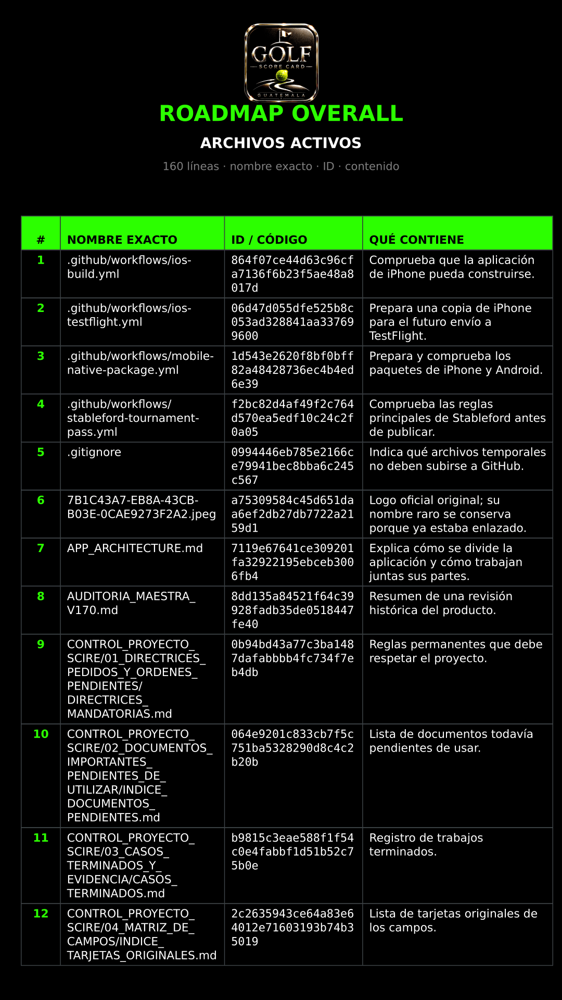
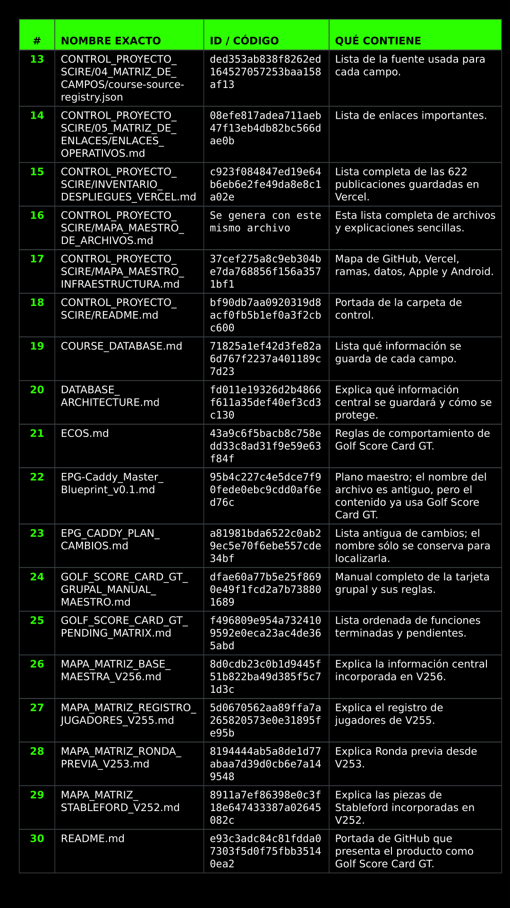
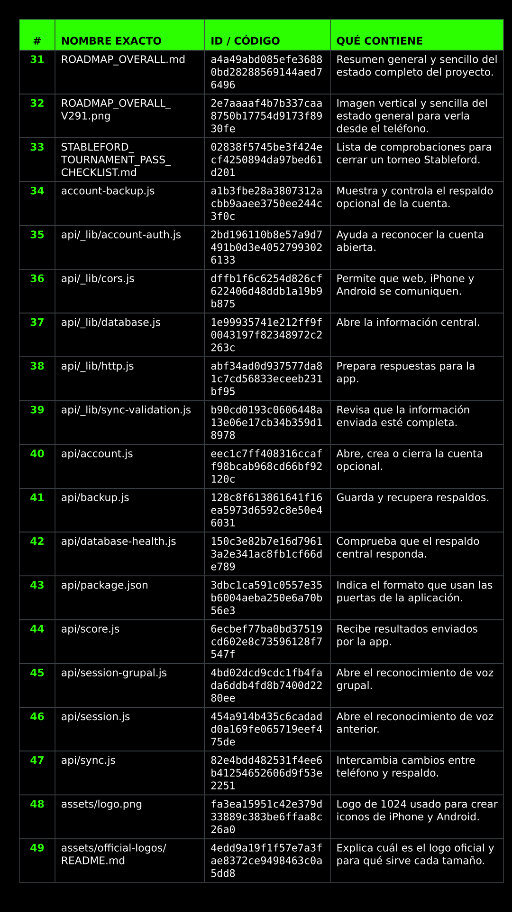
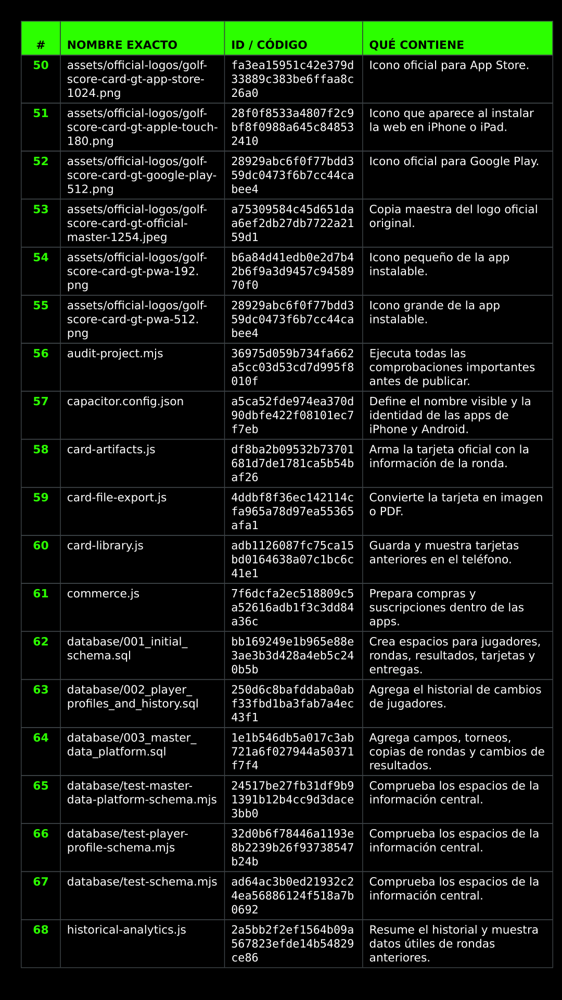
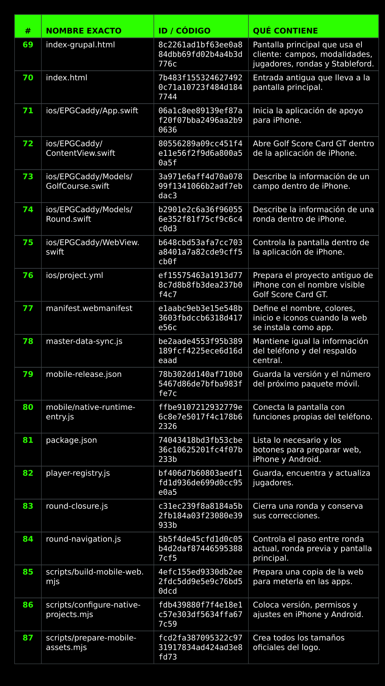
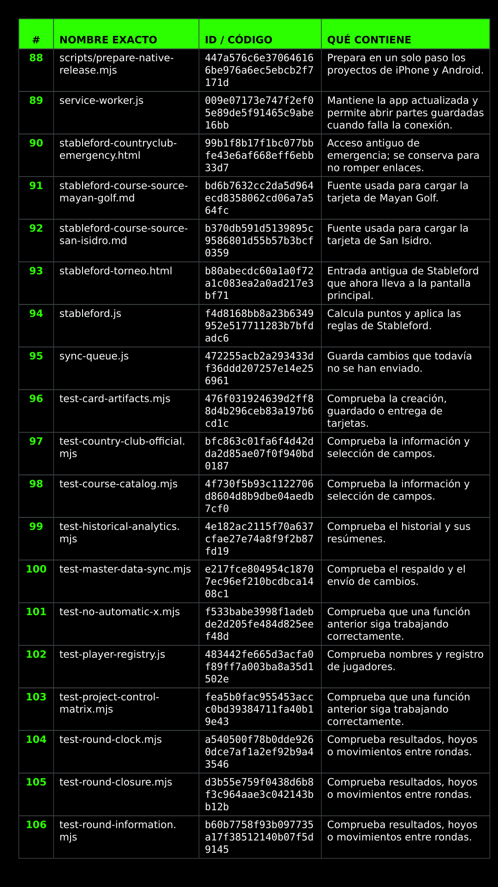
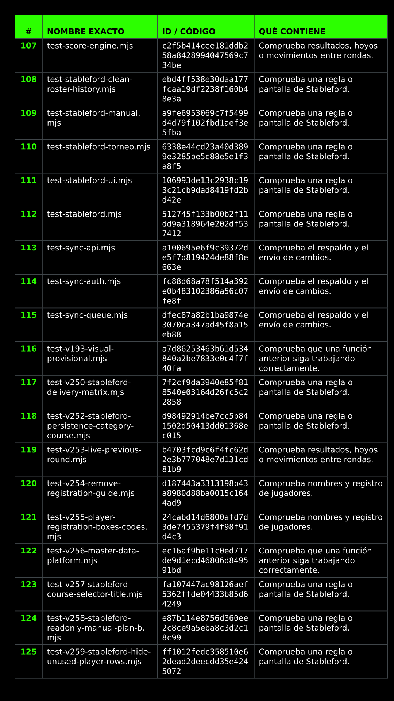
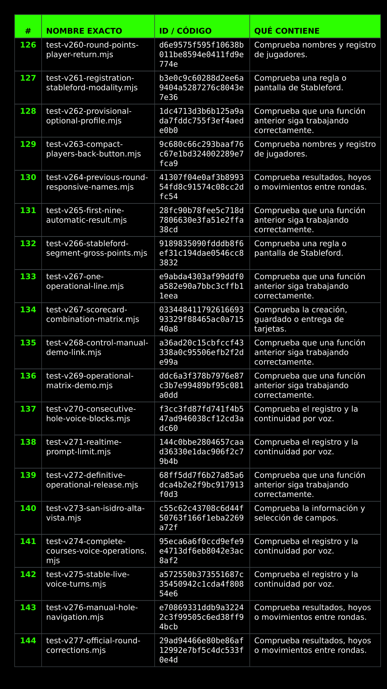
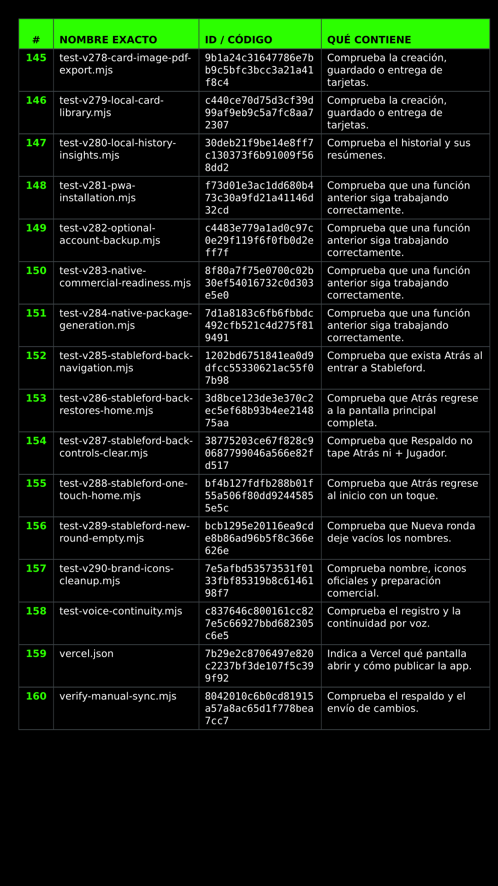

<!-- 2026-10-06 R178: ELIMINAR TORNEO usa texto rojo en ID de Torneos; ambos recorridos muestran CONFIRMA ELIMINAR antes de enviar el borrado. Verificación: test-event-administration.mjs, confirmación única y ausencia de petición previa. -->
## R178 · Locución de resultado par como EVEN · 6 de octubre de 2026

- Cuando el resultado relativo al par es cero, el audio dice “EVEN”. Las locuciones de resultados sobre y bajo el par se conservan.
- Archivos de esta corrección: `index-grupal.html`, `service-worker.js`, `test-lab-player-points-audio.mjs` y `CONTROL_PROYECTO_SCIRE/INVENTARIOS_V311.lock.json`.
- Conserva el punto de corte `línea 185` y la activación `23 de agosto de 2026, 17:05:00, hora de Guatemala`.

# ROADMAP A DETALLE

## R174 · 6 octubre 2026 · Recuperación de Scores de torneo federado en LAB

- Reproducción física desde Organizador en LAB: la ficha Santa delfina enlazó a `directory_production_36c43fd8-594e-40e3-af6d-13bfd1863f20`; el monitor quedó en `NO SE PUDO COMPROBAR TU PARTICIPACIÓN · REINTENTA` y `NINGÚN TORNEO EN CURSO`.
- Causa: `live-hub.js` esperaba que `GSCPersonalEvents.sync()` terminara correctamente antes de procesar `directoryEvent`. Un fallo de participación local abortaba el arranque aunque el torneo federado estuviera disponible.
- Corrección mínima: la sincronización local se vuelve recuperable, se continúa con la lectura de torneo federado; su vista ya no presenta el aviso de membresía local. Los grupos privados permanecen fuera del directorio público.
- R174 · regresión física del enlace directo: la selección dependía de que el ID ya estuviera en `registeredDirectory`; con directorio vacío/parcial el ID de invitación no abría Scores. `resolveDirectoryEventToken` ahora valida y resuelve el ID `directory_{lab|production}_{uuid}` aun sin entrada precargada. `npm run scores:r174-directory-gate` PASS para lista vacía, torneo listado e ID inválido. Preview y lectura de datos reales pendientes; Producción intacta. Archivos: `live-hub.js`, `test-r174-directory-event-fallback.mjs, test-r167-admin-share-feedback.mjs`.
- Regresión: `test-r174-directory-event-fallback.mjs`; ejecutar con `npm run scores:r174-directory-gate`. verifica que el rechazo de identidad no aborte y que la selección del torneo quede alcanzable. Resultado local: PASS. Producción sin cambios. Primera construcción Preview bloqueada por ROADMAP GATE: el commit del sello de inventario no incluyó ambos ROADMAPS. Este commit vuelve a registrar ambos ROADMAPS junto con los tres PDFs y su lock, regenerados después de este asiento; ROADMAP GATE e INVENTORY GATE locales pasan. Sellado regenerado desde el checkout completo y contenido final de ambos ROADMAPS. Preview y lectura real de scores siguen pendientes.

## R144 · 30 septiembre 2026, 00:42 Guatemala · acceso Neon recuperado; publicación bloqueada

- Proyecto Neon recuperado desde captura IMG/82EFA0E8: `bold-block-51864691`; get_branch confirmó main `br-late-wind-avhgi9s3`. LAB existente `br-bold-bar-avzn813n`; candidato nuevo hijo exclusivamente LAB `br-small-mouse-av0f24o9` / `lab-live-oneuse-r144-20260930`, endpoint `ep-fragrant-pine-av6xi8hy`. No escrituras en main.
- Esquema de códigos aplicado únicamente al candidato; columna mode aditiva presente. Conector Neon: ocho solicitudes simultáneas de la sentencia CTE de consumo; una inserción y siete resultados vacíos; consulta independiente sessions=1. PASS de concurrencia SQL real, no equivale a aplicación desplegada.
- `test-live-share-neon.mjs`: prueba explícita de endpoint candidato, nunca DATABASE_URL. Ejecución local hacia Neon BLOQUEADA por DNS EAI_AGAIN; verificación CTE realizada mediante conector. Suite completa remota pendiente.
- Vercel `deploy_to_vercel`: respuesta real Tool not found, aun anunciado en catálogo. Sin credencial CLI disponible. Configuración DATABASE_URL del proyecto Vercel actual no comprobada. Nueva API sigue desactivada en remoto; no entrega ni enlace nuevo ni commit de publicación. Próxima acción: habilitar vía de configuración/despliegue Vercel y verificar LAB completo.
- Archivos de recuperación: `test-live-share-neon.mjs`, `CONTROL_PROYECTO_SCIRE/EVIDENCIAS_LIVE_R144/NEON_Y_PUBLICACION.md`, `CONTROL_PROYECTO_SCIRE/EVIDENCIAS_LIVE_R144/ESTADO.md`, `CONTROL_PROYECTO_SCIRE/CONTINUIDAD_MAESTRA_LAB.md`, `CONTROL_PROYECTO_SCIRE/INVENTARIOS_V311.lock.json`, `ROADMAP_OVERALL.md`, `ROADMAP_A_DETALLE.md`.

## R144 · 29 septiembre 2026, 23:03 Guatemala · COMPARTIR LIVE de primer uso

Última orden expresa del propietario 22:35: al tocar COMPARTIR LIVE dar un código, enviarlo y quemarlo al primer uso, como Ronda Particular. Sustituye para esta operación la propuesta de verificación telefónica/aprobación del organizador. No requiere proveedor SMS, cuenta nueva ni intervención del organizador.

- `api/live-share.js`, `api/_lib/live-share.js`: endpoint separado, validación de tarjeta inscrita autenticada, código aleatorio legible 12 caracteres, hash y vencimiento, consumo/sesión en una sentencia, cookie HttpOnly/Secure, permisos de lectura, revocación y límite de intentos. No devuelve claves del escritor o viewerToken heredado; no proxy a Producción. Enlace anterior sin usar puede ser consumido por quien lo abra primero: no se afirma prueba de identidad ni control del teléfono.
- `live-share.js`: diálogo con código, enlace/mensaje preparado para WhatsApp, compartir/copia alternativos, sesión del receptor y limpieza de fragmento; X/Escape y foco conservado. No se afirma entrega del mensaje.
- `live-hub.js`, `live-hub.html`, `private-rounds.js`, `index-grupal.html`, `scores-ui.css`, `service-worker.js`, `middleware.js`: integración en ambas pantallas existentes, destino directo, invitados sin botón, favoritos propios, detalle con evento real, nulos seguros, ayuda fija. Alta/publicación oficial y accesos privados existentes conservados.
- Se retiran los cuatro archivos locales de la propuesta no conectada de verificación por teléfono: personal-access.js, personal-access-lab.sql y sus dos pruebas; historial de esta propuesta en R144 anterior ya no es requisito vigente.
- `test-live-share-postgres.mjs`, `test-live-share-handler.mjs`, `test-live-share-middleware.mjs`, `test-live-share-browser.cjs`, `scripts/live-share-test-server.mjs`, `scripts/build-manual-lab.mjs`, `package.json`: SQL real local, primer consumo único, revocación, ámbito del evento, read-only, límite de intentos, aislamiento, regresión y navegador contra API real/base local aislada. PASS; PGlite de una conexión no sustituye prueba multi-conexión Neon. Build completo PASS, capturas 390×844 revisadas.
- Evidencia versionable en `CONTROL_PROYECTO_SCIRE/EVIDENCIAS_LIVE_R144/`: sólo fixtures de prueba y log de build, sin credenciales reales.
- Pendiente exclusivo de servicio: base LAB aislada identificada/configurada y revisión de deployment real. Health del LAB publicado devuelve 401 ACCESS_REQUIRED; no se pudo comprobar aislamiento. Flag GSC_LIVE_SHARE_LAB_READY deniega antes de DDL hasta verificación. Proveedor telefónico ya no bloquea. Sin commit de entrega, push, despliegue ni escritura remota. Producción y remoto LAB R143 intactos, confirmado por git ls-remote.
- Archivos registrados: `CONTROL_PROYECTO_SCIRE/01_DIRECTRICES_PEDIDOS_Y_ORDENES_PENDIENTES/MATRIZ_LIVE_CODIGO_UN_SOLO_USO_R144.md`, `CONTROL_PROYECTO_SCIRE/01_DIRECTRICES_PEDIDOS_Y_ORDENES_PENDIENTES/PEND_LIVE_018_GOLF_SCORE_CARD_GT_LIVE.md`, `CONTROL_PROYECTO_SCIRE/01_DIRECTRICES_PEDIDOS_Y_ORDENES_PENDIENTES/REGISTRO_REINCIDENCIAS_CALIDAD.md`, `CONTROL_PROYECTO_SCIRE/CONTINUIDAD_MAESTRA_LAB.md`, `CONTROL_PROYECTO_SCIRE/EVIDENCIAS_LIVE_R144/`, `CONTROL_PROYECTO_SCIRE/INVENTARIOS_V311.lock.json`, `CONTROL_PROYECTO_SCIRE/MAPA_MAESTRO_DE_ARCHIVOS.md`, `ROADMAP_A_DETALLE.md`, `ROADMAP_OVERALL.md`, `api/_lib/live-share.js`, `api/live-share.js`, `api/live.js`, `index-grupal.html`, `live-hub.html`, `live-hub.js`, `live-share.js`, `middleware.js`, `package.json`, `private-rounds.js`, `scores-ui.css`, `scores-ui.js`, `scripts/build-manual-lab.mjs`, `scripts/live-share-test-server.mjs`, `service-worker.js`, `test-lab-global-operational-audit.mjs`, `test-lab-medal-monitor.mjs`, `test-lab-no-production-proxy.mjs`, `test-lab-r60-production-refresh.mjs`, `test-lab-shortcuts-navigation.mjs`, `test-lab-tournament-navigation.mjs`, `test-live-share-browser.cjs`, `test-live-share-handler.mjs`, `test-live-share-middleware.mjs`, `test-live-share-postgres.mjs`, `test-manual-no-assistant.mjs`, `test-private-scores-browser.cjs`, `test-scores-ui-browser.cjs`, `test-scores-ui.mjs`.

## R144 · 30 septiembre 2026 · candidato local en curso, NO entregado

- Base recuperada: LAB R143 `013f046c44bd3b793ac86c5f02abb034c589badd`; matriz aprobada `Matriz_Acceso_Ronda_y_Torneo.md`, versión 4 de Library, 30 septiembre 2026. Producción no modificada; sin push, despliegue ni migración remota.
- Scores compartido en Torneos y Ronda Particular: título 20.25 px, logo horizontal original 145 px, metadatos reales 16 px, tabla compacta, favoritos personales y detalle por doble toque con 18 G/N en dos filas de nueve. Ausentes = —; X/Escape cierran sin cambiar filtro. Búsqueda actualiza tabla; favoritos caducados se pueden quitar.
- Regresión heredada ajustada a aprobaciones vigentes (CREAR EVENTO, GENERAL/CATEGORÍA y actualización explícita), sin retirar verificaciones de cálculo, navegación o funciones retiradas. Build técnico completo repetido tras integración de cuatro regresiones nuevas: PASS.
- Revisión Firefox 390×844: GENERAL, CATEGORÍA, estrella independiente, favorito con 18 posiciones y X/Escape PASS, sin errores JS. Evidencia local temporal `/tmp/golf-mobile-detail.png`, `/tmp/golf-mobile-favorites.png`; fixture demo identificado, no datos reales. Ronda Particular revisada mediante fixture de API aislado; no equivale a prueba de backend real.
- API LAB sin DATABASE_URL falla cerrada y no usa proxy a Producción; prueba de cero llamadas upstream PASS.
- Base de permisos personales y esquema SQL preparados, NO conectados ni aplicados: roles, caducidad, revocación, cookie HttpOnly, hashes, consumo en una sentencia CTE. Test unitario valida contrato SQL, NO certifica concurrencia real.
- Bloqueo preciso: la matriz deja pendiente selección/configuración del proveedor de verificación telefónica. No existe prueba de control del teléfono implementada, ni se ha verificado una base LAB aislada para estas tablas. Conector Neon no está asociado a un proyecto: list_branches exige project_id; repositorio/mapa no lo documentan y no hay NEON_API_KEY ni VERCEL_TOKEN local. NO activar códigos personales, sesiones, permisos o compartir LIVE como completos; el flujo heredado sigue activo en LAB remoto R143.
- Pendientes obligatorios: proveedor y prueba real, integración server/client de autorizaciones y enlace LIVE sin bearer compartido, restricción de compartir a inscritos, concurrencia y regresión end-to-end contra base LAB aislada; luego build/gates/revisión visual integral, commit y despliegue exclusivamente LAB. Sin certificación integral ni nueva entrega.
- Archivos del bloque: `scores-ui.js`, `scores-ui.css`, `index-grupal.html`, `live-hub.html`, `live-hub.js`, `private-rounds.js`, `service-worker.js`, `api/live.js`, `api/_lib/personal-access.js`, `sql/personal-access-lab.sql`, `test-scores-ui.mjs`, `test-scores-ui-browser.cjs`, `test-personal-access.mjs`, `test-lab-no-production-proxy.mjs`, `test-lab-private-rounds.mjs`, `scripts/build-manual-lab.mjs`, `test-lab-medal-monitor.mjs`, `test-lab-r60-production-refresh.mjs`, `test-manual-no-assistant.mjs`, `test-lab-tournament-navigation.mjs`, `test-lab-shortcuts-navigation.mjs`, `test-lab-global-operational-audit.mjs`, `CONTROL_PROYECTO_SCIRE/MAPA_MAESTRO_DE_ARCHIVOS.md`, `CONTROL_PROYECTO_SCIRE/CONTINUIDAD_MAESTRA_LAB.md`, `CONTROL_PROYECTO_SCIRE/INVENTARIOS_V311.lock.json`.

## R140 · 29 septiembre 2026 · nombres limpios en Ronda Particular

- `private-rounds.js`: cada fila muestra sólo el nombre del jugador; se retira el texto SCORES ACTUALIZADOS. El mensaje compartido contiene únicamente Ronda [nombre] y el código en la segunda línea, sin etiqueta. Se conservan columnas, cálculo, refresco automático y diseño.
- `live-hub.html`: botones TORNEOS REGISTRADOS y RONDAS PARTICULARES con la misma clase, tamaño y fuente; cada botón abre su lista. Se retira ELIGE UN TORNEO · PUEDES GUARDAR HASTA 5 y CREAR RONDA PRIVADA de Torneos; la creación sigue en la tarjeta.
- Corrección basada en capturas IMG_5319/IMG_5322; release y caché R140 para entregar la misma corrección en iPhone. Prueba dirigida de rondas particulares y matriz de release. Rollback LAB R139 dpl_9eTW16V8vUB5gU8fHGNF5ndcTJP9.

## R139 · 29 septiembre 2026 · Ronda Particular con nombre, código y grupos

- Alcance exclusivo: MI RONDA → RONDA PARTICULAR; creación por nombre y código compartible; RONDAS PARTICULARES en Torneos con lista, selección y código obligatorio. Se conservan diseño, botones y funciones existentes.
- `private-rounds.js`: diálogo de creación, código, ingreso y tabla Nombre | HDCP | Hoyo | Gross | Neto | +/−; actualización cada 10 segundos. +/− es neto contra par de los hoyos jugados; 79 − 14 = 65, contra par 72 resulta −7.
- `api/live.js`: tablas independientes `live_private_rounds`, `live_private_streams`, `live_private_events`, inicialización aditiva desde esquema LIVE vigente; código verificado para la ronda seleccionada, secretos sólo después de validación. Torneos, incluidos clientes anteriores, no pueden listar ni unir esas rondas.
- `live-control.js`: pertenencia y cola privateStream separadas; escritor oficial publica cambios y correcciones sin sustituir el LIVE existente; reintento online y conflicto de revisión. Creador sin tarjeta iniciada se conecta al persistir el Registro.
- Evidencia: `test-lab-private-rounds.mjs`, diálogo existente, recuperación de actualización y matriz de release. Pruebas antiguas V352/V353 fallan en supuestos previos (middleware idéntico a HEAD y fixture demo renombrado); no se declara PASS integral. Navegador local no disponible; comprobación en despliegue pendiente.
- Rollback: LAB R138 `dpl_6XBceK6sXkEqW3K94GynTNfKjJWq`, remoto `6c41fd91ce52cb9a79a86fae72ce25ecfc6235b2`; tablas nuevas no alteran datos anteriores. Maestro `epg-caddy` intacto.

## R136 · 29 septiembre 2026 · acciones de CREAR EVENTO y Registro

- `index-grupal.html`: cambia el rótulo `EVENTO` por `CREAR EVENTO`, retira el acceso y handler de RONDA PREVIA del Registro general, elimina `+ JUGADOR` y su ruta de altas posteriores; el editor sólo expone la cantidad de jugadores ya registrados y rechaza altas por dictado. La captura normal de jugadores al iniciar una ronda se conserva.
- `live-hub.js`: al abrir el portal de Torneos, limpia el estado operativo en vez de emitir `ELIGE UNA FUNCIÓN O UN TORNEO`; se conservan torneos y acciones de resultados.
- `test-lab-tournament-navigation.mjs`: valida que la función operativa del portal no emita el mensaje eliminado.
- `release.json` y la cabecera de `index-grupal.html`: identifican R136.
- `test-lab-round-create-modal.mjs`, `test-v263-compact-players-back-button.mjs`, `test-v253-live-previous-round.mjs`, `test-v304-homogeneous-registration-actions.mjs`: cubren rótulo, ausencia de controles y handlers de alta, protección por voz, retorno ATRÁS e historial conservado.
- Archivos de control: ambos ROADMAPS, `CONTROL_PROYECTO_SCIRE/MAPA_MAESTRO_DE_ARCHIVOS.md`, `CONTROL_PROYECTO_SCIRE/01_DIRECTRICES_PEDIDOS_Y_ORDENES_PENDIENTES/PEND_LIVE_018_GOLF_SCORE_CARD_GT_LIVE.md` e `INVENTARIOS_V311.lock.json`.
- Estado: pruebas dirigidas, build integral LAB, calidad, ROADMAP e inventario PASS. Revisión visual en navegador y Preview pendientes. Producción intacta.

## R135 · 29 septiembre 2026 · compatibilidad al vincular Friends

- `live-hub.js`: conserva en la selección del evento el código de unión devuelto por LIVE, además del ID.
- `live-control.js`: conecta por ID cuando el servidor admite la acción; ante acción no soportada/404, reintenta por código con `join_tournament`. Conserva los reintentos, no sustituye el escritor oficial de Score y publica el roster registrado al guardar la ronda.
- `api/live.js`: incluye `join_tournament_by_id` en la lista de acciones que requieren origen autorizado de la app.
- `index-grupal.html` y `release.json`: identifican el shell LAB como R135.
- `test-lab-round-create-modal.mjs`: cubre el código persistido, la alternativa compatible, la validación de origen y el reintento.
- Archivos modificados: `api/live.js`, `index-grupal.html`, `live-control.js`, `live-hub.js`, `release.json`, `test-lab-round-create-modal.mjs`, ambos ROADMAPS, `CONTROL_PROYECTO_SCIRE/MAPA_MAESTRO_DE_ARCHIVOS.md`, `CONTROL_PROYECTO_SCIRE/01_DIRECTRICES_PEDIDOS_Y_ORDENES_PENDIENTES/PEND_LIVE_018_GOLF_SCORE_CARD_GT_LIVE.md`, `CONTROL_PROYECTO_SCIRE/01_DIRECTRICES_PEDIDOS_Y_ORDENES_PENDIENTES/REGISTRO_REINCIDENCIAS_CALIDAD.md` e inventario LAB.
- PASS: prueba Friends, navegación TORNEOS, release, calidad, ROADMAP e inventario. Build integral LAB PASS. Revisión automática de navegador/recorrido real sigue pendiente al publicar Preview. Producción intacta.

## R133 · 29 septiembre 2026 · conservar jugadores al crear ronda Friends

- `live-hub.js`: después de guardar el nombre del evento, navega a `manual_action=friends-round`; no usa la acción estándar `setup`, que borra el borrador y la tarjeta recuperada.
- index-grupal.html: la ruta Friends espera al enrutador de Registro sin disparar el borrado automático. openFriendsRoundDraft precarga los jugadores del borrador o, en su ausencia, de la tarjeta activa o el archivo más reciente; conserva hándicap, categoría, marcas y contacto, y deja vacíos los scores del nuevo juego. El scorecard anterior permanece guardado hasta confirmar INICIAR RONDA.
- `test-lab-round-create-modal.mjs`: valida la ruta no destructiva, fuente de roster y protección contra el inicio automático que borraba jugadores.
- Release `LABORATORIO-20260929-R133`. Cambios en `live-hub.js`, `index-grupal.html`, prueba focalizada, `release.json`, ambos ROADMAPS, registro de reincidencias e inventario. Producción intacta. Preview y pruebas de recorrido pendientes.

## R132 · 28 septiembre 2026 · conexión de Friends y lista directa

- `live-control.js`: al persistir una ronda configurada, conecta la tarjeta al torneo que quedó seleccionado al crear Friends. Crea el stream inicial con todos los jugadores registrados y conserva el grupo para seguir publicando cambios; el reintento vuelve a activarse al recuperar conexión.
- `live-hub.js`: reconoce los torneos creados como ronda de grupo, conserva el monitor general existente para torneos normales y muestra `NOMBRE · HDCP · HOYO · GROSS · NETO · +/-`, ordenado por score y después por hoyo actual más avanzado.
- `live-hub.html`: oculta filtros, paneles y opciones sólo durante la vista compacta de Friends y deja la lista de jugadores como contenido principal, con tipografía compartida con las tarjetas y texto en mayúsculas.
- `index-grupal.html` y `release.json`: versión identificable R132 para invalidar el shell anterior y permitir probar el recorrido actualizado.
- `test-lab-round-create-modal.mjs`: añade regresión de conexión automática, memoria de la ronda conectada, presentación Friends y orden score/hoyo; permanece integrado en el build LAB.
- `test-lab-medal-monitor.mjs`: el fixture aislado declara que su torneo estándar no es una ronda Friends y conserva las aserciones de columnas del monitor general.
- Incidencia registrada en `CONTROL_PROYECTO_SCIRE/01_DIRECTRICES_PEDIDOS_Y_ORDENES_PENDIENTES/REGISTRO_REINCIDENCIAS_CALIDAD.md`. Inventario vuelve a sellarse en `CONTROL_PROYECTO_SCIRE/INVENTARIOS_V311.lock.json`.
- Estado: regresiones focalizadas, build integral LAB y gates de calidad/release/ROADMAP/inventario PASS. Deployment Preview y recorrido real completo Score→Friends→Score pendientes. Producción sin cambios.

## R131 · 28 septiembre 2026 · alta de ronda desde TORNEOS

- `live-hub.html`: el botón `CREAR RONDA` abre un diálogo modal con nombre y `OK`; permanece cerrado hasta que se solicita y ofrece cierre explícito.
- `live-hub.js`: valida nombre y cupo antes de crear; guarda el torneo activo y las credenciales de organización para que se puedan incorporar grupos; `OK` cierra el diálogo y abre el Registro de Score existente con el torneo seleccionado. Los errores 42703 y de configuración faltante se muestran con diagnóstico claro.
- `test-lab-round-create-modal.mjs`: protege diálogo bajo demanda, nombre obligatorio, límite de cinco, error de esquema, selección del torneo y salto al Registro. Se integra a `scripts/build-manual-lab.mjs`.
- `test-lab-update-recovery.mjs`: añade el stub ausente `fetchPublishedRelease` a su contexto aislado de prueba; corrige el bloqueo heredado del build sin cambiar el Service Worker ni la app.
- `test-lab-r60-production-refresh.mjs` y `test-manual-no-assistant.mjs`: comparan `index-grupal.html` con `release.json` actual y validan el mecanismo de actualización del Service Worker, sin exigir el número histórico R128.20.
- `test-lab-shortcuts-navigation.mjs`: valida `EVENTO`→TORNEOS como acceso desde Inicio, sin agregar un segundo botón.
- `test-lab-global-operational-audit.mjs`: sustituye la expectativa obsoleta `CENTRO DE TORNEOS` por la acción `EVENTO`→TORNEOS; el build LAB completo vuelve a validar la pantalla de Inicio sin requerir controles adicionales.
- `index-grupal.html` y `release.json`: R131; el botón `EVENTO` existente en Inicio lleva a TORNEOS tras persistir el borrador, donde está el único control que abre la ventana de nombre.
- La migración `database/005_live_tournament_mode.sql` (`8b5d6fc9-33fd-4bec-8a54-b244bcfa57a6`) se preparó y probó en Neon temporal `br-withered-cell-av876aco`; una inserción sintética devolvió `mode=general`, `status=active`, revisión 0. Parent compartido: `br-late-wind-avhgi9s3`. La tabla compartida carece de `mode`, causa confirmada del 503/42703. Neon MCP exige aprobación antes de aplicar a main.
- `CONTROL_PROYECTO_SCIRE/INVENTARIOS_V311.lock.json`: regenerado con los tres inventarios PDF para sellar el árbol actualizado de Laboratorio.
- Producción web permanece intacta. La migración compartida y revisión de navegador LAB están pendientes.

## LAB 20-sep-2026 · saneamiento del gate ROADMAP contra contratos retirados

El workflow obligatorio aún ejecutaba `test-v357-synchronized-progressive-voice.mjs` y otros bancos V354–V362 que importan `api/voice-health.js` y validan reconocimiento/dictado ya retirado por el perfil LAB actual. Esa discrepancia hacía fallar el gate aun cuando el build vigente ya certificaba expresamente que no existen entradas de micrófono/AI y que la voz local de resultados permanece.

Se sustituye ese bloque obsoleto por `node scripts/build-manual-lab.mjs`, que es el perfil técnico vigente y ejecuta los contratos actuales: ausencia de micrófono/AI, voz local, motor Gross/Neto/HCP, cierres, registro, Stableford, General, Match Play, Four Ball, Skins, cuenta, atajos, navegación, artefactos, torneos, auditoría operacional y paridad manual/pantallas. No se modifica ninguna función de producción.

Archivos exactos: `.github/workflows/roadmap-gate.yml`, `ROADMAP_OVERALL.md` y `ROADMAP_A_DETALLE.md`.

## LAB 20-sep-2026 · modalidad editable durante ronda con scores

Defecto físico reportado: al intentar cambiar modalidad después de haber registrado uno o más scores, `canChangeConfiguredRoundMode()` devolvía `false` y obligaba a iniciar una nueva ronda. Ese comportamiento no corresponde al flujo requerido.

`index-grupal.html` conserva `roundHasRecordedScores()` únicamente para informar que existen scores, pero `canChangeConfiguredRoundMode()` permite continuar. Durante edición, `startConfirmedRound()` reconstruye jugadores preservando `old?.holes`, recalcula los valores derivados y después persiste `round.mode=draftRoundMode`; por tanto el cambio de modalidad no elimina los scores ya capturados.

`test-lab-edit-round-mode.mjs` queda alineado con el contrato actual: exige el mensaje `MODALIDAD EDITABLE · LOS SCORES EXISTENTES SE CONSERVAN`, rechaza el texto anterior que obligaba a nueva ronda y verifica que la modalidad seleccionada se persista. Se mantienen las restricciones de cantidad de jugadores propias de Match Play, Four Ball, Universales y juegos laterales.

Archivos exactos del cambio funcional/QA: `index-grupal.html`, `test-lab-edit-round-mode.mjs`, `ROADMAP_OVERALL.md` y `ROADMAP_A_DETALLE.md`. Producción no se modifica.

## V407-R29 · corrección directa de ENVIAR TARJETA DIGITAL · 12 de septiembre de 2026

La captura física `IMG_3615.png` demuestra que `FINALIZAR RONDA` habilita correctamente `ENVIAR TARJETA DIGITAL`, pero el segundo toque no abre ninguna opción. La función anterior ejecutaba `await GSCCardFileExport.png(item)` antes de `navigator.share(payload)`. Safari exige que `navigator.share` empiece mientras sigue vigente la activación transitoria del toque; la generación asíncrona la consumía. El `catch` escribía el diagnóstico en `artifactShareStatus`, ubicado dentro de `artifactActions hidden`, de modo que el usuario tampoco veía el fallo.

`index-grupal.html` prepara el PNG inmediatamente después del cierre oficial, deshabilita el botón únicamente durante esa preparación y muestra `TARJETA LISTA PARA ENVIAR`. El siguiente toque crea el `File` desde el Blob almacenado y llama a `navigator.share` sin ninguna espera previa. El estado se mueve fuera del panel oculto y expone cancelación o fallo real. El cambio no modifica scores, cálculo Universales, cierre, Historial, micrófono, AI ni datos de la ronda.

`test-v397-card-in-out-back-contract.mjs` construye una Tarjeta Global Universales de cuatro jugadores, ejecuta la función en un entorno controlado y rechaza cualquier implementación que llame a compartir después de perder la activación. Release/caché avanzan a `V407-R29-DIGITAL-CARD-SHARE-20260913`. Estado automático dirigido PASS; queda pendiente Preview y recorrido físico en iPhone.

Archivos exactos: `index-grupal.html`, `service-worker.js`, `test-v397-card-in-out-back-contract.mjs`, `test-v365-active-round-empty-recovery.mjs`, `test-v406-r2-professional-design.mjs`, `test-v406-r23-visible-version.mjs`, `test-v406-r4-mobile-controls.mjs`, `test-v406-r5-simple-tournament-live.mjs`, `test-v407-r1-premium-visual-system.mjs`, `test-v407-r25-round-controls.mjs`, `test-v407-r7-ios-scroll.mjs`, `test-v407-r9-manual-update.mjs`, `CONTROL_PROYECTO_SCIRE/CONTINUIDAD_MAESTRA_LAB.md`, `CONTROL_PROYECTO_SCIRE/INVENTARIOS_V311.lock.json`, `CONTROL_PROYECTO_SCIRE/01_DIRECTRICES_PEDIDOS_Y_ORDENES_PENDIENTES/REGISTRO_REINCIDENCIAS_CALIDAD.md`, `ROADMAP_OVERALL.md` y `ROADMAP_A_DETALLE.md`.

## V407-R24D LAB · service worker recuperable y control sin traslape · 9 de septiembre de 2026

La verificación pública demostró que `/service-worker.js` y ambos manifiestos recibían el HTML de acceso con estado 200. Una instalación R8 no podía descargar el worker nuevo; por eso ACTUALIZAR quedaba sin acción aunque el alias ya tuviera un deployment posterior. `middleware.js` permite exclusivamente estos recursos PWA de arranque y mantiene privados `index-grupal.html`, datos y escrituras.

La captura física de Control Manual mostró `ACTUALIZADO` sobre el título Universales al desplazarse. La regla `.mandatory-update:not(.available){position:absolute}` vive en `gsc-design-system.css`: el estado inactivo permanece en la cabecera y sale con el scroll; el estado `.available` sigue fijo, verde, habilitado y pulsante. La identidad R24C se conserva; el worker R8 detecta el `service-worker.js` R24C en cuanto el middleware deja de sustituirlo.

Los controles automáticos se integran en `package.json`, `audit-project.mjs`, `test-v407-r24c-public-pwa-bootstrap.mjs`, `test-v407-r24c-update-scroll-isolation.mjs` y la regresión de acceso R18. Requiere despliegue LAB y revisión automatizada en navegador real; no constituye revisión física. MAIN permanece intacta.

Continuidad 10 de septiembre de 2026: `scripts/rebuild-inventory-pdfs.py` regenera los tres PDF y `CONTROL_PROYECTO_SCIRE/INVENTARIOS_V311.lock.json` vuelve a sellar 450 fuentes desde el árbol limpio `a2d1d9a5ebdd36435daed6c34a0c8ff61561612a`. Este resello no modifica funciones, HTML ni MAIN.

## V407-R24 LAB · registro WhatsApp privado, archivo y botones móviles · 9 de septiembre de 2026

`index-grupal.html` agrega a cada jugador de Registro General y Stableford un WhatsApp opcional. Guatemala aparece como `🇬🇹 +502`; el código admite edición internacional. El número se normaliza y guarda en el perfil para rondas posteriores, pero queda excluido de LIVE y de los artefactos digitales compartidos.

El flujo único queda sellado así: `FINALIZAR RONDA` genera y archiva la tarjeta oficial antes de habilitar `ENVIAR TARJETA DIGITAL`; `NUEVA RONDA` persiste y archiva la tarjeta anterior, elimina sólo las claves activas y abre jugadores/scores en blanco. Aplica a General, Match Play, Four Ball, Universales y Stableford. Además, `ACTUALIZADO` se oculta mientras cualquier overlay está visible para impedir el traslape observado sobre `ATRÁS`.

Pruebas directas actualizadas: V255/V261 para registro y WhatsApp; `test-v252-stableford-persistence-category-course.mjs`, `test-v260-round-points-player-return.mjs` y `test-stableford-ui.mjs` para la entrada Stableford enriquecida; V364/V289 para nueva ronda vacía con historial; V352 para privacidad LIVE; V397 para tarjeta oficial; y V365/V405/V407-R1 para controles móviles sin superposición. Rama exclusiva `lab/v407-r24-whatsapp-registration`; Main no se modifica.

Control de publicación: los dos ROADMAPS y `CONTROL_PROYECTO_SCIRE/INVENTARIOS_V311.lock.json` se guardan juntos y se calculan desde el árbol remoto LAB de 444 fuentes.

Compatibilidad: si un recorrido anterior de Stableford entrega únicamente `names`, se crean entradas con `+502` y WhatsApp vacío; el campo continúa siendo opcional y el inicio de ronda no arroja error.

Corrección física móvil: la fila WhatsApp abarca las tres columnas del jugador, conserva `🇬🇹 +502` a la izquierda y asigna al número un mínimo de 180 px para evitar el campo comprimido observado.

# V407-R23B · frontera pública mínima para LIVE · 9 de septiembre de 2026

El enlace físico `live.html#stream=…` llegaba al formulario propietario porque el fragmento nunca viaja al servidor y `middleware.js` bloqueaba el HTML antes de que `live-view.js` pudiera leer el token. Se habilitan solamente el documento y sus dos scripts de visualización. En `/api/live`, el middleware inspecciona una copia del POST y permite únicamente `action=read`; crear, publicar, unir y revocar siguen requiriendo el acceso normal. La propia API conserva la validación criptográfica del token, caducidad, revocación y rate limit. No cambian Score Card, ACTUALIZAR, invitación 24 h, WhatsApp, voz, Support ni cálculos.

Control permanente: `test-v352-live.mjs` exige los tres recursos públicos, la excepción precisa de lectura y prohíbe incluir `/api/live` completo en `PUBLIC_PATHS`.

## V407-R23 · LIVE de un toque y enlace 24 h compatible con WhatsApp · 9 de septiembre de 2026

Dos rechazos físicos cierran el alcance: Kathy recibió el dominio sin un token utilizable y vio `ENTRAR COMO PROPIETARIO`; desde la Score Card, LIVE seguía abriendo una segunda pantalla. `api/app-access.js` emite ahora `/access.html?invite=TOKEN`. `index-grupal.html` integra esa URL completa dentro del texto entregado a `navigator.share`, evitando que WhatsApp omita el campo URL o el fragmento. `access.html` valida el query o el fragmento legado, lo retira del navegador y ejecuta únicamente POST contra `action=redeem`; los robots GET no pueden consumir el token.

`live-control.js` usa el mismo `currentSnapshot()` para cualquier ronda y, si existe, llama directamente `quickShareGroup()`. Esa función crea o reutiliza el LIVE privado del grupo completo por 24 horas y abre en el mismo gesto la hoja nativa de compartir; el overlay administrativo queda disponible sólo cuando no hay ronda activa. General, Universales, Stableford, Match Play y Four Ball comparten el mismo recorrido.

Pruebas preventivas: `test-r18-owner-guest-24h-access.mjs` exige query transportable, texto con URL, compatibilidad legada y POST; `test-v406-r5-simple-tournament-live.mjs` exige compartir directo sin pantalla intermedia. Regresiones V352, V353, categorías, Universales y compartir grupo permanecen obligatorias. Release/caché: `V407-R23-DIRECT-SHARE-20260909` / `v407-r23-direct-share`.

## V407-R22 · navegación LIVE permanente desde ronda activa · 9 de septiembre de 2026

Publicación: commit GitHub `90c25514a83b5c407e00ecc4f02ad4f2c9de3ef8`; Preview `dpl_5NDZRiES2geCbDobhPPaPedBkyFH` READY; Producción `dpl_3T4Fu3Y59uzUzUXytU5FGn5b7ka2` READY. El dominio oficial conserva el middleware privado y redirige visitantes sin sesión a `access.html`. Rollback exacto: commit `1ad4197bc5f2f8a923b94f3f5eac4a562ccfaafe`.

Defecto físico reproducido en `IMG_3263.png` y `IMG_3264.png`: desde una tarjeta activa en hoyo 7, la tecla superior LIVE mostraba primero el menú público `VER TORNEO LIVE`, ocultando los controles de la propia ronda. La causa estaba en el manejador común `gscLiveLaunch`, que abría el overlay sin evaluar `currentSnapshot()`.

`live-control.js` asigna `liveViewerSection` al visor público y, al abrir LIVE, calcula exclusivamente `hasRound=!!currentSnapshot()`: con ronda activa oculta el visor general y despliega `liveOrganizerPanel`; sin ronda conserva el Centro LIVE. La condición es independiente de nombre, campo, jugadores, hoyo y modalidad, por lo que cubre General, Universales, Stableford, Match Play y Four Ball actuales y futuros. ATRÁS conserva el cierre del overlay y la Score Card subyacente no se desmonta.

`test-v406-r5-simple-tournament-live.mjs` exige detección genérica de ronda, ocultamiento del menú público, despliegue directo de controles y presencia de las cinco modalidades. Regresión: V352 LIVE, V353 Centro, V406 categorías, V407 Universales y V406-R22 compartir grupo. `index-grupal.html`, `service-worker.js` y sus bancos de identidad avanzan a `V407-R22-ACTIVE-ROUND-LIVE-20260909` para entregar el JavaScript nuevo sin cambiar la implementación de ACTUALIZAR.

## R18-LAB · acceso propietario temporal de 24 horas · 8 de septiembre de 2026

- `api/_lib/app-access.js`: crea tokens opacos aleatorios de 32 bytes, guarda únicamente SHA-256, valida 24 horas exactas, revoca por propietario y conserva feedback agregado sin nombres ni identidad. Elimina cada acceso y su bitácora mediante una purga horaria programada desde las 47 horas para no superar 48 horas.
- `api/app-access.js`: expone canje, estado, creación, revocación, salida, feedback anónimo, reporte exclusivo del propietario y limpieza autenticada por `CRON_SECRET`.
- `middleware.js`: cierra la aplicación pública, bloquea cuenta, respaldo, sincronización, comercio y administración para invitados, y rechaza tokens vencidos o revocados.
- `access.html`: permite únicamente a la cuenta propietaria abrir la aplicación, crear/revocar el enlace y consultar actividad anónima.
- `index-grupal.html`: separa el almacenamiento local del invitado, informa la bitácora temporal, impide instalación offline, comprueba acceso cada 15 segundos y reporta sólo modalidad, cantidad de jugadores, hoyos usados y número de anotaciones.
- `guest-access.js`: instala antes de los módulos funcionales el almacenamiento aislado y el aviso de privacidad sin alterar los motores de la aplicación.
- `package.json`: incorpora `@vercel/functions` para el middleware oficial.
- `vercel.json`: programa la eliminación horaria; el umbral de 47 horas garantiza borrado antes del máximo de 48.
- `test-r18-owner-guest-24h-access.mjs`: bloquea regresiones de propiedad, token, cookie, vencimiento, revocación, privacidad, rutas prohibidas, feedback y purga.
- `audit-project.mjs`: incorpora el banco específico a la auditoría integral.
- `scripts/rebuild-inventory-pdfs.py`: identifica los tres inventarios con el corte real R18-LAB y elimina metadata heredada V367/V371.
- Estado: implementación y banco dirigido PASS en copia LAB aislada; identidad exacta `EPG_OWNER_USER_ID`/alternativa configurada, Preview y pruebas físicas propietario/invitado/expiración/revocación permanecen bloqueantes. MAIN y Producción intactas.

## V407-R10 · activación permanente del botón · 8 de septiembre de 2026

`index-grupal.html` cambia únicamente el estado operativo de `mandatoryUpdateButton`: `showCurrentBuild()` conserva `ACTUALIZADO` y retira `disabled`; el toque reutiliza `installMandatoryUpdate()` para guardar y recargar el shell. `service-worker.js` avanza release/caché a R10. Pruebas de versión sincronizadas. Sin cambios gráficos ni funcionales fuera del actualizador; MAIN intacta.

## V407-R9 · botón ACTUALIZAR sustituye realmente el shell · 8 de septiembre de 2026

`index-grupal.html` avanza a `V407-R9-MANUAL-UPDATE-20260908`, presenta `ACTUALIZADO` oscuro cuando el release publicado coincide y activa `ACTUALIZAR` sólo ante una identidad diferente. `installMandatoryUpdate()` ejecuta `persist()`, desregistra los service workers del mismo origen, elimina únicamente cachés con prefijo `gscg-mobile-` y recarga el mismo URL con `app_version` y `update_check`; no elimina `localStorage`, jugadores, scores ni Historial.

`service-worker.js` avanza a `v407-r9-manual-update`; su evento `activate` asegura el shell aprobado y toma control, pero no promueve ni navega automáticamente. `test-v407-r9-manual-update.mjs` sella el flujo y se incorpora a `audit-project.mjs`. Los bancos de versión V365/V406/V407 se sincronizan. Trazabilidad: continuidad, RC-088 y ambos ROADMAPS. Rollback: commit remoto R8 `bc86bd2`; MAIN intacta.

## V407-R8 · un solo scroll iPhone y actualización siempre verificable · 8 de septiembre de 2026

Compatibilidad del acceso instalado: el proyecto Vercel `golf-sc-gt-lab` sirve como espejo del canónico `epg-caddy.vercel.app`. `vercel.legacy-mirror.json` fija las reescrituras y prohíbe cachear HTML o `service-worker.js`, de modo que R6 puede detectar y recibir R8 desde el mismo icono del iPhone.

`#setupOverlay.visible` deja `position:fixed` y el desplazamiento anidado; dentro de `gsc-setup-open` pasa a `position:relative`, altura por contenido y `overflow:visible`. `main` se oculta durante ese registro para que el documento tenga una sola superficie desplazable. `recoverInstalledAppScrolling()` excluye expresamente `setupOverlay` de la mutación inline de altura/overflow.

El control de versión nace como `mandatory-update available`, habilitado, con texto `ACTUALIZAR`; el toque añade `app_version` y `update_check` para forzar promoción/verificación de caché preservando la ronda. Release y caché: `V407-R8-SINGLE-SCROLL-20260908` / `v407-r8-single-scroll`.

Puente para instalaciones atrapadas: al activarse, el service worker promueve R8 y navega solamente la ventana iPhone activa cuando su `app_version` es distinta. Así V407-R6 deja de depender del detector que permaneció gris en `IMG_3136.jpeg`, sin recargar múltiples ventanas ni congelar el scroll.

Archivos: `index-grupal.html`, `service-worker.js`, `test-v407-r7-ios-scroll.mjs`, `test-v365-active-round-empty-recovery.mjs`, `test-v406-r2-professional-design.mjs`, `test-v406-r23-visible-version.mjs`, `test-v406-r4-mobile-controls.mjs`, `test-v406-r5-simple-tournament-live.mjs`, `test-v407-r1-premium-visual-system.mjs`, `CONTROL_PROYECTO_SCIRE/01_DIRECTRICES_PEDIDOS_Y_ORDENES_PENDIENTES/REGISTRO_REINCIDENCIAS_CALIDAD.md`, `CONTROL_PROYECTO_SCIRE/INVENTARIOS_V311.lock.json`, `ROADMAP_OVERALL.md` y `ROADMAP_A_DETALLE.md`.

## V407-R7 · scroll iPhone y actualización visible · 8 de septiembre de 2026

Archivos: `index-grupal.html`, `service-worker.js`, `audit-project.mjs`, `test-v407-r7-ios-scroll.mjs`, `test-v406-r4-mobile-controls.mjs`, `test-v406-r2-professional-design.mjs`, `test-v407-r1-premium-visual-system.mjs`, `test-v406-r5-simple-tournament-live.mjs`, `test-v261-registration-stableford-modality.mjs`, `test-v329-skins.mjs`, `test-v330-side-games.mjs`, `test-v406-r23-visible-version.mjs`, `test-v365-active-round-empty-recovery.mjs`, `CONTROL_PROYECTO_SCIRE/01_DIRECTRICES_PEDIDOS_Y_ORDENES_PENDIENTES/REGISTRO_REINCIDENCIAS_CALIDAD.md`, `CONTROL_PROYECTO_SCIRE/INVENTARIOS_V311.lock.json`, `ROADMAP_OVERALL.md` y `ROADMAP_A_DETALLE.md`. Elimina el listener `touchstart` que recalculaba layout durante el gesto; los overlays usan un scroller `100dvh` independiente y la página conserva desplazamiento vertical nativo. Release/caché pasan a V407-R7 para activar la actualización desde el mismo enlace instalado.

Se incorpora el commit concurrente `39bb130e1cddd22d5f9d2c70ea07f26144ad3bd5`: elimina la división visual entre modalidades existentes/nuevos juegos, conserva una sola matriz bajo `MODALIDADES` y renombra la acción a `COMPARTE LIVE`.

El candado `test-v407-r7-ios-scroll.mjs` rechaza cualquier regreso de la mutación por `touchstart`.

## V407-R6 PRODUCCIÓN · enlace estable y actualización instalada · 8 de septiembre de 2026

Archivos de control modificados: `ROADMAP_OVERALL.md`, `ROADMAP_A_DETALLE.md` y `CONTROL_PROYECTO_SCIRE/INVENTARIOS_V311.lock.json`. El mismo árbol funcional y visual V407-R6 aprobado en Preview pasa a Producción; `gscg-release` y `service-worker.js` permiten que una instalación V406-R24 detecte la publicación, active `ACTUALIZAR`, promueva la caché V407-R6 y conserve la sesión local. Rollback exacto: commit `4009f79f50987f8bf105189bce9c5e90b2857363`.

## V407-R4 · Pantalla principal · área segura iPhone · 8 de septiembre de 2026

Las evidencias físicas `IMG_3120(1).png`, `IMG_3121(1).png` e `IMG_3122.png` demostraron que la barra de estado del iPhone cruzaba el logo y el bloque derecho. `index-grupal.html` agrega el `safe-area-inset-top` al contenedor móvil, mueve el bloque de ronda 36 px hacia el centro y separa versión/ACTUALIZADO 58 px del borde derecho. `service-worker.js` avanza release y caché a R4. `CONTROL_PROYECTO_SCIRE/CONTINUIDAD_MAESTRA_LAB.md` conserva el estado entre conversaciones. No cambia scoring, voz, temporizador ni persistencia. Nueva revisión física publicada obligatoria; Producción intacta.

## V407-R3 · Pantalla 4 · Tarjeta Digital premium · 8 de septiembre de 2026

`index-grupal.html` corrige `finalCardOverlay`, `final-card-head`, `final-card-meta`, `final-card-shell` y `final-card-readonly`. Las acciones `COMPARTIR LIVE`, `FINALIZAR RONDA` o `ENVIAR TARJETA DIGITAL`, y `ATRÁS` comparten una retícula de tres columnas y alturas iguales. La tarjeta conserva negro, verde neón, blanco y rojo funcional, además del desplazamiento horizontal necesario para los 18 hoyos.

`service-worker.js` avanza a `V407-R3-PREMIUM-FINAL-CARD-20260908`. `test-v407-r1-premium-visual-system.mjs`, `test-v405-registration-clear-final-mobile.mjs`, `test-v365-active-round-empty-recovery.mjs` y los contratos visibles V406 verifican la geometría nueva, la versión y la permanencia de `ACTUALIZADO`.

Archivos exactos del corte: `index-grupal.html`, `service-worker.js`, `test-v407-r1-premium-visual-system.mjs`, `test-v365-active-round-empty-recovery.mjs`, `test-v405-registration-clear-final-mobile.mjs`, `test-v406-r2-professional-design.mjs`, `test-v406-r23-visible-version.mjs`, `test-v406-r4-mobile-controls.mjs`, `test-v406-r5-simple-tournament-live.mjs`, `CONTROL_PROYECTO_SCIRE/01_DIRECTRICES_PEDIDOS_Y_ORDENES_PENDIENTES/REGISTRO_REINCIDENCIAS_CALIDAD.md`, `CONTROL_PROYECTO_SCIRE/INVENTARIOS_V311.lock.json`, `ROADMAP_OVERALL.md` y `ROADMAP_A_DETALLE.md`.

Riesgo controlado: la vista sigue siendo de sólo consulta y no se toca `renderFinalDigitalCard`, `officiallyCloseRound`, `shareOfficialArtifactImage`, el escritor oficial ni los motores de modalidad. Rollback: commit V407-R2. Producción no cambia.

Revisión física Preview R3: se rechazó la primera captura porque `INSTALAR APP` invadía la vista y el cuarto metadato quedaba vacío en rondas casuales. `index-grupal.html` oculta `.pwa-install-button` durante `gsc-final-card-open` y presenta `RONDA CASUAL` mediante CSS sin modificar datos.

## V407-R1 · rediseño premium pantalla por pantalla · 8 de septiembre de 2026

Archivos de trazabilidad y regresión actualizados: `CONTROL_PROYECTO_SCIRE/01_DIRECTRICES_PEDIDOS_Y_ORDENES_PENDIENTES/REGISTRO_REINCIDENCIAS_CALIDAD.md`, `test-v406-r23-visible-version.mjs` y `test-v406-r5-simple-tournament-live.mjs`.

Inventario individual de vistas WhatsApp preservadas: `previews/whatsapp-cards-v406-r24/01_RONDA_NORMAL.html`, `previews/whatsapp-cards-v406-r24/02_STABLEFORD.html`, `previews/whatsapp-cards-v406-r24/03_MATCH_PLAY.html`, `previews/whatsapp-cards-v406-r24/04_FOUR_BALL.html`, `previews/whatsapp-cards-v406-r24/05_SCORE_CARD_PRACTICA.html`, `previews/whatsapp-cards-v406-r24/06_SKINS.html`, `previews/whatsapp-cards-v406-r24/07_WOLF.html`, `previews/whatsapp-cards-v406-r24/08_VEGAS.html`, `previews/whatsapp-cards-v406-r24/09_DOTS.html`, `previews/whatsapp-cards-v406-r24/10_TORNEO_LIVE.html` y `previews/whatsapp-cards-v406-r24/index.html`.

`index-grupal.html` añade variables de superficie, línea, radio, control y sombra premium. La cabecera móvil deja la marca y la información de ronda en columnas claras, elimina el segundo micrófono redundante del encabezado y conserva el micrófono operativo dentro de Información del Campo. `roundUtilityBar` usa cuatro controles equivalentes en una fila. `round-actions` organiza cuatro acciones en 2×2 y reserva una línea completa para NUEVA RONDA. `round-secondary-actions` fija tres columnas iguales. Registro, paneles, Historial y Tarjeta Digital heredan las mismas superficies, esquinas y alturas táctiles.

Control Manual sustituye el marco verde grueso por línea grafito, unifica las tres piezas de navegación, normaliza cajas de lectura/entrada a 48 px y conserva ENTER como única acción primaria de 56 px. La lógica, escritura y persistencia no cambian.

Corrección RC-084: `roundManualPlayerRows()` y `renderRoundManualEntry()` reemplazan columnas rígidas por `.round-manual-detail` y `.round-player-grid`. En móvil, ANTERIOR–HOYO–SIGUIENTE, datos de campo/modalidad, nombres, scores y totales se distribuyen con anchos adaptables; ENTER usa 62 px. Se conserva exclusivamente la paleta original negro, verde neón, blanco y rojo funcional. `test-v407-r1-premium-visual-system.mjs` bloquea la geometría y la introducción de degradados en el panel.

`test-v260-round-points-player-return.mjs` deja de exigir el ancho rígido histórico `103px 72px 72px .65fr .65fr .75fr` y bloquea en su lugar las seis columnas adaptables de escritorio y móvil. Se preservan jugadores, acumulados, Stableford, regreso y scores existentes.

`service-worker.js` renueva `ACTIVE_CACHE_NAME` y `RELEASE` a V407-R1. `test-v407-r1-premium-visual-system.mjs` exige las retículas, alturas y versión. Los bancos V406-R2, V406-R4, V406-R23 y V365 se alinean con la nueva identificación sin modificar sus contratos funcionales. Las capturas físicas `IMG_3102.png` y `IMG_3103.png` quedan como evidencia ANTES; el DESPUÉS requiere Preview y navegador móvil real. Producción no cambia.

## V406-R24 · Tarjetas gráficas WhatsApp · 8 de septiembre de 2026

Para revisión física del propietario se agrega `previews/whatsapp-cards-v406-r24/index.html` y las diez páginas `01_RONDA_NORMAL.html`, `02_STABLEFORD.html`, `03_MATCH_PLAY.html`, `04_FOUR_BALL.html`, `05_SCORE_CARD_PRACTICA.html`, `06_SKINS.html`, `07_WOLF.html`, `08_VEGAS.html`, `09_DOTS.html` y `10_TORNEO_LIVE.html`. Todas provienen de `card-artifacts.js` con datos de muestra cerrados y permiten inspeccionar exactamente la composición que alimenta el PNG compartido. El alcance queda aislado a LAB y Producción no cambia.

## V406-R4 · 7 de septiembre de 2026

index-grupal.html crea roundUtilityBar, rotula CATEGORÍA/MARCAS y crea roundSecondaryActions. live-control.js inserta LIVE en esa barra. service-worker.js activa v406-r4-mobile-controls. test-v406-r4-mobile-controls.mjs bloquea regresiones. El banco temporal suma 67 jugadores: 7 Campeonato, 6 A, 24 B, 11 C, 7 Femenina, 7 Senior y 5 S. Senior.

- V406-R3: `index-grupal.html` cambia `gscg-release` y `service-worker.js` cambia `ACTIVE_CACHE_NAME`. Los candados `test-v365-active-round-empty-recovery.mjs` y `test-v406-r2-professional-design.mjs` prueban el nuevo contrato sin tocar lógica funcional.

## V406-R2 LAB candidato · 7 de septiembre de 2026

Archivos de diseño y control modificados: `gsc-design-system.css`, `index-grupal.html`, `live-hub.html`, `live-hub.js`, `api/live.js`, `live-control.js`, `service-worker.js`, `DATABASE_ARCHITECTURE.md`, `test-v365-active-round-empty-recovery.mjs`, `test-v406-tournament-categories.mjs` y `test-v406-r2-professional-design.mjs`.

Contrato visual: mínimo táctil 44 px; campos móviles 48 px y texto 16 px; Registro por jugador en dos líneas manteniendo Categoría inmediatamente a la derecha de Nombre; TORNEO LIVE con menor densidad y ranking móvil sin scroll lateral para datos esenciales.

Cabecera LIVE de categoría: fecha automática en zona `America/Guatemala`, nombre del torneo, modalidad y categoría en jerarquía grande. La tabla primaria presenta `POS`, `NOMBRE`, `HDCP`, `MARCAS`, `GROSS`, `NETO` y `+/−`; la matriz completa de hoyos queda como segundo nivel de detalle.

La Vista detallada de categoría no es una Score Card nueva. Deriva en memoria una matriz temporal con la cantidad real de inscritos en esa categoría —14, 20, 22, 30 u otra— desde las Score Cards publicadas por sus foursomes; no existe cupo fijo ni filas de relleno por categoría. Mezcla todos los grupos y ordena de líder a peor resultado tras cada actualización. Muestra hoyos 1–18 como Gross/Neto/resultado y totales IN/OUT/TOTAL, sin escribir, archivar, exportar ni duplicar scores. El foursome se conserva únicamente como referencia secundaria.

Capacidad garantizada por servidor: una Score Card publica entre 1 y 6 jugadores y el conglomerado se pagina por grupos. `api/live.js` toma bloqueo `FOR UPDATE` del torneo en las operaciones de publicar y unir, vuelve a contar los jugadores visibles activos dentro de la misma sentencia y rechaza cualquier resultado superior a 100 con `409 LIVE_TOURNAMENT_CAPACITY_REACHED`. `test-v406-tournament-categories.mjs` conserva el contrato del límite, la transacción y su mensaje visible.

Pendiente físico: capturas y recorrido en iPhone/Safari de Registro, TORNEO LIVE, Mi Tablero y tarjetas. Producción permanece intacta.

## V406-R1 LAB candidato · 7 de septiembre de 2026

| Área | Implementación |
|---|---|
| Registro | Columna `CATEGORÍA` a la derecha del nombre; selector individual de ocho valores. |
| Regla torneo | Impide iniciar un torneo si un jugador registrado no tiene categoría; una ronda casual admite categoría vacía. |
| Datos | `tournamentCategory` pertenece al jugador y se normaliza en recuperación y persistencia. |
| Tarjetas | La tarjeta global conserva y presenta la categoría individual. |
| LIVE | Cliente y API transportan una clave validada; el Centro construye un índice oculto por categoría. |
| TORNEO LIVE | Selector de categoría, buscador y clasificación filtrada; `MI TABLERO` sigue jugadores de categorías distintas. |
| Móvil | Vista progresiva de una sección a la vez y corrección del traslape ATRÁS/ACTUALIZAR. |
| Pruebas | `test-v406-tournament-categories.mjs`, V352, V353, V365, artefactos, Gate e Intocables. |

Pendiente físico: revisar Registro, TORNEO LIVE y tarjetas en iPhone/Safari antes de declarar V406 estable.

## V405-R4 LAB estable · 7 de septiembre de 2026

| Control | Evidencia/resultado |
|---|---|
| Identificación final | `index-grupal.html` usa `V405-R4-LAB-STABLE-20260907`; `service-worker.js` usa `v405-r4-lab-stable`; la prueba V365 fija ambos. |
| ACTUALIZAR físico | En iPhone detectó R3 sin refresco, parpadeó verde, actualizó y volvió a oscuro. |
| BORRAR TODO físico | El propietario confirmó funcionamiento correcto en Registro iPhone. |
| Vercel Toolbar | Preview/Preproducción `Off`; Producción `Default`; la configuración se aplica mediante un deployment nuevo de LAB. |

Pendiente: comprobar físicamente que V405-R4 ya no inyecte Toolbar y continuar tarjetas digitales 4/4. MAIN no cambia.

## V405-R3 LAB · prueba física del parpadeo ACTUALIZAR · 7 de septiembre de 2026

| Archivo | Cambio mínimo | Aceptación |
|---|---|---|
| `index-grupal.html` | Release `V405-R3-LAB-UPDATE-BLINK-TEST-20260907`. | V405-R2 consulta el mismo dominio al iniciar, al volver al primer plano y cada 30 segundos; al detectar R3 habilita `ACTUALIZAR`, lo vuelve verde y anima. |
| `service-worker.js` | Caché `v405-r3-update-blink-test`. | Al pinchar, carga R3 sin borrar almacenamiento local. |
| `test-v365-active-round-empty-recovery.mjs` | Identificadores R3 y contrato del botón. | Rechaza release o caché anterior. |

Frontera: prueba temporal únicamente en LAB. Sin cambios en MAIN, Producción, datos, Registro, scores, historial, tarjetas, Comunicación Universal ni Intocables.

## Registro técnico V332 · moneda dual y matriz común de información

El propietario amplía `PEND-SKI-006`: todos los juegos nuevos deben ofrecer dos casillas excluyentes, `Q · QUETZALES` y `$ · DÓLARES`, guardar la selección y usarla sin conversiones ni mezclas en todo resultado. También exige una arquitectura de información completa y comprensible para quien desconoce las apuestas de golf.

| Archivo exacto | Control V332 | Resultado exigido |
|---|---|---|
| `skins.js` | `CURRENCY / ACCUMULATION / SETTLEMENT` | Conserva GTQ/USD y calcula hoyos, Skins, carry, dinero movido, neto a liquidar, líder y mayor pozo. |
| `wolf.js` | `CURRENCY / RISK / ACCUMULATION` | Conserva GTQ/USD y calcula estado, pendientes, carry, exposición, dinero movido, neto, líder y liquidación por diferencia. |
| `vegas.js` | `CURRENCY / POINT MATRIX / DUEL RISK` | Conserva GTQ/USD y calcula hoyos, duelos, volteos, puntos, dinero, neto, líder, mayor cambio y exposición máxima por duelo. |
| `dots.js` | `CURRENCY / EVENT MATRIX / POINT IMPACT` | Conserva GTQ/USD y calcula hoyos resueltos/pendientes, eventos, puntos positivos/negativos, dinero, neto, líder e impacto de un punto por jugador. |
| `index-grupal.html` | `V332-DUAL-CURRENCY-MATRIX-20260826` | Ocho radios —dos por juego—, sólo una moneda marcada por juego, símbolos dinámicos y matriz común en vivo. |
| `card-artifacts.js` | `AUDITABLE SIDE-GAME MATRIX` | Global y personales conservan moneda, acumulados, riesgo, saldos y pago exacto. |
| `test-v329-skins.mjs`, `test-v330-side-games.mjs` | `DUAL CURRENCY / COMMON MATRIX REGRESSION` | Comprueban exclusividad, símbolos, métricas, cero-suma, cierre, corrección, Historial, nube y restauración. |
| `service-worker.js` | `gscg-mobile-v332-dual-currency-matrix` | Obliga al iPhone a cargar el shell nuevo. |
| Documentación e inventarios | `HONEST STATUS / DIGEST` | Registran PASS de 89 paquetes, 325 fuentes y tres PDF sellados; conservan Producción intacta hasta Preview y PASS físico. |

La matriz común visible se define así: acuerdos previos; moneda y unidad; estado actual; hoyos resueltos y pendientes; acumulado de puntos/unidades; dinero bruto movido; saldo neto por jugador o pareja; líder/empate; riesgo propio del juego; neto a liquidar; y transferencias exactas. Ninguna cifra económica escribe scores. El banco integral V332 terminó con 89 paquetes PASS, 325 fuentes y tres inventarios sellados; queda pendiente la publicación Preview y la prueba física.

## Registro PEND-DID-017 · fichas didácticas por modalidad

El propietario solicita una hoja por cada modalidad y por cada esquema que cambie el resultado, explicada con claridad suficiente para un niño de 10 años y utilizable en blanco y negro. El pendiente abarca Ronda Normal, Stableford, Match Play, Four Ball, Práctica, Skins, Wolf, Vegas, Dots y hojas complementarias para empates, decisiones, volteos y eventos configurables.

| Control obligatorio | Resultado exigido |
|---|---|
| Lenguaje de 10 años | Frases cortas, glosario español y ningún término inglés sin explicar. |
| Blanco y negro real | Texto, bordes, patrones e iconos; ningún estado o ganador depende sólo del color. |
| Ejemplo auditable | Scores, operación, acumulado anterior/nuevo y liquidación coinciden con el motor. |
| Aprendizaje y estrategia | Explica qué acordar, qué registrar, cómo leer el estado, cómo jugar mejor y qué errores evitar. |
| Dinero general y opcional | Todas las hojas muestran Q/$, unidad, multiplicador, tope y liquidación; cada grupo decide si liquida dinero o juega sólo con puntos/unidades. |
| Versionado | Cada hoja declara fuente, variante universal/configurable/de grupo y versión del motor compatible. |

Archivo rector: `CONTROL_PROYECTO_SCIRE/01_DIRECTRICES_PEDIDOS_Y_ORDENES_PENDIENTES/PEND_DID_017_FICHAS_MODALIDADES_PARA_APRENDER.md`. El trabajo se ejecutará después de validar físicamente las modalidades V332; no interrumpe la prueba activa ni modifica Producción.

## Registro técnico V331 · matriz investigada de apuestas

La evidencia física `IMG_1960.png` aprueba V330-R3: sólo `WOLF` permanece verde y `RONDA NORMAL` queda desmarcada. V331 continúa el mismo pendiente y reemplaza controles ambiguos por reglas, estados, métricas y liquidaciones explicables en español. Las variantes que las fuentes describen de forma distinta nunca se presentan como universales.

| Archivo exacto | Control V331 | Resultado exigido |
|---|---|---|
| `wolf.js` | `PARTNER / LONE / BLIND / RISK / CAP / METRICS` | Migra `solo` legado a Lobo solitario; configura Wolf primero/último, multiplicadores y tope; calcula exposición por rival, unidades ganadas/perdidas, acumulado, dinero movido y pago por diferencia. |
| `vegas.js` | `PAIR NUMBER / 10+ / BOTH BIRDIES / LIVE METRICS` | 4+5→45; 10+4→104; ambos birdies cancelan el volteo por defecto o voltean ambos como regla del grupo; cada duelo conserva diferencia, tope, águila, puntos y cero-suma. |
| `dots.js` | `PLAIN SPANISH / POSITIVE-NEGATIVE / AUTO-MANUAL` | Sandy, Greenie, Chippie, Poley, Barkie, Arnie, Ferret y Snake incluyen definición; Ferret/Amigo/izquierda/derecha empiezan apagados; el resultado separa premios, penalizaciones y eventos por hoyo. |
| `index-grupal.html` | `V331-RESEARCHED-SIDE-GAMES-20260826 / LIVE CONTROL` | Configuración previa comprensible, estados por hoyo, riesgos, acumulados, métricas, detalle de cálculos y liquidación; la tarjeta deportiva permanece intacta. |
| `card-artifacts.js` | `WOLF AUDIT PANEL` | Tarjeta final conserva acuerdos, unidades netas, acumulados, dinero movido y quién paga a quién. |
| `test-v330-side-games.mjs` | `RESEARCH MATRIX REGRESSION` | Cubre migración, exposición, tope Wolf, dos políticas de birdies Vegas, score 10+, métricas Dots y selección visual única. |
| `service-worker.js` | `gscg-mobile-v331-researched-side-games` | Obliga al iPhone a sustituir la copia V330-R3. |
| `scripts/update-inventory-v328.py` | `V331 INVENTORY COVER` | Regenera las tres portadas con matriz investigada, PASS físico R3 y prueba completa todavía pendiente. |
| `ROADMAP_OVERALL.md`, `ROADMAP_A_DETALLE.md`, `GOLF_SCORE_CARD_GT_PENDING_MATRIX.md`, `CONTROL_PROYECTO_SCIRE/01_DIRECTRICES_PEDIDOS_Y_ORDENES_PENDIENTES/COLA_DE_PENDIENTES.md`, `CONTROL_PROYECTO_SCIRE/MAPA_MAESTRO_DE_ARCHIVOS.md`, `CONTROL_PROYECTO_SCIRE/INVENTARIOS_V311.lock.json` | `HONEST STATUS / DIGEST` | Registran el PASS físico R3, el alcance V331 y las pruebas físicas todavía pendientes. |

Fuentes consultadas: 18Birdies documenta Wolf por mejor bola, punto por unidad, Lobo solitario/ciego y pagos por diferencia; Wolf Golf Scorecard confirma Wolf primero/último, carry, multiplicadores y liquidación; Mashie, 18Birdies y Golf Digest documentan la formación del número Vegas, volteos, scores de dos dígitos y topes; 18Birdies, MyScorecard y SCGA describen Dots/Junk como eventos acordados antes de salir. La aplicación conserva las adaptaciones de 3, 5 o 6 jugadores y tres parejas claramente rotuladas como propias de Golf Score Card GT.

## Registro técnico V330 · juegos laterales y tres parejas

**Hotfix V330-R3 · selección única después de rechazo físico:** la captura real de iPhone mostró simultáneamente verdes `RONDA NORMAL` y `WOLF`; V330-R2 queda rechazada. `enforceExclusiveDraftGame()` elimina estados laterales múltiples heredados y `syncDraftModeSelection()` se convierte en el único escritor de las siete opciones. `selectSideGameRoundMode()` sincroniza antes de renderizar y `renderSideGameDrafts()` vuelve a sincronizar al terminar. `test-v330-side-games.mjs` ejecuta el caso WOLF y exige seis `aria-pressed=false` y sólo WOLF en `true`. `index-grupal.html` identifica `V330-R3-PHYSICAL-SINGLE-MODE-20260826` y `service-worker.js` fuerza `gscg-mobile-v330-side-games-r3`.

**Registro PEND-VOZ-003 pospuesto:** la observación física nueva queda documentada en `CONTROL_PROYECTO_SCIRE/01_DIRECTRICES_PEDIDOS_Y_ORDENES_PENDIENTES/COLA_DE_PENDIENTES.md` y `GOLF_SCORE_CARD_GT_PENDING_MATRIX.md`: respuestas generales demasiado vagas sin una petición adicional, corte del ciclo en la quinta conversación y necesidad de estados exactos `ESCUCHANDO` / `RESPONDIENDO` en rojo parpadeante. No existe cambio funcional de voz en este corte; el trabajo activo regresa a las modalidades nuevas.

**Registro de pendientes nuevos:** `CONTROL_PROYECTO_SCIRE/01_DIRECTRICES_PEDIDOS_Y_ORDENES_PENDIENTES/PEND_UBI_015_DETECCION_CAMPO_POR_GPS.md` documenta catálogo geográfico, perímetros, propuesta y confirmación del campo; `CONTROL_PROYECTO_SCIRE/01_DIRECTRICES_PEDIDOS_Y_ORDENES_PENDIENTES/PEND_RSG_016_SINCRONIZACION_REGLAS_GOLF.md` documenta fuente oficial, manifiesto, SHA-256, caché, actualización y reversión. `CONTROL_PROYECTO_SCIRE/01_DIRECTRICES_PEDIDOS_Y_ORDENES_PENDIENTES/COLA_DE_PENDIENTES.md`, `GOLF_SCORE_CARD_GT_PENDING_MATRIX.md` y `CONTROL_PROYECTO_SCIRE/MAPA_MAESTRO_DE_ARCHIVOS.md` incorporan ambos IDs sin duplicar `PEND-GPS-010` ni `PEND-REG-001`.

| Archivo exacto | Control V330 | Resultado comprobado |
|---|---|---|
| `skins.js` | `2–6 / GROSS-NET / CARRY-SPLIT-VOID / ZERO-SUM` | Ganador o empate por hoyo, bolsa, carry final, X y saldo económico separado. |
| `wolf.js` | `3–6 / ROTATION / PARTNER-SOLO-LONE-BLIND / CLOSE GUARD` | Decisión por hoyo, multiplicadores ×1/×2/×3, cobro cruzado, empate y bloqueo de cierre si falta una decisión. |
| `vegas.js` | `4 OR 6 / 2 OR 3 PAIRS / CAP / ZERO-SUM` | Número menor por pareja, comparaciones par a par, empate, volteo, águila y tope. |
| `dots.js` | `2–6 / ENABLED EVENTS / CUSTOM VALUES` | Eventos clásicos configurables y reglas Amigo/izquierda/derecha apagadas por defecto. |
| `match-play.js`, `four-ball.js` | `GREEN 1–2 / GOLD 3–4 / BLUE 5–6` | Tres parejas completas; Match independiente y Four Ball por mejor Neto. |
| `index-grupal.html` | `TWO-COLUMN SETUP / MAIN CARD UNCHANGED / VOICE` | Existentes a la izquierda, nuevos a la derecha, moneda, reglas, resultados y controles; sin rediseñar la tarjeta principal. |
| `round-closure.js` | `SIDE GAMES SNAPSHOT / SHA-256 / CORRECTION` | Cierre auditable, Wolf completo obligatorio y recálculo versionado. |
| `card-artifacts.js`, `card-library.js`, `historical-analytics.js` | `GLOBAL / PERSONAL / SEARCH / HISTORY` | Configuración, ganadores, empates y saldos visibles y consultables. |
| `master-data-sync.js`, `account-backup.js` | `CLOUD / RESTORE` | El snapshot de juegos sobrevive sincronización y restauración. |
| `service-worker.js`, `scripts/build-mobile-web.mjs`, `vercel.json` | `CACHE V330 / MOBILE ASSETS / NO-STORE MODULES` | Los cuatro motores viajan en la copia instalable y no quedan congelados por caché anterior. |
| `test-v329-skins.mjs`, `test-v330-side-games.mjs` | `ENGINE + E2E + UI + PERSISTENCE` | Regla, empate, X, tope, cero-suma, cierre, corrección, artefactos, historial, nube, restauración y voz aprobados localmente. |
| `audit-project.mjs` | `89 PACKAGES + LIVE VERCEL GATE` | Regresión local completa y build Preview aprobados; la puerta real confirmó modelo, búsqueda web, seis fuentes oficiales y `scoreChanged:false`. |

Estado honesto: el Preview `dpl_4k5V9rFwkVXVwuRwktBjtgG4arAv` quedó `READY` desde `ea18aafb214731d44b41ea069fe27228407f9f47`; 89 paquetes, 322 fuentes, tres inventarios y la puerta viva aprobaron. La protección de acceso de Vercel impidió la inspección visual automática externa; revisión visual/táctil y prueba física de iPhone siguen abiertas antes de cualquier montaje en Producción.

## Registro técnico V328-R2 · Reglas oficiales y respaldo básico sin conexión

El centro reglamentario reutiliza panel, conversación temporal, micrófono bilateral, síntesis, fuentes y contexto de la aplicación. `api/golf-rules.js` obliga a investigar en USGA/The R&A, filtra de nuevo las fuentes recibidas y falla si no existe autoridad oficial. La tarjeta entrega únicamente campo y modalidad; no expone coordenadas, nombres ni scores. El modo REGLAS evita deliberadamente `routeAiUniversalAppText`, por lo que una consulta no puede convertirse en escritura. El Preview V328-R1 quedó `READY` con árbol remoto `f0de0f6328c34ed2788faf1009ba04a19f47e6c1` después de aprobar 86 paquetes y la consulta oficial real. V328-R2 añade respaldo local de respuestas oficiales ya confirmadas, sin convertirlo en una base cerrada de reglas ni simular AI.

| Archivo exacto | Control V328 | Resultado comprobado |
|---|---|---|
| `api/golf-rules.js` | `OFFICIAL_RULE_DOMAINS / tool_choice required / scoreChanged false` | Modelo real GPT-5.6, Web limitada a `usga.org` y `randa.org`, fuentes oficiales obligatorias, edición 2023, clarificaciones vigentes y cero escritura. |
| `index-grupal.html` | `REGLAS / get_official_golf_rule / RULES MODE ISOLATION` | Acceso global, texto, voz, controles bilaterales, fuentes visibles, contexto de modalidad y bypass de órdenes locales. |
| `test-v328-official-golf-rules.mjs` | `15 RULE SCENARIOS / 2 DOMAINS / 0 SCORE WRITES` | Fuera de límites, provisional, penalidad, alivios, Match Play, Four-Ball, Stableford, Comité y Regla Local. |
| `test-v328-live-official-rules.mjs` | `REAL MODEL / REAL WEB / OFFICIAL SOURCE / 0 SCORE WRITES` | Ejecuta el handler real dentro de Vercel con la credencial Preview; bloquea el build si falta respuesta, autoridad USGA/The R&A o aislamiento de score. |
| `golf-rules-offline.js` | `24 ENTRIES / 90 DAYS / TOKEN MATCH / SAME MODE` | Conserva sólo respuestas previamente confirmadas con fuente oficial; no guarda la pregunta completa, no llama servicios externos y no escribe scores. |
| `test-v328-offline-official-rules.mjs` | `OFFICIAL CACHE / PRIVACY / EXPIRY / NEGATIVE MATCH / 0 SCORE WRITES` | Prueba límites, caducidad, modalidad, coincidencias débiles, PWA y rechazo de fuentes o cambios no autorizados. |
| `vercel.json` | `AUDIT 87 + LIVE RULE GATE` | Obliga regresión completa y consulta oficial real antes de entregar cada Preview V328-R2. |
| `manual.html`, `docs/manual/v311/manual-pages-17-35.json`, `scripts/update-manual-page-73.py`, `docs/manual/v311/page-73.png` | `MANUAL PAGE 73 V328` | Explicación sencilla para elegir canal, describir, verificar fuente y conservar la tarjeta. |
| `docs/manual/v311/Manual_Golf_Score_Card_GT_COMPLETO.pdf`, `docs/manual/v311/Manual_de_Funciones_Golf_Score_Card_GT_01-16.pdf` | `74 PAGES / 4K / 300 DPI` | PDF completo y alias estable regenerados; extracción y control visual aprobados. |
| `service-worker.js` | `gscg-mobile-v328-official-golf-rules-offline-r2` | Instala el módulo de respaldo y fuerza sustitución de la copia anterior. |
| `scripts/update-inventory-v328.py` | `3 INVENTORY COVERS / OFFLINE DELIVERED / IDEMPOTENT` | Actualiza la portada V328-R2 de los tres inventarios sin duplicarla al repetir el proceso. |
| `audit-project.mjs` | `87 PACKAGES` | Agrega los paquetes reglamentarios conectado y sin conexión a la regresión maestra. |
| `CONTROL_PROYECTO_SCIRE/01_DIRECTRICES_PEDIDOS_Y_ORDENES_PENDIENTES/COLA_DE_PENDIENTES.md`, `GOLF_SCORE_CARD_GT_PENDING_MATRIX.md`, `GOLF_SCORE_CARD_GT_GRUPAL_MANUAL_MAESTRO.md`, `CONTROL_PROYECTO_SCIRE/MAPA_MAESTRO_DE_ARCHIVOS.md` | `PEND-REG-001 V328-R2` | Distinguen modo offline entregado de voz física y eventual licencia comercial todavía pendientes. |

Todos los archivos tocados por la firma/caché V328 quedan registrados aquí para el candado: `test-v327-tool-followup-no-silence.mjs`, `test-v326-no-silent-conversation.mjs`, `test-v325-ideal-microphone-timings.mjs`, `test-v324-real-traffic.mjs`, `test-v323-long-multitopic-context.mjs`, `test-v322-real-sustained-caddie.mjs`, `test-v321-ai-universal-infinity.mjs`, `test-v312-general-caddie.mjs`, `test-v307-match-arrows-format.mjs`, `test-v305-history-navigation-zero-error.mjs`, `test-v304-homogeneous-registration-actions.mjs`, `test-v290-brand-icons-cleanup.mjs`, `test-v284-native-package-generation.mjs`, `test-v281-pwa-installation.mjs`, `test-v280-local-history-insights.mjs`, `test-v279-local-card-library.mjs`, `test-v278-card-image-pdf-export.mjs`, `test-v277-official-round-corrections.mjs`, `test-v276-manual-hole-navigation.mjs`, `test-v275-stable-live-voice-turns.mjs`, `test-v274-complete-courses-voice-operations.mjs`, `test-v272-definitive-operational-release.mjs` y `test-stableford-ui.mjs`. También se actualizan `CONTROL_PROYECTO_SCIRE/INVENTARIOS_V311.lock.json`, `ROADMAP_OVERALL.md` y `ROADMAP_A_DETALLE.md`; los tres inventarios PDF externos se regeneran antes de validar.

## Registro detallado V327-R1-PEND · pendientes completos, inventarios y ejecución autónoma

El propietario dispone el **26 de agosto de 2026** que la cola se adapte completa y que el trabajo continúe sin autorizaciones intermedias: cada pendiente se diseña dentro de la arquitectura única, se implementa, se prueba en automático y en su dispositivo físico, se despliega en Preview y sólo se monta después de PASS íntegro. Una dependencia externa real se registra como bloqueo; no se falsifica una licencia, credencial, cuenta, contrato ni dato oficial.

| Archivo o artefacto exacto | Control actualizado | Resultado exigido |
|---|---|---|
| `CONTROL_PROYECTO_SCIRE/01_DIRECTRICES_PEDIDOS_Y_ORDENES_PENDIENTES/DIRECTRICES_MANDATORIAS.md` | `AUTORIZACIÓN PERMANENTE / REGLAS 22–26 / FAIL BLOQUEA` | Elimina autorizaciones intermedias, prohíbe trasladar trabajo técnico, exige siguiente acción inequívoca, impide simular trabajo en segundo plano y conserva Producción intacta ante cualquier falla. |
| `CONTROL_PROYECTO_SCIRE/01_DIRECTRICES_PEDIDOS_Y_ORDENES_PENDIENTES/COLA_DE_PENDIENTES.md` | `PEND-REG-001` a `PEND-QA-014` | Reúne voz, tráfico, reglas, handicap, campos, GPS, juegos/apuestas, relojes, nube, estadísticas, monetización, QA, clima y Guía Rápida. |
| `GOLF_SCORE_CARD_GT_PENDING_MATRIX.md` | `CORTE V327-R1 / 24 BLOQUES` | Separa funciones entregadas, fases parciales, bloqueos externos y condiciones reales de cierre. |
| `CONTROL_PROYECTO_SCIRE/MAPA_MAESTRO_DE_ARCHIVOS.md` | `MAPA V327-R1-PEND` | Permite localizar la autorización y los catorce identificadores oficiales sin revisar conversaciones antiguas. |
| `Inventario_Golf_Score_Card_GT_OVERALL_V311.pdf`, `Inventario_Golf_Score_Card_GT_A_DETALLE_V311.pdf`, `Inventario_Golf_Score_Card_GT_POR_IMAGENES_Y_RUBROS_V311.pdf` | `PORTADA V327-R1-PEND` | Los tres inventarios PDF abren con estado, cola maestra, directriz de ejecución y puerta física pendiente. |
| `CONTROL_PROYECTO_SCIRE/INVENTARIOS_V311.lock.json` | `DIGEST + 3 PDF` | Sella fuentes, tamaños y SHA-256 nuevos después de renderizar e inspeccionar los inventarios. |
| `ROADMAP_OVERALL.md`, `ROADMAP_A_DETALLE.md` | `REGISTRO DOBLE` | Satisfacen el candado mandatorio activado el 23 de agosto de 2026, 17:05:00, hora de Guatemala, después de la línea 185. |

V327-R1 conserva 44 llamadas reales desplegadas, 24 áreas, ocho turnos con memoria, 550 secuencias de voz, tráfico exacto/futuro, clima, investigación y cero 5xx. La prueba física larga en iPhone sigue siendo la puerta inmediata; no se abre otra implementación funcional ni se monta Producción antes de cerrarla.

## Registro detallado V327 · continuidad real después de tráfico e investigación web

La prueba física de V326-R2 quedó rechazada. Después de unas seis preguntas, el usuario recibió silencios con el micrófono rojo: una consulta sobre una persona conocida en Colima sí terminó en `/api/research` con HTTP 200 y Google Routes también estaba operativo, pero el cliente no terminó la segunda respuesta hablada. La evidencia demuestra una falla de estados WebRTC y no una lista angosta de vocabulario.

| Archivo exacto | Control V327 | Resultado exigido |
|---|---|---|
| `index-grupal.html` | `TRANSCRIPTION UNTIL FINAL / FOLLOWUP AUDIO START / PLAYBACK 60S` | `speech_stopped` no cancela la vigilancia; un cierre tardío sin `response_id` se atribuye a la respuesta fuente hasta que empiece el audio final; generación y reproducción tienen recuperación independiente; el canal perdido nunca retorna en silencio. |
| `api/voice-health.js` | `ALLOWLIST / NO CONTENT / 202` | Conserva sólo etapa, build, contexto, número de turno, duración, herramienta y banderas técnicas; descarta pregunta, transcripción, nombre, GPS y credenciales. |
| `api/_lib/traffic.js` | `AMBIGUOUS DESTINATION → ONE QUESTION` | Una ruta inexistente o un destino fragmentario pide nombre completo, zona o municipio. La ruta exacta El Pulté Golf → Pradera Concepción permanece calculable. |
| `api/universal-ai.js` | `TEXT TRAFFIC CLARIFICATION` | El canal de texto tampoco invoca tráfico con un fragmento ambiguo y, si el proveedor no identifica la ruta, formula solamente una pregunta breve. |
| `test-v327-tool-followup-no-silence.mjs` | `550 TOOL/AUDIO SEQUENCES + 100 PRIVACY EVENTS` | Prueba cierres antes y después de crear el follow-up, con y sin ID, audio final, vigilancia de entrada/reproducción, recuperación de canal, aclaración de destino y exclusión de contenido privado. |
| `test-v326-no-silent-conversation.mjs`, `test-v325-ideal-microphone-timings.mjs`, `test-v324-real-traffic.mjs`, `test-v323-long-multitopic-context.mjs`, `test-v322-real-sustained-caddie.mjs`, `test-v312-general-caddie.mjs` | `REGRESSION-V327` | Conservan VAD 2.2 s, entrada 15/90 s, respuesta 30 s, contexto largo, búsqueda universal y tráfico real. |
| `service-worker.js` | `gscg-mobile-v327-tool-followup-no-silence` | Fuerza al iPhone a sustituir la copia V326-R2. |
| `audit-project.mjs`, `test-stableford-ui.mjs`, `test-v272-definitive-operational-release.mjs`, `test-v274-complete-courses-voice-operations.mjs`, `test-v275-stable-live-voice-turns.mjs`, `test-v276-manual-hole-navigation.mjs`, `test-v277-official-round-corrections.mjs`, `test-v278-card-image-pdf-export.mjs`, `test-v279-local-card-library.mjs`, `test-v280-local-history-insights.mjs`, `test-v281-pwa-installation.mjs`, `test-v284-native-package-generation.mjs`, `test-v290-brand-icons-cleanup.mjs`, `test-v304-homogeneous-registration-actions.mjs`, `test-v305-history-navigation-zero-error.mjs`, `test-v307-match-arrows-format.mjs` | `BUILD/CACHE-V327` | Toda la regresión exige el nuevo corte sin alterar funciones anteriores. |
| `CONTROL_PROYECTO_SCIRE/01_DIRECTRICES_PEDIDOS_Y_ORDENES_PENDIENTES/COLA_DE_PENDIENTES.md`, `GOLF_SCORE_CARD_GT_PENDING_MATRIX.md`, `GOLF_SCORE_CARD_GT_GRUPAL_MANUAL_MAESTRO.md`, `CONTROL_PROYECTO_SCIRE/MAPA_MAESTRO_DE_ARCHIVOS.md`, `CONTROL_PROYECTO_SCIRE/INVENTARIOS_V311.lock.json`, `ROADMAP_OVERALL.md`, `ROADMAP_A_DETALLE.md` | `HONEST STATUS / MAP / DIGEST` | Registran V326-R2 rechazada, V327 en banco y la prohibición de montaje hasta PASS físico prolongado. |

El cálculo directo real ejecutado durante el diagnóstico devolvió para El Pulté Golf → Pradera Concepción 15 km y cerca de 33 minutos en ese instante. `Concepción` sin más datos no debe convertirse arbitrariamente en Pradera Concepción ni en otro municipio: el modelo hace una sola pregunta breve. Producción permanece en V322 sin modificación.

## Registro detallado V326-R1 · recarga controlada de la credencial de tráfico

El usuario indicó que Google Routes podría estar habilitado. Como Vercel congela las variables disponibles al momento de cada construcción, se solicitó un deployment nuevo con el mismo árbol funcional V326. El intento inicial `ffc45545d77182c6904f74f664cef5d8f12eb95a` fue rechazado antes de publicar por `ROADMAP GATE`: no contenía actualización simultánea de `ROADMAP_OVERALL.md` y `ROADMAP_A_DETALLE.md`. El rechazo prueba que el candado de gobernanza funciona y no constituye una falla de la aplicación ni una modificación de producción.

V326-R1 modifica únicamente `ROADMAP_OVERALL.md`, `ROADMAP_A_DETALLE.md` y `CONTROL_PROYECTO_SCIRE/INVENTARIOS_V311.lock.json`; no cambia HTML, API, Service Worker ni lógica del micrófono. El deployment Preview resultante debe ejecutar la consulta literal «mañana a las 12:30 PM, de El Pulté hacia colonia Oakland zona 10» y sólo puede aprobarse si recibe `ok:true`, ETA, `staticDuration`, demora, distancia, proveedor y hora de cálculo. La comparación contra Waze en Guatemala y el micrófono físico prolongado continúan como pruebas finales obligatorias.

La construcción `dpl_F7cu9YVHovcxWiMMJAR2pm6dnkRx` cargó efectivamente `GOOGLE_MAPS_API_KEY` y expuso un defecto exclusivo del banco: la aserción de credencial ausente inyectaba `apiKey:""`, valor que el operador `||` reemplazaba por la credencial real de Preview. El test recibió `TRAFFIC_ROUTE_UNAVAILABLE` al alcanzar Google y se detuvo antes de publicar. La corrección queda limitada a `test-v324-real-traffic.mjs`, usando `apiKey:" "` para comprobar el recorte a vacío sin heredar el entorno; no cambia el contrato ni la ejecución real de `api/_lib/traffic.js`.

## Registro detallado V326 · recuperación comprobable del micrófono rojo

La evidencia física invalida el criterio V325: `semantic_vad` con `eagerness: low` podía conservar indefinidamente un turno abierto y el watchdog de transcripción sólo nacía después de `input_audio_buffer.speech_stopped`. Por eso el círculo seguía rojo aunque el usuario ya hubiera terminado de hablar. V326 reemplaza únicamente el perfil conversacional por `server_vad` 0.2/700/2,200 ms; la captura operativa de scores, navegación y registro conserva 0.2/700/1,000 ms.

| Archivo exacto | Control V326 | Resultado exigido |
|---|---|---|
| `index-grupal.html` | `CONVERSATION 2200 / INPUT 15S / HARD 90S / RESPONSE 30S` | Cierra una pausa conversacional amplia, renueva vigilancia con deltas, desmonta la captura atascada, apaga el micrófono rojo y recupera una respuesta que no comenzó. El consumo aproximado de A/C se atiende directamente con supuestos. |
| `test-v326-no-silent-conversation.mjs` | `REAL TIMER STATE MACHINE / 30 TURNS` | Ejecuta los callbacks de entrada y respuesta, comprueba el apagado del rojo, mensajes de recuperación y 30 alternancias conversación/orden. |
| `test-v325-ideal-microphone-timings.mjs` | `V326 REGRESSION` | Sustituye la expectativa semántica no determinista por la pausa conversacional fija de 2.2 segundos. |
| `audit-project.mjs` | `AUDIT-V326` | Incorpora el nuevo candado a la auditoría maestra. |
| `service-worker.js` | `gscg-mobile-v327-tool-followup-no-silence` | Obliga a reemplazar la copia V325 instalada en la vista previa. |
| `test-v324-real-traffic.mjs`, `test-v323-long-multitopic-context.mjs`, `test-v322-real-sustained-caddie.mjs`, `test-v312-general-caddie.mjs`, `test-stableford-ui.mjs`, `test-v272-definitive-operational-release.mjs`, `test-v274-complete-courses-voice-operations.mjs`, `test-v275-stable-live-voice-turns.mjs`, `test-v276-manual-hole-navigation.mjs`, `test-v277-official-round-corrections.mjs`, `test-v278-card-image-pdf-export.mjs`, `test-v279-local-card-library.mjs`, `test-v280-local-history-insights.mjs`, `test-v281-pwa-installation.mjs`, `test-v284-native-package-generation.mjs`, `test-v290-brand-icons-cleanup.mjs`, `test-v304-homogeneous-registration-actions.mjs`, `test-v305-history-navigation-zero-error.mjs` y `test-v307-match-arrows-format.mjs` | `BUILD/CACHE-V326` | Conservan todas las funciones previas y exigen la copia corregida. |
| `GOLF_SCORE_CARD_GT_GRUPAL_MANUAL_MAESTRO.md`, `GOLF_SCORE_CARD_GT_PENDING_MATRIX.md` | `REJECT-V325 / VALIDATE-V326` | Documentan el fallo real, la corrección y que no existe autorización de montaje. |
| `CONTROL_PROYECTO_SCIRE/MAPA_MAESTRO_DE_ARCHIVOS.md`, `CONTROL_PROYECTO_SCIRE/INVENTARIOS_V311.lock.json`, `ROADMAP_OVERALL.md` y `ROADMAP_A_DETALLE.md` | `MAP/DIGEST/EVIDENCE-V326` | Mapa, tres inventarios, sello y evidencia coinciden con el corte corregido. |

La prueba de aceptación pendiente repite literalmente: tráfico mañana, salida 12:30 PM de El Pulté hacia colonia Oakland zona 10; consumo eléctrico aproximado de un aire acondicionado; y una conversación multitema bilateral prolongada. V326 no se monta sin aprobar esas tres rutas físicas. Google Routes continúa siendo un bloqueo externo separado mientras no exista credencial Preview y comparación simultánea contra Waze en Guatemala.

## Registro detallado V325 · tiempos ideales del micrófono bilateral

V325 mantiene dos perfiles deliberados. `operational` conserva `server_vad` 0.2/700/1,000 ms para registros, scores y órdenes breves. `conversation` utiliza `semantic_vad` con `eagerness: low` para que AI UNIVERSAL ∞ espere el cierre semántico de una idea y no fragmente una conversación por una pausa fija. Toda actualización de sesión queda serializada y validada contra el perfil esperado antes de generar la respuesta; una orden reconocida restaura el perfil operativo.

La continuidad exige apertura siempre manual, micrófono disponible durante la respuesta, guardia de interrupción de 250 ms, transcripción humana mínima de ocho caracteres, filtro de eco de 1,800 ms, reescucha inmediata, cierre por inactividad de 30 minutos, watchdog de diez segundos y aviso `Falta NOMBRE` después de 2,000 ms más 450 ms de confirmación. `test-v325-ideal-microphone-timings.mjs` compila el script y ejecuta 30 alternancias conversación/operación. La validación física prolongada en iPhone continúa abierta, al igual que credencial y comparación real del tráfico en Guatemala. Se agregan a pendientes USGA/Reglas de Golf, Skins y Apple Watch/Wear OS.

Archivos exactos V325: `index-grupal.html`, `service-worker.js`, `audit-project.mjs`, `test-v325-ideal-microphone-timings.mjs`, `test-v324-real-traffic.mjs`, `test-v323-long-multitopic-context.mjs`, `test-v322-real-sustained-caddie.mjs`, `test-v312-general-caddie.mjs`, `test-stableford-ui.mjs`, `test-v272-definitive-operational-release.mjs`, `test-v274-complete-courses-voice-operations.mjs`, `test-v275-stable-live-voice-turns.mjs`, `test-v276-manual-hole-navigation.mjs`, `test-v277-official-round-corrections.mjs`, `test-v278-card-image-pdf-export.mjs`, `test-v279-local-card-library.mjs`, `test-v280-local-history-insights.mjs`, `test-v281-pwa-installation.mjs`, `test-v284-native-package-generation.mjs`, `test-v290-brand-icons-cleanup.mjs`, `test-v304-homogeneous-registration-actions.mjs`, `test-v305-history-navigation-zero-error.mjs`, `test-v307-match-arrows-format.mjs`, `CONTROL_PROYECTO_SCIRE/01_DIRECTRICES_PEDIDOS_Y_ORDENES_PENDIENTES/COLA_DE_PENDIENTES.md`, `GOLF_SCORE_CARD_GT_PENDING_MATRIX.md`, `GOLF_SCORE_CARD_GT_GRUPAL_MANUAL_MAESTRO.md`, `CONTROL_PROYECTO_SCIRE/MAPA_MAESTRO_DE_ARCHIVOS.md`, `CONTROL_PROYECTO_SCIRE/INVENTARIOS_V311.lock.json`, `ROADMAP_OVERALL.md` y `ROADMAP_A_DETALLE.md`.

## Registro detallado V324 · tráfico actual/futuro, privacidad y recuperación

V324 añade tráfico como herramienta dinámica de AI UNIVERSAL ∞, no como lista de palabras ni respuesta fija. El modelo decide cuándo pedir `get_live_traffic`; el servidor consulta Google Maps Routes en modo óptimo y devuelve un resumen auditable. El GPS se usa únicamente como origen efímero, se elimina del contexto presentado al modelo y nunca aparece en la respuesta. La integración distingue Google Routes de Waze y conserva pendiente la calibración física necesaria antes del montaje.

| Archivo exacto | Control V324 | Resultado exigido |
|---|---|---|
| `api/_lib/traffic.js`, `api/traffic.js` | `TRAFFIC_AWARE_OPTIMAL / 15S / NO COORDINATES` | Ruta real actual o futura, clave sólo en servidor, ETA/demora/distancia y fallos recuperables. |
| `api/universal-ai.js` | `get_live_traffic / TWO-STEP / 55S` | Clasifica la intención sin catálogo, solicita GPS cuando falta y vuelve a consultar al modelo con un temporizador independiente. |
| `index-grupal.html` | `VOICE + TEXT + GPS EPHEMERAL / 20S` | La misma función opera por micrófono y teclado, no guarda coordenadas y permite continuar tras éxito o error. |
| `test-v324-real-traffic.mjs` | `CURRENT / FUTURE / PRIVACY / FAILURE / TIMEOUT` | Prueba ETA, demora, huso horario, proveedor, privacidad, texto, voz y recuperación. |
| `audit-project.mjs` | `AUDIT-V324` | Añade V324 a toda la regresión antes de construir. |
| `service-worker.js`, `test-v323-long-multitopic-context.mjs`, `test-v322-real-sustained-caddie.mjs`, `test-v321-ai-universal-infinity.mjs`, `test-v312-general-caddie.mjs`, `test-stableford-ui.mjs`, `test-v272-definitive-operational-release.mjs`, `test-v274-complete-courses-voice-operations.mjs`, `test-v275-stable-live-voice-turns.mjs`, `test-v276-manual-hole-navigation.mjs`, `test-v277-official-round-corrections.mjs`, `test-v278-card-image-pdf-export.mjs`, `test-v279-local-card-library.mjs`, `test-v280-local-history-insights.mjs`, `test-v281-pwa-installation.mjs`, `test-v284-native-package-generation.mjs`, `test-v290-brand-icons-cleanup.mjs`, `test-v304-homogeneous-registration-actions.mjs`, `test-v305-history-navigation-zero-error.mjs` y `test-v307-match-arrows-format.mjs` | `BUILD/CACHE-V324` | Conservan sus controles previos y exigen el nuevo build/caché. |
| `CONTROL_PROYECTO_SCIRE/01_DIRECTRICES_PEDIDOS_Y_ORDENES_PENDIENTES/COLA_DE_PENDIENTES.md`, `GOLF_SCORE_CARD_GT_PENDING_MATRIX.md`, `GOLF_SCORE_CARD_GT_GRUPAL_MANUAL_MAESTRO.md` | `HONEST-STATUS` | Registran código implementado y mantienen abiertas credencial, destino, Guatemala/Waze e iPhone. |
| `CONTROL_PROYECTO_SCIRE/MAPA_MAESTRO_DE_ARCHIVOS.md`, `CONTROL_PROYECTO_SCIRE/INVENTARIOS_V311.lock.json`, `ROADMAP_OVERALL.md` y `ROADMAP_A_DETALLE.md` | `MAP/DIGEST/EVIDENCE-V324` | Mapa, sello y evidencia coinciden con las fuentes exactas. |

## Registro detallado V323 · memoria bilateral multitema

La prueba conversacional real cambió de tema 14 veces sin cortar la comunicación, pero la pregunta 15 reveló que la clave inicial ya no llegaba al modelo. V323 unifica en 80 mensajes la memoria compartida por teclado, voz Realtime y API de texto. El límite equivale a 40 intercambios completos y conserva una ventana móvil controlada cuando se supera.

| Archivo exacto | Control V323 | Resultado exigido |
|---|---|---|
| `api/universal-ai.js` | `80-MESSAGE-SERVER-HISTORY` | La API real recibe hasta 80 mensajes limpios sin truncar la conversación a 8 intercambios. |
| `index-grupal.html` | `80-MESSAGE-BILATERAL-HISTORY` | Texto y voz comparten hasta 40 intercambios y preservan el primer dato después de 30 cambios de tema. |
| `service-worker.js` | `gscg-mobile-v323-long-multitopic-context` | Sustituye de inmediato el shell V322 instalado. |
| `test-v323-long-multitopic-context.mjs` | `30-TOPICS / 63-MESSAGES / FIRST-KEY` | Verifica memoria inicial, variedad temática, rutas de texto y voz, y límite móvil. |
| `audit-project.mjs` | `AUDIT-V323` | Ejecuta la prueba multitema junto con toda la regresión. |
| `test-v322-real-sustained-caddie.mjs`, `test-v312-general-caddie.mjs`, `test-stableford-ui.mjs`, `test-v272-definitive-operational-release.mjs`, `test-v274-complete-courses-voice-operations.mjs`, `test-v275-stable-live-voice-turns.mjs`, `test-v276-manual-hole-navigation.mjs`, `test-v277-official-round-corrections.mjs`, `test-v278-card-image-pdf-export.mjs`, `test-v279-local-card-library.mjs`, `test-v280-local-history-insights.mjs`, `test-v281-pwa-installation.mjs`, `test-v284-native-package-generation.mjs`, `test-v290-brand-icons-cleanup.mjs`, `test-v304-homogeneous-registration-actions.mjs`, `test-v305-history-navigation-zero-error.mjs` y `test-v307-match-arrows-format.mjs` | `BUILD/CACHE-V323` | Mantienen sus controles funcionales y exigen el build vigente. |
| `CONTROL_PROYECTO_SCIRE/MAPA_MAESTRO_DE_ARCHIVOS.md` | `MAPA-V323` | Registra la nueva prueba y el total de archivos vigentes. |
| `CONTROL_PROYECTO_SCIRE/INVENTARIOS_V311.lock.json` | `DIGEST-V323` | Sella el conjunto exacto de fuentes después de la corrección. |
| `ROADMAP_OVERALL.md` y `ROADMAP_A_DETALLE.md` | `EVIDENCIA-V323` | Conservan causa, cambio, alcance y criterio de aprobación. |

## Registro detallado V322 · micrófono sostenido, reapertura y recuperación

La evidencia real de iPhone mostró dos respuestas correctas seguidas de cierre automático; al tocar nuevamente, `/api/session-grupal` respondía HTTP 200 pero el cliente podía quedar sin reaccionar. La causa se encontraba en el cierre forzado de tres segundos, la reconstrucción innecesaria de una conexión sana y el tratamiento terminal de fallos recuperables. V322 corrige las tres rutas y conserva completa la AI UNIVERSAL ∞ incorporada simultáneamente en V321.

| Archivo exacto | Control V322 | Resultado exigido |
|---|---|---|
| `index-grupal.html` | `V322-REAL-SUSTAINED-CONVERSATION` | 30 minutos de inactividad, 24+ turnos, reutilización WebRTC sana, watchdogs visibles y recuperación sin silencio. |
| `api/research.js` | `RESEARCH-RECOVERY-40S` | Timeout, error upstream y respuesta vacía regresan HTTP 200 con explicación utilizable. |
| `service-worker.js` | `gscg-mobile-v322-real-sustained-conversation` | Reemplaza la copia V321 instalada. |
| `test-v322-real-sustained-caddie.mjs` | `24-TURNS / SUCCESS / TIMEOUT / UPSTREAM` | Prueba el contrato completo nuevo y las rutas de recuperación. |
| `test-v321-ai-universal-infinity.mjs` | `200/200-REGRESSION` | Conserva voz, texto, contexto, Web y 200 áreas sin lista cerrada. |
| `test-v312-general-caddie.mjs` | `VOICE-REGRESSION` | Conserva clima, score, conversación, interrupción y nueva duración. |
| `audit-project.mjs` | `AUDIT-V322` | Ejecuta V322 dentro de toda la batería antes de construir. |
| `test-stableford-ui.mjs`, `test-v272-definitive-operational-release.mjs`, `test-v274-complete-courses-voice-operations.mjs`, `test-v275-stable-live-voice-turns.mjs`, `test-v276-manual-hole-navigation.mjs`, `test-v277-official-round-corrections.mjs`, `test-v278-card-image-pdf-export.mjs`, `test-v279-local-card-library.mjs`, `test-v280-local-history-insights.mjs`, `test-v281-pwa-installation.mjs`, `test-v284-native-package-generation.mjs`, `test-v290-brand-icons-cleanup.mjs`, `test-v304-homogeneous-registration-actions.mjs`, `test-v305-history-navigation-zero-error.mjs` y `test-v307-match-arrows-format.mjs` | `BUILD/CACHE-V322` | Mantienen sus controles funcionales y reconocen la publicación vigente. |
| `CONTROL_PROYECTO_SCIRE/MAPA_MAESTRO_DE_ARCHIVOS.md` | `MAPA-V322` | Registra la prueba y el corte vigente. |
| `CONTROL_PROYECTO_SCIRE/INVENTARIOS_V311.lock.json` | `DIGEST-V322` | Sella fuentes y tres PDF regenerados con los mismos nombres. |
| `ROADMAP_OVERALL.md` y `ROADMAP_A_DETALLE.md` | `EVIDENCIA-V322` | Conservan causa, corrección, alcance y pruebas. |

## Registro detallado V321 · AI UNIVERSAL ∞

La comunicación universal deja de depender de ejemplos temáticos: una API de modelo avanzado atiende cualquier consulta permitida, mantiene contexto temporal, consulta la Web cuando el dato cambia y separa automáticamente las órdenes de Golf Score Card GT. La voz detecta el idioma, el texto comparte el mismo hilo y el usuario dispone de cinco controles. El Manual mantiene portada, orden y 74 páginas físicas.

Control visual final: `manual.html` identifica la página 73 como **AI UNIVERSAL ∞** y `test-v321-ai-universal-infinity.mjs` exige ese mismo nombre.

| Archivo exacto | Código V321 | Contenido verificado |
|---|---|---|
| `api/universal-ai.js` | `V321-AI-API` | Responses API, modelo avanzado, Web, fuentes, contexto, seguridad y privacidad sin almacenamiento del proveedor. |
| `api/session-grupal.js` | `V321-LANGUAGE-AUTO` | Transcripción Realtime sin candado de idioma y español predeterminado. |
| `index-grupal.html` | `V321-AI-UNIVERSAL-INFINITY` | UI AI ∞, voz/texto, historial temporal, respuesta escrita, clasificación, contexto y controles. |
| `service-worker.js` | `gscg-mobile-v321-ai-universal-infinity` | Renovación del shell PWA. |
| `audit-project.mjs` | `AUDIT-V321` | Ejecuta la prueba V321 dentro de la auditoría maestra. |
| `test-v321-ai-universal-infinity.mjs` | `200/200` | Prueba los 200 temas, temas futuros, API, Web, contexto, controles y rutas locales. |
| `test-v267-one-operational-line.mjs` | `V321-AUTO-LANG` | Contrato operativo Realtime actualizado. |
| `test-v271-realtime-prompt-limit.mjs` | `V321-AUTO-LANG` | Límite de prompt y transcripción automática. |
| `test-v312-general-caddie.mjs` | `V321-REGRESSION` | Conversación, idioma, micrófono, Web, clima, interrupción y cierre. |
| `test-stableford-ui.mjs` | `BUILD-V321` | Identificador de build vigente. |
| `test-v272-definitive-operational-release.mjs` | `BUILD-V321` | Identificador de build vigente. |
| `test-v274-complete-courses-voice-operations.mjs` | `BUILD-V321` | Identificador de build vigente. |
| `test-v275-stable-live-voice-turns.mjs` | `BUILD-V321` | Identificador de build vigente. |
| `test-v276-manual-hole-navigation.mjs` | `BUILD-V321` | Identificador de build vigente. |
| `test-v277-official-round-corrections.mjs` | `BUILD-V321` | Identificador de build vigente. |
| `test-v278-card-image-pdf-export.mjs` | `BUILD-V321` | Identificador de build vigente. |
| `test-v279-local-card-library.mjs` | `BUILD-V321` | Identificador de build vigente. |
| `test-v280-local-history-insights.mjs` | `BUILD-V321` | Identificador de build vigente. |
| `test-v281-pwa-installation.mjs` | `CACHE-V321` | Caché PWA vigente. |
| `test-v284-native-package-generation.mjs` | `BUILD-V321` | Build web del paquete nativo. |
| `test-v290-brand-icons-cleanup.mjs` | `BUILD-V321` | Identificador de build vigente. |
| `test-v304-homogeneous-registration-actions.mjs` | `BUILD-V321` | Identificador de build vigente. |
| `test-v305-history-navigation-zero-error.mjs` | `BUILD-V321` | Identificador de build vigente. |
| `test-v307-match-arrows-format.mjs` | `BUILD-V321` | Identificador de build vigente. |
| `GOLF_SCORE_CARD_GT_GRUPAL_MANUAL_MAESTRO.md` | `MANUAL-3.69` | Especificación completa y límites honestos de AI UNIVERSAL ∞. |
| `MANUAL_COBERTURA_FUNCIONAL_V311.md` | `PAGE-73` | Mapeo de función, recuperación y prueba. |
| `docs/manual/v311/manual-pages-17-35.json` | `PAGE-73-V321` | Explicación sencilla de voz, texto, orden/pregunta y continuidad. |
| `scripts/update-manual-page-73.py` | `PDF-V321` | Reemplaza sólo la última página y conserva portada y páginas 01-72. |
| `docs/manual/v311/page-73.png` | `4K-2160x4320` | Render final verificado sin recortes. |
| `docs/manual/v311/Manual_Golf_Score_Card_GT_COMPLETO.pdf` | `74-PAGES-V321` | Portada primero, páginas 01-73 y marcadores internos. |
| `docs/manual/v311/Manual_de_Funciones_Golf_Score_Card_GT_01-16.pdf` | `74-PAGES-V321` | Alias completo sincronizado. |
| `test-v311-manual-semantic-coverage.mjs` | `MANUAL-V321` | Bloquea pérdida de la explicación y controles. |
| `CONTROL_PROYECTO_SCIRE/INVENTARIOS_V311.lock.json` | `SOURCE-LOCK-V321` | Digest y cantidad de fuentes activas V321. |

## Golf Score Card GT

Inventario consolidado al corte **V314 · 25 de agosto de 2026**, con **295 archivos activos rastreados en Git**. Las nueve páginas visuales conservan la fotografía original de los 160 archivos activos al cierre de V292; las secciones posteriores incorporan, sin borrar ese antecedente, todos los cambios posteriores. Cada línea incluye:

> **CORTE DE REVISIÓN SOLICITADO:** desde la **línea 160 hacia abajo** se considera contenido nuevo para revisión.

- nombre exacto del archivo;
- ID o código único;
- explicación sencilla de lo que contiene.

### Página 1 de 9

### Página 2 de 9

### Página 3 de 9

### Página 4 de 9

### Página 5 de 9

### Página 6 de 9

### Página 7 de 9

### Página 8 de 9

### Página 9 de 9

## Referencias completas

- [ROADMAP OVERALL](ROADMAP_OVERALL.md)
- [Mapa maestro de archivos](CONTROL_PROYECTO_SCIRE/MAPA_MAESTRO_DE_ARCHIVOS.md)
- [Mapa de infraestructura](CONTROL_PROYECTO_SCIRE/MAPA_MAESTRO_INFRAESTRUCTURA.md)
- [Inventario de publicaciones Vercel](CONTROL_PROYECTO_SCIRE/INVENTARIO_DESPLIEGUES_VERCEL.md)

Este archivo permanece como entrada directa y amigable al directorio detallado del proyecto.

## Continuación del directorio · Corte nuevo desde la línea 160

| Línea | Nombre exacto | ID o código | Qué contiene |
|---:|---|---|---|
| 160 | `verify-manual-sync.mjs` | `8042010c6b0cd81915a57a8ac65d1f778bea7cc7` | Primera línea del corte nuevo solicitado; comprueba la sincronización entre el manual y la aplicación. |
| 161 | `ROADMAP_IMAGES/README.md` | `693f74b22cd9b885b473288f36c8437539429485` | Índice de todas las imágenes detalladas. |
| 162 | `ROADMAP_IMAGES/01_ARCHIVOS_ACTIVOS_COMPLETO.png` | `b3ac32312aaaa986e64684793b56539cf22e9280` | Imagen continua de los archivos activos. |
| 163 | `ROADMAP_IMAGES/02_ARCHIVOS_RETIRADOS_COMPLETO.png` | `eb46364dc267183bf0d6e2863d26aa0c657eee65` | Imagen continua de los archivos retirados. |
| 164 | `ROADMAP_IMAGES/03_INFRAESTRUCTURA_COMPLETO.png` | `0f66e7ac0a000573ffeb9f613d88815c829f9fa0` | Imagen continua de infraestructura e IDs. |
| 165 | `ROADMAP_IMAGES/04_RAMAS_GITHUB_COMPLETO.png` | `b0b615d5c147373000e84dcba10fe01304100ce2` | Imagen continua de las ramas de GitHub. |
| 166 | `ROADMAP_IMAGES/05_VERCEL_01_A_COMPLETO.png` | `a1cb219919df9d3c530799be9bf469863e59820f` | Publicaciones Vercel 1 a 78. |
| 167 | `ROADMAP_IMAGES/05_VERCEL_01_B_COMPLETO.png` | `f12aa1d1faa64eef046851e012e616ab0176093f` | Publicaciones Vercel 79 a 156. |
| 168 | `ROADMAP_IMAGES/06_VERCEL_02_A_COMPLETO.png` | `424bdb42ee60ccdd299c5d09648144fe76d6301b` | Publicaciones Vercel 157 a 234. |
| 169 | `ROADMAP_IMAGES/06_VERCEL_02_B_COMPLETO.png` | `d5a041447df51e6e7aeb8bd8c237ce4cf930300e` | Publicaciones Vercel 235 a 312. |
| 170 | `ROADMAP_IMAGES/07_VERCEL_03_A_COMPLETO.png` | `227e81e811a9dfff4ca83feaa6fcc35d1253b244` | Publicaciones Vercel 313 a 390. |
| 171 | `ROADMAP_IMAGES/07_VERCEL_03_B_COMPLETO.png` | `4037cfe4d9c5f6dbb731abcc37b4170e8f0359fb` | Publicaciones Vercel 391 a 468. |
| 172 | `ROADMAP_IMAGES/08_VERCEL_04_A_COMPLETO.png` | `c0cd9ad1fba1b07dbd607db175230bdc8092c1b0` | Publicaciones Vercel 469 a 545. |
| 173 | `ROADMAP_IMAGES/08_VERCEL_04_B_COMPLETO.png` | `3e94c9fc0bab3b7d7c5450846316ccffb5ff4ba3` | Publicaciones Vercel 546 a 622. |
| 174 | `ROADMAP_A_DETALLE.md` | Se genera con este mismo archivo | Este directorio visual y su norma permanente. |
| 175 | `ROADMAP_IMAGES/ROADMAP_A_DETALLE_01.png` | `2377b6bba6c886a2fddac44b2d01fbc7ebf3f0ca` | Página 1 de 9 del directorio visual. |
| 176 | `ROADMAP_IMAGES/ROADMAP_A_DETALLE_02.png` | `ba0d741c811283d33e53431b9a90cf3055a97bed` | Página 2 de 9 del directorio visual. |
| 177 | `ROADMAP_IMAGES/ROADMAP_A_DETALLE_03.png` | `feb9f2f6ebab3b7321f6e741fb5c6886625cb0d7` | Página 3 de 9 del directorio visual. |
| 178 | `ROADMAP_IMAGES/ROADMAP_A_DETALLE_04.png` | `8b1240dce80a451ff2274708317a303c220c2133` | Página 4 de 9 del directorio visual. |
| 179 | `ROADMAP_IMAGES/ROADMAP_A_DETALLE_05.png` | `3277fc72250970281438c00eb11f1e29a2ffaf4f` | Página 5 de 9 del directorio visual. |
| 180 | `ROADMAP_IMAGES/ROADMAP_A_DETALLE_06.png` | `0aa2913da74c26c396e114d9958f3d06e7f296b0` | Página 6 de 9 del directorio visual. |
| 181 | `ROADMAP_IMAGES/ROADMAP_A_DETALLE_07.png` | `f29b846a85639291b546149fe3a819b1bca23115` | Página 7 de 9 del directorio visual. |
| 182 | `ROADMAP_IMAGES/ROADMAP_A_DETALLE_08.png` | `50bb1bbb190bcee92bcecccc576d61bf2f89f44a` | Página 8 de 9 del directorio visual. |
| 183 | `ROADMAP_IMAGES/ROADMAP_A_DETALLE_09.png` | `2375cd4734decbc33ea9e778d9ae292e19dacd34` | Página 9 de 9 del directorio visual. |
| 184 | `.github/workflows/roadmap-gate.yml` | `2b0e0640e36c07e343f06414a9d2d703727237bb` | Candado automático que bloquea cambios no registrados. |
| 185 | `scripts/roadmap-gate.mjs` | `94694d94a956dc7a62fb17697447f5fb4916617c` | Comprueba que toda modificación aparezca en ambos ROADMAPS. |

## Registro obligatorio de la modificación V294

| Archivo modificado | ID o código actualizado | Explicación sencilla |
|---|---|---|
| `.github/workflows/ios-build.yml` | `8a61450069cd4ec9297204841a70788ae1f4ad0f` | La construcción de iPhone se detiene si faltan los dos ROADMAPS. |
| `.github/workflows/ios-testflight.yml` | `b67cfeef9a79cc4b419accece846a7e334a27636` | La preparación para TestFlight se detiene si faltan los dos ROADMAPS. |
| `.github/workflows/mobile-native-package.yml` | `ee0d6b5b72cfab49646b58a764dcb8d585c88ee5` | El paquete Apple/Android también se detiene si faltan los ROADMAPS. |
| `.github/workflows/roadmap-gate.yml` | `2b0e0640e36c07e343f06414a9d2d703727237bb` | Ejecuta automáticamente el candado en GitHub. |
| `.github/workflows/stableford-tournament-pass.yml` | `df70cf36092ddd72b59271bf241b1ac58fb21027` | Las pruebas principales de Stableford se detienen si faltan los dos ROADMAPS. |
| `CONTROL_PROYECTO_SCIRE/01_DIRECTRICES_PEDIDOS_Y_ORDENES_PENDIENTES/DIRECTRICES_MANDATORIAS.md` | `be454f43b458670199a7be029abf716dc49108d7` | Guarda la norma permanente, el punto de corte y la hora. |
| `CONTROL_PROYECTO_SCIRE/MAPA_MAESTRO_DE_ARCHIVOS.md` | Se genera con este mismo mapa | Registra los archivos nuevos y los códigos actualizados. |
| `audit-project.mjs` | `597a19619b0c7f64e8d6963f0d28ab02a329f6cf` | Toda comprobación maestra empieza ejecutando el candado. |
| `package.json` | `a9ffec0ea56adb2998235b502fd71ed092b13bb0` | Agrega el botón técnico `roadmap:gate`. |
| `scripts/roadmap-gate.mjs` | `94694d94a956dc7a62fb17697447f5fb4916617c` | Revisa los archivos cambiados contra ambos ROADMAPS. |

## Registro obligatorio del refuerzo técnico V295

| Archivo modificado | ID o código actualizado | Explicación sencilla |
|---|---|---|
| `vercel.json` | `7915a87799ed0549f7ef1f4f40a46ad719a922eb` | Vercel debe ejecutar el candado antes de publicar. |
| `scripts/roadmap-gate.mjs` | `94694d94a956dc7a62fb17697447f5fb4916617c` | Si Vercel no puede identificar los cambios, bloquea la publicación por seguridad. |
| `CONTROL_PROYECTO_SCIRE/01_DIRECTRICES_PEDIDOS_Y_ORDENES_PENDIENTES/DIRECTRICES_MANDATORIAS.md` | `be454f43b458670199a7be029abf716dc49108d7` | Incorpora Vercel a las rutas obligadas a ejecutar el candado. |
| `CONTROL_PROYECTO_SCIRE/MAPA_MAESTRO_DE_ARCHIVOS.md` | Se genera con este mismo mapa | Actualiza códigos y explicaciones del refuerzo. |
| `ROADMAP_A_DETALLE.md` | Se genera con este mismo archivo | Registra este refuerzo técnico línea por línea. |
| `ROADMAP_OVERALL.md` | Se genera con este mismo archivo | Registra este refuerzo en el resumen general. |

## Registro obligatorio del ajuste de salida V296

| Archivo modificado | ID o código actualizado | Explicación sencilla |
|---|---|---|
| `vercel.json` | `c6dbbe007a72b62ed141e39aac6128f2dce3eb8b` | Mantiene el candado y señala a Vercel la carpeta final que debe publicar. |
| `CONTROL_PROYECTO_SCIRE/MAPA_MAESTRO_DE_ARCHIVOS.md` | Se genera con este mismo mapa | Actualiza el código y la explicación del ajuste. |
| `ROADMAP_A_DETALLE.md` | Se genera con este mismo archivo | Registra el ajuste dentro del directorio detallado. |
| `ROADMAP_OVERALL.md` | Se genera con este mismo archivo | Registra el ajuste dentro del resumen general. |

## Registro obligatorio de la actualización operativa V297

Autorización: **24 de agosto de 2026**. Alcance: instalar el icono cuadrado cromado 3D con verde neón muy saturado en todos los formatos Apple, Android y web instalable; además, reducir 50 % el micrófono visible de registro y mostrar una figura clara de micrófono sin cambiar su función.

| Archivo modificado | ID o código actualizado | Explicación sencilla |
|---|---|---|
| `7B1C43A7-EB8A-43CB-B03E-0CAE9273F2A2.jpeg` | `1c3cdacf565de7b2ce42d57bb416a23c50af1b8e` | Fuente histórica del logo, ahora con cromado 3D y verde neón muy saturado. |
| `assets/logo.png` | `376f6237bbdddf4245ecd3da0f080ad5462f8178` | Imagen de 1024 usada para preparar los paquetes Apple y Android. |
| `assets/official-logos/README.md` | Registro V297 | Explica que la versión cromada 3D es la oficial. |
| `assets/official-logos/golf-score-card-gt-app-store-1024.png` | `376f6237bbdddf4245ecd3da0f080ad5462f8178` | Icono final de 1024 para App Store. |
| `assets/official-logos/golf-score-card-gt-apple-touch-180.png` | `ed44949eeb3aedad2ea1cf806091d216bc5e67e0` | Icono final que verá el usuario al instalarla en iPhone o iPad. |
| `assets/official-logos/golf-score-card-gt-google-play-512.png` | `0e85cc6995f9bafefb49dec5a8253aef3db7fffd` | Icono final de 512 para Google Play. |
| `assets/official-logos/golf-score-card-gt-official-master-1254.jpeg` | `1c3cdacf565de7b2ce42d57bb416a23c50af1b8e` | Copia maestra oficial del logo cromado 3D y verde neón. |
| `assets/official-logos/golf-score-card-gt-pwa-192.png` | `e28cd92c784748a2d4ff02bf3491b96c8121ed94` | Icono pequeño de la aplicación instalable. |
| `assets/official-logos/golf-score-card-gt-pwa-512.png` | `0e85cc6995f9bafefb49dec5a8253aef3db7fffd` | Icono grande de la aplicación instalable. |
| `index-grupal.html` | Registro V297 | Reduce 50 % el micrófono visible, conserva su botón y agrega una figura central clara. |
| `mobile-release.json` | Paquete `297` | Deja preparada la numeración móvil de esta versión. |
| `service-worker.js` | Caché `gscg-mobile-v297` | Obliga a descargar los nuevos iconos y retirar la caché anterior. |
| `test-v290-brand-icons-cleanup.mjs` | Validación V297 | Comprueba los iconos, el paquete móvil y la nueva caché. |
| `CONTROL_PROYECTO_SCIRE/MAPA_MAESTRO_DE_ARCHIVOS.md` | Se genera con este mismo mapa | Actualiza códigos, tamaños y explicaciones sencillas. |
| `ROADMAP_A_DETALLE.md` | Se genera con este mismo archivo | Registra toda la actualización a detalle. |
| `ROADMAP_OVERALL.md` | Se genera con este mismo archivo | Registra toda la actualización en el resumen general. |

## Registro obligatorio de la actualización operativa V298

Autorización: **24 de agosto de 2026**. Alcance: cambiar únicamente la explicación situada arriba del micrófono para que un usuario nuevo entienda, de izquierda a derecha y sin términos técnicos, qué debe dictar o escribir y cuándo presionar OK.

| Archivo modificado | ID o código actualizado | Explicación sencilla |
|---|---|---|
| `index-grupal.html` | Registro V298 | Coloca a la izquierda y con letra mayor: DICTA O ESCRIBE, 1-NOMBRE, 2-HDCP, 3-MARCAS, DE CADA JUGADOR y 4-OK. |
| `mobile-release.json` | Paquete `298` | Deja preparada la numeración móvil de esta versión. |
| `service-worker.js` | Caché `gscg-mobile-v298` | Hace que la aplicación descargue la guía nueva y retire la pantalla anterior. |
| `test-v290-brand-icons-cleanup.mjs` | Validación V298 | Comprueba el contenido, orden, alineación y tamaño de la guía. |
| `CONTROL_PROYECTO_SCIRE/MAPA_MAESTRO_DE_ARCHIVOS.md` | Se genera con este mismo mapa | Actualiza códigos, tamaños y explicaciones sencillas. |
| `ROADMAP_A_DETALLE.md` | Se genera con este mismo archivo | Registra V298 a detalle. |
| `ROADMAP_OVERALL.md` | Se genera con este mismo archivo | Registra V298 en el resumen general. |

## Registro obligatorio de la corrección operativa V299

Solicitud: **24 de agosto de 2026**. Alcance: corregir exclusivamente el logo superior que se veía agrandado en la aplicación instalada en iPhone. Se conserva sin cambios la guía para newbies y el micrófono aprobado.

| Archivo modificado | ID o código actualizado | Explicación sencilla |
|---|---|---|
| `index-grupal.html` | Registro V299 | Evita que el logo sea más ancho que su recuadro y deja libre la barra superior del iPhone. |
| `mobile-release.json` | Paquete `299` | Deja preparada la numeración móvil de esta corrección. |
| `service-worker.js` | Caché `gscg-mobile-v299` | Hace que la aplicación descargue la corrección y retire la pantalla anterior. |
| `test-v290-brand-icons-cleanup.mjs` | Validación V299 | Comprueba que el logo use 100 % máximo y respete el espacio seguro superior. |
| `CONTROL_PROYECTO_SCIRE/MAPA_MAESTRO_DE_ARCHIVOS.md` | Se genera con este mismo mapa | Actualiza códigos, tamaños y explicaciones sencillas. |
| `ROADMAP_A_DETALLE.md` | Se genera con este mismo archivo | Registra V299 a detalle. |
| `ROADMAP_OVERALL.md` | Se genera con este mismo archivo | Registra V299 en el resumen general. |

## Registro obligatorio de la documentación operativa V300

Solicitud: **24 de agosto de 2026**. Alcance: crear un compendio final, básico y amigable para que el consumidor conozca las funciones reales disponibles sin términos de ingeniería ni promesas de capacidades todavía pendientes.

| Archivo modificado o nuevo | ID o código actualizado | Explicación sencilla |
|---|---|---|
| `COMPENDIO_FINAL_FUNCIONES_USUARIO.md` | Documento V300 | Explica cómo usar inicio, campos, modalidades, jugadores, scores, tarjetas, historial, correcciones, respaldo e instalación. |
| `CONTROL_PROYECTO_SCIRE/MAPA_MAESTRO_DE_ARCHIVOS.md` | Se genera con este mismo mapa | Incorpora el documento nuevo al directorio completo. |
| `ROADMAP_A_DETALLE.md` | Se genera con este mismo archivo | Guarda V300 a detalle. |
| `ROADMAP_OVERALL.md` | Se genera con este mismo archivo | Guarda V300 en el resumen general. |

## Registro obligatorio de la actualización operativa V301

Solicitud: **24 de agosto de 2026**. Alcance: mostrar claramente la ruta normal, renombrar la tarjeta rápida y convertir el registro y la descripción de torneo en opciones expresamente identificadas como opcionales.

| Archivo modificado | ID o código actualizado | Explicación sencilla |
|---|---|---|
| `index-grupal.html` | Registro V301 | Muestra RONDA NORMAL, STABLEFORD y SCORE CARD - PRÁCTICA; además guarda la descripción opcional del torneo. |
| `COMPENDIO_FINAL_FUNCIONES_USUARIO.md` | Documento actualizado V301 | Explica al consumidor los nuevos nombres y el dato opcional. |
| `mobile-release.json` | Paquete `301` | Deja preparada la numeración móvil de esta actualización. |
| `service-worker.js` | Caché `gscg-mobile-v301` | Obliga a descargar la pantalla V301 y retirar la anterior. |
| `test-v290-brand-icons-cleanup.mjs` | Validación V301 | Comprueba nombres, orden, campo opcional, paquete y caché. |
| `CONTROL_PROYECTO_SCIRE/MAPA_MAESTRO_DE_ARCHIVOS.md` | Se genera con este mismo mapa | Actualiza códigos y explicaciones sencillas. |
| `ROADMAP_A_DETALLE.md` | Se genera con este mismo archivo | Registra V301 a detalle. |
| `ROADMAP_OVERALL.md` | Se genera con este mismo archivo | Registra V301 en el resumen general. |

## Registro obligatorio de la actualización operativa V302

Solicitud: **24 de agosto de 2026**. Alcance: hacer que el registro Stableford use la misma línea gráfica y descriptiva que la Score Card General, sin modificar el motor de voz ni las reglas de la modalidad.

| Archivo modificado | ID o código actualizado | Explicación sencilla |
|---|---|---|
| `stableford.j
# V407-R2 · Pantalla 3 · tarjeta de puntuación y acciones · 08 de septiembre de 2026

- Archivo `index-grupal.html`: se agregó `scorecard-stage-title` con `TARJETA DE PUNTUACIÓN` y la guía `DESLIZA PARA VER TODOS LOS HOYOS`; `card-shell` recibe borde premium, radios inferiores, fondo negro y scrollbar verde de la familia visual original.
- Archivo `index-grupal.html`: la tabla mantiene cálculos, celdas, entrada manual y desplazamiento; no se cambió el escritor oficial ni el motor de score.
- Archivo `index-grupal.html`: acciones principales permanecen en matriz 2×2, `NUEVA RONDA` ocupa el ancho completo y `ATRÁS / BORRAR TODO / + JUGADOR` comparten tres columnas iguales.
- Archivo `test-v407-r1-premium-visual-system.mjs`: valida literalmente la nueva estructura y rechaza cambios de paleta en la tarjeta.
- Rollback: regresar al commit anterior de `lab/premium-ui-v407`; Producción no se modifica.

# V407-R6 · Contrato cruzado Universales · 08 de septiembre de 2026

- `index-grupal.html`, `live-control.js` y `live-hub.js`: el nombre activo de la modalidad general pasa a **MEDAL PLAY NORMAL**, sin alterar cálculo ni persistencia.

- `CONTROL_PROYECTO_SCIRE/COORDINACION_V407_R6_UNIVERSALES.md`: fija ramas, propietarios de archivos, contrato de snapshot, vistas reservadas y orden único de integración.
- La conversación Universales implementa únicamente motor, reglas, pruebas y adaptador; no altera el shell gráfico.
- La conversación de auditoría controla sistema gráfico, Score Card, Tarjeta Digital Global/Personal, exportación WhatsApp y evidencia física.
- APP-22/23 cambian de DOTS a UNIVERSALES; CARD-09/10 serán Global/Personal Universales. Debe existir prueba negativa que impida conservar DOTS activo en botones, configuración, resultados, Score Cards, Tarjeta Digital, Historial y Manual.
- `test-v407-r6-universales-coordination.mjs`: verifica sustitución, IDs, contrato de 12 puntos, marca y congelamiento de Producción.
- `universales.js`: fuente única del reparto. Tres jugadores usan 6–4–2; cuatro usan 6–4–2–0. Los empates promedian exactamente los puestos ocupados y cada hoyo suma 12.
- `index-grupal.html`: reemplaza el botón/configuración visible DOTS por UNIVERSALES; exige 3 o 4 jugadores; reutiliza campo, torneo, categoría, handicap, marcas, voz, control manual, persistencia, recuperación, tarjeta y acciones comunes; agrega fila PUNTOS y acumulados IN/OUT/TOTAL.
- `card-library.js`: reconoce y filtra snapshots `universales` sin convertirlos en General.
- `card-artifacts.js`: crea Tarjeta Global y Personal Universales, muestra G/N/P, IN/OUT/TOTAL y deja de generar el panel DOTS.
- `scripts/build-mobile-web.mjs`: copia `universales.js` al paquete móvil nativo/offline.
- `api/live.js` y `live-hub.js`: aceptan la modalidad en snapshots y la muestran como UNIVERSALES en Torneo LIVE.
- `live-control.js` y `live-view.js`: publican y muestran puntos Universales por hoyo y acumulados; el ranking del Centro LIVE usa mayor puntaje.
- `database/005_live_tournament_mode.sql` y `api/live.js`: cada torneo anual o eventual guarda su modalidad y rechaza Score Cards de otra modalidad.
- `voice-assistant.js` e `index-grupal.html`: “Quiero jugar Universales” abre el registro común con 3 o 4 jugadores.
- `service-worker.js`: release/caché `V407-R6-UNIVERSALES-20260908` e inclusión offline de `universales.js`.
- `test-v407-r6-universales.mjs`: cubre todos los patrones 3/4, resultados incompletos, cantidades inválidas, caso Jaime/Carlos/Miguel/Roberto 5–5–1–1, ausencia de botón/configuración DOTS y recorridos comunes.
- `test-v311-voice-assistant.mjs`, `test-round-information.mjs` y `test-v261-registration-stableford-modality.mjs`: reconocen la navegación y el resumen Universales sin debilitar modalidades existentes.
- `test-v406-r23-visible-version.mjs`: exige `V407 · R6` en el identificador visible de actualización.
- `test-v260-round-points-player-return.mjs`: reconoce la retícula móvil R5A sin modificar su comportamiento.
- `test-v405-registration-clear-final-mobile.mjs`: conserva BORRAR TODO y exige que UNIVERSALES comparta el Control Manual.
- `test-v407-r1-premium-visual-system.mjs`: conserva la geometría R5 y reconoce únicamente el identificador R6.
- `test-v330-side-games.mjs`: continúa probando el cálculo histórico DOTS sin permitir botón, configuración ni nueva activación; Skins, Wolf y Vegas conservan su matriz completa.
- `test-v307-match-arrows-format.mjs`: mantiene el contrato Match Play e incorpora el rótulo UNIVERSALES en Información de Ronda.
- `test-v329-skins.mjs`: mantiene intacto Skins y verifica que el selector lateral ahora contenga UNIVERSALES.
- `test-v365-active-round-empty-recovery.mjs`, `test-v406-r2-professional-design.mjs`, `test-v406-r4-mobile-controls.mjs` y `test-v406-r5-simple-tournament-live.mjs`: conservan sus verificaciones funcionales/visuales y avanzan únicamente el identificador a R6.
- `audit-project.mjs`: ejecuta los dos bancos R6 antes del motor Gross/Neto/HCP y bloquea cualquier publicación si fallan.
- `CONTROL_PROYECTO_SCIRE/MAPA_MAESTRO_DE_ARCHIVOS.md`: incorpora el motor, adaptador, controles y propiedad cruzada R6.
- `CONTROL_PROYECTO_SCIRE/INVENTARIOS_V311.lock.json`: registra 431 fuentes y los SHA-256 de los tres inventarios regenerados.
- No se toca `main`; rollback: retirar el commit de coordinación de `lab/v407-r6-universales`.

# V407-R5 · Auditoría visual física completa · inventario y primera corrección · 08 de septiembre de 2026

- `INVENTARIO_PANTALLAS_ESTADOS_V407_R5.md`: 67 IDs únicos para Principal/Juegos, Asistencia, Tarjetas, Historial, Cuenta/Sistema, Torneo Live, Artefactos, Manual y adaptación transversal.
- `MATRIZ_AUDITORIA_VISUAL_V407_R5.md`: diez criterios medibles; 9 FAIL físicos iniciales y 58 pendientes, sin convertir pruebas de código en aprobación visual.
- `card-artifacts.js`: nuevo shell móvil premium; SHA-256 con corte seguro, metadatos responsive y tabla Stableford Global dividida en dos mitades legibles.
- `test-v407-r5-visual-inventory.mjs`: bloquea conteo, unicidad, criterios y contadores.
- `test-card-artifacts.mjs`: bloquea SHA contenido y secuencia IN/OUT en Global y seis personales.
- `audit-project.mjs`: ejecuta obligatoriamente `test-v407-r5-visual-inventory.mjs`; total esperado 123 paquetes.
- `index-grupal.html` y `service-worker.js`: candidato visible/caché V407-R5.
- Evidencia real existente: `IMG_3125` APP-04/05 FAIL; `IMG_3126` APP-29/SAFE-02 FAIL; `IMG_3123` CARD-03/SAFE-03 FAIL; `IMG_3120`–`IMG_3122` APP-41/SAFE-01 FAIL histórico.
- Evidencia Chrome R1: viewport 1363×936, documento 1348×2003 y cero overlay visible; sirve como medición de escritorio, no como aprobación móvil R5.
- Rollback: revertir únicamente el commit R5 de `lab/premium-ui-v407`. Producción/main no cambia.
- Transporte GitHub/Vercel: `ca1a13a` fue rechazado porque el Base64 de `index-grupal.html` quedó truncado; `bb21de0` repuso 805,296 bytes y árbol `9c2fa1ce965198848f360bfa6a6424150b3da6c4`, idéntico al commit local R5. El segundo build superó Gate, Intocables y Manual visual, pero ROADMAP rechazó correctamente que el commit reparador no estuviera anotado en ambos archivos; este renglón cierra esa trazabilidad para el nuevo intento.
- Rutas exactas auditadas: `CONTROL_PROYECTO_SCIRE/AUDITORIA_VISUAL_V407/INVENTARIO_PANTALLAS_ESTADOS_V407_R5.md` y `CONTROL_PROYECTO_SCIRE/AUDITORIA_VISUAL_V407/MATRIZ_AUDITORIA_VISUAL_V407_R5.md`.
- `index-grupal.html`: `#roundManualEntry` usa `width/max-width:100%`, `min-width:0` y `overflow:hidden`; en móvil `.round-player-grid` suma 325 px útiles y cada etiqueta puede cortar palabras largas. Las acciones de Tarjeta Digital miden 52 px con fuente 10 px en ambas capas heredadas.
- `test-v407-r1-premium-visual-system.mjs`: exige contención móvil, retícula compacta y botones legibles; APP-04/05 y APP-29/30 siguen pendientes de nueva evidencia física R5.
- `service-worker.js`, `index-grupal.html`, `test-v365-active-round-empty-recovery.mjs`, `test-v406-r2-professional-design.mjs`, `test-v406-r4-mobile-controls.mjs`, `test-v406-r5-simple-tournament-live.mjs`, `test-v406-r23-visible-version.mjs` y `test-v407-r1-premium-visual-system.mjs`: release/caché `V407-R5A-MOBILE-GRIDS-20260908` sincronizado.
- `index-grupal.html`: APP-32–37 reciben área segura superior/inferior, paneles contenidos, filtros móviles en una columna, entradas del Historial en dos filas, paginación sin desbordamiento, confirmación destructiva apilada y cinco consultas rápidas simétricas.
- `test-v407-r5a-history-visual-system.mjs`: bloquea la geometría premium de Historial y Estadísticas en escritorio e iPhone; `audit-project.mjs` lo incorpora como paquete 124. La aprobación física continúa pendiente y no se infiere del PASS automático.
- `test-v260-round-points-player-return.mjs`: sustituye la expectativa obsoleta `78/44/66/47 px` por la retícula R5A `70/36/58/40 px`; el deployment `dpl_8SSK4fASsW8PBGnPasaK7gP8gT37` evidenció el fallo y fue rechazado antes de mover el alias LAB.
# V407-R14 · Actualización manual permanente y tarjetas seguras · 08 de septiembre de 2026

- Rama única: `codex/v407-r14-safe-update-cards`, nacida de `main` R10 después de sincronizar y rechazar el HTML truncado de R13.
- `index-grupal.html`: ACTUALIZAR permanece verde, parpadeante y habilitado; cada toque conserva la ronda, limpia workers/cachés y recarga el release publicado.
- `service-worker.js`: release y caché avanzan juntos a `V407-R14-PERSISTENT-MANUAL-UPDATE-20260908`.
- `card-artifacts.js`: categoría opcional pequeña arriba del nombre en tarjetas Global/Personal; si no existe, no se inventa. Universales muestra leyenda y puntos por hoyo/totales en rojo.
- `scripts/card-audit-fixtures.mjs` y `test-card-artifacts.mjs`: diez tarjetas reproducibles y candados de categorías/puntos.
- Pruebas V365/V406/V407: sincronizadas con R14 y con el estado visible permanente.
- Producción permanece intacta hasta auditoría integral y navegador real sin FAIL.
- Preview R14 reparado: `index-grupal.html` se publica completo (812,277 bytes); el despliegue previo con blob vacío queda rechazado.
- Cierre R14: ambos ROADMAPS y `INVENTARIOS_V311.lock.json` se sellan juntos para el build final.
- Publicación R15: corrige exclusivamente el estado remoto del botón ACTUALIZAR.
- Prueba R15: detector, limpieza de caché, recarga y estado final sin parpadeo quedan sellados.
- R16: `syncDraftModeSelection` reconoce Universales y su botón recibe el mismo estado verde exclusivo.
- R17: `index-grupal.html` renderiza `player-category` sólo cuando existe `tournamentCategory`, colorea toda `universales-row` en rojo y hace que `manualRowHasData` ignore categoría/marcas sin nombre ni handicap. `test-v407-r9-manual-update.mjs` bloquea las cuatro condiciones.
- Reparación de transporte R17: el blob completo de `index-grupal.html` reemplaza el envío Base64 truncado; ambos ROADMAPS y el sello se actualizan en el mismo commit reparador.
- LAB posterior a R17: `index-grupal.html` añade totales Universales rojos y corrige la retícula móvil superior; `live-view.js` identifica fila/total de puntos y `live.html` los presenta en rojo. MAIN/Producción no cambia.
- Reparación documental R18: ambos ROADMAPS nombran literalmente `live.html`; el build anterior quedó bloqueado y Producción permaneció en R17.
# R19 · Enlace invitado individual de un solo uso · 09 de septiembre de 2026

- `api/_lib/app-access.js`: incorpora `redeemGuestToken`, cuyo `UPDATE` exige `opened_at IS NULL` y consume el token en una sola operación atómica.
- `api/app-access.js`: el canje usa exclusivamente `redeemGuestToken` y rechaza reutilizaciones.
- `test-r18-owner-guest-24h-access.mjs`: simula dos canjes consecutivos; el primero pasa y el segundo devuelve `null`.
- Rollback: volver al commit R18 de LAB. MAIN no se modifica.

# V407-R21 · SUPPORT y acceso 24 h cerrados · 09 de septiembre de 2026

- `index-grupal.html`: restaura `href="/manual.pdf"` sin `target`, avanza el identificador visible a R21 y agrega `COMPARTIR 24H`, oculto para invitados.
- `service-worker.js`: usa `V407-R21-SUPPORT-ACCESS-20260909`, caché propia y entrega `/access.html` directamente desde red.
- `api/app-access.js`: devuelve enlaces sobre `APP_PUBLIC_ORIGIN` o `https://golf-sc-gt-lab.vercel.app`, nunca sobre una URL temporal de deployment.
- `api/_lib/app-access.js`: `redeemGuestToken` exige `opened_at IS NULL`; sólo el primer canje obtiene acceso.
- `test-v311-live-support-link.mjs`: prueba negativa contra `target="_blank"`; `test-r18-owner-guest-24h-access.mjs`: primer canje aceptado y segundo rechazado.
- Pruebas de release V365/V406/V407 sincronizadas con R21. Rollback: R20 de LAB; MAIN permanece intacta.
- `.github/workflows/hotfix-support-same-screen.yml`: se elimina el disparador temporal de R20 después de integrar y probar la corrección permanente R21 en LAB.
- `docs/manual/v311/page-00.png`: fuente gráfica de portada resellada al reconstruir el inventario y los PDF del manual accesible desde SUPPORT.
- Reparación de build R21: `service-worker.js` conserva explícitamente el marcador aprobado `v407-r18-live-points-header`; `ROADMAP_OVERALL.md`, `ROADMAP_A_DETALLE.md` y `CONTROL_PROYECTO_SCIRE/INVENTARIOS_V311.lock.json` registran y sellan la corrección. El Preview anterior quedó rechazado; MAIN/Producción no cambia.
- Control maestro preservado: punto de corte `línea 185`; activación: 23 de agosto de 2026, 17:05:00, hora de Guatemala.
- Resello remoto R21: `CONTROL_PROYECTO_SCIRE/INVENTARIOS_V311.lock.json` usa el digest del árbol Git que audita Vercel; `ROADMAP_OVERALL.md` y `ROADMAP_A_DETALLE.md` documentan el mismo cambio. MAIN/Producción permanece intacta.
- Verificación final del resello R21: los tres archivos anteriores se recalculan contra el `HEAD` remoto exacto que usa Vercel; no cambia código funcional ni MAIN/Producción.
- Corrección física R21: `middleware.js` consulta el estado mediante `/api/app-access?action=status` y elimina la importación ESM incompatible que causaba `MIDDLEWARE_INVOCATION_FAILED`; ambos ROADMAPS y el sello se actualizan en el mismo commit. MAIN/Producción no cambia.
- Propietario R21: `api/_lib/app-access.js` fija como identidad exclusiva `jaimekirste@gmail.com` cuando Vercel no define una variable más específica; `test-r18-owner-guest-24h-access.mjs` bloquea esa asignación. Otros usuarios siguen sin permiso para ver o crear invitaciones.
- R21 enlace protegido contra previsualizadores: `api/app-access.js` entrega el token en fragmento y sólo permite consumirlo mediante POST; `access.html` ejecuta ese POST al abrirlo el invitado y entra inmediatamente; `index-grupal.html` contiene el botón propietario dentro del ancho móvil. Un GET automático ya no consume el acceso.
- Cobertura preventiva R21: `test-r18-owner-guest-24h-access.mjs` bloquea el canje por GET y valida fragmento + POST; `test-v311-live-support-link.mjs` exige que INVITAR 24 H permanezca dentro de la barra. La causa y prevención quedan asentadas en `CONTROL_PROYECTO_SCIRE/01_DIRECTRICES_PEDIDOS_Y_ORDENES_PENDIENTES/REGISTRO_REINCIDENCIAS_CALIDAD.md`.
- Cierre remoto R21: `ROADMAP_OVERALL.md`, `ROADMAP_A_DETALLE.md` y `CONTROL_PROYECTO_SCIRE/INVENTARIOS_V311.lock.json` se resellan juntos contra el árbol exacto del Preview; Producción permanece intacta.
- Reparación de transporte R21: `index-grupal.html` se retransmite íntegro con 818,400 bytes; ambos ROADMAPS y el sello se actualizan en el mismo commit. El build truncado queda rechazado.
- Publicación productiva R21: `ROADMAP_OVERALL.md`, `ROADMAP_A_DETALLE.md` y `CONTROL_PROYECTO_SCIRE/INVENTARIOS_V311.lock.json` registran el despliegue autorizado en `golf-sc-gt-lab`; el primer intento por `CRON_SECRET` y el commit vacío quedan rechazados sin sustituir R24.

- Corrección productiva Support sin tocar ACTUALIZAR: `service-worker.js` excluye `/manual.pdf` y `/manual.html` del fallback general hacia la Score Card y entrega `manual.html` por red; `manual.html` monta una sola gráfica activa con precarga y sin `IntersectionObserver`. `test-v311-live-support-link.mjs` y `test-v311-manual-hosting.mjs` bloquean el parpadeo y el retorno silencioso. `vercel.json` regenera inventarios antes de la auditoría.

- Portabilidad exclusiva del build: `scripts/rebuild-manual-bets-live-data.py` y `scripts/rebuild-inventory-pdfs.py` usan Bitstream Vera incluida en ReportLab; elimina la dependencia ausente de `/usr/share/fonts` sin modificar ninguna función de la aplicación ni ACTUALIZAR.

- Regreso directo desde Support: `manual.html` incorpora el botón superior `← REGRESAR A MI RONDA`; usa `history.back()` cuando el Manual proviene de la aplicación y `location.replace("/index-grupal.html?source=manual-return")` sólo como recuperación. `test-v311-manual-hosting.mjs` exige ambos recorridos y la conservación de la ronda persistida. ACTUALIZAR no cambia.
# V407-R23A · Invitación WhatsApp conserva token · 09 de septiembre de 2026

- `test-r18-owner-guest-24h-access.mjs`: acepta espacios opcionales en `vercel.json`, porque Vercel lo minifica antes de ejecutar el banco; no cambia la regla validada.
- `api/app-access.js`: genera la invitación como `/invite/<token>` en lugar de depender de un parámetro que WhatsApp eliminó físicamente.
- `vercel.json`: reescribe `/invite/:token` hacia `access.html` sin mostrar una pantalla intermedia.
- `middleware.js`: permite únicamente el prefijo público `/invite/` para que el canje ocurra antes del control propietario.
- `access.html`: extrae el token desde la ruta, lo elimina de la barra y conserva compatibilidad con enlaces anteriores por query o fragmento.
- `test-r18-owner-guest-24h-access.mjs`: exige los cuatro componentes y el canje POST de un solo uso.
- `CONTROL_PROYECTO_SCIRE/01_DIRECTRICES_PEDIDOS_Y_ORDENES_PENDIENTES/REGISTRO_REINCIDENCIAS_CALIDAD.md`: registra RC-093 con evidencia física, causa y control permanente.
- Rollback: commit productivo `73df15f`; LIVE, ACTUALIZAR, Support, score, voz y demás funciones no se modifican.

# V407-R24 · WhatsApp, aislamiento visual e índice del Manual · 09 de septiembre de 2026

- `index-grupal.html`: fila WhatsApp móvil de anchura completa, mínimo útil de 180 px, 🇬🇹 +502 editable por jugador.
- `index-grupal.html`: ACTUALIZAR, INSTALAR APP y PRO se aíslan en overlays estándar, AI, Cuenta e Instalación; el lanzador de instalación queda en flujo normal y el área invisible del micrófono de campo se limita.
- `manual.html`: ocho secciones temáticas con enlaces `#pagina-XX`, número y título; página 02 localizable por WhatsApp/teléfono/Guatemala/+502.
- `service-worker.js`: caché/release R24 sincronizado.
- Pruebas modificadas: V311 Manual, V365 recuperación, V405 Registro y móvil, V406 R2/R4/R5/R23 y V407 R1/R7/R9.
- Revisión renderizada 390×844: siete modalidades y Registro, Confirmación, General, Tarjeta Digital, Historial, Estadísticas, AI, Reglas, Cuenta, Instalación y Manual con ancho 390 px y cero traslapes.
- `REGISTRO_REINCIDENCIAS_CALIDAD.md`: RC-094 documenta causa, escape y control permanente.
- Rollback: `73df15f`; score, voz, LIVE y acceso 24 h permanecen funcionalmente intactos.
- Reparación de transporte R24: `index-grupal.html` se retransmite completo (830,274 bytes); el intento vacío queda rechazado y no llega a MAIN.
- `test-v311-manual-search.mjs`: exige los ocho grupos, enlaces titulados y términos WhatsApp/Guatemala/+502.

# V407-R24A · control manual de actualización restaurado · 09 de septiembre de 2026

- `index-grupal.html`: `body.gsc-setup-open:has(#setupOverlay.visible)` vuelve visible `.mandatory-update` y añade `padding-top` seguro al Registro.
- `service-worker.js`: `v407-r24a-update-visible` / `V407-R24A-UPDATE-VISIBLE-20260909` provoca la detección remota sin actualización silenciosa.
- `test-v405-registration-clear-final-mobile.mjs` exige la excepción visible; pruebas de versión V365/V406/V407 se sincronizan con R24A.
- Captura renderizada: botón `left 257`, `top 12`, `right 368`, `bottom 67`; tarjeta `top 90`; cero intersección y cero desbordamiento.
- Rollback: commit productivo `2ba83ed`; ninguna función de score, WhatsApp, LIVE, Historial, voz o invitación cambia.

# V407-R24B · puente manual para PWA detenida en R24 · 09 de septiembre de 2026

- `service-worker.js`: `approvedNavigationWithManualUpdate(request)` lee el shell aprobado, añade `#gsc-update-recovery` antes de `</head>` y conserva status/headers; la navegación normal usa esa respuesta.
- El CSS inyectado sólo aplica en `body.gsc-setup-open:has(#setupOverlay.visible)`: muestra `.mandatory-update` y baja `#setupOverlay` hasta 82 px/área segura.
- No llama `installMandatoryUpdate`, no limpia caches, no recarga y no navega; el propietario conserva el único toque que instala.
- `index-grupal.html`, release/caché y pruebas V365/V405/V406/V407 avanzan a R24B.
- Rollback: `5e45b264`; datos locales, score, LIVE, WhatsApp, Historial, voz y acceso 24 h quedan intactos.
- `scripts/lab-update-browser-review.mjs`: ejecutor Playwright con `launchPersistentContext`; activa cuatro deployments READY consecutivos en el mismo alias LAB, siembra y comprueba ronda/Historial/jugador/score/WhatsApp, detecta ACTUALIZAR, captura antes, toca, espera navegación, confirma ACTUALIZADO/release final, captura después y registra consola, red y geometría.
- `scripts/lab-update-physical-gate.mjs`: validador independiente del JSON `gscg-lab-update-browser-evidence/v1`; recalcula SHA-256 y rechaza commit, deployment, alias, perfil, transición, captura o preservación inválidos. El nombre histórico del archivo no cambia la clasificación: Playwright es REVISIÓN AUTOMATIZADA EN NAVEGADOR REAL, nunca revisión física.
- `test-v407-r24-update-physical-gate.mjs`, `package.json` y `audit-project.mjs`: prueba negativa, comandos `update:browser-review` / `update:browser-gate` e integración permanente en auditoría.
- `DIRECTRICES_MANDATORIAS.md`, matrices Gate 0 humana/JSON y `REGISTRO_REINCIDENCIAS_CALIDAD.md`: fijan las tres puertas independientes y RC-097. Estado actual: NO REVISADO; la ejecución pública A→B→C→D y el micrófono físico iPhone siguen pendientes; MAIN/Producción intacta.
- `CONTROL_PROYECTO_SCIRE/01_DIRECTRICES_PEDIDOS_Y_ORDENES_PENDIENTES/MATRIZ_GATE_0_PROYECTO.md` y `CONTROL_PROYECTO_SCIRE/01_DIRECTRICES_PEDIDOS_Y_ORDENES_PENDIENTES/MATRIZ_GATE_0_PROYECTO.json`: rutas literales registradas para el Gate ROADMAP.

# V407-R24C · corrección física del encabezado de Historial · 09 de septiembre de 2026

- Evidencia de entrada: `IMG_3303.png`, iPhone vertical, muestra `ACTUALIZADO` superpuesto al botón `ATRÁS` de `#cardLibraryOverlay`.
- Causa: `body.gsc-setup-open:has(#setupOverlay.visible) .mandatory-update{display:block!important}` se evaluaba aunque Historial estuviera abierto y anulaba la regla general de aislamiento de overlays.
- `index-grupal.html`: la excepción pasa a `body.gsc-setup-open:not(.gsc-history-open):has(#setupOverlay.visible)`; Registro conserva ACTUALIZAR y el Historial no hereda el lanzador del fondo.
- `test-v407-r24b-history-update-isolation.mjs`: exige el aislamiento, exige la condición negativa de Historial y rechaza la antigua regla reincidente.
- `audit-project.mjs`: incorpora el banco como prueba obligatoria de la auditoría maestra.
- `test-v405-registration-clear-final-mobile.mjs`: conserva la obligación de mostrar ACTUALIZAR en Registro y añade la exclusión de Historial a la misma expectativa.
- Estado honesto: FAIL físico encontrado y corregido en fuente; candidato NO REVISADO hasta comprobar el despliegue LAB público. Producción principal intacta.
- `Inventario_Golf_Score_Card_GT_OVERALL_V311.pdf`, `Inventario_Golf_Score_Card_GT_A_DETALLE_V311.pdf`, `Inventario_Golf_Score_Card_GT_POR_IMAGENES_Y_RUBROS_V311.pdf` y `CONTROL_PROYECTO_SCIRE/INVENTARIOS_V311.lock.json`: regenerados y sellados con 448 fuentes remotas.
- Cierre de transporte remoto: `.github/workflows/apply-r24c-lab.yml` queda eliminado; `index-grupal.html` y este ROADMAP se restauran completos. Los tres inventarios y `CONTROL_PROYECTO_SCIRE/INVENTARIOS_V311.lock.json` se resellan contra 448 fuentes presentes en el árbol LAB sin evidencia local ajena.
- `.github/workflows/apply-r24b-lab.yml`: workflow de transporte temporal creado, ejecutado y eliminado; su eliminación queda documentada y el árbol final no lo conserva.
# V407-R24D · separación física LIVE / aplicación 24 H · 10 de septiembre de 2026

- `live-control.js`: `publicAppOrigin()` convierte cualquier dominio temporal del proyecto LAB en `https://golf-sc-gt-lab.vercel.app`; `viewerUrl()` y `hubUrl()` dejan de copiar `_vercel_share`. El receptor abre directamente `live.html`, Score Card LIVE de sólo lectura.
- El acceso `INVITAR · 24 H` no se mezcla con LIVE: `api/app-access.js` conserva `/invite/{token}` hacia `index-grupal.html?source=guest24h`, y `middleware.js` mantiene sesión temporal, aislamiento de almacenamiento, límites de API, caducidad y revocación.
- Pruebas: `test-v406-r22-share-live.mjs` exige dominio público y ausencia del bypass de Vercel; `test-r18-owner-guest-24h-access.mjs` vuelve a aprobar el acceso completo con candados. Rollback: revertir sólo este corte R24D; MAIN intacta.
# V407-R24D · botón ACTUALIZAR decisivo y manual · 10 de septiembre de 2026

- `index-grupal.html`: release `V407-R24D-MANUAL-UPDATE-20260910`, identificador visible `V407 · R24D` y estilo versionado R24D. El detector consulta el HTML publicado sin caché; si difiere de R24C habilita `ACTUALIZAR` y el parpadeo. No ejecuta la instalación.
- `service-worker.js`: caché candidata `v407-r24d-manual-update`; mantiene por separado la caché aprobada y no llama `promoteCandidate()` desde `install` ni `activate`. Sólo `app_version=V407-R24D-MANUAL-UPDATE-20260910`, generado al tocar el botón, promueve R24D.
- `test-v365-active-round-empty-recovery.mjs`, `test-v406-r2-professional-design.mjs`, `test-v406-r4-mobile-controls.mjs`, `test-v406-r5-simple-tournament-live.mjs`, `test-v406-r23-visible-version.mjs`, `test-v407-r1-premium-visual-system.mjs`, `test-v407-r7-ios-scroll.mjs` y `test-v407-r9-manual-update.mjs`: exigen interfaz, release y caché R24D; el banco visible agrega la prueba negativa que impide una promoción automática desde la instalación del worker.
- Rollback: restablecer el commit R24C en el alias LAB. `main` y Producción permanecen congelados e intactos.
- Reparación de transporte: el primer blob remoto de `index-grupal.html` llegó vacío y el build fue rechazado antes de activar LAB. El archivo completo de 830,526 bytes se retransmite junto con `ROADMAP_OVERALL.md`, `ROADMAP_A_DETALLE.md` y `CONTROL_PROYECTO_SCIRE/INVENTARIOS_V311.lock.json`, cerrando trazabilidad en el mismo commit de publicación.

# V407-R25 · BORRAR SCORES, hándicap firmado, RESET y autocompletado iPhone · 10 de septiembre de 2026

- `index-grupal.html`: añade `#clearScoresOnly`, conserva `#clearRoundScores`, añade `#resetClockButton`, acepta hándicaps enteros firmados y captura del DOM nombre/teléfono antes de `OK`.
- `player-registry.js`: preserva hándicaps enteros negativos, cero y positivos en perfiles e historial.
- `live-control.js`: transporta el hándicap firmado al visor LIVE sin recortarlo a 0–54.
- `service-worker.js` y pruebas de actualización: release/caché manual `V407-R25-CONTROLS-20260910`; sólo el propietario lo instala mediante `ACTUALIZAR`.
- `test-v405-registration-clear-final-mobile.mjs` y `test-v407-r25-round-controls.mjs`: prueban la separación destructiva, conservación de ronda, RESET, hándicap firmado y autocompletado iPhone.
- Rollback: commit Maestro R24D `841a8fc`; Maestro/Producción no se modifica durante la revisión LAB.
- `.github/workflows/promote-r24d-lab.yml`: eliminado por ser un transporte temporal fallido y ajeno al candidato R25.
- `test-v287-stableford-back-controls-clear.mjs`: actualizado para exigir la coexistencia ordenada de `BORRAR SCORES` y `BORRAR TODO`, manteniendo ATRÁS y + JUGADOR.

# V407-R26 · OK sin límite heredado 0–54 · 10 de septiembre de 2026

- `index-grupal.html`: las dos rutas posteriores al toque de `#setupOk` validan con `Number.isSafeInteger(hcp)`; ya no rechazan cero ni hándicaps negativos.
- `service-worker.js`: candidato manual `V407-R26-OK-HOTFIX-20260910` y caché `v407-r26-ok-hotfix`.
- Pruebas versionadas coordinadas a R26; `test-v407-r25-round-controls.mjs` prohíbe expresamente la condición residual `hcp<0||hcp>54`.

# V407-R27 · avance directo del registro manual · 10 de septiembre de 2026

- `#setupOk`: después de `captureVisibleRegistrationValues()` y validación estricta ejecuta `resetSetupCapture(); renderDraft(); showStep2(); speakSetupConfirmation()`.
- Se elimina sólo la llamada de `OK` a `requestSetupFinalize()`; la captura y conversación por micrófono no se modifican.
- `test-v407-r25-round-controls.mjs` exige la ruta directa y prohíbe que `OK` vuelva a depender del finalizador de voz.

# V407-R28 · persistencia previa a actualización · 10 de septiembre de 2026

- `installMandatoryUpdate()` ejecuta captura DOM, sincronización no destructiva y `persistDraftState()` antes de limpiar cachés y recargar.
- Release/caché/pruebas avanzan coordinadamente a R28.

## HOTFIX OFICIAL EL PULTÉ · 10 SEPTIEMBRE 2026

`index-grupal.html` corrige exclusivamente `PULTE_SI_MEN` conforme a la tarjeta física oficial: 9,5,7,11,17,3,1,15,13,18,2,8,16,4,6,12,10,14. `service-worker.js` renueva únicamente las cachés activa y aprobada para entregar la corrección sin borrar la ronda. Sin cambios en jugadores, scores, diseño, modalidades o demás contenido.

Registro conjunto del despliegue: hotfix `main` commits `481f716` y `c548f30`; matriz verificada como permutación exacta 1–18. Estado físico posterior al despliegue: pendiente.

- Hotfix Maestro El Pulté (10 de septiembre de 2026): la regresión de recuperación acepta la identidad exacta del caché `v407-r28-pulte-handicap-hotfix`; cambio limitado a handicaps oficiales y entrega, sin alterar scores ni jugadores.

- Seguimiento hotfix: se alinea la expectativa del caché aprobado con `approved-pulte-handicap-hotfix`; sin cambios funcionales adicionales.

- Entrega del hotfix: identidad técnica `V407-R28-PULTE-HANDICAP-HOTFIX-20260910` para que instalaciones existentes detecten ACTUALIZAR sin borrar la ronda.
- 2026-09-13 · R29: paquete de despliegue validado con el envío digital de iPhone, la prueba de activación del toque y el registro de cambios en un mismo commit.

## R30 · Envío PNG validado en iPhone · 2026-09-13
- `card-file-export.js`: SVG autocontenido en data URL evita SecurityError de canvas contaminado; texto blanco y Arial, límite de espera y control de contexto. PNG real: 160728 bytes.
- Prueba física PASS: el usuario confirmó «Eso sí, funcionó y llegó». Integración Main solicitada explícitamente.
- `index-grupal.html` y `service-worker.js`: identidad R30 para entregar el exportador mediante ACTUALIZAR. Sin cambios en almacenamiento de rondas ni scores.
- Pruebas de versión y actualización alineadas con R30; registro RC-104 en `CONTROL_PROYECTO_SCIRE/01_DIRECTRICES_PEDIDOS_Y_ORDENES_PENDIENTES/REGISTRO_REINCIDENCIAS_CALIDAD.md`; sello `CONTROL_PROYECTO_SCIRE/INVENTARIOS_V311.lock.json`.
- Evidencia de comparación en rama fix-r30-card-png; la página temporal no se incorpora en Main.

## R31 · Comunicación universal clara · 2026-09-13
- `api/universal-ai.js`: clima actual hablado sin ficha técnica, sin convertir nulos en cero; instrucciones de lenguaje natural y límites de diagnóstico y tasación.
- `scripts/universal-quality-benchmark.mjs`: cuatro consultas reales al backend durante Preview, con resultados verificables; referencia ChatGPT de esta conversación y evaluación de contenido, no similitud literal.
- `test-r31-universal-plain.mjs`: regresión de clima actual, datos ausentes y horizonte de lluvia.
- `vercel.json`: ejecuta comparación solamente en la rama de revisión. Resultado y publicación pendientes.

- `docs/quality/R31_COMPARACION_UNIVERSAL.md`: referencia previa, fuentes y rúbrica de 100 puntos; el análisis detallado se mantiene sólo cuando se solicita profundidad.

- Comparación real: 4/4 respuestas; BMW rechazado por tasación local sin comparables locales y fuentes de variantes mezcladas. Se endurece identificación de variante y se repite únicamente ese caso. Sin aprobación del umbral 90 todavía.

- Segunda comparación: BMW ya distingue referencia internacional y ausencia de precio local; se exige identificar año/fuente de comparables. iPhone añade alternativa cuando la pantalla no responde. Revisión focalizada de estos dos casos.

- Paquete Main R31 preparado: `index-grupal.html` y `service-worker.js` renuevan sólo identificación; pruebas de versión alineadas. No cambia actualización, almacenamiento, scores ni exportador PNG. `vercel.json` conserva el comando original de producción; comparación externa sólo en rama de revisión.

- `docs/quality/R31_RESPUESTAS_REALES.json`: respuestas reales y tiempos; evaluación manual acotada 94/100, sin garantía de similitud general ni de audio físico. Main/LAB R31: preparado para publicación del backend verificado.

## 2026-09-13 · R32 · Preguntas abiertas y voz
Filtro de conversación corregido; éxito audible real; liberación de audio AI ∞. Se preserva la corrección de actualización publicada en LAB y se mantiene R31. Pruebas y límites físicos en `docs/quality/R32_PREGUNTAS_Y_VOZ.md`.
Archivos de esta versión:
- `CONTROL_PROYECTO_SCIRE/01_DIRECTRICES_PEDIDOS_Y_ORDENES_PENDIENTES/REGISTRO_REINCIDENCIAS_CALIDAD.md`
- `CONTROL_PROYECTO_SCIRE/INVENTARIOS_V311.lock.json`
- `ROADMAP_A_DETALLE.md`
- `ROADMAP_OVERALL.md`
- `docs/quality/R32_PREGUNTAS_Y_VOZ.md`
- `index-grupal.html`
- `service-worker.js`
- `test-r32-open-conversation.mjs`
- `test-update-check-errors.mjs`
- `test-v358-ios-score-universal-physical-recovery.mjs`
- `test-v365-active-round-empty-recovery.mjs`
- `test-v406-r2-professional-design.mjs`
- `test-v406-r23-visible-version.mjs`
- `test-v406-r4-mobile-controls.mjs`
- `test-v406-r5-simple-tournament-live.mjs`
- `test-v407-r1-premium-visual-system.mjs`
- `test-v407-r25-round-controls.mjs`
- `test-v407-r7-ios-scroll.mjs`
- `test-v407-r9-manual-update.mjs`
- `test-voice-result-integrity.mjs`

`Intocables/APROBACION_FISICA_REGISTRO_SCORES_V378.json`: sello de microfono_compartido actualizado sólo por corrección universal autorizada; SHA previo conservado, aprobación física R32 pendiente. Banco V358 restaurado sin cambios; liberación de audio dentro de startAiUniversalListening.

## 2026-09-13 · R33 · Error visible en comunicación universal
Hallazgo en navegador R32: causa del silencio quedaba oculta. R33 muestra aviso junto a controles, independiente del reloj. Prueba física iPhone pendiente. Archivos:
- `CONTROL_PROYECTO_SCIRE/01_DIRECTRICES_PEDIDOS_Y_ORDENES_PENDIENTES/REGISTRO_REINCIDENCIAS_CALIDAD.md`
- `CONTROL_PROYECTO_SCIRE/INVENTARIOS_V311.lock.json`
- `Intocables/APROBACION_FISICA_REGISTRO_SCORES_V378.json`
- `ROADMAP_A_DETALLE.md`
- `ROADMAP_OVERALL.md`
- `docs/quality/R33_ERROR_VISIBLE.md`
- `index-grupal.html`
- `service-worker.js`
- `test-r33-visible-voice-errors.mjs`
- `test-v365-active-round-empty-recovery.mjs`
- `test-v406-r2-professional-design.mjs`
- `test-v406-r23-visible-version.mjs`
- `test-v406-r4-mobile-controls.mjs`
- `test-v406-r5-simple-tournament-live.mjs`
- `test-v407-r1-premium-visual-system.mjs`
- `test-v407-r25-round-controls.mjs`
- `test-v407-r7-ios-scroll.mjs`
- `test-v407-r9-manual-update.mjs`

## V407-R34 · Respuesta escrita y reproducción verificable · 2026-09-13

Base R33 ab2e227c6dc1. Incidente RC-108: audio iniciado no demuestra salida audible; texto oculto y esperas sin límite. Texto seguro junto a controles, reproductor nativo visible sin mute, plazos máximos y monitor de avance/final. Registro/scores, tarjeta R30 y updater preservados. Pruebas locales dirigidas PASS; Preview y prueba física pendientes. Detalle y rollback en docs/quality/R34_AUDIO_Y_TEXTO.md.

Archivos exactos:
- `CONTROL_PROYECTO_SCIRE/01_DIRECTRICES_PEDIDOS_Y_ORDENES_PENDIENTES/REGISTRO_REINCIDENCIAS_CALIDAD.md`
- `CONTROL_PROYECTO_SCIRE/INVENTARIOS_V311.lock.json`
- `CONTROL_PROYECTO_SCIRE/MAPA_MAESTRO_DE_ARCHIVOS.md`
- `ROADMAP_A_DETALLE.md`
- `ROADMAP_OVERALL.md`
- `api/voice-health.js`
- `docs/quality/R34_AUDIO_Y_TEXTO.md`
- `index-grupal.html`
- `scripts/build-r34-voice-review.mjs`
- `service-worker.js`
- `test-r32-open-conversation.mjs`
- `test-r34-audio-response.mjs`
- `test-v365-active-round-empty-recovery.mjs`
- `test-v406-r2-professional-design.mjs`
- `test-v406-r23-visible-version.mjs`
- `test-v406-r4-mobile-controls.mjs`
- `test-v406-r5-simple-tournament-live.mjs`
- `test-v407-r1-premium-visual-system.mjs`
- `test-v407-r25-round-controls.mjs`
- `test-v407-r7-ios-scroll.mjs`
- `test-v407-r9-manual-update.mjs`
- `test-voice-result-integrity.mjs`
- `vercel.json`

- `audit-project.mjs`: bancos R32/R33/R34 e integridad de voz obligatorios en cada despliegue.

R34 evidencia Preview: 0595868e64733075c00aa4d0ebe1eecaef438674 READY en ambos proyectos; reproducción real de frase sintética 5,12 s, RMS0,16452, avance/finalización y texto visible PASS. Prueba física iPhone pendiente.

## R35 local y diagnóstico de captura R36 · 2026-09-13 · NO PUBLICADO

Cambio autorizado: ubicación explícita del clima y recuperación de captura abandonada. Simulaciones dirigidas PASS; equivalencia ChatGPT, audio inyectado real y comprobación iPhone pendientes. Evidencia en docs/quality/R36_CAPTURE_DIAGNOSTIC.json. No se atribuye al iPhone la ausencia de dispositivo del navegador de pruebas.

- `CONTROL_PROYECTO_SCIRE/01_DIRECTRICES_PEDIDOS_Y_ORDENES_PENDIENTES/REGISTRO_REINCIDENCIAS_CALIDAD.md`: código, prueba o evidencia de la revisión conversacional local.
- `Intocables/APROBACION_FISICA_REGISTRO_SCORES_V378.json`: código, prueba o evidencia de la revisión conversacional local.
- `api/universal-ai.js`: código, prueba o evidencia de la revisión conversacional local.
- `api/weather.js`: código, prueba o evidencia de la revisión conversacional local.
- `docs/quality/R35_BANCO_100_PREGUNTAS.json`: código, prueba o evidencia de la revisión conversacional local.
- `docs/quality/R36_CAPTURE_DIAGNOSTIC.json`: código, prueba o evidencia de la revisión conversacional local.
- `docs/quality/R36_CAPTURE_DIAGNOSTIC.md`: código, prueba o evidencia de la revisión conversacional local.
- `index-grupal.html`: código, prueba o evidencia de la revisión conversacional local.
- `test-r31-universal-plain.mjs`: código, prueba o evidencia de la revisión conversacional local.
- `test-r35-weather-location.mjs`: código, prueba o evidencia de la revisión conversacional local.
- `test-r36-capture-permissions.mjs`: código, prueba o evidencia de la revisión conversacional local.
- `test-r36-capture-release.mjs`: código, prueba o evidencia de la revisión conversacional local.
- `test-v335-response-caliber.mjs`: código, prueba o evidencia de la revisión conversacional local.
- `test-v364-vercel-oidc-recovery.mjs`: código, prueba o evidencia de la revisión conversacional local.
- `audit-project.mjs`: exige pruebas de liberación de captura y permisos para prevenir reincidencias.

### Seguimiento de aceptación de 100 conversaciones · 2026-09-13
- `docs/quality/R36_CAPTURE_DIAGNOSTIC.json`: evidencia del banco externo 0/100 y límites del método.
- `docs/quality/R36_CAPTURE_DIAGNOSTIC.md`: rechazo del banco como prueba de navegador consecutiva; infraestructura real pendiente. Sin publicación.

## Continuidad conversacional R36 · 13 septiembre 2026 · NO APROBADO

Motor real: 100/100 respuestas HTTP, mediana 3327 ms; 100 referencias ChatGPT observadas. Comparación editorial provisional: 98 aceptables, 1 fallo de costos/precios, 1 pendiente de revisar. No certifica equivalencia del flujo completo. Integración de servicios de audio externa: 100/100, sin reproducción y con cuatro trabajadores. Nueve consultas adicionales reales: texto y bytes de voz; costos aún necesita respuesta relativa correcta, las tres ciudades sí se resolvieron.

Segunda escucha: R34 negativo (0 aperturas tras fin de voz), código local positivo (100 transiciones sin duplicados; Detener cancela). Reconocimiento simulado, no hardware iPhone. Persistencia real de ronda sintética LAB tras recarga: cinco tablas idénticas. TestMu documenta inyección iOS, pero no hay cuenta/plan ni dispositivo aprovisionado. Latencia integral <=40%, 100 turnos de navegador y comprobación física siguen pendientes. Regresión integral final reservada para candidato completo.

Archivos del alcance y evidencias:
- `CONTROL_PROYECTO_SCIRE/01_DIRECTRICES_PEDIDOS_Y_ORDENES_PENDIENTES/REGISTRO_REINCIDENCIAS_CALIDAD.md`: corrección, control o evidencia de la conversación; no publicación.
- `Intocables/APROBACION_FISICA_REGISTRO_SCORES_V378.json`: corrección, control o evidencia de la conversación; no publicación.
- `api/universal-ai.js`: corrección, control o evidencia de la conversación; no publicación.
- `audit-project.mjs`: corrección, control o evidencia de la conversación; no publicación.
- `docs/quality/ENGINE_100_COMPARISON.html`: corrección, control o evidencia de la conversación; no publicación.
- `docs/quality/ENGINE_100_COMPARISON.json`: corrección, control o evidencia de la conversación; no publicación.
- `docs/quality/ENGINE_CHATGPT_REFERENCES_100.json`: corrección, control o evidencia de la conversación; no publicación.
- `docs/quality/ENGINE_R34_COMPLETE_100.json`: corrección, control o evidencia de la conversación; no publicación.
- `docs/quality/ENGINE_R34_PARTIAL_18.json`: corrección, control o evidencia de la conversación; no publicación.
- `docs/quality/R36_CONTINUITY_EVIDENCE.json`: corrección, control o evidencia de la conversación; no publicación.
- `docs/quality/R36_TARGETED_CHATGPT.json`: corrección, control o evidencia de la conversación; no publicación.
- `docs/quality/R36_TARGETED_CHATGPT_RAW.txt`: corrección, control o evidencia de la conversación; no publicación.
- `docs/quality/R36_TARGETED_REAL_9.json`: corrección, control o evidencia de la conversación; no publicación.
- `index-grupal.html`: corrección, control o evidencia de la conversación; no publicación.
- `scripts/check-conversation-acceptance.mjs`: corrección, control o evidencia de la conversación; no publicación.
- `scripts/render-engine-comparison.py`: corrección, control o evidencia de la conversación; no publicación.
- `scripts/run-r36-build.mjs`: corrección, control o evidencia de la conversación; no publicación.
- `scripts/run-r36-targeted.mjs`: corrección, control o evidencia de la conversación; no publicación.
- `test-r34-audio-response.mjs`: corrección, control o evidencia de la conversación; no publicación.
- `test-r35-weather-location.mjs`: corrección, control o evidencia de la conversación; no publicación.
- `test-r36-followup-events.mjs`: corrección, control o evidencia de la conversación; no publicación.

## R36 publicación autorizada — 2026-09-13
Orden del propietario: Publica. Correcciones de liberación de captura, siguiente pregunta, ubicación explícita y voz por fragmentos. Pruebas controladas PASS; validación física y equivalencia integral de 100 conversaciones pendientes. No se certifica reducción total de latencia. Reversión: e871621c2af478deed6957a625feb0e280402d68 conservando almacenamiento local.
Archivos exactos:
- `CONTROL_PROYECTO_SCIRE/01_DIRECTRICES_PEDIDOS_Y_ORDENES_PENDIENTES/REGISTRO_REINCIDENCIAS_CALIDAD.md`
- `CONTROL_PROYECTO_SCIRE/INVENTARIOS_V311.lock.json`
- `CONTROL_PROYECTO_SCIRE/MAPA_MAESTRO_DE_ARCHIVOS.md`
- `Intocables/APROBACION_FISICA_REGISTRO_SCORES_V378.json`
- `ROADMAP_A_DETALLE.md`
- `ROADMAP_OVERALL.md`
- `api/universal-ai.js`
- `api/weather.js`
- `audit-project.mjs`
- `docs/quality/ENGINE_100_COMPARISON.html`
- `docs/quality/ENGINE_100_COMPARISON.json`
- `docs/quality/ENGINE_CHATGPT_REFERENCES_100.json`
- `docs/quality/ENGINE_R34_COMPLETE_100.json`
- `docs/quality/ENGINE_R34_PARTIAL_18.json`
- `docs/quality/R35_BANCO_100_PREGUNTAS.json`
- `docs/quality/R36_CAPTURE_DIAGNOSTIC.json`
- `docs/quality/R36_CAPTURE_DIAGNOSTIC.md`
- `docs/quality/R36_CONTINUITY_EVIDENCE.json`
- `docs/quality/R36_TARGETED_CHATGPT.json`
- `docs/quality/R36_TARGETED_CHATGPT_RAW.txt`
- `docs/quality/R36_TARGETED_COMPARISON_9.json`
- `docs/quality/R36_TARGETED_REAL_9.json`
- `docs/quality/R36_TTS_LATENCY_PAIRS.json`
- `index-grupal.html`
- `scripts/check-conversation-acceptance.mjs`
- `scripts/render-engine-comparison.py`
- `scripts/run-r36-audio-sequential.mjs`
- `scripts/run-r36-build.mjs`
- `scripts/run-r36-latency-probe.mjs`
- `scripts/run-r36-targeted.mjs`
- `service-worker.js`
- `test-r31-universal-plain.mjs`
- `test-r34-audio-response.mjs`
- `test-r35-weather-location.mjs`
- `test-r36-capture-permissions.mjs`
- `test-r36-capture-release.mjs`
- `test-r36-followup-events.mjs`
- `test-v335-response-caliber.mjs`
- `test-v364-vercel-oidc-recovery.mjs`
- `test-v365-active-round-empty-recovery.mjs`
- `test-v406-r2-professional-design.mjs`
- `test-v406-r23-visible-version.mjs`
- `test-v406-r4-mobile-controls.mjs`
- `test-v406-r5-simple-tournament-live.mjs`
- `test-v407-r1-premium-visual-system.mjs`
- `test-v407-r25-round-controls.mjs`
- `test-v407-r7-ios-scroll.mjs`
- `test-v407-r9-manual-update.mjs`

R36: test-v365-active-round-empty-recovery.mjs conserva la prueba de recuperación y verifica el identificador sucesor de caché.

## V407 · R37 — CLIMA VIVO CONSISTENTE

- `index-grupal.html`: `activeCourseWeatherSnapshot` separa el dato meteorológico informativo actual de la tarjeta cerrada; `currentCourseWeatherSnapshot()` alimenta franja y contexto universal. El refresco ya no se cancela por `officiallyClosedAt`, pero `persist()` continúa prohibido en ese estado.
- `service-worker.js`: `V407-R37-LIVE-WEATHER-20260913` y caché sucesor.
- `test-r37-closed-round-live-weather.mjs`: ejecuta la función extraída con ronda cerrada, exige una consulta, render sincronizando/final, 27 °C visible, 20.7 °C histórico intacto y cero persistencias.
- `test-v312-general-caddie.mjs`: sustituye la aserción histórica que exigía cancelar el clima en rondas cerradas por la separación entre instantánea viva y persistencia oficial.
- `audit-project.mjs`: hace bloqueante la prueba R37.
- `test-v365-active-round-empty-recovery.mjs`, `test-v406-r2-professional-design.mjs`, `test-v406-r23-visible-version.mjs`, `test-v406-r4-mobile-controls.mjs`, `test-v406-r5-simple-tournament-live.mjs`, `test-v407-r1-premium-visual-system.mjs`, `test-v407-r25-round-controls.mjs`, `test-v407-r7-ios-scroll.mjs`, `test-v407-r9-manual-update.mjs`: contrato R37 actualizado.
- `CONTROL_PROYECTO_SCIRE/01_DIRECTRICES_PEDIDOS_Y_ORDENES_PENDIENTES/REGISTRO_REINCIDENCIAS_CALIDAD.md`: causa, escape y prevención RC-104.
- Reversión exacta: `ccdd004b361bd84dd5936aa069c7722b13b5659f`, sin borrar ronda, historial ni credenciales locales.

## PTT — corrección local de duración (2026-09-13T22:19:28.097630+00:00)
Estado: pendiente de validación física y publicación. Se detectó y corrigió que la espera de onstop inflaba la duración de pulsaciones breves. voice-turns.js registra stoppedAt al soltar. Evidencia: node test-ptt-independent-turns.mjs termina con exit 0; incluye 100 turnos simulados y casos de onstop demorado, pulsación de 50 ms con 1000 ms de espera y recuperación tras permiso denegado. No equivale a prueba iPhone ni proveedor real. Actualizar no fue modificado. Próximo paso: validación navegador/proveedor y controles pendientes antes de candidato.

### Candidato local PTT — archivos incluidos
- `index-grupal.html`
- `voice-turns.js`
- `api/voice-transcribe.js`
- `test-ptt-independent-turns.mjs`
- `audit-project.mjs`
- `CONTROL_PROYECTO_SCIRE/MAPA_MAESTRO_DE_ARCHIVOS.md`
- `CONTROL_PROYECTO_SCIRE/INVENTARIOS_V311.lock.json`
Estado: pruebas simuladas PASS; proveedor real, revisión navegador e iPhone pendientes. No aprobado como solución integral.

## R38 — Publicación solicitada en Laboratorio y Maestro
Nueva identidad de release y caché para activar el detector existente de Actualizar. Mantiene el toque manual y los datos locales. Push-to-talk incluido en shell. Orden expresa del propietario para ambos enlaces habituales. Comunicación Universal mantiene un fallo de disponibilidad pendiente; no se afirma solución integral.
Archivos de esta actualización:
- `index-grupal.html`
- `service-worker.js`
- `test-v365-active-round-empty-recovery.mjs`
- `test-v406-r2-professional-design.mjs`
- `test-v406-r23-visible-version.mjs`
- `test-v406-r4-mobile-controls.mjs`
- `test-v406-r5-simple-tournament-live.mjs`
- `test-v407-r1-premium-visual-system.mjs`
- `test-v407-r25-round-controls.mjs`
- `test-v407-r7-ios-scroll.mjs`
- `test-v407-r9-manual-update.mjs`
- `CONTROL_PROYECTO_SCIRE/CONTINUIDAD_MAESTRA_LAB.md`
- `CONTROL_PROYECTO_SCIRE/INVENTARIOS_V311.lock.json`

## OP-60 — Obligación permanente de ejecución visible
Orden expresa 13 septiembre 2026: reportar acción y evidencia visible cada máximo 60 segundos, seguir ejecutando después del reporte y documentar bloqueos reales antes de detenerse. Aplicación a Laboratorio, Maestro y futuras continuaciones. Registro documental; no cambia el código de las aplicaciones.
Archivos de esta modificación:
- `AGENTS.md`
- `CONTROL_PROYECTO_SCIRE/01_DIRECTRICES_PEDIDOS_Y_ORDENES_PENDIENTES/DIRECTRICES_MANDATORIAS.md`
- `CONTROL_PROYECTO_SCIRE/01_DIRECTRICES_PEDIDOS_Y_ORDENES_PENDIENTES/MATRIZ_GATE_0_PROYECTO.md`
- `CONTROL_PROYECTO_SCIRE/CONTINUIDAD_MAESTRA_LAB.md`
- `CONTROL_PROYECTO_SCIRE/01_DIRECTRICES_PEDIDOS_Y_ORDENES_PENDIENTES/MATRIZ_GATE_0_PROYECTO.json`
- `CONTROL_PROYECTO_SCIRE/01_DIRECTRICES_PEDIDOS_Y_ORDENES_PENDIENTES/REGISTRO_REINCIDENCIAS_CALIDAD.md`
- `ROADMAP_OVERALL.md`
- `ROADMAP_A_DETALLE.md`
- `CONTROL_PROYECTO_SCIRE/INVENTARIOS_V311.lock.json`

## R39 — Grabación visible y respuesta sólo por sonido
Corrección por orden del propietario: activar estado rojo/blanco del micrófono en tarjeta, sincronizar estado escuchando durante pulsación, ocultar párrafo hablado, no agregar despedidas de acompañamiento y descartar cierre inesperado del grabador antes de soltar. Banco simulado PASS incluyendo 20 segundos sostenidos; causa del corte físico aún no demostrada. No se declara validación física. Conserva OP-60.
- `api/universal-ai.js`
- `index-grupal.html`
- `service-worker.js`
- `test-ptt-independent-turns.mjs`
- `test-v365-active-round-empty-recovery.mjs`
- `test-v406-r2-professional-design.mjs`
- `test-v406-r23-visible-version.mjs`
- `test-v406-r4-mobile-controls.mjs`
- `test-v406-r5-simple-tournament-live.mjs`
- `test-v407-r1-premium-visual-system.mjs`
- `test-v407-r25-round-controls.mjs`
- `test-v407-r7-ios-scroll.mjs`
- `test-v407-r9-manual-update.mjs`
- `voice-turns.js`
- `docs/quality/R39_PTT_RESULTADO.json`
- `CONTROL_PROYECTO_SCIRE/INVENTARIOS_V311.lock.json`

## R40 · 13 septiembre 2026 · pulsación sostenida y registro explícito

Orden del propietario tras IMG_3669/IMG_3670: área táctil invisible +100%, no autocierre mientras mantiene pulsado, registro mediante jugador número/ nombre/handicap/marcas. Fuente R39 286aca44e54b00ced7726ba64ddc966d2153b0fa.

Cambios: se elimina temporizador de cierre de 60 s; perder captura de puntero no equivale a soltar; touch-action none en botón y contenedor; área anterior multiplicada por dos; adaptador de comando explícito separa posición del nombre y evita tratar nombre+dígito conversacional como alta. Guía visible actualizada. Parsers y escritor oficiales conservados; el registro de scores mantiene silencio por regla existente.

Evidencia controlada: 100 turnos, 90 s sin envío hasta soltar, analizador real de dos jugadores con posiciones y nombres correctos, cinco hoyos conservados. Pendiente revisión visual y física; no aprobado integralmente ni publicado en producción. Rollback: R39 286aca4.

Archivos:
- CONTROL_PROYECTO_SCIRE/01_DIRECTRICES_PEDIDOS_Y_ORDENES_PENDIENTES/REGISTRO_REINCIDENCIAS_CALIDAD.md
- CONTROL_PROYECTO_SCIRE/INVENTARIOS_V311.lock.json
- ROADMAP_A_DETALLE.md
- ROADMAP_OVERALL.md
- docs/quality/R40_PTT_RESULTADO.json
- index-grupal.html
- service-worker.js
- test-ptt-independent-turns.mjs
- test-r40-five-holes.mjs
- audit-project.mjs
- test-v365-active-round-empty-recovery.mjs
- test-v406-r2-professional-design.mjs
- test-v406-r23-visible-version.mjs
- test-v406-r4-mobile-controls.mjs
- test-v406-r5-simple-tournament-live.mjs
- test-v407-r1-premium-visual-system.mjs
- test-v407-r25-round-controls.mjs
- test-v407-r7-ios-scroll.mjs
- test-v407-r9-manual-update.mjs
- voice-turns.js

### R40 · corrección de construcción
Los dos builds de ef096d1 fallaron porque las pruebas de guía visible aún exigían las instrucciones antiguas. Se actualizan las expectativas a jugador número/nombre/handicap/marcas según orden del propietario; no se eliminan verificaciones. Nuevos controles funcionales ejecutados antes de reconstruir.
- test-v255-player-registration-boxes-codes.mjs
- test-v261-registration-stableford-modality.mjs
- test-v290-brand-icons-cleanup.mjs
- test-v304-homogeneous-registration-actions.mjs
- test-v305-registration-guides-parser-truth.mjs
- CONTROL_PROYECTO_SCIRE/INVENTARIOS_V311.lock.json

Se conserva MIGUEL como nombre de ejemplo por regla visual V311; sólo cambia la sintaxis explícita. Archivo adicional: index-grupal.html. Banco funcional: 143 PASS y un FAIL inicial por el nombre de ejemplo; corregido antes de reconstruir.

### R40 · área táctil exacta por pantalla
Revisión CSS detecta márgenes previos distintos: Registro 26 px y Score Card 10 px. Se ajusta inset con sqrt(2) sobre dimensiones efectivas para duplicar área, sin ampliar icono. Se sustituye cálculo inicial basado en margen genérico. Archivos: index-grupal.html; ROADMAP_OVERALL.md; ROADMAP_A_DETALLE.md; CONTROL_PROYECTO_SCIRE/INVENTARIOS_V311.lock.json. Verificación matemática en anchos 84/109/180/220: área nueva/anterior 2 dentro de tolerancia 0.000001. Presentación física pendiente.

## R40 · recuperación de invitación observada en navegador
13 septiembre 2026, 18:41 Guatemala. Fuente: 1ce8223. Fallo real: navegación /invite/ entregó shell R38 en vez del formulario, scripts relativos /invite/*.js fallaron Unexpected token <. La ruta oficial /access.html?invite= permitió acceso temporal confirmado en el mismo navegador. Corrección: excluir /invite/ del shell de navegación y usar fetch no-store a la URL original. No modifica validación, permisos, base de datos, expiración ni uso único. No resuelve por sí sola el acceso entre producción y Preview.
Prueba test-invite-service-worker.mjs: rutas invite/access van a red sin leer caché; pruebas existentes de acceso 24h y actualización PASS. Aceptación visual R40 y micrófono físico pendientes; producción intacta. Rollback: 1ce8223.
Archivos: service-worker.js; test-invite-service-worker.mjs; audit-project.mjs; ROADMAP_OVERALL.md; ROADMAP_A_DETALLE.md; CONTROL_PROYECTO_SCIRE/INVENTARIOS_V311.lock.json; CONTROL_PROYECTO_SCIRE/01_DIRECTRICES_PEDIDOS_Y_ORDENES_PENDIENTES/REGISTRO_REINCIDENCIAS_CALIDAD.md.

## R41 · Inicio de respuesta de voz · 14 septiembre 2026
Corrección limitada a splitUniversalSpeechText: primeras oraciones largas se dividen en pausa o espacio antes de 240 caracteres; se conserva respuesta completa y voz actual. Caso reproducido: primer bloque 1274 → 239 caracteres. test-r34-audio-response.mjs PASS, incluyendo cancelación y reproducción ordenada simulada. No demuestra reducción real a 1/6. Dictado de cinco hoyos pendiente: frase aportada pasa intérprete; falta transcripción original rechazada. Grabación y cierre por soltar intactos. Publicación autorizada en LAB y Maestro; reversión al commit b976451.

## R41 · Corrección servidor tráfico al aeropuerto
14 septiembre 2026: directTrafficRouteFromQuery reconoce conector al. Antes: desde mi ubicación al aeropuerto internacional La Aurora devuelve null; después: origen GPS y destino conservados. Pruebas test-v356-traffic-weather-accuracy.mjs y test-v324-real-traffic.mjs PASS. Archivo funcional: api/universal-ai.js. Dos HTTP 502 observados en Maestro 01:21 UTC siguen sin causa interna identificada; no declarar disponibilidad corregida. Sin cambios del micrófono ni del cliente. Publicación autorizada en ambos servidores.

## R42 · Salida Fish en PTT y cierre de vuelta
14 septiembre 2026. index-grupal.html: PTT evita voz del navegador y Cedar en consultas/cierres; usa speakAiUniversalText con servidor Fish existente a 0.90. El adaptador discreteVoiceController reproduce result.closure tras registro correcto, conservando intacto processBrowserVoiceTranscript y su bloque protegido. test-ptt-independent-turns.mjs agrega cierre Fish exitoso y fallido sin Realtime, con reintento. Pruebas de audio, cierre y pulsación PASS controlado. service-worker.js y pruebas de versión actualizados para entrega R42. Sin prueba física ni garantía de timbre fijo o de 1.5–3.5 segundos: faltan referencia Fish y medición real. Error de tráfico 502 pendiente. Reversión: 54cae71.

## R42 · Diagnóstico específico de tráfico · 14 septiembre 2026
Las dos frases del usuario extraen correctamente origen GPS/El Pulté y destino La Aurora/Oakland Mall. Los HTTP 502 de producción no identificaban su causa. api/_lib/traffic.js agrega registro traffic-failure con código interno, estado HTTP del proveedor, estado normalizado y duración; no registra credenciales, coordenadas, preguntas ni mensajes del proveedor. test-v324-real-traffic.mjs verifica rechazo 403 PERMISSION_DENIED sin datos sensibles. Esto habilita diagnóstico; NO certifica restauración del tráfico ni latencia de voz. Archivos: api/_lib/traffic.js; test-v324-real-traffic.mjs; ROADMAP_OVERALL.md; ROADMAP_A_DETALLE.md; CONTROL_PROYECTO_SCIRE/INVENTARIOS_V311.lock.json.

## Diagnóstico protegido de configuración de tráfico · 14 septiembre 2026
`GET /api/traffic?action=status` informa únicamente proveedor y `configured`; no expone credenciales, ubicaciones ni consultas. Permite distinguir configuración ausente antes de pedir otra grabación física. Prueba específica PASS. Archivos funcionales: api/traffic.js; middleware.js; test-v324-real-traffic.mjs.

## Recuperación de voz autorizada — 2026-09-19

Maestra base ccffefb. Evidencia: 2026-09-19 01:49 UTC, voice-speech 502 por Gateway fish-audio/s2.1-pro-free 404. Se reemplaza por TTS-1/Onyx 0.90 y respaldo directo con la misma voz antes de entregar audio, timeout total 22.5 s incluido cuerpo. Pruebas simuladas 404/red/audio vacío/respaldo agotado PASS. Audio físico y dos segundos NO verificados. No hay garantía de escala ni alertas externas configuradas. El respaldo requiere OPENAI_API_KEY con saldo: se observó credit_balance_exhausted en la ruta de texto de producción, por lo que su disponibilidad real está pendiente. Sesión no modificada. Rollback: restaurar archivos de este commit desde ccffefb (restaura el proveedor que falló).

Publicación f38d930: construcción rechazada por comprobaciones del modelo anterior. Se actualizan únicamente expectativas de voz en V362 e Intocables; pruebas de captura y scores conservadas.

Archivos de esta corrección autorizada: `api/voice-speech.js`, `test-v356-voice-only-cedar-quality.mjs`, `test-voice-provider-recovery.mjs`, `test-v362-physical-voice-recovery.mjs`, `Intocables/intocables-gate.mjs`, `Intocables/MICROFONO_APROBADO.lock.json`, `Intocables/APROBACION_FISICA_REGISTRO_SCORES_V378.json`, `docs/quality/VOICE_PROVIDER_RECOVERY_20260919.md`.

## LAB manual · 2026-09-19 · EN DESARROLLO
Orden del propietario: retirar micrófono, dictado de scores y comunicación universal únicamente en LAB. Maestra conserva 80dfe05; no promover main. Rama lab/manual-iphone-20260919.
Cambios: controles manuales; endpoints de conversación/transcripción/TTS retirados; anuncios de cierre con speechSynthesis local española; caché propia y Permissions-Policy microphone=().
Verificación técnica: scripts/build-manual-lab.mjs PASS (cálculo, registro, cierres, General/Stableford, Match Play, Four-Ball, Skins y recuperación de anuncios). Nuevo perfil LAB sustituye exclusivamente el build antiguo que exigía micrófono. Las pruebas históricas permanecen disponibles.
Pendiente: revisión visual de formatos/modalidades, limpieza de funciones antiguas inertes, pruebas iPhone y aceptación del propietario. Navegador remoto rechazó localhost con ERR_BLOCKED_BY_CLIENT. No representa un candidato aprobado ni garantía de voz física.
Rollback: descartar rama LAB; no modifica producción.

## LAB · recuperación de compartir · 2026-09-19
IMG_4312/4313: barra solo SUPPORT. Navegador reprodujo TypeError en renderDraft: escritura sobre .newbie-guide-player eliminado con el micrófono interrumpía arranque antes de GSCLiveControl.mount y consulta de invitaciones. index-grupal.html retira esa referencia; test-manual-startup-sharing.mjs reproduce fallo anterior y valida corrección; scripts/build-manual-lab.mjs incorpora candado. Invitaciones conservan control de propietario. ROADMAP_OVERALL.md, ROADMAP_A_DETALLE.md y REGISTRO_REINCIDENCIAS_CALIDAD.md documentan incidente. Base publicada b65b71d; rollback a ese commit solo en LAB. Maestra 80dfe05 intacta. Revisión de nueva publicación pendiente; no se declara prueba iPhone.

## LAB · resultado sin audio · 2026-09-19
IMG_4314: primera vuelta 44 gross/37 netos/+1 sin sonido. Prueba por interfaz de nueve hoyos reproduce cierre y aviso de ausencia de voz local en navegador remoto; causa exacta del iPhone pendiente. device-closures.js espera voiceschanged hasta 2 s, prioriza voz local latinoamericana, mantiene referencia de utterance, detecta inicio ausente y muestra resultado aun sin audio. test-device-closures.mjs cubre carga tardía, rechazo de voz remota, cancelación, cola y bloqueo. Build manual PASS. No equivale a corrección física certificada. Base 6b86f4d; rollback solo de estos archivos. Publicación e iPhone pendientes.

## LAB MANUAL 02 · revisión dirigida del 19 de septiembre de 2026

Se retiran transportes, manejadores y prompts inactivos de micrófono/IA del HTML y el puente de dictado que stableford.js todavía insertaba dinámicamente. Se conservan GSCDeviceClosures, logo, estilos deportivos, control manual, LIVE y permisos owner/guest. Se sincronizan meta release y worker como LAB-MANUAL-CLEAN-20260919.

Evidencia: construcción manual y control de 23 módulos cargados PASS. Recorrido de navegador sobre LAB publicado 6b86f4d: Medal, Match Play seis jugadores (tres líderes 1 UP), Four Ball (+1 pareja verde), Skins (Q10/-Q10), Universales (6/4/2 puntos), Stableford (par=2 puntos), práctica. El registro Stableford publicado conservaba dictado; corregido en este candidato, aún pendiente verificación autenticada del candidato. Las capturas revisadas son del publicado, no certifican el código nuevo. Voz física: únicamente confirmación del propietario al reeditar hoyo 9; cloud carece de voz española local. No se afirma cobertura exhaustiva de todos los cierres, formatos exportados ni iPhone. No se toca MAIN.

## LAB MANUAL 03 · fallo de invitación reportado 19/09/2026 08:32

Evidencia Vercel: POST app-access HTTP 400 a 14:32:26 y 14:32:30 UTC en deployment 6GiLMSHL3jgxaMYByC9cHhgDD3ya; GET status 200. Causa interna aún no identificada: catch anterior no registraba detalle. Se conserva el error visible, código seguro en logs sin tokens ni datos personales y respuesta 503 para almacenamiento no configurado. La invitación preparada se comparte en un segundo toque para mantener activación Safari; no se genera otra al cancelar. Prueba de fallo persistente y activación de compartir PASS; permisos owner/guest sin cambios.

Micrófono: el propietario informa solicitud iPhone. No reproducida ni atribuida todavía. No hay llamadas getUserMedia, reconocimiento o captura en los 23 módulos web; Permissions-Policy microphone=() ya estaba configurada. No afirmar causa ni resolución del permiso sin capturar el aviso. No cambia la maestra. Pendientes acceso propietario del Preview, motivo exacto de error servidor y comprobación física del aviso.

## LAB MANUAL 04 · retiro de ubicación y clima por orden del propietario

Se retiran currentBrowserCoordinates y las funciones de carga, temporizadores y representación de clima en index-grupal.html; se eliminan ambos bloques visibles de registro y tarjeta. Permissions-Policy incorpora geolocation=() además de microphone=(). Identidad y worker LAB-MANUAL-NO-GPS-20260919. Se mantienen campo, yardas, par, rating, slope, fuentes y logo. No se alteran datos históricos ni la maestra.

Pruebas manuales técnicas PASS; regresión amplía bloqueo a GPS y llamadas weather en módulos cargados. La comprobación visual autenticada del Preview y la configuración DATABASE_URL de invitaciones permanecen pendientes; retirar clima no resuelve almacenamiento.

## 2026-09-20 · Detalle operativo y físico
### Categorías
- Precarga obligatoria en toda opción de categoría: `championship=CAMPEONATO`, `a=A`, `b=B`, `c=C`, `d=D`, `senior=SENIOR`, `super_senior=SUPER SENIOR`, `female=FEMENINA`.
- Marcas por defecto: CAMPEONATO→Negro/NEGRAS; A→Azul/AZULES; B/C/D/SENIOR→Blanco/BLANCAS; SUPER SENIOR→Amarillo/AMARILLAS; FEMENINA→Rojo/ROJAS.
- Archivos operativos verificados: `index-grupal.html`, `stableford.js`, `stableford-torneo.html`, `live-hub.html`, `live-hub.js`, `live-view.js`, `card-artifacts.js`, `shortcuts-ui.js`.

### ATAJOS
- `shortcuts-ui.js` mantiene MI SCORE CARD, CENTRO DE TORNEOS, GENERAL, CATEGORÍAS, BUSCAR JUGADOR, MIS FAVORITOS y gestión.
- Texto de CATEGORÍAS actualizado a CAMPEONATO · A · B · C · D · SENIOR · SUPER SENIOR · FEMENINA.
- Auditor físico valida que ATAJOS permanezca visible y no intersecte controles críticos de Tarjeta Final, Corrección Oficial e Historial.

### Manual
- `manual.html` y `GOLF_SCORE_CARD_GT_GRUPAL_MANUAL_MAESTRO.md` sincronizados con categorías completas.
- Monitor de Tiempo vigente documentado con captura física real: INICIO · FINAL · TIMER · RESET.
- Manual físico vigente: 74 hojas; gate y auditor Chromium deben conservar ese conteo y cargar todas las imágenes sin desbordes horizontales.

### Traslapes
- `mandatoryUpdate` se oculta durante overlays visibles para evitar invasión de títulos, filtros y controles.
- La revisión física no se considera cerrada sólo por tests de código: cada pantalla crítica requiere captura renderizada y revisión visual.

- Auditor físico Chromium oficial: `.github/workflows/full-app-manual-physical-parity.yml` valida modalidades, categorías, Tarjeta Final, Corrección, Historial, Torneos, ATAJOS, 74 hojas del Manual y ausencia de desbordes/traslapes críticos.

- Gate multiarchivo 2026-09-20: ambos roadmaps registran conjuntamente `.github/workflows/full-app-manual-physical-parity.yml` y la certificación física de no traslape.

- V304 LAB 2026-09-20: gate actualizado para la interfaz Stableford vigente de ocho categorías y navegación; no se restauran controles de voz retirados.

- V304 manual vigente 2026-09-20: se eliminan del gate los ejemplos de dictado/micrófono retirados en LAB; se valida Registro General manual y Stableford de ocho categorías.

- V305 LAB 2026-09-20: gate reemplazado para validar Registro Manual visible, ocho categorías Stableford y navegación; se retiran expectativas históricas de parser/guía de voz.

- V305 LAB R2 2026-09-20: gate reducido a contratos visibles actuales; se eliminan dependencias de nombres internos de funciones de validación.

- V357 LAB 2026-09-20: gate heredado de transporte de voz sustituido por contrato de retiro; `api/voice-health.js` no se restaura, microphone/geolocation permanecen bloqueados y el flujo manual es obligatorio.

- Categorías físicas R3 2026-09-20: la lámina `APP_CATEGORIAS_OFICIALES.png` reserva 68 px exclusivos para el riel ATAJOS; ninguna tarjeta de categoría puede quedar invadida.

- ATAJOS HEADER 2026-09-20: se elimina el riel lateral flotante y cualquier reserva de ancho; ATAJOS pasa al bloque superior `round-meta`, sustituyendo RONDA EN CURSO/fecha/hora. Score Card y bloques recuperan ancho completo. Se actualizan gates `test-lab-shortcuts-navigation.mjs` y `test-lab-global-operational-audit.mjs` para este contrato visual. LIVE permanece pendiente de validación end-to-end.

- MENÚ / ANOTADOR 2026-09-20: cambio global visual en LAB. ATAJOS pasa a MENÚ en app, Torneos y Manual; botón MENÚ sin logo, fondo verde neón, texto negro grande y centrado. En Score Card se elimina la franja “TARJETA DE PUNTUACIÓN / DESLIZA…”. El bloque “CONTROL MANUAL …” pasa a “ANOTADOR”; se retira la línea “INGRESO OFICIAL …” y los encabezados blancos JUGADOR/HOYO/GROSS/IN/OUT/TOTAL del anotador, conservando los controles y cálculos. Archivos: index-grupal.html, shortcuts-ui.js, live-hub.html, manual.html, GOLF_SCORE_CARD_GT_GRUPAL_MANUAL_MAESTRO.md, test-lab-shortcuts-navigation.mjs y test-lab-global-operational-audit.mjs. Pendiente regeneración de capturas físicas del Manual tras publicación.

- MENÚ assets parity 2026-09-21: el texto visible cambia a MENÚ, pero se conservan los nombres físicos existentes de capturas `*_ATAJOS*` para no romper referencias del Manual. `scripts/manual-screen-parity-gate.mjs` se actualiza para validar MENÚ visible sin exigir renombrar archivos físicos.

- MANUAL REMAQUETADO / PANTALLAS REALES / GRIS / MENÚ 2026-09-21: manual físico de 74 hojas unificado bajo plantilla maestra móvil; safe-area y navegación global ATRÁS · INICIO · MI RONDA · ÍNDICE; funciones operativas documentadas con pantallas reales vigentes (Acceso, Setup, Registro, Categorías, Score Card, Stableford, Match Play, Four Ball, Práctica, Skins, Universales, Timer, zona operativa, Tarjeta Final, Corrección, Historial y Torneos); las láminas didácticas no operativas conservadas se reprocesan con acentos grises, reservando el verde para pantallas reales de la app. Manual visible sincronizado con MENÚ y ANOTADOR; archivos históricos cuyo nombre técnico contiene ATAJOS se conservan sólo como identificadores de asset.

- MATCH PLAY TEST SYNC 2026-09-21: `test-v306-match-play.mjs` deja de exigir el texto retirado “CORRECCIÓN HASTA HOYO” y valida el acceso vigente `CORREGIR RONDA`; no cambia motor, scoring ni cierre de Match Play.

- ANOTADOR Match Play 2026-09-21: `test-v306-match-play.mjs` deja de exigir la línea auxiliar “CORRECCIÓN HASTA HOYO” retirada por diseño y valida el encabezado vigente ANOTADOR. La corrección oficial permanece accesible por su control dedicado; no se altera el motor Match Play.

- ANOTADOR TEST SYNC 2026-09-21: `test-v309-four-ball.mjs` valida la etiqueta visible vigente `ANOTADOR` en lugar de CONTROL MANUAL; no cambia motor Four Ball, scoring, TEAMS ni exportación.

- ANOTADOR TITLE SYNC 2026-09-21: `test-v309-four-ball.mjs` valida el título visible exacto `ANOTADOR` sin sufijo de modalidad; no cambia motor Four Ball ni UI.

- MENÚ TEXT-ONLY TEST SYNC 2026-09-21: `test-lab-shortcuts-navigation.mjs` valida botón MENÚ sin logo, texto MENÚ grande/centrado y visible; no cambia navegación ni acciones del menú.

- ASSET TÉCNICO MENÚ SYNC 2026-09-21: `test-lab-global-operational-audit.mjs` conserva los nombres físicos históricos `REGISTRO_ATAJOS_REAL.webp` y `FOURBALL_ATAJOS_REAL.webp` como identificadores de archivo; la interfaz visible sigue usando MENÚ. No cambia UI, navegación ni contenido visible.

- MENÚ TORNEOS PHYSICAL FIX 2026-09-21: `shortcuts-ui.js` monta MENÚ dentro del encabezado real de `live-hub.html`; el header reserva una cuarta columna en escritorio y una segunda fila en móvil para evitar ocultamiento/traslape. MENÚ se oculta sólo en Pantalla Pública. No cambia navegación ni destinos del menú.

- AUDITOR TORNEOS MENÚ 2026-09-21: el render físico sale explícitamente de Pantalla Pública antes de validar Torneos, para no confundir la ocultación intencional de controles en modo público con un fallo de navegación. La auditoría valida MENÚ visible/abrible en modo normal; no cambia comportamiento de Pantalla Pública.

- AUDITOR SCORE CARD MENÚ 2026-09-21: el render físico crea primero una ronda General válida y cierra Setup antes de validar MENÚ en `round-meta`; evita falsos fallos causados por el `main` oculto durante configuración inicial. No cambia comportamiento de la app.

- HEADER MENÚ compacto 2026-09-21: se restaura el protagonismo/tamaño visual del logo principal en móvil y MENÚ se reduce a pill redondeado aproximadamente a la mitad del tamaño anterior (verde neón, texto negro, sin logo). No cambia navegación ni scoring. Se prepara nueva identidad de release para que ACTUALIZAR detecte esta corrección.
- LAB manual/UI 2026-09-21: remaquetación final del manual con pantallas reales por función, gráficas didácticas en gris, navegación global ATRÁS/INICIO/MI RONDA/ÍNDICE; Stableford recupera identidad visible y MENÚ se oculta en Tarjeta Final, Corrección e Historial para evitar traslapes.
- LAB cierre conjunto 2026-09-21: ROADMAPS sincronizados en un mismo commit para la remaquetación final, pantallas reales por operación, gráficas didácticas grises, navegación global y correcciones físicas de Stableford/MENÚ.\n- LAB audit 2026-09-21: el render físico espera explícitamente la carga de imágenes lazy antes de medir cada hoja, evitando falsos FAIL de activos reales como APP_SETUP_CURRENT.png.\n
- LAB audit 2026-09-21 R2: corregida la sintaxis del wait de imágenes lazy del auditor físico; ahora usa saltos reales y espera load/error antes de medir cada hoja.
- LAB cierre QA atómico 2026-09-21: ambos ROADMAPS actualizados juntos para validar el estado final del manual remaquetado, pantallas reales por operación, gráficas didácticas grises y navegación global ATRÁS/INICIO/MI RONDA/ÍNDICE.

- ANOTADOR · HOYO ACTUAL 2026-09-21: en móvil se amplía únicamente el dígito del selector de hoyo actual a 48 px (4× el tamaño previo de 12 px). El rótulo HOYO, ANTERIOR y SIGUIENTE conservan su tamaño actual; el selector gana altura sólo para evitar recorte del dígito.

- ANOTADOR · SELECTOR COMPACTO 2026-09-21: se corrige la versión 4× que ocultó el dígito en iPhone. El selector central vuelve a la misma altura visual que ANTERIOR/SIGUIENTE (54 px), elimina las flechas nativas mediante appearance:none, fuerza el dígito visible en blanco a 30 px y reduce el espacio entre ANOTADOR y la fila de controles a 2 px. El rótulo HOYO conserva su tamaño.

- REFINO VISUAL 2026-09-21: el dígito del hoyo actual en ANOTADOR conserva su tamaño pero reduce grosor de 900 a 400. INFORMACIÓN DEL CAMPO alinea profesionalmente YARDAS / COURSE RATING / SLOPE RATING con filas homogéneas; la primera columna usa ancho fijo suficiente para 6,994 y el punto de tee, eliminando el desfase visual de la fila negra.

- YARDAS NEGRAS ALINEADAS 2026-09-21: la fila Negro/6,994 deja de usar markup inline distinto. Todas las filas de YARDAS comparten ahora la misma estructura `tee-yardage-row` y `tee-yardage-value`, con idéntico ancho, alto, baseline y centrado. La fila negra conserva fondo blanco/texto negro sin desplazamiento respecto de Azul/Blanco/Rojo/Amarillo.

- MANUAL INTERACTIVO TOTAL 2026-09-21: `manual.html`, `manual-torneos.html` e `index-grupal.html` incorporan navegación operativa directa desde el Manual hacia las funciones reales de la app. Las 74 hojas del Manual reciben destino operativo; las capturas del Manual general se convierten en superficies tocables y el capítulo Torneos convierte sus controles ilustrados en accesos directos a MIS TORNEOS, GENERAL, CATEGORÍAS, BUSCAR JUGADOR, FAVORITOS y demás rutas vigentes. `index-grupal.html` añade el router `manual_action` para abrir Registro, Stableford, Score Card, Control Manual, Timer, Tarjeta Final, Historial, Estadísticas, Cuenta, Reglas, Instalación, Corrección y MENÚ sin duplicar lógica. Objetivo de QA pendiente: sustitución progresiva de click de imagen completa por hotspots geométricos exactos dentro de cada captura donde exista más de una opción visible, y certificación física final en iPhone/LAB/Producción.

- MANUAL COVER GATE SYNC 2026-09-21: `test-lab-global-operational-audit.mjs` deja de exigir la portada histórica `/docs/manual/layout/page-00.png` y valida el logo oficial cuadrado vigente `/assets/official-logos/golf-score-card-gt-official-master-1254.jpeg`, ya adoptado por `manual.html`. No altera pantallas internas de la app; sólo sincroniza el gate con la portada autorizada del Manual.

- MANUAL HOTSPOTS REALES FASE 1 2026-09-21: se eliminan los botones externos de “MODO INTERACTIVO” del Manual general y se inicia la conversión correcta: zonas transparentes directamente sobre los controles visibles de las gráficas. Primera cobertura aplicada a `APP_SETUP_CURRENT.png`, `APP_SCORECARD_ATAJOS.png`, `APP_ATAJOS_OVERLAY.png` y `APP_TORNEOS_HUB.png`, con rutas reales hacia Registro, Score Card, Anotador, MENÚ, Mis Torneos, General, Categorías, Buscar Jugador, Favoritos, Historial y Cuenta. Archivo principal: `manual.html`. Pendiente: extender la misma geometría a todos los demás assets y validar físicamente cada hotspot.

- MANUAL HOTSPOTS REALES FASE 2 2026-09-21: `manual.html` extiende hotspots transparentes directamente sobre todas las gráficas operativas actuales: Stableford, Match Play, Four Ball, Práctica, Skins, Universales, Tarjeta Final, Corrección, Historial, Acceso/Cuenta, Categorías, Campeonato, Torneos, Timer, zona operativa inferior y las cuatro capturas reales LAB. La capa interactiva se alinea dinámicamente al rectángulo renderizado exacto de cada imagen mediante medición y ResizeObserver para evitar desplazamientos por padding/object-fit. Pendiente únicamente certificación física automatizada de cada hotspot y destino.

- ÍNDICE USUARIO FINAL 2026-09-21: `manual.html` elimina del índice visible los bloques internos “PANTALLAS ACTUALES · EVIDENCIA FÍSICA” y “PANTALLAS REALES ACTUALES · LAB”, además del listado técnico duplicado de diez entradas de Torneos. El usuario final conserva un único acceso claro “Torneos · guía interactiva completa”. Las hojas internas y evidencias siguen existiendo para QA y navegación contextual, pero dejan de ocupar espacio en el índice del usuario.

- AUDIO DE RESULTADOS PARCIAL 2026-09-22: FRONT 1–9, BACK 10–18 y TOTAL 1–18 pueden anunciar resultados durante la ronda usando el último hoyo completamente registrado. Ejemplos aprobados: «Hasta el hoyo cinco» para FRONT cuando van por el 5 y «Hasta el hoyo trece» para BACK cuando van por el 13, seguido por Gross, Neto y relación contra par de cada jugador. Al completar 9/18 se conservan los cierres «Primera vuelta», «Segunda vuelta» y «Ronda completa». Cambio funcional en `index-grupal.html`; sin alterar scores ni cálculos oficiales.

- AUDIO PARCIAL R2 2026-09-22: despliegue atómico de `index-grupal.html` + ambos ROADMAPS para que FRONT/BACK/TOTAL anuncien «Hasta el hoyo N» cuando la vuelta aún no está completa. Corrige la publicación fallida anterior; no cambia cálculos de score.

- AUDIO R3 · PRONUNCIACIÓN GROS 2026-09-22: el texto hablado de resultados usa `Gros` en lugar de `Gross` para evitar que la voz local del iPhone lo pronuncie «grous». Los rótulos visuales GROSS de la tarjeta no cambian. Se mantiene «Hasta el hoyo N» para resultados parciales.

- AUDIO R4 · RESULTADO INDIVIDUAL POR NOMBRE 2026-09-22: cuando hay varios jugadores, tocar directamente el nombre de un jugador en la Score Card reproduce únicamente sus resultados acumulados hasta su último hoyo consecutivo registrado. La locución usa «Hasta el hoyo N» durante la ronda, «Primera vuelta» al completar 9 y «Ronda completa» al completar 18. No reproduce resultados de los demás jugadores. Se mantiene pronunciación hablada «Gros» y la tarjeta visual conserva GROSS.

- BUILD GATE HOTFIX 2026-09-22: `test-v304-homogeneous-registration-actions.mjs` se sincroniza con la UI vigente: Registro general conserva `REVISAR DATOS` y Stableford conserva `OK`. El gate anterior exigía erróneamente `OK` para ambos y bloqueaba Vercel. No se cambia la pantalla ni la lógica del usuario; sólo se corrige la prueba obsoleta para permitir publicar AUDIO R4.

- BUILD GATE HOTFIX R2 2026-09-22: el contrato V304 se sincroniza completamente con los textos vigentes: `REVISAR DATOS`, `INICIAR RONDA`, `VER RONDA ANTERIOR` y `VER RONDAS GUARDADAS`. Evita que validaciones históricas bloqueen el despliegue de AUDIO R4. No cambia interfaz ni lógica de usuario.

- BUILD GATE HOTFIX R3 2026-09-22: V305 se sincroniza con la UI vigente de historial: botones `VER RONDAS GUARDADAS` y título `MIS RONDAS GUARDADAS`. El gate histórico exigía `HISTORIAL`/`HISTORIAL DE TARJETAS` y bloqueaba Vercel. No se altera ninguna pantalla ni dato del usuario.

- BUILD GATE HOTFIX R4 2026-09-22: V305 actualiza el contrato de cuenta al flujo vigente `RESPALDAR / RECUPERAR DATOS` y estado `CUENTA DE RESPALDO CONECTADA ✓`; elimina la expectativa histórica `REGÍSTRATE`. No modifica interfaz ni credenciales; únicamente alinea la prueba con la app vigente para desbloquear publicación.

- BUILD GATE HOTFIX R5 2026-09-22: `test-v305-registration-guides-parser-truth.mjs` actualiza controles Stableford a `INICIAR RONDA`, `VER RONDA ANTERIOR` y `VER RONDAS GUARDADAS`. Corrige únicamente el gate histórico; la interfaz vigente permanece intacta.

- RELEASE OFFLINE SYNC 2026-09-22: `service-worker.js` alinea `RELEASE` y `ACTIVE_CACHE_NAME` con `PLAYER-NAME-RESULT-AUDIO-20260922-R4`, permitiendo que la PWA instalada detecte/promueva la misma versión que `index-grupal.html`. Sin cambios funcionales adicionales.

- ANOTADOR R5 · TECLADO NUMÉRICO + AUTO SIGUIENTE 2026-09-22: las casillas GROSS del ANOTADOR y de la Score Card dejan de depender del teclado/prompt nativo del iPhone y abren un teclado propio 1–9, 0, X, borrar y OK. Al confirmar un score se guarda únicamente ese jugador y se abre automáticamente el siguiente jugador del mismo hoyo. Scores de dos dígitos se ingresan antes de pulsar OK. El motor oficial de Gross/Neto/HCP no cambia.

- RELEASE R5 · SERVICE WORKER SYNC 2026-09-22: Service Worker y página quedan sincronizados en `MANUAL-SCORE-KEYPAD-AUTO-NEXT-20260922-R5`, forzando una nueva identidad de caché para que iPhone/PWA reciba el teclado numérico propio y el avance automático al siguiente jugador sin mezclar recursos R4.

- TEST R5 · STABLEFORD MANUAL KEYPAD 2026-09-22: `test-stableford-manual.mjs` deja de exigir el `window.prompt` retirado y valida el teclado propio `openRoundScoreKeypad`, las teclas de score y `OK · SIGUIENTE`. Mantiene la exigencia de cálculo/persistencia/cierre por el motor oficial.

- ANOTADOR R6 · CONFIRMACIÓN HABLADA DE CADA SCORE 2026-09-22: al confirmar un score desde el teclado propio, la app anuncia inmediatamente `Hoyo N. Jugador. Gros X.` y abre el siguiente jugador del mismo hoyo. La locución individual por nombre y los audios FRONT/BACK/TOTAL permanecen independientes. Página y Service Worker se sincronizan en R6 para evitar caché R5.

- ANOTADOR R5 · TECLADO Y DICTADO DE SCORES 2026-09-22: las casillas GROSS del ANOTADOR dejan de ser inputs readonly y pasan a botones, eliminando por construcción el teclado QWERTY de iOS. Tocar una casilla abre exclusivamente el keypad numérico interno. Se añade `🎙 DICTAR` dentro del keypad para un jugador/hoyo y `🎙 DICTAR SCORES` en el ANOTADOR para frases grupales como «Jaime cuatro, Jessie cinco, Becky seis». El dictado usa únicamente SpeechRecognition/webkitSpeechRecognition del navegador y alimenta el parser local existente; no reactiva asistentes, endpoints de voz ni IA remota. El audio individual al tocar el nombre del jugador se conserva.

- GATE DICTADO LOCAL R5 2026-09-22: `test-manual-no-assistant.mjs` se actualiza para mantener bloqueados asistentes, endpoints remotos y micrófonos retirados, permitiendo únicamente `SpeechRecognition/webkitSpeechRecognition` para el nuevo dictado local de scores del ANOTADOR. Esta prueba verifica además que `startRoundScoreDictation` permanezca presente. Relacionado con `index-grupal.html` y `service-worker.js` release `SCORE-KEYPAD-DICTATION-20260922-R5`.

- BUILD LAB R5 · DICTADO LOCAL 2026-09-22: `scripts/build-manual-lab.mjs` mantiene bloqueados `getUserMedia`, `MediaRecorder` y endpoints retirados de voz/IA, pero permite explícitamente `SpeechRecognition/webkitSpeechRecognition` únicamente para `startRoundScoreDictation`. El build exige que el dictado local de scores exista y evita reactivar asistentes o transporte remoto.

- GATE R5 · `test-manual-no-assistant.mjs` 2026-09-22: se actualiza esta prueba para permitir exclusivamente `SpeechRecognition/webkitSpeechRecognition` usado por el dictado local de scores del ANOTADOR, manteniendo bloqueados micrófono/asistente/IA y endpoints retirados. Valida además `startRoundScoreDictation`. Este cambio acompaña `index-grupal.html` y `service-worker.js` en la release `SCORE-KEYPAD-DICTATION-20260922-R5`.

- ANOTADOR R6 · KEYPAD COMPACTO 2026-09-22: el popup de score se reduce aproximadamente 45–60% respecto de R5: ancho máximo 320px/88vw, altura visual objetivo ≤42vh, teclas de 38px, display de 38px, acciones de 40px, menos padding/gaps y overlay a 24% de opacidad. Antes de abrir, la fila/casilla activa se centra con `scrollIntoView` para permanecer visible por encima del panel. Se conservan `🎙 DICTAR`, `OK · SIGUIENTE`, dictado grupal, autoavance y motor de score sin cambios.

- FINAL R8 · ANOTADOR 1–9 + AUDIO 2026-09-22: la pantalla conserva exactamente su estructura; las nueve posiciones de los tres totales parciales a la derecha del ANOTADOR se reemplazan por teclas fijas 1–9 (3×3). Tocar un número registra inmediatamente el score del jugador seleccionado y mueve la selección visual (borde verde fuerte) a la casilla GROSS del siguiente jugador, sin botón SIGUIENTE ni popup. Tocar el nombre de un jugador usa su `player.id` real y lee sólo sus resultados registrados. FRONT/BACK/TOTAL construyen explícitamente una línea para todos los jugadores con score disponible hasta el último hoyo registrado. No se alteran cálculos, tarjeta inferior ni demás elementos de pantalla.

- FINAL R8 HOTFIX 2026-09-22: se elimina la cadena heredada `OK · SIGUIENTE` del antiguo popup no utilizado. El flujo vigente permanece: teclado fijo 1–9 en las nueve posiciones derechas, guardado inmediato y selección automática de la siguiente casilla GROSS. Sin cambios visuales adicionales.

- FINAL R10 · AUDIO INDIVIDUAL POR NOMBRE 2026-09-22: se corrige exclusivamente el toque sobre el nombre del jugador. El listener pasa a delegación global en fase capture sobre `#scorecard .player-name[data-audio-player="1"]`, por lo que sigue funcionando después de cualquier re-render y aunque otros controles detengan propagación. La resolución usa primero `data-player-id` real y fallback por slot visual. Tocar un nombre reproduce sólo el acumulado de ese jugador. FRONT/BACK/TOTAL no se modifican.

- FINAL R9 · FLUJO DE SELECCIÓN DE SCORE 2026-09-22: el ANOTADOR inicia sin ninguna casilla GROSS seleccionada. El usuario debe tocar manualmente la primera casilla a utilizar; esa casilla se marca con borde/resplandor verde. Al tocar 1–9 se registra el score y la selección verde pasa automáticamente a la casilla GROSS del siguiente jugador del mismo hoyo. Al registrar el último jugador, se limpia por completo la selección y la pantalla vuelve al estado normal. Cambiar de hoyo también limpia la selección. No se mueve ni rediseña ningún otro elemento.

- FINAL R10 · VERDE ACTIVO + CAPTURA SILENCIOSA + AUDIO INDIVIDUAL 2026-09-22: la primera casilla no se activa sola; el usuario toca una casilla GROSS para iniciar. La casilla activa se pinta fondo verde neón con texto negro. Tras registrar 1–9, el estado activo se conserva a través del render y se reaplica a la siguiente casilla GROSS; al último jugador se limpia por completo. La captura manual queda 100% silenciosa, incluyendo cierres automáticos de vuelta. El audio sólo se reproduce por acción explícita: tocar el nombre usa `player.id` y lee exclusivamente a ese jugador; FRONT/BACK/TOTAL siguen siendo controles separados de resumen.

- TEST R10 · CAPTURA SILENCIOSA 2026-09-22: `test-stableford-manual.mjs` se actualiza para exigir que el ingreso manual de scores NO invoque `speakClosure` automáticamente. El audio queda reservado a tocar nombre de jugador o FRONT/BACK/TOTAL. Valida el comportamiento aprobado de R10 sin cambiar cálculos ni persistencia.

- R11 2026-09-22 · ANOTADOR SIN MICRÓFONO: se retira completamente `DICTAR SCORES` y el transporte SpeechRecognition del ANOTADOR. El ingreso manual es silencioso. No existe selección inicial automática: el usuario toca primero cualquier casilla GROSS y esa casilla se resalta en verde fuerte. Después de anotar, la selección verde avanza al siguiente jugador; al terminar el último jugador se elimina la selección y la tarjeta vuelve a estado normal. En cualquier momento el usuario puede tocar manualmente otra casilla GROSS para mover la selección. Tocar el nombre de un jugador reproduce sólo el acumulado de ese jugador, priorizando `player.id` real y con fallback por nombre visible/slot.

- R11 GATE HOTFIX 2026-09-22: `test-manual-no-assistant.mjs` se alinea con la orden vigente de retirar completamente micrófono y `DICTAR SCORES`. Ahora exige ausencia de `startRoundScoreDictation`, `DICTAR SCORES` y `SpeechRecognition/webkitSpeechRecognition`, manteniendo únicamente audio local de resultados por nombre y FRONT/BACK/TOTAL.

- R11 BUILD HOTFIX 2026-09-22: `scripts/build-manual-lab.mjs` deja de exigir dictado local y ahora valida la orden vigente: ausencia de `startRoundScoreDictation`, `DICTAR SCORES` y `SpeechRecognition/webkitSpeechRecognition` en el ANOTADOR. Se conserva audio de resultados mediante `device-closures.js`.

- R12 2026-09-22 · LIMPIEZA FINAL MICRÓFONO: se elimina la última referencia residual `roundScoreKeypadDictate/startRoundScoreDictation` del popup heredado y se renueva release/cache. El ANOTADOR queda exclusivamente manual 1–9, silencioso, con selección verde y audio sólo por nombre/FRONT/BACK/TOTAL.

- FINAL R13 · VERDE + AUDIO INDIVIDUAL 2026-09-22: el ingreso de score queda totalmente silencioso. La primera casilla sólo se activa al tocarla manualmente; la casilla GROSS activa recibe borde/fondo/resplandor verde explícito por estilo inline y clase. Antes de guardar se persiste el ID del siguiente jugador, de modo que el render conserve y mueva el verde automáticamente; después del último jugador se limpia toda selección. Al tocar un nombre en la tarjeta se resuelve por data-player-id/slot visual y se reproduce únicamente el acumulado de ese jugador. Micrófono y DICTAR SCORES permanecen retirados.

- FINAL R14 · CASILLA VERDE COMPLETA + 4/6 JUGADORES + AUDIO DIRECTO 2026-09-22: la casilla GROSS activa se renderiza con fondo completo verde neón y texto negro aun estando vacía. El avance manual usa todos los jugadores visibles de la ronda (respetando sólo cierre de Match), no el filtro activeFrom, por lo que continúa del 3.º al 4.º, 5.º y 6.º jugador. Al último jugador se limpia la selección. Los nombres de la Score Card reciben un handler directo por player.id; tocar un nombre reproduce sólo su acumulado. La entrada de scores permanece silenciosa y no existe DICTAR SCORES.

- FINAL R18 · DOBLE TOQUE NOMBRE + AUDIO ACUMULADO 2026-09-22: se corrige el acceso al audio individual del jugador. Un toque sobre el nombre no reproduce audio; dos toques consecutivos sobre el mismo nombre activan un único handler delegado y leen exclusivamente el acumulado de ese jugador (Gross, Neto y resultado contra par) hasta su último hoyo registrado. Se elimina el handler inline duplicado que podía interferir con el evento. La entrada de scores permanece silenciosa; FRONT/BACK/TOTAL no cambian. Archivo operativo modificado: index-grupal.html.

- R19 BUILD/GATE SYNC 2026-09-22: sincronización conjunta obligatoria de ROADMAP_OVERALL.md, ROADMAP_A_DETALLE.md e index-grupal.html para publicar la corrección de doble toque del nombre y audio acumulado individual sin alterar cálculos, tarjeta ni captura silenciosa.

- R20 BUILD FIX 2026-09-22: service-worker.js se sincroniza exactamente con el gscg-release vigente de index-grupal.html. Corrige el gate técnico que exige igualdad página/worker; no modifica la función aprobada de doble toque ni cálculos. Archivos del cambio: service-worker.js.

- R21 IPHONE DOUBLE TAP AUDIO 2026-09-22: el doble toque sobre nombre usa pointerup y player.id estable, con ventana táctil de 900 ms; evita depender de la misma instancia DOM de la celda y llama directamente GSCPlayerNameAudio. Un toque sigue silencioso. Se sincronizan index-grupal.html y service-worker.js. Función de scores/cálculos intacta.

- R22 DBLCLICK NATIVO AUDIO 2026-09-22: tras evidencia física NO AUDIO en iPhone con detector pointerup manual, se reemplaza por el evento nativo dblclick sobre la celda del nombre. El doble toque/clic llama directamente GSCPlayerNameAudio(player.id); un toque no habla. No cambia cálculo, score ni tarjeta. index-grupal.html y service-worker.js sincronizados.

- R23 IPHONE TOUCHEND + CONFIRMACIÓN VISUAL 2026-09-22: se reemplaza dblclick por touchend no pasivo, específico para interacción táctil real en iPhone. El segundo toque sobre el mismo player.id dentro de 1000 ms ilumina temporalmente la celda del nombre en verde y muestra estado DOBLE TOQUE DETECTADO antes de llamar GSCPlayerNameAudio. Un toque permanece silencioso. No cambia cálculo, score ni tarjeta. index-grupal.html y service-worker.js sincronizados.

- R24 FULL-CELL INVISIBLE HIT ZONE 2026-09-22: cada celda de nombre incorpora un botón transparente absoluto que cubre el 100% de la casilla y conserva un player.id individual. El doble toque sobre cualquier punto de la casilla acciona el audio acumulado de ese jugador; al detectarlo, la celda parpadea verde y muestra estado antes de reproducir. Un toque no habla. Se mantiene cálculo, score y tarjeta sin cambios. index-grupal.html y service-worker.js sincronizados.

- R25 BUTTON CLICK DOUBLE TAP 2026-09-22: se elimina dependencia de touchend/dblclick. El botón transparente que cubre el 100% de cada celda usa click nativo del botón: primer toque confirma recepción con flash amarillo y mensaje; segundo toque del mismo player.id dentro de 1000 ms confirma verde y ejecuta GSCPlayerNameAudio. Un toque no reproduce audio. Cálculos y tarjeta intactos. index-grupal.html y service-worker.js sincronizados.

- R26 PWA CACHE RELEASE FIX 2026-09-22: se elimina el APPROVED_CACHE_NAME fijo heredado que podía seguir sirviendo una versión anterior en iPhone aun con Vercel READY. El caché aprobado ahora es exclusivo de R26, por lo que en activate/ensureApprovedShell se llena desde el candidato R26 y las navegaciones principales dejan de quedar congeladas en una versión vieja. También se corrige el app_version hardcodeado del fallback de actualización. Función de botón invisible y audio R25 se conserva sin cambios funcionales.

- R27 DIRECT TD CLICK AUDIO 2026-09-22: se elimina por completo el botón invisible y cualquier dependencia de touchend/dblclick/overlay. La propia celda TD.player-name es el control táctil. Primer click/tap del mismo player.id produce flash amarillo y mensaje; segundo click/tap dentro de 1000 ms produce flash verde y llama directamente GSCPlayerNameAudio. Cálculos, score y tarjeta permanecen intactos. index-grupal.html y service-worker.js sincronizados.

- DIAGNÓSTICO AISLADO AUDIO IPHONE 2026-09-22: se agrega audio-touch-test.html, una página mínima sin Score Card ni service worker lógico de la app, para separar recepción de click y síntesis local del iPhone. Primer toque amarillo; segundo toque dentro de 1 s verde y reproducción local. No modifica ninguna función existente.

- DIAGNÓSTICO PÚBLICO AUDIO IPHONE 2026-09-22: middleware.js permite exclusivamente /audio-touch-test.html como ruta pública para validar gesto y voz local sin autenticación. No abre Score Card ni APIs privadas; sólo habilita la página mínima de diagnóstico.

- R28 MECANISMO FÍSICAMENTE APROBADO TRASLADADO A SCORE CARD 2026-09-22: se traslada literalmente el patrón aprobado en audio-touch-test.html al nombre de cada jugador. Cada nombre pasa a ser un botón HTML real dentro de su TD; primer toque amarillo, segundo toque verde dentro de 1 s y síntesis local directa con window.speechSynthesis/SpeechSynthesisUtterance, priorizando voz local en español. FRONT/BACK/TOTAL permanecen intactos y no se modifican cálculos, scores ni tarjeta.

- R29 CAUSA RAÍZ POINTER EVENTS 2026-09-22: se identifica la causa exacta de la falta total de reacción táctil: una regla global existente `.scorecard,.summary{pointer-events:none!important}` bloqueaba todos los eventos dentro de la Score Card, incluidos nombres y botones de audio. Se conserva el bloqueo general de la tarjeta y se habilita `pointer-events:auto!important` exclusivamente para `.player-name[data-audio-player="1"]` y `.player-audio-button`. Se mantiene sin cambios el mecanismo físicamente aprobado: primer toque amarillo, segundo verde + voz local. Cálculos, scores y demás celdas permanecen bloqueados e intactos.

- R30 MANUAL + AUDIO POR VUELTA + TECLADO HOLE IN ONE 2026-09-22: el audio individual por doble toque queda segmentado por vuelta. En hoyos 1–9 lee sólo IN hasta el hoyo actual; en hoyos 10–18 lee sólo OUT desde el hoyo 10 hasta el hoyo actual, sin volver a sumar 1–9. FRONT/BACK/TOTAL conservan sus resúmenes completos. manual.html explica amarillo→verde→voz, diferencia entre audio individual y botones FRONT/BACK/TOTAL, e incorpora nueva ilustración APP_ANOTADOR_TECLADO_NUMERICO_R30.svg. El teclado 1–9 queda explicitado y protegido para que 1 siempre exista por Hole in One.

- R31 AUDIO SEGMENTO ACTUAL + TOTAL SEGÚN ORDEN REAL 2026-09-22: el doble toque individual usa la cronología real de scores mediante updatedAt, por lo que funciona si la ronda comienza por hoyo 1 o por hoyo 10. En la primera vuelta jugada lee sólo esa vuelta hasta el hoyo actual. En la segunda vuelta jugada lee dos bloques: vuelta actual parcial y acumulado total de toda la ronda hasta ese punto. Ejemplo salida por 10 y luego hoyo 4: primero 1–4; después total 10–18 + 1–4. Archivos modificados: index-grupal.html, manual.html, service-worker.js.

- R32 SYNTAX FIX TECLADO 2026-09-22: se corrigen caracteres literales \\n introducidos accidentalmente en index-grupal.html al proteger las teclas 1–9. Se sustituyen por saltos de línea JavaScript reales. No cambia la lógica de audio R31, el teclado 1–9, el manual ni los cálculos. Archivo modificado: index-grupal.html.

- R33 MANUAL PARITY TOKENS 2026-09-22: manual.html restaura exactamente los rótulos contractuales FRONT · 1 - 9, BACK · 10 - 18 y TOTAL · 1 - 18 exigidos por scripts/manual-screen-parity-gate.mjs, conservando íntegra la explicación nueva de audio por doble toque y la pantalla del teclado numérico con 1 para Hole in One. Archivo modificado: manual.html.

- R34 TECLADO 1-9 CONTRACT FIX 2026-09-22: index-grupal.html mantiene el número 1 obligatorio para Hole in One y estructura el teclado manual en tres filas explícitas [1,2,3], [4,5,6], [7,8,9], satisfaciendo test-stableford-manual.mjs sin modificar lógica de audio, scores ni cálculos. Archivo modificado: index-grupal.html.

- R35 AUDIO MÁS DIRECTO 2026-09-22: index-grupal.html elimina de la lectura individual las frases “primera vuelta”, “segunda vuelta” y “vuelta actual”. El primer bloque dice únicamente “Hasta el hoyo N” y conserva la métrica del segmento actual; en hoyos 10–18 calcula sólo 10→N. Si ya se está jugando la segunda mitad cronológica de la ronda, agrega “Acumulado total hasta el hoyo N” con todos los hoyos jugados. Archivo modificado: index-grupal.html.

- R35 REDACCIÓN AUDIO HASTA HOYO ACTUAL 2026-09-22: index-grupal.html ahora identifica explícitamente la vuelta en la lectura individual: “Primera vuelta hasta el hoyo N” o “Segunda vuelta hasta el hoyo N”. Cuando corresponde el segundo bloque, dice “Acumulado total de la ronda hasta el hoyo N”. Ambos bloques nombran el mismo hoyo actual, por ejemplo hoyo 13. service-worker.js sincroniza el release R35. Archivos modificados: index-grupal.html, service-worker.js.

- R36 AUDIO NOMBRE PRIMERO 2026-09-22: index-grupal.html cambia exclusivamente el orden de la narración individual para comenzar por el jugador. Primera vuelta: “Jaime, hasta el hoyo 5. Gross…, Neto…, resultado…”. Segunda vuelta: “Jaime, segunda vuelta hasta el hoyo 13…” y después acumulado total cuando corresponde. manual.html documenta el mismo lenguaje. service-worker.js sincroniza el release R36 para actualización física. Archivos modificados: index-grupal.html, manual.html, service-worker.js.

- R37 AUDIO INDIVIDUAL UNIFORME 2026-09-22: index-grupal.html elimina “primera vuelta” y “segunda vuelta” de la narración individual. La voz siempre comienza “[Jugador], hasta el hoyo N…”. Si ya existe una mitad anterior jugada, agrega después “Acumulado total…”. Funciona igual para salida por hoyo 1 o por hoyo 10. manual.html se alinea con la misma fórmula. service-worker.js sincroniza release R37. Archivos modificados: index-grupal.html, manual.html, service-worker.js.

- R38 CIERRE AUTOMÁTICO DE VUELTAS 2026-09-22: restaura el disparador automático por orden real de juego. Al completar el primer bloque de 9 hoyos anuncia “Resultados totales de la primera vuelta” para todos los jugadores. Al completar el segundo bloque anuncia primero “Resultados de la segunda vuelta” y, inmediatamente después, “Resultados totales” de los 18 hoyos. Funciona igual comenzando por el hoyo 1 o por el 10. No modifica el audio individual por doble toque ni su acumulado. Archivos: index-grupal.html, service-worker.js y prueba de regresión R38.

- R39 TECLADO 0/X + REARME DE CIERRE 2026-09-22: agrega 0 al teclado manual para registrar “no jugó ese hoyo” como omisión válida; agrega X para borrar/corregir el score seleccionado. Corrige además el rearme de las banderas firstSegment/secondSegment de R38: si se borra un score que rompe una vuelta ya anunciada, al volver a completarla se vuelve a disparar el resumen automático. Conserva intacto el audio individual y el acumulado aprobado.

- R40 REPRODUCCIÓN AUTOMÁTICA DE CIERRE 2026-09-22: corrige la ruta manual del teclado. applyLiteralScores ahora conserva el registro normal silencioso, pero si recordScore/recordScores devuelve closure, lo reproduce mediante speakClosure. Esto hace que al completar nuevamente el último score del primer bloque de 9 hoyos se anuncien los resultados de la primera vuelta; al cerrar el segundo bloque reproduce segunda vuelta y resultados totales. También alinea el rearme tras fallo de voz con firstSegment/secondSegment. No modifica teclado, cálculos ni audio individual.

- R41 VERSIÓN VISIBLE EN CABECERA 2026-09-22: muestra en la esquina superior derecha de la ronda el número de versión real derivado del meta gscg-release. Si la app está al día muestra “VERSIÓN R41”; si detecta una publicación más nueva muestra “VERSIÓN Rxx · ÚLTIMA Ryy”, para identificar inmediatamente si el iPhone está atrasado. El mismo número se sincroniza con el panel de actualización. Conserva íntegro R40: reproducción automática del cierre de primera vuelta, segunda vuelta y resultados totales.

- R42 POSICIÓN DE VERSIÓN EN CABECERA 2026-09-22: mueve el indicador visible de versión por encima de “Ronda en curso”, alineado a la derecha y con 17 px, el mismo tamaño de fuente usado por fecha/hora. No modifica audio, teclado, cálculos ni navegación.

- R43 AUDITORÍA COMPLETA DE RUTA DE SCORE 2026-09-22: endurece selección de jugador objetivo del teclado compartido. Cada pulsación resuelve primero jugador activo explícito y, si el estado se perdió tras render/navegación, rearma automáticamente el primer jugador pendiente del hoyo. Las teclas 1-9 escriben exactamente ese entero y nunca pasan por el parser de omisiones; 0 es la única tecla numérica que registra no jugó/status x; X únicamente borra el score del jugador activo. Después de guardar, el foco avanza al siguiente jugador pendiente, no simplemente al siguiente índice. Si todos tienen score, ninguna tecla numérica sobrescribe silenciosamente: se exige seleccionar jugador para corregir. Se preservan R40-R42 (audio de cierre y versión visible).

## 2026-09-22 · ACTUAL R32 · reparación local de teclado sobre R43, NO APROBADA

- `index-grupal.html`: teclado completo, corrección conserva jugador, actualización centrada sin rediseño.
- `service-worker.js`: identidad R48 reservada y sincronizada; no publicada.
- `scripts/build-manual-lab.mjs`: añade prueba de regresión permanente al build LAB.
- `test-lab-r32-keypad-contract.mjs`: prueba ejecutable de etiquetas/valores, 0/X, 1–6 jugadores y corrección con escritor real.
- `docs/quality/LAB_R32_KEYPAD_20260922.md`: fuente, alcance, aceptación, referencia, riesgos, evidencia, bloqueos, plan de pruebas y rollback.
- `CONTROL_PROYECTO_SCIRE/01_DIRECTRICES_PEDIDOS_Y_ORDENES_PENDIENTES/REGISTRO_REINCIDENCIAS_CALIDAD.md`: registra defectos R43 reproducidos y estado honesto sin aprobación física.

Build técnico PASS; 924 escrituras dirigidas PASS; autenticación, despliegue, revisión real, audio, Intocables e inventario pendientes. Producción intacta.

### Continuación LAB exclusiva — regresión histórica del teclado
Comparación local de R8, R32, R34 y R39: manualScoreEntry pasa por readGrossAt y limita las teclas 7/8/9 a 6 en par 3. R43 sustituye ese recorrido por entrada literal. Este hallazgo NO explica ni certifica resuelto el reporte físico 4→3. Se amplía test-lab-r32-keypad-contract.mjs a pares 3/4/5 y todos los hoyos 1–18. Producción prohibida; sin push ni despliegue. Prueba real de interfaz, audio y persistencia pendiente.

### LAB — tarjeta LIVE Medal Play con puntos de otras modalidades
Reporte del propietario con capturas IMG_4724/4725. Causa comprobada en live-view.js: los totales se muestran por presencia del dato, sin filtrar modalidad; valores cero de snapshots existentes activan recuadros indebidos. Corrección exclusiva local LAB: Universales sólo en mode=universales, puntos Stableford sólo en mode=stableford. Prueba negativa test-lab-live-mode-summary.mjs reproduce el recuadro incorrecto en general; se incorpora al build. Sin modificación de cálculos, scores, diseño ni datos publicados. Prueba física/deployment pendientes; Producción intacta.

### 2026-09-22 — acceso LAB recuperado y fallos observados en navegador real R43
La invitación de 24 horas permitió abrir LAB en el navegador de Work. No se conserva el token en este documento. Ronda sintética El Pulté / Medal Play con PRUEBA LAB UNO–CUATRO; no se modificó Producción.

Prueba interactiva: con un jugador sólo aparecen teclas 1–3 (FAIL); al completar o corregir un hoyo completo avanza al siguiente sin ENTER (FAIL); corregir UNO selecciona DOS (FAIL). Con cuatro jugadores, se tocaron individualmente 1–9 para cada jugador y se observó el valor esperado; 0 mostró X y X borró el score. El reporte Safari 4→3 no se reprodujo en este navegador, y no se declara resuelto en Safari. ENTER con casillas vacías mostró FALTAN SCORES. ANTERIOR 10→9, SIGUIENTE 9→10 y límite 18 deshabilitado observados. Tarjeta digital abierta; resultado cero muestra E. Compartir desde tarjeta y ronda no produjo enlace/confirmación visible en esta sesión: pendiente, no PASS. Audio, todas las modalidades/campos, inicio por 10 y revisión integral siguen pendientes.

Corrección local adicional: applyManualScoreEntries usa keepManualHole en applyLiteralScores, manteniendo el hoyo de la entrada al guardar; ENTER y navegación conservan sus controles. Se mantiene el comportamiento predeterminado de otras rutas y lógica de audio. Test de regresión ahora simula una rutina que propone el siguiente hoyo y exige conservar el seleccionado. Se actualiza la aserción estática Stableford para el nuevo contrato. Build LAB completo PASS; control técnico, no certificación física. Candidato no desplegado: conector de despliegue no disponible y pestañas de Vercel siguen en login. Ningún push para evitar despliegues vinculados al proyecto de Producción.

Evidencia en docs/quality/lab-r43-browser/: teclado incompleto, tarjeta digital y avance indebido. Estado integral FAIL / NO CERTIFICADO. Próximo paso pendiente: publicar exclusivamente proyecto golf-sc-gt-lab cuando exista canal autenticado de despliegue y repetir físicamente la matriz completa sobre la versión publicada.

### Barrido interactivo ampliado — 2026-09-22, R43 publicado
Trabajo exclusivo en LAB mediante navegador real y controles visibles; no inspección de código como certificación. Rondas sintéticas. Producción intacta.

- Match Play: registro, actualización y tarjeta digital abiertos. Resultado hoyo 1 UNO 1 UP / DOS 1 DOWN; TRES 1 DOWN / CUATRO 1 UP. Captura muestra MENÚ invadiendo extremo del encabezado largo (FAIL visual).
- Four Ball: registro, actualización y tarjeta digital abiertos. Mejor neto de equipos 3 contra 3, encabezado EVEN. Prueba parcial, no toda la modalidad.
- Universales: tarjeta digital abierta. Hoyo completo con netos 3/4/4/3 produjo puntos 5/1/1/5 = 12. Prueba parcial.
- Skins: resumen de registro indicó NET/empate acumula/Q10; después de actualizar apareció Medal Play Normal sin resumen Skins en tarjeta. Posteriormente botón Skins apareció en nueva ronda Stableford y abrió panel SKINS · RESULTADO EN VIVO vacío. Fallos observados, causa pendiente; capturas preservadas.
- Stableford Country Club categoría B blancas: dos jugadores sintéticos, captura iniciada en hoyo 10. Con dos jugadores teclado sólo 1–6: faltan 7/8/9/0/X (FAIL). Se ingresaron mediante botones todos los 18 hoyos, en orden 10–18 y 1–9, gross 4 para UNO y 5 para DOS. Totales visibles UNO 36+36=72, puntos17+18=35; DOS45+45=90, puntos8+9=17. Cada hoyo leído en UI. Autoavance persiste. ENTER en18 permaneció18, no llevó a1 pese al orden jugado.
- Audio: botón BACK mostró Segunda vuelta para el tramo10–18 jugado primero. Después informó No hay una voz local en español disponible en este navegador. Cierre mostró texto de puntos/vueltas/totales. No reproducción audible certificada.
- Tarjeta final Stableford abierta. FINALIZAR RONDA dejó RONDA CERRADA y controles de edición deshabilitados. ENVIAR TARJETA DIGITAL mostró IMAGEN PNG DESCARGADA · ADJÚNTALA EN WHATSAPP. Contenido del archivo descargado aún sin inspección; no se envió a terceros.
- Nueva ronda y regreso al registro funcionaron. Práctica San Isidro abrió seis espacios y teclado completo. Nombre/handicap opcional editados; blancas cargó6470yardas. Texto de audio anterior Stableford quedó visible en nueva práctica (FAIL contenido residual).
- Bloqueo: la llamada que intentaba anotar4 en práctica San Isidro y después cambiar ronda no devolvió resultado. No se afirma que esas acciones finales terminaran. Intento de comprobar pestañas tampoco respondió. Se interrumpieron esperas; no reset ni accesos alternos. Último estado confirmado: práctica San Isidro.

NO COMPLETADO / NO CERTIFICADO100%. Pendientes: completar todos los campos/marcas/modalidades y combinaciones, demás rondas completas/correcciones/cierres, recepción LIVE, revisar PNG descargado, audio audible y Safari físico. Correcciones locales R48 no desplegadas, por lo tanto esta evidencia corresponde a R43. Próxima acción: recuperar respuesta del navegador y retomar práctica San Isidro, después Mayan/Hacienda/AltaVista/LaReunión y restante matriz. No sustituir pendientes por pruebas de código.

### Continuación física R43 — recuperación del navegador y campos pendientes
Control del navegador recuperado reiniciando su sesión de control; acceso invitado LAB conservado. Producción intacta. La llamada anterior había alcanzado nueva ronda, aunque no había devuelto respuesta.

Apertura interactiva de Score Card de práctica y selección BLANCAS: Mayan Golf par72, yardas3319+3376=6695; Hacienda Nueva par72,3286+3430=6716; Alta Vista par71,3146+3238=6384; La Reunión par72,3050+3227=6277. Datos observados en UI; no cotejo con tarjetas oficiales externas ni aprobación de todos los cálculos. La Reunión muestra Course Rating0.0 y Slope0: no validado. Capturas conservadas.

EMPEZAR NUEVA RONDA desde práctica repetidamente abrió formulario Stableford (flujo venía de Stableford). ATRÁS permitió registro general. Texto de audio de la ronda cerrada persistía en nuevas prácticas. En historial apareció la ronda oficial Stableford V1; tocarla no abrió detalle, aun tras nueva observación. FAIL funcional de apertura en esta sesión.

MENÚ abrió y llevó al monitor LIVE. Torneo DEMOSTRACIÓN muestra17grupos/67jugadores; filtro FEMENINA abrió detalle. Seguir FEMENINA01 y abrir FAVORITOS mostró tarjeta individual Gross15/Neto9/resultado-3, sin recuadro Universales. Búsqueda FEMENINA01 mediante campo y Enter devolvió jugador/grupo13/3de18/neto9. Sólo datos de demostración, no certificación de compartición de una ronda real. Favorito de demostración añadido en esta sesión de prueba. Última pantalla: BUSCAR en monitor LAB, resultado FEMENINA01.

Cobertura sigue parcial: aperturas por todos los campos disponibles ya observadas entre los recorridos, pero no toda combinación campo/modalidad/marca/jugadores/hoyos. Persisten fallos de UI, historia, navegación, audio y publicación. Audio audible bloqueado por ausencia de voz local; Safari físico no disponible. Correcciones R48 sin publicar; no se afirma100% recorrido ni100% aprobado. Siguiente: resolver fallos locales, publicar sóloLAB cuando se recupere canal de despliegue, repetir matriz física y obtener recepción realLIVE/PNG.

### Continuación visible — teclado seis jugadores e historial corregido
LAB publicado R43. En práctica La Reunión, hoyo1, se seleccionó expresamente cada jugador1–6 y se tocaron1,2,3,4,5,6,7,8,9,0,X. Se observaron66 resultados mediante controles reales:1–9 exactos;0 muestraX;X borra. No es prueba Safari ni aprobación general. ENTER vacío mostró FALTAN SCORES. Completar seis gross4 avanzó al hoyo2 sinENTER. Volver con ANTERIOR y corregir jugador3 a7 volvió a avanzar al2: FAIL confirmado.

LIVE demostración: seguir grupo13 produjo sus cuatro tarjetas; favorito individual se mantuvo adicionalmente. MENÚ/MI SCORE CARD volvió a la ronda de práctica. Captura guardada.

RECTIFICACIÓN DEL INFORME DE HISTORIAL: el código vigente requiere doble toque, por lo que la observación previa de un toque sin apertura NO demuestra fallo funcional. Prueba real dblclick abrió pestaña4 titulada Tarjeta Global Stableford · B. Se retira el diagnóstico anterior de que no abre. Inspección posterior rechazada explícitamente por política del navegador: protocolo blob no permitido; sólohttp/https. No se intentó eludir ni obtener el mismo contenido por otra superficie. Contenido de esa tarjeta guardada permanece SIN INSPECCIÓN; no aprobado.

Causa de nueva ronda desde práctica localizada en index-grupal.html: handler usa isStablefordRound()||sfEmergency; sfEmergency conserva el arranque anterior incluso tras pasar a práctica. En esta continuación no se modificó ese código ni se desplegó. Pendientes anteriores permanecen. Prueba física100% bloqueada para tarjeta blob y audio audible; publicaciónLAB sigue pendiente; Producción intacta.

### Correcciones locales pendientes de publicación — 22 septiembre 2026
Instrucción más reciente del propietario sustituye el criterio cronológico anterior: 1–9 SIEMPRE primera vuelta; 10–18 SIEMPRE segunda vuelta. Se corrigen las etiquetas del cierre automático conservando detección de orden y acumulados; reintento tras fallo de voz rearma el segmento correspondiente. Prueba técnica con ambos inicios pasa y exige no anunciar total antes de 18 hoyos completos. No se ha escuchado ni certificado físicamente esta corrección.
NUEVA RONDA ya usa modalidad actual sin arrastrar sfEmergency de una sesión anterior; regresión técnica pasa.
Captura IMG_4734 aportada por propietario confirma MENÚ sobre ATRÁS en historial móvil. Se reserva espacio superior en panel de historial para pantallas estrechas, sin cambiar botones. Ajuste local pendiente de despliegue y verificación visual móvil. LAB real sigue R43. Producción intacta. No hay certificación100% ni aprobación integral.

Prueba interactiva adicional en LAB R43: búsqueda inexistente muestra estado vacío; filtro Match Play muestra vacío; Stableford + Country Club recupera ronda de prueba; ATRÁS cierra historial y MENÚ abre su diálogo. Vista ancha solamente, no certifica ausencia de traslapes móvil. Build técnico completo con prueba de vueltas actualizada: PASS.

### Recorrido visible adicional — guía y navegación
En LAB R43 real se abrieron la guía desde MENÚ, Control manual, INICIO, VER ÍNDICE y MI RONDA mediante controles de interfaz. Se mostraron capturas durante el recorrido. Regreso preservó La Reunión práctica y selección hoyo2; consulta de hoyo1 confirmó seis scores 4,4,7,4,4,4. Hoyo18: SIGUIENTE deshabilitado; ENTER sin scores mostró FALTAN SCORES. ANTERIOR18→17 y SIGUIENTE17→18 comprobados. Evidencia: docs/quality/lab-r43-browser/lab-r43-enter18-visible.jpg. No implica revisión de todas las hojas del manual ni certificación móvil. Correcciones locales aún no publicadas.

### Corrección local tras inspección de tarjeta digital — hoyo10
En LAB R43, práctica La Reunión: 4→4 y corrección4→8 en jugador1/hoyo10; jugador3 recibió6, 0 mostróX y X borró; posterior4 mostró4. Corrección numérica sigue desplazando selección al siguiente jugador (fallo ya registrado). Timer pausó en00:57:48 y mantuvo valor; se reanudó. RONDA ACTUAL volvió a la ronda sintética El Pulté Medal Play; VER MI TARJETA abrió tarjeta digital. Se observó alias UNO/DOS/TRES/CUATRO sobre yardaje en hoyo10. Evidencia lab-r43-digital-hole10-overlap.jpg. Causa: alias con posición absoluta y altura16px dentro de celda de yardaje. Ajuste local: alias pasa a flujo normal bajo yardaje, conservando tipografía/colores; afecta tarjeta principal y clon digital. Build técnico PASS; pendiente publicar sólo LAB y repetir inspección visual. No certificado físicamente el arreglo ni aprobación integral.

### Continuación 23 septiembre UTC · revisión y solicitud de actualizar LAB
- Base local: bc30ad9, rama lab/r32-keypad-20260922. Usuario ordena actualizar LAB; Producción principal sigue prohibida.
- Navegador conservó tarjeta digital El Pulté Medal Play con cuatro jugadores sintéticos. ATRÁS retiró controles de tarjeta digital del DOM; captura inmediata todavía mostró la vista anterior, por lo que no se certifica el retorno visual con esa captura.
- Intento de abrir confirmación BORRAR RESULTADOS DE ESTA RONDA terminó en timeout del navegador; diálogo y captura tampoco respondieron. No se confirmó borrado. Nueva pestaña del mismo LAB recuperó ronda R43 y hoyo1 con scores 4,5,5,5. Hoyo2 registrado por botones con 4,5,5,5 avanzó automáticamente a3 sin ENTER: defecto R43 sigue presente. No se completó la ronda.
- Evidencias: docs/quality/lab-r43-browser/lab-continuacion-20260923.jpg y docs/quality/lab-r43-browser/lab-recuperado-20260923.jpg. Son capturas nativas de navegador, no láminas maestras 4K ni prueba de iPhone.
- node scripts/project-quality-gate.mjs PASS documental. node scripts/build-manual-lab.mjs PASS completo, incluidas 12474 escrituras del teclado y etiquetas fijas 1–9 primera /10–18 segunda. No equivalen a certificación física.
- Conector Vercel get_project confirmó proyecto golf-sc-gt-lab prj_0KNTWUoiCiA3amKZQPDNNkWYFDbp, team_1gp3ey5lFtej25mk0XqhaPcD. Último intento del proyecto dpl_2x2rSLyVc1J9nVFVPJrQACUr5BtE está ERROR; navegador sigue R43.
- deploy_to_vercel devuelve McpServerError: Tool deploy_to_vercel not found. VERCEL_TOKEN y autenticación CLI no disponibles. No se hizo push ni deployment. El panel web permanece en login.
- BLOQUEO de publicación: falta canal autenticado de escritura. Se solicita autorización para recurrir al panel web tras fallo del conector, conforme al límite de fallback del navegador. Siguiente: acceso seguro al panel, publicar exclusivamente candidato LAB, esperar READY, actualizar sesión y retomar pruebas de interfaz. No pedir contraseñas/tokens por chat.
- Archivos del registro: docs/quality/LAB_R32_KEYPAD_20260922.md, ROADMAP_OVERALL.md, ROADMAP_A_DETALLE.md y las dos capturas anteriores. Correcciones funcionales existentes sin cambio. Estado NO PUBLICADO / NO CERTIFICADO.
- R44 CONTRATO ÚNICO DE CAPTURA DE SCORE 2026-09-22: crea score-entry-contract.js como semántica compartida: 1-9 = gross exacto, 0 = no jugó/status x, X = borrar. index-grupal.html consume el contrato y desacopla físicamente las cuatro filas del teclado del número de jugadores usando rowCount=max(jugadores,4), por lo que 0/X siempre aparecen con 1-6 jugadores. Medal Play, Match Play, Four Ball, Universales y Stableford integrado heredan el mismo motor principal. stableford-torneo.html, única Score Card independiente detectada con manejador propio, se alinea al mismo contrato compartido.

- R45 POSICIONES FIJAS MENÚ / ACTUALIZAR 2026-09-22: corrige traslape de controles flotantes. MENÚ queda anclado arriba a la derecha en su posición aprobada; ACTUALIZAR queda anclado inmediatamente debajo con top independiente y z-index separado. Ninguno depende del layout de cabecera ni desplaza al otro. Conserva íntegro R44 y el contrato único de Score Cards.

- R46 BLOQUEO DE POSICIÓN MÓVIL ACTUALIZAR 2026-09-22: elimina overrides móviles heredados que movían ACTUALIZAR a right:58px/right:22px y top +12px. Toda la app usa una sola coordenada contractual: MENÚ arriba a la derecha; ACTUALIZAR debajo, con safe-area y posición fija. No depende de cabecera, número de jugadores, overlay ni modalidad.

- R47 CORRECCIÓN SIN AUTOAVANCE 2026-09-22: cuando el usuario toca una casilla con score existente se activa correctionMode. X borra sólo ese score y mantiene el mismo jugador seleccionado. Al ingresar el score corregido, el foco permanece en esa misma casilla; el usuario puede seleccionar y corregir varios jugadores del mismo hoyo. ENTER es el único control que avanza al siguiente hoyo. La captura normal de un hoyo nuevo conserva el avance entre jugadores pendientes. Se preserva R46 de ACTUALIZAR fijo bajo MENÚ.

### Integración completa pendiente de publicar · 23 septiembre 2026
- Orden: incluir correcciones anteriores a revisión física, especialmente teclado desfasado; entregar inventario con comprobación dentro de app.
- Merge incremental de main remoto 053d0e9 (R44–R47) sobre LAB 9aea174; nunca push a main ni cambio a Producción. Se preservan ambas historias y reparaciones locales R48.
- R44 contrato compartido 1–9/0/X y cuatro filas independientes de cantidad de jugadores; R45/R46 ACTUALIZAR fijo bajo MENÚ sustituye centrado local anterior; R47 corrección mantiene jugador. Se conserva bloqueo de ronda cerrada, restauración tras fallo, sin callback diferido, hoyo manual hasta ENTER, vueltas fijas, modalidad nueva ronda y ajustes historial/alias.
- score-entry-contract.js agregado a caché offline. Build LAB incorpora cuatro pruebas R44–R47. Test independiente Stableford reemplaza expectativa obsoleta raw===X con ejecución de manejador real: 1–9, 10/18/30, 0, X, vacío e inválidos sin pérdida. Build completo PASS, 12474 escrituras motor principal; no certifica geometría ni iPhone/audio.
- Acceso Google a Vercel logrado. Revisión automática rechazó botón Skip securing my account por efecto de seguridad no autorizado. No se eludió. Posterior node_repl falla exec-server transport disconnected. Publicación BLOQUEADA; no push ni deployment realizados. Última versión LAB observada R43; R48 sólo candidato local.
- Inventario verificable: docs/quality/LAB_CORRECCIONES_PENDIENTES_20260923.md. Pendientes físicos/otros defectos separados; no se anuncian resueltos.

### R48 subida y READY · activación LAB pendiente
Autorización específica recibida: omitir por ahora configuración2FA. Botón Skip securing my account ejecutado; aviso resuelto. Push CLI rechazado por falta de credenciales; conector GitHub autenticado subió43 blobs. Árbol remoto05d34494c76b3385fed46aa12386e224a359e8ad idéntico al candidato local7b6d8fe. Commit remoto4ae6240f0c94b3f294107775e13092b52e685682, rama lab/r48-integrated-review-20260923; main intacta.
Vercel LAB generó dpl_8eRqD6uqUD545r3aaUwPqsvJuUfd, READY confirmado mediante conector. Preview https://golf-sc-gt-hhcgnbnvm-epgcaddys-projects.vercel.app abre acceso privado; no se certificó tarjeta en ese origen.
Activación dominio golf-sc-gt-lab.vercel.app pendiente: panel ofrece Force Promote to Production dentro del proyecto LAB, reconstruye con entorno LAB y explícitamente exige omitir requisitos Lint y TypeCheck. No se pulsó confirmación Promote to Production. Solicitar autorización específica para omitir esos dos requisitos; no cambiar configuración ni main. Build técnico completo PASS no equivale al estado de esos checks. Dominio habitual aún no actualizado por esta tarea.

### R48 PUBLICADA EN LAB · confirmación final
Usuario autorizó omitir Lint/TypeCheck para activar exclusivamente LAB. Se confirmó Promote sobre despliegue dpl_8MxdkZ8GDztr6fyWd7SX2RRGaaKs, commit4ae6240; conector confirma READY y alias golf-sc-gt-lab.vercel.app. Proyecto principal no modificado.
Navegador habitual retuvo R43 en caché; ACTUALIZAR terminó abriendo MENÚ en esa página antigua. URL index-grupal.html?release=R48 cargó VERSIÓN R48 y conservó ronda de prueba. Captura lab-r48-publicada.jpg.
Prueba interactiva R48: hoyo1 jugador UNO corregido4→8→4 sin reselección; score final4, demás jugadores5/5/5, hoyo1 conservado. Esto confirma destino de corrección y permanencia de hoyo en ese caso. No equivale a certificación integral/iPhone/audio. Inventario de correcciones aplicadas corresponde al candidato ahora publicado; pendientes Skins/audio residual/La Reunión siguen pendientes.

### R49 · correcciones directas tras revisión visible R48
- Usuario pide continuar toda aplicación mediante interacción visible, manteniendo Vercel abierto. No se ofrece garantía física iPhone sin dispositivo.
- Medal digital R48 abierta: resumen INFORMACIÓN DE RONDA, sin PUNTOS UNIVERSALES en DOM. Prueba nueva de artefactos global/personal Medal con campos heredados Universales confirma ausencia de puntos ajenos; no había defecto reproducido en esos artefactos.
- R49 local: refresca juegos laterales también tras render Stableford; limpia audio/cancela cola únicamente al cambiar ID de ronda; refresca vista principal antes de clonar tarjeta digital; etiqueta Skins explícita en anotador; La Reunión configured=false y plantilla sin datos oficiales, bloquea abrir tarjeta digital pendiente.
- Service Worker corrige regex de release aprobada; en HTML antiguo coloca ACTUALIZAR al pie fuera de MENÚ, sin alterar posición de versión actual. Regresión ejecuta función real contra HTML R43 y actual. Conserva sesión y datos.
- Pruebas nuevas test-lab-round-view-reset.mjs y test-lab-update-recovery.mjs PASS. Build LAB PASS antes de últimos guards; se ejecutará candidato completo. Pendiente publicación R49 LAB y recorridos en navegador; no producción principal.

### R49 READY en dominio LAB — revisión interactiva bloqueada por acceso
Publicado b2c528435528e2a2f65e5951d4aec7b2914b77a0 (árbol idéntico localddcd726). Preview dpl_7WuNs96S7WgB2zWjfKM5eVad9PZC READY; rebuild dominio LAB dpl_C2aB1p8tkpkRQLKJoWT1r1LZpmGb READY con alias golf-sc-gt-lab.vercel.app confirmado. Se mantuvo sesión Vercel abierta; proyecto principal intacto.
Antes de verificar R49, pestaña LAB redirigió a access.html y solicita ENTRAR COMO PROPIETARIO. No se atribuye causa exacta sin prueba. Requiere autenticación segura del propietario para continuar pruebas reales; no se elude el acceso. Pendientes: recuperación ACTUALIZAR desde versión anterior, cambio de modalidad/tarjeta digital, Skins, audio residual, La Reunión y resto de matriz completa. R49 NO CERTIFICADA integralmente. Pruebas técnicas PASS; revisión visible posterior publicación pendiente. Rollback LAB: dpl_8MxdkZ8GDztr6fyWd7SX2RRGaaKs R48.

Autenticación segura solicitada y enviada; respuesta visible de LAB: NO SE PUDO VERIFICAR LA CUENTA PROPIETARIA. No prueba contraseña incorrecta ni causa concreta. Se detuvo repetición de inicio de sesión tras primer fallo genérico conforme a control-browser. Sesión Vercel abierta.

### R50 · reporte propietario: cierre hoyo9 no anunció Justi
Captura IMG_4742 muestra cuatro gross5 en hoyo9; propietario oyó sólo tres resultados. No hay evidencia de hoyos1–8 ni del audio para atribuir causa final. Código confirma exclusión silenciosa de jugador si cualquier hoyo del segmento es0/statusx. Se sustituye silencio por nombre y hoyo(s) sin jugar, sin inventar total completo.
Reproducción larga se divide en bloques de hasta180 caracteres por oración; sólo se resuelve éxito después de todos los bloques. Error/interrupción sigue false para rearmar anuncio. Prueba ejecuta transporte real simulado con cuatro nombres incluyendo Justi, conserva texto completo y prueba fallo intermedio. No certifica audibilidad en iPhone.
Prueba test-lab-closure-all-players.mjs cubre cuatro jugadores completos y Justi con omisión previa. Pendiente publicar LAB y reproducción real; login propietario continúa bloqueado.

## R50 — publicación LAB confirmada
Despliegue dpl_BJ53UK8UfYERZMRcvSUHspCJnEY4 READY, alias golf-sc-gt-lab.vercel.app, commit remoto e68b219ed57459d98ddeee626a253b080cfa91f5. Incluye R49 y cierre hablado de todos los jugadores. Build y pruebas técnicas PASS; recorrido integral y audio iPhone pendientes. Acceso de propietario rechazado con mensaje genérico; Vercel sigue abierto. Detalle: docs/quality/LAB_R50_RECORRIDO_PENDIENTE.md. Proyecto principal sin cambios.

## R51 — recorrido real de torneos y simplificación
Acceso temporal recuperado por invitación del propietario; token no guardado. R50 inspeccionada mediante Chrome remoto. FAIL reproducidos: volver desde Favoritos oculta Mis torneos; formulario de enlace y navegación siguen visibles fuera de contexto por especificidad CSS; avisos de validación ocultos; mismo jugador duplicado por seguimiento individual/grupo; ranking de favoritos depende del filtro previo; Compartir LIVE informa sólo en panel oculto.
Correcciones: live-hub.html, live-hub.js, live-control.js. Portal restablece clases; .hidden prevalece sobre layout; estado visible; favoritos deduplicados con ranking general y detalle desplegable conservado entre refrescos; título de búsqueda real; ADJUNTAR RONDA EN VIVO y campo etiquetado; Compartir abre panel visible con enlace y organización accesible. C de Campeonato se conserva por referencia previa aprobada.
Test test-lab-tournament-navigation.mjs incorporado a scripts/build-manual-lab.mjs. index-grupal.html y service-worker.js identifican R51. Documentación anterior R50 READY preservada en docs/quality/LAB_R50_RECORRIDO_PENDIENTE.md y docs/quality/LAB_R32_KEYPAD_20260922.md. R51 pendiente build, publicación LAB y verificación de arreglo en navegador. Main intacta; rollback LAB R50 dpl_BJ53UK8UfYERZMRcvSUHspCJnEY4. No certificación integral ni iPhone.

## R51 verificada / siguiente corrección de torneos en curso
R51 READY en LAB: dpl_m2s9GRLkqaQxJqDgftZ43uam2Kn1, remoto f91319071846b4d30890ddab6fb4ee092624f15c. Navegador real: ACTUALIZAR R50→R51 PASS; panel compartir visible PASS; espectador LIVE PASS; adjuntar grupo de cuatro jugadores PASS; Favoritos→Mis torneos PASS; FEMENINA01 sin duplicación PASS. No certificación integral.
FAIL: crear torneo devuelve503/42703, falta live_tournaments.mode. Consulta de sólo lectura encuentra ronda sintética en Neon main, no rama lab-auth-shortcuts. No se modifica esquema compartido. Pendiente confirmar conexión y preparar migración aislada.
Corrección local: live-control.js conserva mensajes de acción frente a refrescos automáticos; error42703 explícito. live-hub.js distingue categoría vacía de torneo no abierto y demo de datos reales. Pendiente pruebas y publicación de estas correcciones posteriores a R51.

Corrección solicitada por propietario sobre IMG_4745: CSS compartido ocultaba HOYO y GROSS a≤800px. Override local restaura todas las celdas del monitor, conserva jugador fijo al desplazarse y compacta acciones; barra de vistas separada de MENÚ. Medal Play elimina PUNTOS y rotula RESULTADO. Orden score relativo ascendente y cantidad de hoyos descendente conservado; falta verificación publicada.

Validación local posterior: test-lab-medal-monitor.mjs PASS (Medal sin puntos, columnas esenciales, desempate9→6→3 y mensaje de error persistente); integrado al build LAB. project-quality-gate PASS y build-manual-lab PASS. Aún sin publicar esta corrección; prueba visual posterior pendiente.

Candidato R52 LAB-MEDAL-MONITOR-20260923-R52: index-grupal.html y service-worker.js actualizados para entrega verificable por ACTUALIZAR. Incluye correcciones del monitor y avisos LIVE; no incluye migración de base de datos ni certificación integral.

R52 READY confirmado en dpl_2zdrX6Tt1aFSWBYDcPFQMb9wQT5x, alias LAB; navegador abre VERSIÓN R52. Monitor demo muestra Gross/Neto/Hoyo/Resultado sin Puntos; empate −4 ordena hoyo15 antes de12. Inspección visual revela prioridad espacial pendiente: corrección posterior mueve Hoyo/Gross/Neto/Resultado antes de categoría/grupo/modalidad. Sin certificación integral.

Regresión reportada IMG_4747: Compartir LIVE abría administración por openLivePanel inicial introducido R51 y heredado R52. Corrección: llamada nativa directa; cancelar no abre panel; fallback de copia/error mantiene aviso visible. Prueba de navegación actualizada para impedir recaída. Pendiente nueva publicación.

R53 LAB-SHARE-DIRECT-20260923-R53: compartir directo, monitor con información principal primero; prueba test-lab-share-direct.mjs integrada en build, cubre éxito y cancelación nativa sin panel ni copia. index-grupal.html y service-worker.js versionados. No resuelve migración de torneos ni certifica todos los recorridos.

R53 READY dpl_HfxvLB4tijTnkXzjmP2eE3Qo8sLr; ACTUALIZAR R52→R53 probado conserva jugadores/hoyo3. Revisión real Compartir usa fallback copia en Chrome y aún muestra administración; NO aprobado ese flujo. R54 LAB-SHARE-FEEDBACK-20260923-R54 corrige también fallback y errores: aviso transitorio accesible encima de ronda, sin abrir administración. live-control.js, prueba test-lab-share-direct.mjs y releases index/service-worker. Pendiente publicarR54 y verificar fallback real.
Punto de continuidad: docs/quality/LAB_R53_RECORRIDO_PENDIENTE.md.

## R54 publicada y verificación posterior
READY dpl_NymL823VReiLxbkvDcmfZ9nt37dD, alias golf-sc-gt-lab.vercel.app, remoto f8b12e1a49c0538c3e00f6e8c9501f7cbc13e03e; árbol bbbb043becca90785cd3f8f15ebcb6ef2220d5a0. ACTUALIZAR R53→R54 PASS en navegador; comparte por copia y permanece RONDA EN CURSO sin dialog administrativo, aviso ENLACE LIVE COPIADO visible y captura emitida. Ronda sintética conserva hoyo3. Test nativo/cancelación simulado PASS, iOS nativo no probado remotamente. Monitor publicado: datos esenciales preceden categoría/grupo/modalidad. Revisión integral continúa pendiente, incluyendo creación torneos503/42703 y reglas por otras modalidades.

Revisión posterior R54: FAIL reproducido Stableford (3puntos antes de4 por ordenar relativo al par). Corrección local live-hub.js suma stablefordPoints, usa puntos descendentes para Stableford/Universales y hoyos completados descendentes en empate; comparador común para general/categorías. Medal conserva relativo al par ascendente. Pendiente pruebas y entrega.

IMG_4748 demuestra que tabla horizontal sigue ocultando datos al desplazarse. Corrección local live-hub.js etiqueta semánticamente celdas; live-hub.html muestra filas como tarjetas móviles a≤800px con nombre, hoyo, Gross, Neto y resultado juntos sin desplazamiento horizontal; conserva tabla de escritorio y seguimiento persona/grupo. Pendiente prueba visual y entrega.

Aclaración propietario IMG_4748: Hoyo/Gross/Neto se ven bien; desplazó tabla para señalar elementos a borrar. Se retira adaptación móvil no publicada y se conserva tabla R54. Corrección matemática Stableford permanece local; pendiente precisar elementos a quitar.

Orden explícita propietario: quitar sólo columnas GRUPO y MODALIDAD del monitor. live-hub.js elimina encabezados y celdas de esas dos columnas; conserva categoría y seguimiento, incluidos datos de grupo internos para +GRUPO. Prueba test-lab-medal-monitor.mjs comprueba exclusión y conservación.

R55 LAB-MONITOR-COLUMNS-20260923-R55 versionada en index-grupal.html/service-worker.js. Incluye eliminación Grupo/Modalidad y clasificación Stableford por puntos; test-lab-stableford-ranking.mjs incorporado al build. Sin rediseño móvil. Pendiente publicación y verificación de columnas en navegador.

R55 READY dpl_6p3gDD9AAHCXsRs7tPTaKLW9Roos, alias LAB, remoto d6a28277f0e080fbbb1b737447f68d81ae8103dd. Navegador real abre demo67jugadores y confirma encabezados POS/JUGADOR/HOYO ACTUAL/GROSS/NETO/RESULTADO/CATEGORÍA/SEGUIR; GRUPO y MODALIDAD ausentes. Captura emitida. Clasificación Stableford verificada técnicamente, recorrido vivo específico pendiente.

## LAB R56 · 2026-09-23 · desplazamiento del detalle LIVE
- Fallo reportado con IMG_4751: el detalle por hoyo regresaba al hoyo 1 durante desplazamiento. Causa: renderCategoryCard sustituía contenedores cada 3000 ms.
- Corrección: mantener contenedores horizontal/vertical montados; actualizar sólo contenido cambiado de tablas y cabecera. Sin cambios en columnas aprobadas.
- PASS técnico: test-lab-live-scroll, medal-monitor, stableford-ranking y tournament-navigation. Navegador publicado pendiente al preparar candidato.
- Recorrido R55 Stableford real: par=2 puntos, birdie=3, corrección bogey=1, borrado limpia totales, omitido X=0, tarjeta digital coincide y compartir devuelve ENLACE LIVE COPIADO. No constituye certificación integral.

## LAB R70 · 2026-09-23 · simplificación Tarjeta Digital Final
- Se ocultan únicamente los controles redundantes de exportación global/personal en la vista final.
- Se conserva CORREGIR RONDA y se renombra visualmente ENVIAR TARJETA DIGITAL a COMPARTIR TARJETA.
- Producción permanece sin promoción de este cambio hasta validación LAB.

- Ajuste de regresión V307: la prueba ahora reconoce el contrato vigente de modalidad con side game activo, sin cambiar lógica de aplicación.

- Corrección de build LAB: restaurado identificador contractual R68 en app y service worker; no cambia Producción ni la lógica funcional R70.

- Ajuste de regresión matriz física R60: se actualiza el token de navegación al vocabulario vigente VER RONDAS GUARDADAS; sin cambio funcional.

- Archivo de regresión actualizado: test-lab-r60-physical-matrix.mjs · vocabulario vigente VER RONDAS GUARDADAS.

- R70 LAB: release identificable por PWA; app y service worker pasan de R68 a R70 para que el iPhone detecte actualización. Producción no se toca hasta READY.

## Regla permanente de releases
- Se incorpora `RELEASE_UPDATE_MATRIX.md` como protocolo obligatorio de actualización LAB/Producción.
- Exige sincronización de versión, LAB READY, regresión, prueba física, promoción del mismo árbol y verificación final antes de declarar una actualización terminada.

## R71 · orden visual del ANOTADOR
- CAMPO y MODALIDAD se muestran primero.
- ANOTADOR + ANTERIOR/HOYO/SIGUIENTE quedan inmediatamente debajo, invirtiendo el orden anterior.
- Sin cambios funcionales en captura de scores, navegación ni cálculo.

## R72 · 2026-09-23 · limpieza MIS RONDAS GUARDADAS
- Se elimina visualmente el bloque blanco de acciones redundantes en MIS RONDAS GUARDADAS: ABRIR/IMAGEN/PDF GLOBAL, selector de jugador, ABRIR/IMAGEN/PDF PERSONAL, PDF TODAS y ESTADÍSTICAS.
- Se colapsa por completo el espacio del bloque para que el contador quede seguido de la tarjeta de ronda.
- Release sincronizado como R72 en app, Service Worker, cachés y prueba de release.

- Regresión asociada: `test-lab-r60-production-refresh.mjs` valida release R72 y que `cardLibraryActions` permanezca oculto en MIS RONDAS GUARDADAS.

## R73 · 2026-09-23 · limpieza exacta del anotador
- Se elimina únicamente la columna visual HOYO del bloque de captura, incluido el número repetido por jugador.
- Se elimina el encabezado HOYO de esa franja.
- JUGADOR, SCORE y TECLADO quedan como únicos encabezados, en blanco y a 16 px, equivalentes al tamaño visual de los nombres.
- No se modifica navegación de hoyo, lógica de score, teclado, jugadores ni ninguna otra función.
- Release sincronizado R73 en app, Service Worker, caché y prueba de release.

- Corrección R73 móvil: la rejilla responsive también se reduce a cinco columnas y el selector específico impide que TECLADO herede el estilo verde/grande de las celdas no vacías.

- Ajuste de regresión R73: eliminada la aserción antigua de encabezados para conservar únicamente el contrato específico vigente con `span:not(:empty)` y cinco columnas móviles.

## R74 · 2026-09-23 · limpieza Tarjeta Digital Final
- Se elimina COMPARTIR MI RONDA EN VIVO de la vista final; la función LIVE permanece únicamente durante la ronda.
- Se elimina CORREGIR RONDA de la Tarjeta Digital Final.
- Se conserva COMPARTIR TARJETA para la hoja de compartir del iPhone.
- Se agrega ENVIAR A JUGADORES, activo únicamente cuando al menos un jugador de la ronda tiene WhatsApp registrado.
- El envío prepara la misma tarjeta PNG final y abre el flujo de compartir del dispositivo; el botón queda deshabilitado cuando no hay destinatarios registrados.
- Release sincronizado como R74 en app, Service Worker, caché y regresión.

## R75 · 2026-09-23 · arquitectura UX TORNEOS
- TORNEOS conserva título propio únicamente en el portal de selección.
- RESULTADOS GENERALES, RESULTADOS POR CATEGORÍA, BUSCAR JUGADORES y MIS FAVORITOS muestran título inequívoco de la pantalla activa.
- Accesos renombrados con vocabulario directo y consistente; MENÚ y regreso a MIS TORNEOS permanecen disponibles.
- Sin cambios en cálculo, clasificación, LIVE ni datos de jugadores.
- Release sincronizado como R75 en app, Service Worker, caché y regresión.
- Reparación de gate R75: la regresión Match Play se alinea con la regla aprobada de Tarjeta Digital Final sin CORREGIR RONDA; no cambia lógica funcional.
- Reparación de matriz física R75: valida que la corrección oficial siga existiendo por `officialCorrectionOverlay` sin exigir el botón CORREGIR RONDA dentro de la Tarjeta Digital Final.
- Reparación R75 Tarjeta Digital Final: se elimina la dependencia DOM del botón `openOfficialCorrection`; el listener queda opcional y no puede romper la carga cuando CORREGIR RONDA no está en la tarjeta final.
- Reparación R75 del gate de paridad del manual: verifica `officialCorrectionOverlay` como función de corrección vigente sin exigir el texto/botón CORREGIR RONDA en la Tarjeta Digital Final.
- Reparación R75 gate TORNEOS: la prueba VM incluye `setPageTitle()` antes de ejecutar `showTournamentPortal()`, evitando ReferenceError introducido por el nuevo título dinámico; sin cambio funcional.
- Diagnóstico R75 CI: se separan temporalmente los contratos modificados (TORNEOS, release, matriz física, tarjeta final y paridad manual) en pasos visibles para identificar el fallo exacto antes del gate agregado.
- Reparación R75 exacta del test TORNEOS: el sandbox VM ahora define `$` como stub nulo al ejecutar `setPageTitle()`, eliminando `ReferenceError: $ is not defined` sin alterar la aplicación.

- R76 · Auditoría de lógica y arquitectura TORNEOS: las cuatro funciones principales quedan visibles; RESULTADOS POR CATEGORÍA deja de estar oculto; BUSCAR JUGADORES conserva la intención y, si falta contexto, pide elegir torneo sin desviar a pegar enlace; AGREGAR TORNEO POR ENLACE queda como flujo secundario explícito y oculto hasta solicitarlo; la selección de torneo reanuda automáticamente la función previamente elegida.

- R77 · Tarjeta Global: el visor secundario incorpora ENVIAR A JUGADORES junto a ATRÁS y ENVIAR TARJETA DIGITAL. El botón conecta con el flujo existente que usa los WhatsApp registrados de los jugadores de la ronda.

- R77 gate sync: ambos inventarios registran conjuntamente la corrección del botón ENVIAR A JUGADORES en el visor de Tarjeta Global.

- R77 promoción: ambos ROADMAPS quedan modificados en el mismo commit de cierre para satisfacer el gate de promoción sin alterar lógica funcional.

- R78 · Corrección funcional Tarjeta Global: ENVIAR A JUGADORES deja de llamar el flujo en la ventana de origen y pasa el gesto táctil a un helper que usa navigator.share de la propia ventana del visor, evitando el no-op observado en iPhone. El helper prepara la PNG oficial, valida WhatsApp registrados y abre el share sheet; como fallback usa wa.me. Los tres botones del visor quedan con user-select y touch-callout desactivados para impedir selección accidental de texto.

- R78 gate exacto · archivos de esta modificación registrados en ambos ROADMAPS: index-grupal.html, service-worker.js, test-lab-r60-production-refresh.mjs, test-lab-r60-card-actions-physical.mjs, ROADMAP_OVERALL.md, ROADMAP_A_DETALLE.md.

- R78 reparación exacta · index-grupal.html corrige la llamada del botón ENVIAR A JUGADORES a shareOpenedArtifactToRegisteredPlayers('${token}',window); test-lab-r60-card-actions-physical.mjs elimina el contrato R77 obsoleto que exigía la llamada anterior. ROADMAP_OVERALL.md y ROADMAP_A_DETALLE.md registran conjuntamente ambos archivos.

- R79 · Tarjeta Global limpia: se elimina el texto visible “Tarjeta Global” y se sustituye por el logo oficial Golf Score Card GT. La cabecera visible queda únicamente con CAMPO, MODALIDAD y FECHA; se eliminan de la Global VERSIÓN, ID OFICIAL/SHA-256, TORNEO y CATEGORÍA. El cuerpo de resultados y puntuaciones permanece intacto. Archivos: card-artifacts.js, index-grupal.html, service-worker.js, test-lab-r60-production-refresh.mjs, test-card-artifacts.mjs.

- R80 · Corrección lógica MENÚ/TORNEOS: SALIR DE ESTE TORNEO deja de ejecutar QUITAR y de devolver al portal de torneos. Ahora sale directamente a MI SCORE CARD sin borrar el torneo guardado. QUITAR DE MIS TORNEOS queda como acción destructiva separada y explícita. Archivos: shortcuts-ui.js, index-grupal.html, service-worker.js, test-lab-r60-production-refresh.mjs, test-lab-shortcuts-navigation.mjs.

- R80 diagnóstico CI activo: se aíslan card-artifacts, visor de tarjeta, shortcuts y release antes del build agregado para localizar el fallo exacto sin tocar Producción.

- R78 cierre funcional: Tarjeta Global limpia con sólo logo oficial + CAMPO + MODALIDAD + FECHA antes de los jugadores/resultados; sin “Tarjeta Global”, VERSIÓN, ID OFICIAL/SHA-256, torneo ni categoría en la cabecera. El logo se incrusta en el PNG exportado. Los botones de envío quedan deshabilitados sólo mientras se prepara el PNG y después son accionables; ENVIAR A JUGADORES usa los WhatsApp registrados y los textos de botones no son seleccionables.

- R80 diagnóstico card-artifacts: se divide temporalmente la regresión R79 en cabecera Global general, Global Stableford, Personal y matriz de categorías para aislar exactamente el fallo del build agregado.

- R78 gate fix exacto: se retiró el escape innecesario de comillas en los onclick del visor; no cambia lógica, sólo restaura el contrato y la ejecución literal de shareOpenedArtifact/shareOpenedArtifactToRegisteredPlayers.

- R80 gate exacto · archivos del diagnóstico registrados en ambos ROADMAPS: .github/workflows/roadmap-gate.yml, scripts/r80-card-diagnostic.mjs, ROADMAP_OVERALL.md, ROADMAP_A_DETALLE.md.

- R78 diagnóstico activo: se separan las aserciones restantes de Tarjeta Global (Stableford extendido, Universales y contaminación legacy) para aislar el fallo exacto del gate sin cambiar lógica funcional.

- R80 diagnóstico card-artifacts III: se aíslan las últimas aserciones no cubiertas (baseline, personales por modalidad y ausencia de hash/título Stableford). Archivos: .github/workflows/roadmap-gate.yml, scripts/r80-card-last-diagnostic.mjs.

- R80 causa exacta del build: la regresión R79 buscaba `meta-hash` en todo el HTML y confundía una clase CSS no visible con información mostrada al usuario. Se corrige únicamente el test para validar el texto visible `ID OFICIAL · SHA-256`; la Tarjeta Global sigue sin mostrar ese dato. Archivos: test-card-artifacts.mjs, scripts/r80-card-last-diagnostic.mjs.

- R78 diagnóstico exacto: se separa el último fallo Stableford en dos checks independientes (título oculto e ID técnico oculto) antes de tocar lógica.

- R78 gate sync diagnóstico: ambos ROADMAPS registran en el mismo commit la separación title/hash del último fallo Stableford; sin cambio funcional.

- PRODUCCIÓN 2026-09-23 · Publicación directa de la corrección solicitada de tarjeta final limpia y exportación. Archivos funcionales publicados: card-artifacts.js, card-file-export.js. Sin modificación de cálculo deportivo.

- PRODUCCIÓN 2026-09-23 · Se alinea el diagnóstico heredado R80 con la tarjeta limpia vigente: la tarjeta personal no exige mostrar SHA-256. Archivo: scripts/r80-card-diagnostic.mjs. Sin cambio funcional ni deportivo.

- PRODUCCIÓN 2026-09-23 · Se elimina del workflow el gate heredado «R80 card diagnostic · personal unchanged», incompatible con la tarjeta limpia vigente y duplicado por las pruebas actuales. Archivo: .github/workflows/roadmap-gate.yml. Sin cambio de UI, Scores ni cálculo deportivo.

- PRODUCCIÓN 2026-09-23 · Se alinea test-card-artifacts.mjs con la tarjeta limpia vigente: no exige SHA-256 visible en tarjeta personal. Archivo: test-card-artifacts.mjs. Sin cambio funcional ni deportivo.

- PRODUCCIÓN 2026-09-23 · Se actualiza test-lab-r60-card-mode-purity.mjs para reconocer el shell limpio vigente sin resumen genérico heredado en Match Play/Four Ball. Sin cambio de UI, Scores ni cálculo deportivo.

- PRODUCCIÓN 2026-09-23 · Auditoría global alineada con Universales aprobado: acepta G/N/P (Gross, Neto y puntos) en vez de exigir encabezado GROSS genérico. Archivo: test-lab-global-operational-audit.mjs. Sin cambio funcional ni deportivo.

- PRODUCCIÓN 2026-09-23 · Gate Universales ajustado para Global y Personal: reconoce G/N/P o PUNTOS según el artefacto. Archivo: test-lab-global-operational-audit.mjs. Sin cambio funcional ni deportivo.

- LAB 2026-09-23 · Versionado PWA corregido a R101 en index-grupal.html y service-worker.js; cache names y RELEASE dejan de identificarse como R80. Sin cambios en Scores ni cálculos deportivos.

- LAB 2026-09-23 · test-lab-r60-production-refresh.mjs actualizado al release R101 para validar el nuevo versionado PWA/caché; resto del contrato permanece intacto.

- LAB 2026-09-23 · Exportación de tarjetas digitales: resolución PNG elevada de 1600 a 2400 px con altura proporcional; imágenes/logos pasan a ser obligatorios y el export falla explícitamente si el logo no puede incrustarse, evitando enviar tarjetas sin logo. Aplica al exportador común de Global/Personal y todas las modalidades, incluyendo Four Ball, Match Play, Stableford, Universales y paneles laterales. Sin cambios deportivos.

- LAB 2026-09-23 · Blindaje de modalidad en tarjeta digital: la identidad de share incluye modalidad activa y modalidad del snapshot; officialArtifacts bloquea cualquier cruce Match Play/Four Ball y valida que el artefacto generado corresponda a la modalidad. Regresión añadida: Match Play exige flechas y prohíbe TEAM/MEJOR/Four Ball.

- LAB 2026-09-23 · Corrección raíz de Tarjeta Digital: compartir ahora genera el artefacto desde la ronda ACTUAL visible (modalidad + jugadores + scores) y no reutiliza un officialSnapshot histórico de otra modalidad. La identidad de caché incorpora modalidad y scores, evitando que Medal Play/Match Play hereden un PNG Four Ball previo. Aplica a COMPARTIR TARJETA y ENVIAR A JUGADORES.

### R106 · 24 septiembre 2026
- Tarjetas digitales Match Play y Four Ball: presentación global dividida en dos bloques, hoyos 1–9 arriba y 10–18 abajo, para mejorar legibilidad en iPhone y exportación PNG.
- Compartir tarjeta: regeneración por modalidad activa y prevención de reutilización de artefactos de otra modalidad.
- Entrada manual: encabezados JUGADOR, SCORE y TECLADO homologados en tamaño y alineación; HOYO conserva identificación verde.

- R106 gate: prueba automatizada Match Play actualizada para validar los dos bloques 1–9 y 10–18 y sus separadores de parejas.

- R106 hotfix físico 2026-09-24 · Stableford incorpora los seis campos configurados (El Pulté, Country Club, San Isidro, Mayan Golf, Hacienda Nueva y Alta Vista). Match Play sustituye flechas SVG por símbolos de texto ↑/↓ y = para evitar desaparición en PNG. El exportador común recorta automáticamente el lienzo negro sobrante, conserva alta resolución y añade timeouts de exportación. Archivos: index-grupal.html, stableford.js, card-artifacts.js, card-file-export.js, test-stableford.mjs.

- R106 hotfix gate 2026-09-24 · test-v306-match-play.mjs actualizado al contrato visual aprobado de Match Play: ↑ ganó, ↓ perdió y = empate; valida que los tres símbolos estén presentes en la tarjeta Global exportable.

- 2026-09-24 R106-H3: tarjetas digitales — invalida caché H2 para cargar el generador/exportador vigente; conserva exactamente formato, diagrama, tamaños, fuentes, orden, casillas y línea gráfica; render PNG nativo 3×/4200 px; logo oficial obligatorio; paleta exclusiva negro/verde/blanco. Archivos de control actualizados: ROADMAP_A_DETALLE.md, ROADMAP_OVERALL.md. Registro técnico de esta modificación: ROADMAP_A_DETALLE.md y ROADMAP_OVERALL.md se modifican conjuntamente; card-artifacts.js, card-file-export.js, test-v278-card-image-pdf-export.mjs, service-worker.js e index-grupal.html forman el paquete R106-H3.

- 2026-09-24 R106-H3 build: scripts/build-manual-lab.mjs ejecuta test-v278-card-image-pdf-export.mjs para bloquear publicación si el motor nativo 3× de tarjetas no cumple el contrato.

- R106-H3 FINAL BUILD: card-file-export.js + test-v278-card-image-pdf-export.mjs + scripts/build-manual-lab.mjs; sin cambios de formato visual de las tarjetas. ROADMAP_A_DETALLE.md y ROADMAP_OVERALL.md actualizados conjuntamente.

### R106-H4 — Matriz digital compartible 1920×1080 — 2026-09-24
- Medal Play reconstruida en dos bloques: PRIMERA VUELTA 1–9 y SEGUNDA VUELTA 10–18.
- Cada hoyo Medal Play conserva Gross/Neto en una sola celda G/N.
- Fila PAR, MARCAS, HCP, GROSS, NETO y +/- conservados.
- Capacidad heredada del registro: hasta 6 jugadores sin volver a matriz 1–18 ultrapanorámica.
- Referencia visual aprobada por propietario: matriz compartible recibida/enviada por jugadores.
- Archivo: card-artifacts.js; gate: test-card-artifacts.mjs.
- Producción pendiente de validación LAB y autorización final.

### R128.20 · 27 septiembre 2026 · MATRIZ DE ACTUALIZACIÓN PERMANENTE
- Corrección raíz del actualizador PWA en LAB: service-worker.js deja de depender de una versión RELEASE escrita manualmente y obtiene la versión publicada desde release.json con cache no-store.
- release.json queda excluido de la caché del Service Worker para que una instalación anterior pueda descubrir siempre una versión nueva.
- Los nombres de caché dejan de depender del número de release; la promoción de shell conserva sesión/datos locales y permite saltos entre versiones sin editar manualmente el updater.
- Nuevo gate scripts/release-matrix-gate.mjs: bloquea publicación si index-grupal.html y release.json divergen, si el Service Worker vuelve a hard-codear una release o si release.json deja de saltarse caché.
- .github/workflows/full-app-manual-physical-parity.yml ejecuta este gate en cada push de LAB antes de la auditoría física.
- Archivos: service-worker.js, scripts/release-matrix-gate.mjs, .github/workflows/full-app-manual-physical-parity.yml, ROADMAP_OVERALL.md, ROADMAP_A_DETALLE.md. Sin cambio de diseño, Scores ni cálculo deportivo. Producción EPG Caddy no se modifica.
# R137 · 29 septiembre 2026 · ronda privada separada de Torneos (candidato local)

- `live-hub.html`: botones CREAR TORNEO y CREAR RONDA PRIVADA, uno debajo del otro, con la tipografía y estilo existentes.
- `live-hub.js`: la ronda privada navega a Registro sin llamar a `create_tournament`, guardar token ni entrar en el monitor de Torneos.
- `index-grupal.html`: `openPrivateRoundDraft` conserva jugadores de borrador/tarjeta/archivo, fija `draftTournament=null`; `MI RONDA` debajo de RONDAS GUARDADAS vuelve a la tarjeta activa y sus scores.
- `live-control.js`: `connectPendingRoundTournament` omite rondas sin nombre de torneo, incluso si existe una selección anterior pendiente.
- `test-lab-round-create-modal.mjs`: verifica separación visual, ruta y bloqueo de envío de ronda privada a torneo.
- `release.json` e `index-grupal.html`: identidad R137. `CONTROL_PROYECTO_SCIRE/INVENTARIOS_V311.lock.json`: digest y tres PDF actualizados tras los cambios. `CONTROL_PROYECTO_SCIRE/MAPA_MAESTRO_DE_ARCHIVOS.md`: rutas operativas R137.
- Estado: pruebas dirigidas PASS; revisión de navegador y publicación LAB pendientes. Producción intacta.

## R138 · 29 septiembre 2026 · actualización y MI RONDA
- Corrección: MI RONDA añadido en la tarjeta, a la derecha de RONDA PREVIA; muestra los scores de la ronda activa sin cambiar torneo ni guardar datos nuevos.
- Actualización: namespace nuevo del Service Worker, versión recuperada de release.json, navegación de actualización a red sin caché y refresco del shell antes de promover.
- Rollback LAB: deployment dpl_9CQvZ6huTzxXhR6wHJ7N6bYzoKXf, commit f3f954f48a4cdc820031c75fea29faa2e2e02eb7.
- Archivos: index-grupal.html, service-worker.js, release.json, test-lab-round-create-modal.mjs, test-lab-update-recovery.mjs, ROADMAP_OVERALL.md, ROADMAP_A_DETALLE.md, CONTROL_PROYECTO_SCIRE/MAPA_MAESTRO_DE_ARCHIVOS.md, CONTROL_PROYECTO_SCIRE/01_DIRECTRICES_PEDIDOS_Y_ORDENES_PENDIENTES/REGISTRO_REINCIDENCIAS_CALIDAD.md, CONTROL_PROYECTO_SCIRE/INVENTARIOS_V311.lock.json.
- Estado: pruebas y publicación LAB en curso; verificación física iPhone pendiente.

R140 · Ajuste solicitado: BORRAR RONDA Y JUGADORES junto a RONDA PREVIA; RONDA PARTICULAR y SCORES GRUPO en la última fila. SCORES GRUPO abre únicamente el marcador de la ronda vinculada. Pruebas dirigidas PASS.

R140 · Marcador particular: acabado premium coherente con la aplicación, cabecera y filas alineadas, tipografía uniforme, neto verde, separadores y panel redondeado. Sin cambios de cálculos ni funciones.

R141 · Primera apertura: eliminadas navegaciones automáticas concurrentes al activar el service worker; cambio de controlador verifica versión sin recargar campos. Comprobación de release limitada a 8 segundos, libera estado en fallo. Prueba test-lab-first-open PASS. Evidencia iPhone R136/COMPROBANDO aportada por propietario; causa exacta del teclado físico aún no reproducida. Rollback: LAB R140 fa207a7 / dpl_BzbDc1PrmGmh47Z6kmXo1cm3vfne.

R141 · SCORES GRUPO muestra únicamente Scores, sin código ni compartir. Código conservado en creación/gestión RONDA PARTICULAR. Resultado negativo verde, positivo rojo. X conservada, sin botón de regreso por cancelación expresa.

R141 · Archivos de prueba: test-lab-first-open.mjs, test-lab-private-rounds.mjs, test-lab-round-create-modal.mjs. PASS arranque, timeout, ocultación de código y colores.

R142 · Corregido indicador hardcoded R136: badge y botón derivan exclusivamente de meta gscg-release, sin override data-server-release. test-lab-first-open.mjs compara ambos contra release.json. Archivos: index-grupal.html, service-worker.js, release.json, test-lab-round-create-modal.mjs. Rollback R141 f9d7abe / dpl_HznTauXqSoqUNhJWWHWkUCgrcP7B.

R142 · Rondas particulares: retiro reversible de las dos pruebas Cuates identificadas por UUID; caducidad 60 minutos después del score 18 del último jugador de todas las tarjetas vinculadas. Correcciones no reinician el reloj; nuevo jugador incompleto cancela el cierre hasta terminar. Lista refresca cada 10 segundos, marcador caducado cierra con X y conserva tarjeta local. Archivos: api/live.js, api/_lib/private-round-lifecycle.js, private-rounds.js, test-lab-private-lifecycle.mjs, ROADMAP_OVERALL.md, ROADMAP_A_DETALLE.md, CONTROL_PROYECTO_SCIRE/MAPA_MAESTRO_DE_ARCHIVOS.md, CONTROL_PROYECTO_SCIRE/01_DIRECTRICES_PEDIDOS_Y_ORDENES_PENDIENTES/REGISTRO_REINCIDENCIAS_CALIDAD.md, CONTROL_PROYECTO_SCIRE/INVENTARIOS_V311.lock.json. Pruebas dirigidas: último jugador, 60 minutos, corrección y nuevo grupo.

R143 · Orden solicitado IMG_5330: ATRÁS izquierda / VER MI TARJETA derecha; RONDA PREVIA / VER RONDAS GUARDADAS juntas; dos botones de borrar juntos; RONDA PARTICULAR / SCORES GRUPO conservados abajo. Mismos IDs, textos, funciones y estilos. Archivos: index-grupal.html, service-worker.js, release.json, test-lab-update-recovery.mjs, test-lab-round-create-modal.mjs, ROADMAP_OVERALL.md, ROADMAP_A_DETALLE.md, CONTROL_PROYECTO_SCIRE/MAPA_MAESTRO_DE_ARCHIVOS.md, CONTROL_PROYECTO_SCIRE/01_DIRECTRICES_PEDIDOS_Y_ORDENES_PENDIENTES/REGISTRO_REINCIDENCIAS_CALIDAD.md, CONTROL_PROYECTO_SCIRE/INVENTARIOS_V311.lock.json. Rollback LAB R142: 19a7583 / dpl_7CMuwhhS1Tr8DVeb3PyZDYeZCchb.

### Continuación R144 · 29 septiembre 2026, 22:28 Guatemala

- `api/_lib/personal-access.js` ahora rechaza rol desconocido y fecha inválida; `test-personal-access.mjs` protege ambos casos.
- `test-personal-access-postgres.mjs` ejecuta el esquema `sql/personal-access-lab.sql` con motor PostgreSQL PGlite local; `package.json` fija la dependencia de pruebas 0.5.8 y `scripts/build-manual-lab.mjs` incluye la prueba. PASS: teléfono incorrecto no consume, dos solicitudes compiten y una obtiene alta/sesión, invitación vencida rechazada y sesión revocada denegada. PGlite usa una conexión; no es certificación de concurrencia de múltiples conexiones Neon ni prueba de posesión telefónica.
- `scores-ui.css` corrige ayuda de Ronda Particular de sticky dentro del panel a fixed al pie del viewport, detrás del detalle. `test-private-scores-browser.cjs` comprueba posición móvil y recorrido con API fixture aislada; proveedor/DB reales siguen pendientes.
- Búsqueda adicional en Library confirma que la matriz v4 vigente mantiene pendiente seleccionar/configurar proveedor de verificación. No se encontró project_id Neon en los documentos consultados. No se crea una base ajena ni se simula prueba de identidad.
- Sin commit de entrega ni despliegue; remoto LAB R143 y Producción permanecen intactos. La terminación integral requiere proveedor real configurado y acceso identificado a DB LAB para integrar y certificar la autorización de endpoints, invitaciones, ACCESOS y compartir LIVE sólo para inscritos.

R144 · Evidencias locales registradas por ruta exacta: `CONTROL_PROYECTO_SCIRE/EVIDENCIAS_LIVE_R144/ESTADO.md`, `CONTROL_PROYECTO_SCIRE/EVIDENCIAS_LIVE_R144/NEON_Y_PUBLICACION.md`, `CONTROL_PROYECTO_SCIRE/EVIDENCIAS_LIVE_R144/build-local.log`, `CONTROL_PROYECTO_SCIRE/EVIDENCIAS_LIVE_R144/golf-mobile-detail.png`, `CONTROL_PROYECTO_SCIRE/EVIDENCIAS_LIVE_R144/golf-private-scores.png`, `CONTROL_PROYECTO_SCIRE/EVIDENCIAS_LIVE_R144/golf-share-code.png`, `CONTROL_PROYECTO_SCIRE/EVIDENCIAS_LIVE_R144/golf-shared-favorites.png`, `CONTROL_PROYECTO_SCIRE/EVIDENCIAS_LIVE_R144/golf-shared-private-detail.png`.

## R144 · 30 septiembre 2026, 00:58 Guatemala · candidato comprobado y Vercel LAB configurado

Vercel browser autorizado por propietario 00:44. Guardadas como Secret GSC_LAB_DATABASE_URL, GSC_ENVIRONMENT y GSC_LIVE_SHARE_LAB_READY exclusivamente en proyecto golf-sc-gt-lab / prj_0KNTWUoiCiA3amKZQPDNNkWYFDbp; las variables administradas por integración Neon y los otros proyectos permanecen intactos. Canal Vercel Production es del proyecto LAB, no epg-caddy.

api/_lib/database.js usa exclusivamente endpoint candidato br-small-mouse-av0f24o9 para LAB, falla cerrado si falta y rechaza otro host; no-LAB conserva resolución anterior. test-lab-database-isolation.mjs PASS. release.json, index-grupal.html y service-worker.js identifican R144. scripts/build-manual-lab.mjs incluye control nuevo. Build/regresión completos y Firefox 390x844 general/categoría/favoritos/18 G-N/privada/compartir de primer uso PASS en aplicación local con handler real y PostgreSQL aislado. Neon conector: consumo concurrente 8 solicitudes, 1 sesión PASS. E2E web remoto pendiente.

Incidencia OP60: la importación de archivo por CUA bloqueó la llamada 273 segundos; no fue posible emitir avances dentro de esa llamada. Se retomó reporte inmediato al terminar. El secreto quedó en Vercel como Secret; archivo temporal de importación eliminado. No imprimir ni guardar credenciales en repositorio o evidencias.

Candidato listo para commit y despliegue exclusivamente LAB. Producción main no modificada; aún NO certificar recorrido web remoto ni afirmar publicación R144.

R144 · rutas exactas de este candidato: `CONTROL_PROYECTO_SCIRE/01_DIRECTRICES_PEDIDOS_Y_ORDENES_PENDIENTES/MATRIZ_LIVE_CODIGO_UN_SOLO_USO_R144.md`, `CONTROL_PROYECTO_SCIRE/01_DIRECTRICES_PEDIDOS_Y_ORDENES_PENDIENTES/PEND_LIVE_018_GOLF_SCORE_CARD_GT_LIVE.md`, `CONTROL_PROYECTO_SCIRE/01_DIRECTRICES_PEDIDOS_Y_ORDENES_PENDIENTES/REGISTRO_REINCIDENCIAS_CALIDAD.md`, `CONTROL_PROYECTO_SCIRE/CONTINUIDAD_MAESTRA_LAB.md`, `CONTROL_PROYECTO_SCIRE/EVIDENCIAS_LIVE_R144/ESTADO.md`, `CONTROL_PROYECTO_SCIRE/EVIDENCIAS_LIVE_R144/NEON_Y_PUBLICACION.md`, `CONTROL_PROYECTO_SCIRE/EVIDENCIAS_LIVE_R144/browser-general.log`, `CONTROL_PROYECTO_SCIRE/EVIDENCIAS_LIVE_R144/browser-private.log`, `CONTROL_PROYECTO_SCIRE/EVIDENCIAS_LIVE_R144/browser-share.log`, `CONTROL_PROYECTO_SCIRE/EVIDENCIAS_LIVE_R144/build-local.log`, `CONTROL_PROYECTO_SCIRE/EVIDENCIAS_LIVE_R144/golf-mobile-detail.png`, `CONTROL_PROYECTO_SCIRE/EVIDENCIAS_LIVE_R144/golf-private-scores.png`, `CONTROL_PROYECTO_SCIRE/EVIDENCIAS_LIVE_R144/golf-share-code.png`, `CONTROL_PROYECTO_SCIRE/EVIDENCIAS_LIVE_R144/golf-shared-favorites.png`, `CONTROL_PROYECTO_SCIRE/EVIDENCIAS_LIVE_R144/golf-shared-private-detail.png`, `CONTROL_PROYECTO_SCIRE/EVIDENCIAS_LIVE_R144/vercel-lab-config.jpg`, `CONTROL_PROYECTO_SCIRE/INVENTARIOS_V311.lock.json`, `CONTROL_PROYECTO_SCIRE/MAPA_MAESTRO_DE_ARCHIVOS.md`, `ROADMAP_A_DETALLE.md`, `ROADMAP_OVERALL.md`, `api/_lib/database.js`, `api/_lib/live-share.js`, `api/live-share.js`, `api/live.js`, `index-grupal.html`, `live-hub.html`, `live-hub.js`, `live-share.js`, `middleware.js`, `package.json`, `private-rounds.js`, `release.json`, `scores-ui.css`, `scores-ui.js`, `scripts/build-manual-lab.mjs`, `scripts/live-share-test-server.mjs`, `service-worker.js`, `test-lab-database-isolation.mjs`, `test-lab-global-operational-audit.mjs`, `test-lab-medal-monitor.mjs`, `test-lab-no-production-proxy.mjs`, `test-lab-r60-production-refresh.mjs`, `test-lab-shortcuts-navigation.mjs`, `test-lab-tournament-navigation.mjs`, `test-live-share-browser.cjs`, `test-live-share-handler.mjs`, `test-live-share-middleware.mjs`, `test-live-share-neon.mjs`, `test-live-share-postgres.mjs`, `test-manual-no-assistant.mjs`, `test-private-scores-browser.cjs`, `test-scores-ui-browser.cjs`, `test-scores-ui.mjs`.

## R144 · 30 septiembre 2026, 02:59 Guatemala · publicación LAB y receptor remoto comprobados

Commit de aplicación a75780974ef4a224d809eeeba561051c9d24f808, rama canónica LAB lab-r137-private-round-20260929. 53 blobs y árbol remoto verificados contra los hashes locales. Preview dpl_93nvpxBLYAtRdozUxNMThu8ZRjyr READY. Reconstrucción únicamente del proyecto golf-sc-gt-lab: dpl_7jkGJPX6xJFsLVcw6P4tS3r6a6MS READY, alias https://golf-sc-gt-lab.vercel.app, mismo commit. El canal Vercel Production pertenece exclusivamente a este proyecto LAB; no se desplegó epg-caddy.

PASS navegador Chrome remoto → API publicada → Neon candidato br-small-mouse-av0f24o9: código de torneo consumido, fragmento eliminado, dos jugadores sintéticos visibles, detalle 18 G/N, cierre X y favorito independiente. Consulta independiente en Neon confirma una sesión para ese código. Ronda Particular en dominio fijo: consumo, tabla con HDCP sin favoritos/categorías, detalle 18 G/N, cierre X y lectura tras recarga sin código PASS. Las capturas corresponden a fixtures sintéticos, no jugadores reales. Único error de consola observado proviene de extensión chrome-extension; no errores de la aplicación observados. Intentos de seleccionar favorito como checkbox y buscar fila privada con etiqueta de torneo fueron fallos de selector de automatización; se corrigieron contra DOM real y los controles pasaron.

Build y regresión locales completos PASS según build-local.log; navegador móvil local con handler real/PGlite PASS según browser-share.log. Consumo concurrente Neon 8 solicitudes/1 sesión PASS previamente registrado. test-live-share-neon.mjs completo no ejecutado por DNS EAI_AGAIN; no se presenta como PASS.

PENDIENTE para certificación integral: escritor oficial, captura/corrección e historial en despliegue remoto con sesión propietaria. El enlace fijo abre access.html y exige correo/contraseña; este navegador no tiene sesión de aplicación. Se mantiene la protección y no se inventan credenciales. Requiere autenticación segura del propietario para continuar ese único bloque. No es cierre integral. Las funciones autenticadas ya tienen regresión local registrada.

Archivos de este registro: `CONTROL_PROYECTO_SCIRE/EVIDENCIAS_LIVE_R144/gsc-r144-remote-detail.jpg`, `CONTROL_PROYECTO_SCIRE/EVIDENCIAS_LIVE_R144/gsc-r144-stable-private-detail.jpg`, `CONTROL_PROYECTO_SCIRE/EVIDENCIAS_LIVE_R144/gsc-r144-stable-publication.jpg`, `CONTROL_PROYECTO_SCIRE/EVIDENCIAS_LIVE_R144/ESTADO.md`, `CONTROL_PROYECTO_SCIRE/CONTINUIDAD_MAESTRA_LAB.md`, `CONTROL_PROYECTO_SCIRE/INVENTARIOS_V311.lock.json`, `ROADMAP_OVERALL.md`, `ROADMAP_A_DETALLE.md`.

## R144 · 30 septiembre 2026, 04:29 Guatemala · recuperación tras timeout de autenticación

browserAuth.request no devolvió éxito: herramienta informó timeout tools/call after 300s, duración observada 5215.5275 segundos. No fue posible informar durante la llamada bloqueada; registro de reincidencia OP60 y recuperación inmediata. La pestaña desapareció y una nueva comprobación de https://golf-sc-gt-lab.vercel.app redirigió a access.html, sin sesión propietaria. No certificar escritor remoto. Requiere acceso manual seguro del propietario en navegador; no solicitar contraseñas por chat ni alterar protección.

Vercel conector confirma dominio fijo todavía en dpl_7jkGJPX6xJFsLVcw6P4tS3r6a6MS READY / a757809. Commit de aplicación ya publicado en LAB. La llamada github_create_tree del registro adicional de evidencias fue rechazada: respuesta literal "user rejected MCP tool call"; no es fallo de build y no se reintenta. Guardar punto de recuperación y commit local de evidencias, sin afirmar sincronización remota de este registro.

Archivos adicionales: `CONTROL_PROYECTO_SCIRE/01_DIRECTRICES_PEDIDOS_Y_ORDENES_PENDIENTES/REGISTRO_REINCIDENCIAS_CALIDAD.md`. Próxima acción indispensable: acceso propietario mediante handoff, seguido de recorrido remoto de captura/corrección/persistencia/historial y emisor LIVE. Las pruebas locales y receptor remoto ya documentados siguen PASS. Estado de cierre integral: BLOQUEADO por autenticación pendiente.

## R145 · 30 septiembre 2026 · accesos aprobados y escritor oficial aislado

Fuente canónica: LAB a757809 (R144), rama lab-r137-private-round-20260929. Se conserva Producción/main 89c64f348b6ce2a311218215c41488e04a588053 sin modificaciones. Referencias visuales recuperadas: Torneos_01_Entrada_y_Resultados.png y Torneos_04_Mapa_de_Pantallas.png, originales de Library inspeccionados como píxeles. Alcance de este bloque: corregir accesos aprobados dentro de la app actual, conservar escritor/motores, añadir integración real del API con DB descartable. No es entrega integral.

Registro: CREAR TORNEO seguido de CREAR RONDA PRIVADA. El primer botón conserva borrador y abre creación en Torneos; el segundo abre creación nueva incluso con una ronda guardada, sin retirar el acceso a sus scores. Entrada Torneos: CREAR TORNEO y VER SCORES; las acciones sobre eventos guardados se muestran al solicitar scores. Sin inyección de demo en el uso real; resultados tras seleccionar evento. COMPARTIR LIVE visible directamente sólo para emisor inscrito, controles de permiso existentes conservados.

G0: referencia original recuperada; aceptación medible por navegación/orden/estado vacío/scores tras selección; riesgos: sesión propietaria ausente, identidad personal y permisos de organización todavía no implementados integralmente. Plan: regresión de navegación, API oficial con PGlite aislado, build y revisión en Preview LAB. Rollback: volver a a757809 únicamente en proyecto golf-sc-gt-lab, sin tocar Production ni base primaria.

PASS API oficial aislado: creación, inscripción válida/inválida, lector no escribe, origen externo denegado, publicación, reintento idempotente, conflicto, corrección, persistencia, historial de eventos y revocación. No sustituye recorrido autenticado remoto. PASS navegación R145 y bancos privados. Build anterior PASS; nueva ejecución con banco API añadida pendiente de registrar salida final.

PENDIENTE: revisar Preview, probar escritor remoto con sesión propietaria, integrar autorización personal/roles/grupos/MI POSICIÓN y formulario completo según mapa. El diseño original propone verificación telefónica; la última orden sustituye envío de COMPARTIR LIVE por código quemado al primer uso. No inventar proveedor ni afirmar identidad verificada. R144 sigue en dominio fijo hasta revisión. No hay enlace final nuevo certificado.

Archivos de este bloque: `CONTROL_PROYECTO_SCIRE/01_DIRECTRICES_PEDIDOS_Y_ORDENES_PENDIENTES/REGISTRO_REINCIDENCIAS_CALIDAD.md`, `CONTROL_PROYECTO_SCIRE/CONTINUIDAD_MAESTRA_LAB.md`, `CONTROL_PROYECTO_SCIRE/EVIDENCIAS_LIVE_R144/ESTADO.md`, `CONTROL_PROYECTO_SCIRE/EVIDENCIAS_LIVE_R144/gsc-r144-remote-detail.jpg`, `CONTROL_PROYECTO_SCIRE/EVIDENCIAS_LIVE_R144/gsc-r144-stable-private-detail.jpg`, `CONTROL_PROYECTO_SCIRE/EVIDENCIAS_LIVE_R144/gsc-r144-stable-publication.jpg`, `CONTROL_PROYECTO_SCIRE/INVENTARIOS_V311.lock.json`, `ROADMAP_A_DETALLE.md`, `ROADMAP_OVERALL.md`, `api/live.js`, `index-grupal.html`, `live-hub.html`, `live-hub.js`, `private-rounds.js`, `release.json`, `scripts/build-manual-lab.mjs`, `service-worker.js`, `shortcuts-ui.js`, `test-lab-global-operational-audit.mjs`, `test-lab-shortcuts-navigation.mjs`, `test-lab-tournament-navigation.mjs`, `test-live-share-browser.cjs`, `test-live-official-flow.mjs`, `CONTROL_PROYECTO_SCIRE/MAPA_MAESTRO_DE_ARCHIVOS.md`, `CONTROL_PROYECTO_SCIRE/EVIDENCIAS_LIVE_R145/ESTADO.md`.

### R145 · punto comprobado 30 septiembre 2026 05:17 Guatemala

Build completo PASS con test-live-official-flow.mjs realmente ejecutado (salida guardada). git diff --check PASS. Banco negativo obligatorio test-project-quality-gate.mjs BLOQUEADO: spawnSync de Node retorna EPERM y salida vacía. La revisión automática rechazó la escalación porque ejecutaría /opt/codex fuera del sandbox; no se elude. Controles negativos directos sin escalación rechazaron control ausente y repo incorrecto. No sustituyen el banco exigido. No nuevo despliegue ni enlace final; R145 es checkpoint local, no entrega.

Navegador remoto: /live-hub.html de R144 abierto y confirmado con navegación antigua. Acceso principal sigue /access.html sin sesión propietaria. Ninguna revisión visual remota de R145 certificada.

Recuperar: ejecutar banco obligatorio sin error de subprocess en entorno permitido; sincronizar checkpoint con LAB; revisar Preview y recorrido con sesión propietaria. Después integrar formularios/roles/autorización individual/MI POSICIÓN y demás estados del mapa recuperado. No afirmar que quedaron implementados en este bloque.

Evidencias adicionales: `CONTROL_PROYECTO_SCIRE/EVIDENCIAS_LIVE_R145/build.log`, `CONTROL_PROYECTO_SCIRE/EVIDENCIAS_LIVE_R145/gate-bloqueado.log`.

# R146 · permisos personales integrados en LAB · NO ENTREGA FINAL

Base canónica remota comprobada a75780974ef4a224d809eeeba561051c9d24f808; cambios locales sobre R145. Producción/main 89c64f348b6ce2a311218215c41488e04a588053 intacta. Proyecto exclusivo golf-sc-gt-lab / prj_0KNTWUoiCiA3amKZQPDNNkWYFDbp; DB permitida exclusivamente br-small-mouse-av0f24o9 / ep-fragrant-pine-av6xi8hy. No se utiliza base primaria ni proxy de Producción.

Referencias: originales Torneos_01_Entrada_y_Resultados.png y Torneos_04_Mapa_de_Pantallas.png recuperados e inspeccionados; Revision_Torneos_Privados.md y Matriz_Acceso_Ronda_y_Torneo.md v4. Orden más reciente de compartir LIVE en MATRIZ_LIVE_CODIGO_UN_SOLO_USO_R144.md: jugador genera código de primer uso, lo envía desde su aplicación, sin proveedor SMS ni intervención del organizador para compartir. Los accesos de inscripción personales siguen autorización del organizador y se vinculan a la cuenta autenticada existente; no se afirma verificación telefónica.

Implementación: formulario Torneos nombre/campo/fecha/modalidad/categorías; creación real en API/DB actual. Organización autoriza por identificador personal, invitación aleatoria de 32 caracteres guardada como hash, destinatario vinculado a cuenta, vigencia 24h, consumo atómico y membresía por evento/tipo. Roles organizador, jugador, anotador de grupo e invitado solo lectura; cupo 100 jugadores incluye invitaciones pendientes, excluye invitados, libera vencidas/revocadas y se serializa mediante bloqueo del evento dentro de SQL. Reasignación y configuración conservan historial antes/después; modalidad no cambia con scores existentes; cierre bloquea escrituras. Servidor exige membresía activa también con tokens conocidos o clave de publicación filtrada. Ronda Particular tiene tablas y ámbito independientes.

Tarjeta real: acceso desde ANOTAR MIS SCORES, registro de roster autorizado y motor vigente, conexión oficial a evento y captura/publicación existente. Cuenta/evento se validan en middleware antes de cargar tarjeta; datos locales separados por cuenta. Reingreso usa preferencia HttpOnly que no concede autorización, comparando sesión real otra vez. URL de tarjeta personal nunca usa fallback de shell propietario en service-worker. Recuperación de stream vencido requiere nueva validación. MI POSICIÓN usa ranking General y categoría del motor actual, más hoyos completados. Header/logo/Scores reducido/favoritos y detalle 18 G/N originales se conservan. Lectura LIVE anterior sigue /api/live; pruebas protegen el desvío involuntario detectado. Funciones deportivas, corrección, persistencia/historial/menú y audio local aprobados se conservan.

COMPARTIR LIVE desde tarjeta inscrita abre el diálogo de código de 12 caracteres ya aprobado, destino directo a tabla. Invitado no genera códigos. Primera apertura crea cookie de lectura; reutilización por otra sesión denegada; revocación del emisor personal bloquea su sesión compartida. El código de compartir prueba posesión, no identidad del receptor, según última orden.

Evidencia PASS local: build.log (perfil completo LAB con 5 modalidades); gates.log; bancos personal-event-permissions, personal-storage-access, personal-front-end y V353 incluidos en build. API real con SQL PostgreSQL PGlite descartable y cuentas fixture explícitas: código equivocado/reenviado/usado/vencido, ocho consumos y un ganador, privacidad de enumeración, grupos/HCP/roster, lector con secret filtrado, revocación/cierre, recuperación tras vencimiento, escritor privado/tablas separadas, 100/101, invitados sin cupo, liberación de vencimiento, fecha calendario inválida, sesión LIVE de primer uso y revocación de emisor. PGlite de una conexión NO certifica concurrencia Neon de varias conexiones ni sesión real remota.

Control histórico Intocables/intocables-gate.mjs devuelve ENOENT api/voice-speech.js, retirado por orden vigente del propietario (ROADMAP_A_DETALLE R11 GATE HOTFIX 2026-09-22). No se restaura endpoint retirado ni se declara PASS de ese control antiguo. Perfil actual scripts/build-manual-lab.mjs y test-manual-no-assistant.mjs verifican que siga ausente. No se declara auditoría histórica integral ni prueba física iPhone.

El bloqueo EPERM del checkpoint R145 quedó resuelto tras cambio efectivo de permisos del entorno; test-project-quality-gate.mjs normal sin escalación PASS. No se repitió la escalación rechazada.

Vercel: GSC_PERSONAL_ACCESS_LAB_READY=1 guardado SOLO Preview; captura lab-preview-env.jpg. Canal fijo LAB no se activó ni redeployó. LAB público continúa R144 hasta revisión nueva. Estado actual: NO REVISADO. Pendientes ejecutables: sellar roadmaps/inventarios, commit y sincronizar rama LAB, comprobar Preview READY y revisión visual real. Pendiente de servicio: navegador carece de sesión autenticada de aplicación; no se puede certificar escritor/permisos remotos con fixtures ni saltar login. No se solicitan credenciales por chat ni una nueva autorización.

Rollback: quitar activación Preview y volver solo LAB al commit a757809; ninguna promoción a main o a epg-caddy. Entrega integral bloqueada hasta cero fallos aplicables y recorrido remoto comprobado.

Archivos R146 y arrastre R145 desde remoto: `CONTROL_PROYECTO_SCIRE/01_DIRECTRICES_PEDIDOS_Y_ORDENES_PENDIENTES/PEND_LIVE_018_GOLF_SCORE_CARD_GT_LIVE.md`, `CONTROL_PROYECTO_SCIRE/01_DIRECTRICES_PEDIDOS_Y_ORDENES_PENDIENTES/REGISTRO_REINCIDENCIAS_CALIDAD.md`, `CONTROL_PROYECTO_SCIRE/CONTINUIDAD_MAESTRA_LAB.md`, `CONTROL_PROYECTO_SCIRE/EVIDENCIAS_LIVE_R144/ESTADO.md`, `CONTROL_PROYECTO_SCIRE/EVIDENCIAS_LIVE_R144/gsc-r144-remote-detail.jpg`, `CONTROL_PROYECTO_SCIRE/EVIDENCIAS_LIVE_R144/gsc-r144-stable-private-detail.jpg`, `CONTROL_PROYECTO_SCIRE/EVIDENCIAS_LIVE_R144/gsc-r144-stable-publication.jpg`, `CONTROL_PROYECTO_SCIRE/EVIDENCIAS_LIVE_R145/ESTADO.md`, `CONTROL_PROYECTO_SCIRE/EVIDENCIAS_LIVE_R145/build.log`, `CONTROL_PROYECTO_SCIRE/EVIDENCIAS_LIVE_R145/gate-bloqueado.log`, `CONTROL_PROYECTO_SCIRE/EVIDENCIAS_LIVE_R146/ESTADO.md`, `CONTROL_PROYECTO_SCIRE/EVIDENCIAS_LIVE_R146/build.log`, `CONTROL_PROYECTO_SCIRE/EVIDENCIAS_LIVE_R146/gates.log`, `CONTROL_PROYECTO_SCIRE/EVIDENCIAS_LIVE_R146/lab-preview-env.jpg`, `CONTROL_PROYECTO_SCIRE/INVENTARIOS_V311.lock.json`, `CONTROL_PROYECTO_SCIRE/MAPA_MAESTRO_DE_ARCHIVOS.md`, `ROADMAP_A_DETALLE.md`, `ROADMAP_OVERALL.md`, `api/_lib/personal-event-access.js`, `api/live-share.js`, `api/live.js`, `api/personal-events.js`, `auth-gate.js`, `guest-access.js`, `index-grupal.html`, `live-control.js`, `live-hub.html`, `live-hub.js`, `live-share.js`, `middleware.js`, `personal-events.js`, `private-rounds.js`, `release.json`, `scores-ui.css`, `scripts/build-manual-lab.mjs`, `service-worker.js`, `shortcuts-ui.js`, `test-lab-global-operational-audit.mjs`, `test-lab-shortcuts-navigation.mjs`, `test-lab-tournament-navigation.mjs`, `test-live-official-flow.mjs`, `test-live-share-browser.cjs`, `test-personal-event-permissions.mjs`, `test-personal-front-end.mjs`, `test-personal-storage-access.mjs`, `test-v353-live-hub.mjs`.

Rama de revisión prevista: lab/integral-round-tournament-r146-20260930, basada en remoto a757809. No se actualizará el canal fijo ni la rama canónica de LAB hasta revisión remota. Preparación de Preview no equivale a entrega.

## R146 · corrección posterior a revisión Preview · 30/09/2026
Preview f313b531441f1b76604bd875389a7608f887ea94 READY: https://golf-sc-gt-7w4bru5rg-epgcaddys-projects.vercel.app/live-hub.html. Revisión real detectó FAIL visual: CSS mostraba COMPARTIR LIVE aunque tenía hidden. Corregido con regla de visibilidad, navegación inicial oculta y entrada configurada antes de sincronización. Captura preview-before-visibility-fix.jpg documenta fallo anterior, no aceptación.
Publicación revalida membresía, rol, evento, stream, grupo, modalidad y roster dentro de la misma sentencia SQL; bloquea evento/miembro durante escritura. Prueba revocación entre prevalidación y publicación PASS: score rechazado, revisión permanece 0. Perfil completo scripts/build-manual-lab.mjs PASS después de ambas correcciones; evidencia build.log.
Estado: candidato de revisión, sin promoción a canal fijo LAB ni Producción. Sesión autenticada real de aplicación ausente en navegador; pruebas fixture no certifican recorrido remoto. Correcciones requieren nuevo Preview y revisión visual antes de aceptación.
Archivos del bloque:
- `CONTROL_PROYECTO_SCIRE/EVIDENCIAS_LIVE_R146/ESTADO.md`
- `CONTROL_PROYECTO_SCIRE/EVIDENCIAS_LIVE_R146/build.log`
- `CONTROL_PROYECTO_SCIRE/EVIDENCIAS_LIVE_R146/preview-before-visibility-fix.jpg`
- `CONTROL_PROYECTO_SCIRE/INVENTARIOS_V311.lock.json`
- `ROADMAP_A_DETALLE.md`
- `ROADMAP_OVERALL.md`
- `api/_lib/personal-event-access.js`
- `api/live.js`
- `live-hub.html`
- `live-hub.js`
- `scores-ui.css`
- `test-personal-event-permissions.mjs`
- `test-personal-front-end.mjs`

### R146 · corrección gráfica expresa 07:34 Guatemala
Logo horizontal original ampliado hasta 320 px con adaptación al ancho disponible. Scores reducido a 16 px; título, nombre del evento, metadatos y botón usan fuente 16 px. Botón visible ← Score Card: navegación directa a tarjeta existente, con revalidación de asignación personal cuando corresponde. No se usa history.back. Pruebas navegación/frontend y build manual completo PASS. Revisión remota del cambio sigue pendiente.
Archivos: `live-hub.html`, `live-hub.js`, `scores-ui.css`, `CONTROL_PROYECTO_SCIRE/EVIDENCIAS_LIVE_R146/build.log`, `CONTROL_PROYECTO_SCIRE/EVIDENCIAS_LIVE_R146/ESTADO.md`, `ROADMAP_OVERALL.md`, `ROADMAP_A_DETALLE.md`, `CONTROL_PROYECTO_SCIRE/INVENTARIOS_V311.lock.json`.

### R146 · recorrido Preview 07:45 Guatemala
Commit remoto f54de0bf518b6636921004d55e150c8f976c4b49 / despliegue dpl_DQAEJT1DiEHvjgL7skjJgQxsxd7U READY. URL https://golf-sc-gt-aivs9bxsl-epgcaddys-projects.vercel.app/live-hub.html verificada en navegador. Entrada: logo medido 320px, título/botón 16px, Compartir LIVE oculto; formulario completo real; listado y botones de identidad/invitación. Identidad exige cuenta: login real apareció, sin credenciales ni sesión. Regreso ← Score Card navega al acceso protegido para usuario anónimo. Producción/main verificado 89c64f348b6ce2a311218215c41488e04a588053 intacto.
Revisión Scores demo=1 explícita: dos vueltas de 9 G/N, Escape cierra, favorito independiente conservado, categoría B 24 filas. Captura inicial del detalle estaba atrasada; captura posterior confirma diálogo visible y persistente, no fallo de aplicación. Capturas guardadas son del commit f54de0b, no del ajuste posterior del header emergente.
Ajuste posterior: header compartido del emergente usa también logo hasta320px y Scores16px; nombre16px. Historial de rondas particulares incorpora lista de eventos personales autorizados, conserva cerrados y elimina duplicados por ID. Prueba funcional VM con evento cerrado, duplicado y navegación por membresía PASS; no concede nuevas autorizaciones. Perfil build completo PASS después de cambios de aplicación.
Entrega integral BLOQUEADA por ausencia de sesión real de aplicación para verificar escritor, captura, corrección, historial y roles en despliegue. PGlite y fixtures no sustituyen esa prueba ni concurrencia Neon remota. No se ofrece otra autorización ni se solicitan secretos por chat. Último bloque ejecutable: publicar ajustes y comprobar visual del emergente.
Archivos:
- `scores-ui.css`
- `private-rounds.js`
- `test-lab-private-rounds.mjs`
- `CONTROL_PROYECTO_SCIRE/EVIDENCIAS_LIVE_R146/build.log`
- `CONTROL_PROYECTO_SCIRE/EVIDENCIAS_LIVE_R146/ESTADO.md`
- `CONTROL_PROYECTO_SCIRE/EVIDENCIAS_LIVE_R146/preview-r146-fixed-entry.jpg`
- `CONTROL_PROYECTO_SCIRE/EVIDENCIAS_LIVE_R146/preview-r146-detail-confirmed.jpg`
- `ROADMAP_OVERALL.md`
- `ROADMAP_A_DETALLE.md`
- `CONTROL_PROYECTO_SCIRE/INVENTARIOS_V311.lock.json`

### R146 · aclaración G/N aprobada 07:46 Guatemala
En cada fila G/N de las dos vueltas del detalle, leyenda pequeña GROSS arriba y NETO abajo. Mantiene los 18 valores combinados y las casillas pendientes. Build completo PASS tras incorporar esta corrección y la prueba funcional del historial cerrado. Archivos: `scores-ui.js`, `scores-ui.css`, `CONTROL_PROYECTO_SCIRE/EVIDENCIAS_LIVE_R146/build.log`, `CONTROL_PROYECTO_SCIRE/EVIDENCIAS_LIVE_R146/ESTADO.md`, `ROADMAP_OVERALL.md`, `ROADMAP_A_DETALLE.md`, `CONTROL_PROYECTO_SCIRE/INVENTARIOS_V311.lock.json`.

### R146 · checkpoint de revisión final de este bloque 07:51 Guatemala
Despliegue dpl_EhNsMDuTiPn8eSNXYb352jD5Padi READY, commit remoto 613695e5f9dfe2e0305ae09d8e053d6dffc6717b, árbol 65ac33f07b7bb41a549d3232ca0ff6ae7a9dc4fd idéntico al checkpoint local 24f313d. Enlace real verificado https://golf-sc-gt-6rqa1sg45-epgcaddys-projects.vercel.app/live-hub.html. No se promociona a canal fijo ni Producción.
Revisión navegador del último código PASS: entrada Crear/Ver Scores y ← Score Card; compartir oculto. Detalle abierto por Enter, dos vueltas de 9 scores G/N y explicación GROSS/NETO apilada en ambos rótulos; logo medido320px y cuatro fuentes16px. Captura preview-r146-latest-detail.jpg corresponde a demo=1, explícitamente datos de prueba y no escritor autenticado. Confirmados también Escape, favoritos, categoría y navegación al login en revisión f54de0b anterior.
Controles proyecto/calidad/pruebas negativas/matriz/continuidad PASS; build completo PASS con prueba funcional de historial privado cerrado. Producción/main verificado89c64f348b6ce2a311218215c41488e04a588053 sin cambios.
EJECUCIÓN BLOQUEADA para aceptación integral: el navegador no tiene sesión autenticada real de la aplicación; login de correo exige credenciales no disponibles y Google aparece EN CONFIGURACIÓN. No se puede verificar captura/corrección/historial y roles con sesión remota ni sustituirla por cuentas fixture. Handoff seguro ya ofrecido en este bloqueo sin sesión obtenida, no se vuelve a solicitar. Código completo del bloque queda publicado en Preview LAB; no se declara entrega final100%. Próxima acción necesaria: obtener sesión válida mediante flujo seguro existente y ejecutar recorrido remoto de escritor/lector/revocación.
Este checkpoint de evidencia no cambia código de aplicación y se guarda separado de la rama desplegada. Archivos: `CONTROL_PROYECTO_SCIRE/EVIDENCIAS_LIVE_R146/preview-r146-latest-detail.jpg`, `CONTROL_PROYECTO_SCIRE/EVIDENCIAS_LIVE_R146/ESTADO.md`, `ROADMAP_OVERALL.md`, `ROADMAP_A_DETALLE.md`, `CONTROL_PROYECTO_SCIRE/INVENTARIOS_V311.lock.json`.

### R146 · diagnóstico técnico de publicación 08:03 Guatemala
Hallazgo real: vercel.json conservaba buildCommand echo Production-LIVE-hotfix. READY no certificaba regresión ejecutada por Vercel. Corregido únicamente en rama LAB: pipeline calidad → roadmaps → inventarios → build-manual-lab; && detiene primera falla. installCommand incluye devDependencies para PGlite0.5.8, necesario por pruebas PostgreSQL. No se cambia main, proyecto Producción ni DB primaria. Perfil completo local PASS. Prueba histórica V290 exige micrófono retirado; falla en esa cláusula, no se modifica el banco ni se reintroduce Mic.
API de accesos personales: ACCOUNT_AUTH_UNAVAILABLE ahora503 y ACCOUNT_UNAUTHORIZED401; prueba de caída explícita PASS; mensaje frontend específico.
Diagnóstico remoto: despliegue613695e READY; logs de 30min muestran GET/api/account200 y advertencia deprecación url.parse, sin error funcional500 observado. Fetch externo del Preview devuelve302 Vercel Authentication; no implica fallo de sesión de aplicación. Link de revisión temporal23h emitido mediante herramienta autorizada, sin quitar autenticación de aplicación. No se guarda token temporal en git. Navegación directa a GET/api/account en navegador ERR_BLOCKED_BY_CLIENT: restricción cliente, no prueba de fallo proveedor.
Este bloque continúa publicación y revisión de pipeline; sesión real de aplicación sigue no disponible, no se declara100%.
Archivos: `vercel.json`, `api/personal-events.js`, `personal-events.js`, `test-personal-event-permissions.mjs`, `CONTROL_PROYECTO_SCIRE/EVIDENCIAS_LIVE_R146/build.log`, `CONTROL_PROYECTO_SCIRE/EVIDENCIAS_LIVE_R146/ESTADO.md`, `ROADMAP_OVERALL.md`, `ROADMAP_A_DETALLE.md`, `CONTROL_PROYECTO_SCIRE/INVENTARIOS_V311.lock.json`.

### R146 · regresión negativa de pipeline 08:05 Guatemala
`test-lab-deployment-gate.mjs` usa comandos fixture en carpeta descartable: inyecta fallo en calidad, inventario y regresión, comprueba exit23 y ausencia de pasos posteriores; caso exitoso ejecuta los cuatro controles en orden. PASS y banco incluido en build LAB. Build completo PASS. Reincidencia READY sin build real y tramos OP60 excedidos registrada; no se declara aceptación100. Archivos: `test-lab-deployment-gate.mjs`, `scripts/build-manual-lab.mjs`, `CONTROL_PROYECTO_SCIRE/01_DIRECTRICES_PEDIDOS_Y_ORDENES_PENDIENTES/REGISTRO_REINCIDENCIAS_CALIDAD.md`, `CONTROL_PROYECTO_SCIRE/EVIDENCIAS_LIVE_R146/build.log`, `CONTROL_PROYECTO_SCIRE/EVIDENCIAS_LIVE_R146/ESTADO.md`, `ROADMAP_OVERALL.md`, `ROADMAP_A_DETALLE.md`, `CONTROL_PROYECTO_SCIRE/INVENTARIOS_V311.lock.json`.

### R146 · fallo real Vercel corregido 08:12 Guatemala
Despliegue dpl_4x1edoze8NEEFhCS7m4VzVDSiRKG /7c50d5c ERROR: pipeline ejecutado y detenido en test-lab-no-production-proxy.mjs, observado en inspector Vercel. Causa: test eliminaba DATABASE_URL pero conservaba GSC_LAB_DATABASE_URL configurada en cloud. Corrección: guarda/elimina/restaura ambas variables durante fixture de base ausente; mantiene host LAB/localhost, espera503 DATABASE_NOT_CONFIGURED y exige cero fetch externo. No cambia aislamiento ni habilita proxy Producción.
PASS caso con GSC_ENVIRONMENT=lab y URL fixture del endpoint permitido. PASS build completo normal y build completo con flags de entorno LAB/Preview y URL fixture (cloud-profile.log); no usa credenciales reales. Escritor de pruebas SQL aislado. Actualización remota pendiente, no se oculta fallo ni se presenta despliegue ERROR como entregado.
Archivos: `test-lab-no-production-proxy.mjs`, `CONTROL_PROYECTO_SCIRE/EVIDENCIAS_LIVE_R146/build.log`, `CONTROL_PROYECTO_SCIRE/EVIDENCIAS_LIVE_R146/cloud-profile.log`, `CONTROL_PROYECTO_SCIRE/EVIDENCIAS_LIVE_R146/ESTADO.md`, `ROADMAP_OVERALL.md`, `ROADMAP_A_DETALLE.md`, `CONTROL_PROYECTO_SCIRE/INVENTARIOS_V311.lock.json`.

### R146 · acceso invitado en portal · 30 septiembre 2026 09:00 Guatemala
Incidencia real: capturas IMG_5345/IMG_5346 muestran login y error genérico para invitado. auth-gate.js detectaba únicamente GSC_GUEST_ACCESS, variable inicializada por la tarjeta; portal no la inicializa. Middleware conserva bloqueo OWNER_DATA_FORBIDDEN de /api/account para invitado. Corrección incremental: detectar también cookie guest; diálogo invitado sin formulario ni proveedores inactivos, continuar o elegir explícitamente cuenta personal. Elegir cuenta ejecuta POST exit y recarga portal para retirar runtime/storage invitado; no concede identidad ni cambia permisos. Volver cierra diálogo. Shell desplazable en altura móvil. No se cambia Producción.
PASS test-lab-guest-account-entry.mjs (VM del módulo real), test-lab-account-gate y propietario/invitado24h. Pendiente build/publicación y navegador del nuevo commit; no declarar100%.
Diagnóstico de enlaces: invitación original válida sin consumir sólo en base anterior; se emitió invitación nueva separada en rama Neon LAB aislada, misma expiración, datos propietario excluidos. Invitación de control canjeada en Preview1059d25 abrió tarjeta R146 sin login. Tokens no se guardan en git. Cuenta personal remota todavía no certificada.
Archivos: `auth-gate.js`, `test-lab-guest-account-entry.mjs`, `scripts/build-manual-lab.mjs`, `ROADMAP_OVERALL.md`, `ROADMAP_A_DETALLE.md`, `CONTROL_PROYECTO_SCIRE/01_DIRECTRICES_PEDIDOS_Y_ORDENES_PENDIENTES/REGISTRO_REINCIDENCIAS_CALIDAD.md`, `CONTROL_PROYECTO_SCIRE/INVENTARIOS_V311.lock.json`.

Build completo LAB PASS, controles calidad/negativos PASS, inventario PASS751fuentes; evidencia `CONTROL_PROYECTO_SCIRE/EVIDENCIAS_LIVE_R146/guest-build.log`. Publicación y navegador nuevo commit pendientes.

### R146 · invitado y login transaccional · 30 septiembre 2026 09:21 Guatemala
Capturas IMG_5348/5349/5350: continuar invitado no prosigue creando evento privado; cuenta personal no comprobada. Defecto confirmado: botón sólo hide y transición previa exit destruye acceso antes de autenticar. Corrección: VOLVER A SCORE CARD navega a tarjeta; elegir cuenta muestra formulario sin tocar cookies; middleware permite POST signin/signup explícitos del invitado, continúa bloqueando GET sesión/cuenta del invitado. API sólo retira cookies invitado tras respuesta válida con user.id y mantiene acceso en error/caída. Reload tras éxito restaura almacenamiento normal; no concede identidad por código ni elude roles privados. Login sin user.id falla503, mensajes de servicio/códigos visibles, botones ocupados durante request.
PASS bancos frontend y handlers reales con proveedor fixture: login inválido/caída conserva invitación, éxito autenticado conserva cookie Neon y borra invitado, GET cuenta sigue403. PASS aislamiento personal y propietario24h. Runtime real09:15–09:18: POST personal-events401, GET account200 sin sesión; no POST account observado en200entradas. No inferir contraseña inválida ni éxito de credenciales guardadas. Revisión navegador invitación bloqueada automáticamente incluso tras autorización expresa09:09; no se repite ni se elude. Aceptación de login real sigue pendiente.
Archivos: `auth-gate.js`, `middleware.js`, `api/account.js`, `test-lab-guest-account-entry.mjs`, `test-lab-guest-login-transition.mjs`, `scripts/build-manual-lab.mjs`, `CONTROL_PROYECTO_SCIRE/EVIDENCIAS_LIVE_R146/guest-build.log`, `ROADMAP_OVERALL.md`, `ROADMAP_A_DETALLE.md`, `CONTROL_PROYECTO_SCIRE/01_DIRECTRICES_PEDIDOS_Y_ORDENES_PENDIENTES/REGISTRO_REINCIDENCIAS_CALIDAD.md`, `CONTROL_PROYECTO_SCIRE/INVENTARIOS_V311.lock.json`. Producción intacta; no entrega final100%.

09:23 Guatemala: build completo y calidad/negativos PASS. Publicación de este bloque y login real todavía pendientes; evidencia guest-build.log.

### R146 · entrada explícita cuenta sobre cookie invitado · 30 septiembre 2026 09:43 Guatemala
IMG_5351/5352 confirma entrada equivocada por Torneos y Registro aún invitado. Causa: init de auth-gate retornaba por cookie antes de atender account=1. Corrección: intención explícita account=1 muestra cuenta conservando invitación hasta login válido, sin declarar cambio de identidad por URL. Test VM del módulo real asegura formulario visible y cero request/salida anticipada. Ruta de entrada solicitada es index-grupal.html?inicio=1&account=1, no portal. Login habitual sigue pendiente de sesión real; no inventar alias/correo ni cambiar credenciales.
Archivos: `auth-gate.js`, `test-lab-guest-account-entry.mjs`, `CONTROL_PROYECTO_SCIRE/EVIDENCIAS_LIVE_R146/guest-build.log`, `ROADMAP_OVERALL.md`, `ROADMAP_A_DETALLE.md`, `CONTROL_PROYECTO_SCIRE/01_DIRECTRICES_PEDIDOS_Y_ORDENES_PENDIENTES/REGISTRO_REINCIDENCIAS_CALIDAD.md`, `CONTROL_PROYECTO_SCIRE/INVENTARIOS_V311.lock.json`. Producción intacta.

## R146 · 30/09/2026 09:55 Guatemala · regreso de Registro y torneo (EN CURSO)
- Archivos: `index-grupal.html`, `test-lab-registration-return-state.mjs`, `scripts/build-manual-lab.mjs`.
- Fallo alcanzó al propietario: al regresar a Registro se elimina el borrador; Crear torneo navega sin captura/validación final.
- Corrección local: navegación inicial/regreso conserva borrador y ronda activa; limpieza permanece en NUEVA RONDA/BORRAR. Crear torneo captura valores visibles y sincroniza con validación antes de salir.
- Evidencia VM: dos jugadores y scores sobreviven a regreso; orden captura/sincronización/persistencia/navegación; registro incompleto no navega. No equivale a revisión física.
- Referencias recuperadas: Torneos_01_Entrada_y_Resultados.png y Torneos_04_Mapa_de_Pantallas.png. Se inspeccionaron ambas imágenes aprobadas; no se reemplaza su diseño.
- Pendientes bloqueantes: traspaso del grupo al evento, doble captura reportada, acceso habitual, recorrido autenticado y revisión ida/regreso en navegador; no entrega integral ni publicación final. Producción intacta.
- Test histórico test-v368-canonical-home-entry.mjs falla por start_url /pwa-launch.html vigente contra expectativa antigua /index-grupal.html?source=pwa; no se alteró manifest ni se presentó ese test como PASS.

### R146 · 30/09/2026 10:01 Guatemala · conexión del grupo (local)
- `index-grupal.html`: antes de navegar valida identidad central y categorías, conserva un borrador temporal ligado al código de cuenta; sin acceso permanece en Registro.
- `live-hub.js`: recupera ese borrador sólo para la misma cuenta autenticada, precarga campo/modalidad y envía jugadores/grupo al escritor oficial `api/personal-events.js`; sólo elimina el traspaso después de creación exitosa.
- `test-lab-registration-return-state.mjs`: PASS de funciones reales extraídas (VM), conservación, validación, orden de navegación, cuenta diferente/anónimo/JSON inválido.
- Build completo perfil LAB: PASS, `/tmp/r146-connected-registration-build.log`.
- Navegador real sobre f243eb1: Torneos → Crear torneo → cerrar → Ver Scores, estado sin eventos visible. Es la versión publicada anterior, NO evidencia visual de estas correcciones locales.
- Bloqueantes de entrega permanecen: acceso habitual no resuelto, recorrido autenticado y revisión física iPhone; asignación de marcas al reabrir tarjeta y conexión/corrección de scores requieren revisión. No publicación final ni 100%.

### R146 · 30/09/2026 10:03 Guatemala · marcas conservadas
- Archivos: `api/_lib/personal-event-access.js`, `personal-events.js`, `index-grupal.html`, `test-lab-registration-return-state.mjs`. El escritor conserva marcas opcionales válidas; tarjeta asignada usa las marcas guardadas; reasignación conserva las existentes.
- PASS prueba VM y normalizador oficial de marcas. PASS `test-personal-event-permissions.mjs` base aislada (invitación atómica, permisos, revocación, cierre y capacidad). No sesión real ni revisión física sustituidas por fixtures.

### R146 · 30/09/2026 10:05 Guatemala · Registro → ronda privada
- `index-grupal.html`, `personal-events.js`, `test-lab-registration-return-state.mjs`: captura y valida el grupo visible; creación privada recibe jugadores, campo y modalidad del Registro. No publica una ronda ficticia: después de crear abre la tarjeta por membresía comprobada en servidor; conexión oficial espera la tarjeta iniciada.
- PASS `test-personal-front-end.mjs`, `test-lab-private-rounds.mjs` y handler real extraído de Registro. Navegador autenticado pendiente; Producción intacta.

### R146 · 30/09/2026 10:10 Guatemala · punto de recuperación sin entrega
- `test-lab-tournament-navigation.mjs`: reemplazada expectativa textual obsoleta createPrivate(round) por ejecución del handler real con ronda anterior distinta del grupo actual; PASS conservación del Registro actual.
- Build completo perfil LAB PASS `/tmp/r146-private-registration-build.log`.
- Archivos adicionales del bloque: `api/_lib/personal-event-access.js`, `personal-events.js`, `live-hub.js`, `index-grupal.html`, `scripts/build-manual-lab.mjs`, `test-lab-registration-return-state.mjs`, `test-lab-tournament-navigation.mjs`, `auth-gate.js`, `test-lab-guest-account-entry.mjs`, `CONTROL_PROYECTO_SCIRE/INVENTARIOS_V311.lock.json`, `CONTROL_PROYECTO_SCIRE/EVIDENCIAS_LIVE_R146/RECORRIDO_REGISTRO_20260930.md`.
- Navegador publicado f243eb1: Crear torneo/cerrar/Ver Scores/volver a Score Card; último regreso redirige a access.html por ausencia de sesión. Las correcciones locales aún no publicadas ni revisadas visualmente.
- Capturas del propietario IMG_5351.png e IMG_5352.jpeg inspeccionadas desde adjuntos autorizados: entrada en Torneos y Registro bajo invitación temporal, respectivamente. No prueban autenticación habitual.
- BLOQUEADO sólo el recorrido autenticado: no sesión válida en navegador; identificador histórico guardado no vinculado de forma verificada con cuenta actual. No inventar alias, contraseña ni acceso. Revisión física iPhone no realizada. Producción intacta; no entrega final, no 100%, no publicación de correcciones sin esa verificación.

### R146 · 30/09/2026 10:20 Guatemala · comparación exacta R128.18
- Referencia aportada por propietario: R128.18, commit `e0e11a9`, release PRODUCTION-20260926-R128.18. Comparados `api/account.js`, `api/_lib/account-auth.js`, `api/_lib/app-access.js`, `api/app-access.js`, `middleware.js`, `access.html`; origen de autorización de propietario permanece igual y no se cambió contraseña ni proveedor.
- Configuración actual leída sin cambios: LAB passwordProtection desactivado; SSO all_except_custom_domains. Variables de integración y EPG_OWNER_USER_ID sólo en entorno Production del proyecto LAB; Preview emplea configuración predeterminada del código. No secretos revelados.
- Defecto adicional identificado: auth-gate.js daba prioridad a gsc_guest_mode sobre sesión válida de propietario ya reconocida por resolveAppAccess.
- `api/app-access.js`, `auth-gate.js`: status limpia cookies temporales únicamente después de verificar propietario; cliente recarga ruta/query original sólo tras limpieza efectiva, sin bucle ni reemplazo por invitación.
- `test-lab-owner-session-priority.mjs`, `test-lab-guest-account-entry.mjs`, `scripts/build-manual-lab.mjs`: PASS handler real e init con fixtures de proveedor: propietario confirmado, otra cuenta, caída, limpieza y recarga sin bucle; invitado mantiene permisos anteriores. No prueban contraseña real.
- Estado integral: PENDIENTE sesión real y revisión física completa; usuario histórico no vinculado de manera verificable, no se inventó alias. Producción intacta.

### R146 · 30/09/2026 10:27 Guatemala · alta antes de captura y referencia R128.18
- `index-grupal.html`, `live-hub.js`, `test-lab-registration-return-state.mjs`: nombre ya capturado en Registro precarga el formulario; entrada Torneos valida identidad antes de pedir datos. PASS handler con cuenta autorizada y no autorizada.
- Vercel consultado sólo lectura: epg-caddy.vercel.app corresponde a R128.18, commit 89c64f348b6ce2a311218215c41488e04a588053, dpl_2nzrTn5ft7MX1h4fw4Bd3t3FLw2L READY/Production. No modificación. La sesión guardada de ese origen no se transfiere automáticamente a los dominios de Preview.
- Prueba exploratoria `test-lab-round-create-modal.mjs` (perfil histórico R143) FAIL expectativa de abrir formulario sin validar identidad. Ese banco exige además API legado create_tournament, release R143 y CREAR EVENTO; no corresponde a la especificación R145/R146 de acceso personal y botones CREAR TORNEO/CREAR RONDA PRIVADA. No se editó ni se presentó como PASS. El perfil vigente usa test-lab-registration-return-state, test-lab-tournament-navigation y permisos personales; revisión real integral sigue PENDIENTE.

### R146 · 30/09/2026 · recorrido visible parcial de consulta
- Navegador real en LAB publicado f243eb1, modo público demo=1: Categoría → favorito CAMPEONATO 06 → Mis favoritos → General → doble toque / detalle 18 scores → cerrar → Torneos → Ver Scores → reabrir torneo. Favorito conservado; detalle dos bloques de nueve con G/N, GROSS y NETO. Datos de ejemplo, no aceptación autenticada ni prueba física iPhone.
- FAIL observado: General mantenía filtro CAMPEONATO tras Categoría. Corrección local showMonitor general restaura all y cierra detalle de categoría; prueba ejecuta handler real. Aún pendiente revisión visual de esta corrección publicada.
- FAIL visual publicado: sólo tres accesos; falta BUSCAR JUGADORES. Fuente local contiene los cuatro botones; discrepancia de versión/recursos pendiente, no se declara resuelta.
- Evidencia: /workspace/scratch/3e936abcc9cb/lab-r146-demo-detalle-18-scores.jpg. Recorrido protegido de creación/captura/permisos e iPhone pendientes por ausencia de sesión real. Producción intacta.

### 30/09/2026 · escenario solicitado de seis jugadores
- Preparado ESCENARIO_SEIS_JUGADORES_20260930.json: cinco marcas válidas, seis jugadores ficticios, cinco categorías (B repetida), captura prevista H1-H3; validación assignedPlayers + validateAssignedConfiguration PASS. No equivale a jugadores registrados ni a scores capturados.
- Navegador publicado: ← Score Card vuelve a access.html antes de Registro. BLOQUEADO recorrido de alta/tarjeta/torneo/invitado por ausencia de sesión válida; evidencia /workspace/scratch/3e936abcc9cb/lab-seis-jugadores-acceso-bloqueado.jpg. No creado torneo ni alterada Producción.
- Próxima acción ejecutable dependiente: acceso autenticado normal de LAB; entonces introducir este escenario por UI y verificar todas las ramas y regresos, sin sustituirlo por demo precargado.

### 30/09/2026 · revisión operativa jugador / invitado
- live-hub.js: tabla compacta del torneo ahora muestra POS con rankLabel del motor existente (incluye empates); ronda particular conserva su tratamiento. Detectado escape: ranking calculado pero columna omitida.
- Categoría abre la única categoría asignada a la cuenta; grupos mixtos conservan selector, invitados conservan categoría escogida. General y Categoría limpian consulta anterior para no esconder rivales silenciosamente.
- Buscar muestra junto al jugador posición GENERAL y CATEGORÍA desde buildLeaderboard, sin forzar agregar favorito ni cambiar permisos. Se conserva gráfica existente y accesos aprobados, sin pantallas nuevas.
- test-lab-tournament-navigation.mjs ejecuta handlers/renderizadores reales: categoría B asignada, lector sin jugadores, regreso desde búsqueda, POS T2 y búsqueda con datos demo/motor oficial PASS. Primer chequeo detectó comilla perdida en edición; corregida antes del build, no publicada.
- Revisión navegador autenticado / seis jugadores por UI aún BLOQUEADA por acceso de propietario. Estos cambios locales no publicados ni presentados como aceptación física. Regreso de tarjeta con scores requiere comprobar sesión/identidad/roster real; no se declara aprobado. Producción intacta.

Archivo de escenario conservado: `CONTROL_PROYECTO_SCIRE/EVIDENCIAS_LIVE_R146/ESCENARIO_SEIS_JUGADORES_20260930.json`; preparación validada, UI aún bloqueada.

### 30/09/2026 · causa verificada de búsqueda ausente
- Vercel branch alias y deployment inmutable dpl_BcFVHEiGPSiuLHDTzafziKChBUc9/f243eb1 muestran tres controles. DOM real contiene hubShowIndividual con display:none: no fallo de enlace.
- scores-ui.css ocultaba hubShowIndividual y hubSearchResults, y imponía tres columnas. Corregido incrementalmente a dos columnas/cuatro accesos aprobados y resultados visibles; ajustadas columnas del mismo Scores compacto para POS sin alterar ronda particular.
- test-lab-tournament-navigation.mjs añade regresión de override CSS. Pendiente publicación Preview/revisión visual de cambios; sesión real sigue bloqueada. Producción intacta.

### 30/09/2026 · Preview 410602d publicado y recorrido visible
- Remoto rama lab/integral-round-tournament-r146-20260930: commit 410602d8371371e544a637084f025cd97ceb9e42, tree 2cf60af0b156dc747f44074364c557b748fb4993 idéntico al local f7f98b8. Deployment dpl_3RPDhSPe5nhHuQUzuBsp5EFpuJUA READY; golf-sc-gt-9gdh3se3g-epgcaddys-projects.vercel.app. Preview únicamente; no alias estable/Production/main modificados. Rollback remoto: f243eb17d5f280cc5009435bf12a9c17cd5a3cd2 / dpl_BcFVHEiGPSiuLHDTzafziKChBUc9.
- Navegador real demo=1: cuatro accesos visibles; Buscar B 10 → GENERAL 1 / CATEGORÍA 1 → General sin búsqueda → Categoría B → doble toque detalle18 G/N / pendientes16-18 vacíos → cerrar → favorito B10 → Mis favoritos → General. DOM final category=all, rows=67, search vacío. PASS sólo consulta demo.
- Evidencia: /workspace/scratch/3e936abcc9cb/lab-r146-busqueda-restaurada.jpg y /workspace/scratch/3e936abcc9cb/lab-r146-general-cuatro-accesos-verificado.jpg.
- ← Score Card aún redirige a acceso privado por ausencia de sesión real: BLOQUEADO. Seis jugadores desde tarjeta, capturas persistentes, permisos con cuenta e iPhone no verificados; no 100% ni entrega final.

### 30/09/2026 · diagnóstico acceso habitual / sin modificar credenciales
- Comparado historial access.html desde b0bba28 (09/09) y account-auth en e0e11a9: flujo existente usa correo + contraseña y el mismo proveedor; no hay login por nombre implementado. vercel-gateway-auth corresponde a AI Gateway, no al propietario.
- Recuperación de contexto confirma orden de no usar invitación 24h como sustituto y no cambiar credenciales; no recupera una vinculación verificable del identificador antiguo. Salidas antiguas del asistente que lo confundían con invitación no son evidencia.
- Consulta sólo lectura en Neon candidato br-small-mouse-av0f24o9 / bold-block-51864691: usuario de propietario configurado tiene nombre Jaime Kirste; comparación exacta con identificador mostrado GOLF SCORE CARD@GT. devuelve false, sin otra coincidencia. No se leyeron hashes, contraseñas, sesiones ni tokens; no escritura DB.
- BLOQUEO: desconocido el dominio/método al que corresponde la entrada guardada de iPhone. Falta metadato no secreto del sitio guardado; no inventar alias, no restablecer contraseña, no forjar sesión. No demuestra contraseña incorrecta. Producción intacta.

### 30/09/2026 · orden vigente: participantes por código individual / textos fijos
- Fuente: orden explícita 11:20 Guatemala, sustituye requisito previo de cuenta personal para participantes. Jugador: código de un uso → Registro aislado; visitante: código de un uso → Scores del evento autorizado. Sin correo, contraseña ni cuenta para participantes. Propietario conserva autenticación administrativa real; no se forja identidad ni se usa invitación como reparación de sus credenciales.
- Gráficas: aprobadas Torneos_01_Entrada_y_Resultados.png y Torneos_04_Mapa_de_Pantallas.png recuperadas; misma tabla Scores, logo, cuatro accesos, posiciones, General/Categoría/búsqueda/favoritos y detalle 18 G/N. Ningún rediseño de tablas. Última orden: títulos/subtítulos/columnas no seleccionables; campos siguen editables.
- Implementación LAB Preview: código hash SHA256; consumo atómico y sesión HttpOnly; rol y destino decididos en servidor. Viewer no crea eventos ni accede a Registro/respaldos. Emisión inicial jugador sólo propietario, compartir viewer sólo inscrito con roster; revocación por emisor. Compatibilidad de invitaciones antiguas conservada.
- Criterios: Enter abre destino según rol; reutilización/expiración/forjado/revocación denegadas, un ganador entre ocho solicitudes simultáneas; visitante no escribe, sesión jugador aislada. Pruebas PGlite y middleware PASS. No equivale a recorrido real de seis jugadores.
- Estado: cambios locales todavía no publicados al registrar este bloque. Build/regresión, gates, publicación Preview y revisión visual pendientes. No entrega integral ni 100%. Producción/main/DB primaria intactos. Rollback de publicación: remoto 410602d8371371e544a637084f025cd97ceb9e42 / dpl_3RPDhSPe5nhHuQUzuBsp5EFpuJUA; no alias estable.
- Primer build detectó expectativa anterior de /access.html: ajustada exclusivamente a /code-entry.html por orden vigente; restricciones privadas conservadas.
- Archivos de este bloque:
- `CONTROL_PROYECTO_SCIRE/01_DIRECTRICES_PEDIDOS_Y_ORDENES_PENDIENTES/REGISTRO_REINCIDENCIAS_CALIDAD.md`
- `CONTROL_PROYECTO_SCIRE/EVIDENCIAS_LIVE_R146/RECORRIDO_REGISTRO_20260930.md`
- `CONTROL_PROYECTO_SCIRE/INVENTARIOS_V311.lock.json`
- `access.html`
- `api/_lib/account-auth.js`
- `api/_lib/app-access.js`
- `api/_lib/code-access.js`
- `api/account.js`
- `api/app-access.js`
- `api/personal-events.js`
- `auth-gate.js`
- `code-entry.html`
- `code-entry.js`
- `live-share.js`
- `middleware.js`
- `scores-ui.css`
- `scripts/build-manual-lab.mjs`
- `service-worker.js`
- `test-lab-code-entry.mjs`
- `test-live-share-middleware.mjs`

- 11:54 Guatemala: orden de acotar publicación al bloque actual para enlace de revisión. Perfil técnico completo anterior PASS; añadidos límites de intentos con dirección hasheada, prueba de ventana real JS sin envío externo, mensaje código+enlace y Enter/reintento. Última ejecución test-lab-code-entry.mjs PASS. Seis jugadores desde Registro NO ejecutados; consulta demo NO sustituye ese recorrido. Publicación sólo Preview para revisión, sin declarar entrega integral.

- 11:55 Guatemala: build técnico completo PASS /tmp/code-entry-final-build.log; aislamiento de respaldos reforzado antes de la autorización de eventos en middleware.js y probado en test-live-share-middleware.mjs. Títulos fijos aplicados en scores-ui.css; no revisión de seis jugadores ni iPhone certificada.
## R146.1.1 · acceso libre a Registro · 30 septiembre 2026, 13:40 Guatemala

- Se elimina la puerta global de inicio de sesión: Registro y Scores abren sin cuenta propietaria ni código de acceso general.
- `access.html` conserva el panel autenticado para emitir/gestionar invitaciones de 24 horas, separado de la entrada normal. Inicio conserva INVITAR · 24 H y la sesión invitada aislada; el vencimiento muestra aviso y no expulsa al usuario de la app libre.
- Se conservan los permisos específicos de APIs de sincronización, membresías, publicación de torneos y lectura de eventos; abrir la aplicación no entrega acceso a datos de otras personas.
- `release.json`, badge visible y caché PWA pasan a R146.1.1. Producción y alias estable no modificados.
- Archivos: `middleware.js`, `access.html`, `index-grupal.html`, `guest-access.js`, `service-worker.js`, `release.json`, `test-live-share-middleware.mjs`, `test-owner-invitation-ui.mjs`, `test-r18-owner-guest-24h-access.mjs`, `test-v311-live-support-link.mjs`, `test-lab-r60-physical-matrix.mjs`, `test-manual-startup-sharing.mjs`, `test-lab-account-gate.mjs`, ambos ROADMAPS, `CONTROL_PROYECTO_SCIRE/MAPA_MAESTRO_DE_ARCHIVOS.md`, `CONTROL_PROYECTO_SCIRE/INVENTARIOS_V311.lock.json`.
- Estado: pruebas dirigidas en curso. Build integral, sello de inventario y verificación visual del deployment pendientes. No declarar actualización publicada.

## R146.1.1 · aclaración de invitación temporal · 30 septiembre 2026

- Entrada raíz (`/`, `/index.html`, `/inicio`) y `/index-grupal.html?inicio=1` siguen abiertas; se quitó de la app la carga de `auth-gate.js`. La credencial no abre ni condiciona Registro.
- Se conserva el panel `access.html` únicamente para emitir, consultar, revocar o canjear invitaciones individuales de 24 horas. Se quitó su botón “ABRIR APLICACIÓN” y se aclara que Registro no requiere credenciales.
- `index-grupal.html` y `guest-access.js` conservan el botón de invitación, token de un uso, aislamiento invitado, aviso y vencimiento. Al vencer o fallar la consulta, la tarjeta abierta ya no redirige a un formulario propietario; Registro libre sigue disponible.
- Matrices actualizadas: `DIRECTRICES_MANDATORIAS.md`, `MATRIZ_GATE_0_PROYECTO.md/.json`, `GOLF_SCORE_CARD_GT_PENDING_MATRIX.md`, `PEND_LIVE_018_GOLF_SCORE_CARD_GT_LIVE.md`. Mapa, pruebas y sello de inventario alineados.
- Build/despliegue no ejecutados aún; Production y alias publicados sin cambios.

### R146.1.1 · corrección de badge · 30/09/2026
- Archivo modificado: `index-grupal.html` (parser de build Rn.n.n) y validación con `test-lab-first-open.mjs`.
- Evidencia: `node test-lab-first-open.mjs` PASS; el badge e ID toman el label `R146.1.1` del release.
- Archivos: `index-grupal.html`, `ROADMAP_OVERALL.md`, `ROADMAP_A_DETALLE.md`, `CONTROL_PROYECTO_SCIRE/01_DIRECTRICES_PEDIDOS_Y_ORDENES_PENDIENTES/REGISTRO_REINCIDENCIAS_CALIDAD.md`, `CONTROL_PROYECTO_SCIRE/INVENTARIOS_V311.lock.json`.
- Estado: Preview nuevo y despliegue Production pendientes.

## R147 · acceso libre desde raíz matriz · 30 septiembre 2026
- La verificación de archivos confirma que `/`, `/index.html` e `/inicio` redirigen directamente a Registro y que el middleware pasa las páginas normales sin consultar sesión propietaria. La regresión `test-lab-account-gate.mjs` verifica ahora los tres redirects además de comprobar que Registro no monta `auth-gate.js`.
- R147 renueva `release.json`, el badge visible y las cachés PWA para que el botón de actualización detecte el build nuevo.
- Se mantiene separado el panel opcional de administración de invitaciones temporales y la autorización por recurso de torneos/datos privados; nada de eso condiciona la entrada general.
- El generador de inventarios toma el rótulo y la versión del `release.json`, evitando dejar los PDF y el sello con identidad R18.
- Archivos: `release.json`, `index-grupal.html`, `service-worker.js`, `test-lab-account-gate.mjs`, `scripts/rebuild-inventory-pdfs.py`, `CONTROL_PROYECTO_SCIRE/MAPA_MAESTRO_DE_ARCHIVOS.md`, `GOLF_SCORE_CARD_GT_PENDING_MATRIX.md`, `ROADMAP_A_DETALLE.md`, `ROADMAP_OVERALL.md`, `CONTROL_PROYECTO_SCIRE/INVENTARIOS_V311.lock.json`.
- Estado: build manual LAB PASS; project-quality, roadmap, inventario (761 fuentes/3 PDF) y regresiones dirigidas PASS. Los dos ROADMAP y el sello quedaron agrupados tras validar el gate de trazabilidad. Preview R147 pendiente de despliegue y verificación externa.

## R147.1 · compartir ronda privada tras crearla desde Registro · 30 septiembre 2026
- Al crear una ronda privada desde Registro se conserva el diálogo con código y se ofrecen COMPARTIR POR WHATSAPP y CONTINUAR AL SCORE CARD.
- En iOS/soporte nativo usa navigator.share; si el usuario cancela, conserva el diálogo para reintentar o continuar. En el resto abre WhatsApp y espera el regreso antes de abrir la tarjeta.
- `test-lab-private-round-share-flow.mjs` verifica envío/cancelación y lectura de API simulada; `test-lab-first-open.mjs` confirma que R147 detecta R147.1. No equivale a envío físico en WhatsApp ni revisión física iPhone.
- El distintivo, release.json y caché PWA pasan a R147.1 para que R147 reciba el aviso ACTUALIZAR.
- Archivos: `personal-events.js`, `test-lab-private-round-share-flow.mjs`, `test-lab-first-open.mjs`, `scripts/build-manual-lab.mjs`, `release.json`, `index-grupal.html`, `service-worker.js`, `CONTROL_PROYECTO_SCIRE/CONTINUIDAD_MAESTRA_LAB.md`, `CONTROL_PROYECTO_SCIRE/MAPA_MAESTRO_DE_ARCHIVOS.md`, ambos ROADMAPS y `CONTROL_PROYECTO_SCIRE/INVENTARIOS_V311.lock.json`.
- Regresiones dirigidas y gates se ejecutan antes de Preview; Production permanece intacta.

## R147.2 · corregir compartir LIVE desde ronda privada · 30 septiembre 2026
- Hallazgo en capturas del propietario: `COMPARTIR LIVE` quedaba sin respuesta si el código se pedía al servicio de eventos personales aunque la ronda fuera privada heredada; `COMPARTIR CÓDIGO` compartía pero dejaba el modal encima de Score Card.
- `live-share.js`: elige servicio personal sólo si existe descriptor personal del evento; las rondas privadas heredadas usan `/api/live-share`. Al completar Web Share o abrir WhatsApp, cierra el panel de compartir y el modal de ronda; el botón COMPARTIR conserva la Score Card debajo.
- `private-rounds.js`: compartir el código cierra el modal sólo al terminar Web Share; cancelar conserva la pantalla. Tabla de scores ampliada al tamaño legible de la referencia aportada. `COMPARTIR LIVE` muestra un estado si el servidor no logra generar código.
- `test-lab-private-rounds.mjs`, `test-lab-code-entry.mjs`: PASS de selección de servicio legacy, cierre al compartir, conservación al cancelar y tamaños tipográficos. La prueba no certifica envío físico en WhatsApp ni iPhone.
- `CREAR TORNEO` mantiene autorización de identidad del recurso central; la captura muestra el mensaje de inicio de sesión. No se retiró el control API ni se simuló crear torneo sin propietario. La operación remota autenticada queda pendiente.
- Archivos: `live-share.js`, `private-rounds.js`, `test-lab-private-rounds.mjs`, `test-lab-code-entry.mjs`, `test-lab-first-open.mjs`, `release.json`, `index-grupal.html`, `service-worker.js`, `CONTROL_PROYECTO_SCIRE/01_DIRECTRICES_PEDIDOS_Y_ORDENES_PENDIENTES/PEND_LIVE_018_GOLF_SCORE_CARD_GT_LIVE.md`, `CONTROL_PROYECTO_SCIRE/01_DIRECTRICES_PEDIDOS_Y_ORDENES_PENDIENTES/REGISTRO_REINCIDENCIAS_CALIDAD.md`, `CONTROL_PROYECTO_SCIRE/CONTINUIDAD_MAESTRA_LAB.md`, `CONTROL_PROYECTO_SCIRE/MAPA_MAESTRO_DE_ARCHIVOS.md`, `ROADMAP_A_DETALLE.md`, `ROADMAP_OVERALL.md`, `CONTROL_PROYECTO_SCIRE/INVENTARIOS_V311.lock.json`.
- Estado al registrar: prueba dirigida y build integral LAB PASS; quality/roadmap/inventory gates posteriores, Preview y revisión física pendientes; Production intacta.

### R147.2 · sincronización MI RONDA y doble toque Scores
Se conserva incrementalmente MI RONDA de f6ac0dd (otra conversación), sin restaurar controles antiguos. `scores-ui.js` admite doble clic explícito y doble toque hasta 600 ms: muestra 18 hoyos con X, cuyo cierre conserva los resultados. Archivos: `index-grupal.html`, `private-rounds.js`, `scores-ui.js`, `test-scores-ui.mjs`, `test-lab-registration-private-rounds-entry.mjs`, `scripts/build-manual-lab.mjs`. Pruebas y Preview pendientes de integración.

## R147.2 · Torneos sin credenciales y recorrido completo · 30 septiembre 2026
Orden expresa: mismo flujo de crear ronda, código, compartir y regreso a Score Card para torneo; General, Categorías, Buscar, estrellas/Mis favoritos y doble toque→18 scores→X. Se añade identidad automática por dispositivo con cookie HttpOnly y token aleatorio de 256 bits, hash en base LAB y pertenencia por evento. No se exige correo/contraseña al crear. Los accesos de lector conservan rol y otros dispositivos no reciben propiedad. `personal-events.js` prepara identidad automática y comparte torneo antes de abrir tarjeta asignada. `live-hub.js` añade detalle en Favoritos, busca entre categorías, selecciona categoría disponible y conserva nombre real del evento; no se agrega Seguros Universales. `scores-ui.css` unifica fuente Arial, tamaños, logo a la derecha, fondo y bordes de las referencias.
Archivos: `api/_lib/device-event-identity.js`, `api/_lib/account-auth.js`, `api/personal-events.js`, `personal-events.js`, `live-hub.js`, `scores-ui.css`, `test-lab-device-event-identity.mjs`, `test-lab-private-round-share-flow.mjs`, `test-lab-registration-return-state.mjs`, `scripts/build-manual-lab.mjs`.
Pruebas dirigidas PASS: identidad sin credenciales, crear/leer con roster, rechazo de otro dispositivo, token falso/vencido y lector; compartir torneo→Score Card; doble clic/toque→18 posiciones→X. Banco LAB actualizado EN CURSO; publicación, navegador real y aceptación física pendientes. El commit previo 646598b quedó local: git push falló por ausencia de credenciales; se usa conector GitHub para siguiente publicación.

## R147.2.1 · recuperación ACTUALIZAR y botones inferiores · 30 septiembre 2026
Base remota 9875697784d120289f05ff0c4812823bba65cf59, rama lab/r147-live-scores-r1472-20260930. Captura IMG_5458 confirma instalación LAB R147.1; consultas directas y Vercel confirman LAB y epg-caddy sirviendo R147.2. No se atribuye causa exclusiva al iPhone sin evidencia de su sesión.
Corrección: REINTENTAR deja de quedar oculto tras una consulta fallida; pageshow/focus/online reanudan la consulta. TORNEO y SCORES TORNEO se incorporan debajo de RONDA PARTICULAR/SCORES GRUPO, conservando persistencia y permisos. Scores abre el torneo seleccionado o pide seleccionarlo; no selecciona una ronda privada. Release/caché R147.2.1 permiten distinguir el parche; mismo dominio.
Archivos: `index-grupal.html`, `live-hub.js`, `service-worker.js`, `release.json`, `test-lab-first-open.mjs`, `test-lab-update-recovery.mjs`, `test-lab-registration-private-rounds-entry.mjs`, `ROADMAP_OVERALL.md`, `ROADMAP_A_DETALLE.md`, `CONTROL_PROYECTO_SCIRE/CONTINUIDAD_MAESTRA_LAB.md`, `CONTROL_PROYECTO_SCIRE/MAPA_MAESTRO_DE_ARCHIVOS.md`, `CONTROL_PROYECTO_SCIRE/01_DIRECTRICES_PEDIDOS_Y_ORDENES_PENDIENTES/REGISTRO_REINCIDENCIAS_CALIDAD.md`, `CONTROL_PROYECTO_SCIRE/INVENTARIOS_V311.lock.json`.
Pruebas dirigidas locales PASS; banco completo/gates/Preview y migración real de navegador pendientes. Ninguna publicación de este parche en Producción. Rollback del candidato: 9875697. Próxima acción técnica: cerrar banco, sellado y Preview; no afirmar reparación de la instalación del usuario antes de verificar migración.

### R147.2.1 · ajuste de bordes inferiores · 30 septiembre 2026, 19:08 Guatemala
Orden del propietario: RONDA PARTICULAR, SCORES GRUPO, TORNEO y SCORES TORNEO con fondo oscuro, texto y borde verde, sin relleno verde; se conservan tamaño, disposición y acciones. Cambio limitado a selectores CSS en `index-grupal.html`. Estado: modificación local; verificación y Preview pendientes. El alias fijo LAB sigue en R147.2; R147.2.1 aún no promovido. Falta evidencia del gate de actualización en navegador, sin afirmar reparación de la instalación.

## R147.2.2 · LIVE y destino de invitaciones de Producción · 30 septiembre 2026
Base bec53e6. Registros Vercel del deployment 7WGkPNJYh82gCsvT3bKgpevkBJDk: /api/live-share 503 a las 19:49–19:50; reproducción local LAB_DATABASE_ISOLATION_REQUIRED. Se limita la activación automática al ID oficial epg-caddy y entorno production; LAB sigue exigiendo su activación explícita y base aislada, Preview y proyectos desconocidos se rechazan. Validaciones de origen, publisher, sesiones, expiración y códigos de primer uso se conservan. inviteOrigin fija cada dominio según proyecto, sin permitir que un valor heredado cruce LAB/Producción. Release R147.2.2; publicación y recorrido real pendientes. Rollback bec53e6. Archivos: api/live-share.js, api/_lib/invite-origin.js, test-live-share-handler.mjs, test-invite-origin.mjs, index-grupal.html, service-worker.js, release.json.

R147.2.2 · CI Producción: primer redeploy P8v34tqbtS4E55avFXbCwg674Mda falló porque test-live-share-handler heredó variables reales. La prueba ahora fija ID LAB y restaura las tres variables en finally, sin acceder a la base real. No se declara publicado hasta READY y verificación del alias.

## R147.2.3 · LIVE guardado vencido · 30 septiembre 2026
IMG_5469 confirma fallo en R147.2.2. Registros del commit b77afb4: live-share 403 y live 410 a las 20:17. quickShareGroup no revisaba expiresAt antes de compartir un evento o reutilizar un enlace. Se ignoran streams vencidos y se emite un LIVE del grupo actual con tournament:null; no se reactiva ni extiende el evento anterior, no se altera la ronda local ni sus jugadores/scores. Regresión prueba stream particular/torneo vencido, conservación de snapshot y segundo compartir sin duplicado. Mensajes específicos para permiso, evento vencido y revocación. Rollback b77afb4. Estado: local; pruebas y publicación pendientes. Archivos: live-control.js, test-lab-share-direct.mjs, release.json, index-grupal.html, service-worker.js.

## 30/09/2026 · consentimiento de actualización y selector Campo · R147.2.4 solicitada
El propietario comprobó en IMG_5475/5476 que ambas apps avanzaron a R147.2.3 sin pulsar ACTUALIZAR. Causa: service-worker.js promovía caché en install, activate y navegación ordinaria; escape: controles estáticos de recarga no verificaban la transición del caché completo. Corrección local: conservar shell aprobado; promover sólo navegación con app_version + update_check; descarga completa y meta de release concordante; no borrar cachés antes del éxito; retirar mensaje PROMOTE_BUILD sin consumidor. test-lab-update-recovery.mjs verifica ciclo completo, scripts viejos, rechazo de descarga parcial y consentimiento explícito en ambos dominios. Banco completo anterior PASS en /tmp/gsc-manual-consent-build.log; navegador de migración e iPhone siguen PENDIENTIENTES, sin garantía absoluta.
Orden adicional del propietario: R147.2.4 debe incluir Campo en Crear torneo como selector con los campos del Registro inicial. live-hub.html ahora usa selector nativo, siete nombres iguales al catálogo y La Reunión bloqueada igual que Registro. test-tournament-course-selector.mjs comprueba paridad y disponibilidad. La prueba histórica test-course-catalog.mjs falla por rótulo previo HASTA 6 JUGADORES ausente; no se alteró ni se presenta como PASS.
Archivos: service-worker.js, index-grupal.html, test-lab-update-recovery.mjs, live-hub.html, test-tournament-course-selector.mjs, ROADMAP_OVERALL.md, ROADMAP_A_DETALLE.md, CONTROL_PROYECTO_SCIRE/CONTINUIDAD_MAESTRA_LAB.md, CONTROL_PROYECTO_SCIRE/MAPA_MAESTRO_DE_ARCHIVOS.md, CONTROL_PROYECTO_SCIRE/01_DIRECTRICES_PEDIDOS_Y_ORDENES_PENDIENTES/REGISTRO_REINCIDENCIAS_CALIDAD.md, CONTROL_PROYECTO_SCIRE/INVENTARIOS_V311.lock.json.
Último publicado: 70db4e8e0d6d91bf3e4bc97c30b3f47cc612ca7f en LAB y producción, R147.2.3. Publicación de correcciones aún PENDIENTE. Migración: primero worker corregido manteniendo etiqueta R147.2.3, verificar adopción sin avance automático, después disponibilidad R147.2.4 con ACTUALIZAR. No pulsar actualizador de instalaciones del propietario. Rollback: 70db4e8; sin mutaciones de base de datos ni resurrección de LIVE vencidos.

### 21:07 Guatemala · bloqueo verificable de publicación
Corrección sincronizada en 7c90ba7bbf3c99fa4e01d97acfb995d3deb7724d; árbol d09d4e5e062f9c423beaba6f7b54b21f8c1f596b. Preview LAB dpl_N3VkwX37gLeGs1ZYVvD5JPoBEDGB y producción dpl_DMCaf871kYpke9SDJrPUSAy5JCWE ambos READY, target null. No publicación nueva en dominios fijos; siguen 70db4e8 / R147.2.3.
Prueba real previa en pestaña 20: recarga cambió R147.2 a R147.2.3 y botón ACTUALIZADO sin click, reproduce autoavance. Corrección nueva no se ha comprobado en migración real. Intentos de continuar Vercel mediante CUA: Page.enable timeout, DOMSnapshot.captureSnapshot timeout, Page.getLayoutMetrics timeout. Conector deploy_to_vercel respondió Tool not found. Bloqueo de operación, no aprobación faltante.
Últimas verificaciones PASS: banco completo /tmp/gsc-manual-consent-selector-build.log, test-tournament-course-selector.mjs, test-lab-update-recovery.mjs ambos hosts, project-quality, test-project-quality, roadmap, inventory 766 fuentes. Gate navegador de cuatro versiones sigue pendiente; prueba histórica catálogo falla por rótulo anterior ausente.
Reanudar exactamente: recuperar pestaña Vercel LAB N3VkwX37gLeGs1ZYVvD5JPoBEDGB; verificar Preview y shell descargable; publicar preparación mismo R147.2.3 en ambos dominios y rama antigua; verificar worker nuevo conserva aplicación anterior; después incrementar release coherente R147.2.4, ejecutar gates, sincronizar, publicar ambos y observar ACTUALIZAR sin pulsar instalación del propietario. No declarar botón entregado ni garantía iPhone sin prueba.

## R147.2.4 · prueba de entrega manual en LAB y producción · 30/09/2026
Preparación corregida R147.2.3 publicada desde 7c90ba7 en ambos dominios: LAB dpl_4Ue5jXp1vQE6St6DJtr5Z9pWpMif y producción dpl_7R7XVshM6qbGzx59ZSHk1KAwhA16, READY. Navegador recuperado mediante pestaña nueva; ningún botón de instalaciones del propietario fue pulsado. LAB recarga conserva R147.2.3. En perfil de prueba producción legado R147.2 avanzó a R147.2.3 en primera recarga, confirma transición legacy todavía automática antes de adoptar corrección; no garantiza reparación retroactiva de instalaciones offline. Shell LAB: 50 recursos HTTP200.
Se prepara R147.2.4 solicitada: index-grupal.html, release.json y service-worker.js alineados; namespace nuevo r147-2-4-manual-update; live-hub.html selector nativo Campo con siete campos del Registro, La Reunión pendiente. test-tournament-course-selector.mjs añadido al banco obligatorio scripts/build-manual-lab.mjs. Publicación R147.2.4 y transición visual en ambos dominios PENDIENTES. Rollback técnico: preparación 7c90ba7; sin modificar base de datos.
Archivos registrados: index-grupal.html, release.json, service-worker.js, live-hub.html, test-tournament-course-selector.mjs, scripts/build-manual-lab.mjs, ROADMAP_OVERALL.md, ROADMAP_A_DETALLE.md, CONTROL_PROYECTO_SCIRE/CONTINUIDAD_MAESTRA_LAB.md, CONTROL_PROYECTO_SCIRE/MAPA_MAESTRO_DE_ARCHIVOS.md, CONTROL_PROYECTO_SCIRE/01_DIRECTRICES_PEDIDOS_Y_ORDENES_PENDIENTES/REGISTRO_REINCIDENCIAS_CALIDAD.md, CONTROL_PROYECTO_SCIRE/INVENTARIOS_V311.lock.json.

## R147.2.4.1 · confirmación pendiente del propietario en laboratorio
R147.2.4 publicada en dominios fijos desde 8bccff9: LAB dpl_Ai2DuhVFTfkMqgCGznpy2VF6GfcH y producción dpl_8UqFjqHVDP6ym6FFGJXQax1XC33u, READY. Navegador de prueba en ambos mostró meta R147.2.3 y ACTUALIZAR visible/habilitado; tras click meta R147.2.4, laboratorio conservó Prueba LAB y producción jugador PRUEBA ACTUALIZAR/score5. Capturas antes del click: r14724-laboratorio-actualizar-1790824962794.jpg SHA256 530e6302e59e54199416806b0f44742f37b98bec581cc63311171aba940fad59; producción r14724-produccion-actualizar-1790825025795.jpg SHA256 61fb7d5e7c379fbf3931d967caaeae6d7ee82f165f0023d1efe07ce89af56485. Selector publicado probado por UI: San Isidro elegido, siete campos y La Reunión pendiente; no se creó torneo.
21:24:49: propietario confirma producción recibió/pulsó correctamente; laboratorio apareció ya R147.2.4 sin tecla. Por tanto entrega instalada laboratorio FAIL, no resuelta por PASS Chromium. Hipótesis sustentada: motor anterior no adoptó preparación; no hay evidencia del controlador exacto de su iPhone. Reproducción técnica: fuente histórica 70db4e8 reemplaza OLD CARD por NEW CARD en install/activate sin click; motor corregido retiene OLD CARD. Fuente exacta archivada en tests/fixtures/r14723-service-worker-before-manual-consent.js y prueba negativa permanente en test-lab-update-recovery.mjs. También existen rutas personales que deliberadamente van a red para comprobar permisos; requieren evaluación separada sin debilitar autorización.
Se prepara R147.2.4.1 como nueva prueba de entrega manual desde R147.2.4 reportada ya instalada. No declarar garantía ni PASS iPhone antes de confirmación. Archivos: index-grupal.html, release.json, service-worker.js, test-lab-update-recovery.mjs, tests/fixtures/r14723-service-worker-before-manual-consent.js, ROADMAP_OVERALL.md, ROADMAP_A_DETALLE.md, CONTROL_PROYECTO_SCIRE/CONTINUIDAD_MAESTRA_LAB.md, CONTROL_PROYECTO_SCIRE/MAPA_MAESTRO_DE_ARCHIVOS.md, CONTROL_PROYECTO_SCIRE/01_DIRECTRICES_PEDIDOS_Y_ORDENES_PENDIENTES/REGISTRO_REINCIDENCIAS_CALIDAD.md, CONTROL_PROYECTO_SCIRE/INVENTARIOS_V311.lock.json. Rollback 8bccff9 / R147.2.4. Publicación R147.2.4.1 PENDIENTE.
Incidencia operativa: hubo intervalo mayor de60s entre reportes durante análisis; no fingir actividad ni considerar documento como temporizador. Continuar reportando acciones comprobables por tramo.

## R147.2.4.1 · recuperación y Scores · 30/09/2026
Referencia única recuperada: 2B91A34E-3B06-4E5C-BB29-CC6C1F92378C.png (2—Categoría); Universales descartada expresamente. Tarjeta única con cinco columnas, tres botones e inline search; Favoritos en la misma tabla, logo permite administración autorizada sin agregar controles. Recuperación incremental sobre aebe69e, patch aplicado excluyendo manual ya actualizado. Banco técnico completo LAB PASS; navegador local bloqueado por descarga truncada, revisión Preview EN CURSO. Ningún entorno fijo publicado ni instalación del propietario actualizada. Tareas 2–7 siguen pendientes.
Archivos: `CONTROL_PROYECTO_SCIRE/01_DIRECTRICES_PEDIDOS_Y_ORDENES_PENDIENTES/REGISTRO_REINCIDENCIAS_CALIDAD.md`, `CONTROL_PROYECTO_SCIRE/CONTINUIDAD_MAESTRA_LAB.md`, `CONTROL_PROYECTO_SCIRE/INVENTARIOS_V311.lock.json`, `CONTROL_PROYECTO_SCIRE/MAPA_MAESTRO_DE_ARCHIVOS.md`, `ROADMAP_A_DETALLE.md`, `ROADMAP_OVERALL.md`, `index-grupal.html`, `live-hub.html`, `live-hub.js`, `release.json`, `scores-ui.css`, `service-worker.js`, `test-lab-registration-private-rounds-entry.mjs`, `test-lab-tournament-navigation.mjs`, `test-lab-update-recovery.mjs`, `test-v353-live-hub.mjs`, `tests/fixtures/r14723-service-worker-before-manual-consent.js`.

Continuidad remota documental incluida: `CONTROL_PROYECTO_SCIRE/MANUAL_TAREAS_R147_2.md`, `CONTROL_PROYECTO_SCIRE/PROMPT_CONTINUIDAD_R147_2.md`.

## Revisión Scores 2026-09-30 22:22 Guatemala · pendiente visual
Corrección del propietario: tipografía y tamaños equivalentes comunes a ronda, torneo y detalle; logo aumentado 25% manteniendo proporciones. Fixture móvil 390×844 sólo con demostración. Compartir conserva control de autorización. Pruebas de Scores y navegación PASS; no implica aceptación visual ni publicación final. Pendientes 2–7 sin declarar resueltos.
Archivos: `live-hub.js`, `scores-ui.css`, `tests/fixtures/scores-mobile-review.html`.

### Ajuste visual comprobado 22:26 Guatemala
Preview 6d8a8fd READY; filtro Senior y búsqueda devuelven una fila, logo ampliado visible. Se ajusta separación HOYO/GROSS/NETO en `scores-ui.css`; se conserva tipografía común. Captura móvil guardada; aceptación final pendiente.

## Directrices adicionales del propietario · 2026-09-30 22:37 Guatemala

Estas directrices amplían las tareas pendientes y no equivalen a pruebas aprobadas ni publicación.

| Requisito | Comprobación obligatoria | Estado |
|---|---|---|
| Fuente, tipo y tamaños equivalentes iguales en todos los Scores | Comparar ronda, General, Categoría, Favoritos y detalle a igual ancho | Implementación común; verificación completa pendiente |
| Logos 25% mayores, sin deformar | Medir ancho y relación de aspecto en cada vista de Scores | Torneo móvil comprobado; demás vistas pendientes |
| General reúne todos; Categoría deriva de categoría asignada | Alternar General y categoría propia sin excluir ni modificar jugadores | Pendiente de recorrido integral |
| Tablero Favoritos mezcla jugadores elegidos en General y categorías | Elegir jugadores de dos categorías; ambos deben aparecer sin filtro residual | Navegador real Preview LAB PASS |
| Doble clic/doble toque en cada nombre abre los 18 hoyos | Ver 1–9 y 10–18 Gross/Net en ronda y las tres vistas; estrella independiente | Pendiente de navegador en todas |
| X arriba a la derecha cierra sólo detalle | Conservar vista, filtros, scroll, favoritos y datos | Pendiente de navegador |
| SCORES TORNEO abre directamente pizarra asociada | Desde ronda anotada, entrar, alternar vistas y volver a la misma Score Card | Flujo real nuevo en LAB y retorno PASS; KIRSTES existente/producción pendientes |
| Invitado entra por código sobre Scores difuminado | Código válido cierra emergente y aclara fondo; inválido/vencido conserva bloqueo; sólo lectura según permiso | Pendiente |
| Todos los títulos y subtítulos son fijos | No editar ni seleccionar encabezados, subencabezados, rótulos y tablas; campos de entrada siguen editables | Score Card: selección bloqueada comprobada; demás vistas y edición pendientes |
| Referencia Universales anulada | No usar esa imagen como diseño; referencia torneo exclusiva 2—Categoría | Aplicado |

No tocar selector CAMPO R147.2.4. No borrar, reemplazar ni exigir reanotar scores. No pulsar ACTUALIZAR en instalaciones del propietario. LAB y producción se entregan tras comprobación funcional y visual.

## Scores · controles y conservación · 2026-09-30 22:40 Guatemala
SCORES TORNEO usa asociación guardada, prepara publicación antes de navegar y conserva ruta de retorno a la Score Card y su cuenta. Favoritos limpia búsqueda y categoría previas. Títulos/subtítulos y nombres de Scores sin selección; entradas siguen editables. Fixture de recuperación conserva ronda y scores y retiene publicación fallida. Perfil técnico LAB PASS; servidor/navegador pendientes. Invitado difuminado y detalle común aún pendientes. Prueba histórica R143 fija versiones y flujo anteriores, no pertenece al perfil vigente.
Archivos modificados: `CONTROL_PROYECTO_SCIRE/CONTINUIDAD_MAESTRA_LAB.md`, `CONTROL_PROYECTO_SCIRE/MANUAL_TAREAS_R147_2.md`, `ROADMAP_A_DETALLE.md`, `ROADMAP_OVERALL.md`, `gsc-design-system.css`, `index-grupal.html`, `live-control.js`, `live-hub.js`, `scores-ui.css`, `scripts/build-manual-lab.mjs`, `test-lab-tournament-navigation.mjs`, `test-lab-update-recovery.mjs`, `test-scores-tournament-recovery.mjs`, `CONTROL_PROYECTO_SCIRE/MATRIZ_ACEPTACION_SCORES_R147_2_4_1.md`.

## Comprobación real de publicación · 2026-09-30 22:52 Guatemala
Preview cab0755: Registro dos jugadores → crear evento → iniciar Score Card → anotar Gross 5 y 4 → SCORES TORNEO. Ruta y retorno funcionaron, ronda conserva ambos scores; tabla vacía. Consulta LAB confirmó evento activo, dos asignados y cero streams conectados. Se corrigió dependencia del título visible: asociación personal por ID permite conectar sin nombre opcional. También se protege score más reciente frente a respuesta atrasada; fixture de concurrencia PASS. Fecha de calendario no debe convertirse al día anterior; prueba 2026-09-30 PASS. Perfil LAB completo PASS, repetición de servidor/navegador pendiente.
Archivos: `live-control.js`, `scores-ui.js`, `test-scores-tournament-recovery.mjs`, `test-scores-ui.mjs`.

## Recuperación comprobada y títulos fijos · 2026-09-30 23:06 Guatemala
Preview `11160d0d36bf189f2ce16d3463a1918fbca24612`, evento de prueba `779c77e8-4f12-47ac-adfe-6b55cbc427c8`: Registro → Score Card (Gross 5 y 4) → SCORES TORNEO publica dos jugadores. Consulta LAB confirmó revisión 8 y Gross/Net 5/4 y 4/4. General muestra ambos; Categoría Senior filtra la asignación; favoritos elegidos en General y Senior aparecen juntos. Regreso a la misma Score Card conserva ambos scores. Captura real `/workspace/scratch/scores-connected-favorites-20260930.jpg`. No constituye inspección de las instalaciones privadas del propietario ni prueba de KIRSTES en producción.

Orden adicional: TODOS los títulos y subtítulos deben ser rótulos fijos, sin edición ni selección. Incluye encabezados semánticos y rótulos div/span; no bloquea los campos de captura. Navegador real de Score Card comprobó `user-select: none` en sus títulos; cobertura visual completa del paquete pendiente. Se conserva la referencia 2—Categoría; Universales anulada como imagen de diseño.

Detalle común: corregido doble toque entre reemplazos de filas LIVE y doble clic sobre estrella. Pruebas de regresión PASS: 18 posiciones, dos nines, score más reciente, estrella independiente y no combinar toques de jugadores distintos. Comprobación real de todas las vistas todavía PENDIENTE. No publicado en dominios fijos.
Archivos: `scores-ui.js`, `scores-ui.css`, `gsc-design-system.css`, `test-scores-ui.mjs`, `CONTROL_PROYECTO_SCIRE/MATRIZ_ACEPTACION_SCORES_R147_2_4_1.md`.

## Detalle móvil · 2026-09-30 23:12 Guatemala
Preview ab6bed0, iframe real 390×844, demo aislada: General B 05 muestra 18 pares G/N; doble clic en estrella no abre diálogo. Categoría Senior conserva categoría y búsqueda tras cerrar X. Favoritos reúne B 05 y Senior 01; detalle tiene dos tablas y 18 posiciones y cierre conserva ambas filas. Captura real `/workspace/scratch/scores-mobile-detail-favorites-20260930.jpg`. La captura encontró etiqueta GROSS/NETO demasiado próxima al primer score: `scores-ui.css` reserva 48 px para primera columna; revisión visual posterior pendiente. No prueba doble toque en iPhone físico.
Archivos: `scores-ui.css`, `scores-ui.js`, `test-scores-ui.mjs`, `CONTROL_PROYECTO_SCIRE/MATRIZ_ACEPTACION_SCORES_R147_2_4_1.md`.

## Visor LIVE con detalle común · 2026-09-30 23:19 Guatemala
`live.html` carga el detalle compartido antes del renderizador. `live-view.js` vincula cada nombre al jugador y snapshot de su propio grupo; test nuevo detectó y corrigió pérdida de índice en envoltorio de categoría. PASS `test-live-view-scores.mjs` y resumen por modalidad; navegador todavía pendiente. `scores-ui.css` comparte fuente/tamaño de nombres y valores y logo horizontal, 25% mayor que visor previo.
Prueba histórica V352 falla porque esperaba autorización en middleware limitada a read; R147 delega LIVE al servidor que controla token/secreto, origen y acceso personal. No cambiar ni reducir permisos para satisfacer un chequeo histórico. Perfil vigente de integración/seguridad debe pasar y LIVE real debe comprobarse antes de publicar.
Archivos: `live.html`, `live-view.js`, `scores-ui.css`, `test-live-view-scores.mjs`, `scripts/build-manual-lab.mjs`.

## Evidencia navegador tareas 3 y 4 · 2026-09-30 23:26 Guatemala
Preview `71f7d9922c24ba1c8dd3104f1a8eaa4f6cc5dd67`: enlace privado real de ronda existente, dos jugadores, abre 18 scores del segundo jugador PRUEBA R147 B y muestra 4/4 en hoyo 1. X cierra sólo detalle y mantiene ambos jugadores. Captura `/workspace/scratch/scores-round-live-detail-20260930.jpg`. General, Categoría y Favoritos ya comprobados en revisión móvil anterior; móvil físico sigue distinto de navegador.
Botones inferiores en navegador real: ATRÁS, VER MI TARJETA, TORNEO y SCORES TORNEO, fondo rgb(5,5,5), borde rgb(49,255,0), 1/2 px según botón. Captura `/workspace/scratch/score-card-bottom-buttons-20260930.jpg`. No requiere rehacer el estilo implementado.
Siguiente tarea: prueba manual R147.2.4 → R147.2.4.1 en Preview aislado de cada proyecto, sin pulsar ACTUALIZAR en las instalaciones del propietario. Rama de prueba `lab/r147241-manual-update-proof-20261001` parte de `aebe69ede01f071d6bbff30edfa607b71dd5875b`, release R147.2.4 verificado.
Archivos: `live.html`, `live-view.js`, `scores-ui.css`, `test-live-view-scores.mjs`, `CONTROL_PROYECTO_SCIRE/MATRIZ_ACEPTACION_SCORES_R147_2_4_1.md`.

## Causa de actualización automática personal · 2026-09-30 23:34 Guatemala
Fallo encontrado: navegación de Score Card con personalEvent/personalAccount devolvía directamente HTML nuevo tras autorización y eludía consentimiento manual. `service-worker.js` conserva validación actual en servidor, rechaza acceso revocado y sirve versión aceptada hasta ACTUALIZAR; descarga incompleta mantiene versión anterior. `test-lab-update-recovery.mjs` ejecuta esos casos para LAB y producción con cuentas personales. PASS automatizado, prueba real de perfiles todavía pendiente. No se pulsó ACTUALIZAR en instalaciones del propietario.
Archivos: `service-worker.js`, `test-lab-update-recovery.mjs`.

## Registro integral de recuperación y actualización · 2026-09-30 23:37 Guatemala
Respaldo original preservado: `CONTROL_PROYECTO_SCIRE/RECUPERACION_R147_2_4_1.patch`. Las pruebas de base inicial f77f159/a8fae346 no publicaron por controles de documentación; base aislada corregida f489db5 READY en ambos proyectos conserva código exacto R147.2.4 y sólo cambia documentación. Perfiles navegador propios: ACTUALIZACION LAB Gross/Net 5/4; ACTUALIZACION PROD 6/5. Ambos siguen en R147.2.4 antes de ofrecer nueva versión. No pertenecen a instalaciones del propietario. Actualización real todavía pendiente.
Archivos: `service-worker.js`, `test-lab-update-recovery.mjs`, `CONTROL_PROYECTO_SCIRE/RECUPERACION_R147_2_4_1.patch`, `CONTROL_PROYECTO_SCIRE/MATRIZ_ACEPTACION_SCORES_R147_2_4_1.md`.

## Invitado, LIVE y actualización real · 2026-10-01 00:04 Guatemala
Orden conservada: títulos/subtítulos fijos, sin edición ni selección; misma fuente y tamaños correspondientes en Scores; logos 25% mayores; imagen Universales anulada; General → Categoría asignada → Favoritos mezclados, todos con detalle de 18 hoyos y X. CAMPO R147.2.4 se conserva. Todos estos requisitos permanecen en manual y matriz.
Actualización real en perfiles propios aislados de ambos proyectos: R147.2.4 conservó scores antes de ACTUALIZAR; tras pulsación explícita sólo en perfiles propios, R147.2.4.1 conservó LAB Gross/Net 5/4 y PROD 6/5, jugadores y hoyo 2. Capturas /workspace/scratch/manual-lab-after-proof-20260930.jpg y /workspace/scratch/manual-prod-after-proof-20260930.jpg. No se pulsó actualización del propietario. Descarga fallida conserva versión anterior en prueba completa del worker; no simulada aún en navegador.
Invitado: enlace separado de código, ventana encima de Scores nublado e inerte, sin nombres ficticios ni datos privados antes de validar. Códigos personales y antiguos ligados a evento/tipo usan su endpoint correspondiente; destino validado por servidor y origen. Estados separados de cerrado, vencido, revocado y fallo real. PASS pruebas PostgreSQL local y formulario real ejecutado en VM; verificación de navegador aún pendiente.
Activación: producción no puede depender de bandera LAB. Nuevo guard exige GSC_PERSONAL_ACCESS_PRODUCTION_READY=1 en Production y GSC_PERSONAL_ACCESS_LAB_READY=1 en Preview; default denegado. Bandera Production todavía pendiente de configuración/verificación en ambos proyectos. No cambiar conexión ni datos del propietario. R147.2.4.1 aún NO publicada en dominios fijos.
Archivos: `api/_lib/code-access.js`, `api/_lib/live-share.js`, `api/live-share.js`, `api/live.js`, `api/personal-events.js`, `code-entry.html`, `code-entry.js`, `live-control.js`, `live-hub.js`, `live-share.js`, `live-view.js`, `scripts/build-manual-lab.mjs`, `test-lab-code-entry.mjs`, `test-live-share-postgres.mjs`, `api/_lib/personal-access-activation.js`, `test-personal-access-activation.mjs`.

## Publicación autorizada por Git · 2026-10-01 01:47 Guatemala
Orden reiterada del propietario: publicar ambos dominios; ACTUALIZAR lo pulsa únicamente el propietario en ambas instalaciones. No realizar actualización remota ni pulsar su botón.
Repositorio recuperado exacto d987040 / árbol 31bd187010e3b9ba730ca463c23bb4c05d5decdf. Main 89c64f3 difiere por un commit vacío sobre e0e11a9; integración preserva ambos historiales y los archivos ya verificados. Evidencia Vercel: push main 89c64f3 produjo Production READY LAB dpl_HAQ75MXhXDvqnAKTzWKkocoSFNU8 y PROD dpl_2nzrTn5ft7MX1h4fw4Bd3t3FLw2L.
Bloqueos concretos: herramienta deploy_to_vercel inexistente y CLI sin sesión, cuyo acceso a api.vercel.com fue bloqueado por política de red. Vía alternativa real: integración a main mediante GitHub para activar la integración Git existente, sin cambiar dominios ni bases de datos.
vercel.json incorpora únicamente bandera no secreta GSC_PERSONAL_ACCESS_PRODUCTION_READY=1, entregada a funciones por configuración oficial compatible. El guard exige esta bandera en Production; Preview mantiene exclusivamente su bandera LAB. No cambia permisos de miembros, tokens ni conexiones. test-personal-access-activation.mjs verifica configuración entregada y separación de entornos. Publicación todavía pendiente de controles y envío.
Pantalla invitado comprobada en navegador a las 00:12: ventana sobre Scores nublado, logo ampliado, título Arial 19 px, título y subtítulo user-select:none, sin contenteditable. Captura guest-code-overlay-20261001.jpg. Ingreso válido y cambios LIVE en ambos entornos no certificados todavía; no convertir READY en PASS funcional.
Archivos integrados desde main, con sus cambios previos conservados: `.github/workflows/full-app-manual-physical-parity.yml`, `COMPENDIO_FINAL_FUNCIONES_USUARIO.md`, `CONTROL_PROYECTO_SCIRE/01_DIRECTRICES_PEDIDOS_Y_ORDENES_PENDIENTES/DIRECTRICES_MANDATORIAS.md`, `CONTROL_PROYECTO_SCIRE/01_DIRECTRICES_PEDIDOS_Y_ORDENES_PENDIENTES/MATRIZ_GATE_0_PROYECTO.json`, `CONTROL_PROYECTO_SCIRE/01_DIRECTRICES_PEDIDOS_Y_ORDENES_PENDIENTES/MATRIZ_GATE_0_PROYECTO.md`, `CONTROL_PROYECTO_SCIRE/01_DIRECTRICES_PEDIDOS_Y_ORDENES_PENDIENTES/MATRIZ_LIVE_CODIGO_UN_SOLO_USO_R144.md`, `CONTROL_PROYECTO_SCIRE/01_DIRECTRICES_PEDIDOS_Y_ORDENES_PENDIENTES/PEND_LIVE_018_GOLF_SCORE_CARD_GT_LIVE.md`, `CONTROL_PROYECTO_SCIRE/01_DIRECTRICES_PEDIDOS_Y_ORDENES_PENDIENTES/REGISTRO_REINCIDENCIAS_CALIDAD.md`, `CONTROL_PROYECTO_SCIRE/CONTINUIDAD_MAESTRA_LAB.md`, `CONTROL_PROYECTO_SCIRE/EVIDENCIAS_LIVE_R144/ESTADO.md`, `CONTROL_PROYECTO_SCIRE/EVIDENCIAS_LIVE_R144/NEON_Y_PUBLICACION.md`, `CONTROL_PROYECTO_SCIRE/EVIDENCIAS_LIVE_R144/browser-general.log`, `CONTROL_PROYECTO_SCIRE/EVIDENCIAS_LIVE_R144/browser-private.log`, `CONTROL_PROYECTO_SCIRE/EVIDENCIAS_LIVE_R144/browser-share.log`, `CONTROL_PROYECTO_SCIRE/EVIDENCIAS_LIVE_R144/build-local.log`, `CONTROL_PROYECTO_SCIRE/EVIDENCIAS_LIVE_R144/golf-mobile-detail.png`, `CONTROL_PROYECTO_SCIRE/EVIDENCIAS_LIVE_R144/golf-private-scores.png`, `CONTROL_PROYECTO_SCIRE/EVIDENCIAS_LIVE_R144/golf-share-code.png`, `CONTROL_PROYECTO_SCIRE/EVIDENCIAS_LIVE_R144/golf-shared-favorites.png`, `CONTROL_PROYECTO_SCIRE/EVIDENCIAS_LIVE_R144/golf-shared-private-detail.png`, `CONTROL_PROYECTO_SCIRE/EVIDENCIAS_LIVE_R144/gsc-r144-remote-detail.jpg`, `CONTROL_PROYECTO_SCIRE/EVIDENCIAS_LIVE_R144/gsc-r144-stable-private-detail.jpg`, `CONTROL_PROYECTO_SCIRE/EVIDENCIAS_LIVE_R144/gsc-r144-stable-publication.jpg`, `CONTROL_PROYECTO_SCIRE/EVIDENCIAS_LIVE_R144/vercel-lab-config.jpg`, `CONTROL_PROYECTO_SCIRE/EVIDENCIAS_LIVE_R145/ESTADO.md`, `CONTROL_PROYECTO_SCIRE/EVIDENCIAS_LIVE_R145/build.log`, `CONTROL_PROYECTO_SCIRE/EVIDENCIAS_LIVE_R145/gate-bloqueado.log`, `CONTROL_PROYECTO_SCIRE/EVIDENCIAS_LIVE_R146/ESCENARIO_SEIS_JUGADORES_20260930.json`, `CONTROL_PROYECTO_SCIRE/EVIDENCIAS_LIVE_R146/ESTADO.md`, `CONTROL_PROYECTO_SCIRE/EVIDENCIAS_LIVE_R146/RECORRIDO_REGISTRO_20260930.md`, `CONTROL_PROYECTO_SCIRE/EVIDENCIAS_LIVE_R146/build.log`, `CONTROL_PROYECTO_SCIRE/EVIDENCIAS_LIVE_R146/cloud-profile.log`, `CONTROL_PROYECTO_SCIRE/EVIDENCIAS_LIVE_R146/gates.log`, `CONTROL_PROYECTO_SCIRE/EVIDENCIAS_LIVE_R146/guest-build.log`, `CONTROL_PROYECTO_SCIRE/EVIDENCIAS_LIVE_R146/lab-preview-env.jpg`, `CONTROL_PROYECTO_SCIRE/EVIDENCIAS_LIVE_R146/preview-before-visibility-fix.jpg`, `CONTROL_PROYECTO_SCIRE/EVIDENCIAS_LIVE_R146/preview-r146-detail-confirmed.jpg`, `CONTROL_PROYECTO_SCIRE/EVIDENCIAS_LIVE_R146/preview-r146-fixed-entry.jpg`, `CONTROL_PROYECTO_SCIRE/EVIDENCIAS_LIVE_R146/preview-r146-latest-detail.jpg`, `CONTROL_PROYECTO_SCIRE/INVENTARIOS_V311.lock.json`, `CONTROL_PROYECTO_SCIRE/MANUAL_TAREAS_R147_2.md`, `CONTROL_PROYECTO_SCIRE/MAPA_MAESTRO_DE_ARCHIVOS.md`, `CONTROL_PROYECTO_SCIRE/MATRIZ_ACEPTACION_SCORES_R147_2_4_1.md`, `CONTROL_PROYECTO_SCIRE/PROMPT_CONTINUIDAD_R147_2.md`, `CONTROL_PROYECTO_SCIRE/RECUPERACION_R147_2_4_1.patch`, `GOLF_SCORE_CARD_GT_PENDING_MATRIX.md`, `ROADMAP_A_DETALLE.md`, `ROADMAP_OVERALL.md`, `access.html`, `api/_lib/account-auth.js`, `api/_lib/app-access.js`, `api/_lib/code-access.js`, `api/_lib/database.js`, `api/_lib/device-event-identity.js`, `api/_lib/invite-origin.js`, `api/_lib/live-share.js`, `api/_lib/personal-access-activation.js`, `api/_lib/personal-event-access.js`, `api/_lib/private-round-lifecycle.js`, `api/account.js`, `api/app-access.js`, `api/live-share.js`, `api/live.js`, `api/personal-events.js`, `auth-gate.js`, `code-entry.html`, `code-entry.js`, `docs/manual/current/APP_ACCESS.png`, `docs/manual/current/APP_ATAJOS_OVERLAY.png`, `docs/manual/current/APP_CAMPEONATO_REGISTRO.png`, `docs/manual/current/APP_CAMPEONATO_SCORECARD.png`, `docs/manual/current/APP_CATEGORIAS_OFICIALES.png`, `docs/manual/current/APP_CORRECCION_ATAJOS.png`, `docs/manual/current/APP_HISTORIAL_ATAJOS.png`, `docs/manual/current/APP_MODE_FOUR_BALL.png`, `docs/manual/current/APP_MODE_MATCH_PLAY.png`, `docs/manual/current/APP_MODE_PRACTICE.png`, `docs/manual/current/APP_MODE_SKINS.png`, `docs/manual/current/APP_MODE_STABLEFORD.png`, `docs/manual/current/APP_MODE_UNIVERSALES.png`, `docs/manual/current/APP_SCORECARD_ATAJOS.png`, `docs/manual/current/APP_SETUP_CURRENT.png`, `docs/manual/current/APP_TARJETA_FINAL_ATAJOS.png`, `docs/manual/current/APP_TORNEOS_ATAJOS.png`, `docs/manual/current/APP_TORNEOS_HUB.png`, `docs/manual/current/MONITOR_TIEMPO_CONTEXTO_LAB.png`, `docs/manual/current/MONITOR_TIEMPO_REAL_LAB.png`, `docs/manual/current/OPERACION_RONDA_INFERIOR_REAL_LAB.png`, `gsc-design-system.css`, `guest-access.js`, `index-grupal.html`, `live-control.js`, `live-hub.html`, `live-hub.js`, `live-share.js`, `live-view.js`, `live.html`, `manifest.webmanifest`, `manual.html`, `middleware.js`, `package.json`, `personal-events.js`, `private-rounds.js`, `release.json`, `scores-ui.css`, `scores-ui.js`, `scripts/build-manual-lab.mjs`, `scripts/live-share-test-server.mjs`, `scripts/manual-screen-parity-gate.mjs`, `scripts/rebuild-inventory-pdfs.py`, `scripts/release-matrix-gate.mjs`, `service-worker.js`, `shortcuts-ui.js`, `test-card-artifacts.mjs`, `test-invite-origin.mjs`, `test-lab-account-gate.mjs`, `test-lab-code-entry.mjs`, `test-lab-database-isolation.mjs`, `test-lab-deployment-gate.mjs`, `test-lab-device-event-identity.mjs`, `test-lab-first-open.mjs`, `test-lab-global-operational-audit.mjs`, `test-lab-guest-account-entry.mjs`, `test-lab-guest-login-transition.mjs`, `test-lab-medal-monitor.mjs`, `test-lab-no-production-proxy.mjs`, `test-lab-owner-session-priority.mjs`, `test-lab-private-lifecycle.mjs`, `test-lab-private-round-share-flow.mjs`, `test-lab-private-rounds.mjs`, `test-lab-r60-physical-matrix.mjs`, `test-lab-r60-production-refresh.mjs`, `test-lab-registration-private-rounds-entry.mjs`, `test-lab-registration-return-state.mjs`, `test-lab-round-create-modal.mjs`, `test-lab-share-direct.mjs`, `test-lab-shortcuts-navigation.mjs`, `test-lab-tournament-navigation.mjs`, `test-lab-update-recovery.mjs`, `test-live-official-flow.mjs`, `test-live-share-browser.cjs`, `test-live-share-handler.mjs`, `test-live-share-middleware.mjs`, `test-live-share-neon.mjs`, `test-live-share-postgres.mjs`, `test-live-view-scores.mjs`, `test-manual-current-lab.mjs`, `test-manual-no-assistant.mjs`, `test-manual-startup-sharing.mjs`, `test-personal-access-activation.mjs`, `test-personal-event-permissions.mjs`, `test-personal-front-end.mjs`, `test-personal-storage-access.mjs`, `test-private-scores-browser.cjs`, `test-r18-owner-guest-24h-access.mjs`, `test-scores-tournament-recovery.mjs`, `test-scores-ui-browser.cjs`, `test-scores-ui.mjs`, `test-tournament-course-selector.mjs`, `test-v253-live-previous-round.mjs`, `test-v263-compact-players-back-button.mjs`, `test-v278-card-image-pdf-export.mjs`, `test-v304-homogeneous-registration-actions.mjs`, `test-v306-match-play.mjs`, `test-v311-live-support-link.mjs`, `test-v311-manual-semantic-coverage.mjs`, `test-v353-live-hub.mjs`, `test-v397-card-in-out-back-contract.mjs`, `test-v405-registration-clear-final-mobile.mjs`, `tests/fixtures/r14723-service-worker-before-manual-consent.js`, `tests/fixtures/scores-mobile-review.html`, `vercel.json`.

## Validación de integración antes de publicar · 2026-10-01 01:49 Guatemala
El main remoto 89c64f3 proviene de rollback R128 y no contiene la base protegida V322; candidato R147 sí contiene V322. Integración local con commit vacío main realizada sin conflictos ni cambios adicionales de archivos.
No se elimina el candado de base protegida. scripts/project-quality-gate.mjs admite validación explícita del SHA propuesto sólo si coincide exactamente con HEAD, contiene todo main actual y conserva la base protegida. Contexto actual mantiene su rechazo al rollback antiguo. test-project-quality-gate.mjs añade rechazo permanente a SHA propuesto falso. Publicación requiere PASS de este contexto propuesto antes de cambiar main. No equivale a PASS de navegador ni a cambio ya desplegado.
Archivos: scripts/project-quality-gate.mjs; test-project-quality-gate.mjs; vercel.json; test-personal-access-activation.mjs; CONTROL_PROYECTO_SCIRE/INVENTARIOS_V311.lock.json.

## Corrección de diagnóstico de ascendencia · 2026-10-01 01:53 Guatemala
GitHub compare 0dc1ba7...d987040 confirmó ahead 1446, behind 0, merge-base V322. El FAIL anterior provenía del clon superficial recuperado, no de ausencia real de V322 en la fuente. git fetch --unshallow recuperó la historia completa; se retira el ajuste provisional del gate y su prueba. scripts/project-quality-gate.mjs y test-project-quality-gate.mjs quedan exactamente como d987040; no se debilita ni cambia el candado vigente. La integración a7e7219 conserva main y la fuente canónica; no se forzó unión de historiales ni se sobrescribieron archivos.
Archivos de cierre: vercel.json; test-personal-access-activation.mjs; scripts/project-quality-gate.mjs; test-project-quality-gate.mjs; CONTROL_PROYECTO_SCIRE/INVENTARIOS_V311.lock.json. Production pendiente del envío y resultado Vercel; propietario exclusivamente pulsa ACTUALIZAR en ambas instalaciones.

## R147.2.4.2 · entrega manual y aviso invisible · 2026-10-01 04:32 Guatemala
Capturas del propietario: IMG_5490 laboratorio instalado R147.2.4 sin opción ACTUALIZAR; IMG_5489 producción instalada R147.2.4.1. Servidor anterior publicado eded5f788c5c6a0b2efa24d9a022bea194fd4950; la entrega física LAB es FAIL, aunque servidor y API pasaron. No se atribuye cambio automático de producción sólo por su etiqueta.
Defecto reproducido: después de ACTUALIZADO y fallo de release.json, showBuildCheckFailure usaba display vacío, que no vence .mandatory-update display:none. Prueba reforzada falla con fuente anterior y pasa con display:block. Escape: el test anterior comparaba únicamente contra none, sin reproducir el CSS efectivo.
Segundo defecto reproducido: instalación del controlador esperaba descargar 50 recursos aun existiendo tarjeta aprobada. La prueba nueva falla 50 !== 0 con el código anterior. El controlador sucesor adopta primero el caché aprobado y no descarga shell nuevo hasta consentimiento explícito; primera instalación sin caché conserva preparación offline. No fuerza navegación, recarga, actualización de app ni borra cachés.
R147.2.4.2 mantiene fuente Scores 2—Categoría, Universales anulada, fuente común, logos ampliados, detalle18/X, favoritos independientes, selector CAMPO y todos los datos/controles anteriores. Únicamente cambia entrega/aviso. tests/fixtures/update-retry-review.html permite verificar en navegador el aviso usando funciones y CSS reales del paquete, con respuestas aisladas de fallo/nueva/actual; no contiene ronda ni datos, no prueba por sí solo un iPhone.
Pruebas dirigidas test-lab-first-open y test-lab-update-recovery PASS: recuperación visible, versión anterior conservada antes del click, scripts aprobados, descarga fallida conserva versión, permisos personales vigentes y consentimiento. Prueba local navegador bloqueada ERR_BLOCKED_BY_CLIENT para localhost; NO declarada realizada. Perfil completo, Preview, recorrido real y publicación todavía pendientes. Nadie pulsó ACTUALIZAR del propietario.
Rollback de publicación: eded5f788c5c6a0b2efa24d9a022bea194fd4950 / R147.2.4.1; no rollback de datos. Producción sólo con autorización ya existente y controles correspondientes; el propietario exclusivamente pulsa ACTUALIZAR.
Archivos de esta versión: `index-grupal.html`, `service-worker.js`, `release.json`, `test-lab-first-open.mjs`, `test-lab-update-recovery.mjs`, `tests/fixtures/update-retry-review.html`, `ROADMAP_OVERALL.md`, `ROADMAP_A_DETALLE.md`, `CONTROL_PROYECTO_SCIRE/MANUAL_TAREAS_R147_2.md`, `CONTROL_PROYECTO_SCIRE/MATRIZ_ACEPTACION_SCORES_R147_2_4_1.md`, `CONTROL_PROYECTO_SCIRE/MAPA_MAESTRO_DE_ARCHIVOS.md`, `CONTROL_PROYECTO_SCIRE/CONTINUIDAD_MAESTRA_LAB.md`, `CONTROL_PROYECTO_SCIRE/01_DIRECTRICES_PEDIDOS_Y_ORDENES_PENDIENTES/REGISTRO_REINCIDENCIAS_CALIDAD.md`, `CONTROL_PROYECTO_SCIRE/INVENTARIOS_V311.lock.json`.

### R147.2.4.2 · Preview y conservación comprobados · 2026-10-01 04:43 Guatemala
Preview fuente 54fdf1d9996f9b6fd9e7e7716ff8c13a579333a3 / árbol 76f8267b1e52bf67d9fd5190d9789aa8edb6409b. LAB dpl_5ju7ymLsq8tgDAGSFfMvFFj5aE3o y PROD dpl_BAWcaXqPJ8Qi6pWHX2Pp3WsxXocv READY. Perfil propio real sobre alias Preview epg-caddy-git-lab-r147241-scores-revi-fe99ff-epgcaddys-projects.vercel.app: registro PRUEBA ENTREGA 4.2/SENIOR/14/BLANCAS; H1 Gross5/Net4, H2 seleccionado. Antes del click versión4.1, ACTUALIZAR visible/habilitado y última4.2. Tras click explícito sólo en perfil propio versión4.2, mismos jugador/Gross5/Net4 y hoyo2. No datos ni instalaciones del propietario alterados. Histórico del fixture vacío: no afirmar preservación de historial físico por esa prueba.
Prueba visual aislada usa CSS y funciones reales: detectado montaje incorrecto about:srcdoc (origen sin URL) en segundo caso nueva versión; corregido a iframe con URL normal del mismo fixture. Ese caso aún pendiente de nueva comprobación; no usar el fallo del fixture como diagnóstico de la aplicación.
Cambian sólo tests/fixtures/update-retry-review.html y registros de esta revisión: ROADMAP_OVERALL.md, ROADMAP_A_DETALLE.md, CONTROL_PROYECTO_SCIRE/MANUAL_TAREAS_R147_2.md, CONTROL_PROYECTO_SCIRE/MATRIZ_ACEPTACION_SCORES_R147_2_4_1.md, CONTROL_PROYECTO_SCIRE/MAPA_MAESTRO_DE_ARCHIVOS.md, CONTROL_PROYECTO_SCIRE/CONTINUIDAD_MAESTRA_LAB.md, CONTROL_PROYECTO_SCIRE/01_DIRECTRICES_PEDIDOS_Y_ORDENES_PENDIENTES/REGISTRO_REINCIDENCIAS_CALIDAD.md, CONTROL_PROYECTO_SCIRE/INVENTARIOS_V311.lock.json. Código del producto idéntico al Preview ya probado. Publicación nueva fija y entrega física LAB siguen pendientes; propietarios exclusivamente pulsan ACTUALIZAR.

## R147.2.4.3 · Inicio y entrega heredada · 2026-10-01 05:13 Guatemala

Evidencia del propietario IMG_5494: laboratorio sigue R147.2.4 sin ACTUALIZAR. IMG_5495: producción abre monitor antiguo Santa delfina. Se conserva FAIL físico de laboratorio; R147.2.4.2 publicada no lo resolvió en su dispositivo. Fuente visual vigente IMG_5493 / 2—Categoría; Universales anulada.

Defecto de Inicio reproducido: middleware desviaba `inicio=1` por cookie personal de evento anterior. Prueba negativa `test-live-share-middleware.mjs` falló con null != 1; después de corrección pasa. Inicio explícito prevalece; URLs personales explícitas siguen autorizadas y retorno implícito conserva evento. No se borran cookies, rondas, scores, jugadores, historial ni asignaciones.

`app-update.js` añade descubrimiento independiente de CSS heredado; consulta por mensaje GET_APPROVED_RELEASE al worker, compara versión aprobada real con publicación y ofrece ACTUALIZAR, o REINTENTAR ante fallo. El worker añade únicamente importación del control al script de Menú conservado; live-hub carga control sin depender de la Score Card. Ningún check navega, promueve versión ni borra cachés. Sólo click manual dispara descarga completa previamente transaccional; guarda tarjeta/draft y conserva contexto personal, abre Inicio. Publicación no pulsa instalaciones del propietario.

Pruebas dirigidas PASS en ambos dominios simulados: aprobado R147.2.4, aviso manual, error accionable, versión actual oculta control; worker conserva scripts y tarjeta hasta click, descarga parcial conserva versión, permisos revocados denegados. `tests/fixtures/old-update-review.html` contiene CSS heredado real para revisión de capas sin datos. Prueba de navegador y publicación pendientes a este corte; no equivalen a prueba física iPhone.

Se conservan CAMPO R147.2.4, Scores aprobados General/Categoría/Favoritos/Ronda, detalle18/X, estrellas independientes, fuente común, logos25%, LIVE y sus permisos/caducidad. Alcance incremental: middleware, control manual, worker, live-hub HTML, versión y bancos. Rollback publicado: 82c940bbaae8ba53464e9dbff649ebe95027b5df (R147.2.4.2); no cambios de base de datos.

### R147.2.4.3 · control posterior al commit · 05:17 Guatemala

Preview 2adc2f8 ERROR en ambos proyectos: ROADMAP no nombraba test-update-delivery-control.mjs, archivo nuevo omitido del diff previo al commit. Reproducción local posterior al commit FAIL con ese nombre. Se registra inventario completo de archivos; esta corrección es documental, no altera producto. No se publicó main. Control permanente: ejecutar ROADMAP después de incorporar archivos nuevos.

Archivos de R147.2.4.3: `CONTROL_PROYECTO_SCIRE/01_DIRECTRICES_PEDIDOS_Y_ORDENES_PENDIENTES/REGISTRO_REINCIDENCIAS_CALIDAD.md`, `CONTROL_PROYECTO_SCIRE/CONTINUIDAD_MAESTRA_LAB.md`, `CONTROL_PROYECTO_SCIRE/INVENTARIOS_V311.lock.json`, `CONTROL_PROYECTO_SCIRE/MANUAL_TAREAS_R147_2.md`, `CONTROL_PROYECTO_SCIRE/MAPA_MAESTRO_DE_ARCHIVOS.md`, `CONTROL_PROYECTO_SCIRE/MATRIZ_ACEPTACION_SCORES_R147_2_4_1.md`, `ROADMAP_A_DETALLE.md`, `ROADMAP_OVERALL.md`, `app-update.js`, `index-grupal.html`, `live-hub.html`, `middleware.js`, `release.json`, `scripts/build-manual-lab.mjs`, `service-worker.js`, `test-lab-update-recovery.mjs`, `test-live-share-middleware.mjs`, `test-update-delivery-control.mjs`, `tests/fixtures/old-update-review.html`, `vercel.json`.

### R147.2.4.3 · alcance de prueba visual · 05:24 Guatemala

Preview c242b815 READY en ambos proyectos. CSS R147.2.4 real reproduce ocultación del botón heredado al abrir una capa. Primer montaje no acreditó el aviso independiente; se cambia sólo fixture para simular explícitamente publicación posterior (+VISUAL), consultar versión aprobada del controlador real y medir geometría, sin pulsar ni instalar esa versión inexistente. No se presenta este montaje como migración física. Banco worker con nombre de caché y meta reales R147.2.4 PASS en ambos dominios; descarga parcial y ausencia de consentimiento preservan aprobado anterior. Fuente del producto sin cambios respecto a 2adc2f8.

### R147.2.4.3 · espera del controlador · 05:28 Guatemala

Montaje visual quedó en Consultando controlador sin respuesta. Se detectó dependencia sin límite de register/update y serviceWorker.ready en app-update.js. Ahora check arranca inmediatamente, ready tiene plazo 8 s y error deja REINTENTAR visible, nunca navega ni instala. Test-update-delivery-control añade controlador eternamente pendiente; PASS en ambos dominios. Control negativo contra fuente anterior termina pendiente (exit13); no acredita iPhone. Nueva revisión Preview requerida antes de publicar.

## R147.2.4.4 · recuperación sin espera del controlador · 2026-10-01 05:54 Guatemala

Evidencia del propietario: IMG_5501 Producción abre Scores Santa delfina con REINTENTAR que no resuelve; IMG_5502 LAB permanece R147.2.4, Jessie, hoyo6, sin ACTUALIZAR. Ambos son FAIL instalados. El navegador nuevo con R147.2.4.3 no reproduce su instalación y no constituye entrega física.

Reproducciones negativas reales con fuente HEAD 913f588: test-update-delivery-control.mjs termina exit13 pendiente de ready; test-lab-update-recovery.mjs falla 2 != 0 consultas de red durante adopción de tarjeta anterior. app-update.js ahora lee primero la versión de la tarjeta cargada, o del último caché aprobado completo en Scores; controlador antiguo/sin respuesta no bloquea el botón cuando release.json publicó una versión válida. Si no se conoce versión aprobada, ofrece recuperación sólo por click explícito. No navega ni instala durante checks, no borra datos/cachés. Error de publicación conserva REINTENTAR. El worker adopta caché completo sin red; ignora cachés vacíos de sucesores interrumpidos; consulta de versión posterior limitada a8s.

Orden vigente del propietario: apertura instalada debe mostrar pantalla inicial. pwa-launch.html añade inicio=1; fuente pwa en HTML y middleware abre Registro preservando la ronda. Enlaces personales explícitos mantienen autorización; retorno normal dentro de un evento conserva contexto. No se borran cookies, Jessie, hoyo6, scores, jugadores, WhatsApp, rondas ni historial; sin mutaciones de base de datos.

PASS dirigidos: descubrimiento en ambos dominios con ready pendiente, mensaje legado ausente, metadato de tarjeta, caché desde Scores, recuperación desconocida con release válido, fallo de red y sólo click; worker conserva tarjeta y scripts, caché vacío interrumpido, permisos personales revocados y descarga parcial; Inicio/middleware, project-quality y control negativo. Banco completo previo al último ajuste de caché PASS; repetir banco completo después de ese ajuste. Preview y entrega iPhone PENDIENTES; publicación fija NO realizada. Rollback servidor 913f588 / R147.2.4.3, sin rollback de datos.

Archivos de esta versión: `CONTROL_PROYECTO_SCIRE/01_DIRECTRICES_PEDIDOS_Y_ORDENES_PENDIENTES/REGISTRO_REINCIDENCIAS_CALIDAD.md`, `CONTROL_PROYECTO_SCIRE/CONTINUIDAD_MAESTRA_LAB.md`, `CONTROL_PROYECTO_SCIRE/INVENTARIOS_V311.lock.json`, `CONTROL_PROYECTO_SCIRE/MANUAL_TAREAS_R147_2.md`, `CONTROL_PROYECTO_SCIRE/MAPA_MAESTRO_DE_ARCHIVOS.md`, `CONTROL_PROYECTO_SCIRE/MATRIZ_ACEPTACION_SCORES_R147_2_4_1.md`, `ROADMAP_A_DETALLE.md`, `ROADMAP_OVERALL.md`, `app-update.js`, `index-grupal.html`, `middleware.js`, `pwa-launch.html`, `release.json`, `service-worker.js`, `test-lab-update-recovery.mjs`, `test-live-share-middleware.mjs`, `test-update-delivery-control.mjs`, `test-v368-canonical-home-entry.mjs`.

## R147.2.4.5 · 1 octubre 2026 · revisión de actualización consecutiva B

Base A R147.2.4.4 publicada READY en LAB Preview dpl_A1ivGEz4XcFoogoqDU21SHn3nbi9, commit 01d4145d4c6033b09ee18d510a90e96d3060453e. Perfil propio de Chromium: PRUEBA ACTUALIZACION/SENIOR/14/BLANCAS, WhatsApp sintético 00000000, 18 hoyos Gross5, Gross90/Net76, tarjeta cerrada oficialmente mediante UI. Inicio abre registro. Entrega física iPhone NO VERIFICADA; dominios fijos sin cambios. Se incorpora pulso verde en control independiente con regresión permanente. B/C/D y preservación real pendientes; no declarar PASS de puerta navegador. Archivos: app-update.js, test-update-delivery-control.mjs, index-grupal.html, service-worker.js, release.json, ROADMAP_OVERALL.md, ROADMAP_A_DETALLE.md, CONTROL_PROYECTO_SCIRE/CONTINUIDAD_MAESTRA_LAB.md, CONTROL_PROYECTO_SCIRE/MANUAL_TAREAS_R147_2.md, CONTROL_PROYECTO_SCIRE/MAPA_MAESTRO_DE_ARCHIVOS.md, CONTROL_PROYECTO_SCIRE/MATRIZ_ACEPTACION_SCORES_R147_2_4_1.md, CONTROL_PROYECTO_SCIRE/01_DIRECTRICES_PEDIDOS_Y_ORDENES_PENDIENTES/REGISTRO_REINCIDENCIAS_CALIDAD.md, CONTROL_PROYECTO_SCIRE/INVENTARIOS_V311.lock.json.

## R147.2.4.6 · diagnóstico real previo a transición C

R147.2.4.5 LAB Preview READY dpl_CTmHjQnZ6hykqZ1Uwv41xju8Ezg7, commit67c71b785b652f98077d10a1ac0ac3eed36244cc. Recarga en perfil Chromium obtuvo 4.5 sin consentimiento, registro PWA_SERVICE_WORKER informa controlador Unknown: Not found; fixture real permanece sin controller. Puerta navegador FAIL, causa aún pendiente de diagnóstico entre registro, assets y entorno. No promover Production ni declarar PASS. Historial propio A contiene 1 RONDA OFICIAL/PRUEBA ACTUALIZACION. Se agrega tests/fixtures/update-runtime-diagnostic.html, con lectura real de registros/cachés y recursos de SHELL, sin semillas, borrados ni simulaciones. B→C pendiente. Cambios: index-grupal.html, service-worker.js, release.json, tests/fixtures/update-runtime-diagnostic.html, ROADMAP_OVERALL.md, ROADMAP_A_DETALLE.md, CONTROL_PROYECTO_SCIRE/CONTINUIDAD_MAESTRA_LAB.md, CONTROL_PROYECTO_SCIRE/MANUAL_TAREAS_R147_2.md, CONTROL_PROYECTO_SCIRE/MAPA_MAESTRO_DE_ARCHIVOS.md, CONTROL_PROYECTO_SCIRE/MATRIZ_ACEPTACION_SCORES_R147_2_4_1.md, CONTROL_PROYECTO_SCIRE/01_DIRECTRICES_PEDIDOS_Y_ORDENES_PENDIENTES/REGISTRO_REINCIDENCIAS_CALIDAD.md, CONTROL_PROYECTO_SCIRE/INVENTARIOS_V311.lock.json.

## R147.2.4.7 · localizar atasco real de instalación

Preview C R147.2.4.6 READY dpl_Aqc32QKCfG7GmbNzBLmyrc2eK1cx / 842212144fac3ee99bd1522a761a761b4d15e73f. Diagnóstico navegador: controller null, worker installing, cachés active/approved sin controlador completo; todos los recursos de SHELL responden 200 desde página real. Se acota cada fetch del shell a 15 segundos y agrega GET_UPDATE_DIAGNOSTICS de sólo lectura para distinguir red, cuerpo y escritura de caché. No se debilita descarga transaccional: shell incompleto no se promueve. Puerta navegador sigue FAIL; Production intacta. Archivos: service-worker.js, index-grupal.html, release.json, tests/fixtures/update-runtime-diagnostic.html, ROADMAP_OVERALL.md, ROADMAP_A_DETALLE.md, CONTROL_PROYECTO_SCIRE/CONTINUIDAD_MAESTRA_LAB.md, CONTROL_PROYECTO_SCIRE/MANUAL_TAREAS_R147_2.md, CONTROL_PROYECTO_SCIRE/MAPA_MAESTRO_DE_ARCHIVOS.md, CONTROL_PROYECTO_SCIRE/MATRIZ_ACEPTACION_SCORES_R147_2_4_1.md, CONTROL_PROYECTO_SCIRE/01_DIRECTRICES_PEDIDOS_Y_ORDENES_PENDIENTES/REGISTRO_REINCIDENCIAS_CALIDAD.md, CONTROL_PROYECTO_SCIRE/INVENTARIOS_V311.lock.json.

## R147.2.4.8 · desbloquear seis conexiones ocupadas por cuerpos sin leer

R147.2.4.7 Preview READY dpl_FQwYSkWkpbEzPkijjN9r1HBQKsLj/5e4887398d4543fd64ad97dd8d1851293467c3f1. Diagnóstico real: primeros seis recursos 200, todos los siguientes abortados en 15s; worker activa con shell-incomplete y caches vacíos. Causa: Promise.all espera cabeceras de todos los fetch antes de consumir cuerpos; seis respuestas agotan conexión con cuerpos pendientes y frenan las siguientes. Ahora cada respuesta se consume completamente dentro de su operación, conserva tipo/status/headers y elimina content-length/content-encoding que ya no describen el cuerpo decodificado. Staging sigue íntegro; no se promueve shell parcial. Regresión test-update-shell-drain.mjs reproduce pool seis: fuente anterior falla DEADLOCK, corregida PASS e instala todos los recursos. Banco build incluye regresión. Prueba real nueva aún pendiente; Production intacta. Archivos: service-worker.js, index-grupal.html, release.json, test-update-shell-drain.mjs, scripts/build-manual-lab.mjs, ROADMAP_OVERALL.md, ROADMAP_A_DETALLE.md, CONTROL_PROYECTO_SCIRE/CONTINUIDAD_MAESTRA_LAB.md, CONTROL_PROYECTO_SCIRE/MANUAL_TAREAS_R147_2.md, CONTROL_PROYECTO_SCIRE/MAPA_MAESTRO_DE_ARCHIVOS.md, CONTROL_PROYECTO_SCIRE/MATRIZ_ACEPTACION_SCORES_R147_2_4_1.md, CONTROL_PROYECTO_SCIRE/01_DIRECTRICES_PEDIDOS_Y_ORDENES_PENDIENTES/REGISTRO_REINCIDENCIAS_CALIDAD.md, CONTROL_PROYECTO_SCIRE/INVENTARIOS_V311.lock.json.

La entrega independiente en app-update.js absorbe el rescate SW y oculta el aviso heredado cuando crea el control operativo, para evitar botones superpuestos. Sin JavaScript independiente el rescate SW permanece disponible.

## R147.2.4.9 · revisión consecutiva en LAB Preview

Versión anterior R147.2.4.8 publicada READY en alias estable lab/r147244-update-delivery-20261001, commit 1fd89602d8d16e9b3abb2adbbbf6c43b5d014b27. Perfil propio Chromium/Playwright. R147.2.4.8 completó shell-ready con todos los recursos cached y controlador activated; conserva ronda PRUEBA ACTUALIZACION/SENIOR/14/BLANCAS/WhatsApp sintético 00000000, Gross90/Net76 y 1 ronda oficial. Nueva transición pendiente de click y preservación; puerta navegador no declarada PASS antes de tres transiciones reales. Production intacta. Cambian: index-grupal.html, service-worker.js, release.json, ROADMAP_OVERALL.md, ROADMAP_A_DETALLE.md, CONTROL_PROYECTO_SCIRE/CONTINUIDAD_MAESTRA_LAB.md, CONTROL_PROYECTO_SCIRE/MANUAL_TAREAS_R147_2.md, CONTROL_PROYECTO_SCIRE/MAPA_MAESTRO_DE_ARCHIVOS.md, CONTROL_PROYECTO_SCIRE/MATRIZ_ACEPTACION_SCORES_R147_2_4_1.md, CONTROL_PROYECTO_SCIRE/01_DIRECTRICES_PEDIDOS_Y_ORDENES_PENDIENTES/REGISTRO_REINCIDENCIAS_CALIDAD.md, CONTROL_PROYECTO_SCIRE/INVENTARIOS_V311.lock.json.

## R147.2.4.10 · revisión consecutiva en LAB Preview

Versión anterior R147.2.4.9 publicada READY en alias estable lab/r147244-update-delivery-20261001, commit 1a7a4f2e49364bc4e15f671e3b2e352abc15de42. Perfil propio Chromium/Playwright. R147.2.4.8 completó shell-ready con todos los recursos cached y controlador activated; conserva ronda PRUEBA ACTUALIZACION/SENIOR/14/BLANCAS/WhatsApp sintético 00000000, Gross90/Net76 y 1 ronda oficial. Nueva transición pendiente de click y preservación; puerta navegador no declarada PASS antes de tres transiciones reales. Production intacta. Cambian: index-grupal.html, service-worker.js, release.json, ROADMAP_OVERALL.md, ROADMAP_A_DETALLE.md, CONTROL_PROYECTO_SCIRE/CONTINUIDAD_MAESTRA_LAB.md, CONTROL_PROYECTO_SCIRE/MANUAL_TAREAS_R147_2.md, CONTROL_PROYECTO_SCIRE/MAPA_MAESTRO_DE_ARCHIVOS.md, CONTROL_PROYECTO_SCIRE/MATRIZ_ACEPTACION_SCORES_R147_2_4_1.md, CONTROL_PROYECTO_SCIRE/01_DIRECTRICES_PEDIDOS_Y_ORDENES_PENDIENTES/REGISTRO_REINCIDENCIAS_CALIDAD.md, CONTROL_PROYECTO_SCIRE/INVENTARIOS_V311.lock.json.

Transición real 8→9 conserva versión8 hasta click, ACTUALIZAR verde/habilitado/gscUpdatePulse y después ACTUALIZADO/9, ronda exacta, Historial exacto y WhatsApp exacto. Capturas 8-9-before.jpg/8-9-after.jpg guardadas. FAIL por error de consola heredado formatRoundElapsed inexistente en ronda cerrada; se restaura formateador de duración sin modificar datos. test-update-closed-round-clock.mjs falla con fuente anterior y pasa con corregida, incluido en scripts/build-manual-lab.mjs. app-update.js mantiene oculto aviso heredado por CSS mientras existe botón independiente, aun si el sondeo heredado vuelve a cambiar display inline. Serie cero errores reinicia en A10; no certificar transición8→9. Archivos adicionales: app-update.js, scripts/build-manual-lab.mjs, test-update-closed-round-clock.mjs.

## R147.2.4.11 · revisión consecutiva en LAB Preview

Versión anterior R147.2.4.10 publicada READY en alias estable lab/r147244-update-delivery-20261001, commit eff6f467d3c421dabff659e658f6e190bf8f07a6. Perfil propio Chromium/Playwright. R147.2.4.8 completó shell-ready con todos los recursos cached y controlador activated; conserva ronda PRUEBA ACTUALIZACION/SENIOR/14/BLANCAS/WhatsApp sintético 00000000, Gross90/Net76 y 1 ronda oficial. Nueva transición pendiente de click y preservación; puerta navegador no declarada PASS antes de tres transiciones reales. Production intacta. Cambian: index-grupal.html, service-worker.js, release.json, ROADMAP_OVERALL.md, ROADMAP_A_DETALLE.md, CONTROL_PROYECTO_SCIRE/CONTINUIDAD_MAESTRA_LAB.md, CONTROL_PROYECTO_SCIRE/MANUAL_TAREAS_R147_2.md, CONTROL_PROYECTO_SCIRE/MAPA_MAESTRO_DE_ARCHIVOS.md, CONTROL_PROYECTO_SCIRE/MATRIZ_ACEPTACION_SCORES_R147_2_4_1.md, CONTROL_PROYECTO_SCIRE/01_DIRECTRICES_PEDIDOS_Y_ORDENES_PENDIENTES/REGISTRO_REINCIDENCIAS_CALIDAD.md, CONTROL_PROYECTO_SCIRE/INVENTARIOS_V311.lock.json.

## R147.2.4.12 · revisión consecutiva en LAB Preview

Versión anterior R147.2.4.11 publicada READY en alias estable lab/r147244-update-delivery-20261001, commit 14598652d37dadeabdec80d01ae92d58996e8782. Perfil propio Chromium/Playwright. R147.2.4.8 completó shell-ready con todos los recursos cached y controlador activated; conserva ronda PRUEBA ACTUALIZACION/SENIOR/14/BLANCAS/WhatsApp sintético 00000000, Gross90/Net76 y 1 ronda oficial. Nueva transición pendiente de click y preservación; puerta navegador no declarada PASS antes de tres transiciones reales. Production intacta. Cambian: index-grupal.html, service-worker.js, release.json, ROADMAP_OVERALL.md, ROADMAP_A_DETALLE.md, CONTROL_PROYECTO_SCIRE/CONTINUIDAD_MAESTRA_LAB.md, CONTROL_PROYECTO_SCIRE/MANUAL_TAREAS_R147_2.md, CONTROL_PROYECTO_SCIRE/MAPA_MAESTRO_DE_ARCHIVOS.md, CONTROL_PROYECTO_SCIRE/MATRIZ_ACEPTACION_SCORES_R147_2_4_1.md, CONTROL_PROYECTO_SCIRE/01_DIRECTRICES_PEDIDOS_Y_ORDENES_PENDIENTES/REGISTRO_REINCIDENCIAS_CALIDAD.md, CONTROL_PROYECTO_SCIRE/INVENTARIOS_V311.lock.json.

Evidencia real 10→11 PASS de transición: meta10 se mantuvo al reabrir, ACTUALIZAR visible/habilitado/verde/gscUpdatePulse; click por Playwright navega a11 y ACTUALIZADO. Ronda/tabla exacta, Historial exacto y WhatsApp exacto. Cero errores o warnings de aplicación en ventana de transición y ancho documento igual a viewport. Capturas completas 10-11-before.jpg/10-11-after.jpg externas al inventario de fuente. Serie aún pendiente de12 y13.

Corrección visual final en app-update.js: captura10-11-before muestra roce del aviso con texto de versión. La transición conserva datos y no contiene errores, pero puerta visual FAIL; no se presenta como serie aprobada. Se reserva franja superior120px únicamente mientras existe el control independiente, también en registro fijo. Al actualizar se elimina control y desaparece reserva. Control permanente de navegador mide intersección real contra versión/menú/logo, además del ancho de documento. Serie final A11→B12→C13→D14: controlador12 debe servir aviso sin roce sobre HTML aprobado11 antes del click. app-update.js agregado a archivos de esta versión.

## R147.2.4.13 · revisión consecutiva en LAB Preview

Versión anterior R147.2.4.12 publicada READY en alias estable lab/r147244-update-delivery-20261001, commit 7afd303bfcac9ffdb7e885da578c8bf7b2bb4625. Perfil propio Chromium/Playwright. R147.2.4.8 completó shell-ready con todos los recursos cached y controlador activated; conserva ronda PRUEBA ACTUALIZACION/SENIOR/14/BLANCAS/WhatsApp sintético 00000000, Gross90/Net76 y 1 ronda oficial. Nueva transición pendiente de click y preservación; puerta navegador no declarada PASS antes de tres transiciones reales. Production intacta. Cambian: index-grupal.html, service-worker.js, release.json, ROADMAP_OVERALL.md, ROADMAP_A_DETALLE.md, CONTROL_PROYECTO_SCIRE/CONTINUIDAD_MAESTRA_LAB.md, CONTROL_PROYECTO_SCIRE/MANUAL_TAREAS_R147_2.md, CONTROL_PROYECTO_SCIRE/MAPA_MAESTRO_DE_ARCHIVOS.md, CONTROL_PROYECTO_SCIRE/MATRIZ_ACEPTACION_SCORES_R147_2_4_1.md, CONTROL_PROYECTO_SCIRE/01_DIRECTRICES_PEDIDOS_Y_ORDENES_PENDIENTES/REGISTRO_REINCIDENCIAS_CALIDAD.md, CONTROL_PROYECTO_SCIRE/INVENTARIOS_V311.lock.json.

Serie A11→B12: PASS real. HTML11 y ronda se mantienen antes de click. Sólo un control operativo; verde/habilitado/gscUpdatePulse. Medición real: body padding120px, cero intersecciones con versión, menú o logos y ancho documento=viewport. Click instala12, ACTUALIZADO, tabla e Historial exactos, WhatsApp registrado idéntico. Cero errores/warnings de aplicación. Capturas completas 11-12-before.jpg/11-12-after.jpg. Puerta global pendiente de13 y14; Production intacta.

## R147.2.4.14 · revisión consecutiva en LAB Preview

Versión anterior R147.2.4.13 publicada READY en alias estable lab/r147244-update-delivery-20261001, commit ab83f09040fa2aeab51ddcb05142d8e2d0939049. Perfil propio Chromium/Playwright. R147.2.4.8 completó shell-ready con todos los recursos cached y controlador activated; conserva ronda PRUEBA ACTUALIZACION/SENIOR/14/BLANCAS/WhatsApp sintético 00000000, Gross90/Net76 y 1 ronda oficial. Nueva transición pendiente de click y preservación; puerta navegador no declarada PASS antes de tres transiciones reales. Production intacta. Cambian: index-grupal.html, service-worker.js, release.json, ROADMAP_OVERALL.md, ROADMAP_A_DETALLE.md, CONTROL_PROYECTO_SCIRE/CONTINUIDAD_MAESTRA_LAB.md, CONTROL_PROYECTO_SCIRE/MANUAL_TAREAS_R147_2.md, CONTROL_PROYECTO_SCIRE/MAPA_MAESTRO_DE_ARCHIVOS.md, CONTROL_PROYECTO_SCIRE/MATRIZ_ACEPTACION_SCORES_R147_2_4_1.md, CONTROL_PROYECTO_SCIRE/01_DIRECTRICES_PEDIDOS_Y_ORDENES_PENDIENTES/REGISTRO_REINCIDENCIAS_CALIDAD.md, CONTROL_PROYECTO_SCIRE/INVENTARIOS_V311.lock.json.

Resultado observado 12→13: ACTUALIZAR verde, habilitado y parpadeante; click real; ACTUALIZADO R147.2.4.13; ronda, historial, jugador, scores y WhatsApp conservados. Cero errores de consola, desbordamiento o superposición del control. Segunda transición válida de la serie 11→12→13→14.

## R147.2.4.15 · revisión consecutiva en LAB Preview

Versión anterior R147.2.4.14 publicada READY en alias estable lab/r147244-update-delivery-20261001, commit a5a599858a2ca66f59bd334e3eccd45433548bf0. Perfil propio Chromium/Playwright. R147.2.4.8 completó shell-ready con todos los recursos cached y controlador activated; conserva ronda PRUEBA ACTUALIZACION/SENIOR/14/BLANCAS/WhatsApp sintético 00000000, Gross90/Net76 y 1 ronda oficial. Nueva transición pendiente de click y preservación; puerta navegador no declarada PASS antes de tres transiciones reales. Producción y LAB conservan R147.2.4.14 publicada mientras este nuevo candidato se valida. Cambian: index-grupal.html, service-worker.js, release.json, ROADMAP_OVERALL.md, ROADMAP_A_DETALLE.md, CONTROL_PROYECTO_SCIRE/CONTINUIDAD_MAESTRA_LAB.md, CONTROL_PROYECTO_SCIRE/MANUAL_TAREAS_R147_2.md, CONTROL_PROYECTO_SCIRE/MAPA_MAESTRO_DE_ARCHIVOS.md, CONTROL_PROYECTO_SCIRE/MATRIZ_ACEPTACION_SCORES_R147_2_4_1.md, CONTROL_PROYECTO_SCIRE/01_DIRECTRICES_PEDIDOS_Y_ORDENES_PENDIENTES/REGISTRO_REINCIDENCIAS_CALIDAD.md, CONTROL_PROYECTO_SCIRE/INVENTARIOS_V311.lock.json.

Corrección comprobada: Torneo → Score Card redirigía hacia el torneo personal guardado y sustituía la vista de cuatro jugadores con scores por otra asignación. Ahora openRoundTournament conserva returnTo en ambos modos, elimina la intención Inicio al regresar, hubBack respeta ese origen y middleware mantiene la tarjeta local ante round_return=1 sin omitir autorización personal explícita. Prueba dirigida PASS y control negativo con fuente14 FAIL, como corresponde. Archivos adicionales: live-hub.js, middleware.js, test-scores-tournament-recovery.mjs y test-live-share-middleware.mjs. Usuario exige LAB cuatro jugadores y Producción un jugador, inscripción, General/Categoría/Favoritos/detalle18, todos los regresos y actualización instalada; resultados físicos siguen PENDIENTES.

### R147.2.4.15 · ampliación solicitada a las 08:08 Guatemala

Scores de torneo con origen Score Card muestra X accesible (Cerrar Scores y regresar a mi Score Card), conserva returnTo y oculta el regreso duplicado. Ronda particular ya usa X. Se revisarán General, Favoritos, Categoría, doble toque/18 hoyos y preservación de jugadores en ambas rutas. Prueba de navegación actualizada para el contrato de conservación; banco completo aún pendiente. Archivos adicionales: live-hub.html, test-lab-shortcuts-navigation.mjs. Cambian también live-hub.js y los siete controles, ya registrados en esta versión.

## R147.2.4.16 · revisión consecutiva en LAB Preview

Versión anterior R147.2.4.15 publicada READY en alias estable lab/r147244-update-delivery-20261001, commit 98e08d882cc21f4fa9de9bf24ed514f1581aa58a. Perfil propio Chromium/Playwright. R147.2.4.8 completó shell-ready con todos los recursos cached y controlador activated; conserva ronda PRUEBA ACTUALIZACION/SENIOR/14/BLANCAS/WhatsApp sintético 00000000, Gross90/Net76 y 1 ronda oficial. Nueva transición pendiente de click y preservación; puerta navegador no declarada PASS antes de tres transiciones reales. Production intacta. Cambian: index-grupal.html, service-worker.js, release.json, ROADMAP_OVERALL.md, ROADMAP_A_DETALLE.md, CONTROL_PROYECTO_SCIRE/CONTINUIDAD_MAESTRA_LAB.md, CONTROL_PROYECTO_SCIRE/MANUAL_TAREAS_R147_2.md, CONTROL_PROYECTO_SCIRE/MAPA_MAESTRO_DE_ARCHIVOS.md, CONTROL_PROYECTO_SCIRE/MATRIZ_ACEPTACION_SCORES_R147_2_4_1.md, CONTROL_PROYECTO_SCIRE/01_DIRECTRICES_PEDIDOS_Y_ORDENES_PENDIENTES/REGISTRO_REINCIDENCIAS_CALIDAD.md, CONTROL_PROYECTO_SCIRE/INVENTARIOS_V311.lock.json.

### R147.2.4.16 · grupo y Scores de la tarjeta de origen

Reproducido en navegador: crear torneo desde ronda activa omite el grupo y Continuar muestra evento cerrado aunque falta asignación. El destino de origen se conserva con X. Se traslada el grupo con sus IDs al formulario autorizado; se asocia sólo al mismo roundId y jugadores al abrir Scores, preservando hoyos. Continuar al Score Card usa returnTo validado del creador. Mensaje sin grupo corregido. Cambian index-grupal.html, live-hub.js, personal-events.js, test-scores-tournament-recovery.mjs; siete controles e inventario incluidos. R15 transición real desde14 preservó tarjeta byte-identical; General/Categoría/Favoritos y doble toque todavía pendientes de aceptación navegador. PRODUCCIÓN y LAB fijos siguen14, iPhone pendiente.

## R147.2.4.17 · regreso canónico desde Inicio · 2026-10-01 09:00 Guatemala

Candidato R16 remoto e60cc9c1c035c87a2011a6256281081a12971f4d, árbol 9577746640ad59ed99cfb29b053cbb776009afca, LAB Preview dpl_EZPcNG28bwcqWFvrA6uPALEuiwJy READY. Navegador propio: actualización manual15→16 conserva exactamente tabla Score Card y resumen de cuatro jugadores A/B/Super Senior/Femenina; Gross4/5/6/7 y Neto3/4/5/5. Regreso Torneo conserva jugadores y scores. Primer intento CREAR TORNEO quedó bloqueado por autenticación Vercel de Preview; con acceso temporal autorizado abrió y creó PRUEBA RECORRIDO R16. No se debilitó protección ni se modificaron instalaciones del propietario.

Fallo reproducido real: tarjeta servida desde ruta / por shell PWA produce returnTo /; hub y CONTINUAR sólo admiten /index-grupal.html, por lo que regresa al Registro de asignación. Prueba negativa test-scores-tournament-recovery.mjs FAIL con R16 (/ != /index-grupal.html); corrección incremental normaliza únicamente pathname de returnTo, preserva query/autorización/round_return y todos los datos. Misma prueba PASS después de corrección. R17 sigue pendiente de recorrido navegador. No confundir con PASS integral.

Intocables/intocables-gate.mjs histórico falla al leer api/voice-speech.js retirado. El perfil técnico vigente build-manual-lab.mjs verifica explícitamente la retirada de Mic/AI por orden 19 septiembre; no se reinstala código retirado ni se presenta ese gate histórico como PASS. Gate0, ROADMAP, inventario y banco LAB vigente PASS en R16. Nuevos controles se repetirán en R17.

Producción y LAB fijos conservan R147.2.4.14 / a5a5998. General/Categoría/Favoritos/detalle18, ronda particular y publicación siguen pendientes de aceptación. Rollback servidor a5a599858a2ca66f59bd334e3eccd45433548bf0; sin rollback ni borrado de datos.

Archivos: index-grupal.html, service-worker.js, release.json, test-scores-tournament-recovery.mjs, ROADMAP_OVERALL.md, ROADMAP_A_DETALLE.md, CONTROL_PROYECTO_SCIRE/CONTINUIDAD_MAESTRA_LAB.md, CONTROL_PROYECTO_SCIRE/MANUAL_TAREAS_R147_2.md, CONTROL_PROYECTO_SCIRE/MAPA_MAESTRO_DE_ARCHIVOS.md, CONTROL_PROYECTO_SCIRE/MATRIZ_ACEPTACION_SCORES_R147_2_4_1.md, CONTROL_PROYECTO_SCIRE/01_DIRECTRICES_PEDIDOS_Y_ORDENES_PENDIENTES/REGISTRO_REINCIDENCIAS_CALIDAD.md, CONTROL_PROYECTO_SCIRE/INVENTARIOS_V311.lock.json.

## R147.2.4.18 · Corrección del escritor particular tras torneo · 2026-10-01

- Petición vigente: revisar Scores, individuales de torneo y Ronda Particular, con continuidad y actualización efectiva.
- Navegador real en Preview R16: cuatro jugadores, General, cuatro categorías, dos favoritos y cuatro detalles particulares; cada detalle contiene 18 casillas.
- FAIL reproducido: al corregir Gross de A en hoyo 2 de 4 a 5, tarjeta y torneo muestran 5, pero Ronda Particular conserva 4.
- Causa en `live-control.js`: el estado capturado antes de encolar la publicación privada sobrescribía su pendiente al guardar el stream del torneo anterior.
- Corrección: la ronda particular publica automáticamente sólo a su escritor; se relee estado antes de encolar torneo. `prepareTournamentScores` mantiene publicación explícita mediante SCORES TORNEO.
- Regresión en `test-lab-private-rounds.mjs`: conexión previa a torneo + corrección particular debe publicar Gross 6 al privado y no llamar a publish público. FAIL antes; PASS después.
- Se conservan pendientes, credenciales y snapshots previos; no se modifican los jugadores reales de LAB o Maestro.
- Archivos funcionales: `live-control.js`, `test-lab-private-rounds.mjs`, etiquetas en `index-grupal.html`, `service-worker.js`, `release.json`.
- Banco técnico y gates vigentes: ejecutar sobre R18; aceptación navegador de R18 y publicación final PENDIENTES.
- Intocables histórico: retiro Mic/AI mantiene ENOENT `api/voice-speech.js`; no se declara PASS ni se restaura voz retirada.
- Producción y alias LAB fijos aún R147.2.4.14; Preview R17 READY antes de este candidato R18.

### R147.2.4.18 · aceptación navegador y candidato de entrega · 2026-10-01 09:32 Guatemala

PASS navegador propio Chromium en Preview `970a87f8878927592fbbad09ba4b1f7b7d7de9c1`, Vercel READY `dpl_2XcqKkCLnkn2qC1sgbQQc7rLDK4y`: 18 detalles comprobados, cada uno 18 casillas y un par Gross/Net correcto. Cuatro jugadores: General4, categorías A/B/Super Senior/Femenina4, favoritos A/Super Senior2, particular4. Un jugador sintético: General/Senior/Favoritos3, particular1. CONTINUAR AL SCORE CARD después de crear torneo y X después de Scores conservan nombre y scores. Corrección particular 5→6 queda Gross6/Neto5 y torneo conserva5/4; escritor privado confirmado.

Actualizaciones manuales propias15→16→17→18 conservan los datos; ninguna instalación del propietario se toca. Banco técnico LAB vigente, Gate0, ROADMAP, INVENTARIO (783 fuentes/3PDF antes del nuevo archivo) y matriz release PASS. Revisión navegador390px muestra detalle completo sin desbordamiento; no certifica doble toque físico en iPhone ni equivalencia exacta con original no recuperado. Evidencia reproducible `CONTROL_PROYECTO_SCIRE/EVIDENCIA_SCORES_R147_2_4_18.json`; captura guardada `scores-r18-detail-mobile-20261001.jpg`. Cambian ese JSON, los siete controles y sello de inventario; fuente funcional idéntica al candidato validado.

Entrega LAB y Producción ya autorizada en `PROMPT_CONTINUIDAD_R147_2.md`; requiere comprobar ascendencia/árbol y estado READY, release ofrecida por ambos dominios sin instalarla en dispositivos del propietario. Pendiente al escribir este registro: cambio main y confirmación de ambos despliegues. Intocables histórico de voz retirada no es gate PASS ni se reinstala. Rollback servidor: a5a599858a2ca66f59bd334e3eccd45433548bf0; sin rollback de datos.

### R147.2.4.18 · entrega completada · 2026-10-01 09:38 Guatemala

Publicado main fast-forward `a370fc666c69beff9c8703467ba6b3c636042066`, árbol exacto verificado; LAB `dpl_44JYfbcGYf296T8FinTfL8dHLMj1` y Producción `dpl_FSbJA8AwFMZWeQHk7HGhk53ZRwVU` READY. Ambos `/release.json` HTTP200 ofrecen R147.2.4.18. Navegadores propios abiertos antes de publicación mantienen meta de release R14 después de recargar y muestran ACTUALIZAR visible/habilitado; no se pulsó en estos perfiles de entrega. No se manipularon instalaciones o jugadores reales del propietario.

Recorrido solicitado comprobado: 18 detalles de 18 casillas, 4 y 1 jugadores, General/Categoría/Favoritos/Ronda Particular, escritor oficial, corrección privada aislada, X, CONTINUAR y persistencia, actualizaciones propias15→16→17→18 y detalle390px. Prueba iPhone físico no certificada; no confundirla con navegador. Evidencia de entrega añadida a `CONTROL_PROYECTO_SCIRE/EVIDENCIA_SCORES_R147_2_4_18.json`; los cuatro controles de continuidad/aceptación/mapa/tareas y ambos ROADMAPS quedan actualizados, junto con sello inventario. Esta actualización documental conserva fuente funcional de R18 íntegra. Los pendientes de publicación anotados en los registros previos quedan cerrados por esta comprobación.

## R147.2.4.19 · recuperación independiente del LAB antiguo · 2026-10-01 10:00 Guatemala

- Evidencia nueva propietario IMG_5513.png: captura09:51, LAB sigue R147.2.4, ronda30septiembre, Jessie/hoyo6. Entrega física sigue FAIL; R18 READY y navegador R14 no certificaron recuperación de R147.2.4 instalada.
- No se infiere origen exacto ni estado interno del iPhone a partir de la imagen. No se pide reenviar capturas, borrar cachés, reinstalar, registrar o reanotar jugadores.
- Causa de escape: recuperación dependía de sucesor SW y de volver a cargar shortcuts-ui.js; no se comprobó la ruta independiente que el worker R147.2.4 entrega desde red aun con menú antiguo cacheado.
- Control negativo permanente test-update-delivery-control.mjs ejecuta worker original8bccff9025bbb1acd0ff1ab02f7808d6872ba873: manual desde red sin script updater directo FAIL en R18.
- Corrección manual.html carga /app-update.js antes del menú; app-update.js protege inicialización duplicada. Source app-updater no instala ni navega sin toque explícito. Scripts de recuperación independientes no reemplazan Score Card ni datos.
- service-worker.js usa namespaces nuevos r147-2-4-19-legacy-recovery (R18 había conservado accidentalmente17); adopta shell aprobado sin borrarlo. Etiquetas index-grupal.html/release.json/SW R19.
- Fixture tests/fixtures/r14724-service-worker.js congela exclusivamente el controlador histórico; no sustituye archivos del producto por fuente antigua.
- Prueba dirigida PASS después. Banco completo, gates y Preview navegador PENDIENTES; producción actual b33b988 R18 intacta.
- Ruta prevista desde la app instalada: MENÚ → MANUAL DE USUARIO → ACTUALIZAR. Primero comprobar en navegador; sólo el propietario puede ejecutar dentro de su iPhone. No se declara cerrado el FAIL físico hasta evidencia.
- Archivos: app-update.js, manual.html, service-worker.js, index-grupal.html, release.json, test-update-delivery-control.mjs, tests/fixtures/r14724-service-worker.js; siete controles y sello inventario. Rollback servidor b33b988c72fa50b8a263f9f76cc24f87b4bd4116; sin rollback de datos.

### R147.2.4.19 · mismo ícono instalado · 2026-10-01 10:10 Guatemala
Corrección de `pwa-launch.html`: esperar registro/actualización/activación del controlador antes de entrar en la tarjeta aprobada; salida acotada a ocho segundos si hay desconexión o bloqueo. No cambia manifest, dominio ni start_url, no borra almacenamiento ni promueve la app sin ACTUALIZAR. La recuperación por Manual es redundante; no satisface sola el pedido. Banco permanente `test-installed-launch-delivery.mjs`, activo en `scripts/build-manual-lab.mjs`, prueba el worker original congelado. Fixtures `tests/fixtures/r14724-card.html`, `r14724-shortcuts.js`, `r14724-service-worker.js` y `installed-legacy-delivery.html` permiten recorrer en Preview el mismo acceso con controlador/cache originales. `vercel.json` permite scope raíz únicamente a ese worker de prueba; fixture bloqueado en dominios fijos. PENDIENTE navegador real y publicación; la captura física sigue siendo FAIL sin verificación posterior.

10:15 Guatemala — Gate de despliegue rechazó dos rutas abreviadas del banco. Rutas completas: `tests/fixtures/installed-legacy-delivery.html`, `tests/fixtures/r14724-shortcuts.js`. Se corrige la trazabilidad, sin retirar la puerta ni cambiar su lógica. Candidato f38bb23 NO publicado.

10:19 Guatemala — `tests/fixtures/installed-legacy-delivery.html` informa estados de registro y controlador mientras prepara el worker original; deja de esperar si el worker se vuelve redundant. El producto no cambia. La prueba real sigue PENDIENTE; no confundir bloqueo de preparación con PASS.

10:23 Guatemala — Preparación browser antiguo bloqueada antes de resolver register (instalación original descarga todas las respuestas sin consumir cuerpos, patrón cubierto por banco shell-drain). `tests/fixtures/r14724-preparation-worker.js` adapta exclusivamente transporte de instalación inicial y usa importScripts sobre worker original intacto; no modifica navegación, selección de caché ni aprobación. `tests/fixtures/installed-legacy-delivery.html` identifica explícitamente el adaptador y prohíbe ambos dominios fijos; `vercel.json` permite scope raíz a ese archivo de prueba. Se usa un origen Preview nuevo para evitar la cola detenida del perfil anterior. No afirmar cold-install original PASS ni equivalencia con iPhone físico.

### R147.2.4.19 · entrega por mismo acceso verificada en browser · 2026-10-01 10:31 Guatemala
`CONTROL_PROYECTO_SCIRE/EVIDENCIA_ACTUALIZACION_INSTALADA_R147_2_4_19.json`: PASS navegador exacto R147.2.4 → entrada instalada `/pwa-launch.html` → botón ACTUALIZAR → R147.2.4.19 en mismo origen; PRUEBA R24 A R19 conserva GROSS 5, NETO 4 y 09:18 a. m. Perfil anterior PRUEBA INDIVIDUAL R18 conserva GROSS 5, NETO 4 y 08:16 a. m. El adaptador solo prepara transporte inicial, importa intacto el runtime antiguo; cold-install original sin adaptador se volvió redundant y NO se certifica. Banco funcional activo, activación/offline/hung, shell-drain, reloj ronda cerrada y puertas negativas PASS. Manifest, dominio y start_url no cambian; ningún dato del propietario fue modificado. Publicación autorizada por continuidad y orden actual, después de verificación técnica/browser. Pendiente observar recepción en iPhone físico; no convertir browser en aceptación física ni asegurar ausencia absoluta de errores futuros.

## R147.2.4.20 · regreso desde CREAR TORNEO en Registro · 2026-10-01 10:58 Guatemala

Evidencia física nueva: IMG_5525 LAB 10:38 sigue R147.2.4 (FAIL entrega); IMG_5526 Producción 10:39 y IMG_5529 10:41 muestran R147.2.4.19 ACTUALIZADO (PASS recepción Producción). IMG_5527/5528/5529 recorren Familia → TORNEO CREADO → CONTINUAR → Registro vacío. No se afirma borrado permanente de jugadores a partir de esa imagen.

Reproducción browser propia con PRUEBA INDIVIDUAL R18, GROSS 5/NETO 4/08:16: Registro en corrección → CREAR TORNEO QA REG RETURN R19 → CONTINUAR volvió a Registro, con jugador visible, en lugar de tarjeta. Causa confirmada de navegación: handler registrationEventButton omitía roundId y returnTo, presentes en TORNEO desde tarjeta. Se añade currentRoundReturnPath compartido; el editor de ronda existente conserva roundId/returnTo, y el registro nuevo sigue la ruta de asignación. Ningún borrado ni sustitución de datos del propietario.

Control permanente test-lab-registration-return-state.mjs ejecuta el handler real: ronda editada transmite id y retorno canónico sin inicio/source=pwa, preserva jugadores/scores y share de QA; registro nuevo no reutiliza ronda activa. test-lab-update-recovery.mjs ejecuta también el helper real. Archivos producto index-grupal.html, service-worker.js, release.json; pruebas test-lab-registration-return-state.mjs y test-lab-update-recovery.mjs; documentación ambos ROADMAPS, CONTROL_PROYECTO_SCIRE/CONTINUIDAD_MAESTRA_LAB.md, CONTROL_PROYECTO_SCIRE/MAPA_MAESTRO_DE_ARCHIVOS.md, CONTROL_PROYECTO_SCIRE/MANUAL_TAREAS_R147_2.md, CONTROL_PROYECTO_SCIRE/MATRIZ_ACEPTACION_SCORES_R147_2_4_1.md, CONTROL_PROYECTO_SCIRE/01_DIRECTRICES_PEDIDOS_Y_ORDENES_PENDIENTES/REGISTRO_REINCIDENCIAS_CALIDAD.md y sello CONTROL_PROYECTO_SCIRE/INVENTARIOS_V311.lock.json.

General/Categoría/Favoritos y detalle individual18hoyos implementados R18; no equivale a recorrido integral aceptado. Entrega LAB físico sigue FAIL. Ambos dominios públicos /release.json y /pwa-launch.html sirven R19 sin cookies; no se atribuye causa del iPhone a SSO ni a enlace equivocado sin prueba. Falta conocer URL exacta del acceso instalado si el fallo persiste; no cambiar enlace, reinstalar ni borrar almacenamiento. Banco completo y Preview del regreso corregido PENDIENTES. Producción sigue 262e86af44beddd4b8ee7768a1b6f0474be45ec3 R19. Rollback código a ese commit; datos intactos.

Banco test-scores-tournament-recovery.mjs actualizado para ejecutar el helper compartido real de retorno; mantiene sus aserciones de publicación, cola, cuenta y preservación.

11:01 Guatemala: banco activo completo scripts/build-manual-lab.mjs PASS, test-project-quality-gate.mjs y scripts/project-quality-gate.mjs PASS. Registro existente, nuevo y validación negativa pasan; Preview corregido pendiente. Fallo físico LAB sigue abierto.

### R147.2.4.20 · aceptación navegador y publicación autorizada · 1 octubre 2026 11:15 Guatemala

Preview READY dpl_3yekEEj4VCsyno2ArkZjxoumN9mL, commit60ac19816835d30b494941e4740c0757c6a19090, árbolbc20b150e37e949c1924a3cda64eb030f29363cf idéntico al candidato técnico probado. Chrome cloud: registro existente → CREAR TORNEO → CONTINUAR regresa /index-grupal.html?round_return=1 conservando PRUEBA R20, Gross5/Neto4; Scores Torneo publica y muestra General; Senior, favorito y detalle18casillas con5/4 PASS. X regresa y conserva tabla. Cero errores propios de aplicación; errores metadata extensión separados. No certifica iPhone físico ni cierra recepción LAB. Propietario ordenó publicar en este turno; main actualizado a60ac198. LAB dpl_DmqzzAMmue93hoMqMx7XQDgvNdrh y Producción dpl_G8jiLjvHtDYcYvrmVuER7V7jJLRs READY comprobados mediante conector Vercel. Evidencia: CONTROL_PROYECTO_SCIRE/EVIDENCIA_REGRESO_R147_2_4_20.json. Cambian ROADMAP_OVERALL.md, ROADMAP_A_DETALLE.md, CONTROL_PROYECTO_SCIRE/CONTINUIDAD_MAESTRA_LAB.md, CONTROL_PROYECTO_SCIRE/MANUAL_TAREAS_R147_2.md, CONTROL_PROYECTO_SCIRE/MAPA_MAESTRO_DE_ARCHIVOS.md, CONTROL_PROYECTO_SCIRE/MATRIZ_ACEPTACION_SCORES_R147_2_4_1.md, CONTROL_PROYECTO_SCIRE/01_DIRECTRICES_PEDIDOS_Y_ORDENES_PENDIENTES/REGISTRO_REINCIDENCIAS_CALIDAD.md, CONTROL_PROYECTO_SCIRE/EVIDENCIA_REGRESO_R147_2_4_20.json, CONTROL_PROYECTO_SCIRE/INVENTARIOS_V311.lock.json. Rollback código262e86af44beddd4b8ee7768a1b6f0474be45ec3, sin tocar datos.

## R147.2.4.21 — Torneos y Scores, 1 octubre 2026
Identificador único personal en alta y migración SHA-256 de enlaces anteriores. Retiro persistente de guardados y limpieza de alias revocados. Asociación automática de la ronda exacta al volver del alta; conserva holes y escritor oficial. Retiro autorizado de Santa delfina, Kilo y Familia (cinco tarjetas duplicadas, tres eventos) de la cuenta verificada; soft revoke, stream y 15 scores conservados. Fecha móvil restringida al ancho del diálogo. Bancos automáticos y navegador pendientes hasta registro de evidencia. No certifica iPhone físico.

Banco nuevo: `test-tournament-shelf-canonical.mjs` valida alias duplicados, retiro persistente y conservación de eventos ajenos.

R21 navegador: alta y General/Categorías/Favoritos/detalle PASS; revisión adicional detectó que el retorno desde tarjeta personal escribía la selección fuera de su cuenta. live-hub.js conserva ahora el prefijo de la tarjeta origen y rechaza cuenta/origen ajenos. Se revalida el recorrido antes de promover.

## R147.2.4.22 · MENÚ sincronizado con Score Card · 1 octubre 2026
General, Categorías, Buscar Jugador y Favoritos usan la misma ruta/escritor de SCORES TORNEO, con personalEvent y retorno de la tarjeta actual. MENÚ lee el estante de su cuenta. El hub aplica la vista después de cargar identidad/evento; se elimina la carrera de 250ms. MI SCORE CARD conserva returnTo y la cuenta original. Cambian shortcuts-ui.js, index-grupal.html, live-hub.js, service-worker.js, release.json, scripts/build-manual-lab.mjs, test-menu-scorecard-tournament-sync.mjs, ROADMAP_OVERALL.md, ROADMAP_A_DETALLE.md y CONTROL_PROYECTO_SCIRE/INVENTARIOS_V311.lock.json. Banco negativo con otro torneo guardado: test-menu-scorecard-tournament-sync.mjs. Browser/deploy pendientes. Rollback main 40ea15ffff18188ee2784a2b97d6da228bfabe40; sin migración de datos.

Orden adicional: MONITOR DEL TORNEO EN VIVO se renombra GENERAL en MENÚ. Se actualizan test-lab-shortcuts-navigation.mjs y test-lab-global-operational-audit.mjs para exigir el nombre vigente. Registro en CONTROL_PROYECTO_SCIRE/01_DIRECTRICES_PEDIDOS_Y_ORDENES_PENDIENTES/REGISTRO_REINCIDENCIAS_CALIDAD.md.

Orden adicional 12:25 Guatemala: retirar completamente GESTIONAR y + AGREGAR OTRO TORNEO, SALIR DE ESTE TORNEO, QUITAR DE MIS TORNEOS, VACIAR TABLERO DE MIS FAVORITOS del MENÚ. test-lab-shortcuts-navigation.mjs exige su ausencia.

Orden adicional 12:26 Guatemala: retirar MIS TORNEOS / lista de guardados del MENÚ. TORNEOS se conserva como acceso principal.

El control scripts/manual-screen-parity-gate.mjs exige GENERAL y TORNEOS en el MENÚ vigente según las órdenes adicionales; el capítulo histórico del manual mantiene su versión propia.

Revisión de recorrido completo: Manual conserva returnTo, personalEvent y personalKind; MI SCORE CARD y rutas de Scores desde Manual regresan a la misma tarjeta personal. Banco negativo adicional en test-menu-scorecard-tournament-sync.mjs.

El contrato histórico test-lab-r60-physical-matrix.mjs se actualiza a TORNEOS y GENERAL según la orden vigente, manteniendo las pruebas de navegación, scores y flotación.

Navegador real: General5/4 y6/5, Senior/Femenina y Favoritos PASS. BUSCAR JUGADOR detectó ocultación de #hubLeaderWrap por CSS de búsqueda antiguo; scores-ui.css mantiene la tabla compacta visible en hub-search-mode. Se revalida antes de promover.

R22 aceptación Chrome cloud: todos los recorridos listados en CONTROL_PROYECTO_SCIRE/EVIDENCIA_MENU_R147_2_4_22.json PASS. Preview final dpl_FMEQ5VhnAvECANsr9wrhJNXNncVF, commit40bd69a817e90d82ff2ca834c73daf8468d50858. Búsqueda visible Gross5/Neto4 comprobada tras corregir CSS; negativo con dos torneos abre el actual conservando Gross5/Neto4 y6/5. Banco completo e inventario PASS. Publicación autorizada a main; recepción estable pendiente de verificación. No certifica iPhone físico. Cambian ROADMAP_OVERALL.md, ROADMAP_A_DETALLE.md, CONTROL_PROYECTO_SCIRE/EVIDENCIA_MENU_R147_2_4_22.json y CONTROL_PROYECTO_SCIRE/INVENTARIOS_V311.lock.json.

## R147.2.4.23 · cierres, encabezados Scores y conservación al actualizar · 1 octubre 2026
Orden: todas las X de cierre verdes a la izquierda fuera del marco, fuente22.5px (referencia15px +50%), área táctil44px. Encabezados Scores, privado y detalle comparten ancho47.5% del logo y margen/retícula. ACTUALIZAR preserva personalAccount/personalEvent/personalKind y vuelve a la ronda configurada; conserva registro cuando está en edición. Portal incluye ENTRAR A TORNEO EXISTENTE, eventos autorizados y entrada a tarjeta asignada; invitación sigue autorización vigente. No altera cálculos ni miembros del torneo. Archivos: shortcuts-ui.js, scores-ui.css, private-rounds.js, app-update.js, index-grupal.html, live-hub.html, live-hub.js, service-worker.js, release.json, test-update-delivery-control.mjs, ROADMAP_OVERALL.md, ROADMAP_A_DETALLE.md, CONTROL_PROYECTO_SCIRE/INVENTARIOS_V311.lock.json, CONTROL_PROYECTO_SCIRE/01_DIRECTRICES_PEDIDOS_Y_ORDENES_PENDIENTES/REGISTRO_REINCIDENCIAS_CALIDAD.md. Banco/preview/aceptación navegador pendientes. Rollback72d2cc5231330e87b6687fb3cad8288548ca0d75.

R23 ampliación de orden13:05–13:09: tres botones iguales TORNEO / TORNEO ACTIVO / SCORES TORNEO; ingreso al mismo torneo con código compartido por creador (rol anotador limitado a su grupo). Código visible/copiable al final de la tarjeta solamente para organizador. Backend rechaza incorrecto, vencido, modalidad ajena, cupo lleno, revocado y lectura de otro evento. Archivos adicionales api/_lib/personal-event-access.js, api/personal-events.js, personal-events.js, scripts/build-manual-lab.mjs, test-lab-update-recovery.mjs y test-tournament-active-code.mjs. Prueba con DB PGlite aislada valida escritor oficial Gross5/Neto4 y límites de acceso.

Orden13:16 Guatemala: torneo/campo desplegable/modalidad definidos por organizador; fecha automática Guatemala sin edición en creación. Encabezado de tarjeta ligada y Scores incluye esos cuatro datos. Estado candidato, pendiente navegador.

QA navegador R23 13:27–29: creación real, encabezado 4 datos, fecha readonly y cierre verde22.5px fuera del marco PASS; 3 botones ancho265.33px/alto52px PASS. Detectado código creador no trasladado a almacenamiento de su tarjeta asignada; se corrige en openAssignedCard sólo con membresía organizer e ID coincidente; pendiente revalidar.

## R147.2.4.23 · continuidad recuperada y revisión · 1 octubre 2026 15:36 Guatemala
Recuperado remoto ca9f1bd884c5db05789435522ff579baab462c86; Preview dpl_GQYrvt7UBhJBPFCdTgKtnTiKdgCf READY. Dominios fijos LAB/Producción aún72d2cc5/R22 al iniciar. Banco completo scripts/build-manual-lab.mjs y Gate0 PASS. Inventario original796fuentes y3PDF recuperados con hashes coincidentes PASS. Chrome cloud propio: registro QA, score5/4, crear torneo, continuar a tarjeta, código creador, General/Senior/Favoritos, detalle18, regreso con X, Ronda Particular y detalle18 PASS. Tres cierres medidos verdes22.5px/44px. Errores metadata extensión separados; no errores propios observados. No certifica iPhone ni recepción en instalaciones del propietario. Publicación en ambos dominios autorizada; pendiente comprobar READY y release ofrecida. Rollback código72d2cc5231330e87b6687fb3cad8288548ca0d75; sin borrado de datos.
Archivos documentales: CONTROL_PROYECTO_SCIRE/EVIDENCIA_CONTINUIDAD_R147_2_4_23.json, CONTROL_PROYECTO_SCIRE/CONTINUIDAD_MAESTRA_LAB.md, CONTROL_PROYECTO_SCIRE/MANUAL_TAREAS_R147_2.md, CONTROL_PROYECTO_SCIRE/MAPA_MAESTRO_DE_ARCHIVOS.md, CONTROL_PROYECTO_SCIRE/MATRIZ_ACEPTACION_SCORES_R147_2_4_1.md, ROADMAP_OVERALL.md, ROADMAP_A_DETALLE.md y CONTROL_PROYECTO_SCIRE/INVENTARIOS_V311.lock.json. Fuente funcional sin cambios respecto al Preview probado.

## R147.2.4.23 · hotfix de descarga instalada · 1 octubre 2026 16:19 Guatemala
Evidencia IMG_5600: instalación LAB usa alias golf-sc-gt-lab-git-lab-r146-entry-ope-6b36ee-epgcaddys-projects.vercel.app, rama lab/r146-entry-open-24h-invites-20260930, detenida en8bccff9/R147.2.4. Se hizo fast-forward no forzado a5c15497; despliegue dpl_BHDCTWFZYTn7RR7SAD3Mk8ZHvcxa READY, mismo origen. Browser propio real R24 a R23 con ACTUALIZAR conserva nombre/categoría/HDCP/marcas; propietario confirma recepción del botón pero toque vuelve a ACTUALIZAR (FAIL físico). No se declara aceptación iPhone.
Logs Vercel: redirecciones307 en /index-grupal.html. Reproducción con middleware real: cookie gsc_personal_context de torneo cerrado redirige descarga genérica de tarjeta a live-hub; refreshShell rechaza HTML sin meta de release y conserva build anterior. Corrección incremental service-worker.js: descargar solamente OFFLINE_ENTRY con inicio=1 y __gscg_build_check=1, conservar clave canónica /index-grupal.html en cache. No se cambia autorización de tarjeta personal, escritor de scores, cookies, manifest, origen ni almacenamiento de rondas.
Control permanente test-update-shell-context.mjs: FAIL antes del cambio y PASS después; prueba ruta real middleware y contenido/clave de shell. Se incorpora al banco obligatorio scripts/build-manual-lab.mjs. Pruebas shell-drain, delivery-control e installed-launch PASS; banco integral/Preview/browser de hotfix pendientes al registrar. Publicación autorizada por orden vigente tras cero FAIL técnico/browser. Rollback de código5c15497, despliegue previo dpl_BHDCTWFZYTn7RR7SAD3Mk8ZHvcxa; nunca rollback de datos.
Archivos: service-worker.js, test-update-shell-context.mjs, scripts/build-manual-lab.mjs, ambos ROADMAPS, CONTINUIDAD_MAESTRA_LAB.md, MANUAL_TAREAS_R147_2.md, MAPA_MAESTRO_DE_ARCHIVOS.md, MATRIZ_ACEPTACION_SCORES_R147_2_4_1.md, REGISTRO_REINCIDENCIAS_CALIDAD.md e INVENTARIOS_V311.lock.json. Fallo escapó a QA porque su perfil no tenía contexto personal cerrado; el nuevo banco reproduce ese estado. Criterio: mismo alias debe mostrar ACTUALIZAR, instalar shell publicado por toque y mantener tarjeta/configuración. Confirmación del dispositivo del propietario pendiente.

## R147.2.4.23 · código LAB y aceptación física grabados · 1 octubre 2026 16:30 Guatemala

Orden del propietario: "Mete a la matriz el código para laboratorio y dejarlo grabado". Confirmación física recibida el 1 octubre 2026 a las 16:29 Guatemala: "O ahora sí, quedó". Se cierra el pendiente de recepción/actualización LAB en su iPhone por confirmación expresa del propietario; no equivale a certificar todo el resto de funciones.

| Referencia permanente | Código / estado |
| --- | --- |
| Versión LAB aceptada | R147.2.4.23 |
| Commit funcional publicado | 107812195a1ea8d2a425af8c50096253ba2625bf |
| Árbol exacto validado | 2e561736963ec5f78f162ffaca589baceb7589c8 |
| Dominio fijo LAB | https://golf-sc-gt-lab.vercel.app |
| Origen de la instalación LAB confirmada | https://golf-sc-gt-lab-git-lab-r146-entry-ope-6b36ee-epgcaddys-projects.vercel.app |
| Rama del acceso instalado | lab/r146-entry-open-24h-invites-20260930 |
| Deployment LAB fijo | dpl_GKPi6FHzQBxvSp7SztwhG1Ckd7ts - READY |
| Deployment acceso instalado | dpl_266UUL9pnx5AThyCUJ4Ci1mdfUsz - READY |
| Deployment producción | dpl_6awNtKVnyiramyAj13pWspyKVixL - READY |
| Preview validado | dpl_5qQPuvcuwAPs6HdbUTdSExZVNocU - READY |
| Rollback exclusivo de código | 5c15497fae3679eb8e0fbfa675053f6d1a231e14 |

Código conservado en service-worker.js: refreshShell descarga OFFLINE_ENTRY mediante /index-grupal.html?inicio=1&__gscg_build_check=1; guarda la respuesta bajo la clave estable /index-grupal.html. Evita la redirección del contexto personal cerrado sin cambiar autorización, cookies, manifest, escritor o datos. Control permanente test-update-shell-context.mjs: FAIL original y PASS tras corrección; forma parte del banco obligatorio scripts/build-manual-lab.mjs.

Banco funcional completo, pruebas negativas, Gate0, ROADMAP e inventario PASS. Browser propio: controlador original R147.2.4, ACTUALIZAR por toque, R147.2.4.23 ACTUALIZADO y conservación de nombre/categoría/HDCP/marcas PASS. Evidencia visual lab-actualizador-hotfix-verificado.jpg. Vercel comprobó los tres dominios sobre el commit funcional indicado en estado READY. Producción recibió la misma corrección; la confirmación física nueva se refiere exclusivamente a LAB.

Esta anotación es documental; conserva el código funcional aceptado. Archivos registrados: matriz de aceptación, continuidad, tareas, mapa de archivos, registro de reincidencias, ambos ROADMAPS e INVENTARIOS_V311.lock.json. Los pendientes históricos de compilación, Preview, publicación y recepción LAB del registro 16:19 quedan cerrados mediante estas evidencias. No hay acción pendiente del propietario para esta actualización.

## R147.2.4.23 · desactivar Vercel Toolbar para usuarios · 1 octubre 2026 17:21 Guatemala

Propietario reporta IMG_5615: panel Vercel Toolbar tapa la aplicación LAB. Causa de escape: acceso instalado usa alias Preview con toolbar por defecto de equipo; entrega funcional no comprobó interfaz técnica inyectada por hosting. Ajuste nativo guardado en ambos proyectos golf-sc-gt-lab y epg-caddy: Pre-Production Deployments Off y Production Deployments Off. No se modifican protección de acceso, permisos, datos de rondas ni código de cálculo.

Republicación del mismo código con últimos ajustes: alias instalado LAB dpl_2KA1x6UUNctc1TZ7NP5nwzacUMFU READY (commit107812195a1ea8d2a425af8c50096253ba2625bf); producción dpl_AKf9qMXJkUDfo5Wa5WjtL266nv34 READY (commit94e02db1fc28154c7ac6ad03c87599e4bec51f73). El alias instalado conserva golf-sc-gt-lab-git-lab-r146-entry-ope-6b36ee-epgcaddys-projects.vercel.app. Browser verifica HTML nuevo con inicio=1 y __gscg_build_check=1: cero scripts/iframes vercel.live/feedback/toolbar, versión R147.2.4.23 y datos sintéticos previos conservados. HTML ya aprobado en cache puede conservar el script histórico; no se borra cache ni almacenamiento del propietario. No se certifica aún la reapertura física posterior en su iPhone.

Control preventivo permanente: antes de entregar LAB/producción verificar ambos ajustes Off y ausencia del panel técnico en HTML nuevo del dominio fijo y del alias de la instalación. La aceptación física de la actualización 16:29 se mantiene. Registro documental e inventarios sincronizados sin cambios funcionales; publicación documental actual renovará además el dominio fijo LAB. Rollback de interfaz de hosting: restaurar visibilidad Default si el propietario lo solicita; código y datos permanecen intactos. Archivos: ambos ROADMAPS, matriz, continuidad, tareas, mapa, reincidencias e INVENTARIOS_V311.lock.json.

## R147.2.4.24 - eliminación autorizada y caducidad - 2 octubre 2026

Orden nueva del propietario: corregir Vercel persistente, no arrastrar códigos al registrar jugadores, retirar rondas/torneos existentes, conservar 24h tras Score18 y permitir eliminación de incompletos por propietario o delegado individual con comprobante. El propietario tiene control pleno; el delegado caduca 24h después del cierre. Especificación y estados verificables: CONTROL_PROYECTO_SCIRE/ACEPTACION_R147_2_4_24.md. Base remota 1d483af; código R24 no publicado todavía. Regresiones dirigidas PASS, integral/navegador/limpieza/publicación PENDIENTES.

Reincidencia: ajuste hosting Off no alcanzaba HTML ya aprobado en caché; ahora el controlador retira script vercel.live antes de servir incluso misma release. Otra causa: código de torneo seleccionaba stream/selección vieja sin ID de ronda; se liga a tarjeta actual. Retención anterior particular era 1h y cron rechazaba GET: control de servidor +24h y limpieza GET autenticada. Control preventivo: test-toolbar-cached-shell.mjs, test-tournament-code-round-binding.mjs, test-event-administration.mjs, test-event-lifecycle.mjs en banco obligatorio. No certificar iPhone por Chromium.

Archivos de esta modificación:
- `CONTROL_PROYECTO_SCIRE/01_DIRECTRICES_PEDIDOS_Y_ORDENES_PENDIENTES/REGISTRO_REINCIDENCIAS_CALIDAD.md` - cambio incremental y control de R24.
- `CONTROL_PROYECTO_SCIRE/ACEPTACION_R147_2_4_24.md` - cambio incremental y control de R24.
- `CONTROL_PROYECTO_SCIRE/CONTINUIDAD_MAESTRA_LAB.md` - cambio incremental y control de R24.
- `CONTROL_PROYECTO_SCIRE/INVENTARIOS_V311.lock.json` - cambio incremental y control de R24.
- `CONTROL_PROYECTO_SCIRE/MANUAL_TAREAS_R147_2.md` - cambio incremental y control de R24.
- `CONTROL_PROYECTO_SCIRE/MATRIZ_ACEPTACION_SCORES_R147_2_4_1.md` - cambio incremental y control de R24.
- `MAPA_MAESTRO_DE_ARCHIVOS.md` - cambio incremental y control de R24.
- `ROADMAP_A_DETALLE.md` - cambio incremental y control de R24.
- `ROADMAP_OVERALL.md` - cambio incremental y control de R24.
- `api/_lib/event-administration.js` - cambio incremental y control de R24.
- `api/_lib/event-lifecycle.js` - cambio incremental y control de R24.
- `api/_lib/private-round-lifecycle.js` - cambio incremental y control de R24.
- `api/app-access.js` - cambio incremental y control de R24.
- `api/event-administration.js` - cambio incremental y control de R24.
- `api/live.js` - cambio incremental y control de R24.
- `api/personal-events.js` - cambio incremental y control de R24.
- `auth-gate.js` - cambio incremental y control de R24.
- `event-administration-ui.js` - cambio incremental y control de R24.
- `event-administration.html` - cambio incremental y control de R24.
- `index-grupal.html` - cambio incremental y control de R24.
- `middleware.js` - cambio incremental y control de R24.
- `release.json` - cambio incremental y control de R24.
- `scripts/build-manual-lab.mjs` - cambio incremental y control de R24.
- `service-worker.js` - cambio incremental y control de R24.
- `shortcuts-ui.js` - cambio incremental y control de R24.
- `test-event-administration.mjs` - cambio incremental y control de R24.
- `test-event-lifecycle.mjs` - cambio incremental y control de R24.
- `test-lab-private-lifecycle.mjs` - cambio incremental y control de R24.
- `test-toolbar-cached-shell.mjs` - cambio incremental y control de R24.
- `test-tournament-code-round-binding.mjs` - cambio incremental y control de R24.

## R147.2.4.24 - alcance final del propietario, 2 octubre 2026 11:31 Guatemala

CREAR TORNEO y CREAR RONDA pasan a Modalidades, sin duplicarlos debajo del registro. MI RONDA se retira. Registro local no crea evento ni código por defecto. TORNEO / RONDA PARTICULAR muestran directorio de nombres activos; seleccionar requiere código deportivo correspondiente al mismo evento. No entregar scores, código ni permisos administrativos desde directorio. Sólo creador muestra código propio, previa membresía de organizador validada. Propietario autenticado conserva control pleno de eliminación y emisión/revocación de delegaciones ligadas a una persona. Prueba dirigida de seguridad y caducidad PASS, banco integral repetido por cambios de alcance; navegador/limpieza/publicación PENDIENTES.

Base main 1d483af; script Vercel guardado y retención anterior 1h son causas confirmadas, con regresiones permanentes. Caducidad visible tras 24h desde recepción completa, cron GET autenticado hora a hora y validación de lecturas/escrituras. No destruir auditoría ni simular prueba física. Especificación CONTROL_PROYECTO_SCIRE/ACEPTACION_R147_2_4_24.md. Archivos:
- `CONTROL_PROYECTO_SCIRE/01_DIRECTRICES_PEDIDOS_Y_ORDENES_PENDIENTES/REGISTRO_REINCIDENCIAS_CALIDAD.md` - cambio incremental y evidencia de R24.
- `CONTROL_PROYECTO_SCIRE/ACEPTACION_R147_2_4_24.md` - cambio incremental y evidencia de R24.
- `CONTROL_PROYECTO_SCIRE/CONTINUIDAD_MAESTRA_LAB.md` - cambio incremental y evidencia de R24.
- `CONTROL_PROYECTO_SCIRE/INVENTARIOS_V311.lock.json` - cambio incremental y evidencia de R24.
- `CONTROL_PROYECTO_SCIRE/MANUAL_TAREAS_R147_2.md` - cambio incremental y evidencia de R24.
- `CONTROL_PROYECTO_SCIRE/MAPA_MAESTRO_DE_ARCHIVOS.md` - cambio incremental y evidencia de R24.
- `CONTROL_PROYECTO_SCIRE/MATRIZ_ACEPTACION_SCORES_R147_2_4_1.md` - cambio incremental y evidencia de R24.
- `ROADMAP_A_DETALLE.md` - cambio incremental y evidencia de R24.
- `ROADMAP_OVERALL.md` - cambio incremental y evidencia de R24.
- `api/_lib/event-administration.js` - cambio incremental y evidencia de R24.
- `api/_lib/event-lifecycle.js` - cambio incremental y evidencia de R24.
- `api/_lib/personal-event-access.js` - cambio incremental y evidencia de R24.
- `api/_lib/private-round-lifecycle.js` - cambio incremental y evidencia de R24.
- `api/app-access.js` - cambio incremental y evidencia de R24.
- `api/event-administration.js` - cambio incremental y evidencia de R24.
- `api/live.js` - cambio incremental y evidencia de R24.
- `api/personal-events.js` - cambio incremental y evidencia de R24.
- `auth-gate.js` - cambio incremental y evidencia de R24.
- `event-administration-ui.js` - cambio incremental y evidencia de R24.
- `event-administration.html` - cambio incremental y evidencia de R24.
- `index-grupal.html` - cambio incremental y evidencia de R24.
- `live-control.js` - cambio incremental y evidencia de R24.
- `middleware.js` - cambio incremental y evidencia de R24.
- `personal-events.js` - cambio incremental y evidencia de R24.
- `release.json` - cambio incremental y evidencia de R24.
- `scripts/build-manual-lab.mjs` - cambio incremental y evidencia de R24.
- `service-worker.js` - cambio incremental y evidencia de R24.
- `shortcuts-ui.js` - cambio incremental y evidencia de R24.
- `test-event-administration.mjs` - cambio incremental y evidencia de R24.
- `test-event-directory-code.mjs` - cambio incremental y evidencia de R24.
- `test-event-lifecycle.mjs` - cambio incremental y evidencia de R24.
- `test-lab-private-lifecycle.mjs` - cambio incremental y evidencia de R24.
- `test-lab-registration-private-rounds-entry.mjs` - cambio incremental y evidencia de R24.
- `test-toolbar-cached-shell.mjs` - cambio incremental y evidencia de R24.
- `test-tournament-code-round-binding.mjs` - cambio incremental y evidencia de R24.

### R24 - último alcance y control de regresión

Orden 11:29: lista de rondas/torneos registrados y después INGRESE EL CÓDIGO del seleccionado. Directorio permite sólo id/nombre/modalidad; no permite leer scores sin membresía. No se debilita directorio privado histórico ni el escritor. Sólo el creador muestra código propio tras verificar membresía. Delegación nominativa no autoriza a delegar a otros; su vencimiento se ajusta al cierre +24h. Caducidad privada utiliza el mismo controlador integral, sin escritor de eliminación paralelo. El banco anterior completo pasó; se repite por último alcance. Tabla de aceptación y evidencia se conservan en CONTROL_PROYECTO_SCIRE/ACEPTACION_R147_2_4_24.md. No publicado; navegador y limpieza pendientes.
- `CONTROL_PROYECTO_SCIRE/01_DIRECTRICES_PEDIDOS_Y_ORDENES_PENDIENTES/REGISTRO_REINCIDENCIAS_CALIDAD.md` - fuente o regresión vigente.
- `CONTROL_PROYECTO_SCIRE/ACEPTACION_R147_2_4_24.md` - fuente o regresión vigente.
- `CONTROL_PROYECTO_SCIRE/CONTINUIDAD_MAESTRA_LAB.md` - fuente o regresión vigente.
- `CONTROL_PROYECTO_SCIRE/INVENTARIOS_V311.lock.json` - fuente o regresión vigente.
- `CONTROL_PROYECTO_SCIRE/MANUAL_TAREAS_R147_2.md` - fuente o regresión vigente.
- `CONTROL_PROYECTO_SCIRE/MAPA_MAESTRO_DE_ARCHIVOS.md` - fuente o regresión vigente.
- `CONTROL_PROYECTO_SCIRE/MATRIZ_ACEPTACION_SCORES_R147_2_4_1.md` - fuente o regresión vigente.
- `ROADMAP_A_DETALLE.md` - fuente o regresión vigente.
- `ROADMAP_OVERALL.md` - fuente o regresión vigente.
- `api/_lib/event-administration.js` - fuente o regresión vigente.
- `api/_lib/event-lifecycle.js` - fuente o regresión vigente.
- `api/_lib/personal-event-access.js` - fuente o regresión vigente.
- `api/_lib/private-round-lifecycle.js` - fuente o regresión vigente.
- `api/app-access.js` - fuente o regresión vigente.
- `api/event-administration.js` - fuente o regresión vigente.
- `api/live.js` - fuente o regresión vigente.
- `api/personal-events.js` - fuente o regresión vigente.
- `auth-gate.js` - fuente o regresión vigente.
- `event-administration-ui.js` - fuente o regresión vigente.
- `event-administration.html` - fuente o regresión vigente.
- `index-grupal.html` - fuente o regresión vigente.
- `live-control.js` - fuente o regresión vigente.
- `middleware.js` - fuente o regresión vigente.
- `personal-events.js` - fuente o regresión vigente.
- `release.json` - fuente o regresión vigente.
- `scripts/build-manual-lab.mjs` - fuente o regresión vigente.
- `service-worker.js` - fuente o regresión vigente.
- `shortcuts-ui.js` - fuente o regresión vigente.
- `test-event-administration.mjs` - fuente o regresión vigente.
- `test-event-directory-code.mjs` - fuente o regresión vigente.
- `test-event-lifecycle.mjs` - fuente o regresión vigente.
- `test-lab-private-lifecycle.mjs` - fuente o regresión vigente.
- `test-lab-registration-private-rounds-entry.mjs` - fuente o regresión vigente.
- `test-lab-tournament-navigation.mjs` - fuente o regresión vigente.
- `test-toolbar-cached-shell.mjs` - fuente o regresión vigente.
- `test-tournament-code-round-binding.mjs` - fuente o regresión vigente.

## R147.2.4.24 · corte 2 octubre 2026 11:50 Guatemala

Orden IMG_5632 y correcciones 11:39–11:44: historial trasladado al Menú; retirados RONDA PARTICULAR/TORNEO/TORNEO ACTIVO de tarjeta; únicamente SCORES MI RONDA y SCORES TORNEO. MI RONDA corresponde al evento en que juega el usuario. Sólo creador: ID DE MI RONDA, copia y apertura wa.me por acción del usuario. Registro: opciones de unirse por selección y código en Modalidades, sin creación automática. Menú Torneos: directorio completo vigente, seleccionar y código de acceso para lectura sin cambiar asignación ni jugadores.

Evidencia: banco integral PASS; test-event-directory-code prueba lectura viewer, roster vacío y rechazo de otro código/evento; pruebas negativas de código heredado, recuperación y actualización manual PASS. Navegador Preview/publicación/limpieza todavía PENDIENTES. Respaldos Neon listos: LAB br-soft-frog-avuejybp; Producción br-tiny-math-avpu8yfk. Git CLI push bloqueado sin credenciales; conector GitHub create_blob confirmado.

Archivos afectados en esta versión:
- `CONTROL_PROYECTO_SCIRE/ACEPTACION_R147_2_4_24.md`
- `api/_lib/event-administration.js`
- `api/_lib/event-lifecycle.js`
- `api/event-administration.js`
- `event-administration-ui.js`
- `event-administration.html`
- `test-event-administration.mjs`
- `test-event-directory-code.mjs`
- `test-event-lifecycle.mjs`
- `test-toolbar-cached-shell.mjs`
- `test-tournament-code-round-binding.mjs`
- `CONTROL_PROYECTO_SCIRE/01_DIRECTRICES_PEDIDOS_Y_ORDENES_PENDIENTES/REGISTRO_REINCIDENCIAS_CALIDAD.md`
- `CONTROL_PROYECTO_SCIRE/CONTINUIDAD_MAESTRA_LAB.md`
- `CONTROL_PROYECTO_SCIRE/MANUAL_TAREAS_R147_2.md`
- `CONTROL_PROYECTO_SCIRE/MAPA_MAESTRO_DE_ARCHIVOS.md`
- `CONTROL_PROYECTO_SCIRE/MATRIZ_ACEPTACION_SCORES_R147_2_4_1.md`
- `ROADMAP_A_DETALLE.md`
- `ROADMAP_OVERALL.md`
- `api/_lib/personal-event-access.js`
- `api/_lib/private-round-lifecycle.js`
- `api/app-access.js`
- `api/live.js`
- `api/personal-events.js`
- `auth-gate.js`
- `index-grupal.html`
- `live-control.js`
- `live-hub.js`
- `middleware.js`
- `personal-events.js`
- `release.json`
- `scripts/build-manual-lab.mjs`
- `service-worker.js`
- `shortcuts-ui.js`
- `test-lab-private-lifecycle.mjs`
- `test-lab-registration-private-rounds-entry.mjs`
- `test-lab-tournament-navigation.mjs`
- `test-lab-update-recovery.mjs`
- `test-menu-scorecard-tournament-sync.mjs`
- `test-scores-tournament-recovery.mjs`

## R147.2.4.24 · Organizador, orden 11:53 Guatemala

MENÚ → ORGANIZADOR → CREAR TORNEO. Formulario: TORNEO, CLUB desplegado oficial, MODALIDAD, CATEGORÍAS desplegadas, FECHA automática Guatemala, CREADOR obligatorio. Resultado para creador: CÓDIGO DE TORNEO; tarjeta conserva ID DE MI RONDA. Perfil de creador en configuración no sustituye identidad servidor ni concede permisos. Banco integral PASS; test-organizer-tournament-entry.mjs añadido. Preview cdda27ad: navegador real registra jugador local sin código automático, tarjeta con dos Scores e historial en Menú PASS. Último formulario requiere Preview nuevo.

Archivos: `shortcuts-ui.js`, `live-hub.html`, `live-hub.js`, `personal-events.js`, `api/personal-events.js`, `test-organizer-tournament-entry.mjs`, `scripts/build-manual-lab.mjs`, `CONTROL_PROYECTO_SCIRE/INVENTARIOS_V311.lock.json`.

## R24 · control definitivo de registro 11:57 Guatemala

No vincular automáticamente selección personal heredada al iniciar otra ronda. Sólo registrationApproved tras read servidor y roster exactamente asignado; consumir esa autorización al establecer roundId actual. ID DE MI RONDA se refresca al iniciar; particular creador conserva código en almacenamiento de su cuenta. test-tournament-code-round-binding.mjs ejercita selección vieja, roster distinto y canje de registro explícito. Banco integral final PASS.

Archivos: `test-organizer-tournament-entry.mjs`, `CONTROL_PROYECTO_SCIRE/ACEPTACION_R147_2_4_24.md`, `CONTROL_PROYECTO_SCIRE/CONTINUIDAD_MAESTRA_LAB.md`, `CONTROL_PROYECTO_SCIRE/INVENTARIOS_V311.lock.json`, `CONTROL_PROYECTO_SCIRE/MANUAL_TAREAS_R147_2.md`, `CONTROL_PROYECTO_SCIRE/MAPA_MAESTRO_DE_ARCHIVOS.md`, `ROADMAP_A_DETALLE.md`, `ROADMAP_OVERALL.md`, `api/personal-events.js`, `index-grupal.html`, `live-hub.html`, `live-hub.js`, `personal-events.js`, `scripts/build-manual-lab.mjs`, `shortcuts-ui.js`, `test-tournament-code-round-binding.mjs`; `CONTROL_PROYECTO_SCIRE/INVENTARIOS_V311.lock.json`.

Control de registro ya personal: personalStorageKey evita duplicar prefijo de cuenta en `personal-events.js`, probado en `test-organizer-tournament-entry.mjs`.

## R24 · reanudación 2 octubre 2026, 12:30 Guatemala

GitHub main 1d483af y rama R24 6318884 comprobados. Preview dpl_7Td7vks5AYHJowXxjBHqMnuGi1nS READY; ambos dominios fijos R23. No procesos recuperados: ps falla por restricción de runtime. Historial externo FAIL reproducido en navegador: history=saved no se consumía. Corrección incremental conserva cuenta/returnTo y ejecuta acción oficial saved/previous. Grupo creador de torneo vacío: selección explícita asigna roster mediante API assign autorizada; no registrar automáticamente. Participante original recuperado en alias R24, código de creador oculto; teclado Gross5/Net4 PASS. Scores remotos FAIL: private excluido de connectPendingRoundTournament; corrección incorpora selección particular validada al controlador único, publicación antes de consultar y reutilización de stream. Regresiones negativas PASS. Navegador sobre correcciones, cron real, limpieza PROD y publicación PENDIENTES. No certificar iPhone ni cron sin evidencia.

Archivos:
- `index-grupal.html` · corrección, prueba o evidencia R24.
- `shortcuts-ui.js` · corrección, prueba o evidencia R24.
- `personal-events.js` · corrección, prueba o evidencia R24.
- `live-control.js` · corrección, prueba o evidencia R24.
- `scripts/build-manual-lab.mjs` · corrección, prueba o evidencia R24.
- `test-event-directory-code.mjs` · corrección, prueba o evidencia R24.
- `test-r24-history-routing.mjs` · corrección, prueba o evidencia R24.
- `test-r24-private-member-publish.mjs` · corrección, prueba o evidencia R24.
- `CONTROL_PROYECTO_SCIRE/ACEPTACION_R147_2_4_24.md` · corrección, prueba o evidencia R24.
- `CONTROL_PROYECTO_SCIRE/CONTINUIDAD_MAESTRA_LAB.md` · corrección, prueba o evidencia R24.
- `CONTROL_PROYECTO_SCIRE/MATRIZ_ACEPTACION_SCORES_R147_2_4_1.md` · corrección, prueba o evidencia R24.
- `CONTROL_PROYECTO_SCIRE/MANUAL_TAREAS_R147_2.md` · corrección, prueba o evidencia R24.
- `CONTROL_PROYECTO_SCIRE/MAPA_MAESTRO_DE_ARCHIVOS.md` · corrección, prueba o evidencia R24.
- `CONTROL_PROYECTO_SCIRE/01_DIRECTRICES_PEDIDOS_Y_ORDENES_PENDIENTES/REGISTRO_REINCIDENCIAS_CALIDAD.md` · corrección, prueba o evidencia R24.
- `CONTROL_PROYECTO_SCIRE/INVENTARIOS_V311.lock.json` · corrección, prueba o evidencia R24.

- `test-r24-private-member-publish.mjs` · vinculación particular explícita, publicación Gross5/Net4, reutilización y rechazo de selección vieja.

### R24 · bloqueo de servicios comprobado 12:33 Guatemala
Producción: respaldo br-tiny-math-avpu8yfk READY y conteo SQL 11 torneos +1 particular antes del corte. Preparación de tabla de comprobantes respondió sin error; sentencia de revocación integral respondió HTTP401 supplied credentials do not pass authentication. Lectura posterior confirma mismos 12 eventos pendientes y cero comprobantes nuevos. Limpieza NO ejecutada. Vercel settings redirige a Login; CRON_SECRET real NO verificado; consulta logs filtrados en último deployment no encuentra ejecución cleanup. No promover main ni ambos dominios hasta cerrar revisión y estos bloqueos. No se ha solicitado nueva autorización del alcance.

### R24 · limpieza PROD completada y auditoría aplicable, 12:35 Guatemala
El intento transaccional inicial se revirtió íntegramente (0 comprobantes) por constraint de gsc_personal_events: sólo active/closed, nunca revoked. Corrección de la sentencia usa closed en membresía del evento y revoked en tablas deportivas. Transacción posterior PASS, 11 torneos y1 particular; consulta independiente confirma cero antiguos pendientes. Comprobantes en gsc_event_deletions actor owner-authorized-agent-sql:Jaime-Kirste; scores conservados y respaldo READY. No se repitió limpieza LAB.
Banco funcional R24 y gates documental/roadmap/inventario PASS. audit-project.mjs histórico FAIL ENOENT api/voice-speech.js: endpoint retirado por orden del propietario 19 septiembre, confirmado por scripts/build-manual-lab.mjs; no restaurar voz retirada para satisfacer auditoría V378. Perfil aplicable actual: banco integral LAB vigente, permisos/persistencia/teclado/navegación y navegador. Cron sigue NO VERIFICADO porque sesión Vercel ausente; publicación de código de producción aún pendiente.

### R24 · recuperación de tarjeta asignada 12:42 Guatemala
Preview 214beb1 READY. Navegador participante conserva Gross5/Net4 pero Scores aún omite su stream: prueba FAIL real no encubierta. Causa incremental identificada: openAssignedCard reemplaza selección y openAssignedPersonalScoreCard retorna temprano si ya coincide ronda/grupo; no fija roundId. Corrección valida roster servidor y conserva roundId de la tarjeta actual, sin reemplazar scores. Prueba test-r24-private-member-publish.mjs añade recuperación de tarjeta ya asignada y PASS. Preview y navegador de esta corrección PENDIENTES.
Archivos: `index-grupal.html`, `test-r24-private-member-publish.mjs`, `ROADMAP_OVERALL.md`, `ROADMAP_A_DETALLE.md`, `CONTROL_PROYECTO_SCIRE/ACEPTACION_R147_2_4_24.md`, `CONTROL_PROYECTO_SCIRE/CONTINUIDAD_MAESTRA_LAB.md`, `CONTROL_PROYECTO_SCIRE/MATRIZ_ACEPTACION_SCORES_R147_2_4_1.md`, `CONTROL_PROYECTO_SCIRE/MANUAL_TAREAS_R147_2.md`, `CONTROL_PROYECTO_SCIRE/MAPA_MAESTRO_DE_ARCHIVOS.md`, `CONTROL_PROYECTO_SCIRE/INVENTARIOS_V311.lock.json`.

### R24 · comprobación real y actualización manual, 2026-10-02 12:54 Guatemala
- PASS navegador participante original: sin ID/código del creador; teclado oficial conserva hoyo1 Gross5/Net4; SCORES MI RONDA muestra QA PARTICIPANTE R24 10/1/5/4/EVEN. Neon confirma stream 2cddbfdc-a6b7-48f6-914e-5306afa0415d en evento a6bb8b66-106f-42b0-b1bf-8e197c392203. El intento anterior usó app_version abreviada y NO refrescó shell: el valor válido es release.json completo LABORATORIO-20261002-R147.2.4.24.
- PASS asignación explícita del organizador: evento b7404530-e009-4059-999f-a5c11cec2bda conserva role organizer y roster QA ORGANIZER RECOVERY HCP14 A/Blanco después de seleccionar su torneo en Modalidades.
- Corrección incremental personal-events.js: CONTINUAR AL SCORE CARD de torneo vacío del organizador vuelve al Registro; roster sigue vacío hasta selección explícita posterior. test-organizer-tournament-entry.mjs y private flow PASS.
- Orden del propietario 12:49: actualización de instalaciones LAB/PROD sólo mediante su toque ACTUALIZAR; no pulsar ni forzar actualización en su instalación. Publicar versión disponible no constituye consentimiento para instalarla.
- Dominios fijos inspeccionados: ambos R23, ACTUALIZADO deshabilitado; R24 aún no disponible allí. test-update-delivery-control, test-lab-update-recovery, test-lab-first-open PASS para ambos orígenes: detección cada30s sin navegación, click conserva scores/registro/asignación, descarga parcial conserva shell previa.
- PENDIENTES: consulta de otro torneo y retorno conservando asignación; historial exterior en navegador; cron/configuración real (Vercel Login, no sesión); retirar QA; candidato final/main/antigua rama LAB/READY ambos dominios. No afirmar cron operativo.
Archivos: personal-events.js, test-organizer-tournament-entry.mjs, ambos ROADMAPS, matriz, continuidad, manual de tareas, mapa e inventario.

### R24 · cierre de pruebas independientes y bloqueo de autenticación, 12:58 Guatemala
PASS navegador: historial MIS RONDAS GUARDADAS abierto desde MENÚ fuera de tarjeta; consulta QA R24 EMPTY CREATOR con código validado ofrece General/Categoría/Mis Favoritos, retorno conserva QA PARTICIPANTE R24 Gross5/Net4 y SCORES MI RONDA original. Creador inicia mediante OK/revisión/INICIAR RONDA, ID DE MI RONDA sólo suyo, teclado oficial y SCORES TORNEO muestra Gross5/Net4.
Banco integral scripts/build-manual-lab.mjs PASS exit0; gates y sello se verifican antes de guardar. QA retirado mediante transacción recuperable autorizada en LAB: comprobantes27 (torneo b7404530) y28 (particular a6bb8b66), 18:58:43Z, actor owner-authorized-agent-sql:Jaime-Kirste, destinatario Jaime Kirste, motivo QA completo, referencia respaldo br-soft-frog-avuejybp. Scores conservados; no repetir limpieza anterior.
BLOQUEO Vercel: navegador login; acceso seguro elegido GitHub, formulario devuelve Incorrect username or password. No sesión positiva; CRON_SECRET y ejecución programada aún NO VERIFICADOS. No publicar main/dominios mientras gate operativo pendiente. Próxima intervención indispensable: propietario completa acceso manual seguro a Vercel; después verificar existencia y scope de CRON_SECRET sin revelar valor, cron /api/app-access?action=cleanup horario0 * * * *, evidencia ejecución. Publicación disponible deberá dejar ACTUALIZAR al propietario; no forzar instalación ni entregar URL con update_check/app_version como sustituto del botón.

### R24 · identificador distinto para probar ACTUALIZAR, 13:01 Guatemala
Se detecta fallo de entrega en previews: diferentes commits con mismo release no ofrecían ACTUALIZAR a una R24 ya instalada. Identificador incremental LABORATORIO-20261002-R147.2.4.24-B2 en release.json, meta index-grupal.html y fallback service-worker.js; etiqueta visible sigue R147.2.4.24. Sin promover instalaciones automáticamente; versión disponible se descubre cada30s y se instala sólo al toque. Banco update recovery/discovery debe comprobar B2 con versión previa de la misma R24; producción sigue R23 mientras cron no verificado. Archivos index-grupal.html, service-worker.js, release.json y controles/documentación/inventario.

Prueba incremental `test-update-delivery-control.mjs`: misma R24 con identificador B2 ofrece ACTUALIZAR sin navegar hasta el toque, en ambos dominios.

### R24 · orden vigente y corrección desde matriz, 13:06–13:13 Guatemala
Orden anterior de creación en Modalidades queda sustituida: MENÚ contiene CREAR TORNEO y CREAR RONDA PARTICULAR. Ambos generan su propio código y ofrecen WhatsApp y COPIAR CÓDIGO. Torneo exige autorización individual de organizador o propietario; validación obligatoria en personal-events y live API. Ronda particular disponible a cualquier jugador. Propietario emite/revoca autorización de creación ligada al código personal del destinatario desde Administración; código de un solo canje, hash,24h, sin facultad para borrar eventos ajenos ni delegar.
Retiro de Práctica desde matriz funcional canónica JSON, matriz editorial MD/JSON y ficha pendiente de modalidades. Eliminados creador/editor/entrada/renderizador específico y capítulos/índice/acciones del Manual. Sesiones antiguas de práctica no se recuperan como rondas oficiales; scores antiguos no se destruyen. Se mantienen sólo guardas de compatibilidad que impiden escrituras/cierres oficiales de ese formato retirado.
Pruebas vigentes se corrigen para no reintroducir botones en Modalidades; fixtures positivos ahora reciben autorización de organizador explícita. Nuevo test de permisos prueba denegación en ambos endpoints, particular abierto, código individual de un uso, revocación/vencimiento y no delegación. Nuevo test de retiro comprueba matriz/manual/programa y recuperación de sesión antigua sin destruir scores. B3 conserva versión visible R147.2.4.24 y permite ACTUALIZAR desde R24/B2. Ningún candidato B2 se considera final tras esta orden.
PENDIENTES: banco integral B3 y navegador; capturas de Manual con nueva ubicación; cron/configuración real Vercel con acceso manual (GitHub rechazó credenciales); publicación final main/dominos/rama LAB antigua y prueba de actualización del propietario. NO PUBLICADO en dominios fijos.

Archivos de esta corrección:
- `CONTROL_PROYECTO_SCIRE/01_DIRECTRICES_PEDIDOS_Y_ORDENES_PENDIENTES/MATRIZ_TECNICA_EDITORIAL_MANUAL.json` · retiro, navegación, permisos o prueba vigente.
- `CONTROL_PROYECTO_SCIRE/01_DIRECTRICES_PEDIDOS_Y_ORDENES_PENDIENTES/MATRIZ_TECNICA_EDITORIAL_MANUAL.md` · retiro, navegación, permisos o prueba vigente.
- `CONTROL_PROYECTO_SCIRE/01_DIRECTRICES_PEDIDOS_Y_ORDENES_PENDIENTES/PEND_DID_017_FICHAS_MODALIDADES_PARA_APRENDER.md` · retiro, navegación, permisos o prueba vigente.
- `CONTROL_PROYECTO_SCIRE/ACEPTACION_R147_2_4_24.md` · retiro, navegación, permisos o prueba vigente.
- `CONTROL_PROYECTO_SCIRE/CONTINUIDAD_MAESTRA_LAB.md` · retiro, navegación, permisos o prueba vigente.
- `CONTROL_PROYECTO_SCIRE/MANUAL_TAREAS_R147_2.md` · retiro, navegación, permisos o prueba vigente.
- `CONTROL_PROYECTO_SCIRE/MAPA_MAESTRO_DE_ARCHIVOS.md` · retiro, navegación, permisos o prueba vigente.
- `CONTROL_PROYECTO_SCIRE/MATRIZ_ACEPTACION_SCORES_R147_2_4_1.md` · retiro, navegación, permisos o prueba vigente.
- `api/event-administration.js` · retiro, navegación, permisos o prueba vigente.
- `api/live.js` · retiro, navegación, permisos o prueba vigente.
- `api/personal-events.js` · retiro, navegación, permisos o prueba vigente.
- `event-administration-ui.js` · retiro, navegación, permisos o prueba vigente.
- `event-administration.html` · retiro, navegación, permisos o prueba vigente.
- `index-grupal.html` · retiro, navegación, permisos o prueba vigente.
- `live-hub.js` · retiro, navegación, permisos o prueba vigente.
- `manual.html` · retiro, navegación, permisos o prueba vigente.
- `personal-events.js` · retiro, navegación, permisos o prueba vigente.
- `release.json` · retiro, navegación, permisos o prueba vigente.
- `scripts/build-manual-lab.mjs` · retiro, navegación, permisos o prueba vigente.
- `scripts/manual-screen-parity-gate.mjs` · retiro, navegación, permisos o prueba vigente.
- `service-worker.js` · retiro, navegación, permisos o prueba vigente.
- `shortcuts-ui.js` · retiro, navegación, permisos o prueba vigente.
- `test-event-administration.mjs` · retiro, navegación, permisos o prueba vigente.
- `test-event-directory-code.mjs` · retiro, navegación, permisos o prueba vigente.
- `test-lab-device-event-identity.mjs` · retiro, navegación, permisos o prueba vigente.
- `test-lab-global-operational-audit.mjs` · retiro, navegación, permisos o prueba vigente.
- `test-lab-private-round-share-flow.mjs` · retiro, navegación, permisos o prueba vigente.
- `test-lab-registration-private-rounds-entry.mjs` · retiro, navegación, permisos o prueba vigente.
- `test-lab-registration-return-state.mjs` · retiro, navegación, permisos o prueba vigente.
- `test-lab-shortcuts-navigation.mjs` · retiro, navegación, permisos o prueba vigente.
- `test-lab-tournament-navigation.mjs` · retiro, navegación, permisos o prueba vigente.
- `test-live-official-flow.mjs` · retiro, navegación, permisos o prueba vigente.
- `test-personal-event-permissions.mjs` · retiro, navegación, permisos o prueba vigente.
- `test-tournament-active-code.mjs` · retiro, navegación, permisos o prueba vigente.
- `test-update-delivery-control.mjs` · retiro, navegación, permisos o prueba vigente.
- `CONTROL_PROYECTO_SCIRE/MATRIZ_FUNCIONAL_R147_2_4_24.json` · retiro, navegación, permisos o prueba vigente.
- `api/_lib/tournament-organizers.js` · retiro, navegación, permisos o prueba vigente.
- `test-r24-feature-retirement.mjs` · retiro, navegación, permisos o prueba vigente.
- `test-tournament-organizer-permissions.mjs` · retiro, navegación, permisos o prueba vigente.
- `tests/helpers/` · retiro, navegación, permisos o prueba vigente.
- `tests/helpers/authorize-organizer.mjs` · retiro, navegación, permisos o prueba vigente.

### Orden final del propietario · 2 octubre 2026, 13:22 Guatemala
Publicación autorizada inmediata de R24-B3; instalación únicamente al pulsar ACTUALIZAR por el propietario. Rondas particulares y torneos incompletos: vencimiento 24h tras último score recibido en servidor; sin scores, 24h desde creación. Eventos completos: plazo fijo tras completar 18 hoyos, no reiniciado por correcciones. Creador elimina propios eventos; propietario elimina cualquiera con comprobante. Cron programado sigue PENDIENTE por sesión Vercel no autenticada: no afirmar ejecución. Pantallas anteriores del manual pendientes de renovación visual.

R24-B3 retención: `api/_lib/event-lifecycle.js`, `api/_lib/private-round-lifecycle.js`, `api/live.js`, `test-event-lifecycle.mjs`, `test-live-official-flow.mjs`, `test-lab-private-lifecycle.mjs`: último score de servidor; huella de scores excluye metadatos y duplicados; eventos completados mantienen plazo fijo. Pruebas aisladas PASS; cron programado no comprobado.

### R24-B4 · revisión física del menú · 2 octubre 2026
B3 commit 5506f37871c2d5717599665868e0761a65508129 publicado READY en ambos dominios; ACTUALIZAR comprobado sin pulsarlo en instalaciones R23. Creación privada QA B3 MENU desde menú y COPIAR CÓDIGO PASS navegador. Creador eliminó su ronda sin scores y se mostró comprobante. Historial guardado y respuesta NO HAY RONDA PREVIA PASS. CREAR TORNEO exige autorización individual PASS navegador. WhatsApp abre protocolo bloqueado por navegador cloud: no prueba física en aplicación móvil.
Correcciones posteriores a la revisión: shortcuts-ui.js elimina dependencia de openRoundTournament para consultas del menú; General, Categorías, Buscar y Favoritos llegan al hub aun sin evento asignado (antes el mensaje quedaba en tarjeta oculta). event-administration.html respeta hidden para permisos exclusivos del propietario. test-lab-shortcuts-navigation.mjs ejecuta siete rutas reales del dispatcher y regresión CSS. Entrega manual B4 diferenciada en release.json, index-grupal.html y service-worker.js; ningún ACTUALIZAR del propietario pulsado. Cron real y login propietario siguen pendientes de autenticación Vercel/aplicación.

B4 sincronización de eliminación: `api/_lib/event-administration.js` cierra gsc_personal_events en la misma operación atómica de revocación y comprobante; `test-event-administration.mjs` verifica ambos estados. QA B3 ronda 575b455a-8dc4-48e6-9b78-a4d551c997b1 retirada, comprobante 29.

B4 compilación rechazó inicialmente la pérdida de sincronización de la tarjeta asignada (test-menu-scorecard-tournament-sync.mjs). Corregido: shortcuts-ui.js conserva publicación oficial y evento de la tarjeta cuando hay acceso; si falta asignación válida, navega al hub visible con la intención General/Categorías/Buscar/Favoritos. La consulta de TORNEOS mantiene directorio independiente. test-lab-shortcuts-navigation.mjs verifica el fallback sin asignación y test-menu-scorecard-tournament-sync.mjs conserva contexto y escritor.

## R24-B5 · creación y código de Mi Ronda/Torneo · 2 octubre 2026

Fuente: main `31c4e557b543e034103cef55de06ffce8194d493`; capturas IMG_5648/5649/5650/5651 y órdenes 15:23–15:24 Guatemala. CREAR MI RONDA libre para cualquier jugador; CREAR TORNEO mantiene autorización individual. Ambos muestran código para compartir tras crear. No se modifica motor de scores, eventos existentes ni permisos de otros usuarios.

Fallo confirmado: menú exigía roster completo antes de abrir creación y dejaba error en Registro detrás de la navegación; prueba negativa de borrador parcial ahora abre creación sin asignarlo y conserva datos. Formulario particular conservaba campos/botón tras creación; ahora resultado muestra código, copia, WhatsApp y continuar. Se añade validación visible previa, estado creando y bloqueo de doble toque. Torneo usa request con identidad preparada, no reinicializa un formulario ya abierto, impide doble envío y muestra código aunque sync no encuentre el evento. El nombre lleno pero validado vacío de IMG_5651 no ha sido reproducido exactamente en iPhone; no se declara causa definitiva del dispositivo.

Permiso operativo: Neon LAB verificó device:910e8ee4-d017-4e17-b998-fc7ee82305b5 sin grant; se emitió autorización individual de un uso, ID f8caa489-d079-42a8-833a-43e8a1c1bb45, vence 3 octubre 2026 15:25 Guatemala, ligada sólo a ese dispositivo. No se registra el secreto en repositorio. PROD no contenía esa identidad.

Pruebas dirigidas PASS: nombre/creador conservados, borrador incompleto, datos requeridos, doble toque, código ante sync fallido y compartir/cancelación/continuar. Browser sobre B4 creó QA CREAR MI RONDA 20261002 sin permiso y entregó código; no certifica B5 ni iPhone. Banco integral B5, Preview y entrega pendientes al escribir. Riesgos: duplicados, borrador perdido, permisos ampliados y código omitido; controles negativos en banco. Rollback de código a 31c4e557; sin rollback de datos.

Archivos registrados dentro de esta versión:
- `index-grupal.html` · corrección, prueba o registro R24-B5.
- `live-hub.js` · corrección, prueba o registro R24-B5.
- `personal-events.js` · corrección, prueba o registro R24-B5.
- `shortcuts-ui.js` · corrección, prueba o registro R24-B5.
- `release.json` · corrección, prueba o registro R24-B5.
- `service-worker.js` · corrección, prueba o registro R24-B5.
- `scripts/build-manual-lab.mjs` · corrección, prueba o registro R24-B5.
- `test-lab-private-round-share-flow.mjs` · corrección, prueba o registro R24-B5.
- `test-lab-registration-private-rounds-entry.mjs` · corrección, prueba o registro R24-B5.
- `test-lab-registration-return-state.mjs` · corrección, prueba o registro R24-B5.
- `test-r24-event-creation-feedback.mjs` · corrección, prueba o registro R24-B5.
- `ROADMAP_OVERALL.md` · corrección, prueba o registro R24-B5.
- `ROADMAP_A_DETALLE.md` · corrección, prueba o registro R24-B5.
- `CONTROL_PROYECTO_SCIRE/ACEPTACION_R147_2_4_24.md` · corrección, prueba o registro R24-B5.
- `CONTROL_PROYECTO_SCIRE/CONTINUIDAD_MAESTRA_LAB.md` · corrección, prueba o registro R24-B5.
- `CONTROL_PROYECTO_SCIRE/MANUAL_TAREAS_R147_2.md` · corrección, prueba o registro R24-B5.
- `CONTROL_PROYECTO_SCIRE/MAPA_MAESTRO_DE_ARCHIVOS.md` · corrección, prueba o registro R24-B5.
- `CONTROL_PROYECTO_SCIRE/MATRIZ_ACEPTACION_SCORES_R147_2_4_1.md` · corrección, prueba o registro R24-B5.
- `CONTROL_PROYECTO_SCIRE/01_DIRECTRICES_PEDIDOS_Y_ORDENES_PENDIENTES/REGISTRO_REINCIDENCIAS_CALIDAD.md` · corrección, prueba o registro R24-B5.
- `CONTROL_PROYECTO_SCIRE/INVENTARIOS_V311.lock.json` · corrección, prueba o registro R24-B5.

- `test-lab-tournament-navigation.mjs` · fixture conserva roster completo y usa helper validado por banco B5.

### R24-B5 · corrección adicional de prueba real · 2026-10-02
Preview ac941a1: ronda creada sin autorización, código MJQGB9XDBS y regreso al registro. La prueba detectó pérdida del nombre visible al volver y rechazo de torneo tras preflight autorizado. Se captura el DOM del registro antes de evaluar el grupo y se conserva la identidad validada en la llamada interna a Live. Regresión de identidad: proveedor distinto no puede reemplazar al dispositivo autenticado. Verificación de nuevo Preview y publicación todavía PENDIENTES; no se declara prueba de iPhone ni de todos los botones.

R24-B5 · 15:53 Guatemala: segundo Preview ad0f947 reprodujo pérdida del borrador incompleto al regresar y error400 de torneo autorizado. persistDraftState guardaba sólo draftPlayers completos; ahora guarda/restaura manualRows sin fabricar handicap/categoría/marcas ni asignarlos al evento. La copia de petición interna ahora preserva method y headers heredados de IncomingMessage además de la identidad validada. Regresión usa headers heredados y proveedor con otra identidad. Preview final pendiente; no promoción de un candidato con FAIL.

Orden15:54 Guatemala: pantalla principal y Scores usan MI GRUPO / SCORES MI GRUPO (ID DE MI GRUPO y compartir grupo); CREAR MI RONDA conserva el nombre solicitado15:19. Etiquetas sin modificar IDs, destinos, asignaciones ni datos.

Orden15:55–15:56 sustituye la excepción anterior: CREAR MI GRUPO, MI GRUPO, SCORES MI GRUPO; función particular usa grupo en formularios, resultado y código compartido. Claves técnicas y datos existentes no cambian.

Orden16:09: SCORES MI GRUPO debe abrir18 scores al doble clic. Prueba8666516 detectó botón buscando evento privado desde tarjeta de torneo y mensaje oculto: nueva vista del grupo actual toma snapshot del escritor oficial, conserva asignación y enlaza detalle18 mediante GSCScoresUI.bindRows. Torneo creado por OK código F3FGF4DXZ8; grupo sin permiso código SS8ESQXKEA; copiar verificado pegando; regreso preserva registro incompleto y tarjeta Gross5/Net4. Preview final de Scores pendiente.

### R24-B5 · verificación final de creación y detalle · 2 octubre 2026 16:20 Guatemala
Orden16:13: doble clic/doble toque abre los18 hoyos por jugador en Mi Grupo, Torneos, General, Favoritos y Categorías. Preview ca145942 READY dpl_9RR69PCfmqKeMiAEDecM7Foty6qM. Navegador Chrome real: Registro completo QA GRUPO18 HOYOS/Senior/HCP14/Blancas → OK → revisar → iniciar → teclado5 → SCORES MI GRUPO → dobleclic: tablas1–9/10–18, Gross5/Neto4, cierre conserva tarjeta. General del torneo F3FGF4DXZ8: acceso por código y dobleclic18 PASS; CategoríaSenior dobleclic18 PASS; favorito★ → MIS FAVORITOS → dobleclic18 PASS. Creación particular sin permiso SS8ESQXKEA y torneo autorizado F3FGF4DXZ8 ya comprobadas en8666516; copia pegada y continuidad del borrador comprobadas. Banco integral final build-manual-lab PASS, sin cambios funcionales posteriores. No se declara prueba física de iPhone, WhatsApp enviado ni totalidad de botones. Actualización del dispositivo sigue manual. Entrega de este árbol a LAB/Producción autorizada previamente; estado de despliegue se comprobará tras mover referencias.

### R24-B6 · 2026-10-02 16:28 Guatemala · principal MI GRUPO
IMG_5656 confirmó etiqueta GRUPO PARTICULAR incorrecta en registrationJoinRound. Se corrige a MI GRUPO; destino de ingreso por código permanece. CREAR MI GRUPO y SCORES MI GRUPO ya estaban operativos. Error escapó por verificar creación y scores sin exigir nombre exacto de modalidad; test-r24-event-creation-feedback.mjs exige ahora MI GRUPO en ese botón. Archivos: index-grupal.html, test-r24-event-creation-feedback.mjs, release.json, service-worker.js; B6 permite actualización manual después de B5. Sin cambio de motor, datos ni autorización. Rollback8a05fd1.

Orden16:29: fecha automática Guatemala, sin calendario. live-hub.html hubRoundDate y personal-events.js personalRoundDate pasan a texto readonly; mantienen valor automático actual. No nueva pantalla ni selección de fecha al crear.

### R24-B7 · 2 octubre 2026 · accesos Scores del menú

Orden expresa 17:09 Guatemala: SCORES TORNEO, SCORES MI GRUPO, SCORES GENERAL, MIS FAVORITOS y SCORES CATEGORÍAS en el menú. Se mantienen destinos existentes y se agrega acceso al snapshot oficial del grupo actual desde tarjeta y retorno desde hub. No modifica cálculos, permisos ni datos. B6 conservado como base 98a8631; publicación pendiente de banco integral y navegador B7. B6 navegador real: OK, INICIAR RONDA, entrada5, Scores Mi Grupo, doble clic y detalle18 Gross5/Neto4 comprobados; no certifica iPhone.

Archivos de esta versión:
- `index-grupal.html` · menú Scores B7, regresión, release o control correspondiente.
- `release.json` · menú Scores B7, regresión, release o control correspondiente.
- `service-worker.js` · menú Scores B7, regresión, release o control correspondiente.
- `shortcuts-ui.js` · menú Scores B7, regresión, release o control correspondiente.
- `test-lab-global-operational-audit.mjs` · menú Scores B7, regresión, release o control correspondiente.
- `test-lab-shortcuts-navigation.mjs` · menú Scores B7, regresión, release o control correspondiente.
- `test-menu-scorecard-tournament-sync.mjs` · menú Scores B7, regresión, release o control correspondiente.
- `ROADMAP_OVERALL.md` · menú Scores B7, regresión, release o control correspondiente.
- `ROADMAP_A_DETALLE.md` · menú Scores B7, regresión, release o control correspondiente.
- `CONTROL_PROYECTO_SCIRE/ACEPTACION_R147_2_4_24.md` · menú Scores B7, regresión, release o control correspondiente.
- `CONTROL_PROYECTO_SCIRE/CONTINUIDAD_MAESTRA_LAB.md` · menú Scores B7, regresión, release o control correspondiente.
- `CONTROL_PROYECTO_SCIRE/MAPA_MAESTRO_DE_ARCHIVOS.md` · menú Scores B7, regresión, release o control correspondiente.
- `CONTROL_PROYECTO_SCIRE/INVENTARIOS_V311.lock.json` · menú Scores B7, regresión, release o control correspondiente.

- `test-lab-r60-physical-matrix.mjs` · exige los cinco nombres exactos del menú ordenados para B7.

- `scripts/manual-screen-parity-gate.mjs` · control de nombres del menú actualizado a la orden B7; resto del banco conservado.

### R24-B8 · 2 octubre 2026 17:22 Guatemala · Scores agrupados
Orden más reciente: todos los Scores juntos; SCORES POR CATEGORÍA y MIS FAVORITOS. Sección SCORES exclusiva con cinco accesos contiguos: TORNEO, MI GRUPO, GENERAL, POR CATEGORÍA y FAVORITOS. Buscar y otras funciones fuera del bloque. Destinos y permisos sin cambio. B7 READY ambos dominios: dpl_pPbsZqWJFaWKshMfCTWx3CCFVyVi / dpl_3VNVqkBvxTAWjNSbosqxxPb4H8GY. Navegador real verificó cinco rutas, detalle18, retorno5/4 y ACTUALIZAR preservando registro. LAB creó QA LAB B7 CODIGO y devolvió código64WHBJ8RHF; Preview no configurado para API personal. No se declara iPhone ni WhatsApp enviado. B8 pendiente Preview y publicación.
- `shortcuts-ui.js` · agrupación, nombre, release, regresión o control B8.
- `index-grupal.html` · agrupación, nombre, release, regresión o control B8.
- `service-worker.js` · agrupación, nombre, release, regresión o control B8.
- `release.json` · agrupación, nombre, release, regresión o control B8.
- `test-lab-shortcuts-navigation.mjs` · agrupación, nombre, release, regresión o control B8.
- `test-lab-global-operational-audit.mjs` · agrupación, nombre, release, regresión o control B8.
- `test-lab-r60-physical-matrix.mjs` · agrupación, nombre, release, regresión o control B8.
- `scripts/manual-screen-parity-gate.mjs` · agrupación, nombre, release, regresión o control B8.
- `ROADMAP_OVERALL.md` · agrupación, nombre, release, regresión o control B8.
- `ROADMAP_A_DETALLE.md` · agrupación, nombre, release, regresión o control B8.
- `CONTROL_PROYECTO_SCIRE/ACEPTACION_R147_2_4_24.md` · agrupación, nombre, release, regresión o control B8.
- `CONTROL_PROYECTO_SCIRE/CONTINUIDAD_MAESTRA_LAB.md` · agrupación, nombre, release, regresión o control B8.
- `CONTROL_PROYECTO_SCIRE/MAPA_MAESTRO_DE_ARCHIVOS.md` · agrupación, nombre, release, regresión o control B8.
- `CONTROL_PROYECTO_SCIRE/INVENTARIOS_V311.lock.json` · agrupación, nombre, release, regresión o control B8.

### R24-B9 · 2 octubre 2026 · Cursor de hoyo, títulos fijos y eliminación visible
Reporte del propietario IMG_5660/5661: comenzó hoyo1, detalle mostraba5–8; nombres de torneos permiten selección iOS; eliminación oculta. SQL de solo lectura LAB br-small-mouse-av0f24o9 confirmó stream de Santa Delfina con hoyos5–8 en origen, no desplazamiento de render. Causa reproducida: roundManualEntry restablecía el hoyo visible para la ronda nueva, pero conservaba activePlayerId y roundScoreKeypadState del hoyo previo. B9 limpia estado al confirmar nueva ronda, sincroniza cursor/render y restablece1 al borrar scores. Regresión prev5→nueva1/10 y cursor desincronizado PASS. No reindexar rondas válidas que comiencen en otro hoyo. Recuperación específica registrada como audit42 LAB: conserva snapshot íntegro antes de cambio, roundId exacto y Gross por jugador. API autenticada devuelve manifiesto; cliente aplica una sola vez 5–8→1–4, recalcula con motor oficial y vuelve a publicar. Rechaza otra ronda, Gross distinto o destinos ocupados. No hay reindexación genérica. Aplicación real en dispositivo del propietario pendiente de actualización.
Títulos estáticos de Scores/torneos y descendientes de botones sin selección/callout iOS; campos editables conservan selección. Eliminación visible en listado de torneos, Scores de evento, grupos particulares con autoridad devuelta por API existente; lleva al mismo diálogo con nombre/motivo/comprobante, sin ampliar permisos ni eliminar automáticamente. Historial añade ELIMINAR RONDA visible y conserva pulsación prolongada. Rollback B8 aed466dee4cd4e796f9485dcdc21bc8608ac09c4. Banco integral/navegador/publicación pendientes al registrar.
- `index-grupal.html` · cursor, títulos, eliminación, prueba, release o control B9.
- `live-hub.js` · cursor, títulos, eliminación, prueba, release o control B9.
- `live-hub.html` · cursor, títulos, eliminación, prueba, release o control B9.
- `scores-ui.css` · cursor, títulos, eliminación, prueba, release o control B9.
- `personal-events.js` · cursor, títulos, eliminación, prueba, release o control B9.
- `private-rounds.js` · cursor, títulos, eliminación, prueba, release o control B9.
- `event-administration-ui.js` · cursor, títulos, eliminación, prueba, release o control B9.
- `test-scores-ui.mjs` · cursor, títulos, eliminación, prueba, release o control B9.
- `test-v398-manual-opening-hole.mjs` · cursor, títulos, eliminación, prueba, release o control B9.
- `release.json` · cursor, títulos, eliminación, prueba, release o control B9.
- `service-worker.js` · cursor, títulos, eliminación, prueba, release o control B9.
- `ROADMAP_OVERALL.md` · cursor, títulos, eliminación, prueba, release o control B9.
- `ROADMAP_A_DETALLE.md` · cursor, títulos, eliminación, prueba, release o control B9.
- `CONTROL_PROYECTO_SCIRE/ACEPTACION_R147_2_4_24.md` · cursor, títulos, eliminación, prueba, release o control B9.
- `CONTROL_PROYECTO_SCIRE/CONTINUIDAD_MAESTRA_LAB.md` · cursor, títulos, eliminación, prueba, release o control B9.
- `CONTROL_PROYECTO_SCIRE/MAPA_MAESTRO_DE_ARCHIVOS.md` · cursor, títulos, eliminación, prueba, release o control B9.
- `CONTROL_PROYECTO_SCIRE/01_DIRECTRICES_PEDIDOS_Y_ORDENES_PENDIENTES/REGISTRO_REINCIDENCIAS_CALIDAD.md` · cursor, títulos, eliminación, prueba, release o control B9.
- `CONTROL_PROYECTO_SCIRE/INVENTARIOS_V311.lock.json` · cursor, títulos, eliminación, prueba, release o control B9.

- `api/personal-events.js` · manifiesto de recuperación auditada limitado al evento autorizado.
- `live-control.js` · consulta de recuperación al montar ronda propia ya vinculada.

- `test-lab-tournament-navigation.mjs` · fixture actualizado con renderer real y prueba de botón visible sólo para autoridad.

## R148 · 2 octubre 2026 · numeración correlativa
Orden IMG_5663: versión visible sencilla R148; siguientes publicaciones R149, R150 y sucesivas, sin puntos ni sufijos visibles. release.json, meta y fallback SW sincronizados. Se conserva toda la funcionalidad aprobada B9. Fuente/base 63407a28f37ecfa8b4d61904d22594fdd336d025; rollback a esa base. Prueba: recuperación de actualización, banco integral y navegador real con tarjeta conservada. No se declara prueba física de iPhone.
- `index-grupal.html` · numeración correlativa o registro/sello R148.
- `service-worker.js` · numeración correlativa o registro/sello R148.
- `release.json` · numeración correlativa o registro/sello R148.
- `ROADMAP_OVERALL.md` · numeración correlativa o registro/sello R148.
- `ROADMAP_A_DETALLE.md` · numeración correlativa o registro/sello R148.
- `CONTROL_PROYECTO_SCIRE/CONTINUIDAD_MAESTRA_LAB.md` · numeración correlativa o registro/sello R148.
- `CONTROL_PROYECTO_SCIRE/MAPA_MAESTRO_DE_ARCHIVOS.md` · numeración correlativa o registro/sello R148.
- `CONTROL_PROYECTO_SCIRE/01_DIRECTRICES_PEDIDOS_Y_ORDENES_PENDIENTES/DIRECTRICES_MANDATORIAS.md` · numeración correlativa o registro/sello R148.
- `CONTROL_PROYECTO_SCIRE/INVENTARIOS_V311.lock.json` · numeración correlativa o registro/sello R148.

- `test-update-delivery-control.mjs` · fixture independiente del sufijo B; conserva prueba de identidad distinta con etiqueta visible igual en R148.

- `test-lab-registration-private-rounds-entry.mjs` · exige etiqueta R seguida únicamente de entero, según orden R148.

### R148 · ingreso tardío al grupo con tarjeta en curso
Orden18:24 Guatemala: entrar aunque la ronda esté empezada. Botón ENTRAR A MI GRUPO desde tarjeta, directorio y código propios; vinculación en el mismo objeto de ronda sin nueva tarjeta, sin borrar hoyos, sin reiniciar reloj. Backend conserva acceso nominativo/cupo/estado activo y rechaza campo/modalidad incompatibles. Al cambiar de evento se crea stream independiente, nunca se reutiliza uno vinculado a otro grupo. Scores Mi Grupo vinculado abre todos los competidores del evento; sin vínculo conserva la vista del grupo local. Posiciones usan el motor existente por resultado/puntos y hoyos efectivamente completados, sin imputar scores a hoyos no jugados. Prueba nueva verifica ingreso con hoyos1/2 existentes, identidad/fecha/reloj conservados, publicación, rechazo de tarjeta cerrada y posiciones antes/después de nuevo score. Banco y navegador sobre último alcance pendientes.
- `index-grupal.html` · ingreso tardío, conservación o regresión R148.
- `personal-events.js` · ingreso tardío, conservación o regresión R148.
- `live-control.js` · ingreso tardío, conservación o regresión R148.
- `api/_lib/personal-event-access.js` · ingreso tardío, conservación o regresión R148.
- `test-r148-late-group-join.mjs` · ingreso tardío, conservación o regresión R148.
- `test-event-directory-code.mjs` · ingreso tardío, conservación o regresión R148.
- `scripts/build-manual-lab.mjs` · ingreso tardío, conservación o regresión R148.

- `test-r24-event-creation-feedback.mjs` · ejecución real del dispatcher Mi Grupo: evento privado actual abre competidores; selección vieja/torneo/sin vínculo conserva tarjeta local.

## R149 · recuperación exacta desde Scores · 2 octubre 2026
Navegador R148 detectó fallo: ENTRAR AL SCORE CARD DEL TORNEO desde grupo ya vinculado abría Registro al cambiar innecesariamente el espacio de almacenamiento. La ronda original mantiene Gross9/Neto7, hoyos1/2 y reloj. openAssignedCard ahora detecta y verifica evento/grupo/modalidad/roster/cuenta actuales y vuelve por round_return sin cambiar namespace ni crear tarjeta. Si no hay ronda compatible sigue el flujo asignado original; cuenta diferente nunca reutiliza tarjeta. R148 pasó integral y late join; este regreso no pasó y por eso se corrige en publicación consecutiva R149. Rollback 1cac88bff1544206856903f4396eb73dfff2f1e5. Prueba VM positiva/negativa y navegador del mismo grupo/score antes y después.
- `personal-events.js` · recuperación, versión, regresión o registro R149.
- `index-grupal.html` · recuperación, versión, regresión o registro R149.
- `release.json` · recuperación, versión, regresión o registro R149.
- `service-worker.js` · recuperación, versión, regresión o registro R149.
- `test-r148-late-group-join.mjs` · recuperación, versión, regresión o registro R149.
- `ROADMAP_OVERALL.md` · recuperación, versión, regresión o registro R149.
- `ROADMAP_A_DETALLE.md` · recuperación, versión, regresión o registro R149.
- `CONTROL_PROYECTO_SCIRE/CONTINUIDAD_MAESTRA_LAB.md` · recuperación, versión, regresión o registro R149.
- `CONTROL_PROYECTO_SCIRE/MAPA_MAESTRO_DE_ARCHIVOS.md` · recuperación, versión, regresión o registro R149.
- `CONTROL_PROYECTO_SCIRE/INVENTARIOS_V311.lock.json` · recuperación, versión, regresión o registro R149.

## R150 · 2 octubre 2026 · Scores juntos e ingreso al grupo por código
Orden IMG_5666: SCORES MI GRUPO y SCORES TORNEO en la primera fila, uno a la par del otro; abajo INGRESAR A / GRUPO en dos líneas. Mantiene el directorio de grupos y la vinculación de la tarjeta comenzada. Seleccionar un grupo siempre solicita su código, también al creador: no rellena ni salta el campo con un código guardado. La API existente valida código y evento seleccionado antes de asignar; no cambia permisos ni motor de scores. Regresión ejecuta selección, código incorrecto y válido, visitante/creador, sin alterar scores/reloj. Causa del desvío visual: botón agregado antes de los dos Scores en grid de dos columnas. Control permanente: orden DOM probado y geometría revisada en navegador real. Base/rollback 7ffe48952ed88625f16fe57709138ba77266d5ac. Banco integral y navegador del despliegue nuevo pendientes al registrar.
- `index-grupal.html` · disposición, código obligatorio, regresión o registro R150.
- `personal-events.js` · disposición, código obligatorio, regresión o registro R150.
- `service-worker.js` · disposición, código obligatorio, regresión o registro R150.
- `release.json` · disposición, código obligatorio, regresión o registro R150.
- `test-r150-group-entry.mjs` · disposición, código obligatorio, regresión o registro R150.
- `scripts/build-manual-lab.mjs` · disposición, código obligatorio, regresión o registro R150.
- `ROADMAP_OVERALL.md` · disposición, código obligatorio, regresión o registro R150.
- `ROADMAP_A_DETALLE.md` · disposición, código obligatorio, regresión o registro R150.
- `CONTROL_PROYECTO_SCIRE/CONTINUIDAD_MAESTRA_LAB.md` · disposición, código obligatorio, regresión o registro R150.
- `CONTROL_PROYECTO_SCIRE/MAPA_MAESTRO_DE_ARCHIVOS.md` · disposición, código obligatorio, regresión o registro R150.
- `CONTROL_PROYECTO_SCIRE/01_DIRECTRICES_PEDIDOS_Y_ORDENES_PENDIENTES/REGISTRO_REINCIDENCIAS_CALIDAD.md` · disposición, código obligatorio, regresión o registro R150.
- `CONTROL_PROYECTO_SCIRE/INVENTARIOS_V311.lock.json` · disposición, código obligatorio, regresión o registro R150.

## R151 · 2 octubre 2026 · reingreso por código con escritor ya vinculado
Navegador LAB R150: código incorrecto se rechazó correctamente; código válido en el mismo grupo perdió la vinculación de publicación y mostró error. Causa: join-code limpiaba stream_id aunque roster/grupo fueran iguales y cliente reutilizaba conexión cacheada sin volver a enlazar. Corrección: conserva stream_id solamente para roster/grupo exactos; grupo distinto obliga nueva vinculación. Ingreso explícito marca connected:false y fuerza revalidación/enlace autenticado por el escritor existente antes de publicar. No amplía permisos ni borra scores. Pruebas SQL de reingreso y cambio de grupo; VM de conexión cacheada y reingreso explícito. Rollback c3ddc3b86e1008fd5593b886996c40d1844cc7d1. La entrega R150 pasó ACTUALIZAR en navegador LAB conservando Gross9/Neto7/hoyo3; IMG_5667 del propietario permanece R147.2.4.24 pese a aviso ACTUALIZADO, no se declara actualización de su dispositivo. Enlace manual directo de recuperación entregado. Banco y reingreso real R151 pendientes al registrar.
- `api/_lib/personal-event-access.js` · reingreso, conservación del escritor, prueba o control R151.
- `live-control.js` · reingreso, conservación del escritor, prueba o control R151.
- `index-grupal.html` · reingreso, conservación del escritor, prueba o control R151.
- `release.json` · reingreso, conservación del escritor, prueba o control R151.
- `service-worker.js` · reingreso, conservación del escritor, prueba o control R151.
- `test-event-directory-code.mjs` · reingreso, conservación del escritor, prueba o control R151.
- `test-r150-group-entry.mjs` · reingreso, conservación del escritor, prueba o control R151.
- `ROADMAP_OVERALL.md` · reingreso, conservación del escritor, prueba o control R151.
- `ROADMAP_A_DETALLE.md` · reingreso, conservación del escritor, prueba o control R151.
- `CONTROL_PROYECTO_SCIRE/CONTINUIDAD_MAESTRA_LAB.md` · reingreso, conservación del escritor, prueba o control R151.
- `CONTROL_PROYECTO_SCIRE/MAPA_MAESTRO_DE_ARCHIVOS.md` · reingreso, conservación del escritor, prueba o control R151.
- `CONTROL_PROYECTO_SCIRE/01_DIRECTRICES_PEDIDOS_Y_ORDENES_PENDIENTES/REGISTRO_REINCIDENCIAS_CALIDAD.md` · reingreso, conservación del escritor, prueba o control R151.
- `CONTROL_PROYECTO_SCIRE/INVENTARIOS_V311.lock.json` · reingreso, conservación del escritor, prueba o control R151.

- `test-lab-device-event-identity.mjs` · proveedor auth explícitamente devuelve401 en fixture de DB aislada; no exige red ni sesión real para comprobar identidad de dispositivo R151.

R151 · continuidad del acceso antiguo confirmado por IMG_5668(1): Vercel dpl_5ixVz7iWWvN1ZmrQMD4J7xjmTPT8, rama lab/r146-entry-open-24h-invites-20260930, commit8a05fd110c64d5bf51add1534b8cdece4d964bb5, alias golf-sc-gt-lab-git-lab-r146-entry-ope-6b36ee-epgcaddys-projects.vercel.app. Actualizar esa rama al mismo árbol verificado que main para conservar origen y datos locales del acceso del propietario. No redirigir a otro origen ni borrar storage. Confirmar READY y ACTUALIZAR en ese alias; no afirmar actualización del iPhone sin evidencia.

Control de destino persistido también en `CONTROL_PROYECTO_SCIRE/01_DIRECTRICES_PEDIDOS_Y_ORDENES_PENDIENTES/MATRIZ_GATE_0_PROYECTO.md` y `CONTROL_PROYECTO_SCIRE/01_DIRECTRICES_PEDIDOS_Y_ORDENES_PENDIENTES/MATRIZ_GATE_0_PROYECTO.json`: origen instalado y rama obligatorios; alias secundario no sustituye entrega.

## R152 · eliminación con una sola confirmación · 2 de octubre de 2026

Pedido IMG_5672: retirar captura de nombre y motivo. ELIMINAR abre únicamente CONFIRMAR ELIMINAR, identifica el evento seleccionado y muestra ELIMINAR; X cancela. Un clic envía la eliminación y cierra al éxito. Nombre y motivo del comprobante se completan internamente; API conserva autorización y validación del evento, comprobante y cierre atómico. Error queda visible y habilita reintento. Prueba VM de apertura sin mutación, clic único y éxito/error; banco integral y revisión en navegador requeridos. Rollback R151 e99f87ca21003d428f4261c0c9b367b5cafdef53. Publicación autorizada en producción, alias estable LAB y origen instalado obligatorio de la matriz. R151 previo verificado READY en los tres destinos, actualización original R147→R151 y scores1/2 preservados; propietario confirmó Listo.
- `event-administration-ui.js` · control o modificación R152.
- `test-event-administration.mjs` · control o modificación R152.
- `index-grupal.html` · control o modificación R152.
- `release.json` · control o modificación R152.
- `service-worker.js` · control o modificación R152.
- `ROADMAP_OVERALL.md` · control o modificación R152.
- `ROADMAP_A_DETALLE.md` · control o modificación R152.
- `CONTROL_PROYECTO_SCIRE/CONTINUIDAD_MAESTRA_LAB.md` · control o modificación R152.
- `CONTROL_PROYECTO_SCIRE/MAPA_MAESTRO_DE_ARCHIVOS.md` · control o modificación R152.
- `CONTROL_PROYECTO_SCIRE/INVENTARIOS_V311.lock.json` · control o modificación R152.
- `CONTROL_PROYECTO_SCIRE/01_DIRECTRICES_PEDIDOS_Y_ORDENES_PENDIENTES/REGISTRO_REINCIDENCIAS_CALIDAD.md` · control o modificación R152.

## R153 · retirar reportes de eliminación de la pantalla · 2 de octubre de 2026

Pedido IMG_5673: eliminar visualización de todos los reportes residuales de eliminación. Se retira la sección COMPROBANTES DE ELIMINACIÓN del HTML y el renderizado de recibos del controlador: históricos y futuros no aparecen. Se conserva confirmación simple R152, listado de eventos vigentes y API de autorización. No purga datos de auditoría. Rollback R152 8bf0150439325f5fb52581f78a049cbc3a11e710. Publicar en producción y ambos destinos LAB obligatorios. Prueba administrativa existente y navegador real sin sección ni reportes.
- `event-administration-ui.js` · modificación o control R153.
- `event-administration.html` · modificación o control R153.
- `index-grupal.html` · modificación o control R153.
- `release.json` · modificación o control R153.
- `service-worker.js` · modificación o control R153.
- `ROADMAP_OVERALL.md` · modificación o control R153.
- `ROADMAP_A_DETALLE.md` · modificación o control R153.
- `CONTROL_PROYECTO_SCIRE/CONTINUIDAD_MAESTRA_LAB.md` · modificación o control R153.
- `CONTROL_PROYECTO_SCIRE/MAPA_MAESTRO_DE_ARCHIVOS.md` · modificación o control R153.
- `CONTROL_PROYECTO_SCIRE/INVENTARIOS_V311.lock.json` · modificación o control R153.
- `CONTROL_PROYECTO_SCIRE/01_DIRECTRICES_PEDIDOS_Y_ORDENES_PENDIENTES/REGISTRO_REINCIDENCIAS_CALIDAD.md` · modificación o control R153.

## R154 · Scores torneo: directorio activo y títulos · 2 de octubre de 2026

Pedido IMG_5675: SCORES TORNEO muestra exclusivamente todos los torneos en curso del directorio del servidor; sin crear, ingresar, gestionar o grupos particulares. Vacío exacto NINGÚN TORNEO EN CURSO. Selección abre Scores torneo y sus opciones SCORES GENERAL, SCORES POR CATEGORÍA y MIS FAVORITOS. Los títulos elegidos persisten después de refrescar scores. SCORES MI GRUPO conserva su título en la apertura y los refrescos. Botón de la tarjeta abre el directorio incluso sin torneo asociado; el retorno conserva tarjeta/cuenta. API activeOnly filtra finalizados sin cambiar el directorio usado por otros flujos ni los permisos del servidor. Pruebas dirigidas: ocho torneos sin límite local de cinco; exclusión de finalizado; mensaje vacío; títulos y retorno. IMG_5676 confirma disposición R150 de los dos Scores juntos y entrada al grupo debajo, sin nueva orden de modificación. Rollback R153 bb60704a2b650ac592e08fad963a57f9b2d96754. Entrega autorizada a producción, LAB estable y origen instalado obligatorio de la matriz; no afirmar prueba física de iPhone.
- `api/personal-events.js` · modificación o control R154.
- `live-hub.js` · modificación o control R154.
- `live-hub.html` · modificación o control R154.
- `index-grupal.html` · modificación o control R154.
- `private-rounds.js` · modificación o control R154.
- `scores-ui.js` · modificación o control R154.
- `shortcuts-ui.js` · modificación o control R154.
- `release.json` · modificación o control R154.
- `service-worker.js` · modificación o control R154.
- `test-event-directory-code.mjs` · modificación o control R154.
- `test-lab-tournament-navigation.mjs` · modificación o control R154.
- `test-menu-scorecard-tournament-sync.mjs` · modificación o control R154.
- `ROADMAP_OVERALL.md` · modificación o control R154.
- `ROADMAP_A_DETALLE.md` · modificación o control R154.
- `CONTROL_PROYECTO_SCIRE/CONTINUIDAD_MAESTRA_LAB.md` · modificación o control R154.
- `CONTROL_PROYECTO_SCIRE/MAPA_MAESTRO_DE_ARCHIVOS.md` · modificación o control R154.
- `CONTROL_PROYECTO_SCIRE/INVENTARIOS_V311.lock.json` · modificación o control R154.
- `CONTROL_PROYECTO_SCIRE/01_DIRECTRICES_PEDIDOS_Y_ORDENES_PENDIENTES/REGISTRO_REINCIDENCIAS_CALIDAD.md` · modificación o control R154.
- `test-lab-registration-private-rounds-entry.mjs` · prueba de separación de grupos y directorio de torneos R154.
- `scripts/manual-screen-parity-gate.mjs` · nombre RONDAS GUARDADAS alineado con opción del menú; paridad operativa conservada R154.

Ampliación expresa 20:01: BUSCAR JUGADOR se retira del menú principal y se muestra junto a General/Categorías/Favoritos en el torneo seleccionado. Su título BUSCAR JUGADOR persiste. CREAR TORNEO es exclusivamente la acción y el diálogo de creación; ningún título de Scores usa esa etiqueta. Pruebas y contratos de menú actualizados: `test-lab-shortcuts-navigation.mjs`, `test-lab-global-operational-audit.mjs`.

## R155 · comprobación visible de Buscar jugador en torneo · 2 de octubre de 2026

Recorrido real R154 detectó regla heredada en scores-ui.css que ocultaba hubShowIndividual aun después de retirar la regla HTML. Se retira esa regla; Buscar jugador se muestra entre opciones de torneo seleccionado, permanece fuera del menú principal. Scores Torneo vacío comprobado en origen instalado sin Crear torneo, Grupos particulares u opciones ajenas. General/Categorías/Favoritos/Búsqueda se revisan en demo identificado; no se afirma prueba física iPhone ni torneo de usuario inexistente. Selección de texto bloqueada por CSS en títulos/botones y campos de entrada conservados. Actualización LAB estable comprobada con tarjeta QA R148 scores hoyos1/2 preservados. Rollback R154 aa0f1f39a6c51d7640bb2c5e7d433e44ff919c7e. Publicación autorizada en los tres destinos de matriz.
- `scores-ui.css` · modificación o control R155.
- `release.json` · modificación o control R155.
- `service-worker.js` · modificación o control R155.
- `index-grupal.html` · modificación o control R155.
- `ROADMAP_OVERALL.md` · modificación o control R155.
- `ROADMAP_A_DETALLE.md` · modificación o control R155.
- `CONTROL_PROYECTO_SCIRE/CONTINUIDAD_MAESTRA_LAB.md` · modificación o control R155.
- `CONTROL_PROYECTO_SCIRE/MAPA_MAESTRO_DE_ARCHIVOS.md` · modificación o control R155.
- `CONTROL_PROYECTO_SCIRE/01_DIRECTRICES_PEDIDOS_Y_ORDENES_PENDIENTES/REGISTRO_REINCIDENCIAS_CALIDAD.md` · modificación o control R155.
- `CONTROL_PROYECTO_SCIRE/INVENTARIOS_V311.lock.json` · modificación o control R155.
- `test-lab-tournament-navigation.mjs` · modificación o control R155.

### R155 · pertenencia real y salida de grupo
Sin pertenencia real: **NO PERTENECES A NINGÚN GRUPO**. La tarjeta individual no se presenta como grupo. **SALIR DEL GRUPO** junto a **INGRESAR A GRUPO** desvincula únicamente el stream propio y su roster, conserva jugadores, scores y temporizador, y permite volver a entrar con código. API niega salida de otra cuenta y conserva administración del creador. Pruebas VM y base real: PASS.
- `api/personal-events.js` · modificación y prueba R155.
- `api/live.js` · modificación y prueba R155.
- `live-control.js` · modificación y prueba R155.
- `private-rounds.js` · modificación y prueba R155.
- `test-r24-event-creation-feedback.mjs` · modificación y prueba R155.
- `test-event-directory-code.mjs` · modificación y prueba R155.
- `test-r155-private-group-exit.mjs` · modificación y prueba R155.
- `scripts/build-manual-lab.mjs` · modificación y prueba R155.

## R156 · 2 octubre 2026 · ingreso y compartición de torneo

 main a7502ebcf7930d4b612b13d97b0b9f171a3fa96e; capturas IMG_7E674602 y IMG_8968AFF0 (WhatsApp), IMG_5687 (Organizador), IMG_5688/5689 (administración); órdenes de 2 octubre 2026 20:58–21:15 Guatemala.

Alcance: CREAR TORNEO únicamente en Organizador. TORNEO en Modalidad pide código directamente y conserva API oficial join-code. Compartir usa una URL en el texto para impedir duplicación por Web Share. Ruta /torneo/NOMBRE con evento/código en fragmento; identidad estable independiente del nombre para conservar enlaces anteriores. La API valida acceso antes de preparar Registro y el nombre mostrado viene del servidor. La invitación no concede edición hasta join-code. ID DE TORNEO dentro de Organizador; comprobación de rol y evento antes de compartir. Controles administrativos agrupados en details cerrados; login propietario oculto sólo con owner:true. Sin alteración de permisos de las APIs ni motor de scores.

Aceptación: código inválido no conecta; código válido conserva snapshot; no directorio en ingreso torneo; privados conservan selección y código; nombre actualizado en nuevos enlaces y destino actual en viejos; jugador sin controles de compartir; cancelación conserva recuperación; Administración principal muestra eventos y Eliminar, permisos secundarios cerrados.

Riesgos: permisos expuestos, enlace dirigido a otro evento, nombre antiguo, doble URL, pérdida de tarjeta, scripts relativos bajo ruta personalizada. Controles: identidad/evento validado por API; nombre remoto; fragmento no enviado al servidor y borrado de dirección al consumir; redirect a ruta principal; regresión de tarjeta/reloj y grupos privados.

Plan: test-r156-tournament-invitation.mjs, test-lab-private-round-share-flow.mjs, test-organizer-tournament-entry.mjs, banco scripts/build-manual-lab.mjs, puertas de proyecto/ROADMAP/inventarios; navegación móvil real sobre Preview antes de publicar. No se declara prueba física de iPhone.

Rollback: a7502eb; no migraciones ni eliminación de datos. No cambiar orígenes existentes para conservar almacenamiento.

Dominio solicitado: golf-score-card.vercel.app responde HTTP200, título Create Next App; no forma parte de los dominios de EPG CADDY en la cuenta epgcaddys-projects. Asignación no comprobada y no realizada. URLs de este árbol usan el origen existente; no enviar enlaces con dominio solicitado hasta confirmación efectiva.

Evidencia local: banco completo y ambas puertas project-quality PASS. Chromium local ausente; intento de instalación devuelve archivo no ZIP y termina fallo. No se simula navegador ni iPhone. Preview remoto pendiente.

Archivos de esta versión:
- `event-administration-ui.js` · implementación, prueba o control R156.
- `event-administration.html` · implementación, prueba o control R156.
- `index-grupal.html` · implementación, prueba o control R156.
- `personal-events.js` · implementación, prueba o control R156.
- `shortcuts-ui.js` · implementación, prueba o control R156.
- `vercel.json` · implementación, prueba o control R156.
- `release.json` · implementación, prueba o control R156.
- `service-worker.js` · implementación, prueba o control R156.
- `scripts/build-manual-lab.mjs` · implementación, prueba o control R156.
- `test-lab-private-round-share-flow.mjs` · implementación, prueba o control R156.
- `test-lab-registration-private-rounds-entry.mjs` · implementación, prueba o control R156.
- `test-organizer-tournament-entry.mjs` · implementación, prueba o control R156.
- `test-r156-tournament-invitation.mjs` · implementación, prueba o control R156.
- `ROADMAP_OVERALL.md` · implementación, prueba o control R156.
- `ROADMAP_A_DETALLE.md` · implementación, prueba o control R156.
- `CONTROL_PROYECTO_SCIRE/ACEPTACION_R156_INVITACIONES.md` · implementación, prueba o control R156.
- `CONTROL_PROYECTO_SCIRE/CONTINUIDAD_MAESTRA_LAB.md` · implementación, prueba o control R156.
- `CONTROL_PROYECTO_SCIRE/MAPA_MAESTRO_DE_ARCHIVOS.md` · implementación, prueba o control R156.
- `CONTROL_PROYECTO_SCIRE/INVENTARIOS_V311.lock.json` · implementación, prueba o control R156.
- `CONTROL_PROYECTO_SCIRE/01_DIRECTRICES_PEDIDOS_Y_ORDENES_PENDIENTES/REGISTRO_REINCIDENCIAS_CALIDAD.md` · implementación, prueba o control R156.

### R156 · cierre local y bloqueo de entrega
Revisión automática rechazó git push de fix/r156-tournament-invitation al repositorio canónico. No se ha eludido por otro transporte. Preview/navegador público pendientes y Producción sin promoción. Falta autorización explícita del propietario para subir esta rama. La descarga local de Chromium falló como ZIP incompleto; no prueba de navegador ni iPhone.
- `test-tournament-code-round-binding.mjs` · exige ocultar la superficie histórica de código de torneo en tarjeta, también al creador; Organizador conserva compartir, grupos privados conservan contrato.

### R156 · autorización de subida · 2 octubre 2026 21:23 Guatemala
El propietario autorizó explícitamente la subida. El conector GitHub confirmó propietario EPGCADDY, mismo ID de la cuenta conectada, permisos admin/push en EPGCADDY/EPG-CADDY. Se levanta el bloqueo de autorización; Preview y navegador siguen pendientes, sin promoción de Producción.

### R156 · Preview verificado y bloqueo de acceso · 2 octubre 2026
Código remoto c62703f163dbc1e6d79aa891cc5fcb5246a88b70; árbol ec39bc22b803dfb1eadc249cb81347fd014e65b4. Deployment LAB Preview dpl_BgM3nDGx2qukM6VaEQpuMm1rz3NB READY, https://golf-sc-gt-k3mgbvv32-epgcaddys-projects.vercel.app. Acceso temporal obtenido mediante el conector oficial de Vercel; protección conservada.
Navegador Chrome real: R156 ACTUALIZADO; Crear torneo e ID de torneo dentro de Organizador; Administración con PERMISOS ADMINISTRATIVOS cerrado; Modalidad TORNEO abre un único campo después de registrar jugadores; código inválido rechazado y borrador conservado. /torneo/CMI con evento/código de prueba conserva fragmento al redirigir, abre INVITACIÓN AL TORNEO y rechaza código inválido; después borra el fragmento de la dirección. Evidencia: CONTROL_PROYECTO_SCIRE/EVIDENCIA_R156_ADMINISTRACION.jpg. No es prueba física de iPhone.
BLOQUEADO para flujo válido completo: Preview muestra NINGÚN TORNEO EN CURSO; dispositivo de prueba sin autorización de Organizador. El formulario seguro de acceso fue enviado y el sitio respondió CORREO O CONTRASEÑA INCORRECTOS. No se repite ni se registran credenciales. Siguiente intervención indispensable: propietario completa su acceso en el navegador de revisión; luego agente crea evento de prueba, verifica invitación/código válidos y promoción sólo al cerrar pendientes. Producción/main/origen instalado continúan R155. Dominio golf-score-card.vercel.app sin asignar; no se afirma PASS integral ni publicación.
Este punto de recuperación sólo añade documentación, sello y evidencia; implementación idéntica al código c62703f probado.

### R156 · código e invitación válidos · 2 octubre 2026
El propietario suministró el código de un torneo de prueba. Se levantó el bloqueo de la prueba de receptor sin repetir acceso de propietario. En Chrome real sobre c62703f: Modalidad → TORNEO → código válido devolvió LISTO y asignó evento; confirmación oficial → INICIAR RONDA abrió tarjeta de PRUEBA R156, categoría A, HDCP 10, Blancas, torneo JAJAJA en El Pulté. Ruta /torneo/JAJAJA con identidad estable mostró JAJAJA, INVITACIÓN AL TORNEO y REGISTRAR MIS JUGADORES; fragmento consumido y eliminado. Evidencia CONTROL_PROYECTO_SCIRE/EVIDENCIA_R156_TORNEO_VALIDO.jpg; no se guarda código de acceso en archivos ni capturas públicas.
Defecto de navegación detectado: después de código válido se devolvía a Registro con datos ya validados y exigía otro OK. Cambio incremental en openAssignedPersonalScoreCard: presentar directamente REVISAR ANTES DE EMPEZAR para la asignación general. Se conserva escritor único startConfirmedRound y botón INICIAR RONDA; no se inicia ni sustituye tarjeta automáticamente. Regresión VM en test-r156-tournament-invitation.mjs valida membresía, jugadores/campo y ausencia de inicio automático. Banco completo y nueva revisión Preview antes de promover. Acceso de propietario para compartir desde su dispositivo y dominio nuevo continúan pendientes; Producción intacta.
Archivos de este ajuste: index-grupal.html, test-r156-tournament-invitation.mjs, CONTROL_PROYECTO_SCIRE/EVIDENCIA_R156_TORNEO_VALIDO.jpg, CONTROL_PROYECTO_SCIRE/ACEPTACION_R156_INVITACIONES.md, CONTROL_PROYECTO_SCIRE/CONTINUIDAD_MAESTRA_LAB.md, CONTROL_PROYECTO_SCIRE/MAPA_MAESTRO_DE_ARCHIVOS.md, CONTROL_PROYECTO_SCIRE/INVENTARIOS_V311.lock.json, CONTROL_PROYECTO_SCIRE/01_DIRECTRICES_PEDIDOS_Y_ORDENES_PENDIENTES/REGISTRO_REINCIDENCIAS_CALIDAD.md, ROADMAP_A_DETALLE.md, ROADMAP_OVERALL.md.

### R156 · cierre técnico de receptor · 2 octubre 2026
Commit de código e8955c43e46e1f6d914c26349a87ca834a8aca6e, LAB Preview dpl_6CjRn8zDrxshGV2w1dLVRXW7Vtoi READY, https://golf-sc-gt-co5nn8c5k-epgcaddys-projects.vercel.app. Chrome real en origen limpio: invitación válida al torneo de prueba JAJAJA → REGISTRAR MIS JUGADORES → PRUEBA R156 FINAL, A, HDCP 10, Blancas → TORNEO con código preparado → ENTRAR → REVISAR ANTES DE EMPEZAR, sin OK repetido → INICIAR RONDA → RONDA EN CURSO vinculada a JAJAJA. Nombre y campo remoto comprobados; código consumido desaparece de la dirección. Captura de confirmación: CONTROL_PROYECTO_SCIRE/EVIDENCIA_R156_CONFIRMACION_FINAL.jpg. Banco completo /tmp/r156-confirmation-integral.log terminó exit0 PASS. GATES de calidad, ROADMAP y sello825 PASS antes de este cierre documental. No se declara iPhone físico, cambio remoto de nombre desde rol propietario ni nuevo dominio asignado.
Pendientes de entrega: aceptación/autorización expresa de publicación de este resultado concreto y decisión/asignación del nombre de dominio. Producción, main y origen instalado continúan R155. PR46 contiene el resultado; no merge automático. Siguiente propietario: autorizar publicación de R156 con origen existente, o indicar que se espera asignación de dominio. Después de autorización, agente actualiza main y rama del origen instalado al mismo árbol, comprueba ambas aplicaciones y versiones, y registra resultado/rollback.
Archivos de cierre: CONTROL_PROYECTO_SCIRE/EVIDENCIA_R156_CONFIRMACION_FINAL.jpg, CONTROL_PROYECTO_SCIRE/ACEPTACION_R156_INVITACIONES.md, CONTROL_PROYECTO_SCIRE/CONTINUIDAD_MAESTRA_LAB.md, CONTROL_PROYECTO_SCIRE/MAPA_MAESTRO_DE_ARCHIVOS.md, CONTROL_PROYECTO_SCIRE/INVENTARIOS_V311.lock.json, ROADMAP_A_DETALLE.md, ROADMAP_OVERALL.md. Implementación idéntica a e8955c4; sólo documentación y evidencia.

### R156 · PUBLICADA · 3 octubre 2026 Guatemala
El propietario autorizó publicar R156 conservando el dominio actual mediante K a las 02:47:49 Guatemala. PR46 integrado: df65a482686b43e3d8d86cf30de1e83b3a885e08; árbol f48f72b9687c6761601728ee7599e515dac12acf, idéntico al candidato aprobado 4efb62d. main y lab/r146-entry-open-24h-invites-20260930 apuntan al mismo commit, sin forzar referencias.
Despliegues READY: Producción EPG dpl_4NGy5Yb7rQHgP3ZutZLfLxxJCJ7T; LAB principal dpl_HJ61oEpCuxxrfs9yLXVpyxGkrDa9; LAB origen instalado dpl_DzoR4CBXgE1qa8BhSBYGWnrxDYL5; EPG rama instalada dpl_AhnpXtQgnaS8jwSNzbjrgKG4FeRx. Los cuatro orígenes devolvieron HTTP200 release.json R156. Chrome real en https://epg-caddy.vercel.app/index-grupal.html?inicio=1 muestra R156 ACTUALIZADO; menú principal sin Crear torneo duplicado y Organizador contiene CREAR TORNEO e ID DE TORNEO. Evidencia auténtica: CONTROL_PROYECTO_SCIRE/EVIDENCIA_R156_PRODUCCION.jpg.
Observabilidad del despliegue EPG: dos registros etiquetados error son DEP0169 de url.parse en /api/account HTTP200 y /api/app-access HTTP401 de dispositivo sin sesión; no demuestran fallo de invitaciones. No se declara ausencia universal de errores. Flujo válido completo comprobado antes de merge sobre e8955c4, código idéntico al publicado; banco integral PASS y puertas PASS. No se declara iPhone físico ni edición remota del nombre por propietario.
Entrega funcional COMPLETA. Dominio golf-score-card.vercel.app permanece pendiente de asignación; no bloqueó esta publicación expresamente autorizada con el dominio actual. No cambian orígenes ni almacenamiento. Rollback de código R155: a7502ebcf7930d4b612b13d97b0b9f171a3fa96e; restaurar mediante commit de reversión y mantener ambas ramas alineadas, sin borrar datos. Este cierre añade documentación, captura y sello, sin modificar implementación. Próxima acción del propietario: ninguna para esta entrega.

## R157 · centrado móvil, controles uniformes y Registro de jugadores · 3 octubre 2026

Paneles centrados cuando caben, scroll seguro cuando son largos; MENÚ arriba derecha y X arriba izquierda con mismas medidas. REGISTRO DE JUGADORES inmediatamente debajo de Manual conserva borrador, ronda y retorno. Administración tiene menú común incluso en diálogo nativo. 28 comprobaciones Chromium local 430×932 PASS; fixtures QA, no prueba física ni revisión integral 67/67. El propietario ordenó detener ampliación y publicar hasta este alcance. Preview/publicación pendiente al registrar. Rollback R156 416d7658c6fb.

- `CONTROL_PROYECTO_SCIRE/01_DIRECTRICES_PEDIDOS_Y_ORDENES_PENDIENTES/REGISTRO_REINCIDENCIAS_CALIDAD.md` · modificación, evidencia o control R157.
- `CONTROL_PROYECTO_SCIRE/ACEPTACION_R157_NAVEGACION.md` · modificación, evidencia o control R157.
- `CONTROL_PROYECTO_SCIRE/CONTINUIDAD_MAESTRA_LAB.md` · modificación, evidencia o control R157.
- `CONTROL_PROYECTO_SCIRE/EVIDENCIAS_R157_BROWSER/430x932-administracion.png` · modificación, evidencia o control R157.
- `CONTROL_PROYECTO_SCIRE/EVIDENCIAS_R157_BROWSER/430x932-correccion.png` · modificación, evidencia o control R157.
- `CONTROL_PROYECTO_SCIRE/EVIDENCIAS_R157_BROWSER/430x932-crear-grupo.png` · modificación, evidencia o control R157.
- `CONTROL_PROYECTO_SCIRE/EVIDENCIAS_R157_BROWSER/430x932-detalle-18.png` · modificación, evidencia o control R157.
- `CONTROL_PROYECTO_SCIRE/EVIDENCIAS_R157_BROWSER/430x932-estadisticas.png` · modificación, evidencia o control R157.
- `CONTROL_PROYECTO_SCIRE/EVIDENCIAS_R157_BROWSER/430x932-grupo-vacio.png` · modificación, evidencia o control R157.
- `CONTROL_PROYECTO_SCIRE/EVIDENCIAS_R157_BROWSER/430x932-historial.png` · modificación, evidencia o control R157.
- `CONTROL_PROYECTO_SCIRE/EVIDENCIAS_R157_BROWSER/430x932-id-torneo.png` · modificación, evidencia o control R157.
- `CONTROL_PROYECTO_SCIRE/EVIDENCIAS_R157_BROWSER/430x932-instalar.png` · modificación, evidencia o control R157.
- `CONTROL_PROYECTO_SCIRE/EVIDENCIAS_R157_BROWSER/430x932-menu.png` · modificación, evidencia o control R157.
- `CONTROL_PROYECTO_SCIRE/EVIDENCIAS_R157_BROWSER/430x932-organizador.png` · modificación, evidencia o control R157.
- `CONTROL_PROYECTO_SCIRE/EVIDENCIAS_R157_BROWSER/430x932-registro.png` · modificación, evidencia o control R157.
- `CONTROL_PROYECTO_SCIRE/EVIDENCIAS_R157_BROWSER/430x932-respaldo.png` · modificación, evidencia o control R157.
- `CONTROL_PROYECTO_SCIRE/EVIDENCIAS_R157_BROWSER/430x932-stableford-registro.png` · modificación, evidencia o control R157.
- `CONTROL_PROYECTO_SCIRE/EVIDENCIAS_R157_BROWSER/430x932-tarjeta-four_ball.png` · modificación, evidencia o control R157.
- `CONTROL_PROYECTO_SCIRE/EVIDENCIAS_R157_BROWSER/430x932-tarjeta-general.png` · modificación, evidencia o control R157.
- `CONTROL_PROYECTO_SCIRE/EVIDENCIAS_R157_BROWSER/430x932-tarjeta-match_play.png` · modificación, evidencia o control R157.
- `CONTROL_PROYECTO_SCIRE/EVIDENCIAS_R157_BROWSER/430x932-tarjeta-stableford.png` · modificación, evidencia o control R157.
- `CONTROL_PROYECTO_SCIRE/EVIDENCIAS_R157_BROWSER/430x932-tarjeta-universales.png` · modificación, evidencia o control R157.
- `CONTROL_PROYECTO_SCIRE/EVIDENCIAS_R157_BROWSER/evidence.json` · modificación, evidencia o control R157.
- `CONTROL_PROYECTO_SCIRE/INVENTARIOS_V311.lock.json` · modificación, evidencia o control R157.
- `CONTROL_PROYECTO_SCIRE/MAPA_MAESTRO_DE_ARCHIVOS.md` · modificación, evidencia o control R157.
- `ROADMAP_A_DETALLE.md` · modificación, evidencia o control R157.
- `ROADMAP_OVERALL.md` · modificación, evidencia o control R157.
- `event-administration.html` · modificación, evidencia o control R157.
- `index-grupal.html` · modificación, evidencia o control R157.
- `release.json` · modificación, evidencia o control R157.
- `scripts/build-manual-lab.mjs` · modificación, evidencia o control R157.
- `scripts/review-r157-mobile-layout.mjs` · modificación, evidencia o control R157.
- `service-worker.js` · modificación, evidencia o control R157.
- `shortcuts-ui.js` · modificación, evidencia o control R157.
- `test-r157-uniform-navigation.mjs` · modificación, evidencia o control R157.

## R158 · Scores mi grupo, navegación e identificación · 3 octubre 2026
Tabla continua de grupo, todos los integrantes, doble toque18, cierres uniformes en todas las ramas Scores localizadas, identificación de pertenencia actual en Inicio y Score Card. Evidencia Chromium móvil con QA, no iPhone físico. Sin cambio de datos ni permisos. Rollback main R157 d0ff81d1b653.
- `CONTROL_PROYECTO_SCIRE/01_DIRECTRICES_PEDIDOS_Y_ORDENES_PENDIENTES/REGISTRO_REINCIDENCIAS_CALIDAD.md` · implementación, control o evidencia R158.
- `CONTROL_PROYECTO_SCIRE/ACEPTACION_R158_SCORES.md` · implementación, control o evidencia R158.
- `CONTROL_PROYECTO_SCIRE/CONTINUIDAD_MAESTRA_LAB.md` · implementación, control o evidencia R158.
- `CONTROL_PROYECTO_SCIRE/EVIDENCIAS_R158_SCORES/390-grupo-referencia.png` · implementación, control o evidencia R158.
- `CONTROL_PROYECTO_SCIRE/EVIDENCIAS_R158_SCORES/390-grupo.png` · implementación, control o evidencia R158.
- `CONTROL_PROYECTO_SCIRE/EVIDENCIAS_R158_SCORES/430-grupo-referencia.png` · implementación, control o evidencia R158.
- `CONTROL_PROYECTO_SCIRE/EVIDENCIAS_R158_SCORES/430-grupo.png` · implementación, control o evidencia R158.
- `CONTROL_PROYECTO_SCIRE/EVIDENCIAS_R158_SCORES/evidence.json` · implementación, control o evidencia R158.
- `CONTROL_PROYECTO_SCIRE/INVENTARIOS_V311.lock.json` · implementación, control o evidencia R158.
- `CONTROL_PROYECTO_SCIRE/MAPA_MAESTRO_DE_ARCHIVOS.md` · implementación, control o evidencia R158.
- `ROADMAP_A_DETALLE.md` · implementación, control o evidencia R158.
- `ROADMAP_OVERALL.md` · implementación, control o evidencia R158.
- `code-entry.html` · implementación, control o evidencia R158.
- `code-entry.js` · implementación, control o evidencia R158.
- `index-grupal.html` · implementación, control o evidencia R158.
- `live-hub.html` · implementación, control o evidencia R158.
- `live-hub.js` · implementación, control o evidencia R158.
- `live-view.js` · implementación, control o evidencia R158.
- `live.html` · implementación, control o evidencia R158.
- `private-rounds.js` · implementación, control o evidencia R158.
- `release.json` · implementación, control o evidencia R158.
- `scores-ui.css` · implementación, control o evidencia R158.
- `scores-ui.js` · implementación, control o evidencia R158.
- `scripts/build-manual-lab.mjs` · implementación, control o evidencia R158.
- `scripts/review-r158-scores.mjs` · implementación, control o evidencia R158.
- `service-worker.js` · implementación, control o evidencia R158.
- `shortcuts-ui.js` · implementación, control o evidencia R158.
- `test-lab-private-rounds.mjs` · implementación, control o evidencia R158.
- `test-r158-group-scores.mjs` · implementación, control o evidencia R158.
- `test-r24-event-creation-feedback.mjs` · implementación, control o evidencia R158.

- `test-manual-startup-sharing.mjs` · R158 actualiza mock de render de identificación, conserva negativo de arranque.

## R159 · invitación y código en dos mensajes WhatsApp · 3 octubre 2026
Base canónica R158 8c92f66. Sustituye propuesta retirada PR49: el propietario aclaró copia dentro del mensaje WhatsApp y aprobó alternativa de código aislado. Primer mensaje: GOLF SCORE CARD GT + Te han invitado a participar en la ronda de NOMBRE DEL CREADOR. Torneo emplea el torneo de NOMBRE DEL CREADOR. Segundo payload exactamente el código; sin etiqueta, título, URL ni texto adicional. Envíos separados, cada uno bajo toque del propietario, al mismo contacto seleccionado por él en WhatsApp. No automatizar mensajes ni afirmar entrega real al resolverse Web Share. Cancelación conserva origen y reintento; segunda acción bloqueada antes de primera; doble toque no duplica.
Se modifica exclusivamente compartir código de participación de grupos/torneos. Copia preexistente en aplicación conserva sus handlers; Scores LIVE de sólo lectura conserva su contrato independiente. Grupo recoge nombre de creador y lo guarda mediante configuration existente, sin nueva API ni migración. Torneo usa creatorName canónico; eventos antiguos pueden completar nombre al compartir sin inventarlo.
Riesgos: pérdida del segundo mensaje, envío a contactos distintos, cancelación, falta de nombre, portapapeles, estilos heredados. Controles: dos acciones visibles; indicación mismo contacto; payload text únicamente en segundo; sin cierre después del primero; fallback wa.me por cada mensaje; fallos visibles. La herramienta no ve el destinatario que selecciona WhatsApp ni confirma entrega.
Pruebas: test-r159-whatsapp-two-messages.mjs, integración test-lab-private-round-share-flow.mjs y test-r24-event-creation-feedback.mjs PASS; scripts/build-manual-lab.mjs exit0 PASS. Chromium local con mocks explícitos de navigator.share y APIs QA verifica 390/430, payloads exactos, cancelación/reintento, origen conservado, ausencia de overflow/errores y capturas 2160×4320. No prueba física iPhone ni envío WhatsApp real. Primera captura detectó controles sin estilo; corrección scoped en scores-ui.css y nueva revisión antes de candidato.
Rollback R158 por reversión sin borrar datos. Producción/main y LAB instalado permanecen R158; subir rama autorizada por propietario, Preview real y publicación pendientes.

- `CONTROL_PROYECTO_SCIRE/01_DIRECTRICES_PEDIDOS_Y_ORDENES_PENDIENTES/REGISTRO_REINCIDENCIAS_CALIDAD.md` · implementación, control o evidencia R159 de dos mensajes.
- `CONTROL_PROYECTO_SCIRE/ACEPTACION_R159_DOS_MENSAJES.md` · implementación, control o evidencia R159 de dos mensajes.
- `CONTROL_PROYECTO_SCIRE/CONTINUIDAD_MAESTRA_LAB.md` · implementación, control o evidencia R159 de dos mensajes.
- `CONTROL_PROYECTO_SCIRE/EVIDENCIAS_R159_DOS_MENSAJES/390-private.png` · implementación, control o evidencia R159 de dos mensajes.
- `CONTROL_PROYECTO_SCIRE/EVIDENCIAS_R159_DOS_MENSAJES/390-tournament.png` · implementación, control o evidencia R159 de dos mensajes.
- `CONTROL_PROYECTO_SCIRE/EVIDENCIAS_R159_DOS_MENSAJES/430-private.png` · implementación, control o evidencia R159 de dos mensajes.
- `CONTROL_PROYECTO_SCIRE/EVIDENCIAS_R159_DOS_MENSAJES/430-tournament.png` · implementación, control o evidencia R159 de dos mensajes.
- `CONTROL_PROYECTO_SCIRE/EVIDENCIAS_R159_DOS_MENSAJES/evidence.json` · implementación, control o evidencia R159 de dos mensajes.
- `CONTROL_PROYECTO_SCIRE/INVENTARIOS_V311.lock.json` · implementación, control o evidencia R159 de dos mensajes.
- `CONTROL_PROYECTO_SCIRE/MAPA_MAESTRO_DE_ARCHIVOS.md` · implementación, control o evidencia R159 de dos mensajes.
- `ROADMAP_A_DETALLE.md` · implementación, control o evidencia R159 de dos mensajes.
- `ROADMAP_OVERALL.md` · implementación, control o evidencia R159 de dos mensajes.
- `index-grupal.html` · implementación, control o evidencia R159 de dos mensajes.
- `live-hub.html` · implementación, control o evidencia R159 de dos mensajes.
- `personal-events.js` · implementación, control o evidencia R159 de dos mensajes.
- `private-rounds.js` · implementación, control o evidencia R159 de dos mensajes.
- `release.json` · implementación, control o evidencia R159 de dos mensajes.
- `scores-ui.css` · implementación, control o evidencia R159 de dos mensajes.
- `scripts/build-manual-lab.mjs` · implementación, control o evidencia R159 de dos mensajes.
- `scripts/review-r159-whatsapp-two-messages.mjs` · implementación, control o evidencia R159 de dos mensajes.
- `service-worker.js` · implementación, control o evidencia R159 de dos mensajes.
- `test-lab-private-round-share-flow.mjs` · implementación, control o evidencia R159 de dos mensajes.
- `test-lab-private-rounds.mjs` · implementación, control o evidencia R159 de dos mensajes.
- `test-r159-whatsapp-two-messages.mjs` · implementación, control o evidencia R159 de dos mensajes.
- `test-r24-event-creation-feedback.mjs` · implementación, control o evidencia R159 de dos mensajes.
- `whatsapp-invitations.js` · implementación, control o evidencia R159 de dos mensajes.

## R160 · código pendiente y título de administración · 3 octubre 2026
Base R159 publicada 6a955e8d558d12e6df142ff2e92c4b28da25e19d. El propietario confirmó en IMG_5699 que esperaba ambos mensajes con un envío; no había tocado el segundo botón. R159 no enviaba automáticamente: cada share necesita un nuevo toque. R160 aclara SON DOS ENVÍOS antes de salir y destaca FALTA ENVIAR EL CÓDIGO al preparar el primero; enfoca la segunda acción y conserva la recuperación por 45 minutos en el mismo origen, incluso si la app se recarga durante el share. El segundo payload sigue siendo exclusivamente el código. No automatiza WhatsApp ni afirma entrega. Cancelar el primero limpia recuperación; cancelar el segundo conserva reintento; cierre explícito descarta pendiente. Sin tocar cuentas, scores, APIs, permisos, copia existente o LIVE.
IMG_5697 fija el nombre ADMINISTRAR TORNEOS Y GRUPOS. Se cambia título HTML, H1 y ambos accesos (Menú y Organizador), conservando destino y funciones administrativas.
Aceptación: ambos payloads exactos; cero share automático; código recuperable tras primera preparación/recarga repetida; cancelación, caducidad y cierre controlados; título y menú coinciden; navegador móvil 390/430 sin overflow/errores. Evidencia local con fixtures QA declarados; recepción WhatsApp/iPhone sin verificar. Rollback R159 mediante reversión sin borrar datos. Preview y publicación aún pendientes de ejecución/verificación; autorización previa del propietario para la tarea permanece.

- `CONTROL_PROYECTO_SCIRE/01_DIRECTRICES_PEDIDOS_Y_ORDENES_PENDIENTES/REGISTRO_REINCIDENCIAS_CALIDAD.md` · implementación, control o evidencia R160.
- `CONTROL_PROYECTO_SCIRE/ACEPTACION_R160_WHATSAPP.md` · implementación, control o evidencia R160.
- `CONTROL_PROYECTO_SCIRE/CONTINUIDAD_MAESTRA_LAB.md` · implementación, control o evidencia R160.
- `CONTROL_PROYECTO_SCIRE/EVIDENCIAS_R160_WHATSAPP/390-administrar.png` · implementación, control o evidencia R160.
- `CONTROL_PROYECTO_SCIRE/EVIDENCIAS_R160_WHATSAPP/390-private.png` · implementación, control o evidencia R160.
- `CONTROL_PROYECTO_SCIRE/EVIDENCIAS_R160_WHATSAPP/390-tournament.png` · implementación, control o evidencia R160.
- `CONTROL_PROYECTO_SCIRE/EVIDENCIAS_R160_WHATSAPP/430-administrar.png` · implementación, control o evidencia R160.
- `CONTROL_PROYECTO_SCIRE/EVIDENCIAS_R160_WHATSAPP/430-private.png` · implementación, control o evidencia R160.
- `CONTROL_PROYECTO_SCIRE/EVIDENCIAS_R160_WHATSAPP/430-tournament.png` · implementación, control o evidencia R160.
- `CONTROL_PROYECTO_SCIRE/EVIDENCIAS_R160_WHATSAPP/evidence.json` · implementación, control o evidencia R160.
- `CONTROL_PROYECTO_SCIRE/INVENTARIOS_V311.lock.json` · implementación, control o evidencia R160.
- `CONTROL_PROYECTO_SCIRE/MAPA_MAESTRO_DE_ARCHIVOS.md` · implementación, control o evidencia R160.
- `ROADMAP_A_DETALLE.md` · implementación, control o evidencia R160.
- `ROADMAP_OVERALL.md` · implementación, control o evidencia R160.
- `event-administration.html` · implementación, control o evidencia R160.
- `index-grupal.html` · implementación, control o evidencia R160.
- `release.json` · implementación, control o evidencia R160.
- `scripts/review-r160-whatsapp-resume.mjs` · implementación, control o evidencia R160.
- `service-worker.js` · implementación, control o evidencia R160.
- `shortcuts-ui.js` · implementación, control o evidencia R160.
- `test-r159-whatsapp-two-messages.mjs` · implementación, control o evidencia R160.
- `whatsapp-invitations.js` · implementación, control o evidencia R160.

Orden adicional 3 octubre 17:19 Guatemala: eliminar acceso administrativo del Menú principal, porque está en ORGANIZADOR. Se conserva sólo allí con ADMINISTRAR TORNEOS Y GRUPOS y el destino existente. Prueba Menú sin administración → Organizador con administración → pantalla correspondiente.
- `test-r157-uniform-navigation.mjs` · regresión R160: administración sólo en Organizador.

Orden adicional 3 octubre 17:22 Guatemala, IMG_5701/5702: TORNEO en Modalidad abre sin teclado, como MI GRUPO. Se elimina enfoque automático de input en ambas entradas de código de torneo; el diálogo conserva foco accesible en Cerrar. El toque manual en el input sigue permitiendo escribir/pegar. Regresión comprueba no enfoque automático y edición por toque; teclado nativo iPhone no verificable en Chromium.
- `personal-events.js` · R160, torneo sin enfoque automático del código.
- `test-r156-tournament-invitation.mjs` · R160, torneo sin enfoque automático del código.

Orden adicional 3 octubre 17:27 Guatemala: texto exacto por tipo: GOLF SCORE CARD GT + Te ha invitado a participar en el torneo NOMBRE DEL TORNEO. Para mi grupo: Te ha invitado a participar en el grupo de NOMBRE DEL CREADOR. El organizador comparte nombre canónico del torneo, no nombre del creador. Campo editable NOMBRE DEL TORNEO para esa invitación; recuperación conserva dicho nombre. Segundo mensaje sólo código. Sustituye redacción previa de ronda/torneo de creador.
- `test-lab-private-round-share-flow.mjs` · R160, redacción exacta por grupo/torneo.
- `scripts/review-r159-whatsapp-two-messages.mjs` · R160, redacción exacta por grupo/torneo.

## R161 · mensaje único y Scores directos · 3 octubre 2026
Base y rollback R160 main94f33470af4555878d23a1eb555763481d490e45. Orden17:51: un solo mensaje WhatsApp, invitación en primeras líneas, dos líneas en blanco, código únicamente al final. Sustituye dos envíos R159/R160: un share text sin URL/title; cancela/reintenta sin perder origen, bloqueo doble toque, se retira recuperación de segundo envío anterior. No afirma entrega real ni copia con toque dentro de WhatsApp.
Score Card SCORES TORNEO abre evento de la tarjeta actual validando membresía y publicando por escritor oficial; shortcut scores conserva evento exacto y evita portal Family intermedio. Menú SCORES TORNEO conserva directory=1 y selección de otros eventos. Sin código/membresía no accede a datos privados. No cambia motor, voz, permisos, roster o scores.
Aceptación: mensaje exacto una llamada, dos líneas vacías y código final; cancela/error/doble toque; vínculo de tarjeta actual, otros torneos sólo directorio explícito, retorno conserva tarjeta. Pruebas dirigidas y Chromium QA; WhatsApp real/iPhone no verificados. Publicación pendiente del banco y Preview.
- `index-grupal.html` · implementación, prueba o evidencia R161.
- `live-hub.js` · implementación, prueba o evidencia R161.
- `whatsapp-invitations.js` · implementación, prueba o evidencia R161.
- `test-menu-scorecard-tournament-sync.mjs` · implementación, prueba o evidencia R161.
- `test-r159-whatsapp-two-messages.mjs` · implementación, prueba o evidencia R161.
- `test-lab-private-round-share-flow.mjs` · implementación, prueba o evidencia R161.
- `scripts/review-r161.mjs` · implementación, prueba o evidencia R161.
- `release.json` · implementación, prueba o evidencia R161.
- `service-worker.js` · implementación, prueba o evidencia R161.
- `ROADMAP_OVERALL.md` · implementación, prueba o evidencia R161.
- `ROADMAP_A_DETALLE.md` · implementación, prueba o evidencia R161.
- `CONTROL_PROYECTO_SCIRE/CONTINUIDAD_MAESTRA_LAB.md` · implementación, prueba o evidencia R161.
- `CONTROL_PROYECTO_SCIRE/MAPA_MAESTRO_DE_ARCHIVOS.md` · implementación, prueba o evidencia R161.
- `CONTROL_PROYECTO_SCIRE/01_DIRECTRICES_PEDIDOS_Y_ORDENES_PENDIENTES/REGISTRO_REINCIDENCIAS_CALIDAD.md` · implementación, prueba o evidencia R161.
- `CONTROL_PROYECTO_SCIRE/INVENTARIOS_V311.lock.json` · implementación, prueba o evidencia R161.
- `CONTROL_PROYECTO_SCIRE/ACEPTACION_R161.md` · implementación, prueba o evidencia R161.
- `CONTROL_PROYECTO_SCIRE/EVIDENCIAS_R161/evidence.json` · implementación, prueba o evidencia R161.
- `CONTROL_PROYECTO_SCIRE/EVIDENCIAS_R161/390-private.png` · implementación, prueba o evidencia R161.
- `CONTROL_PROYECTO_SCIRE/EVIDENCIAS_R161/390-tournament.png` · implementación, prueba o evidencia R161.
- `CONTROL_PROYECTO_SCIRE/EVIDENCIAS_R161/390-administrar.png` · implementación, prueba o evidencia R161.
- `CONTROL_PROYECTO_SCIRE/EVIDENCIAS_R161/430-private.png` · implementación, prueba o evidencia R161.
- `CONTROL_PROYECTO_SCIRE/EVIDENCIAS_R161/430-tournament.png` · implementación, prueba o evidencia R161.
- `CONTROL_PROYECTO_SCIRE/EVIDENCIAS_R161/430-administrar.png` · implementación, prueba o evidencia R161.

Ampliación17:53: instrucción Copia y pega el código en la pantalla inicial de registro; inmediatamente enlace absoluto del mismo origen a /index-grupal.html?inicio=1; después MODALIDAD / TORNEO o MI GRUPO / Código; dos líneas vacías y código real al final. Una llamada share text, sin URL separada duplicada.

Validación local R161: banco completo scripts/build-manual-lab.mjs exit0; pruebas dirigidas e integración PASS; Chromium QA 390/430 confirma mensaje único, enlace Registro, código final, TORNEO sin autofocus, scores directos Family y directorio separado, errors[]. Imágenes2160×4320,300dpi. WhatsApp recibido/iPhone físico NO VERIFICADOS; Preview y publicación pendientes.

## R162 · ID de torneo persistente y códigos de un uso · 3 octubre 2026
Orden del propietario IMG_5711/IMG_5712: Organizador conserva ID para compartir participantes y Administrar mantiene eliminación. Base/rollback main8372ca1cbe28e3f538c3982e415a592ae05e898f. Se muestra código por torneo activo del creador; copia, WhatsApp y actualización de códigos. Fuente canónica servidor: gsc_tournament_entry_codes, pendiente recuperable en cualquier dispositivo de la misma cuenta, separado por evento. Sólo organizador propietario puede emitir/recuperar. Al ingresar una cuenta el código queda consumido y no admite otra; reintento de cuenta ya admitida es idempotente para conservar escritor/roster. Validación de campo/modalidad/capacidad antes de consumo; claim y membresía en un único SQL atómico. MI GRUPO conserva contrato anterior. Códigos originales de torneos también pasan por consumo al ingresar. No modifica scores, motor, voz, permisos administrativos ni eliminación.
Riesgos: ingreso repetido por reenvío, pérdida de código, acceso ajeno, consumo tras error; pruebas PostgreSQL de segunda cuenta rechazada, pendiente estable, nuevo código distinto, error de campo sin consumo, permiso/aislamiento/cierre y navegador móvil390/430 con copy/share/recarga y administración. Rollback mediante reversión de código sin borrar datos ni tabla adicional. Migración aditiva CREATE TABLE IF NOT EXISTS en ensurePersonalAccess. No afirma iPhone físico o entrega WhatsApp. Publicación PENDIENTE hasta gates, banco completo, Preview y deployments READY.
- `CONTROL_PROYECTO_SCIRE/01_DIRECTRICES_PEDIDOS_Y_ORDENES_PENDIENTES/REGISTRO_REINCIDENCIAS_CALIDAD.md` · implementación/control/evidencia R162.
- `CONTROL_PROYECTO_SCIRE/ACEPTACION_R162.md` · implementación/control/evidencia R162.
- `CONTROL_PROYECTO_SCIRE/CONTINUIDAD_MAESTRA_LAB.md` · implementación/control/evidencia R162.
- `CONTROL_PROYECTO_SCIRE/EVIDENCIAS_R162/390-ids.png` · implementación/control/evidencia R162.
- `CONTROL_PROYECTO_SCIRE/EVIDENCIAS_R162/430-ids.png` · implementación/control/evidencia R162.
- `CONTROL_PROYECTO_SCIRE/EVIDENCIAS_R162/evidence.json` · implementación/control/evidencia R162.
- `CONTROL_PROYECTO_SCIRE/INVENTARIOS_V311.lock.json` · implementación/control/evidencia R162.
- `CONTROL_PROYECTO_SCIRE/MAPA_MAESTRO_DE_ARCHIVOS.md` · implementación/control/evidencia R162.
- `ROADMAP_A_DETALLE.md` · implementación/control/evidencia R162.
- `ROADMAP_OVERALL.md` · implementación/control/evidencia R162.
- `api/_lib/personal-event-access.js` · implementación/control/evidencia R162.
- `api/personal-events.js` · implementación/control/evidencia R162.
- `event-administration-ui.js` · implementación/control/evidencia R162.
- `event-administration.html` · implementación/control/evidencia R162.
- `index-grupal.html` · implementación/control/evidencia R162.
- `personal-events.js` · implementación/control/evidencia R162.
- `release.json` · implementación/control/evidencia R162.
- `scripts/build-manual-lab.mjs` · implementación/control/evidencia R162.
- `scripts/review-r162.mjs` · implementación/control/evidencia R162.
- `service-worker.js` · implementación/control/evidencia R162.
- `test-r162-single-use-tournament-code.mjs` · implementación/control/evidencia R162.

### Recuperación R162 · publicación bloqueada por auto-review
Commit local probado19eb9647a74ce135368d4a99d4b1e78daca358b4; rama fix/r162-tournament-single-use-ids, origen https://github.com/EPGCADDY/EPG-CADDY.git. Banco completo /tmp/r162-bank-final.log exit0; pruebas PostgreSQL (8 intentos,1 ingreso) y navegador390/430 ID/admin PASS; quality/roadmap/inventory PASS antes de commit. Dos git push rechazados automáticamente; no subida ni Preview ni actualización de main/LAB/Producción. Conector GitHub comprobó repo1317852363 público, propietario311247547 igual al usuario autenticado, permisos admin/push. Segundo rechazo exige autorización explícita del usuario para divulgar código y documentación al repo público. No eludir por API, otro transporte ni repositorio. Acción indispensable del propietario: autorizar subida de R162 al repositorio público EPGCADDY/EPG-CADDY. Tras autorización, agente sube rama, verifica Preview, merge autorizado y deployments, incluyendo origen LAB instalado sin cambiar almacenamiento. Fuentes iniciales: capturas IMG_5711/IMG_5712 vistas en chat; iPhone físico y entrega WhatsApp no certificados. Rollback8372ca1cbe28e3f538c3982e415a592ae05e898f. Ejecución DETENIDA tras guardar recuperación.

### Ampliación R162 · código antes o después del registro · 3 octubre18:36
Orden: MODALIDAD/TORNEO debe permitir pegar código sin jugadores y registrar después; se conserva la ruta jugadores primero. API inspect-tournament-code valida evento activo/código/cuenta sin consumir, sin otorgar membresía ni ver Scores. Conserva nombre/campo/modalidad en borrador; OK completa validación del roster y realiza join-code atómico antes de confirmación. INICIAR RONDA sigue siendo el único escritor de nueva tarjeta. Código inválido/usado/cerrado conserva registro anterior; consulta previa no quema el código. Prueba PostgreSQL verifica consumed_at nulo tras inspección; Chromium390/430 recorre pre-código→roster→OK→inicio oficial y jugadores→código, sin errores. Banco completo /tmp/r162-preregistration-bank.log exit0. No iPhone físico ni entrega WhatsApp. Bloqueo de publicación por autorización pública sigue vigente; no se vuelve a intentar subida sin autorización explícita.
- `api/_lib/personal-event-access.js` · inspección previa sin membresía/consumo.
- `api/personal-events.js` · acción inspect-tournament-code.
- `personal-events.js` · diálogo antes de jugadores y join al confirmar.
- `index-grupal.html` · dos rutas, persistencia y escritor oficial.
- `scripts/review-r162.mjs` · revisión de ambas rutas.
- `test-r162-single-use-tournament-code.mjs` · inspección no consume.
- `CONTROL_PROYECTO_SCIRE/EVIDENCIAS_R162/evidence.json` · navegador ambas rutas PASS.
- `CONTROL_PROYECTO_SCIRE/INVENTARIOS_V311.lock.json` · sello actualizado.

## R163 · Directorio global de torneos activos y código copiable · 3 octubre 2026
SCORES TORNEO reúne todos los torneos activos de cada entorno de la plataforma, sin filtrar por organizador o cuenta y sin límite artificial de 100. Cada tarjeta mantiene su origen; abrirla presenta el torneo elegido en SCORES GENERAL, SCORES POR CATEGORÍA, BUSCAR JUGADOR y MIS FAVORITOS, leyendo sólo el entorno de origen. Es una federación de lectura, sin sincronizar ni escribir entre bases. La respuesta permitida excluye hashes, credenciales, teléfonos y campos ajenos al score. WhatsApp conserva instrucciones en el primer mensaje y ofrece COMPARTIR SOLO EL CÓDIGO y COPIAR SOLO EL CÓDIGO por separado.
Aceptación local: fixtures PostgreSQL con 20 torneos activos por entorno y 20 organizadores por lado producen los 40 torneos en ambos directorios; cada torneo devuelve sus Scores correctos y campos privados ausentes. Pruebas integradas cubren los cuatro destinos del torneo seleccionado, copia del código, grupo/torneo, cancelación y fallback. Banco completo LAB, quality, roadmap e inventario PASS. Chromium local PASS a 390 y 430 px para grupo y torneo: la invitación se comparte primero, el código después y copiar toma sólo el código; cancelación y reintento PASS. Revisión en deployments LAB/PROD y WhatsApp físico siguen pendientes. Rollback a main c0a2005670dfafe129d77c0c44ba38c1207e2302 (R162); sin migración ni cambio de DB.
- `api/tournament-score-directory.js` · lista y lectura pública, origen fijo y campos de score permitidos.
- `live-hub.js` · menú reunido y lectura por entorno de origen.
- `whatsapp-invitations.js` · invitación y código en mensajes separados, copiar código.
- `test-r163-cross-environment-tournament-scores.mjs` · prueba PostgreSQL EPG/Family y privacidad de campos.
- `test-lab-private-round-share-flow.mjs` · integración R163 de invitación separada y copia del código.
- `test-lab-registration-private-rounds-entry.mjs` · control de directorio global y exclusión de rondas privadas.
- `test-lab-tournament-navigation.mjs` · control de destinos General, Categoría, búsqueda y Favoritos.
- `test-lab-deployment-gate.mjs` · salida determinista de pruebas de etapas del deploy.
- `scripts/project-quality-gate.mjs` · emisión síncrona de PASS/FAIL para evitar truncar evidencia al salir.
- `test-r159-whatsapp-two-messages.mjs` · cambio R163: botón copia sólo el código y envío aislado.
- `scripts/review-r159-whatsapp-two-messages.mjs`, `CONTROL_PROYECTO_SCIRE/EVIDENCIAS_R163_WHATSAPP/evidence.json`, `CONTROL_PROYECTO_SCIRE/EVIDENCIAS_R163_WHATSAPP/{390,430}-{private,tournament}.png` · Chromium local PASS ambos modos y anchos; sin entrega real a WhatsApp ni certificación de iPhone.
- `CONTROL_PROYECTO_SCIRE/EVIDENCIAS_R163_WHATSAPP/390-private.png`, `CONTROL_PROYECTO_SCIRE/EVIDENCIAS_R163_WHATSAPP/390-tournament.png`, `CONTROL_PROYECTO_SCIRE/EVIDENCIAS_R163_WHATSAPP/430-private.png`, `CONTROL_PROYECTO_SCIRE/EVIDENCIAS_R163_WHATSAPP/430-tournament.png` · capturas exigidas por el gate de archivos.
- `scores-ui.css` · mantiene ocultos los botones de compartir/copiar código hasta completar el primer envío.
- `scripts/build-manual-lab.mjs`, `index-grupal.html`, `service-worker.js`, `release.json` · integración R163.

### R163 · reparación del gate de despliegue · 4 de octubre de 2026
El hotfix público de Scores autoriza únicamente POST de lectura en el directorio; `middleware.js` y `test-live-share-middleware.mjs` lo documentan y cubren con regresión. El primer build posterior fue rechazado porque esta misma modificación no incluía ambos roadmaps. Este commit registra el hotfix en `ROADMAP_A_DETALLE.md`, `ROADMAP_OVERALL.md` y renueva `CONTROL_PROYECTO_SCIRE/INVENTARIOS_V311.lock.json`. Estado: pendiente repetir los gates y confirmar despliegues READY; la pantalla pública aún muestra el listado parcial.

## R164 · Scores global conserva el entorno de origen · 4 de octubre de 2026
La comprobación pública R163 mostró Producción con dos torneos y Lab vacío, aunque ambos POST devolvían HTTP 200. Causa: el directorio descartaba la respuesta del entorno consultado cuando su etiqueta `source` coincidía con la del solicitante. R164 asigna el origen según el endpoint remoto y combina por entorno + ID; la regresión simula deliberadamente esa etiqueta incorrecta y comprueba 40 torneos, apertura desde su entorno y exclusión de datos privados. Estado: espera build y prueba pública en ambos alias.
- `api/tournament-score-directory.js` · corregida atribución y combinación de torneos del entorno remoto.
- `test-r163-cross-environment-tournament-scores.mjs` · fixture remoto etiqueta mal su origen; exige 20 torneos por entorno y lectura desde el entorno correcto.
- `ROADMAP_A_DETALLE.md`, `ROADMAP_OVERALL.md` · registro R164 en ambas hojas.
- `CONTROL_PROYECTO_SCIRE/INVENTARIOS_V311.lock.json` · sello actualizado para las fuentes R164.

## R165 · Scores Torneo detecta Lab por Host · 4 de octubre de 2026
La pantalla Lab seguía vacía después de R164 porque el entorno podía clasificarse como Producción y llamar su propio directorio como si fuera el par. R165 detecta el alias recibido por `Host`/`X-Forwarded-Host`, con `VERCEL_URL` y `VERCEL_BRANCH_URL` como respaldo, y elige el API del otro entorno. La prueba cubre ambos dominios estables y URLs de deployment, listado federado y apertura por origen. Estado: implementación preparada; Preview y confirmación visual pública pendientes.
- `api/tournament-score-directory.js` · clasificación por dominio recibido y URL de deployment; selección del alias del otro entorno para list/read.
- `test-r163-cross-environment-tournament-scores.mjs` · regresión para alias Lab/Producción, URL de deployment, directorio de ambos lados, lectura y privacidad.
- `ROADMAP_A_DETALLE.md`, `ROADMAP_OVERALL.md` · registro R165.
- `CONTROL_PROYECTO_SCIRE/INVENTARIOS_V311.lock.json` · sello actualizado.

## R166 · Recuperación del dueño en eventos legacy · 4 de octubre de 2026
Causa: Administración lista eventos por `owner_account_id`; la pantalla ID de torneo y SCORES MI GRUPO dependían de una fila adicional en `gsc_personal_members`. Un evento legacy podía aparecer como administrable mientras su código no aparecía y su dueño veía “NO PERTENECES A NINGÚN GRUPO”.
Corrección candidata: `personal-events.list` incluye el evento del dueño aun si falta su fila de membresía; `personalMember` reconstruye el rol `organizer` sólo al coincidir el dueño persistido con la cuenta actual. Los demás usuarios todavía requieren membresía válida y los escritores oficiales mantienen su control de membresía.
Pruebas dirigidas: R162 PostgreSQL conserva ID single-use y rechaza otra cuenta; `test-personal-event-permissions.mjs` recupera los scores publicados del dueño con la fila legacy ausente y conserva denegación a terceros; R158 Scores mi grupo y event administration PASS; `git diff --check` PASS; Gate 0 PASS sobre main 72dd08b.
Estado: candidato R166 en rama Preview; Producción intacta. Build LAB detectó fallback de service worker e identificador HTML desfasados en R163; ambos se alinearon a R166 y se repite el banco completo. Revisión de interfaz con Family, código copiable/WhatsApp, scores de grupo, usuario ajeno, regreso, cierres y persistencia pendiente.
Verificación física de `golf-sc-gt-lab`: el grupo QA se creó, copió su código, apareció en Administración y su score persistió tras recargar. Se detectó que el enlace Atrás de Administración ignoraba `returnTo` y perdía el contexto de grupo; corregido y cubierto en `test-event-administration.mjs`. El Preview corregido aún falla ROADMAP/INVENTORY, y faltan las otras dos aplicaciones y el directorio de torneos con sesión de propietario.
- `api/_lib/personal-event-access.js` · recupera membresía organizadora sintética sólo desde `owner_account_id`.
- `api/personal-events.js` · lista al dueño con `LEFT JOIN`; no expone eventos a otras cuentas.
- `test-r162-single-use-tournament-code.mjs` · cubre ausencia de fila, lista y código del creador.
- `test-personal-event-permissions.mjs` · cubre acceso del dueño a scores existentes y denegación a terceros.
- `CONTROL_PROYECTO_SCIRE/ACEPTACION_R166.md` · criterios y evidencia de la corrección.
- `CONTROL_PROYECTO_SCIRE/01_DIRECTRICES_PEDIDOS_Y_ORDENES_PENDIENTES/REGISTRO_REINCIDENCIAS_CALIDAD.md` · prevención de la discrepancia entre autoridad administrativa y membresía.
- `index-grupal.html`, `service-worker.js`, `release.json` · identificadores R166 consistentes para actualización instalada y build visible.
- `ROADMAP_OVERALL.md`, `ROADMAP_A_DETALLE.md` · registro doble de R166.

### R166 · manifiesto de release común a LAB y Producción
`release.json` usa identificador neutral `20261004-R166`; los proyectos conservan la misma versión R166 en ambos entornos.

### R166 · regeneración del sello después del ajuste de release
`ROADMAP_OVERALL.md`, `ROADMAP_A_DETALLE.md` y `CONTROL_PROYECTO_SCIRE/INVENTARIOS_V311.lock.json` quedan sincronizados con el manifiesto común R166.

### R166 · identificador común en la aplicación y caché instalada
`service-worker.js` y `index-grupal.html` usan el mismo identificador neutral que `release.json`; prueba `test-lab-registration-private-rounds-entry.mjs` valida el acuerdo.

## R167 · Administración: WhatsApp visible, confirmación de copia y retiro de permisos
Orden 4 octubre 18:50 Guatemala: retirar permisos administrativos, permisos de tarjetas y ventanas de generar/revocar. Causa del cuadro fuera de vista: Administración no cargaba scores-ui.css, único propietario del position:fixed/inset/z-index de scores-detail-backdrop. Copia informaba en status fuera de vista; ahora confirma junto al botón sólo después de writeText resuelto y muestra error local. Solicitud de código y permisos de servidor se conservan. Regresión VM PASS; Preview/navegador y publicación pendientes. QA explícito antes/después usa archivos baseline R166 capturados, APIs simuladas y share simulado; no acredita WhatsApp real/iPhone ni igualdad de bases aisladas. Rollback f23728439a73a5087e051f837049ac1dcd8cca6f.
- `event-administration.html` · modificación/control R167.
- `event-administration-ui.js` · modificación/control R167.
- `test-event-administration.mjs` · modificación/control R167.
- `test-r167-admin-share-feedback.mjs` · modificación/control R167.
- `scripts/fixtures` · modificación/control R167.
- `scripts/fixtures/r167-admin-browser.html` · modificación/control R167.
- `scripts/build-manual-lab.mjs` · modificación/control R167.
- `index-grupal.html` · modificación/control R167.
- `service-worker.js` · modificación/control R167.
- `release.json` · modificación/control R167.
- `ROADMAP_OVERALL.md` · modificación/control R167.
- `ROADMAP_A_DETALLE.md` · modificación/control R167.
- `CONTROL_PROYECTO_SCIRE/MAPA_MAESTRO_DE_ARCHIVOS.md` · modificación/control R167.
- `CONTROL_PROYECTO_SCIRE/01_DIRECTRICES_PEDIDOS_Y_ORDENES_PENDIENTES/REGISTRO_REINCIDENCIAS_CALIDAD.md` · modificación/control R167.
- `CONTROL_PROYECTO_SCIRE/INVENTARIOS_V311.lock.json` · modificación/control R167.
- `test-r156-tournament-invitation.mjs` · actualiza expectativa heredada de permisos al retiro ordenado R167; build remoto anterior se detuvo en esta expectativa, no se promovió.
R167 QA: el fixture se ejecuta después del parser y omite auth-gate.js sólo en datos simulados porque su ruta de prueba no es Administración. La aplicación conserva auth-gate.js sin cambio.
R167 navegador QA detectó X raíz sobre X del cuadro WhatsApp: raíz con z-index 2147483001 superaba backdrop 11000; ocultar sólo main>[data-gsc-close] mientras #gscWhatsAppInvitation existe. event-administration.html y test-r167-admin-share-feedback.mjs agregan control permanente. Antes posición static top820/bottom1664; después fixed top0/bottom844 en viewport844; confirmación de copia visible. Envíos QA separados verificados; clipboard virtual de CUA no permite leer el portapapeles nativo, no se acredita lectura física.

## R168 · 2026-10-04 · X funcional desde Scores compartidos

- Orden: revisar X de pantallas principales y ramificaciones, con pulsación y destino comprobado.
- Fallo reproducido en navegador real de Producción: /live-hub.html?demo=1&shared=1; pulsar Cerrar Scores conserva la tabla.
- Causa: showTournamentPortal activa un directorio que renderTournamentShelf oculta cuando shared=1.
- Corrección mínima: Cerrar Scores en shared=1 o display=1 usa hubBack; returnTo autorizado conserva precedencia. Directorio normal conserva regreso a lista.
- Evidencia adicional: Family real en Producción contiene Jimmy hoyo 4, gross 20, neto 16, EVEN; X por directorio funciona. General, Categoría, Buscar y Favoritos con detalle de 18 scores cerraron sin salir de la rama.
- Regresión: ejecutar handler de cierre con matriz shared/display/directorio/returnTo y negar destinos externos. Navegador Preview y publicación se registran tras verificar.
- REINTENTAR pertenece al comprobador de actualización; SIN SEÑAL pertenece al polling de Scores. No constituyen confirmación de actualización.
- Límite: no se certifica iPhone nativo ni todas las ramas privadas sin una sesión autorizada y datos disponibles.

- Control permanente: `test-r168-scores-close.mjs`, integrado en `scripts/build-manual-lab.mjs`; corrección en `live-hub.js`.

## R169 · 2026-10-04 · Cierre uniforme y posición de Administración

- `shortcuts-ui.js`: X compartida con marco verde de 2 px y área de 54 × 54 px, posición fija común en pantallas y ventanas internas; conserva cada acción de cierre.
- Administración: eliminar margen vertical automático que alejaba título y lista de la navegación.
- Validación: `test-r157-uniform-navigation.mjs`, `test-r158-group-scores.mjs`, `test-r168-scores-close.mjs` y revisión del navegador publicado; no declarar revisión física de iPhone ni sincronización de datos.
- Pendiente demostrado: bases LAB/Producción separadas y acceso seguro rechazado con CORREO O CONTRASEÑA INCORRECTOS; la publicación no migra registros.

## R170 · 2026-10-04 · Participación en torneo explícita

- `index-grupal.html` y `private-rounds.js`: Scores Torneo sin pertenencia abre ventana SCORES TORNEO con NO PERTENECES A NINGÚN TORNEO y X común.
- `live-hub.js` y `live-hub.html`: misma indicación en directorio del Menú, conservando listado global. Fallo de red no equivale a ausencia de participación.
- `test-r158-group-scores.mjs`: casos de tarjeta sin evento, otro grupo y torneo sin jugadores; revisión de navegador antes de publicar.
- Persisten bloqueos de sincronización de registros LAB/Producción y revisión privada autenticada; no declarar 100% físico de iPhone.

- R170: Administración vacía indica falta de eventos administrables en este entorno; no afirma ausencia de torneos públicos. La sincronización de registros permanece pendiente.

## R171 · 2026-10-04 · Directorio global único en Administración y Scores
- `api/event-administration.js` identifica el entorno de su lista autorizada; no altera autorización ni base de datos.
- `event-administration-ui.js` reúne los torneos públicos de `/api/tournament-score-directory` con los grupos/eventos administrables locales, deduplicando por entorno, tipo e ID. Eventos públicos no autorizados no reciben códigos ni acciones de borrado. Error o lista parcial no equivale a vacío.
- `live-hub.js`: VER SCORES abre exactamente el torneo seleccionado por entorno/ID.
- `test-r167-admin-share-feedback.mjs`: cuarenta torneos en dos entornos, ID repetido entre entornos, grupo privado local, autoridad local, códigos ajenos excluidos y fallo de identidad. Revisión en navegador de ambas listas y apertura de cada torneo antes de publicar.
- Pendiente/BLOQUEADO: grupos privados de otras cuentas/orígenes no se exponen públicamente ni se migran. No declarar sincronización privada ni 100% de revisión nativa iPhone.

## R172 — directorio automático (2026-10-05)
Administración y Scores consultan el directorio global cada 5 segundos mientras la pantalla está visible y al recuperar visibilidad o conexión. Las consultas tienen límite de 8 segundos, no se superponen y preservan la lista conocida ante errores o respuestas parciales; Administración conserva el detalle abierto y Scores mantiene la selección cuando no hay cambios. La llegada se verificó con `scripts/fixtures/r172-auto-directory.html`, sin crear torneos reales, y con `test-r172-directory-auto-refresh.mjs`.

## R172 — corrección de inventario y compilación (2026-10-05)
Se recalculó `sourceDigest` sobre los SHA de Git de los 905 archivos activos. La huella anterior no correspondía al árbol comprometido y hacía fallar INVENTORY GATE. Vercel también detectó una expresión inválida en `index-grupal.html`; se restauró el límite `Math.min(18, Number(maxHole)||18)`. Los tres PDF permanecen sellados en `INVENTARIOS_V311.lock.json`.

R172 — Se restauró íntegramente el historial anterior desde main y se conservaron únicamente las anotaciones de esta versión.

## R172 — archivos incluidos en la consolidación (2026-10-05)
La puerta de hoja de ruta registra el alcance integrado en main:
- `CONTROL_PROYECTO_SCIRE/01_DIRECTRICES_PEDIDOS_Y_ORDENES_PENDIENTES/REGISTRO_REINCIDENCIAS_CALIDAD.md`
- `CONTROL_PROYECTO_SCIRE/INVENTARIOS_V311.lock.json`
- `CONTROL_PROYECTO_SCIRE/MAPA_MAESTRO_DE_ARCHIVOS.md`
- `ROADMAP_A_DETALLE.md`
- `ROADMAP_OVERALL.md`
- `directory-auto-refresh.js`
- `event-administration-ui.js`
- `event-administration.html`
- `index-grupal.html`
- `live-hub.html`
- `live-hub.js`
- `release.json`
- `scripts/build-manual-lab.mjs`
- `scripts/fixtures/r172-auto-directory.html`
- `service-worker.js`
- `test-r172-directory-auto-refresh.mjs`

## R173 · origen visible y alcance de ID · 4 octubre 2026
Fuente/base y rollback: main c2532f3c94f2e9ebbf4bc64f96803de5bef0e246 (R172). Reproducción en Producción: Family tiene data-event-source=lab y Santa delfina=production, pero ambas tarjetas mostraban únicamente TORNEO. El directorio público es federado; los códigos de un uso siguen perteneciendo al organizador y a la base de origen. Alcance mínimo: mostrar LABORATORIO/PRODUCCIÓN por tarjeta y explicar el acceso a ID/gestión cuando la fila es sólo pública; ID DE TORNEO indica el ambiente devuelto por su API de lista autorizada. No migra datos ni amplía permisos. Aceptación: origen visible correcto, mismo ID en dos bases conserva dos filas, ningún código o acción ajena aparece, Scores abre el origen elegido, lista y regreso conservados. Riesgos: cliente instalado R155 observado; no certificar su actualización ni códigos de la cuenta del propietario sin acceso real. Plan: regresiones de directorio/códigos, banco LAB y recorrido en Preview READY con datos públicos reales. Estado al registrar: corrección local aplicada; Preview y publicación pendientes.
Archivos: `event-administration-ui.js`, `api/personal-events.js`, `personal-events.js`, `test-r167-admin-share-feedback.mjs`, `test-r162-single-use-tournament-code.mjs`, `index-grupal.html`, `service-worker.js`, `release.json`, `ROADMAP_OVERALL.md`, `ROADMAP_A_DETALLE.md`, `CONTROL_PROYECTO_SCIRE/MAPA_MAESTRO_DE_ARCHIVOS.md`, `CONTROL_PROYECTO_SCIRE/01_DIRECTRICES_PEDIDOS_Y_ORDENES_PENDIENTES/REGISTRO_REINCIDENCIAS_CALIDAD.md`, `CONTROL_PROYECTO_SCIRE/INVENTARIOS_V311.lock.json`.

## R173 · código incluido en la primera invitación · 5 octubre 2026
Causa comprobada en `whatsapp-invitations.js`: la primera invitación omitía el código y prometía un segundo mensaje; compartir/copiar sólo código estaba oculto hasta completar el primero. Corrección mínima: la primera invitación contiene CÓDIGO DE INGRESO y su valor; compartir/copiar sólo código queda visible desde el inicio. La confirmación indica preparar/completar envío en WhatsApp, nunca entrega al destinatario. Regresiones: `test-r159-whatsapp-two-messages.mjs`, `test-lab-private-round-share-flow.mjs`; invitaciones de grupo/torneo, payload exacto, fallback wa.me, cancelación/reintento, copia y regreso a Score Card. Banco `scripts/build-manual-lab.mjs` completo PASS técnico el 5 octubre; no equivale a navegador ni iPhone físico. Bloqueo real de publicación/verificación: LAB y Producción responden 402 DEPLOYMENT_DISABLED y muestran Deployment Paused; dashboard del equipo marca Overdue y Payment failed. Facturación requiere acción del titular, sin reintentos ciegos de despliegue. R173 permanece candidato local sin aprobación de recorrido real ni publicación. Rollback/base: c2532f3c94f2e9ebbf4bc64f96803de5bef0e246.

## R173 · test host-aware para despliegues Vercel · 5 octubre 2026
El Preview LAB falló concretamente en R162: host de producción esperado `production`, obtenido `lab`, porque su proceso tenía `VERCEL_PROJECT_ID` del proyecto LAB. El handler prioriza la identidad del proyecto sobre el host; el test enviaba host de producción sin simular el proyecto productivo. El helper ahora configura ID de proyecto LAB/PROD por host y siempre restaura el valor anterior. `node test-r162-single-use-tournament-code.mjs` PASS en el entorno local; la prueba conserva el chequeo de localhost contra identidad real. No cambia el handler ni los datos. Requisito de salida: build completo y recorrido real Preview; HTTP 200 actual sigue en R172.
R173 Preview follow-up: second Vercel failure was the helper's localhost assertion omitting `GSC_ENVIRONMENT=lab`; it now derives expected source from `tournamentDirectoryEnvironment` and simulates/restores both environment variables per hostname. Directed test passes under LAB, Production simulation, and default local environment.
R173 follow-up 2: Preview confirmó que R162 duplicaba el mapeo de entorno ya cubierto por `test-r163-cross-environment-tournament-scores.mjs`; se retiró esa aserción redundante de R162. R162 queda en autorización/ciclo de vida del código; R163 verifica LAB/PROD con variables y hosts. Ambos dirigidos PASS local y con GSC_ENVIRONMENT=lab.

## R173-B1 · etiqueta visible sincronizada · 5 octubre 2026
Capturas reales LAB/Producción mostraron R155. Evidencia directa del HTML desplegado: `meta[name=gscg-release]` ya era `20261004-R173`, mientras que el contenido literal de `#appReleaseBadge` seguía `VERSIÓN R155`; release.json por sí solo no demostraba la versión visible. Se alinea el texto inicial a R173 y se cambia el ID técnico a `20261005-R173-B1` en `release.json`, `index-grupal.html` y `service-worker.js` para que una instalación R173 detecte la compilación corregida. El test de entrega exige coherencia del badge inicial. Pruebas dirigidas PASS; pendiente el Preview de B1 y confirmar la pantalla tras entrega.

R173-B1 CI follow-up · Causas del PR #71 corregidas antes de publicar: test V305 exigía openCardLibraryButton y el encabezado MIS RONDAS GUARDADAS aunque la UI vigente usa sólo controles Setup/Stableford y título RONDAS GUARDADAS; Stableford test exigía micrófonos retirados por R11 y una etiqueta sin tilde; el job macOS descargaba todas las refs y chocaba con ramas LAB/lab. Se alinearon pruebas al contrato vigente, se acentuó SÚPER SENIOR y el checkout nativo ahora toma SHA del PR con historial mínimo y fetch explícito de base. PASS local dirigido; nueva ejecución remota pendiente.
R173-B1 CI follow-up 2 · `test-v304-homogeneous-registration-actions.mjs` y `test-v305-registration-guides-parser-truth.mjs` aún exigían la etiqueta sin tilde `SUPER`; se alinearon con la etiqueta visible `SÚPER SENIOR · AMARILLAS`. Dirigidas V304, V305 parser e historial y Stableford UI PASS.

## R173-B1 CI follow-up 3 · 5 octubre 2026
El gate `test-v307-match-arrows-format.mjs` quedó desfasado: buscaba `· MEDAL PLAY` dentro de `generalMatchDetail`, aunque la implementación vigente devuelve sólo el nombre del juego lateral en mayúsculas. Se ajusta la expectativa al contrato actual; no cambia interfaz ni lógica. Falta confirmar el nuevo resultado remoto de CI.

## R173-B1 CI follow-up · 5 octubre 2026
El control V307 tenía una segunda expectativa obsoleta: `matchSymbol` ahora representa el empate con `=` accesible además de las flechas de victoria/derrota. El test se alinea al comportamiento vigente; no cambia la aplicación. CI remoto pendiente.

## R173-B1 CI follow-up · 5 octubre 2026 · matriz de categorías
El diagnóstico R80 detectó que la tarjeta global de juego general imprimía sólo el nombre del jugador. Se corrigió `strokeHalf` para incluir categoría y nombre con el mismo formato accesible que las demás modalidades. CI remoto pendiente.

## R173-B1 CI follow-up · 5 octubre 2026 · dependencias
El gate completo ejecutaba `build-manual-lab.mjs`, que invoca `test-r163-cross-environment-tournament-scores.mjs` y necesita `@electric-sql/pglite`; el workflow no instalaba dependencias. Se añade instalación reproducible de la versión fijada en `package.json` antes de los gates y se amplía el límite a 10 minutos. CI remoto pendiente.

## R173-B1 CI follow-up · 5 octubre 2026 · paquete móvil
El paquete nativo falló porque `scripts/build-mobile-web.mjs` todavía copiaba `voice-assistant.js`, retirado y sin referencias desde la aplicación o el Service Worker. Se elimina esa entrada obsoleta del conjunto de recursos; CI móvil pendiente.

## R173-B1 · WhatsApp de ID de grupo vuelve a Score Card · 5 octubre 2026

- `index-grupal.html`: compartir el ID del grupo abre `wa.me` en la misma pestaña con `location.assign`; se elimina la pestaña `_blank` que dejaba Safari en blanco al regresar desde WhatsApp.
- `test-r159-whatsapp-two-messages.mjs`: regresión sobre el handler exacto: copia W2RE4FG8GH, codifica el mensaje FRIENDS, navega en la pestaña actual y no llama `window.open`.
- Estado: cambio y control registrados en rama aislada `codex/r173-whatsapp-same-tab-preview`; prueba remota, Preview y recorrido físico iPhone PENDIENTES. Producción intacta.
- Control de secuencia CI: ambas hojas de ruta se actualizaron en un único commit para satisfacer la puerta `roadmap-gate`.

R173 WhatsApp same-tab test follow-up · 6 octubre 2026
CI de f1dcc40 confirmó todos los gates hasta la regresión nueva, que esperaba los dos caracteres `\\n` aunque el handler produce el salto de línea real. La expectativa se corrigió para verificar `Grupo FRIENDS`, salto de línea y `Código: W2RE4FG8GH`. No cambia el comportamiento de la aplicación.

R173 WhatsApp same-tab test follow-up · 6 octubre 2026
CI de f1dcc40 confirmó los gates de código; la regresión añadida esperaba los dos caracteres `\\n` aunque el handler produce un salto de línea real. Se corrigió la expectativa para comprobar el texto de invitación con su salto de línea real. Se vuelve a sellar el inventario de fuentes.

## R174 · Registro inicial sin excepción en navegador web · 6 octubre 2026

- Reproducción en navegador real de Producción y LAB: la consola mostraba `TypeError: Cannot read properties of undefined (reading 'standalone')` al iniciar `openSetup()`; el flujo se detenía en `showInstallControl()` antes de abrir Registro.
- Causa exacta: `standaloneApp()` concatenaba `.matchesigator.standalone` después de `matchMedia()`.
- Corrección mínima: consultar `matchMedia(...).matches` y `navigator?.standalone` como condiciones seguras e independientes; conservar detección nativa, PWA y Safari instalado.
- Regresión `test-r174-standalone-registration-detection.mjs`: navegador normal, matchMedia ausente, PWA, iOS standalone y contenedor nativo; integrada en `scripts/build-manual-lab.mjs`.
- Release/cache: `index-grupal.html`, `release.json`, `service-worker.js` quedan alineados en R174.
- Datos: no se crean ni eliminan torneos o rondas. Scores público en ambas bases no mostró torneos activos; publicación sujeta a puertas de calidad y revisión física obligatorias.
- Archivos: `index-grupal.html`, `release.json`, `service-worker.js`, `test-r174-standalone-registration-detection.mjs`, `scripts/build-manual-lab.mjs`, ambos ROADMAPS, mapa maestro e inventario V311.

## R175 · Entrada libre y autorización única de Organizador · 6 octubre 2026

Reproducción real en LAB: desde Organizador, “SOY EL PROPIETARIO · INICIAR SESIÓN” abría el formulario “Bienvenido” de correo y contraseña; Producción tenía una sesión persistente y no mostraba el desvío al cargar. La causa fue una rama de navegación explícita desde el diálogo y la apertura automática de auth-gate al faltar sesión. Corrección: quitar ese botón y que una sesión ausente no abra la pantalla de cuenta en la ruta normal; el formulario opcional sigue accesible sólo con `?account=1`. Organizador conserva un solo código de autorización; la Score Card, Registro y Scores no requieren correo ni contraseña.

Prueba permanente: `test-lab-account-gate.mjs` confirma que el arranque sin sesión no lanza el formulario, que la ruta opcional explícita sigue disponible y que Organizador no ofrece el desvío a cuenta pero conserva el código. La identidad y permisos de torneos siguen en sus APIs. Sin cambios ni borrados de rondas, grupos o torneos.

Archivos: api/_lib/event-lifecycle.js, api/live.js, api/tournament-score-directory.js, scripts/build-manual-lab.mjs, test-event-lifecycle.mjs, test-r175-event-expiry-directory-recovery.mjs, auth-gate.js, personal-events.js, test-lab-account-gate.mjs, index-grupal.html, release.json, service-worker.js, CONTROL_PROYECTO_SCIRE/MAPA_MAESTRO_DE_ARCHIVOS.md, CONTROL_PROYECTO_SCIRE/CONTINUIDAD_MAESTRA_LAB.md, CONTROL_PROYECTO_SCIRE/01_DIRECTRICES_PEDIDOS_Y_ORDENES_PENDIENTES/REGISTRO_REINCIDENCIAS_CALIDAD.md, CONTROL_PROYECTO_SCIRE/INVENTARIOS_V311.lock.json, ROADMAP_A_DETALLE.md, ROADMAP_OVERALL.md. LAB/Producción permanecen sin publicar hasta Preview READY, pruebas del banco y recorrido automatizado verificado.

R175 · corrección del empaquetado del candidato · 6 octubre 2026
El primer Preview de R175 se detuvo porque la última modificación no incluía los dos ROADMAPS; el gate lo comprobó en el log de Vercel. Este commit actualiza juntos ambos ROADMAPS y regenera el sello de inventario. El código del candidato no cambia en este follow-up; los previews y la prueba visual siguen pendientes.

R175 · etiqueta inicial de release en Score Card · 6 octubre 2026
La suite del Preview detectó que `index-grupal.html` conservaba el texto inicial `VERSIÓN R174` aunque su meta y `release.json` ya eran R175. Se corrigió sólo la etiqueta estática a R175; la prueba de entrega exige concordancia antes de JavaScript. Previews pendientes de reconstrucción.

R175 · regresión de acceso libre corregida · 6 octubre 2026
El nuevo Preview encontró sintaxis inválida en las expresiones regulares de `test-lab-account-gate.mjs`. Se corrigió la extracción de `init()` y se hizo explícita la aserción que rechaza abrir el formulario por ausencia de sesión; la prueba no modifica el comportamiento de la app.

## R176 · Reapertura instalada vuelve a Registro · 6 octubre 2026

En la app instalada, cuando iOS devuelve al primer plano una página conservada en memoria, los manejadores de visibilidad/focus/pageshow ahora detectan la ronda recuperada y muestran Registro de jugadores. La acción persiste la tarjeta y no altera gross/netos. Las rutas web ordinarias conservan su destino y no se crea otra ronda. Control: `test-lab-registration-return-state.mjs`, incluido en el banco de LAB. Rama aislada sobre el commit R175; Producción intacta mientras se validan los gates y el flujo en iPhone.

## R177 · Administración e ID de torneos federados · 6 de octubre de 2026

La lista de Administración ahora consulta los eventos administrables del ambiente actual y del ambiente par, identifica cada evento por ambiente + tipo + ID y conserva grupos privados junto con torneos. La consulta remota revalida la misma cuenta en el servidor dueño; compartir y eliminar se reenvían sólo a LAB o Producción mediante rutas fijas y vuelven a comprobar permisos en ese ambiente. La identidad local exclusiva de un dispositivo no se convierte en una cuenta compartida: para sincronizar equipos distintos se necesita la sesión de cuenta/propietario reconocida por ambos ambientes. Los eventos ajenos del directorio público siguen en consulta solamente y no reciben código ni capacidad de borrado.

- api/event-administration.js · lista federada autenticada, reenvío seguro de código y eliminación a la base propietaria.
- api/personal-events.js · permite al organizador compartir un grupo activo aun si todavía no tiene jugadores asignados; sigue siendo código de lectura de un solo uso.
- event-administration-ui.js · muestra grupos y torneos de los dos ambientes, controles de compartir/eliminar autorizados y accesos de Scores General/Categorías; las acciones usan ambiente + tipo + ID.
- personal-events.js · ID DE TORNEOS enumera torneos activos administrables de ambos ambientes, genera y presenta el código, permite copiar, WhatsApp y eliminar con confirmación.
- live-hub.js · conserva la vista General/Categorías al abrir Scores desde Administración.
- test-r177-cross-device-admin.mjs · controla lista y acciones federadas, cookie de cuenta, separación de ambientes, IDs repetidos y accesos Scores.
- scripts/build-manual-lab.mjs · integra la regresión R177 al banco de laboratorio.
- index-grupal.html, release.json, service-worker.js · identificador común R177 y caché renovada.
- ROADMAP_OVERALL.md, ROADMAP_A_DETALLE.md, MAPA_MAESTRO_DE_ARCHIVOS.md, CONTINUIDAD_MAESTRA_LAB.md, registro de reincidencias e inventario V311 · registro versionado y sello de fuentes.

Estado: candidato R177. Debe pasar pruebas del repositorio, CI, Preview READY y recorrido de navegador en ambos alias. No se declara publicado ni se mezclan bases; la autorización de Producción previa permanece sujeta a cero FAIL y evidencia.

R177 test alignment: test-r167-admin-share-feedback.mjs ahora valida shareEvent, códigos y controles bloqueados para filas públicas sin autoridad; la prueba de IDs homónimos conserva la identidad ambiente+tipo+ID.

R177 CI follow-up 2: el mensaje vacío de ID DE TORNEOS conserva la expectativa R156 «NO TIENES TORNEOS» y ahora especifica que se consultaron los dos ambientes autorizados.

### R177 · Relay autenticado entre ambientes
La administración federada envía las acciones remotas exclusivamente al ambiente opuesto y conserva la sesión del organizador. El origen valida nuevamente el permiso antes de emitir códigos o eliminar eventos; fallos del par se muestran como resultado parcial.

R177 regresión: contexto de ambiente en prueba de eliminación y cobertura separada de borrar evento remoto autenticado.

R177: validar código de torneo activo sin roster y mantener el acceso compartido en solo lectura hasta la asignación de jugadores.

R177: comprobar el alcance del viewer mediante la sesión creada al canjear el código, no mediante el objeto de canje.

## R178 · 6 octubre 2026 · Recuperación de administración de torneos heredados

- La administración detecta el torneo heredado creado en este dispositivo mediante su clave de organizador y registra propiedad para la cuenta autenticada solo si la clave coincide con el hash persistido del torneo. El reclamo permanece válido para torneos vencidos y rechaza registros revocados; no amplía permisos a otros eventos.
- Score Card y Administración muestran `ELIMINAR TORNEO`; los grupos conservan `ELIMINAR GRUPO`. La clave se verifica en servidor; no se concede propiedad por cuenta o coincidencia de nombre.
- Archivos R178: `CONTROL_PROYECTO_SCIRE/01_DIRECTRICES_PEDIDOS_Y_ORDENES_PENDIENTES/REGISTRO_REINCIDENCIAS_CALIDAD.md`, `CONTROL_PROYECTO_SCIRE/INVENTARIOS_V311.lock.json`, `ROADMAP_A_DETALLE.md`, `ROADMAP_OVERALL.md`, `api/_lib/event-administration.js`, `api/event-administration.js`, `event-administration-ui.js`, `index-grupal.html`, `personal-events.js`, `release.json`, `service-worker.js`, `test-event-administration.mjs`, `test-r167-admin-share-feedback.mjs`.
- Conserva el candado activo: punto de corte `línea 185`; activación `23 de agosto de 2026, 17:05:00, hora de Guatemala`. Pruebas locales de propiedad, etiqueta y flujos federados pasan. El Preview de Vercel anterior falló porque los archivos de roadmap se transmitieron truncados; esta revisión restaura los originales completos y completa los registros exigidos por el gate.

R178 · 6 octubre 2026 · Clic de eliminar siempre abre confirmación
El botón público de Administración estaba disabled cuando no se reconocía autoridad. Ahora abre CONFIRMA ELIMINAR con nombre, pregunta y CANCELAR; sólo confirmar envía delete/remote-delete y el servidor conserva la validación de permisos. No se elimina al abrir o cancelar. Pruebas: test-event-administration.mjs, test-r167-admin-share-feedback.mjs, test-r177-cross-device-admin.mjs.

## R179 · 6 octubre 2026 · Directorio global y códigos de torneos

- ID DE TORNEOS y Administración consultan todos los torneos activos de LAB y producción, sin filtro por creador, dispositivo o campo, sin límite fijo de lista. Cada fila conserva origen e ID, muestra el código de ingreso vigente y lo comparte.
- Escritor de códigos compartido con el flujo existente: conserva códigos pendientes y reemplaza los consumidos. El código de ingreso no concede organización ni eliminación; las autorizaciones del servidor se conservan. Botón rojo y CONFIRMA ELIMINAR de R178 conservados.
- Pruebas: test-r178-global-tournament-ids.mjs, test-r177-cross-device-admin.mjs, test-r167-admin-share-feedback.mjs, test-event-directory-code.mjs y test-personal-event-permissions.mjs PASS.
- Archivos: `api/_lib/personal-event-access.js`, `api/tournament-score-directory.js`, `event-administration-ui.js`, `personal-events.js`, `test-r178-global-tournament-ids.mjs`, `index-grupal.html`, `service-worker.js`, `release.json`.

- Navegador móvil: `tests/r179-global-tournament-browser.mjs` PASS: 120 códigos idénticos en ambos listados, dos ambientes, identidad sin torneos propios, botón rojo, confirmación y cero errores JS. El directorio marca lista parcial si falta un origen o código.

- R179 ajuste de compilación: `test-r156-tournament-invitation.mjs` valida la lista global en una identidad ajena. `whatsapp-invitations.js` y `test-r159-whatsapp-two-messages.mjs` conservan el origen LAB/producción en la invitación compartida y lo prueban.

## R180 · 6 octubre 2026 · Reabrir Score Card instalado

- Causa: pwa-launch enviaba inicio=1 y source=pwa; directHome forzaba Registro aun con tarjeta activa. Se elimina inicio del arranque y se recupera la tarjeta en PWA y accesos antiguos instalados. El enlace web normal mantiene Registro; nueva_ronda explícita sigue creando borrador.
- Archivos: `index-grupal.html`, `pwa-launch.html`, `service-worker.js`, `release.json`, `test-v368-canonical-home-entry.mjs`, `tests/r180-installed-card-resume.mjs`, `ROADMAP_OVERALL.md`, `ROADMAP_A_DETALLE.md`, `CONTROL_PROYECTO_SCIRE/01_DIRECTRICES_PEDIDOS_Y_ORDENES_PENDIENTES/REGISTRO_REINCIDENCIAS_CALIDAD.md`, `CONTROL_PROYECTO_SCIRE/INVENTARIOS_V311.lock.json`.
- Prueba guardada tests/r180-installed-card-resume.mjs: navegador móvil, cerrar página y reabrir, Friends con jugador y scores de hoyos 1/2; acceso antiguo, standalone, web, dispositivo vacío y nueva ronda. PASS local. Datos de prueba aislados; no se altera el torneo real ni se reclama prueba física iPhone.
- Rollback: commit 5a3d33823896385adcb32e74514bce52df23b3e1, deployments R179 de ambos ambientes.

## R181 · 6 octubre 2026 · Organizador libre para torneos y grupos globales

- El directorio público de Organizador agrega todos los grupos vigentes de LAB y Producción junto a los torneos activos; no filtra por creador, dispositivo, campo, ciudad o sesión administrativa. La opción includeGroups conserva el contrato de los demás listados exclusivos de torneos.
- Códigos compartibles de grupos, identidad source+kind+id, navegación pública de Scores de grupos del otro entorno y estado LISTO aun si la API administrativa deniega sesión. Los endpoints de eliminación y escritura conservan sus controles existentes; esto libera el listado, los códigos y la consulta. Rondas exclusivamente locales sin publicación no son inventadas ni declaradas sincronizadas.
- Archivos: `api/_lib/personal-event-access.js`, `api/tournament-score-directory.js`, `event-administration-ui.js`, `live-hub.js`, `test-r181-global-groups-directory.mjs`, `tests/r181-global-groups-browser.mjs`, `test-r177-cross-device-admin.mjs`, `scripts/build-manual-lab.mjs`, `index-grupal.html`, `service-worker.js`, `release.json`, `ROADMAP_OVERALL.md`, `ROADMAP_A_DETALLE.md`, `CONTROL_PROYECTO_SCIRE/01_DIRECTRICES_PEDIDOS_Y_ORDENES_PENDIENTES/REGISTRO_REINCIDENCIAS_CALIDAD.md`, `CONTROL_PROYECTO_SCIRE/INVENTARIOS_V311.lock.json`.
- Pruebas: test-r181-global-groups-directory.mjs (base real PGlite, códigos de grupo aceptados desde otra identidad, lectura pública y peer de grupos, 101 streams sin corte, datos de WhatsApp excluidos); tests/r181-global-groups-browser.mjs (120 eventos, 60 grupos, API admin 403, sin login, compartir, confirmar/cancelar, Scores peer, cero errores JS). Banco de despliegue incluye permanentemente el test DB. R180 reapertura con scores, R177 federación y permisos de escritor mantienen PASS.
- Rollback: commit 064f82e0f26dcf52b654405ca0450b317a5d31b3; LAB dpl_5PYRJw9Cgt2yHEY5aZvbBRCPH6Eo y Producción dpl_2aNxqL7GsEKZs9334tsEh2WR5GxV.

## R182 · 6 octubre 2026 · Rondas al servidor y Organizador global

- Escritor oficial `persist()` encola una proyección de Scores generada por el constructor Live existente. IndexedDB conserva pendientes e identidad de dispositivo; reintenta al abrir, recuperar red y volver al primer plano. No exige cuenta al jugador. Confirmación por secuencia, mutación, hash y fecha del servidor; las versiones antiguas no sustituyen Scores nuevos. Respaldo privado de cuentas conserva sus controles.
- MENÚ → ORGANIZADOR → TODAS LAS RONDAS · GLOBAL: consulta LAB y Producción, paginación sin corte fijo, agrupación por torneo/grupo, ID de ronda copiable, Scores General/Categorías y detalle 1–9/10–18. Proyección excluye correo, teléfono y secretos. Incluye rondas ya centralizadas y streams vigentes; excluye eventos revocados/vencidos. El ID de ronda es identificador de consulta, no código de ingreso al torneo.
- Se recuperan al abrir los archivos locales todavía disponibles; archivos borrados, almacenamiento inaccesible, app cerrada sin conexión o clientes antiguos sin actualizar no constituyen una garantía de entrega instantánea. Estado visible distingue pendiente de guardado en servidor.
- Consolidación: R181 + mejora directa de WhatsApp publicada desde rama divergente (365544890). Se conservan invitación con campo/modalidad precargados y origen LAB/Producción. Ambos alias públicos habían regresado a R178 por despliegue divergente 7c067038. Administración declara meta R182; app-update no ofrece un release menor como actualización.
- Evidencia: test-r182-global-round-directory.mjs PASS (126 rondas, dos identidades sin cuenta, paginación, idempotencia, rechazo de secuencia antigua, exclusión de secretos y eventos revocados); tests/r182-round-sync-browser.mjs PASS (IndexedDB, error de red, cerrar/reabrir, escritor oficial, corrección/cierre, otro dispositivo, Scores/categorías/detalle, MENÚ, cero errores JS). test-r182-update-version.mjs acredita aviso y protección contra release inferior. Bancos permanentes incorporados a compilación.
- Rollback base canónica: 6cbfda4aa5fb72a5cb1d39efbf05a73a44ccc8a8; despliegues previos R181 LAB dpl_FzmemkzVXHAaqzZVCgJKTqDfpTRD y Producción dpl_Ae6LavcaMDso2ZXoahReKXi3VGLi.
- Archivos: `api/round-directory.js`, `round-server-sync.js`, `global-rounds.html`, `global-rounds.js`, `index-grupal.html`, `shortcuts-ui.js`, `event-administration.html`, `event-administration-ui.js`, `app-update.js`, `service-worker.js`, `release.json`, `personal-events.js`, `private-rounds.js`, `whatsapp-invitations.js`, `test-r182-global-round-directory.mjs`, `test-r182-update-version.mjs`, `tests/r182-round-sync-browser.mjs`, `test-r156-tournament-invitation.mjs`, `test-r167-admin-share-feedback.mjs`, `test-lab-private-round-share-flow.mjs`, `test-lab-private-rounds.mjs`, `scripts/build-manual-lab.mjs`, `ROADMAP_OVERALL.md`, `ROADMAP_A_DETALLE.md`, `CONTROL_PROYECTO_SCIRE/01_DIRECTRICES_PEDIDOS_Y_ORDENES_PENDIENTES/REGISTRO_REINCIDENCIAS_CALIDAD.md`, `CONTROL_PROYECTO_SCIRE/INVENTARIOS_V311.lock.json`.

- R182 comprobación real: candidato inicial fue rechazado por middleware con 401 ACCESS_REQUIRED antes de llegar al transporte. Se agregó exclusivamente la ruta /api/round-directory POST/OPTIONS y sus tres recursos públicos; test-live-share-middleware.mjs prueba acceso anónimo y mantiene /api/sync protegido. LAB volvió al último R181 mientras se recompilaba. Archivos adicionales: `middleware.js`, `test-live-share-middleware.mjs`.
