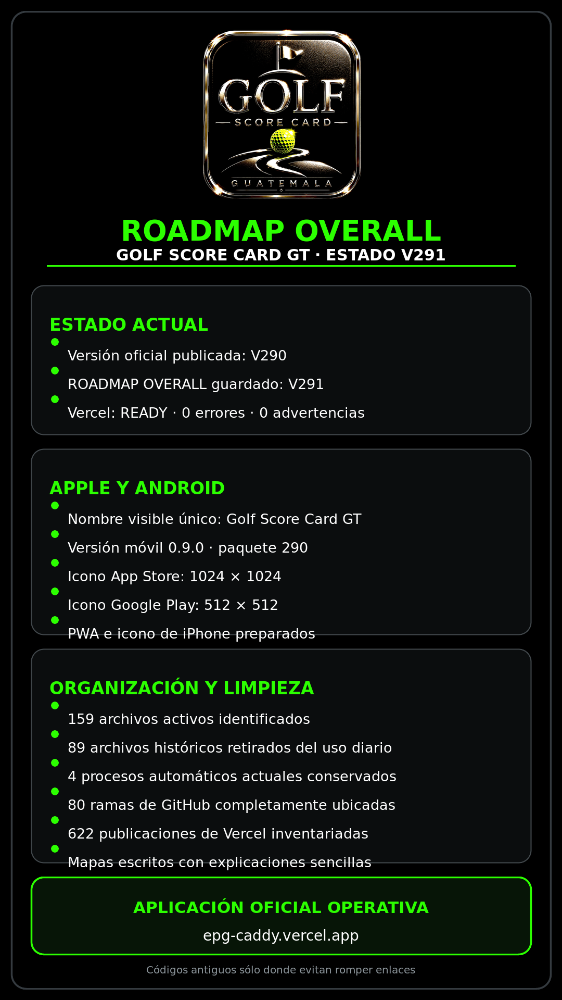

# ROADMAP OVERALL

## V332 · moneda dual y matriz completa de seguimiento

El propietario exige que Skins, Wolf, Vegas y Dots permitan elegir antes de la ronda una de dos monedas: **quetzales (`Q`/`GTQ`) o dólares (`$`/`USD`)**. Cada juego presenta dos casillas de radio mutuamente excluyentes; elegir una desmarca la otra. La moneda queda guardada en la configuración y viaja sin conversión por pantalla, voz, snapshot, corrección, tarjeta Global/personal, Historial, sincronización, restauración y liquidación. El valor es opcional para el grupo y nunca altera Gross, Neto ni el resultado deportivo.

V332 homologa la arquitectura visible de los cuatro juegos para que un jugador sin experiencia no reciba sólo un saldo final. La matriz común incluye estado y hoyos resueltos/pendientes, unidades o puntos acumulados, carry abierto, registros, dinero bruto movido, neto exacto a liquidar, líder o empate, saldos individuales y quién paga a quién. Cada juego añade su riesgo útil: mayor pozo Skins; exposición del Wolf por rival y hoyo; mayor cambio y riesgo máximo por duelo Vegas; e impacto de un punto por jugador en Dots. La tarjeta final conserva los mismos acumulados para auditoría.

Los bancos `test-v329-skins.mjs` y `test-v330-side-games.mjs` verifican las ocho casillas Q/$, exclusividad nativa, normalización de moneda, símbolos, métricas, cero-suma, persistencia, corrección y artefactos. La auditoría integral aprobó **89 paquetes**, **325 fuentes** y tres inventarios PDF sellados en V332. El corte visible es `V332-DUAL-CURRENCY-MATRIX-20260826` y la copia instalable usa `gscg-mobile-v332-dual-currency-matrix`. Producción permanece intacta; falta publicar el Preview y aprobar la prueba física en iPhone antes de cualquier montaje.

Archivos exactos V332: `skins.js`, `wolf.js`, `vegas.js`, `dots.js`, `index-grupal.html`, `card-artifacts.js`, `test-v329-skins.mjs`, `test-v330-side-games.mjs`, `service-worker.js`, los bancos que fijan build/caché, `scripts/update-inventory-v328.py`, `ROADMAP_OVERALL.md`, `ROADMAP_A_DETALLE.md`, `GOLF_SCORE_CARD_GT_PENDING_MATRIX.md`, `CONTROL_PROYECTO_SCIRE/01_DIRECTRICES_PEDIDOS_Y_ORDENES_PENDIENTES/COLA_DE_PENDIENTES.md`, `CONTROL_PROYECTO_SCIRE/01_DIRECTRICES_PEDIDOS_Y_ORDENES_PENDIENTES/PEND_DID_017_FICHAS_MODALIDADES_PARA_APRENDER.md`, `CONTROL_PROYECTO_SCIRE/MAPA_MAESTRO_DE_ARCHIVOS.md` y `CONTROL_PROYECTO_SCIRE/INVENTARIOS_V311.lock.json`.

## V331 · matriz investigada de apuestas y lenguaje operativo

La prueba física de **V330-R3 quedó aprobada en iPhone**: al tocar `WOLF`, únicamente Wolf permaneció verde, `RONDA NORMAL` se desmarcó y la configuración correcta se abrió. El defecto de selección doble queda cerrado; Producción continúa intacta y `PEND-SKI-006` sigue abierto para validar el funcionamiento completo de cada juego.

El nuevo `PEND-DID-017` exige una ficha independiente por cada modalidad y esquema: Ronda Normal, Stableford, Match Play, Four Ball, Práctica, Skins, Wolf, Vegas, Dots y variantes que cambian el cálculo. Cada hoja deberá ser comprensible a los 10 años, funcionar impresa en blanco y negro, incluir un ejemplo aritmético completo, estrategia, estados, acumulados, liquidación y glosario. La edad define sólo la claridad didáctica: el dinero permanece siempre dentro del alcance general de cada hoja y cada grupo decide si lo liquida o juega únicamente con puntos/unidades. La especificación vive en `CONTROL_PROYECTO_SCIRE/01_DIRECTRICES_PEDIDOS_Y_ORDENES_PENDIENTES/PEND_DID_017_FICHAS_MODALIDADES_PARA_APRENDER.md`.

V331 sustituye la presentación mínima de apuestas por una matriz operativa investigada. Wolf elimina la duplicidad confusa `Solo base`/`Lone` y conserva tres decisiones comprensibles: **Con pareja**, **Lobo solitario** y **Lobo ciego**. Registra si el Wolf sale primero o último, multiplicadores configurables, tope monetario por rival/hoyo, riesgo del Wolf, decisiones y scores pendientes, acumulados, unidades netas, dinero movido y liquidación. Vegas explica cómo 4 y 5 forman 45, maneja correctamente scores de 10 o más —10 y 4 forman 104—, permite acordar qué ocurre si ambas parejas hacen birdie y muestra por hoyo números, volteos, águilas, topes, puntos movidos y saldos. Dots define cada término en español, mantiene apagadas las variantes que pueden duplicar eventos, separa puntos positivos/negativos, manuales/automáticos y muestra el detalle de cada hoyo.

Las reglas universales no se inventan: las diferencias reales entre grupos quedan configurables y rotuladas. La base investigada utiliza 18Birdies y Wolf Golf Scorecard para Wolf; Mashie, 18Birdies y Golf Digest para Vegas; 18Birdies, MyScorecard y SCGA para Dots/Junk; USGA se conserva como autoridad del hándicap y score deportivo. El dinero nunca modifica el score oficial.

Archivos exactos V331: `wolf.js`, `vegas.js`, `dots.js`, `index-grupal.html`, `card-artifacts.js`, `test-v330-side-games.mjs`, `service-worker.js`, `scripts/update-inventory-v328.py`, `ROADMAP_OVERALL.md`, `ROADMAP_A_DETALLE.md`, `GOLF_SCORE_CARD_GT_PENDING_MATRIX.md`, `CONTROL_PROYECTO_SCIRE/01_DIRECTRICES_PEDIDOS_Y_ORDENES_PENDIENTES/COLA_DE_PENDIENTES.md`, `CONTROL_PROYECTO_SCIRE/MAPA_MAESTRO_DE_ARCHIVOS.md`, `CONTROL_PROYECTO_SCIRE/INVENTARIOS_V311.lock.json` y los bancos que fijan el identificador de build/caché. El corte visible es `V331-RESEARCHED-SIDE-GAMES-20260826` y la copia instalable usa `gscg-mobile-v331-researched-side-games`.

## V330 · Skins, Wolf, Vegas, Dots y seis jugadores

**Hotfix V330-R3 después de rechazo físico:** la captura real de iPhone demostró que al elegir `WOLF` todavía podían quedar verdes `RONDA NORMAL` y `WOLF`. V330-R2 queda rechazada. R3 incorpora un único escritor visual para las siete opciones, limpia configuraciones laterales múltiples heredadas, desmarca las otras seis antes de reconstruir la pantalla y vuelve a validar después del render. La caché instalable sube a `gscg-mobile-v330-side-games-r3`; `test-v330-side-games.mjs` simula exactamente el toque WOLF y exige `false` en Normal, Match Play, Four Ball, Skins, Vegas y Dots, con `true` únicamente en Wolf.

**Pendientes registrados:** `PEND-UBI-015` separa la detección automática del campo por GPS de clima/tráfico y de las distancias al green; `PEND-RSG-016` define la sincronización versionada de Reglas de Golf desde fuentes oficiales. Se crean las especificaciones `CONTROL_PROYECTO_SCIRE/01_DIRECTRICES_PEDIDOS_Y_ORDENES_PENDIENTES/PEND_UBI_015_DETECCION_CAMPO_POR_GPS.md` y `CONTROL_PROYECTO_SCIRE/01_DIRECTRICES_PEDIDOS_Y_ORDENES_PENDIENTES/PEND_RSG_016_SINCRONIZACION_REGLAS_GOLF.md`, y se actualizan `CONTROL_PROYECTO_SCIRE/01_DIRECTRICES_PEDIDOS_Y_ORDENES_PENDIENTES/COLA_DE_PENDIENTES.md`, `GOLF_SCORE_CARD_GT_PENDING_MATRIX.md` y `CONTROL_PROYECTO_SCIRE/MAPA_MAESTRO_DE_ARCHIVOS.md`.

**Voz pospuesta y registrada:** `PEND-VOZ-003` incorpora tres observaciones físicas nuevas sin declararlas implementadas: matriz obligatoria para respuestas estudiadas, profundas y formales; corrección del corte observado en la quinta conversación; y avisos bilaterales exactos `ESCUCHANDO` / `RESPONDIENDO` en rojo parpadeante. Por orden del propietario, la ejecución vuelve primero a la configuración y prueba de SKINS, WOLF, VEGAS y DOTS.

El **26 de agosto de 2026** `PEND-SKI-006` pasa de diseño a implementación comprobable. `skins.js`, `wolf.js`, `vegas.js` y `dots.js` son motores puros conectados al score oficial, no menús de respuestas fijas. La ventana de opciones se divide en dos columnas —modalidades existentes a la izquierda y juegos nuevos a la derecha— y la pantalla principal de la tarjeta conserva su formato.

Skins opera Gross/Neto para dos a seis jugadores con unidad monetaria, carry, división o anulación de empates. Wolf rota decisiones para tres a seis jugadores y no permite cierre con hoyos sin pareja/Solo/Lone/Blind. Vegas trabaja con cuatro o seis jugadores; la variante de seis usa tres parejas y comparaciones par a par. Dots permite activar y valorar eventos antes de jugar, mantiene apagadas por defecto las reglas de grupo `Amigo`, izquierda y derecha, y separa el saldo económico del score deportivo. Match Play y Four Ball se amplían a las parejas Verde, Oro y Azul.

El cierre, corrección oficial, tarjetas Global/personales, Historial, consultas, sincronización y restauración conservan los cuatro resultados en el snapshot firmado. `test-v329-skins.mjs` y `test-v330-side-games.mjs` cubren empates, X, límites, multiplicadores, tres parejas, cero-suma, bloqueo de cierre Wolf, corrección, artefactos, voz y persistencia. El banco local y el build real de Vercel aprobaron los 89 paquetes, el inventario de 322 fuentes, cero vulnerabilidades y la puerta viva de Reglas con modelo, búsqueda web, seis fuentes oficiales y `scoreChanged:false`. El Preview `dpl_4k5V9rFwkVXVwuRwktBjtgG4arAv` quedó `READY` desde el commit remoto `ea18aafb214731d44b41ea069fe27228407f9f47`. Producción permanece intacta; faltan revisión visual/táctil y ronda física en iPhone.

Referencias profesionales consultadas: BirdieBet y Squabbit para Vegas; Wiz Golf, FLOG, Squabbit y Golf Monthly para Wolf; The 1st Tee para Dots. Las variantes que no son universales quedan rotuladas como reglas de grupo o adaptación Golf Score Card GT.

Archivos funcionales V329/V330: `skins.js`, `wolf.js`, `vegas.js`, `dots.js`, `match-play.js`, `four-ball.js`, `index-grupal.html`, `round-closure.js`, `card-artifacts.js`, `card-library.js`, `historical-analytics.js`, `master-data-sync.js`, `account-backup.js`, `service-worker.js`, `scripts/build-mobile-web.mjs`, `vercel.json`, `audit-project.mjs`, `test-v329-skins.mjs` y `test-v330-side-games.mjs`. La documentación, mapa, ambos ROADMAP, tres inventarios PDF y su sello se actualizan antes de Preview.

## V328-R2 · Centro de Reglas de Golf oficial con respaldo básico sin conexión

El **26 de agosto de 2026** comienza la ejecución funcional de `PEND-REG-001`. La misma AI UNIVERSAL ∞ incorpora un acceso global `REGLAS`, acepta situaciones por teclado o micrófono, conserva campo y modalidad como contexto y consulta el modelo avanzado mediante `/api/golf-rules`. La herramienta limita técnicamente la Web a los dominios oficiales `usga.org` y `randa.org`, exige una fuente oficial visible y usa la edición Rules of Golf 2023 con las clarificaciones vigentes; el corte comprobado es 1 de julio de 2026. No se copia el reglamento completo ni se afirma una alianza, licencia de marca o API privada.

La consulta se aísla de todos los escritores locales: dentro de REGLAS no se ejecutan órdenes de score y la respuesta nunca aplica penalidades, concede hoyos ni cierra rondas. `test-v328-official-golf-rules.mjs` cubre 15 situaciones y comprueba dominios, contexto, texto/voz y `scoreChanged:false`. El Preview V328-R1 (`dpl_3Sa4NnueMXBqB2kCm69WdwhH83bv`) quedó `READY` con 86 paquetes, puerta viva aprobada y árbol remoto exacto `f0de0f6328c34ed2788faf1009ba04a19f47e6c1`. `test-v328-live-official-rules.mjs` se ejecuta dentro de cada build Vercel y exige una llamada real del modelo, búsqueda web efectiva, al menos una fuente USGA/The R&A y cero cambio de score.

V328-R2 agrega `golf-rules-offline.js`: guarda únicamente respuestas que ya aprobaron el filtro oficial, retiene hasta 24 entradas durante 90 días, conserva tokens normalizados en vez de la pregunta completa, exige coincidencia suficiente y modalidad compatible, muestra la fecha y nunca inventa si no existe una respuesta adecuada. `test-v328-offline-official-rules.mjs` comprueba fuente, privacidad, límite, caducidad, cruces negativos, integración PWA y cero escritura. Con este paquete la auditoría maestra sube a 87 paquetes más la puerta viva de Vercel. El manual visible y sus dos PDF conservan 74 páginas, página 73 actualizada, 2160 × 4320 px y 300 dpi; el control visual completo debe aprobar antes de entregar. `PEND-REG-001` continúa abierto sólo para voz física y una eventual integración comercial/licenciada; no se declara alianza oficial.

Archivos exactos V328: `api/golf-rules.js`, `audit-project.mjs`, `index-grupal.html`, `service-worker.js`, `manual.html`, `scripts/update-manual-page-73.py`, `docs/manual/v311/manual-pages-17-35.json`, `docs/manual/v311/page-73.png`, `docs/manual/v311/Manual_Golf_Score_Card_GT_COMPLETO.pdf`, `docs/manual/v311/Manual_de_Funciones_Golf_Score_Card_GT_01-16.pdf`, `test-v328-official-golf-rules.mjs`, `test-v327-tool-followup-no-silence.mjs`, `test-v326-no-silent-conversation.mjs`, `test-v325-ideal-microphone-timings.mjs`, `test-v324-real-traffic.mjs`, `test-v323-long-multitopic-context.mjs`, `test-v322-real-sustained-caddie.mjs`, `test-v312-general-caddie.mjs`, `test-v307-match-arrows-format.mjs`, `test-v305-history-navigation-zero-error.mjs`, `test-v304-homogeneous-registration-actions.mjs`, `test-v290-brand-icons-cleanup.mjs`, `test-v284-native-package-generation.mjs`, `test-v281-pwa-installation.mjs`, `test-v280-local-history-insights.mjs`, `test-v279-local-card-library.mjs`, `test-v278-card-image-pdf-export.mjs`, `test-v277-official-round-corrections.mjs`, `test-v276-manual-hole-navigation.mjs`, `test-v275-stable-live-voice-turns.mjs`, `test-v274-complete-courses-voice-operations.mjs`, `test-v272-definitive-operational-release.mjs`, `test-stableford-ui.mjs`, `CONTROL_PROYECTO_SCIRE/01_DIRECTRICES_PEDIDOS_Y_ORDENES_PENDIENTES/COLA_DE_PENDIENTES.md`, `GOLF_SCORE_CARD_GT_PENDING_MATRIX.md`, `GOLF_SCORE_CARD_GT_GRUPAL_MANUAL_MAESTRO.md`, `CONTROL_PROYECTO_SCIRE/MAPA_MAESTRO_DE_ARCHIVOS.md`, `CONTROL_PROYECTO_SCIRE/INVENTARIOS_V311.lock.json`, `ROADMAP_OVERALL.md` y `ROADMAP_A_DETALLE.md`. Los tres inventarios PDF externos se regeneran y verifican antes del build.

Archivos adicionales del cierre V328-R1: `test-v328-live-official-rules.mjs` agrega la puerta real y `vercel.json` la vuelve obligatoria. Archivos adicionales V328-R2: `golf-rules-offline.js`, `test-v328-offline-official-rules.mjs`, `test-v321-ai-universal-infinity.mjs`, `service-worker.js`, `index-grupal.html`, `audit-project.mjs`, `scripts/update-manual-page-73.py`, `docs/manual/v311/manual-pages-17-35.json`, los artefactos de manual, `scripts/update-inventory-v328.py`, los cuatro documentos de control, el candado y ambos ROADMAP.

## Actualización de control V327-R1-PEND · cola completa y ejecución permanente

El **26 de agosto de 2026** el propietario ordena agregar y adaptar todos los pendientes, continuar sin solicitar autorizaciones intermedias y montar cada versión cuando esté realmente probada. La instrucción no elimina las puertas de calidad: un solo `FAIL` conserva Producción intacta y ninguna licencia, credencial, contrato o integración externa puede simularse. Las reglas permanentes 22–26 prohíben trasladarle trabajo técnico que las herramientas puedan resolver, dejarlo adivinando la siguiente acción, simular trabajo en segundo plano o exigirle mensajes repetidos de `sigue`; todo reporte debe cerrar con una asignación inequívoca.

La cola vigente distingue lo entregado de lo abierto y agrega los faltantes expresamente acordados: hándicap oficial ASOGOLF/GHIN con índice interno separado; campos mundiales con datos oficiales; GPS deportivo por hoyo; Skins, Wolf, Vegas, Amigo, izquierda/derecha y Dots con unidad en quetzales; Apple Watch primero y Wear OS después; nube, cuentas, seguridad, estadísticas avanzadas, monetización y certificación integral. Permanecen además USGA/Reglas de Golf, clima completo en artefactos, Guía Rápida, tráfico comparado y AI UNIVERSAL ∞.

V327-R1 ya aprobó en Preview 85 paquetes, 310 fuentes, 44 llamadas reales, 24 materias, ocho turnos con memoria, 550 transiciones herramienta→voz y cero errores 5xx. La puerta inmediata sigue siendo una conversación física prolongada en iPhone; sólo después de su PASS se permite montar y continuar automáticamente con el siguiente pendiente ejecutable.

Archivos exactos V327-R1-PEND: `CONTROL_PROYECTO_SCIRE/01_DIRECTRICES_PEDIDOS_Y_ORDENES_PENDIENTES/DIRECTRICES_MANDATORIAS.md`, `CONTROL_PROYECTO_SCIRE/01_DIRECTRICES_PEDIDOS_Y_ORDENES_PENDIENTES/COLA_DE_PENDIENTES.md`, `GOLF_SCORE_CARD_GT_PENDING_MATRIX.md`, `CONTROL_PROYECTO_SCIRE/MAPA_MAESTRO_DE_ARCHIVOS.md`, `CONTROL_PROYECTO_SCIRE/INVENTARIOS_V311.lock.json`, `ROADMAP_OVERALL.md` y `ROADMAP_A_DETALLE.md`. También se regeneran y verifican `Inventario_Golf_Score_Card_GT_OVERALL_V311.pdf`, `Inventario_Golf_Score_Card_GT_A_DETALLE_V311.pdf` e `Inventario_Golf_Score_Card_GT_POR_IMAGENES_Y_RUBROS_V311.pdf`.

## Corrección controlada V327 · la herramienta siempre regresa a la voz

La prueba física rechazó V326-R2 después de aproximadamente seis preguntas: una investigación sobre una persona conocida en Colima y una consulta de tráfico podían completar su API con HTTP 200, pero el teléfono quedaba rojo escuchando sin pronunciar el resultado. No era un vocabulario temático reducido: `search_live_web` sí recibió la consulta y devolvió datos; el corte estaba en la transición asíncrona `herramienta → segunda respuesta → audio` de Realtime en iPhone.

V327 conserva la AI universal sin catálogo y corrige cuatro estados: `speech_stopped` mantiene el guardián hasta la transcripción final; un `output_audio_buffer.stopped` tardío y sin identificador ya no desautoriza el audio final antes de que empiece; la reproducción conserva un guardián de 60 segundos hasta su cierre; y una herramienta cuyo canal se perdió produce recuperación visible en vez de regresar en silencio. `api/voice-health.js` registra únicamente eventos técnicos permitidos, número de turno, etapa y tiempo —nunca preguntas, transcripciones, nombres, ubicaciones ni claves— para que una nueva anomalía física sea diagnosticable.

El banco dirigido ejecuta 550 secuencias herramienta→voz, 100 eventos de privacidad, 30 turnos bilaterales y las rutas anteriores. La consulta directa `El Pulté Golf → Pradera Concepción` devolvió una ruta real válida de 15 km y aproximadamente 33 minutos en el instante de prueba; un destino que sólo diga `Concepción` debe provocar una sola pregunta breve de aclaración. Producción continúa intacta y V327 no queda autorizada para montaje hasta terminar la regresión completa, desplegar Preview y aprobar otra conversación física prolongada en iPhone.

Archivos exactos V327: `index-grupal.html`, `api/_lib/traffic.js`, `api/universal-ai.js`, `api/voice-health.js`, `service-worker.js`, `audit-project.mjs`, `test-v327-tool-followup-no-silence.mjs`, `test-v326-no-silent-conversation.mjs`, `test-v325-ideal-microphone-timings.mjs`, `test-v324-real-traffic.mjs`, `test-v323-long-multitopic-context.mjs`, `test-v322-real-sustained-caddie.mjs`, `test-v312-general-caddie.mjs`, `test-stableford-ui.mjs`, `test-v272-definitive-operational-release.mjs`, `test-v274-complete-courses-voice-operations.mjs`, `test-v275-stable-live-voice-turns.mjs`, `test-v276-manual-hole-navigation.mjs`, `test-v277-official-round-corrections.mjs`, `test-v278-card-image-pdf-export.mjs`, `test-v279-local-card-library.mjs`, `test-v280-local-history-insights.mjs`, `test-v281-pwa-installation.mjs`, `test-v284-native-package-generation.mjs`, `test-v290-brand-icons-cleanup.mjs`, `test-v304-homogeneous-registration-actions.mjs`, `test-v305-history-navigation-zero-error.mjs`, `test-v307-match-arrows-format.mjs`, `CONTROL_PROYECTO_SCIRE/01_DIRECTRICES_PEDIDOS_Y_ORDENES_PENDIENTES/COLA_DE_PENDIENTES.md`, `GOLF_SCORE_CARD_GT_PENDING_MATRIX.md`, `GOLF_SCORE_CARD_GT_GRUPAL_MANUAL_MAESTRO.md`, `CONTROL_PROYECTO_SCIRE/MAPA_MAESTRO_DE_ARCHIVOS.md`, `CONTROL_PROYECTO_SCIRE/INVENTARIOS_V311.lock.json`, `ROADMAP_OVERALL.md` y `ROADMAP_A_DETALLE.md`.

## Control de entrega V326-R1 · redespliegue para cargar tráfico

El usuario confirmó que la credencial de tráfico podría haber quedado habilitada. El despliegue V326 original no se reutiliza para aprobarla porque las variables de entorno se fijan al construir cada deployment. Se provocó un redespliegue sin modificar el código funcional; el primer intento quedó correctamente bloqueado por `ROADMAP GATE` al no registrar el movimiento en ambos ROADMAPS. V326-R1 registra ese intento, conserva producción V322 intacta y ordena construir de nuevo Preview antes de ejecutar la ruta real El Pulté → colonia Oakland zona 10 para mañana a las 12:30 PM.

La aprobación continúa prohibida hasta que el nuevo Preview devuelva ETA, duración sin tráfico, demora, distancia y hora de cálculo desde Google Maps Routes, y hasta completar la conversación física prolongada en iPhone. Archivos exactos V326-R1: `ROADMAP_OVERALL.md`, `ROADMAP_A_DETALLE.md` y `CONTROL_PROYECTO_SCIRE/INVENTARIOS_V311.lock.json`.

La primera construcción documentada de V326-R1 confirmó que `GOOGLE_MAPS_API_KEY` ya estaba presente en Preview: el test de ausencia recibió `TRAFFIC_ROUTE_UNAVAILABLE` en vez de `TRAFFIC_NOT_CONFIGURED`. El bloqueo pertenecía al aislamiento del test, que pasaba una cadena vacía y permitía por error el fallback hacia la credencial real. Se sustituyó únicamente ese valor inyectado por espacio en blanco, que se recorta a vacío sin consultar la red; la lógica funcional de tráfico permanece idéntica.

## Corrección controlada V326 · ningún turno puede quedar rojo y mudo

La prueba física en iPhone rechazó V325: después de preguntas sobre tráfico futuro y consumo eléctrico, el micrófono permanecía rojo y abierto sin producir una reacción. Los registros confirmaron que WebRTC sí abría, pero el cierre del turno no alcanzaba las herramientas ni la respuesta. La causa fue `semantic_vad` con urgencia baja sin un límite temporal anterior a `speech_stopped`; el watchdog existente comenzaba demasiado tarde y no podía recuperar ese estado.

V326 usa para conversación un `server_vad` independiente con umbral 0.2, prefijo de 700 ms y 2,200 ms de silencio. Es más paciente que las órdenes de la aplicación, que conservan 1,000 ms, pero siempre posee un final determinista. Un guardián de entrada se renueva con los deltas parciales y, si no existe ningún evento durante 15 segundos, desmonta la captura atascada y apaga el rojo con una instrucción visible; mantiene un límite duro de 90 segundos por turno. Un segundo guardián recupera a los 30 segundos una respuesta del modelo que no haya comenzado. Los cálculos estables y aproximados, como el consumo eléctrico de un aire acondicionado, se responden directamente con supuestos en vez de abrir una búsqueda web innecesaria.

`test-v326-no-silent-conversation.mjs` ejecuta la máquina de temporizadores y comprueba recuperación real de estado, además de 30 alternancias entre conversación y órdenes. V325 queda rechazada y V326 continúa sin autorización de montaje hasta repetir las dos preguntas exactas y una conversación física prolongada en iPhone. Tráfico tampoco queda aprobado mientras Preview responda `TRAFFIC_NOT_CONFIGURED` y falte la comparación simultánea en Guatemala.

Archivos exactos V326: `index-grupal.html`, `service-worker.js`, `audit-project.mjs`, `test-v326-no-silent-conversation.mjs`, `test-v325-ideal-microphone-timings.mjs`, `test-v324-real-traffic.mjs`, `test-v323-long-multitopic-context.mjs`, `test-v322-real-sustained-caddie.mjs`, `test-v312-general-caddie.mjs`, `test-stableford-ui.mjs`, `test-v272-definitive-operational-release.mjs`, `test-v274-complete-courses-voice-operations.mjs`, `test-v275-stable-live-voice-turns.mjs`, `test-v276-manual-hole-navigation.mjs`, `test-v277-official-round-corrections.mjs`, `test-v278-card-image-pdf-export.mjs`, `test-v279-local-card-library.mjs`, `test-v280-local-history-insights.mjs`, `test-v281-pwa-installation.mjs`, `test-v284-native-package-generation.mjs`, `test-v290-brand-icons-cleanup.mjs`, `test-v304-homogeneous-registration-actions.mjs`, `test-v305-history-navigation-zero-error.mjs`, `test-v307-match-arrows-format.mjs`, `GOLF_SCORE_CARD_GT_GRUPAL_MANUAL_MAESTRO.md`, `GOLF_SCORE_CARD_GT_PENDING_MATRIX.md`, `CONTROL_PROYECTO_SCIRE/MAPA_MAESTRO_DE_ARCHIVOS.md`, `CONTROL_PROYECTO_SCIRE/INVENTARIOS_V311.lock.json`, `ROADMAP_OVERALL.md` y `ROADMAP_A_DETALLE.md`.

## Integración controlada V325 · tiempos ideales del micrófono bilateral

V325 separa por intención los tiempos de escucha. Las órdenes de registro, navegación y score conservan `server_vad` con umbral 0.2, prefijo de 700 ms y 1,000 ms de silencio para respuesta rápida. AI UNIVERSAL ∞ cambia a `semantic_vad` con urgencia baja, por lo que una pausa natural no corta automáticamente la idea. La sesión valida el perfil confirmado antes de responder, serializa cambios concurrentes y vuelve al perfil operativo cuando detecta una acción propia de la tarjeta.

La conversación conserva micrófono vivo durante la respuesta, interrupción confirmada después de 250 ms y ocho caracteres, protección de eco por 1,800 ms, reescucha inmediata, watchdog de diez segundos y cierre únicamente tras 30 minutos completos sin actividad. La prueba V325 compila el JavaScript completo y simula 30 alternancias conversación/orden. Esto no sustituye la conversación física prolongada en iPhone; el corte sigue sin autorización de montaje. También quedan registrados como pendientes el enlace oficial/autorizado con USGA y Reglas de Golf, la modalidad Skins y Apple Watch/Wear OS.

Archivos exactos V325: `index-grupal.html`, `service-worker.js`, `audit-project.mjs`, `test-v325-ideal-microphone-timings.mjs`, `test-v324-real-traffic.mjs`, `test-v323-long-multitopic-context.mjs`, `test-v322-real-sustained-caddie.mjs`, `test-v312-general-caddie.mjs`, `test-stableford-ui.mjs`, `test-v272-definitive-operational-release.mjs`, `test-v274-complete-courses-voice-operations.mjs`, `test-v275-stable-live-voice-turns.mjs`, `test-v276-manual-hole-navigation.mjs`, `test-v277-official-round-corrections.mjs`, `test-v278-card-image-pdf-export.mjs`, `test-v279-local-card-library.mjs`, `test-v280-local-history-insights.mjs`, `test-v281-pwa-installation.mjs`, `test-v284-native-package-generation.mjs`, `test-v290-brand-icons-cleanup.mjs`, `test-v304-homogeneous-registration-actions.mjs`, `test-v305-history-navigation-zero-error.mjs`, `test-v307-match-arrows-format.mjs`, `CONTROL_PROYECTO_SCIRE/01_DIRECTRICES_PEDIDOS_Y_ORDENES_PENDIENTES/COLA_DE_PENDIENTES.md`, `GOLF_SCORE_CARD_GT_PENDING_MATRIX.md`, `GOLF_SCORE_CARD_GT_GRUPAL_MANUAL_MAESTRO.md`, `CONTROL_PROYECTO_SCIRE/MAPA_MAESTRO_DE_ARCHIVOS.md`, `CONTROL_PROYECTO_SCIRE/INVENTARIOS_V311.lock.json`, `ROADMAP_OVERALL.md` y `ROADMAP_A_DETALLE.md`.

## Integración controlada V324 · tráfico real dentro de AI UNIVERSAL ∞

V324 incorpora tráfico vehicular actual y proyectado a la misma conversación universal. Una consulta por voz o texto se clasifica como tráfico, obtiene origen escrito o GPS efímero, exige destino suficiente y llama desde servidor a Google Maps Routes con `TRAFFIC_AWARE_OPTIMAL`. La respuesta separa los datos del proveedor —ETA, duración sin tráfico y distancia— de la clasificación de congestión derivada. No muestra mapa, no devuelve coordenadas y no afirma integración con Waze.

La prueba V324 cubre salida inmediata y futura, huso horario, ETA, demora, distancia, privacidad, origen faltante, destino faltante, credencial ausente, proveedor caído, timeout, solicitud automática de GPS, función de modelo en dos pasos, texto, voz y continuidad recuperable. Este corte es código candidato: permanece expresamente sin aprobación de montaje hasta activar credencial/facturación y completar en Guatemala la comparación simultánea contra Waze y la conversación prolongada en iPhone.

Archivos exactos V324: `api/_lib/traffic.js`, `api/traffic.js`, `api/universal-ai.js`, `index-grupal.html`, `service-worker.js`, `audit-project.mjs`, `test-v324-real-traffic.mjs`, `test-v323-long-multitopic-context.mjs`, `test-v322-real-sustained-caddie.mjs`, `test-v321-ai-universal-infinity.mjs`, `test-v312-general-caddie.mjs`, `test-stableford-ui.mjs`, `test-v272-definitive-operational-release.mjs`, `test-v274-complete-courses-voice-operations.mjs`, `test-v275-stable-live-voice-turns.mjs`, `test-v276-manual-hole-navigation.mjs`, `test-v277-official-round-corrections.mjs`, `test-v278-card-image-pdf-export.mjs`, `test-v279-local-card-library.mjs`, `test-v280-local-history-insights.mjs`, `test-v281-pwa-installation.mjs`, `test-v284-native-package-generation.mjs`, `test-v290-brand-icons-cleanup.mjs`, `test-v304-homogeneous-registration-actions.mjs`, `test-v305-history-navigation-zero-error.mjs`, `test-v307-match-arrows-format.mjs`, `CONTROL_PROYECTO_SCIRE/01_DIRECTRICES_PEDIDOS_Y_ORDENES_PENDIENTES/COLA_DE_PENDIENTES.md`, `GOLF_SCORE_CARD_GT_PENDING_MATRIX.md`, `GOLF_SCORE_CARD_GT_GRUPAL_MANUAL_MAESTRO.md`, `CONTROL_PROYECTO_SCIRE/MAPA_MAESTRO_DE_ARCHIVOS.md`, `CONTROL_PROYECTO_SCIRE/INVENTARIOS_V311.lock.json`, `ROADMAP_OVERALL.md` y `ROADMAP_A_DETALLE.md`.

## Corrección operativa V323 · conversación multitema prolongada

V323 corrige una pérdida de contexto reproducida en producción: la comunicación continuaba, pero al turno 15 AI UNIVERSAL ∞ ya no recordaba una clave expresamente indicada al inicio. El límite efectivo era de 8 intercambios para texto y sólo 3 para el contexto compartido con voz. Ahora texto, voz y servidor conservan hasta 80 mensajes —40 intercambios completos—, suficiente para la nueva prueba de 30 temas y 63 mensajes sin perder `ORQUÍDEA 47`.

La prueba `test-v323-long-multitopic-context.mjs` reproduce cambios consecutivos entre lluvia, salud, viajes, medicamentos, golf, tecnología, cocina, filosofía, ciencias, idiomas y otros temas; exige que el primer dato siga disponible en la última pregunta, valida la misma memoria en texto y voz, y comprueba el descarte controlado únicamente al superar 80 mensajes.

Archivos V323: `api/universal-ai.js`, `index-grupal.html`, `service-worker.js`, `audit-project.mjs`, `test-v323-long-multitopic-context.mjs`, `test-v322-real-sustained-caddie.mjs`, `test-v312-general-caddie.mjs`, `test-stableford-ui.mjs`, `test-v272-definitive-operational-release.mjs`, `test-v274-complete-courses-voice-operations.mjs`, `test-v275-stable-live-voice-turns.mjs`, `test-v276-manual-hole-navigation.mjs`, `test-v277-official-round-corrections.mjs`, `test-v278-card-image-pdf-export.mjs`, `test-v279-local-card-library.mjs`, `test-v280-local-history-insights.mjs`, `test-v281-pwa-installation.mjs`, `test-v284-native-package-generation.mjs`, `test-v290-brand-icons-cleanup.mjs`, `test-v304-homogeneous-registration-actions.mjs`, `test-v305-history-navigation-zero-error.mjs`, `test-v307-match-arrows-format.mjs`, `CONTROL_PROYECTO_SCIRE/MAPA_MAESTRO_DE_ARCHIVOS.md`, `CONTROL_PROYECTO_SCIRE/INVENTARIOS_V311.lock.json`, `ROADMAP_OVERALL.md` y `ROADMAP_A_DETALLE.md`.

## Corrección operativa V322 · conversación sostenida y recuperación comprobable

V322 integra sin perder la AI UNIVERSAL ∞ de V321 la corrección del fallo observado en iPhone: el micrófono ya no se cierra tres segundos después de una respuesta ni destruye una sesión WebRTC sana al tocarlo nuevamente. La escucha permanece activa entre turnos y sólo se apaga después de 30 minutos completos sin actividad. Si falta una transcripción final, Inicio y Tarjeta salen del estado bloqueado y regresan a `● ESCUCHANDO`.

La investigación web dispone de 40 segundos en servidor y 45 segundos en cliente. Éxito, timeout, proveedor no disponible o respuesta vacía producen siempre una salida utilizable; un fallo recuperable no apaga el transporte de voz ni deja al usuario sin respuesta. `test-v322-real-sustained-caddie.mjs` simula 24 turnos consecutivos, reapertura, cierre reglamentario y los distintos resultados del servicio; la auditoría maestra conserva además las 200 áreas y las modalidades completas.

Archivos: `index-grupal.html`, `api/research.js`, `service-worker.js`, `audit-project.mjs`, `test-v322-real-sustained-caddie.mjs`, `test-v321-ai-universal-infinity.mjs`, `test-v312-general-caddie.mjs`, los candados de build/caché, `CONTROL_PROYECTO_SCIRE/MAPA_MAESTRO_DE_ARCHIVOS.md`, `CONTROL_PROYECTO_SCIRE/INVENTARIOS_V311.lock.json`, `ROADMAP_OVERALL.md` y `ROADMAP_A_DETALLE.md`.

## Actualización operativa V321 · AI UNIVERSAL ∞

AI UNIVERSAL ∞ queda integrada mediante API de modelo avanzado, con voz y texto, contexto temporal compartido, búsqueda Web para datos cambiantes, idioma automático, respuesta escrita y hablada, separación entre órdenes locales y consultas generales, y controles `ESCUCHAR`, `DETENER`, `REPETIR`, `SILENCIAR` y `CONTINUAR`. Las 200 áreas verificadas son pruebas, nunca una lista límite. El Manual conserva la portada como primera página y documenta la función en la página 73.

Revisión final publicada: el índice y el encabezado del visor nombran la página 73 como **AI UNIVERSAL ∞**, y la prueba V321 bloquea cualquier regreso al título anterior.

| Archivo | Registro V321 |
|---|---|
| `api/universal-ai.js` | Endpoint real de AI UNIVERSAL ∞ con Responses API, modelo avanzado, contexto, Web, fuentes y `store:false`. |
| `api/session-grupal.js` | Realtime conserva Golf y habilita detección automática del idioma hablado. |
| `index-grupal.html` | Panel AI ∞, teclado, respuestas escritas, contexto voz-texto, clasificación orden/pregunta y cinco controles. |
| `service-worker.js` | Caché V321 para entregar inmediatamente la integración. |
| `audit-project.mjs` | Incorpora la batería obligatoria V321. |
| `test-v321-ai-universal-infinity.mjs` | Verifica API real, 200 áreas sin lista cerrada, texto, voz, contexto, Web y controles. |
| `test-v267-one-operational-line.mjs` | Alinea el contrato de transcripción con idioma automático. |
| `test-v271-realtime-prompt-limit.mjs` | Conserva el límite Realtime con idioma automático. |
| `test-v312-general-caddie.mjs` | Amplía la verificación universal a idioma automático y caché V321. |
| `test-stableford-ui.mjs` | Alinea el build esperado con V321. |
| `test-v272-definitive-operational-release.mjs` | Alinea el build esperado con V321. |
| `test-v274-complete-courses-voice-operations.mjs` | Alinea el build esperado con V321. |
| `test-v275-stable-live-voice-turns.mjs` | Alinea el build esperado con V321. |
| `test-v276-manual-hole-navigation.mjs` | Alinea el build esperado con V321. |
| `test-v277-official-round-corrections.mjs` | Alinea el build esperado con V321. |
| `test-v278-card-image-pdf-export.mjs` | Alinea el build esperado con V321. |
| `test-v279-local-card-library.mjs` | Alinea el build esperado con V321. |
| `test-v280-local-history-insights.mjs` | Alinea el build esperado con V321. |
| `test-v281-pwa-installation.mjs` | Alinea la caché instalable esperada con V321. |
| `test-v284-native-package-generation.mjs` | Alinea el paquete web esperado con V321. |
| `test-v290-brand-icons-cleanup.mjs` | Alinea el build esperado con V321. |
| `test-v304-homogeneous-registration-actions.mjs` | Alinea el build esperado con V321. |
| `test-v305-history-navigation-zero-error.mjs` | Alinea el build esperado con V321. |
| `test-v307-match-arrows-format.mjs` | Alinea el build esperado con V321. |
| `GOLF_SCORE_CARD_GT_GRUPAL_MANUAL_MAESTRO.md` | Registra la especificación y estado operativo de AI UNIVERSAL ∞. |
| `MANUAL_COBERTURA_FUNCIONAL_V311.md` | Ubica AI UNIVERSAL ∞ en la página 73 y su prueba técnica. |
| `docs/manual/v311/manual-pages-17-35.json` | Explicación para un niño de diez años: voz, texto, órdenes, contexto y límites reales. |
| `scripts/update-manual-page-73.py` | Genera la página 73 V321 sin alterar portada ni páginas anteriores. |
| `docs/manual/v311/page-73.png` | Imagen 4K verificada de AI UNIVERSAL ∞. |
| `docs/manual/v311/Manual_Golf_Score_Card_GT_COMPLETO.pdf` | Manual completo actualizado; portada primero y página 73 AI UNIVERSAL ∞. |
| `docs/manual/v311/Manual_de_Funciones_Golf_Score_Card_GT_01-16.pdf` | Alias PDF completo actualizado con el mismo orden correcto. |
| `test-v311-manual-semantic-coverage.mjs` | Exige la explicación V321 y los cinco controles en el Manual. |
| `CONTROL_PROYECTO_SCIRE/INVENTARIOS_V311.lock.json` | Sello de inventario recalculado sobre las fuentes V321. |

## Golf Score Card GT

Este es el mapa general y sencillo del proyecto. El nombre comercial único es **Golf Score Card GT**.

Los nombres `EPG-CADDY`, `epg-caddy`, `EPGCaddy` y `com.epgcaddy.app` sólo permanecen como códigos internos antiguos porque cambiarlos rompería enlaces, publicaciones o la identidad futura de las apps. No se muestran como nombre comercial al consumidor.

## Estado actual

- Corte consolidado de este inventario: **V311 · 25 de agosto de 2026**.
- Código oficial GitHub en `main`: `e938fd4d1f1815fdfac3a4babc68c3beedfd96c5`.
- Vercel: **READY**.
- Publicación Vercel vigente: `dpl_FkfVRcQVUK8AnWdgtW5gU6eG9KEh`.
- Aplicación oficial: https://epg-caddy.vercel.app/
- Errores de publicación actuales: **0**.
- Advertencias actuales: **0**.
- Auditoría maestra: **PASS · 69 paquetes**.

## Aplicación Apple y Android

- Nombre visible: **Golf Score Card GT**.
- Identidad técnica compartida: `com.epgcaddy.app`.
- Versión móvil preparada: `0.9.0`.
- Número de paquete preparado: `290`.
- Paquete para iPhone: preparado para Xcode y futura firma.
- Paquete para Android: preparado para Android Studio y futura firma.
- Compras y suscripciones: ruta preparada con RevenueCat.
- Icono App Store: 1024 × 1024.
- Icono Google Play: 512 × 512.
- Iconos PWA: 512 × 512 y 192 × 192.
- Icono de acceso directo Apple: 180 × 180.

## Organización actual

- Archivos activos rastreados en Git al corte V311: **197**.
- Base visual original V292: **160 archivos activos** distribuidos en nueve páginas.
- Continuación documentada después de crear la base visual: **V294 a V311**.
- Corte solicitado para revisión: **desde la línea 160 hacia abajo se considera nuevo**.
- Archivos de la colección `ROADMAP_IMAGES`: **22**.
- Archivos históricos retirados del uso diario: **89**.
- Procesos automáticos actuales conservados: **4**.
- Ramas GitHub inventariadas: **80**.
- Ramas ya incluidas en main: **70**.
- Ramas con cambios propios conservadas: **9**.
- Publicaciones Vercel de la base visual histórica: **622**; los despliegues V306-V311 quedan identificados en la continuación documental.
- Base central preparada: **22 grupos de información**.
- Nombres internos de guardado en el teléfono identificados: **14**.

## Limpieza completada

- Retirados 88 procesos automáticos históricos.
- Retirado un script antiguo V112.
- Todo permanece recuperable en el historial de GitHub.
- El nombre visible EPG Caddy fue sustituido por Golf Score Card GT.
- README, documentación, PWA, Apple, Android y procesos actuales usan la marca oficial.
- Los iconos oficiales quedaron centralizados dentro de `assets/official-logos/`.
- La instalación de Vercel quedó sin errores ni advertencias.

## Mapas detallados

- [ROADMAP A DETALLE · Directorio visual en nueve páginas](ROADMAP_A_DETALLE.md)
- [Mapa de todos los archivos](CONTROL_PROYECTO_SCIRE/MAPA_MAESTRO_DE_ARCHIVOS.md)
- [Mapa de GitHub, Vercel, Apple, Android y datos](CONTROL_PROYECTO_SCIRE/MAPA_MAESTRO_INFRAESTRUCTURA.md)
- [Inventario de publicaciones Vercel](CONTROL_PROYECTO_SCIRE/INVENTARIO_DESPLIEGUES_VERCEL.md)
- [Índice de logos oficiales](assets/official-logos/README.md)

## Imágenes línea por línea

- [01 · Archivos activos](ROADMAP_IMAGES/01_ARCHIVOS_ACTIVOS_COMPLETO.png)
- [02 · Archivos retirados](ROADMAP_IMAGES/02_ARCHIVOS_RETIRADOS_COMPLETO.png)
- [03 · Infraestructura e IDs](ROADMAP_IMAGES/03_INFRAESTRUCTURA_COMPLETO.png)
- [04 · Ramas GitHub](ROADMAP_IMAGES/04_RAMAS_GITHUB_COMPLETO.png)
- [05A · Vercel · publicaciones 1 a 78](ROADMAP_IMAGES/05_VERCEL_01_A_COMPLETO.png)
- [05B · Vercel · publicaciones 79 a 156](ROADMAP_IMAGES/05_VERCEL_01_B_COMPLETO.png)
- [06A · Vercel · publicaciones 157 a 234](ROADMAP_IMAGES/06_VERCEL_02_A_COMPLETO.png)
- [06B · Vercel · publicaciones 235 a 312](ROADMAP_IMAGES/06_VERCEL_02_B_COMPLETO.png)
- [07A · Vercel · publicaciones 313 a 390](ROADMAP_IMAGES/07_VERCEL_03_A_COMPLETO.png)
- [07B · Vercel · publicaciones 391 a 468](ROADMAP_IMAGES/07_VERCEL_03_B_COMPLETO.png)
- [08A · Vercel · publicaciones 469 a 545](ROADMAP_IMAGES/08_VERCEL_04_A_COMPLETO.png)
- [08B · Vercel · publicaciones 546 a 622](ROADMAP_IMAGES/08_VERCEL_04_B_COMPLETO.png)
- [Índice de la colección visual](ROADMAP_IMAGES/README.md)

## Punto de corte del directorio

- Punto de activación original: **línea 183**.
- Registro vigente después de instalar el candado: **línea 185**.
- Activación de seguimiento obligatorio: **23 de agosto de 2026, 17:05:00, hora de Guatemala**.
- Desde este punto, cualquier creación, modificación, cambio de nombre, movimiento o eliminación se registra directamente y dentro de la misma versión en **ROADMAP OVERALL** y **ROADMAP A DETALLE**.

## Registro obligatorio V294 · Candado técnico

| Archivo o modificación | Qué quedó registrado |
|---|---|
| `.github/workflows/ios-build.yml` | La construcción de iPhone exige primero ambos ROADMAPS. |
| `.github/workflows/ios-testflight.yml` | La preparación para TestFlight exige primero ambos ROADMAPS. |
| `.github/workflows/mobile-native-package.yml` | El paquete Apple/Android se bloquea si los ROADMAPS están incompletos. |
| `.github/workflows/roadmap-gate.yml` | Nuevo control automático obligatorio en GitHub. |
| `.github/workflows/stableford-tournament-pass.yml` | Las pruebas de Stableford exigen primero ambos ROADMAPS. |
| `CONTROL_PROYECTO_SCIRE/01_DIRECTRICES_PEDIDOS_Y_ORDENES_PENDIENTES/DIRECTRICES_MANDATORIAS.md` | Norma permanente, línea de corte y hora de activación. |
| `CONTROL_PROYECTO_SCIRE/MAPA_MAESTRO_DE_ARCHIVOS.md` | Códigos y archivos del directorio actualizados. |
| `ROADMAP_IMAGES/ROADMAP_A_DETALLE_01.png` | Página visual 1 de 9. |
| `ROADMAP_IMAGES/ROADMAP_A_DETALLE_02.png` | Página visual 2 de 9. |
| `ROADMAP_IMAGES/ROADMAP_A_DETALLE_03.png` | Página visual 3 de 9. |
| `ROADMAP_IMAGES/ROADMAP_A_DETALLE_04.png` | Página visual 4 de 9. |
| `ROADMAP_IMAGES/ROADMAP_A_DETALLE_05.png` | Página visual 5 de 9. |
| `ROADMAP_IMAGES/ROADMAP_A_DETALLE_06.png` | Página visual 6 de 9. |
| `ROADMAP_IMAGES/ROADMAP_A_DETALLE_07.png` | Página visual 7 de 9. |
| `ROADMAP_IMAGES/ROADMAP_A_DETALLE_08.png` | Página visual 8 de 9. |
| `ROADMAP_IMAGES/ROADMAP_A_DETALLE_09.png` | Página visual 9 de 9. |
| `audit-project.mjs` | La auditoría maestra ejecuta primero el candado. |
| `package.json` | Agrega el comando `roadmap:gate`. |
| `scripts/roadmap-gate.mjs` | Comprueba que cada cambio aparezca en ambos ROADMAPS. |

## Refuerzo técnico V295 · Publicación también bloqueada

| Archivo o modificación | Qué quedó registrado |
|---|---|
| `vercel.json` | Vercel ejecuta obligatoriamente el candado antes de publicar. |
| `scripts/roadmap-gate.mjs` | Si Vercel no puede identificar los cambios, la publicación queda bloqueada por seguridad. |
| `CONTROL_PROYECTO_SCIRE/01_DIRECTRICES_PEDIDOS_Y_ORDENES_PENDIENTES/DIRECTRICES_MANDATORIAS.md` | La publicación de Vercel se incorpora a la norma permanente. |
| `CONTROL_PROYECTO_SCIRE/MAPA_MAESTRO_DE_ARCHIVOS.md` | Registra los códigos y explicaciones actualizados. |
| `ROADMAP_A_DETALLE.md` | Guarda el refuerzo dentro del directorio detallado. |
| `ROADMAP_OVERALL.md` | Guarda el refuerzo dentro de este resumen general. |

## Ajuste de publicación V296 · Salida Vercel

| Archivo o modificación | Qué quedó registrado |
|---|---|
| `vercel.json` | Conserva el candado y señala correctamente la carpeta que Vercel debe publicar. |
| `CONTROL_PROYECTO_SCIRE/MAPA_MAESTRO_DE_ARCHIVOS.md` | Actualiza el código y la explicación del ajuste. |
| `ROADMAP_A_DETALLE.md` | Guarda el ajuste dentro del directorio detallado. |
| `ROADMAP_OVERALL.md` | Guarda el ajuste dentro de este resumen general. |

## Actualización operativa V297 · Icono cromado 3D neón y micrófono compacto

Autorización recibida el **24 de agosto de 2026** para instalar como icono oficial la versión cuadrada cromada, con relieve profundo, apariencia de metal troquelado y verde neón muy saturado. También se reduce 50 % el diámetro visible del micrófono de registro y se coloca una figura clara de micrófono en el centro. No cambia su funcionamiento ni su área cómoda de toque.

| Archivo o modificación | Qué queda registrado |
|---|---|
| `7B1C43A7-EB8A-43CB-B03E-0CAE9273F2A2.jpeg` | Fuente cuadrada histórica actualizada con el logo autorizado, conservando su nombre técnico. |
| `assets/logo.png` | Fuente operativa de 1024 × 1024 para los paquetes Apple y Android. |
| `assets/official-logos/README.md` | Identifica la nueva versión cromada 3D como oficial. |
| `assets/official-logos/golf-score-card-gt-app-store-1024.png` | Icono preparado para App Store. |
| `assets/official-logos/golf-score-card-gt-apple-touch-180.png` | Icono preparado para el acceso directo de iPhone y iPad. |
| `assets/official-logos/golf-score-card-gt-google-play-512.png` | Icono preparado para Google Play. |
| `assets/official-logos/golf-score-card-gt-official-master-1254.jpeg` | Copia maestra oficial en máxima medida. |
| `assets/official-logos/golf-score-card-gt-pwa-192.png` | Icono pequeño de la aplicación instalable. |
| `assets/official-logos/golf-score-card-gt-pwa-512.png` | Icono grande de la aplicación instalable. |
| `index-grupal.html` | Micrófono de registro 50 % más pequeño, con símbolo central claro para el usuario nuevo. |
| `mobile-release.json` | Número de paquete preparado actualizado a V297. |
| `service-worker.js` | Caché renovada para entregar el icono V297 y retirar el anterior. |
| `test-v290-brand-icons-cleanup.mjs` | Comprobación operativa alineada con el paquete y la caché V297. |
| `CONTROL_PROYECTO_SCIRE/MAPA_MAESTRO_DE_ARCHIVOS.md` | Códigos, tamaños y explicaciones de los archivos actualizados. |
| `ROADMAP_A_DETALLE.md` | Registro detallado obligatorio de esta modificación. |
| `ROADMAP_OVERALL.md` | Registro general obligatorio de esta modificación. |

## Actualización operativa V298 · Instrucciones de registro para newbies

Autorización recibida el **24 de agosto de 2026** para sustituir únicamente los textos situados arriba del micrófono por una guía más grande, alineada a la izquierda y ordenada: **DICTA O ESCRIBE, 1-NOMBRE, 2-HDCP, 3-MARCAS, DE CADA JUGADOR, 4-OK**. El micrófono y el registro conservan exactamente su funcionamiento.

| Archivo o modificación | Qué queda registrado |
|---|---|
| `index-grupal.html` | Muestra la guía para usuarios nuevos en el orden autorizado, a la izquierda y con letra mayor. |
| `mobile-release.json` | Número de paquete preparado actualizado a V298. |
| `service-worker.js` | Caché V298 para entregar inmediatamente las instrucciones nuevas. |
| `test-v290-brand-icons-cleanup.mjs` | Comprueba el texto, orden, alineación, tamaño, paquete y caché V298. |
| `CONTROL_PROYECTO_SCIRE/MAPA_MAESTRO_DE_ARCHIVOS.md` | Actualiza códigos, tamaños y explicaciones sencillas. |
| `ROADMAP_A_DETALLE.md` | Registro detallado obligatorio de V298. |
| `ROADMAP_OVERALL.md` | Registro general obligatorio de V298. |

## Corrección operativa V299 · Logo completo dentro del iPhone

Corrección solicitada el **24 de agosto de 2026** después de comprobar la aplicación instalada en iPhone. Se elimina únicamente el exceso de ancho del logo superior y se respeta el espacio de seguridad de la barra del teléfono. El texto para newbies, el micrófono y todas las funciones permanecen iguales.

| Archivo o modificación | Qué queda registrado |
|---|---|
| `index-grupal.html` | Limita el logo al 100 % del espacio disponible y lo baja debajo de la barra superior del iPhone. |
| `mobile-release.json` | Número de paquete preparado actualizado a V299. |
| `service-worker.js` | Caché V299 para entregar inmediatamente la corrección del logo. |
| `test-v290-brand-icons-cleanup.mjs` | Comprueba el ancho del logo, el espacio seguro, el paquete y la caché V299. |
| `CONTROL_PROYECTO_SCIRE/MAPA_MAESTRO_DE_ARCHIVOS.md` | Actualiza códigos, tamaños y explicaciones sencillas. |
| `ROADMAP_A_DETALLE.md` | Registro detallado obligatorio de V299. |
| `ROADMAP_OVERALL.md` | Registro general obligatorio de V299. |

## Documentación operativa V300 · Compendio final para el usuario

El **24 de agosto de 2026** se crea el compendio final de funciones reales para el consumidor. Está escrito con palabras sencillas, usa los nombres visibles de los botones y separa expresamente las funciones disponibles de las que todavía siguen en preparación. No modifica la aplicación ni reabre funciones ya aprobadas.

| Archivo o modificación | Qué queda registrado |
|---|---|
| `COMPENDIO_FINAL_FUNCIONES_USUARIO.md` | Manual amigable que explica desde la selección del campo hasta la tarjeta final, historial, correcciones, respaldo e instalación. |
| `CONTROL_PROYECTO_SCIRE/MAPA_MAESTRO_DE_ARCHIVOS.md` | Agrega el compendio al inventario y actualiza las explicaciones de ambos ROADMAPS. |
| `ROADMAP_A_DETALLE.md` | Registra a detalle la creación documental V300. |
| `ROADMAP_OVERALL.md` | Registra esta creación dentro del resumen general. |

## Actualización operativa V301 · Modalidades claras y torneo opcional

El **24 de agosto de 2026** se cierra el vacío de orientación de la pantalla principal. La ruta que ya funcionaba como ronda general ahora tiene una opción visible llamada **RONDA NORMAL**; la modalidad rápida cambia su nombre comercial a **SCORE CARD - PRÁCTICA**. El registro de torneo se identifica como opcional y permite guardar una descripción también opcional. No se modifica ninguna regla de cálculo, score, voz, tarjeta o navegación.

| Archivo o modificación | Qué queda registrado |
|---|---|
| `index-grupal.html` | Presenta las tres modalidades, cambia el nombre de Práctica y agrega la descripción opcional del torneo. |
| `COMPENDIO_FINAL_FUNCIONES_USUARIO.md` | Actualiza el manual con los nombres visibles y el nuevo campo opcional. |
| `mobile-release.json` | Número de paquete preparado actualizado a V301. |
| `service-worker.js` | Caché V301 para entregar la pantalla nueva. |
| `test-v290-brand-icons-cleanup.mjs` | Comprueba las tres modalidades, el registro opcional y el guardado de la descripción. |
| `CONTROL_PROYECTO_SCIRE/MAPA_MAESTRO_DE_ARCHIVOS.md` | Actualiza códigos y explicaciones sencillas de V301. |
| `ROADMAP_A_DETALLE.md` | Registra V301 a detalle. |
| `ROADMAP_OVERALL.md` | Registra V301 en este resumen general. |

## Actualización operativa V302 · Micrófonos hermanos en General y Stableford

El **24 de agosto de 2026** se unifica el registro visual de Stableford con la Score Card General. Stableford deja de mostrar el círculo de 240 px con emoji y adopta el mismo encabezado REGISTRO DE JUGADORES, bloque de instrucciones, micrófono SVG compacto de 120 px en escritorio y 112 px en iPhone, color neón y estado rojo de escucha. El enlace con el motor oficial de voz permanece intacto.

| Archivo o modificación | Qué queda registrado |
|---|---|
| `stableford.js` | Reutiliza la línea gráfica y descriptiva aprobada de la Score Card General sin cambiar la lógica de registro. |
| `mobile-release.json` | Número de paquete preparado actualizado a V302. |
| `service-worker.js` | Caché V302 para entregar inmediatamente el componente unificado. |
| `test-v290-brand-icons-cleanup.mjs` | Comprueba la estructura hermana, el SVG, la ausencia del emoji grande, el paquete y la caché. |
| `CONTROL_PROYECTO_SCIRE/MAPA_MAESTRO_DE_ARCHIVOS.md` | Actualiza el inventario de todos los archivos modificados. |
| `ROADMAP_A_DETALLE.md` | Registra V302 a detalle. |
| `ROADMAP_OVERALL.md` | Registra V302 en este resumen general. |

## Actualización operativa V303 · Paso 4-OK también en Stableford

El **24 de agosto de 2026** se completa la hermandad de vocabulario entre General y Stableford. El botón final de una nueva ronda Stableford ahora dice **OK**, tal como indica el paso 4. Su operación no cambia: sigue validando los datos e iniciando la ronda. Cuando se edita una ronda existente, el botón conserva **ACTUALIZAR DATOS**.

| Archivo o modificación | Qué queda registrado |
|---|---|
| `index-grupal.html` | Muestra OK como acción final de una nueva ronda Stableford. |
| `stableford.js` | Orienta al usuario con REVISA Y PRESIONA OK después del dictado. |
| `mobile-release.json` | Número de paquete preparado actualizado a V303. |
| `service-worker.js` | Caché V303 para entregar inmediatamente el texto homologado. |
| `test-v290-brand-icons-cleanup.mjs` | Comprueba OK en pantalla, OK en el aviso, paquete y caché. |
| `CONTROL_PROYECTO_SCIRE/MAPA_MAESTRO_DE_ARCHIVOS.md` | Actualiza el inventario de todos los archivos modificados. |
| `ROADMAP_A_DETALLE.md` | Registra V303 a detalle. |
| `ROADMAP_OVERALL.md` | Registra V303 en este resumen general. |

## Actualización operativa V304 · Acciones hermanas y control visual

El **24 de agosto de 2026** se corrige la diferencia que obligaba al usuario a revisar manualmente las dos tarjetas. Registro General y Registro Stableford comparten ahora un único tratamiento para sus acciones inferiores: misma familia, peso 900, tamaño aproximadamente 30 % mayor y la misma altura para OK. Cuando Stableford todavía no está listo, OK permanece funcionalmente bloqueado, pero se muestra con texto y borde neón legibles en lugar de gris desvanecido. Ninguna regla de juego, validación o navegación cambia.

| Archivo nuevo o modificación | Qué queda registrado |
|---|---|
| `index-grupal.html` | Instala el sistema visual compartido para OK, Ronda previa, Historial, Atrás y Cancelar en ambas tarjetas. |
| `mobile-release.json` | Número de paquete preparado actualizado a V304. |
| `service-worker.js` | Caché V304 para entregar inmediatamente la homologación. |
| `test-v290-brand-icons-cleanup.mjs` | Mantiene la validación acumulada alineada con V304. |
| `test-v304-homogeneous-registration-actions.mjs` | Impide automáticamente diferencias futuras de fuente, peso, tamaño, altura o brillo entre las acciones hermanas. |
| `audit-project.mjs` | Ejecuta la comparación V304 dentro del control maestro. |
| `.github/workflows/roadmap-gate.yml` | Vuelve obligatorio el filtro hermano en GitHub. |
| `vercel.json` | Vuelve obligatorio el filtro hermano antes de cada publicación Vercel. |
| `CONTROL_PROYECTO_SCIRE/MAPA_MAESTRO_DE_ARCHIVOS.md` | Actualiza el inventario completo e incorpora la nueva prueba. |
| `ROADMAP_A_DETALLE.md` | Registra V304 a detalle. |
| `ROADMAP_OVERALL.md` | Registra V304 en este resumen general. |

## Actualización operativa V305 · Historial, navegación y cero superposiciones

El **24 de agosto de 2026** se auditan todas las pantallas y rutas desde la base V304. Todo acceso visible al archivo de tarjetas usa **HISTORIAL**; cada pantalla con retorno ofrece **ATRÁS** conectado y situado arriba del contenido; el acceso opcional de cuenta pasa a **REGÍSTRATE** dentro del flujo y deja de cubrir controles. En Stableford se elimina el aviso huérfano bajo los jugadores, se conserva su validación interna y la guía visible se corrige para pedir únicamente número de jugador y nombre. Los OK General y Stableford comparten geometría, tipografía, color y estados equivalentes: delineados mientras el registro está incompleto y sólidos cuando ya puede confirmarse. Cálculos y reglas no solicitadas permanecen congelados.

| Archivo nuevo o modificado | Qué queda registrado |
|---|---|
| `.github/workflows/roadmap-gate.yml` | Ejecuta también el filtro obligatorio V305 en GitHub. |
| `COMPENDIO_FINAL_FUNCIONES_USUARIO.md` | Usa HISTORIAL y REGÍSTRATE y explica los formatos reales de dictado General y Stableford. |
| `GOLF_SCORE_CARD_GT_GRUPAL_MANUAL_MAESTRO.md` | Sincroniza el manual vivo con App V305, el estado de los OK y las guías operativas reales. |
| `GOLF_SCORE_CARD_GT_PENDING_MATRIX.md` | Homologa el vocabulario del historial en la matriz funcional. |
| `ROADMAP_A_DETALLE.md` | Registra individualmente la intervención V305. |
| `ROADMAP_OVERALL.md` | Incorpora este resumen general V305. |
| `CONTROL_PROYECTO_SCIRE/MAPA_MAESTRO_DE_ARCHIVOS.md` | Eleva el inventario activo e incorpora todos los archivos V305. |
| `audit-project.mjs` | Añade la prueba V305 a la auditoría maestra. |
| `index-grupal.html` | Homologa HISTORIAL, ATRÁS, REGÍSTRATE y los estados del OK General; evita superposiciones y conserva las validaciones. |
| `mobile-release.json` | Prepara el paquete móvil 305. |
| `service-worker.js` | Activa la caché `gscg-mobile-v305`. |
| `stableford.js` | Muestra únicamente `1-# JUGADOR`, `2-NOMBRE`, `HASTA 6 JUGADORES` y `3-OK`; el motor exige la posición y asigna HCP y marcas por categoría. |
| `test-course-catalog.mjs` | Conserva la eliminación de las falsas casillas históricas y reconoce la guía vigente del límite real de seis jugadores. |
| `test-stableford-ui.mjs` | Alinea la prueba de UI con el build vigente V305. |
| `test-stableford-clean-roster-history.mjs` | Alinea la prueba limpia con la regla V289 de persistir la nueva ronda vacía. |
| `test-v255-player-registration-boxes-codes.mjs` | Alinea la prueba histórica con la guía visual vigente: Dicta o escribe, Nombre, HDCP, Marcas y OK. |
| `test-v260-round-points-player-return.mjs` | Alinea la recuperación con la regla V289 de persistir Stableford vacío para impedir que reaparezcan nombres anteriores. |
| `test-v261-registration-stableford-modality.mjs` | Alinea la prueba histórica con Ronda Normal, Stableford, Score Card - Práctica y la guía homologada vigente. |
| `test-v262-provisional-optional-profile.mjs` | Conserva los perfiles opcionales y reconoce el nombre comercial vigente `SCORE CARD - PRÁCTICA` sin recuperar `RONDA SIN REGISTRO`. |
| `test-v253-live-previous-round.mjs` | Alinea la ruta Stableford oficial con `v=305`. |
| `test-v252-stableford-persistence-category-course.mjs` | Alinea la persistencia con la regla V289 de guardar vacía la nueva ronda Stableford. |
| `test-v272-definitive-operational-release.mjs` | Alinea build, snapshot y ruta oficial con V305. |
| `test-v274-complete-courses-voice-operations.mjs` | Alinea la identificación de versión sin cambiar la cobertura de voz. |
| `test-v275-stable-live-voice-turns.mjs` | Alinea la identificación de versión sin cambiar la cobertura viva. |
| `test-v276-manual-hole-navigation.mjs` | Alinea la identificación de versión sin cambiar la navegación por hoyos. |
| `test-v277-official-round-corrections.mjs` | Alinea correcciones y snapshots oficiales con V305. |
| `test-v278-card-image-pdf-export.mjs` | Alinea los artefactos de tarjeta con V305. |
| `test-v279-local-card-library.mjs` | Homologa la redacción de Historial y la versión vigente. |
| `test-v280-local-history-insights.mjs` | Alinea las estadísticas del Historial con V305. |
| `test-v281-pwa-installation.mjs` | Comprueba la caché móvil V305. |
| `test-v284-native-package-generation.mjs` | Comprueba paquete móvil y caché V305. |
| `test-v285-stableford-back-navigation.mjs` | Comprueba el ATRÁS superior de Stableford. |
| `test-v287-stableford-back-controls-clear.mjs` | Comprueba que REGÍSTRATE esté en flujo y no tape controles. |
| `test-v290-brand-icons-cleanup.mjs` | Mantiene la validación acumulada y reconoce la guía Stableford exacta, el paquete y la caché V305. |
| `test-v304-homogeneous-registration-actions.mjs` | Conserva el filtro hermano y prohíbe pedir HDCP o marcas en la guía visible Stableford. |
| `test-v305-history-navigation-zero-error.mjs` | Bloquea vocabulario retirado, ATRÁS sin conexión, superposición, estado huérfano y versiones incoherentes. |
| `test-v305-registration-guides-parser-truth.mjs` | Ejecuta ambos analizadores reales y exige que cada guía corresponda exactamente con su formato y con los estados equivalentes de OK. |
| `vercel.json` | Exige filtros V304 y V305 antes de publicar. |

## Regla permanente

1. Todo nombre visible será **Golf Score Card GT**.
2. No se cambian códigos internos antiguos si el cambio puede romper la aplicación.
3. Cada archivo nuevo se registra en el mapa maestro.
4. Cada publicación oficial se comprueba en GitHub y Vercel.
5. Nunca se guardan contraseñas, correos personales o llaves privadas dentro de estos mapas.
6. Cada carpeta, archivo o modificación se agrega automáticamente, en la misma versión, a **ROADMAP OVERALL** y **ROADMAP A DETALLE**.
7. Ninguna versión se cierra ni se publica si falta ese registro doble.

## Manual editorial autorizado · páginas 01–02

El **24 de agosto de 2026** quedan autorizadas y congeladas las dos primeras páginas del manual visual para iPhone. Ambas usan la misma retícula editorial de dos columnas, SF Pro, fondo blanco, identidad horizontal oficial y exportación PNG de **2160 × 4320 px a 300 dpi**.

| Página | Función cerrada |
|---|---|
| `01 · Configura la ronda` | Campo, Ronda Normal, Stableford, Práctica, Match Play, Four Ball y Torneo opcional. |
| `02 · Registra jugadores` | Registro por voz o manual, siguiente jugador, corrección manual y confirmación con OK. |

Las páginas 01–02 quedan bloqueadas como patrón gráfico. La siguiente hoja del manual comienza con la **tarjeta General** y explica el ingreso de scores y la lectura de resultados.

## Actualización operativa V306 · Match Play sobre la tarjeta Normal

El **24 de agosto de 2026** se incorpora Match Play como extensión aislada de la Ronda Normal. La modalidad exige exactamente dos jugadores y conserva sin cambios el registro de nombre, HDCP y marcas; la distribución oficial de tiros; Gross, Neto, resultado, dictado por voz, ingreso manual, correcciones y resumen. El motor Match Play solo lee el Neto ya calculado: muestra **↑ verde** al ganador del hoyo, **↓ roja** al perdedor y no añade símbolo cuando existe empate. El marcador permanente informa AS, 1 UP, 2 UP y el cierre reglamentario anticipado, por ejemplo 3 & 2.

| Archivo nuevo o modificado | Registro V306 |
|---|---|
| `match-play.js` | Motor puro de comparación Neto, estados por hoyo, AS/UP y cierre anticipado. |
| `test-v306-match-play.mjs` | Prueba tarjeta Normal intacta, dos jugadores, Neto, ↑/↓, empate sin símbolo, 3 & 2, cierre, artefactos e Historial. |
| `index-grupal.html` | Añade selección Match Play, exige dos jugadores y superpone únicamente el rubro MATCH a la tarjeta Normal. |
| `round-closure.js` | Permite cierre oficial anticipado y recalcula Match Play después de una corrección oficial. |
| `card-artifacts.js` | Genera tarjeta global y personales Match Play con Gross/Neto e indicadores ↑/↓. |
| `card-library.js` | Conserva Match Play como modalidad propia en Historial. |
| `round-navigation.js` | Conserva la modalidad al recuperar una ronda Match Play. |
| `master-data-sync.js` | Sincroniza Match Play sin convertirlo en General. |
| `account-backup.js` | Restaura Match Play, su snapshot y su marcador. |
| `mobile-release.json` | Prepara el paquete móvil 306. |
| `service-worker.js` | Activa caché V306 e incluye el motor Match Play para uso sin conexión. |
| `scripts/build-mobile-web.mjs` | Incluye `match-play.js` en el paquete nativo iPhone/Android. |
| `audit-project.mjs` | Ejecuta el control V306 dentro de la auditoría maestra. |
| `.github/workflows/roadmap-gate.yml` | Ejecuta el candado Match Play en GitHub. |
| `vercel.json` | Exige la prueba V306 y entrega el módulo sin caché obsoleta. |
| `test-v305-registration-guides-parser-truth.mjs` | Conserva General y añade el requisito exacto de dos jugadores para Match Play. |
| `test-v305-history-navigation-zero-error.mjs` | Alinea paquete y caché con V306 sin retirar controles V305. |
| `test-stableford-ui.mjs` | Alinea únicamente la identificación del build vigente. |
| `test-v263-compact-players-back-button.mjs` | Conserva el alta de jugadores en General y confirma que Match Play permanezca limitado a exactamente dos. |
| `test-v267-one-operational-line.mjs` | Conserva una sola línea operacional y reconoce Match Play como modalidad persistida independiente. |
| `test-v272-definitive-operational-release.mjs` | Alinea únicamente la identificación del build vigente. |
| `test-v274-complete-courses-voice-operations.mjs` | Alinea únicamente la identificación del build vigente. |
| `test-v275-stable-live-voice-turns.mjs` | Alinea únicamente la identificación del build vigente. |
| `test-v276-manual-hole-navigation.mjs` | Alinea únicamente la identificación del build vigente. |
| `test-v277-official-round-corrections.mjs` | Alinea únicamente la identificación del build vigente. |
| `test-v278-card-image-pdf-export.mjs` | Alinea únicamente la identificación del build vigente. |
| `test-v279-local-card-library.mjs` | Alinea únicamente la identificación del build vigente. |
| `test-v280-local-history-insights.mjs` | Alinea únicamente la identificación del build vigente. |
| `docs/manual/MANUAL_GOLF_SCORE_CARD_GT_IPHONE_01_INICIO_4K.png` | Página 01 autorizada y congelada en 2160 × 4320 px a 300 dpi. |
| `docs/manual/MANUAL_GOLF_SCORE_CARD_GT_IPHONE_02_REGISTRO_4K.png` | Página 02 autorizada y congelada en 2160 × 4320 px a 300 dpi. |
| `CONTROL_PROYECTO_SCIRE/MAPA_MAESTRO_DE_ARCHIVOS.md` | Registra el inventario V306 completo. |
| `ROADMAP_A_DETALLE.md` | Registra esta actualización a detalle. |
| `ROADMAP_OVERALL.md` | Registra esta actualización en el resumen general. |

## Actualización operativa V307 · Flechas Match Play legibles y formato limpio

El **25 de agosto de 2026** se reemplazan los caracteres tipográficos delgados de Match Play por flechas SVG de **30 × 36 px**, trazo **4.5**, extremos redondeados, tallo largo y punta amplia. La flecha verde ascendente identifica al ganador; la roja descendente identifica al perdedor; el empate conserva el score normal sin símbolo. En el control de captura, el campo **MODALIDAD** muestra exclusivamente **MATCH PLAY**. La fórmula Gross, HDCP, Neto y asignación de tiros permanecen congeladas. Los resultados escritos de OUT, IN y TOTAL dejan de sumar Neto: muestran `NOMBRE · X UP`, `NOMBRE · X DOWN` o `NOMBRE · AS`. Cuando la ventaja supera los hoyos restantes, la aplicación declara y anuncia inmediatamente `FIN DEL MATCH`, bloquea los hoyos posteriores y conserva la corrección de los ya jugados.

| Archivo nuevo o modificado | Registro V307 |
|---|---|
| `match-play.js` | Calcula la posición escrita UP/DOWN/AS de cada jugador por OUT, IN y total. |
| `index-grupal.html` | Instala flechas SVG gruesas, deja MODALIDAD en MATCH PLAY, sustituye totales Neto por posiciones de hoyos, anuncia el cierre anticipado y firma snapshots V307. |
| `card-artifacts.js` | Homologa las flechas gruesas en tarjetas globales y personales exportadas. |
| `mobile-release.json` | Prepara el paquete móvil 307. |
| `service-worker.js` | Activa la caché `gscg-mobile-v307`. |
| `test-v307-match-arrows-format.mjs` | Bloquea glifos delgados, tamaños menores, direcciones ambiguas, totales Neto indebidos y ausencia de cierre anticipado. |
| `test-v306-match-play.mjs` | Mantiene el contrato funcional Match Play y verifica UP/DOWN por vuelta, bloqueo posterior y anuncio final. |
| `test-round-information.mjs` | Conserva los títulos General/Stableford y exige `RESULTADO MATCH PLAY` en el resumen final. |
| `test-v261-registration-stableford-modality.mjs` | Conserva el aislamiento de Stableford y reconoce el título propio del resumen Match Play. |
| `test-stableford-ui.mjs` | Alinea la identificación del build vigente. |
| `test-v272-definitive-operational-release.mjs` | Alinea build y snapshots con V307. |
| `test-v274-complete-courses-voice-operations.mjs` | Alinea la identificación del build vigente. |
| `test-v275-stable-live-voice-turns.mjs` | Alinea la identificación del build vigente. |
| `test-v276-manual-hole-navigation.mjs` | Alinea la identificación del build vigente. |
| `test-v277-official-round-corrections.mjs` | Alinea correcciones y snapshots con V307. |
| `test-v278-card-image-pdf-export.mjs` | Alinea artefactos oficiales con V307. |
| `test-v279-local-card-library.mjs` | Alinea Historial con V307. |
| `test-v280-local-history-insights.mjs` | Alinea estadísticas del Historial con V307. |
| `test-v281-pwa-installation.mjs` | Comprueba la caché móvil V307. |
| `test-v284-native-package-generation.mjs` | Comprueba paquete 307 y caché V307. |
| `test-v290-brand-icons-cleanup.mjs` | Mantiene el control acumulado bajo V307. |
| `test-v304-homogeneous-registration-actions.mjs` | Mantiene la homologación de acciones bajo V307. |
| `test-v305-history-navigation-zero-error.mjs` | Mantiene navegación e Historial bajo V307. |
| `audit-project.mjs` | Incorpora el candado V307 en la auditoría maestra. |
| `.github/workflows/roadmap-gate.yml` | Ejecuta el candado V307 en GitHub. |
| `vercel.json` | Exige el candado V307 antes de publicar. |
| `GOLF_SCORE_CARD_GT_GRUPAL_MANUAL_MAESTRO.md` | Documenta App V307 y la regla visual de flechas. |
| `CONTROL_PROYECTO_SCIRE/MAPA_MAESTRO_DE_ARCHIVOS.md` | Registra el inventario V307 completo. |
| `ROADMAP_A_DETALLE.md` | Registra V307 a detalle. |
| `ROADMAP_OVERALL.md` | Registra V307 en este resumen general. |

**Hotfix de publicación V307:** `vercel.json` ejecuta `node audit-project.mjs` como único `buildCommand` de 22 caracteres. Conserva los 67 paquetes de control y cumple el límite máximo de 256 caracteres del esquema Vercel; este ajuste queda registrado simultáneamente en ambos ROADMAPS y en el inventario maestro.

## V308 · Marcador acumulado persistente en cada hoyo Match Play

La fila MATCH de cada jugador ya no muestra únicamente quién ganó, empató o perdió el hoyo aislado. Desde esta versión, cada columna conserva el marcador acumulado vigente después de ese hoyo: `+1`, `+2`, `EVEN`, `−1`, etc. Si los hoyos siguientes se empatan, la misma ventaja y su flecha permanecen visibles hasta que un resultado posterior cambie el estado.

| Archivo modificado | Registro V308 |
|---|---|
| `index-grupal.html` | Calcula y dibuja en cada hoyo el estado Match Play acumulado, mantiene la flecha durante empates posteriores y muestra la nomenclatura `+N`, `−N` o `EVEN`. |
| `ROADMAP_A_DETALLE.md` | Registra la regla funcional V308. |
| `ROADMAP_OVERALL.md` | Registra la entrega V308 y mantiene el ROADMAP Gate. |

**Compatibilidad V308:** se conserva la firma base V307 exigida por los 67 controles acumulados y se añade la firma específica `gscg-match-cumulative = V308-CUMULATIVE-STANDING-EVERY-HOLE-20260825`; el comportamiento nuevo permanece identificado sin romper los contratos anteriores.

**Validación funcional V308:** la persistencia acumulada se limita estrictamente a hoyos ya registrados; los hoyos futuros continúan como `PENDIENTE` y no heredan anticipadamente la ventaja actual.

## V309 · Four Ball homologado como partida de dos parejas

El **25 de agosto de 2026** se implementa Four Ball como modalidad operativa propia: exactamente cuatro jugadores, Pareja Verde en posiciones 1–2 y Pareja Oro en posiciones 3–4. Cada jugador registra Gross; el motor compartido calcula handicap y Neto; `four-ball.js` toma el mejor Neto de cada pareja y decide el hoyo. El marcador `EVEN`, `+N` o `−N` permanece acumulado durante hoyos empatados y los hoyos futuros continúan pendientes. Incluye cierre anticipado, corrección oficial, recuperación, sincronización, Historial y exportaciones Global/personales.

| Archivo nuevo o modificado | Registro V309 |
|---|---|
| `four-ball.js` | Motor puro Four Ball para dos parejas, mejor Neto, marcador acumulado y cierre. |
| `index-grupal.html` | Registro 2 × 2, colores Verde/Oro, voz/manual, tarjeta, acumulado, cierre y tarjeta digital. |
| `round-closure.js` | Snapshot y corrección oficial Four Ball. |
| `card-artifacts.js` | Global y cuatro personales con mejor bola y resultado acumulado. |
| `card-library.js` | Filtro e identidad Four Ball dentro de Historial. |
| `round-navigation.js` | Recuperación de rondas Four Ball sin convertirlas en General. |
| `master-data-sync.js` | Conserva `four_ball` en la arquitectura central. |
| `account-backup.js` | Restaura modalidad, snapshot y marcador Four Ball. |
| `historical-analytics.js` | Reconoce Four Ball como modalidad propia en las consultas. |
| `service-worker.js` | Incluye el motor Four Ball en el paquete sin conexión. |
| `scripts/build-mobile-web.mjs` | Incluye `four-ball.js` en iPhone/Android. |
| `vercel.json` | Entrega `four-ball.js` con política sin caché obsoleta. |
| `test-v309-four-ball.mjs` | Prueba 2 parejas, cuatro Gross, mejor Neto, empate persistente, cierre, Historial y exportación. |
| `audit-project.mjs` | Incorpora el candado V309 a la auditoría maestra. |
| `APP_ARCHITECTURE.md` | Define oficialmente Four Ball 2 vs 2 y sus límites de responsabilidad. |
| `GOLF_SCORE_CARD_GT_GRUPAL_MANUAL_MAESTRO.md` | Manual 3.62 con operación completa Four Ball. |
| `ROADMAP_A_DETALLE.md` | Matriz técnica V309. |
| `ROADMAP_OVERALL.md` | Resumen y puerta ROADMAP V309. |

**Compatibilidad V309:** se conserva la firma acumulada V307/V308 y se añade `gscg-four-ball = V309-TWO-PAIRS-BEST-NET-CUMULATIVE-MATCH-20260825` para identificar la modalidad nueva sin retirar los contratos anteriores.

## V310 · Nombre Four Ball neutral

El **25 de agosto de 2026** se homologa el nombre visible de la modalidad como `FOUR BALL`, sin añadir `2 PAREJAS`. La cantidad de parejas deja de formar parte del título permanente y queda reservada a la configuración operativa de cada partida. No cambia el cálculo Gross/HDCP/Neto, la mejor bola, el acumulado ni el cierre.

| Archivo modificado | Registro V310 |
|---|---|
| `index-grupal.html` | Muestra únicamente FOUR BALL en selección, encabezado, control manual y tarjeta final; las validaciones solicitan jugadores sin convertir la cantidad de parejas en nombre. |
| `four-ball.js` | Neutraliza el mensaje de configuración sin alterar el motor de resultados. |
| `test-v309-four-ball.mjs` | Bloquea el regreso del sufijo `2 PAREJAS` en la interfaz. |
| `APP_ARCHITECTURE.md` | Define la separación entre nombre permanente y configuración de partida. |
| `GOLF_SCORE_CARD_GT_GRUPAL_MANUAL_MAESTRO.md` | Manual 3.63 con denominación neutral. |
| `ROADMAP_A_DETALLE.md` | Registra la homologación técnica V310. |
| `ROADMAP_OVERALL.md` | Registra esta entrega V310. |

## V311 · Match Play neutral y enlace directo de inicio

El **25 de agosto de 2026** se deja el nombre visible de la modalidad exclusivamente como `MATCH PLAY`; la arquitectura conserva HCP, Gross y Neto como datos de cálculo, pero no agrega `HDCP` al nombre, los estados ni la tarjeta final. Match Play y Four Ball aceptan una o dos parejas, con una línea vacía entre ellas cuando hay cuatro jugadores. Los reportes hablados de primera vuelta, segunda vuelta y total dicen `arriba`, `abajo` y `empatado`, sin pronunciar UP/DOWN/AS. El dominio público raíz y `/inicio` abren directamente `Configura la ronda` sin borrar una ronda activa guardada.

| Archivo nuevo o modificado | Registro V311 |
|---|---|
| `index-grupal.html` | Neutraliza el nombre Match Play; admite 2 o 4 jugadores en ambos formatos; separa parejas en registro, tarjeta y resumen; habla arriba/abajo/empatado; reconoce `inicio=1`. |
| `match-play.js` | Organiza uno o dos Matches independientes: jugadores 1–2 y, opcionalmente, 3–4. |
| `four-ball.js` | Admite una o dos parejas; con una acumula mejor Neto y con dos conserva la comparación acumulada. |
| `round-closure.js` | Cierra y corrige configuraciones de 2 o 4 jugadores, respetando el hoyo final independiente de cada Match. |
| `card-artifacts.js` | Exporta una o dos parejas con HCP individual, resultado propio y línea separadora. |
| `vercel.json` | Envía `/`, `/index.html` y `/inicio` a `/index-grupal.html?inicio=1`. |
| `test-v306-match-play.mjs` | Prueba nombre neutral, uno o dos Matches, cierres independientes y exportación separada. |
| `test-v307-match-arrows-format.mjs` | Conserva flechas, formato y bloqueo individual posterior al cierre. |
| `test-v309-four-ball.mjs` | Prueba una o dos parejas, mejor Neto, cierre, HCP, línea y exportación. |
| `test-v272-definitive-operational-release.mjs` | Verifica las rutas públicas directas y conserva la ruta exclusiva Stableford. |
| `test-v270-consecutive-hole-voice-blocks.mjs` | Conserva el simulador de voz cargando el nuevo límite operativo independiente por pareja. |
| `test-v255-player-registration-boxes-codes.mjs` | Homologa el registro visual de Match Play y Four Ball con cuatro espacios disponibles. |
| `test-v305-registration-guides-parser-truth.mjs` | Homologa el candado del registro para exigir 2 o 4 jugadores en Match Play y Four Ball. |
| `test-v311-neutral-match-home-link.mjs` | Candado de nombres, parejas, separación, dicción en español y apertura directa. |
| `audit-project.mjs` | Incorpora el candado V311 a la homologación completa. |
| `APP_ARCHITECTURE.md` | Define una o dos parejas, resultados independientes, separación, voz e inicio sin pérdida de ronda. |
| `GOLF_SCORE_CARD_GT_GRUPAL_MANUAL_MAESTRO.md` | Manual 3.64 / App V311 con el contrato operativo completo. |
| `ROADMAP_A_DETALLE.md` | Registra la matriz técnica V311. |
| `ROADMAP_OVERALL.md` | Registra esta entrega V311 y satisface el ROADMAP Gate. |

## Cierre documental V311 · Inventarios consolidados en PDF

Solicitud: **25 de agosto de 2026**. Se actualizan los inventarios hasta el último cambio publicado de V311 y se fija, para revisión, que todo lo situado desde la línea 160 hacia abajo se considera nuevo. La base visual V292 no se sustituye ni se borra: queda incorporada como antecedente dentro del PDF A Detalle. Se generan fuera del repositorio tres archivos para guardar: Overall, A Detalle y Por imágenes y rubros.

| Archivo modificado | Registro documental |
|---|---|
| `ROADMAP_OVERALL.md` | Actualiza versión, commit, despliegue, auditoría, cantidades y corte desde línea 160. |
| `ROADMAP_A_DETALLE.md` | Consolida V311, repite la línea 160 como inicio del bloque nuevo y conserva V294-V311. |
| `ROADMAP_IMAGES/README.md` | Aclara que las imágenes V292 son base histórica y que el PDF incorpora la continuación. |
| `CONTROL_PROYECTO_SCIRE/MAPA_MAESTRO_DE_ARCHIVOS.md` | Actualiza el total activo rastreado a 197 archivos. |

## Integración editorial V311 · manual completo 4K y enlace permanente

El **25 de agosto de 2026** se incorpora el corte editorial inicial de 16 páginas, ampliado posteriormente a **73 páginas funcionales más portada**. El PDF y el visor web directo en `/manual` conservan nombres permanentes. Todas las imágenes maestras son verticales 4K de `2160 × 4320 px` a `300 dpi`. Las páginas 10–16 documentan los campos con composición vertical equilibrada; La Reunión queda como plantilla totalmente vacía mientras el campo permanece en reconstrucción.

| Archivo nuevo o modificado | Registro editorial V311 |
|---|---|
| `APP_ARCHITECTURE.md` | Fija la línea editorial tipo iPhone, la regla 4K y La Reunión sin datos. |
| `CONTROL_PROYECTO_SCIRE/01_DIRECTRICES_PEDIDOS_Y_ORDENES_PENDIENTES/DIRECTRICES_MANDATORIAS.md` | Convierte resolución, composición y filtro visual en normas obligatorias. |
| `GOLF_SCORE_CARD_GT_GRUPAL_MANUAL_MAESTRO.md` | Sincroniza V311 y documenta el contrato editorial permanente. |
| `audit-project.mjs` | Ejecuta el candado del alojamiento del manual dentro de la auditoría maestra. |
| `package.json` | Añade el comando de control `manual:visual-qc`. |
| `vercel.json` | Crea `/manual` y `/manual.pdf`; entrega siempre la versión vigente sin caché anual inmutable. |
| `manual.html` | Visor web responsivo con portada, 73 páginas funcionales, índice por categorías, lupa, navegación, aplicación y descarga PDF. |
| `manual.webmanifest` | Acceso directo MANUAL SCG | Instala el manual completo como acceso independiente en el escritorio del iPhone. |
| `scripts/manual-visual-qc.py` | Rechaza resolución, densidad, márgenes, recortes, color o equilibrio editorial incorrectos en las 74 imágenes. |
| `scripts/inventory-gate.mjs` | Bloquea auditoría, construcción y publicación si los inventarios no fueron regenerados y sellados; en Vercel compara los blobs del commit para ignorar archivos transitorios o reescritos por el instalador. |
| `CONTROL_PROYECTO_SCIRE/INVENTARIOS_V311.lock.json` | Conserva huella de fuentes y códigos SHA-256 de los tres inventarios vigentes. |
| `test-v311-manual-hosting.mjs` | Comprueba rutas, portada, 73 páginas funcionales, PDF físico de 74 páginas, marcadores y dimensiones 4K. |
| `verify-manual-sync.mjs` | Comprueba que la firma documental V311 de la aplicación coincida con el manual maestro. |
| `docs/manual/v311/Manual_de_Funciones_Golf_Score_Card_GT_01-16.pdf` | Alias estable del manual completo de 73 páginas para conservar enlaces históricos. |
| `docs/manual/v311/page-00.png` | Portada 4K aprobada con logo al 50% de saturación. |
| `docs/manual/v311/manual-scg-escritorio-4k.png` | PNG maestro 4K del acceso MANUAL SCG. |
| `docs/manual/v311/manual-scg-escritorio-4k.jpg` | JPG 4K optimizado para descarga desde iPhone. |
| `docs/manual/v311/page-01.png` | Página 01 4K · Configura la ronda. |
| `docs/manual/v311/page-02.png` | Página 02 4K · Registra jugadores. |
| `docs/manual/v311/page-03.png` | Página 03 4K · Confirma la ronda. |
| `docs/manual/v311/page-04.png` | Página 04 4K · Configura Stableford. |
| `docs/manual/v311/page-05.png` | Página 05 4K · Score Card - Práctica. |
| `docs/manual/v311/page-06.png` | Página 06 4K · Ronda General. |
| `docs/manual/v311/page-07.png` | Página 07 4K · Control Manual. |
| `docs/manual/v311/page-08.png` | Página 08 4K · Match Play. |
| `docs/manual/v311/page-09.png` | Página 09 4K · Four Ball. |
| `docs/manual/v311/page-10.png` | Página 10 4K · El Pulté Golf. |
| `docs/manual/v311/page-11.png` | Página 11 4K · Guatemala Country Club. |
| `docs/manual/v311/page-12.png` | Página 12 4K · San Isidro. |
| `docs/manual/v311/page-13.png` | Página 13 4K · Mayan Golf. |
| `docs/manual/v311/page-14.png` | Página 14 4K · Hacienda Nueva Country Club. |
| `docs/manual/v311/page-15.png` | Página 15 4K · Alta Vista Golf & Tennis Club. |
| `docs/manual/v311/page-16.png` | Página 16 4K · plantilla vacía de La Reunión Golf Resort. |
| `CONTROL_PROYECTO_SCIRE/MAPA_MAESTRO_DE_ARCHIVOS.md` | Eleva el inventario activo a 223 archivos y registra cada artefacto nuevo. |
| `ROADMAP_A_DETALLE.md` | Registra individualmente toda la integración. |
| `ROADMAP_OVERALL.md` | Conserva este resumen y satisface el ROADMAP Gate. |

**Inventarios externos actualizados sin cambiar de nombre:** `Inventario_Golf_Score_Card_GT_OVERALL_V311.pdf`, `Inventario_Golf_Score_Card_GT_A_DETALLE_V311.pdf` e `Inventario_Golf_Score_Card_GT_POR_IMAGENES_Y_RUBROS_V311.pdf`.

## Pendiente reglamentario PEND-REG-001 · Reglas de Golf integradas

El **25 de agosto de 2026** se registra, sin iniciar implementación, el futuro bloque principal para adaptar las Reglas de Golf a Golf Score Card GT. La proyección incluye consultas naturales por micrófono y buscador, orientación según modalidad y Regla Local, fuente reglamentaria vigente y confirmación obligatoria antes de que una respuesta pueda modificar scores o penalidades.

| Archivo nuevo o modificado | Registro del pendiente |
|---|---|
| `CONTROL_PROYECTO_SCIRE/01_DIRECTRICES_PEDIDOS_Y_ORDENES_PENDIENTES/COLA_DE_PENDIENTES.md` | Crea `PEND-REG-001`, su alcance, arquitectura, condiciones de cierre y palabras para localizarlo. |
| `GOLF_SCORE_CARD_GT_PENDING_MATRIX.md` | Agrega Reglas de Golf integradas al roadmap funcional proyectado. |
| `CONTROL_PROYECTO_SCIRE/MAPA_MAESTRO_DE_ARCHIVOS.md` | Incorpora el archivo de cola al mapa maestro. |
| `ROADMAP_A_DETALLE.md` | Conserva el registro técnico detallado. |
| `ROADMAP_OVERALL.md` | Conserva este resumen general. |

## Cierre ampliado V311 · manual localizable y asistente por micrófono

El **25 de agosto de 2026** el manual se amplía a **portada más 73 páginas funcionales**. El visor incorpora índice por categorías y una lupa que acepta preguntas naturales. La aplicación incorpora un asistente local de micrófono para explicar procedimientos y abrir destinos seguros, sin convertir preguntas en scores ni ejecutar cierres o modificaciones peligrosas. El PDF contiene 74 marcadores internos y todas las páginas conservan 2160 × 4320 px y 300 dpi.

### Archivos registrados por el candado ROADMAP

- `api/session.js`
- `test-v268-control-manual-demo-link.mjs`
- `test-v269-operational-matrix-demo.mjs`
- `MANUAL_COBERTURA_FUNCIONAL_V311.md`
- `docs/manual/v311/Manual_Golf_Score_Card_GT_COMPLETO.pdf`
- `docs/manual/v311/manual-pages-17-35.json`
- `docs/manual/v311/page-17.png`
- `docs/manual/v311/page-18.png`
- `docs/manual/v311/page-19.png`
- `docs/manual/v311/page-20.png`
- `docs/manual/v311/page-21.png`
- `docs/manual/v311/page-22.png`
- `docs/manual/v311/page-23.png`
- `docs/manual/v311/page-24.png`
- `docs/manual/v311/page-25.png`
- `docs/manual/v311/page-26.png`
- `docs/manual/v311/page-27.png`
- `docs/manual/v311/page-28.png`
- `docs/manual/v311/page-29.png`
- `docs/manual/v311/page-30.png`
- `docs/manual/v311/page-31.png`
- `docs/manual/v311/page-32.png`
- `docs/manual/v311/page-33.png`
- `docs/manual/v311/page-34.png`
- `docs/manual/v311/page-35.png`
- `docs/manual/v311/page-36.png`
- `docs/manual/v311/page-37.png`
- `docs/manual/v311/page-38.png`
- `docs/manual/v311/page-39.png`
- `docs/manual/v311/page-40.png`
- `docs/manual/v311/page-41.png`
- `docs/manual/v311/page-42.png`
- `docs/manual/v311/page-43.png`
- `docs/manual/v311/page-44.png`
- `docs/manual/v311/page-45.png`
- `docs/manual/v311/page-46.png`
- `docs/manual/v311/page-47.png`
- `docs/manual/v311/page-48.png`
- `docs/manual/v311/page-49.png`
- `docs/manual/v311/page-50.png`
- `docs/manual/v311/page-51.png`
- `docs/manual/v311/page-52.png`
- `docs/manual/v311/page-53.png`
- `docs/manual/v311/page-54.png`
- `docs/manual/v311/page-55.png`
- `docs/manual/v311/page-56.png`
- `docs/manual/v311/page-57.png`
- `docs/manual/v311/page-58.png`
- `docs/manual/v311/page-59.png`
- `docs/manual/v311/page-60.png`
- `docs/manual/v311/page-61.png`
- `docs/manual/v311/page-62.png`
- `docs/manual/v311/page-63.png`
- `docs/manual/v311/page-64.png`
- `docs/manual/v311/page-65.png`
- `docs/manual/v311/page-66.png`
- `docs/manual/v311/page-67.png`
- `docs/manual/v311/page-68.png`
- `docs/manual/v311/page-69.png`
- `docs/manual/v311/page-70.png`
- `docs/manual/v311/page-71.png`
- `docs/manual/v311/page-72.png`
- `manual-search.js`
- `scripts/publish-manual-pages.py`
- `test-v311-manual-search.mjs`
- `test-v311-manual-semantic-coverage.mjs`
- `test-v311-manual-voice-map.mjs`
- `test-v311-voice-assistant.mjs`
- `voice-assistant.js`

## Pendiente climático PEND-CLI-002 · Clima por campo en la tarjeta

El **25 de agosto de 2026** se registra la sincronización del clima. La fase V312 obtiene automáticamente el GPS autorizado al abrir una tarjeta activa, muestra y guarda la lectura de Open-Meteo y la renueva cada diez minutos. Las coordenadas propias del campo activo sólo sirven de respaldo si no hay GPS. La vista previa en Configuración, artefactos oficiales, snapshots formales de inicio/cierre y comparación final de proveedores siguen pendientes.

| Archivo nuevo o modificado | Registro del pendiente |
|---|---|
| `CONTROL_PROYECTO_SCIRE/01_DIRECTRICES_PEDIDOS_Y_ORDENES_PENDIENTES/COLA_DE_PENDIENTES.md` | Agrega `PEND-CLI-002`, alcance, arquitectura, estados sin conexión y condiciones de cierre. |
| `GOLF_SCORE_CARD_GT_PENDING_MATRIX.md` | Incorpora el clima sincronizado como punto 12 del roadmap funcional. |
| `CONTROL_PROYECTO_SCIRE/MAPA_MAESTRO_DE_ARCHIVOS.md` | Amplía el registro de la cola con el código climático. |
| `ROADMAP_A_DETALLE.md` | Conserva el registro técnico detallado. |
| `ROADMAP_OVERALL.md` | Conserva este resumen general. |

## Pendiente PEND-VOZ-003 · Caddie/Support conversacional humano

El **25 de agosto de 2026** se registra y amplía una conversación por voz con especialidad prioritaria en golf. La fase V314 ya conversa desde todos los micrófonos visibles, sin palabra clave, sobre Golf, ronda, clima vivo y temas generales, con límites de salud y escritura de score separada. El buscador escrito del Manual localiza la explicación correspondiente; un chat escrito interactivo y la validación física amplia continúan pendientes.

| Archivo nuevo o modificado | Registro del pendiente |
|---|---|
| `CONTROL_PROYECTO_SCIRE/01_DIRECTRICES_PEDIDOS_Y_ORDENES_PENDIENTES/COLA_DE_PENDIENTES.md` | Amplía `PEND-VOZ-003` a texto, voz, Golf, Manual, clima, conversación general y salud segura. |
| `GOLF_SCORE_CARD_GT_PENDING_MATRIX.md` | Actualiza el Caddie/Support conversacional como punto 13. |
| `CONTROL_PROYECTO_SCIRE/MAPA_MAESTRO_DE_ARCHIVOS.md` | Amplía los códigos localizables de la cola. |
| `ROADMAP_A_DETALLE.md` | Conserva el registro técnico detallado. |
| `ROADMAP_OVERALL.md` | Conserva este resumen general. |

## Cierre V311 · TIMER OFF automático por inactividad

El **25 de agosto de 2026** se fija una regla común para General, Stableford, Match Play, Four Ball y Práctica: después de 30 minutos completos sin una instrucción válida, el TIMER activo pasa automáticamente a OFF. Scores, consultas reconocidas y controles válidos reinician el plazo. El apagado conserva la ronda y no modifica scores.

| Archivo nuevo o modificado | Registro funcional |
|---|---|
| `timer-inactivity.js` | Motor puro del límite de 30 minutos. |
| `index-grupal.html` | Programa, reinicia, persiste y ejecuta el apagado común. |
| `service-worker.js` | Conserva el motor disponible en la instalación web. |
| `scripts/build-mobile-web.mjs` | Incluye el motor en iPhone y Android. |
| `test-v311-timer-inactivity.mjs` | Prueba el límite exacto y la integración física. |
| `test-v263-compact-players-back-button.mjs` | Actualiza el simulador aislado de Stableford para incluir el programador del TIMER sin alterar jugadores ni scores. |
| `audit-project.mjs` | Incorpora el candado a la auditoría maestra. |
| `docs/manual/v311/manual-pages-17-35.json` | Explica la regla en la página 22. |
| `COMPENDIO_FINAL_FUNCIONES_USUARIO.md` | Añade la explicación sencilla. |
| `GOLF_SCORE_CARD_GT_GRUPAL_MANUAL_MAESTRO.md` | Registra el contrato técnico completo. |
| `MANUAL_COBERTURA_FUNCIONAL_V311.md` | Relaciona función, página y prueba. |
| `CONTROL_PROYECTO_SCIRE/MAPA_MAESTRO_DE_ARCHIVOS.md` | Registra motor y prueba nuevos. |
| `ROADMAP_A_DETALLE.md` | Conserva el detalle técnico. |
| `ROADMAP_OVERALL.md` | Conserva este resumen general. |

## Corrección editorial V311 · portada real como primera pantalla

El **25 de agosto de 2026** se corrige el orden visible del Manual SCG. Al abrir `/manual`, la primera pantalla es la imagen de portada `page-00.png`; el compendio, buscador e índice dejan de aparecer antes de ella. La portada no muestra la palabra `PORTADA` como etiqueta, título superpuesto ni texto central del pie. El botón **SIGUIENTE** avanza directamente a la página 01.

| Archivo nuevo o modificado | Registro funcional |
|---|---|
| `manual.html` | Coloca la portada antes del compendio, retira sus textos superpuestos y conserva la secuencia 00 → 01. |
| `test-v311-manual-hosting.mjs` | Bloquea regresiones de orden y textos visibles en la portada. |
| `CONTROL_PROYECTO_SCIRE/INVENTARIOS_V311.lock.json` | Actualiza la huella reproducible de las fuentes vigentes. |
| `ROADMAP_A_DETALLE.md` | Conserva el detalle técnico de la corrección. |
| `ROADMAP_OVERALL.md` | Conserva este resumen general. |

## Corrección funcional V311 · navegación estable del Manual SCG

El **25 de agosto de 2026** se elimina el desplazamiento vertical accidental que, después de mostrar la portada, arrastraba el visor hasta la página 72 y el compendio. El índice numérico ahora se centra únicamente dentro de su propia barra horizontal. Los resultados del buscador fijan la página elegida mediante su ancla, sueltan el teclado del teléfono y abren exactamente la explicación seleccionada.

| Archivo nuevo o modificado | Registro funcional |
|---|---|
| `manual.html` | Impide el salto automático al final y fija los destinos del buscador, índice y botones. |
| `test-v311-manual-hosting.mjs` | Bloquea el desplazamiento vertical del índice y comprueba anclas y navegación móvil. |
| `CONTROL_PROYECTO_SCIRE/INVENTARIOS_V311.lock.json` | Actualiza la huella reproducible de las fuentes vigentes. |
| `ROADMAP_A_DETALLE.md` | Conserva el detalle técnico de la corrección. |
| `ROADMAP_OVERALL.md` | Conserva este resumen general. |

## Acceso permanente V311 · Support al Manual vivo

El **25 de agosto de 2026** se incorpora en GOLF Score Card GT un enlace fijo y mínimo llamado **Support**. Permanece visible por encima de Inicio, Registro, General, Stableford, Práctica, Match Play, Four Ball, Historial, Tarjeta Digital y demás ventanas. Abre en otra pestaña el Manual vivo `https://epg-caddy.vercel.app/manual-scg`, por lo que la ronda activa permanece intacta.

| Archivo nuevo o modificado | Registro funcional |
|---|---|
| `index-grupal.html` | Añade el Support global, fijo, pequeño y exterior a todas las vistas. |
| `test-v311-live-support-link.mjs` | Comprueba URL exacta, visibilidad global, tamaño móvil y herencia nativa. |
| `audit-project.mjs` | Incorpora el nuevo candado a la auditoría maestra. |
| `CONTROL_PROYECTO_SCIRE/INVENTARIOS_V311.lock.json` | Actualiza la huella reproducible de las fuentes vigentes. |
| `ROADMAP_A_DETALLE.md` | Conserva el detalle técnico del acceso permanente. |
| `ROADMAP_OVERALL.md` | Conserva este resumen general. |

## Implementación V312 · Caddie de voz de propósito general y clima vivo

El **25 de agosto de 2026** el micrófono de la ronda deja de exigir comandos o cambios de tema después de que el jugador lo abre voluntariamente. Un solo micrófono abierto distingue operaciones de Score Card, consultas de ronda, navegación y conversación libre. Una frase general nunca escribe scores; pasa a OpenAI Realtime y conserva el contexto. Para evitar cortes por eco o ruido, la entrada local se pausa únicamente mientras habla el Caddie y vuelve a escuchar al terminar si el botón continúa abierto. No existe activación automática, huella ni identificación biométrica de voz.

Al abrir o reabrir una tarjeta activa, la aplicación solicita el GPS del teléfono con el permiso normal del sistema, consulta Open-Meteo y presenta automáticamente condición, temperatura, sensación, lluvia, viento y hora. La lectura se conserva en la ronda y se renueva cada diez minutos sin guardar las coordenadas exactas. Si no existe GPS, usa las coordenadas del campo como respaldo; una tarjeta cerrada nunca se reescribe. Continúan pendientes la vista previa en Configuración, los snapshots formales de inicio/cierre, historial y artefactos oficiales, además de la comparación física de proveedores.

| Archivo nuevo o modificado | Registro funcional |
|---|---|
| `index-grupal.html` | Clasifica sin modo manual, conversa, mantiene el micrófono bajo pulsación voluntaria y sincroniza automáticamente el clima por GPS en la tarjeta activa. |
| `api/session-grupal.js` | Abre la transcripción a español natural y autoriza únicamente respuestas conversacionales explícitas. |
| `api/weather.js` | Consulta clima vivo por coordenadas o lugar y devuelve fuente, hora, temperatura, sensación, lluvia y viento. |
| `voice-assistant.js` | Entrega al Caddie las preguntas abiertas en vez de convertirlas en un menú de comandos. |
| `service-worker.js` | Renueva el shell V312 para iPhone, Android y PWA. |
| `test-v312-general-caddie.mjs` | Bloquea regresiones de conversación, salud segura, GPS primero, respaldo por campo, renovación automática, micrófono manual y score protegido. |
| `test-course-catalog.mjs` | Conserva los siete campos habilitados y acepta su ubicación meteorológica propia dentro del catálogo. |
| `test-v267-one-operational-line.mjs` | Mantiene un solo escritor de score y reconoce `conversation` como salida hablada autorizada y separada. |
| `test-v270-consecutive-hole-voice-blocks.mjs` | Conserva los bloques consecutivos de score y admite la razón conversacional sin mezclar escritores. |
| `test-voice-continuity.mjs` | Sustituye el antiguo silencio de frases desconocidas por conversación sin mutaciones. |
| `test-v272-definitive-operational-release.mjs` | Conserva continuidad y admite interrupción del Caddie. |
| `test-v274-complete-courses-voice-operations.mjs` | Conserva score en vivo y valida la nueva ruta conversacional. |
| `audit-project.mjs` | Ejecuta el candado V312 en la auditoría maestra. |
| `GOLF_SCORE_CARD_GT_PENDING_MATRIX.md` | Marca como implementada la fase de micrófono y mantiene claramente los cierres futuros. |
| `CONTROL_PROYECTO_SCIRE/01_DIRECTRICES_PEDIDOS_Y_ORDENES_PENDIENTES/COLA_DE_PENDIENTES.md` | Separa lo entregado de lo aún pendiente en voz y clima. |
| `CONTROL_PROYECTO_SCIRE/MAPA_MAESTRO_DE_ARCHIVOS.md` | Registra los archivos nuevos y la fase V312. |
| `CONTROL_PROYECTO_SCIRE/INVENTARIOS_V311.lock.json` | Actualiza la huella reproducible de las fuentes vigentes. |
| `ROADMAP_A_DETALLE.md` | Conserva el detalle técnico V312. |
| `ROADMAP_OVERALL.md` | Conserva este resumen V312. |

## Corrección V313 · respuesta completa y página 73 del Manual

El **25 de agosto de 2026** se corrige la transición de una consulta con herramienta a su respuesta hablada. El cierre técnico de la consulta climática ya no puede desautorizar ni silenciar la segunda respuesta que contiene el resultado. Mientras habla el Caddie, el micrófono local se pausa para impedir que el eco o el ruido de campo corte palabras; al terminar vuelve a escuchar solamente si el jugador lo dejó abierto. El Manual añade una página infantil y directa sobre conversación universal, clima y cambio de tema, y el PDF queda con portada más 73 páginas.

| Archivo nuevo o modificado | Registro funcional |
|---|---|
| `index-grupal.html` | Protege la transición de herramientas y entrega respuestas completas antes de reabrir la escucha. |
| `service-worker.js` | Publica el shell V313 para reemplazar la copia anterior. |
| `manual.html` | Añade la página 73 al visor, índice, buscador y contador. |
| `manual-search.js` | Lleva preguntas de conversación universal directamente a la página 73. |
| `docs/manual/v311/manual-pages-17-35.json` | Conserva el texto sencillo y los ejemplos aprobados. |
| `docs/manual/v311/page-73.png` | Nueva lámina 4K/300 dpi: conversación universal. |
| `docs/manual/v311/Manual_Golf_Score_Card_GT_COMPLETO.pdf` | PDF vigente de 74 páginas físicas. |
| `docs/manual/v311/Manual_de_Funciones_Golf_Score_Card_GT_01-16.pdf` | Alias histórico sincronizado con el PDF vigente. |
| `scripts/manual-visual-qc.py` | Revisa las 74 páginas visuales. |
| `MANUAL_COBERTURA_FUNCIONAL_V311.md` | Relaciona conversación universal con la página 73 y su prueba. |
| `test-v312-general-caddie.mjs` | Bloquea el corte por eco y el cierre prematuro de la transición climática. |
| `test-v311-manual-hosting.mjs` | Exige 74 PNG/PDF físicos y portada primero. |
| `test-v311-manual-semantic-coverage.mjs` | Exige texto universal, clima, frío y micrófono manual. |
| `test-v311-manual-search.mjs` | Comprueba que la búsqueda universal abre la página 73. |
| `CONTROL_PROYECTO_SCIRE/INVENTARIOS_V311.lock.json` | Actualiza la huella reproducible final. |
| `ROADMAP_A_DETALLE.md` | Conserva el detalle V313. |
| `ROADMAP_OVERALL.md` | Conserva este resumen V313. |

## Implementación V314 · todos los micrófonos universales, clima inicial y pendientes claros

El **25 de agosto de 2026** todos los botones de micrófono, incluida la primera pantalla, abren el mismo Caddie universal después de un toque voluntario. La pantalla inicial muestra automáticamente la condición meteorológica mediante GPS del teléfono, con respaldo del campo seleccionado; esto no abre ni modifica el micrófono. Se registra la **Guía Rápida** como pendiente. El tiempo de tránsito sin mapa también queda pendiente: no se declara conectado con Waze y requiere un destino exacto, credencial protegida y servicio de rutas con tráfico.

| Archivo nuevo o modificado | Registro V314 |
|---|---|
| `index-grupal.html` | Une todos los micrófonos al Caddie universal y muestra clima en la primera pantalla. |
| `stableford.js` | Homologa el micrófono inicial de Stableford con el Caddie universal. |
| `api/session-grupal.js` | Acepta conversación natural desde registro y ronda. |
| `service-worker.js` | Renueva la caché V314. |
| `manual.html` | Conserva portada primero e integra la página 73. |
| `manual-search.js` | Localiza vocabulario universal en la página 73. |
| `docs/manual/v311/manual-pages-17-35.json` | Fuente textual de la explicación V314. |
| `docs/manual/v311/page-73.png` | Lámina 4K de todos los micrófonos y clima inicial. |
| `docs/manual/v311/Manual_Golf_Score_Card_GT_COMPLETO.pdf` | Manual oficial de 74 páginas físicas. |
| `docs/manual/v311/Manual_de_Funciones_Golf_Score_Card_GT_01-16.pdf` | Alias PDF sincronizado. |
| `scripts/manual-visual-qc.py` | Revisa 74 láminas. |
| `MANUAL_COBERTURA_FUNCIONAL_V311.md` | Relaciona la página 73 con las pruebas. |
| `GOLF_SCORE_CARD_GT_GRUPAL_MANUAL_MAESTRO.md` | Registra App V312–V314 y los pendientes reales. |
| `GOLF_SCORE_CARD_GT_PENDING_MATRIX.md` | Separa clima inicial entregado, Guía Rápida y tránsito pendiente. |
| `CONTROL_PROYECTO_SCIRE/01_DIRECTRICES_PEDIDOS_Y_ORDENES_PENDIENTES/COLA_DE_PENDIENTES.md` | Añade PEND-MAN-004 y PEND-TRA-005. |
| `CONTROL_PROYECTO_SCIRE/MAPA_MAESTRO_DE_ARCHIVOS.md` | Actualiza V314, 295 fuentes y página 73. |
| `CONTROL_PROYECTO_SCIRE/INVENTARIOS_V311.lock.json` | Sella el estado exacto publicado. |
| `test-v312-general-caddie.mjs` | Prueba todos los micrófonos, clima inicial, audio completo y score protegido. |
| `test-v254-remove-registration-guide.mjs` | Alinea la cabecera inicial con el Caddie universal sin restaurar guías retiradas. |
| `test-v311-manual-hosting.mjs` | Prueba 74 PNG/PDF y portada primero. |
| `test-v311-manual-search.mjs` | Prueba destino 73 desde lenguaje natural. |
| `test-v311-manual-semantic-coverage.mjs` | Prueba ejemplos de medicinas, vuelos, cultura y micrófono manual. |
| `test-stableford-ui.mjs` | Alinea firma V314. |
| `test-v272-definitive-operational-release.mjs` | Alinea firma V314. |
| `test-v274-complete-courses-voice-operations.mjs` | Alinea firma V314. |
| `test-v275-stable-live-voice-turns.mjs` | Alinea firma V314. |
| `test-v276-manual-hole-navigation.mjs` | Alinea firma V314. |
| `test-v277-official-round-corrections.mjs` | Alinea firma V314. |
| `test-v278-card-image-pdf-export.mjs` | Alinea firma V314. |
| `test-v279-local-card-library.mjs` | Alinea firma V314. |
| `test-v280-local-history-insights.mjs` | Alinea firma V314. |
| `test-v281-pwa-installation.mjs` | Alinea caché V314. |
| `test-v284-native-package-generation.mjs` | Alinea paquete V314. |
| `test-v290-brand-icons-cleanup.mjs` | Alinea firma V314. |
| `test-v304-homogeneous-registration-actions.mjs` | Alinea firma V314. |
| `test-v305-history-navigation-zero-error.mjs` | Alinea firma y caché V314. |
| `test-v307-match-arrows-format.mjs` | Alinea firma V314. |
| `ROADMAP_A_DETALLE.md` | Conserva el detalle V314. |
| `ROADMAP_OVERALL.md` | Conserva este resumen V314. |

## Corrección V315 · asistente universal, interrupción natural, web viva y pronóstico futuro

El **25 de agosto de 2026** se corrige la secuencia observada en iPhone después de una respuesta meteorológica: un cierre de audio sin identificador ya no deja el botón rojo con la pista del micrófono apagada. Al terminar de hablar, el Caddie reactiva la escucha durante tres segundos; si el jugador no continúa, el micrófono se cierra y sólo vuelve a abrirse mediante un toque voluntario. El final de cada frase se detecta tras aproximadamente un segundo de silencio para reducir la espera. Mientras el Caddie responde, la pista conserva cancelación de eco y una nueva intervención del jugador corta el audio para atender inmediatamente el mensaje siguiente.

La conversación deja de depender de palabras clave: cualquier frase que no sea un registro, score u orden válida se envía al asistente universal. Esto incluye situaciones contadas sin una pregunta perfecta, como pedir consejo durante un Match Play incómodo. Para datos actuales o que necesitan verificación, `search_live_web` consulta `api/research.js`, que usa Responses API con búsqueda web viva, devuelve una respuesta breve y muestra enlaces clicables a sus fuentes. La consulta directa sigue siendo rápida; la investigación web puede tardar más porque consulta fuentes externas.

La herramienta meteorológica acepta fechas y rangos naturales, incluidos “mañana”, “próximo miércoles” y “próximo fin de semana”. El cliente convierte esas expresiones a fechas, conserva GPS primero y campo como respaldo, y `api/weather.js` devuelve datos diarios de Open-Meteo dentro de su alcance oficial máximo de 16 días. También resume intervalos y hora de mayor probabilidad para contestar “¿a qué hora lloverá?” sin remitir a otra aplicación. Fuera del periodo disponible responde con límite explícito y no inventa.

| Archivo nuevo o modificado | Registro V315 |
|---|---|
| `index-grupal.html` | Comprende frases abiertas, permite interrumpir al Caddie hablando, muestra fuentes, corrige la reactivación Realtime, interpreta fechas naturales y apaga la escucha tras tres segundos sin seguimiento. |
| `api/session-grupal.js` | Configura un segundo de silencio para comenzar a responder con menor demora. |
| `api/research.js` | Investiga información actual de cualquier tema mediante búsqueda web viva y devuelve fuentes verificables. |
| `.gitattributes` | Trata los manuales PDF como archivos binarios para proteger su contenido durante la publicación. |
| `scripts/update-manual-page-73.py` | Regenera la página 73 y la inserta en los dos PDF oficiales del Manual. |
| `api/weather.js` | Entrega pronóstico diario de una fecha o rango dentro de 16 días, con intervalos y hora pico de lluvia. |
| `service-worker.js` | Renueva la caché V315 para sustituir la copia defectuosa. |
| `test-v312-general-caddie.mjs` | Simula cierre sin ID, segunda pregunta, web viva, fuentes, interrupción, frase universal, respuesta rápida y clima futuro. |
| `test-voice-continuity.mjs` | Conserva el cierre operacional independiente. |
| `test-v275-stable-live-voice-turns.mjs` | Exige VAD uniforme de un segundo. |
| `test-stableford-ui.mjs`, `test-v272-definitive-operational-release.mjs`, `test-v274-complete-courses-voice-operations.mjs`, `test-v276-manual-hole-navigation.mjs`, `test-v277-official-round-corrections.mjs`, `test-v278-card-image-pdf-export.mjs`, `test-v279-local-card-library.mjs`, `test-v280-local-history-insights.mjs`, `test-v281-pwa-installation.mjs`, `test-v284-native-package-generation.mjs`, `test-v290-brand-icons-cleanup.mjs`, `test-v304-homogeneous-registration-actions.mjs`, `test-v305-history-navigation-zero-error.mjs` y `test-v307-match-arrows-format.mjs` | Alinean firma y caché V315 sin cambiar sus reglas funcionales. |
| `CONTROL_PROYECTO_SCIRE/INVENTARIOS_V311.lock.json` | Sella la huella reproducible V315. |
| `ROADMAP_A_DETALLE.md` | Conserva el detalle técnico V315. |
| `ROADMAP_OVERALL.md` | Conserva este resumen V315. |

## Corrección V316 · respuesta completa sin cortarse por su propio eco

El micrófono ya no corta al Caddie sólo porque detectó sonido mientras hablaba. Primero compara la transcripción captada con la respuesta del propio Caddie: si es eco, la descarta; si es la voz real del jugador, permite la interrupción y recibe el siguiente mensaje. `index-grupal.html` contiene la protección, `service-worker.js` obliga al iPhone a recibirla, `test-v312-general-caddie.mjs` la verifica y los demás candados de interfaz conservan la firma vigente. `CONTROL_PROYECTO_SCIRE/INVENTARIOS_V311.lock.json`, `ROADMAP_OVERALL.md` y `ROADMAP_A_DETALLE.md` registran el cambio.

## Corrección V317 · el micrófono de Inicio reconoce la voz

El registro de producción confirmó que el micrófono de las 16:27 sí abrió, pero no detectó la frase. `api/session-grupal.js` iguala Inicio con la sensibilidad funcional de la ronda: umbral 0.2, 700 ms de inicio protegido, reducción para voz a distancia y `gpt-live-transcribe` en español. La conversación universal, la activación manual y el cierre posterior de tres segundos no cambian.

## Corrección V318 · prueba multitema completa

La prueba viva mezcló golf, salud, viajes, cultura, arquitectura, planetas, océanos, vehículos, clima y equipo de golf. Detectó dos fallas antes de aprobar: una comparación de zapatos podía cortarse y “mañana por la mañana” devolvía el día completo. `api/research.js` limita la respuesta hablada, elimina citas largas y reserva margen para terminar; `api/weather.js` e `index-grupal.html` distinguen mañana, tarde, atardecer y noche. `test-v312-general-caddie.mjs`, `service-worker.js`, los candados de versión y el inventario sellan V318.

## Corrección V319 · lenguaje universal sin desvíos por palabras de golf

El Caddie continúa aceptando cualquier tema permitido y usa Internet para información actual. La falla no estaba en el vocabulario del modelo: el cliente interpretaba palabras aisladas como `ronda`, `Match Play` o `mejor` como órdenes de la tarjeta y algunas preguntas nunca llegaban a la inteligencia artificial. `index-grupal.html` ahora reserva la ruta local únicamente para preguntas inequívocas del marcador, historial, hoyos o jugadores; `voice-assistant.js` sólo abre modalidades mediante una orden directa como “abre Match Play”. También se conserva la voz del jugador mientras una consulta web sigue procesándose, antes de que empiece el audio del Caddie.

| Archivo nuevo o modificado | Resultado V319 |
|---|---|
| `index-grupal.html` | Clasificador estricto de consultas de tarjeta y turno humano protegido durante la espera web. |
| `voice-assistant.js` | Las menciones conversacionales de Stableford, Match Play, Four Ball o Práctica ya no se confunden con navegación. |
| `service-worker.js` | Caché V319 para que el teléfono reciba la corrección. |
| `test-v311-voice-assistant.mjs` y `test-v312-general-caddie.mjs` | Prueban preguntas reales de salud, viajes, clima, equipo y manejo de un rival en Match Play, además de conservar las consultas verdaderas de score. |
| `test-v268-control-manual-demo-link.mjs` | Retira el candado histórico V268 y confirma que la demostración vigente continúa en V269. |
| `test-stableford-ui.mjs`, `test-v272-definitive-operational-release.mjs`, `test-v274-complete-courses-voice-operations.mjs`, `test-v275-stable-live-voice-turns.mjs`, `test-v276-manual-hole-navigation.mjs`, `test-v277-official-round-corrections.mjs`, `test-v278-card-image-pdf-export.mjs`, `test-v279-local-card-library.mjs`, `test-v280-local-history-insights.mjs`, `test-v281-pwa-installation.mjs`, `test-v284-native-package-generation.mjs`, `test-v290-brand-icons-cleanup.mjs`, `test-v304-homogeneous-registration-actions.mjs`, `test-v305-history-navigation-zero-error.mjs` y `test-v307-match-arrows-format.mjs` | Alinean la firma y la caché del build V319 sin alterar sus reglas funcionales. |
| `CONTROL_PROYECTO_SCIRE/INVENTARIOS_V311.lock.json` | Sella la huella reproducible de la publicación. |
| `ROADMAP_OVERALL.md` y `ROADMAP_A_DETALLE.md` | Registran la causa, la corrección y las verificaciones. |

## Ampliación V320 · universal significa sin lista cerrada

Los cien rubros enumerados por el propietario se toman como banco de prueba, no como catálogo. El contrato ahora dice expresamente que cualquier materia permitida debe llegar al Caddie, aunque no aparezca en ejemplos anteriores. Puede explicar, enseñar, traducir, redactar, corregir, resumir, calcular, comparar, analizar, planificar, programar, generar ideas y orientar decisiones; los datos actuales o inciertos se investigan en Internet. Medicina, asuntos legales, finanzas, impuestos, psicología, privacidad y seguridad conservan límites responsables y nunca reciben certeza fingida.

`test-v320-universal-100-domains.mjs` prueba las 100 áreas y tres temas deliberadamente fuera de lista. La prueba encontró y corrigió una colisión adicional: “Estadística” ya no abre estadísticas de golf salvo que la frase también hable de la propia ronda, tarjeta o resultados. `api/research.js`, `index-grupal.html`, `audit-project.mjs`, `service-worker.js` y `test-v312-general-caddie.mjs` aplican y verifican este contrato. `test-stableford-ui.mjs`, `test-v272-definitive-operational-release.mjs`, `test-v274-complete-courses-voice-operations.mjs`, `test-v275-stable-live-voice-turns.mjs`, `test-v276-manual-hole-navigation.mjs`, `test-v277-official-round-corrections.mjs`, `test-v278-card-image-pdf-export.mjs`, `test-v279-local-card-library.mjs`, `test-v280-local-history-insights.mjs`, `test-v281-pwa-installation.mjs`, `test-v284-native-package-generation.mjs`, `test-v290-brand-icons-cleanup.mjs`, `test-v304-homogeneous-registration-actions.mjs`, `test-v305-history-navigation-zero-error.mjs` y `test-v307-match-arrows-format.mjs` reconocen la firma/caché V320. `CONTROL_PROYECTO_SCIRE/INVENTARIOS_V311.lock.json`, `ROADMAP_OVERALL.md` y `ROADMAP_A_DETALLE.md` cierran el registro reproducible.

## Candidato V333 · unión Manual 74/74 y operativa V332

El candidato conserva íntegramente la operativa V332 —tráfico real, clima, voz, Skins, Wolf, Vegas y Dots— y suma el Manual didáctico sobre esa misma fuente. El cierre agrega los candados reconstruidos, exige 50 px en las dos separaciones superiores, valida 74 PNG 4K/300 dpi, decodifica las 74 imágenes completas y reconstruye los dos PDF de 74 páginas. Producción permanece en `0dc1ba7a62b6bd6aec92752c539ca641cf950e26`.

Archivos de control y reproducción: `AGENTS.md`, `CONTROL_PROYECTO_SCIRE/01_DIRECTRICES_PEDIDOS_Y_ORDENES_PENDIENTES/MATRIZ_GATE_0_PROYECTO.md`, `CONTROL_PROYECTO_SCIRE/01_DIRECTRICES_PEDIDOS_Y_ORDENES_PENDIENTES/MATRIZ_GATE_0_PROYECTO.json`, `CONTROL_PROYECTO_SCIRE/01_DIRECTRICES_PEDIDOS_Y_ORDENES_PENDIENTES/MATRIZ_TECNICA_EDITORIAL_MANUAL.md`, `CONTROL_PROYECTO_SCIRE/01_DIRECTRICES_PEDIDOS_Y_ORDENES_PENDIENTES/MATRIZ_TECNICA_EDITORIAL_MANUAL.json`, `CONTROL_PROYECTO_SCIRE/01_DIRECTRICES_PEDIDOS_Y_ORDENES_PENDIENTES/REGISTRO_REINCIDENCIAS_CALIDAD.md`, `docs/manual/v311/manual-pages-bets-live-data.json`, `scripts/manual-editorial-qc.py`, `scripts/manual-layout-normalize.py`, `scripts/project-quality-gate.mjs`, `scripts/rebuild-inventory-pdfs.py`, `scripts/rebuild-manual-bets-live-data.py`, `scripts/rebuild-manual-pdf-from-pages.py` y `test-project-quality-gate.mjs`.

Archivos integrados y auditados: `MANUAL_COBERTURA_FUNCIONAL_V311.md`, `manual.html`, `manual-search.js`, `package.json`, `audit-project.mjs`, `scripts/inventory-gate.mjs`, `test-v311-manual-search.mjs`, `test-v311-manual-semantic-coverage.mjs`, `docs/manual/v311/Manual_Golf_Score_Card_GT_COMPLETO.pdf`, `docs/manual/v311/Manual_de_Funciones_Golf_Score_Card_GT_01-16.pdf`, `CONTROL_PROYECTO_SCIRE/INVENTARIOS_V311.lock.json`, `ROADMAP_OVERALL.md` y `ROADMAP_A_DETALLE.md`. Las láminas `docs/manual/v311/page-01.png` a `docs/manual/v311/page-73.png`, con las páginas de campos 10–16 sin modificación, quedan inventariadas individualmente en este ROADMAP.

`.gitignore` excluye únicamente los renders temporales de `tmp/`; los PDF finales permanecen sellados fuera del repositorio.

La publicación se limita a `v333-manual-operational-preview`. El flujo temporal `.github/workflows/v333-rebuild-preview.yml` reconstruye las 74 láminas y los dos PDF, ejecuta la auditoría integral, guarda el commit final de Preview y se elimina antes de ese commit; no modifica `main` ni Producción.

<!-- V333-REMOTE-FINALIZED -->

## V333-R1 · candado reproducible en Vercel

El primer Preview del commit V333 fue bloqueado porque el checkout separado de Vercel no expone `origin/main`. La corrección conserva la misma base protegida: valida el repositorio mediante `VERCEL_GIT_REPO_OWNER`/`VERCEL_GIT_REPO_SLUG` cuando están disponibles, comprueba que el SHA declarado coincida con `HEAD` y consulta `refs/heads/main` del repositorio canónico para exigir todavía `0dc1ba7a62b6bd6aec92752c539ca641cf950e26`. `scripts/project-quality-gate.mjs`, `test-project-quality-gate.mjs`, ambos ROADMAPS y `CONTROL_PROYECTO_SCIRE/INVENTARIOS_V311.lock.json` quedan sincronizados; Producción no cambia.

## V333-R2 · dependencias del auditor en Preview

El segundo intento alcanzó el auditor y fue bloqueado porque el constructor Vercel no incluía `numpy`. `vercel.json` instala de forma explícita `numpy`, `pillow`, `pypdf` y `reportlab` junto con las dependencias Node; `test-v290-brand-icons-cleanup.mjs` exige que las cuatro permanezcan declaradas. Son las mismas dependencias que generan y revisan las 74 páginas y los PDF. Ambos ROADMAPS y `CONTROL_PROYECTO_SCIRE/INVENTARIOS_V311.lock.json` registran el cambio; no modifica la aplicación ni Producción.

## V333-R3 · instalación Python permitida por PEP 668

Vercel confirmó que su Python administrado rechaza instalaciones sin la autorización explícita de PEP 668. `vercel.json` añade `--break-system-packages` sólo dentro del constructor efímero de Preview y `test-v290-brand-icons-cleanup.mjs` exige conservar esa opción. No cambia código funcional, Manual ni Producción.

## V333-R4 · metadata de Vercel fuera del inventario de producto

El constructor crea `.vercel/project.json` después del checkout. `.gitignore` excluye esa metadata efímera para que el inventario mida únicamente fuentes y artefactos del producto; `test-project-quality-gate.mjs` bloquea su reingreso. No se excluye ningún archivo funcional ni documental.

## V333-R5 · instalación Node sin archivo temporal de bloqueo

El comando de instalación de Vercel añade `--no-package-lock` para impedir que `npm` genere un `package-lock.json` ajeno al commit después del checkout. `test-v290-brand-icons-cleanup.mjs` exige esa instalación limpia; dependencias, aplicación, Manual y Producción permanecen sin cambios.

## Candidato V334-M1 · corrección integral del Manual antes de la operativa

Se rechaza el PASS anterior del Manual porque no detectó páginas cargadas arriba, vacías abajo, explicaciones fuera de orden y funciones desplazadas. Las páginas 17–73 se reconstruyen desde una sola fuente canónica con cuatro pasos fijos —`QUÉ ES`, `TÚ HACES`, `LA APP HACE`, `RESULTADO`— y, en cada página, error común, recuperación, glosario, separación del score y ejemplo. El orden comienza por las dos vueltas de la ronda, continúa con registro, cálculo, lectura, continuidad y modalidades, y después explica Skins, Wolf, Vegas, Dots, voz, IA, tráfico, clima, Reglas y soporte.

`docs/manual/v311/manual-pages-17-35.json` contiene las 57 páginas funcionales completas y `docs/manual/v311/manual-pages-bets-live-data.json` queda como lista de overrides vacía para impedir sustituciones silenciosas. `scripts/rebuild-manual-bets-live-data.py` genera `docs/manual/v311/page-17.png` a `docs/manual/v311/page-73.png`; `scripts/rebuild-manual-pdf-from-pages.py` sincroniza `docs/manual/v311/Manual_Golf_Score_Card_GT_COMPLETO.pdf` y `docs/manual/v311/Manual_de_Funciones_Golf_Score_Card_GT_01-16.pdf`. `manual.html`, `manual-search.js` y `MANUAL_COBERTURA_FUNCIONAL_V311.md` conservan el mismo orden y cobertura.

El escape queda registrado como RC-010 en `CONTROL_PROYECTO_SCIRE/01_DIRECTRICES_PEDIDOS_Y_ORDENES_PENDIENTES/REGISTRO_REINCIDENCIAS_CALIDAD.md`. `scripts/manual-editorial-qc.py` audita las 57 páginas; `scripts/manual-visual-qc.py` mide también ocupación completa y contenido inferior en todas ellas. `CONTROL_PROYECTO_SCIRE/01_DIRECTRICES_PEDIDOS_Y_ORDENES_PENDIENTES/MATRIZ_TECNICA_EDITORIAL_MANUAL.md`, `CONTROL_PROYECTO_SCIRE/01_DIRECTRICES_PEDIDOS_Y_ORDENES_PENDIENTES/MATRIZ_TECNICA_EDITORIAL_MANUAL.json`, `test-v311-manual-semantic-coverage.mjs`, `test-v311-manual-search.mjs`, `test-v311-manual-voice-map.mjs` y `test-v321-ai-universal-infinity.mjs` bloquean la regresión y alinean la IA con los títulos vigentes. `scripts/rebuild-inventory-pdfs.py`, `CONTROL_PROYECTO_SCIRE/MAPA_MAESTRO_DE_ARCHIVOS.md`, `CONTROL_PROYECTO_SCIRE/INVENTARIOS_V311.lock.json`, `ROADMAP_OVERALL.md` y `ROADMAP_A_DETALLE.md` sellan el candidato. `.github/workflows/v334-m1-finalize-preview.yml` se usa una sola vez para reconstruir los binarios dentro de GitHub, auditar el SHA final y eliminarse antes del commit desplegable. Producción continúa protegida en `0dc1ba7a62b6bd6aec92752c539ca641cf950e26`; V334-M1 no la sustituye.

<!-- V334-M1-REMOTE-FINALIZED -->
<!-- V334-M1-REMOTE-REBUILD-R2 -->
<!-- V334-M1-REMOTE-REBUILD-R3 -->

## V334-M1-R4 · anclas exactas sin salto por carga diferida

La inspección del Preview `6778d6ff30482c4ed9dbf94eb35f228047f35982` rechazó la navegación directa: `#pagina-20` podía quedar visualmente en la página 17 porque las imágenes anteriores aún no reservaban altura. `manual.html` fija desde el primer cálculo la proporción 2160×4320 con `aspect-ratio:1 / 2`; `test-v311-manual-hosting.mjs` bloquea la regresión. `CONTROL_PROYECTO_SCIRE/MAPA_MAESTRO_DE_ARCHIVOS.md`, ambos ROADMAPS y `CONTROL_PROYECTO_SCIRE/INVENTARIOS_V311.lock.json` registran el cambio. `.github/workflows/v334-m1-web-nav-finalize.yml` actualiza el sello, audita el SHA final y se elimina antes del commit desplegable. Producción permanece intacta.

<!-- V334-M1-R4-REMOTE-FINALIZED -->

## V334-M1-R5 · indicador alineado con el contenido visible

La comprobación real de R4 confirmó que `#pagina-20` ya muestra la lámina 20, pero rechazó el encabezado porque todavía podía conservar “PÁGINA 19” cuando sólo quedaban 58 píxeles de la lámina anterior. `manual.html` calcula la página activa desde una línea de referencia dentro del área útil, y `test-v311-manual-hosting.mjs` exige ese criterio. `.github/workflows/v334-m1-header-finalize.yml` regenera el inventario, audita el SHA exacto y se elimina antes del commit final. El cambio no altera imágenes, PDF ni Producción.

<!-- V334-M1-R5-REMOTE-FINALIZED -->

## V334-M1-R6 · geometría estable en la sección completa

La prueba de cinco anclas en el Preview `8a13f97a3fb007e2b6d3f94cb124de8958656dd4` volvió a rechazar el Manual: reservar proporción sólo en la imagen no evitó que la sección cambiara de altura durante la descarga diferida. `manual.html` fija ahora la relación 1:2 en cada `.manual-page` y obliga a la imagen a ocupar esa caja con `height:100%` y `object-fit:contain`. `test-v311-manual-hosting.mjs` exige la geometría del contenedor. `.github/workflows/v334-m1-layout-finalize.yml` sella, audita y se elimina antes del commit final. Producción permanece intacta.

<!-- V334-M1-R6-REMOTE-FINALIZED -->

## V334-M1-R7 · intención de corrección antes que vocabulario

La prueba de la sugerencia visible “Cómo corrijo un bogey que fue par” rechazó el orden de la lupa: ofrecía primero la página 59 de vocabulario. `manual-search.js` separa ahora corregir/rectificar/equivocarse de borrar y prioriza la página 21; `test-v311-manual-search.mjs` exige 21 para corregir, conserva 07 para borrar y exige 67 para lluvia. `.github/workflows/v334-m1-search-finalize.yml` sella y audita el candidato antes de eliminarse. Producción no cambia.

<!-- V334-M1-R7-REMOTE-FINALIZED -->

## V335-AI · calibre adaptable de respuestas generales

`api/universal-ai.js` deja de imponer razonamiento bajo y un techo único de 1,400 tokens. Saludos y confirmaciones conservan una salida breve; las consultas normales usan razonamiento medio y hasta 2,400 tokens; análisis, comparaciones, criterios, riesgos y explicaciones profundas reciben hasta 3,200. El contrato exige conclusión directa, causas o mecanismo, separación entre hechos y estimaciones, límites, supuestos, alternativas y una acción útil, sin tono infantil salvo petición expresa. `test-v335-response-caliber.mjs` convierte esos criterios en una puerta ejecutable y `audit-project.mjs` la incorpora al banco maestro. `.github/workflows/v335-ai-finalize.yml` actualiza inventario, audita el SHA exacto y se elimina antes del commit final. Producción permanece intacta.

<!-- V335-AI-REMOTE-FINALIZED -->

## V335-AI-R1 · la pregunta compleja sí llega al modelo

La consulta real del Preview V335-AI fue interceptada antes del endpoint porque `voice-assistant.js` reconoce la palabra “yardas” como información del campo. `index-grupal.html` conserva localmente órdenes ejecutables y consultas de aplicación de hasta 12 palabras, pero deriva a AI UNIVERSAL cualquier análisis, comparación, explicación, riesgo, estrategia, efecto o recomendación. `test-v335-response-caliber.mjs` reproduce el secuestro anterior y prueba las dos rutas. RC-011 impide cerrar el calibre sin una respuesta real. `.github/workflows/v335-ai-routing-finalize.yml` sella, audita y se elimina antes del commit final. Producción no cambia.

<!-- V335-AI-R1-REMOTE-FINALIZED -->

## V336-MIC · transporte resistente y errores accionables

La investigación del Preview `bbaad84` encontró `NotFoundError: Requested device not found` antes de llamar `/api/session-grupal`; el navegador automatizado no dispone de micrófono físico. La interfaz ocultaba la causa bajo un mensaje único y el transporte cerraba ante cualquier estado `disconnected`, incluso transitorio. `index-grupal.html` distingue dispositivo ausente, permiso, timeout y red; concede 5 segundos de recuperación WebRTC; limpia canal, peer, pista y audio al confirmar la caída. `api/voice-health.js` registra sólo eventos técnicos de conexión y `api/session-grupal.js` deja trazas sin audio, nombres ni transcripciones. `test-v336-microphone-transport.mjs` añade la puerta 91. `.github/workflows/v336-mic-finalize.yml` sella y se elimina antes del commit final. La prueba física de iPhone RC-007 sigue separada; Producción no cambia.

<!-- V336-MIC-REMOTE-FINALIZED -->

## V337-WEATHER · un solo clima estructurado para texto, voz y tarjeta

La prueba real del Preview V336-MIC rechazó la respuesta meteorológica por texto: tardó cerca de 56 segundos, mezcló el snapshot de la aplicación con cinco sitios web y no pudo dar porcentajes horarios numéricos. La causa era una bifurcación de proveedores: voz y tarjeta ya usaban `api/weather.js` con Open-Meteo, mientras AI UNIVERSAL sólo disponía de búsqueda web. `api/weather.js` expone ahora el mismo cálculo estructurado al servidor; `api/universal-ai.js` incorpora `get_current_weather`, prohíbe búsqueda web para clima y sintetiza lugar, fecha, temperatura, sensación, viento, hora pico, ventanas y porcentajes sin inventar valores. `index-grupal.html` envía únicamente la ubicación pública del campo seleccionado, no el GPS personal, para esta consulta de texto. `test-v337-universal-weather.mjs` añade la puerta 92 y RC-012 conserva el rechazo hasta comprobar una respuesta real. `.github/workflows/v337-weather-finalize.yml` regenera inventario, audita y se elimina antes del commit desplegable. RC-006 queda cerrado por la evidencia real de tráfico del Preview `7679424`; RC-007 conserva separada la prueba física de iPhone. Producción continúa protegida en `0dc1ba7a62b6bd6aec92752c539ca641cf950e26`.

<!-- V337-WEATHER-REMOTE-FINALIZED -->

## V337-WEATHER-R1 · el usuario gobierna la franja horaria

La prueba real del Preview `0aaf45a` confirmó Open-Meteo y redujo la espera, pero rechazó la respuesta porque el modelo envió `morning` sin que el usuario pidiera esa franja; el resultado quedó limitado a 06:00–11:59. `api/universal-ai.js` acepta una franja únicamente cuando el texto del usuario dice explícitamente esta/por la mañana, tarde, atardecer o noche; “mañana” como fecha y “a qué hora” conservan el día completo. `test-v337-universal-weather.mjs` reproduce el argumento incorrecto del modelo y exige que se ignore. `.github/workflows/v337-weather-r1-finalize.yml` sella y audita el candidato antes de eliminarse. Producción no cambia.

<!-- V337-WEATHER-R1-REMOTE-FINALIZED -->

## V337-WEATHER-R2 · porcentajes de lluvia hora por hora

La prueba real del Preview `acd8221` confirmó el día completo y el pico de 99% a las 16:00, pero rechazó la respuesta porque `api/weather.js` resumía la serie de Open-Meteo en ventanas antes de entregarla a AI UNIVERSAL. `api/weather.js` conserva ahora cada hora con probabilidad, precipitación, temperatura, sensación, viento y condición para consultas de un día; `api/universal-ai.js` exige enumerar todas las horas recibidas cuando el usuario pide “por hora”, “por horario” o “a qué hora”. `test-v337-universal-weather.mjs` bloquea cualquier nueva pérdida de la serie. `.github/workflows/v337-weather-r2-finalize.yml` sella y audita el candidato antes de eliminarse. Producción no cambia.

<!-- V337-WEATHER-R2-REMOTE-FINALIZED -->

## V337-WEATHER-CLOSE · evidencia real y cierre RC-012

El Preview `6a2f845` respondió la misma consulta rechazada sin búsqueda web: Open-Meteo, 27 de agosto de 2026, llovizna ligera, 16.9–27.5 °C, sensación 18–28.4 °C, viento hasta 17.8 km/h, 3 mm, pico 99% a las 16:00 y los 24 porcentajes horarios de 00:00 a 23:00. Recomendó jugar por la mañana y terminar antes de las 14:00. RC-012 queda cerrado con esta evidencia. `.github/workflows/v337-weather-close-finalize.yml` actualiza inventario, audita 92 paquetes y se elimina antes del commit documental final; el ejecutable y Producción permanecen intactos.

<!-- V337-WEATHER-CLOSE-REMOTE-FINALIZED -->

## V337-WEATHER-RETRY · recuperación de límite externo en Vercel

El commit documental `6a3386b` pasó 92/92 en GitHub, pero su Preview falló durante `test-v328-live-official-rules.mjs` porque el proveedor reglamentario devolvió HTTP 429; clima y código no fallaron. `.github/workflows/v337-weather-retry-finalize.yml` reconstruye el mismo ejecutable, vuelve a sellar inventario y repite la auditoría completa antes de eliminarse. No cambia la respuesta meteorológica aprobada ni Producción.

<!-- V337-WEATHER-RETRY-REMOTE-FINALIZED -->

## V338-RULES-GATE · un 429 externo no es una regresión del producto

Dos Previews documentales consecutivos fueron rechazados porque la llamada viva de Reglas recibió HTTP 429, aunque GitHub aprobó 92/92 y el ejecutable meteorológico era idéntico al ya probado. `api/golf-rules.js` distingue ahora ese límite con 503, `Retry-After: 60` y `GOLF_RULES_RATE_LIMITED`. `test-v328-official-golf-rules.mjs` bloquea ese contrato de forma determinista. `test-v328-live-official-rules.mjs` continúa bloqueando respuestas incorrectas, fuentes no oficiales, vacío y cambios de score, pero difiere únicamente el caso 429 reconocido en vez de emitir una falsa regresión. `.github/workflows/v338-rules-gate-finalize.yml` actualiza inventario, audita 92 paquetes y se elimina. El clima aprobado y Producción no cambian.

<!-- V338-RULES-GATE-REMOTE-FINALIZED -->

## V339-WEATHER-DIRECT · clima sin cuota de IA

La repetición final en el Preview `0684ee8` recibió HTTP 429 en `/api/universal-ai` antes de llegar a Open-Meteo. La causa restante era innecesaria: aun una consulta explícita de clima dependía del modelo para elegir `get_current_weather`. `api/universal-ai.js` reconoce clima, lluvia, temperatura, sensación y viento, resuelve hoy/mañana/fecha y franja desde el texto del usuario, llama directamente a `api/weather.js` y construye la respuesta estructurada con las horas completas. Esa ruta funciona incluso sin `OPENAI_API_KEY`, no usa búsqueda web y no consume cuota del modelo. `test-v337-universal-weather.mjs` exige cero llamadas al modelo y todos los porcentajes horarios. RC-013 permanece abierto hasta el Preview real. `.github/workflows/v339-weather-direct-finalize.yml` sella, audita 92 paquetes y se elimina. Producción no cambia.

<!-- V339-WEATHER-DIRECT-REMOTE-FINALIZED -->

## V339-WEATHER-DIRECT-CLOSE · prueba real final

El Preview `8a62824` quedó READY y respondió la misma consulta completa en aproximadamente 13 segundos de extremo a extremo: Open-Meteo, 16.9–27.5 °C, sensación 18–28.4 °C, viento 17.8 km/h, 3 mm, pico 99% a las 16:00, los 24 porcentajes de 00:00 a 23:00 y recomendación de terminar dos horas antes. La ruta hizo cero llamadas al modelo y no puede caer por su cuota. RC-013 queda cerrado; el ejecutable probado y Producción permanecen intactos.

## V340-SUPPORT · Manual del mismo deployment

El **27 de agosto de 2026** la verificación real del candidato detectó que el enlace fijo `Support` escapaba desde Preview hacia el Manual de Producción. Se reemplaza la URL absoluta por `/manual-scg`, de modo que Preview abre su Manual corregido y Producción conserva el suyo. `test-v311-live-support-link.mjs` rechaza permanentemente cualquier retorno al dominio absoluto de Producción. Producción permanece intacta.

El Preview del commit `43dcb2c` quedó READY como `dpl_4MAeofErPXWFx5dK5QAEoSvycYLT`. En navegador real, `Support` abrió `/manual-scg` en el mismo dominio, mostró 74 páginas y llevó `#pagina-20` a `DICTA LOS GOLPES DEL HOYO`; las páginas 20 y 21 cargaron a 2160 × 4320 y conservaron el orden didáctico aprobado. RC-014 queda cerrado. Producción no cambió.

## V341-WEATHER-INTENT · viento estratégico no es pronóstico

La prueba real del commit final detectó que una consulta de estrategia a 140 yardas con viento, agua corta y lie húmedo era desviada al clima directo. `isDirectWeatherQuery()` excluye ahora preguntas analíticas de golpe, palo, bandera, green, carry, lie, dispersión y estrategia: esas llegan a AI UNIVERSAL; el clima explícito continúa directo a Open-Meteo. Las frases exactas quedan fijadas en los bancos V335 y V337. Producción permanece intacta.

## V342-AI-RESILIENCE · recuperación automática del límite 429

El Preview V341 confirmó que la intención estratégica ya llegaba a AI UNIVERSAL, pero el proveedor respondió HTTP 429 y la ruta convirtió una limitación transitoria en 502 sin recuperación. `api/universal-ai.js` instala tres intentos dentro de un plazo total de 55 segundos, alterna `gpt-5.6 → gpt-5.4 → gpt-5.6`, respeta `Retry-After` con espera limitada y registra únicamente estado, código técnico, modelo, intento e identificador de solicitud. Si todos fallan, devuelve 503 reintentable en vez de fingir una respuesta.

`index-grupal.html` conserva una sola pregunta visible y ejecuta un segundo intento transparente únicamente ante ese 503; no duplica el historial ni modifica scores. `test-v335-response-caliber.mjs` demuestra dos 429 consecutivos seguidos por 200 y demuestra también el agotamiento seguro. RC-016 conserva el defecto y su control permanente. `CONTROL_PROYECTO_SCIRE/MAPA_MAESTRO_DE_ARCHIVOS.md`, `CONTROL_PROYECTO_SCIRE/INVENTARIOS_V311.lock.json`, `ROADMAP_OVERALL.md` y `ROADMAP_A_DETALLE.md` sellan el candidato. Producción permanece protegida en `0dc1ba7a62b6bd6aec92752c539ca641cf950e26` hasta cero FAIL.

## V343-AI-GATEWAY-FALLBACK · estrategia de golf sin silencio por saldo

La prueba real de V342 demostró que no era una saturación transitoria: los seis intentos recibieron `credit_balance_exhausted`. `api/universal-ai.js` conserva los intentos directos y, ante ese código exacto, usa el endpoint OpenResponses de Vercel AI Gateway con OIDC o clave administrada y failover `openai/gpt-5.6-sol → anthropic/claude-opus-5 → google/gemini-3.1-pro-preview`. Si el Gateway tampoco está disponible, una consulta analítica de estrategia de golf recibe una respuesta local sustantiva que cubre conclusión, mecanismo, riesgos, límites, alternativa y acciones; no modifica scores ni inventa viento o distancia no escritos por el usuario.

`test-v335-response-caliber.mjs` prueba el salto por saldo agotado, el cuerpo exacto del Gateway, tres proveedores y la consulta literal de 140 yardas aun sin ninguna credencial funcional. RC-016 queda pendiente únicamente de la repetición real en Preview. `CONTROL_PROYECTO_SCIRE/MAPA_MAESTRO_DE_ARCHIVOS.md`, `CONTROL_PROYECTO_SCIRE/INVENTARIOS_V311.lock.json`, `ROADMAP_OVERALL.md` y `ROADMAP_A_DETALLE.md` sellan V343. Producción continúa intacta.

## V344-TRAFFIC-DIRECT · tráfico real sin dependencia de IA

La prueba de extremo a extremo del Preview V343 confirmó clima y estrategia, pero una consulta explícita de tráfico terminó en 503 porque todavía dependía del modelo para seleccionar `get_live_traffic`; el proveedor de tráfico nunca llegó a ejecutarse. `api/universal-ai.js` reconoce ahora tráfico, congestión, ETA, demora y ruta vehicular, extrae un origen y destino escritos de forma explícita, conserva la solicitud de GPS cuando el origen es “aquí” y llama directamente a Google Maps Routes. La respuesta estructurada informa ETA, demora, distancia, nivel estimado, hora de cálculo, proveedor y modo `TRAFFIC_AWARE_OPTIMAL`; no revela coordenadas ni inventa cifras.

`test-v324-real-traffic.mjs` reproduce la consulta literal El Pulté Golf → Pradera Concepción, exige cero llamadas a OpenAI, prueba la aclaración de un destino ambiguo y conserva las puertas de GPS, timeout y privacidad. RC-017 registra el escape y su control permanente. `CONTROL_PROYECTO_SCIRE/MAPA_MAESTRO_DE_ARCHIVOS.md`, `CONTROL_PROYECTO_SCIRE/01_DIRECTRICES_PEDIDOS_Y_ORDENES_PENDIENTES/REGISTRO_REINCIDENCIAS_CALIDAD.md`, `CONTROL_PROYECTO_SCIRE/INVENTARIOS_V311.lock.json`, `ROADMAP_OVERALL.md` y `ROADMAP_A_DETALLE.md` sellan el candidato. Producción permanece intacta.

## V345-ICONS · accesos de escritorio visibles y distintos

La evidencia física del propietario rechazó los accesos instalados: el Manual no mostraba un logo reconocible y Golf Score podía conservar el icono anterior. La causa del Manual era medible: `manual-scg-escritorio-4k.png` es una lámina válida, pero su composición deja 89.3% del icono reducido casi blanco. En Golf Score el nombre del recurso de 180 px no cambiaba entre versiones, por lo que iOS podía reutilizarlo.

V345 crea seis recursos RGB sin transparencia y con nombres nuevos: 180×180 para iPhone y 192×192/512×512 para los manifiestos de Golf Score y Manual SCG. El Manual usa el logo oficial en primer plano y el rótulo `MANUAL`; los dos accesos son visualmente distintos. `index-grupal.html` y `manual.html` declaran `sizes` explícito, favicon y Apple Touch Icon; `manual.webmanifest` recibe identidad propia; `service-worker.js` precarga los seis archivos y `vercel.json` entrega manifiestos sin caché e iconos versionados inmutables.

Rutas exactas de los recursos nuevos y manifiesto modificado: `assets/official-logos/golf-score-card-gt-apple-touch-v345-180.png`, `assets/official-logos/golf-score-card-gt-pwa-v345-192.png`, `assets/official-logos/golf-score-card-gt-pwa-v345-512.png`, `docs/manual/v311/manual-scg-apple-touch-v345-180.png`, `docs/manual/v311/manual-scg-pwa-v345-192.png`, `docs/manual/v311/manual-scg-pwa-v345-512.png` y `manifest.webmanifest`.

`test-v345-home-icons.mjs` decodifica los PNG, exige dimensiones exactas, RGB, SHA distintos y menos de 55% de blanco en el icono del Manual; también comprueba HTML, manifiestos, Service Worker y encabezados. Las puertas históricas V281, V290 y V311 se actualizan al mismo contrato. `scripts/rebuild-inventory-pdfs.py` identifica y sella el mismo corte V345. RC-018 permanece abierto hasta comprobar la instalación real desde el Preview. Producción continúa en `0dc1ba7a62b6bd6aec92752c539ca641cf950e26`.

Estado operativo asociado: micrófono y respuestas generales conservan banco automático de continuidad, interrupción, eco, recuperación y calibre, pero RC-007 sigue abierto hasta una conversación física larga en iPhone. Clima directo ya aprobó una consulta real de 24 horas con Open-Meteo; siguen abiertos snapshots, artefactos y contraste físico de campo. Tráfico directo V344 aprobó el banco sin IA; su repetición real de Preview y la comparación simultánea contra Waze siguen pendientes.

### V345-ICONS-R1 · ROADMAP remoto

El deployment `dpl_GTgzu9fmLFaJxniXFhjPy9FzGnqd` fue rechazado antes de publicación porque `ROADMAP_OVERALL.md` agrupaba seis archivos binarios y `manifest.webmanifest` sin escribir sus rutas literales. La corrección anterior incorpora los siete nombres exactos; no cambia PNG, HTML, manifiestos, lógica ni Producción.

### V345-ICONS-PREVIEW · evidencia remota

El commit `1026a3e6555077fab1af4f8f932e97a7032e0182` quedó READY en Preview como deployment `dpl_9DcbFH9d9Gf3qDL8rGUjQqTNNYpX`. El constructor aprobó Gate 0, Manual editorial 74/74, Manual visual 74/74, ROADMAP de 25 modificaciones, 349 fuentes, tres PDF sellados y 93 paquetes operativos. La llamada viva de Reglas recibió 429 y fue diferida conforme al contrato V338; no hubo error del producto. RC-018 queda desplegado y abierto únicamente para instalar físicamente ambos accesos en iPhone. Producción permanece intacta.

## V346 · Micrófono real y matriz de estado · 27 de agosto de 2026

- `index-grupal.html`: clasifica HTTP 429 como límite del servicio, activa reconocimiento de voz alternativo cuando está disponible y muestra `ESCUCHANDO` / `RESPONDIENDO` en la matriz principal.
- `test-v336-microphone-transport.mjs`: deja de aceptar el diagnóstico falso de Internet y bloquea regresiones del respaldo y de ambos estados visibles.
- `CONTROL_PROYECTO_SCIRE/INVENTARIOS_V311.lock.json`: sello recalculado para esta modificación atómica.

## V346-R1 · Corrección determinista del sello de inventario · 27 de agosto de 2026

- `CONTROL_PROYECTO_SCIRE/INVENTARIOS_V311.lock.json`: recalculado con el mismo orden lexicográfico de Node usado por `scripts/inventory-gate.mjs`.

## V347 · Matriz visible y fallo real de respuesta · 27 de agosto de 2026

- `index-grupal.html`: coloca la matriz viva junto al micrófono, muestra únicamente `ESCUCHANDO` / `RESPONDIENDO` en rojo parpadeante y presenta el saldo agotado sin culpar a Internet.
- `api/universal-ai.js`: clasifica `credit_balance_exhausted` como bloqueo no reintentable cuando no existe recuperación administrada.
- `api/voice-health.js`: registra eventos privados del micrófono alternativo sin contenido hablado.
- `test-v336-microphone-transport.mjs`: agrega regresiones de posición, texto exacto, diagnóstico de saldo y privacidad.
- `CONTROL_PROYECTO_SCIRE/01_DIRECTRICES_PEDIDOS_Y_ORDENES_PENDIENTES/REGISTRO_REINCIDENCIAS_CALIDAD.md`: registra RC-019 como abierto hasta credencial/saldo y PASS físico.
- `CONTROL_PROYECTO_SCIRE/MAPA_MAESTRO_DE_ARCHIVOS.md`: documenta la frontera entre captura, respuesta y proveedor.
- `GOLF_SCORE_CARD_GT_PENDING_MATRIX.md`: conserva V346-R1 rechazada y V347 pendiente de prueba física.
- `CONTROL_PROYECTO_SCIRE/INVENTARIOS_V311.lock.json`: sella las fuentes exactas del candidato V347.
- Producción permanece en la base protegida; ningún fallo físico se presenta como PASS.

## V348 · Recuperación de apertura y transición exacta de voz · 27 de agosto de 2026

- `index-grupal.html`: activa el reconocimiento alternativo ante cualquier fallo técnico recuperable, conserva aparte permiso/dispositivo y cambia la matriz de `ESCUCHANDO` a `RESPONDIENDO` desde que la transcripción entra al procesamiento.
- `api/voice-health.js`: agrega eventos privados de solicitud, error y fallo de arranque del respaldo sin texto hablado, nombres ni ubicación.
- `test-v336-microphone-transport.mjs`: reproduce el fallo local genérico, protege permiso/dispositivo, exige la transición exacta y verifica la privacidad de los eventos.
- `CONTROL_PROYECTO_SCIRE/01_DIRECTRICES_PEDIDOS_Y_ORDENES_PENDIENTES/REGISTRO_REINCIDENCIAS_CALIDAD.md`: registra RC-020 con la evidencia física de las 07:20/07:21.
- `CONTROL_PROYECTO_SCIRE/MAPA_MAESTRO_DE_ARCHIVOS.md`: documenta la corrección funcional y el bloqueo externo que permanece.
- `GOLF_SCORE_CARD_GT_PENDING_MATRIX.md`: rechaza V347, registra V348 y mantiene abierta la prueba física.
- `ROADMAP_OVERALL.md` y `ROADMAP_A_DETALLE.md`: registran la misma modificación dentro de V348.
- `CONTROL_PROYECTO_SCIRE/INVENTARIOS_V311.lock.json`: sella las fuentes exactas del candidato V348.
- Producción permanece intacta; el saldo o la credencial del proveedor sigue siendo un bloqueo externo real para respuestas generales.

## V349 · Registro dictado sin desvío y matriz recuperable · 27 de agosto de 2026

- `index-grupal.html`: deduplica listados repetidos, entiende “otro jugador”, separa registro de pregunta, evita enviar un registro rechazado a IA, corrige la precedencia de mensajes de matriz y recupera locks con un nuevo toque.
- `api/voice-health.js`: registra únicamente si el listado alternativo fue aplicado o rechazado, sin contenido hablado ni datos de jugadores.
- `test-v305-registration-guides-parser-truth.mjs`: reproduce lista completa repetida, “otro jugador” y la frontera entre registro y pregunta.
- `test-v336-microphone-transport.mjs`: ejecuta la función real de texto de matriz, prohíbe `PROCESANDO` allí, verifica el mensaje exacto y la recuperación.
- `CONTROL_PROYECTO_SCIRE/01_DIRECTRICES_PEDIDOS_Y_ORDENES_PENDIENTES/REGISTRO_REINCIDENCIAS_CALIDAD.md`: rechaza V348 y registra RC-021.
- `CONTROL_PROYECTO_SCIRE/MAPA_MAESTRO_DE_ARCHIVOS.md`: documenta causa, frontera y candados V349.
- `GOLF_SCORE_CARD_GT_PENDING_MATRIX.md`: conserva V348 rechazada y V349 pendiente de prueba física.
- `ROADMAP_OVERALL.md` y `ROADMAP_A_DETALLE.md`: registran las diez fuentes modificadas.
- `CONTROL_PROYECTO_SCIRE/INVENTARIOS_V311.lock.json`: sella el candidato exacto V349.
- Producción permanece intacta; el saldo o credencial del proveedor sigue bloqueando respuestas generales.

## V350 · Registro de jugadores local y dictado natural · 27 de agosto de 2026

V349 queda rechazada por la prueba física de las 08:59: el navegador transcribió, mostró `RESPONDIENDO`, no llenó filas y llamó al servicio general, que informó saldo agotado. V350 elimina esa dependencia: dentro de Registro de jugadores toda transcripción termina localmente, sea aplicada o rechazada, y nunca consulta AI UNIVERSAL. El parser admite conectores naturales como “hándicap catorce y marcas blancas”; la telemetría cliente incluye aplicado/rechazado sin contenido hablado.

Archivos exactos V350: `index-grupal.html`, `test-v305-registration-guides-parser-truth.mjs`, `test-v336-microphone-transport.mjs`, `CONTROL_PROYECTO_SCIRE/01_DIRECTRICES_PEDIDOS_Y_ORDENES_PENDIENTES/REGISTRO_REINCIDENCIAS_CALIDAD.md`, `GOLF_SCORE_CARD_GT_PENDING_MATRIX.md`, `CONTROL_PROYECTO_SCIRE/MAPA_MAESTRO_DE_ARCHIVOS.md`, `ROADMAP_OVERALL.md`, `ROADMAP_A_DETALLE.md` y `CONTROL_PROYECTO_SCIRE/INVENTARIOS_V311.lock.json`. Producción permanece intacta; el candidato requiere build, navegador y prueba física iPhone.

## V351 · Safari XIV y separación correcta de jugadores · 27 de agosto de 2026

V350 queda rechazada por la prueba física de las 14:16. Safari convirtió “catorce” en `XIV`; el parser lo trató como nombre y escribió `JAIME XIV BLANCAS JORGE · 6 · AZULES` en una sola fila. V351 agrega romanos canónicos I–LIV únicamente al parser de hándicap del Registro. La frase real `Jaime xiv blancas Jorge seis azules` produce dos jugadores: Jaime, 14, Blanco; Jorge, 6, Azul. La `X` operacional del score permanece fuera de esta conversión.

Archivos exactos V351: `index-grupal.html`, `test-v305-registration-guides-parser-truth.mjs`, `test-v336-microphone-transport.mjs`, `CONTROL_PROYECTO_SCIRE/01_DIRECTRICES_PEDIDOS_Y_ORDENES_PENDIENTES/REGISTRO_REINCIDENCIAS_CALIDAD.md`, `GOLF_SCORE_CARD_GT_PENDING_MATRIX.md`, `CONTROL_PROYECTO_SCIRE/MAPA_MAESTRO_DE_ARCHIVOS.md`, `ROADMAP_OVERALL.md`, `ROADMAP_A_DETALLE.md` y `CONTROL_PROYECTO_SCIRE/INVENTARIOS_V311.lock.json`. Producción permanece intacta; falta build, navegador y prueba física iPhone.

Corrección de rutas V351: se eliminaron las rutas temporales erróneas `tests/test-v305-registration-guides-parser-truth.mjs` y `tests/test-v336-microphone-transport.mjs`; las pruebas activas permanecen en la raíz como `test-v305-registration-guides-parser-truth.mjs` y `test-v336-microphone-transport.mjs`. También se eliminaron las copias raíz temporales de los dos controles SCIRE. El árbol final conserva 349 fuentes activas más el sello.

Sello V351: la huella del inventario se recalculó con el orden binario exacto que usa `scripts/inventory-gate.mjs`; no cambia el alcance funcional ni las 349 fuentes activas.

## V352 · GOLF SCORE CARD GT. LIVE · 27 de agosto de 2026

V352 agrega seguimiento remoto autorizado sin exigir que el visitante instale la aplicación. Quien lleva la Score Card puede compartir únicamente un jugador o el grupo completo; cada persona visible, o su responsable autorizado, confirma el permiso. El vínculo privado caduca, puede revocarse y abre `live.html` como visor separado y exclusivamente de lectura. Un jugador puede continuar su propia ronda y seguir bilateralmente a su esposa, amigo u otro grupo en otra ventana sin tocar el hoyo ni la tarjeta activa.

Los torneos usan un enlace de tablero y un código de unión. Cada grupo crea y autoriza su stream independiente; el tablero carga páginas con cursor y no fija un máximo de producto para grupos o jugadores agregados. La tarjeta de cada ronda conserva la arquitectura existente de uno a seis jugadores. Los tokens de publicar y mirar son independientes, aleatorios de 256 bits, y PostgreSQL sólo guarda SHA-256. LIVE excluye contactos, ubicación, audio, IA, clima detallado, credenciales, códigos privados, juegos laterales y apuestas.

La publicación nace del único `persist()` oficial, conserva primero la ronda local y mantiene sólo el snapshot pendiente más reciente si se pierde señal. El servidor vuelve a filtrar los jugadores autorizados en cada mutación, exige revisión esperada, acepta duplicados idempotentes y actualiza el tablero de torneo. Revocar elimina el snapshot visible. El visor consulta cada tres segundos y preserva la última lectura en pantalla durante una interrupción.

Archivos exactos V352: `index-grupal.html`, `live-control.js`, `live.html`, `live-view.js`, `api/live.js`, `database/004_live_scorecards.sql`, `service-worker.js`, `vercel.json`, `test-v352-live.mjs`, `audit-project.mjs`, `DATABASE_ARCHITECTURE.md`, `CONTROL_PROYECTO_SCIRE/01_DIRECTRICES_PEDIDOS_Y_ORDENES_PENDIENTES/PEND_LIVE_018_GOLF_SCORE_CARD_GT_LIVE.md`, `CONTROL_PROYECTO_SCIRE/01_DIRECTRICES_PEDIDOS_Y_ORDENES_PENDIENTES/COLA_DE_PENDIENTES.md`, `GOLF_SCORE_CARD_GT_PENDING_MATRIX.md`, `CONTROL_PROYECTO_SCIRE/MAPA_MAESTRO_DE_ARCHIVOS.md`, `ROADMAP_OVERALL.md`, `ROADMAP_A_DETALLE.md`, `scripts/rebuild-inventory-pdfs.py` y `CONTROL_PROYECTO_SCIRE/INVENTARIOS_V311.lock.json`.

Estado de corte: implementación local terminada sobre la rama `v352-live`; migración Neon temporal y principal PASS; navegador real, Preview y prueba física permanecen pendientes. Producción `0dc1ba7a62b6bd6aec92752c539ca641cf950e26` sigue intacta. La reversión consiste en revocar enlaces, retirar V352 y, sólo bajo procedimiento de base respaldada, eliminar exclusivamente las tablas nuevas sin tocar datos V351.

Compatibilidad Neon V352: el preparador seguro rechazó cuerpos de funciones almacenadas. La transacción de publicación se trasladó a una sola sentencia CTE dentro de `api/live.js`, conservando bloqueo de fila, revisión esperada, idempotencia, filtro de jugadores, incremento de torneo y evento atómico. `database/004_live_scorecards.sql` queda limitado a tablas e índices; `test-v352-live.mjs` rechaza cualquier función almacenada y también jugadores con ID duplicado.

Neon aislado PASS: migración `1f8793a4-0dad-40a6-8016-b9b183e15b7c`, rama `mcp-migration-2026-08-27T21-50-34`, ID `br-morning-dew-avwpi96x`, principal intacta `br-late-wind-avhgi9s3`. Se cargaron 60 grupos y el cursor devolvió 25/25/10 sin duplicados. Un stream individual recibió dos jugadores y conservó sólo `player-v352-001-a`; el segundo no apareció. Repetir la mutación devolvió duplicado, revisión 1 y cero eventos nuevos.

Neon principal PASS: el propietario aprobó la migración y Neon la aplicó a `br-late-wind-avhgi9s3`; la rama temporal fue eliminada. La verificación posterior confirmó cuatro tablas LIVE, 15 índices, cero funciones almacenadas LIVE y cero torneos, streams o eventos de prueba trasladados.

Control permanente de versiones V352: la auditoría descubrió que 18 pruebas históricas exigían literalmente el build general V332 y bloqueaban cualquier release posterior aunque su función continuara correcta. Ahora exigen un identificador `V###` válido y mantienen sus assertions funcionales propias; `test-v352-live.mjs` conserva la exigencia exacta del build LIVE V352. Archivos corregidos: `test-stableford-ui.mjs`, `test-v272-definitive-operational-release.mjs`, `test-v274-complete-courses-voice-operations.mjs`, `test-v275-stable-live-voice-turns.mjs`, `test-v276-manual-hole-navigation.mjs`, `test-v277-official-round-corrections.mjs`, `test-v278-card-image-pdf-export.mjs`, `test-v279-local-card-library.mjs`, `test-v280-local-history-insights.mjs`, `test-v305-history-navigation-zero-error.mjs`, `test-v307-match-arrows-format.mjs`, `test-v322-real-sustained-caddie.mjs`, `test-v323-long-multitopic-context.mjs`, `test-v324-real-traffic.mjs`, `test-v325-ideal-microphone-timings.mjs`, `test-v326-no-silent-conversation.mjs`, `test-v327-tool-followup-no-silence.mjs` y `test-v328-official-golf-rules.mjs`.

El mismo control se aplicó al nombre de caché: 16 pruebas conservan la obligación de una caché `gscg-mobile-v###`, pero ya no fuerzan V332, porque cada release funcional necesita un nombre nuevo para invalidar el shell anterior. Archivos exactos: `test-v281-pwa-installation.mjs`, `test-v284-native-package-generation.mjs`, `test-v290-brand-icons-cleanup.mjs`, `test-v304-homogeneous-registration-actions.mjs`, `test-v305-history-navigation-zero-error.mjs`, `test-v307-match-arrows-format.mjs`, `test-v312-general-caddie.mjs`, `test-v323-long-multitopic-context.mjs`, `test-v324-real-traffic.mjs`, `test-v325-ideal-microphone-timings.mjs`, `test-v326-no-silent-conversation.mjs`, `test-v327-tool-followup-no-silence.mjs`, `test-v328-official-golf-rules.mjs`, `test-v328-offline-official-rules.mjs`, `test-v329-skins.mjs` y `test-v330-side-games.mjs`. V352 exige aparte `gscg-mobile-v352-live` y `/live-control.js` en `test-v352-live.mjs`.

### V352-PREVIEW-R1 · candado remoto correcto

GitHub recibió el candidato V352 en `v352-live`. El primer webhook se activó con un commit sin cambios de árbol (`0e19b4c`) y Vercel lo rechazó correctamente mediante `FAIL ROADMAP GATE`, deployment `dpl_8ncVihJ46TWXqrMrWmKWgmcurbWh`. No se publicó ningún Preview ni cambió Producción. R1 registra el intento en ambos ROADMAPS, vuelve a sellar el inventario y obliga a que el siguiente commit remoto contenga la evidencia documental visible para el candado.

### V352-PREVIEW-R2 · parámetros Neon HTTP con tipo explícito

El deployment R1 `dpl_3fmsfq4BjuFzMgV3eYKGvPRWzSff` quedó READY y permitió la primera prueba contra la base principal. Crear un stream privado y leer su revisión 0 aprobaron; publicar el hoyo 1 devolvió `42P18` porque interpolaciones separadas dentro de `jsonb_build_object` no tenían tipo explícito para PostgreSQL. `api/live.js` ahora tipa `mutationId`, `secretHash` y revisión esperada en toda la sentencia atómica; `test-v352-live.mjs` agrega el candado negativo. También se actualizan `CONTROL_PROYECTO_SCIRE/01_DIRECTRICES_PEDIDOS_Y_ORDENES_PENDIENTES/PEND_LIVE_018_GOLF_SCORE_CARD_GT_LIVE.md`, `CONTROL_PROYECTO_SCIRE/MAPA_MAESTRO_DE_ARCHIVOS.md`, `ROADMAP_OVERALL.md`, `ROADMAP_A_DETALLE.md` y `CONTROL_PROYECTO_SCIRE/INVENTARIOS_V311.lock.json`. Producción permanece intacta.

V352-R2 remoto PASS: commit `6bc9901e068cf8f2026de6b0ab8580c2546819f5`, deployment `dpl_2BLAFZNazoogdQQS2mkxreNjBgh6`, READY. La prueba protegida devolvió página 200, creación 200, lectura inicial 200, publicación 200, lectura de Gross 5/Neto 4 en revisión 1 con 200, revocación 200 y `410 LIVE_REVOKED` final. Observabilidad: cinco respuestas 200, una 410 esperada y cero `error`/`fatal`. Los streams de diagnóstico fueron eliminados; Producción sigue en `0dc1ba7a62b6bd6aec92752c539ca641cf950e26`. Falta únicamente inspección visual y prueba física en iPhone antes de cualquier montaje.

## V353 · MONITOR GENERAL, MONITOR INDIVIDUAL y compartir mundial · 28 de agosto de 2026

V353 resuelve el escenario ideal de 80 personas y 30–40 teléfonos con una regla sencilla: cada grupo nombra un `CAPITÁN DE TARJETA`; sólo ese teléfono publica y los demás miran. El organizador comparte un enlace General. El usuario lo abre y elige entre dos botones universales: `1 · MONITOR GENERAL` para todo el torneo y `2 · MONITOR INDIVIDUAL` para cualquier jugador o grupo. La Score Card propia sigue intacta en su ventana.

Los jugadores elegidos para el Monitor Individual reutilizan la misma General y producen cero lecturas adicionales. Sólo una persona externa exige importar su vínculo individual como respaldo. La General recorre cursores mientras existan páginas, muestra 80 jugadores sin omisión ni duplicado y rotula posición, grupo, hoyos, Gross, Neto y +/− como resultado LIVE no oficial. El servidor serializa la unión al torneo y rechaza un segundo publicador activo del mismo grupo.

`COMPARTIR ♾️` usa la hoja nativa del teléfono: WhatsApp, Mensajes, correo, AirDrop, X u otra aplicación. El mismo vínculo funciona en USA, México, Italia o cualquier país y no fija un máximo de invitados. La seguridad no cambia: posesión del vínculo, sólo lectura, vencimiento y revocación inmediata.

V353 no modifica el esquema Neon: reutiliza las cuatro tablas y 15 índices LIVE V352, por lo que no existe migración nueva. Banco local PASS para 20×4 y 40×2, Monitor General + tres jugadores en el Monitor Individual con cero lecturas extra, importación externa, origen seguro, carga sin máximo fijo, privacidad, apertura separada y capitán único. Preview, E2E remoto, observabilidad y navegador están pendientes en este corte; la prueba física iPhone continúa como puerta independiente.

La compuerta V353 acepta el formato legible o compactado de `vercel.json` al verificar `/live-hub.html`; esto corrige exclusivamente un falso negativo de compilación y mantiene intacta la cobertura funcional.

Archivos exactos V353: `live-hub.html`, `live-hub.js`, `live.html`, `live-view.js`, `live-control.js`, `api/live.js`, `index-grupal.html`, `service-worker.js`, `vercel.json`, `test-v353-live-hub.mjs`, `test-v352-live.mjs`, `audit-project.mjs`, `DATABASE_ARCHITECTURE.md`, `CONTROL_PROYECTO_SCIRE/01_DIRECTRICES_PEDIDOS_Y_ORDENES_PENDIENTES/PEND_LIVE_018_GOLF_SCORE_CARD_GT_LIVE.md`, `CONTROL_PROYECTO_SCIRE/01_DIRECTRICES_PEDIDOS_Y_ORDENES_PENDIENTES/COLA_DE_PENDIENTES.md`, `GOLF_SCORE_CARD_GT_PENDING_MATRIX.md`, `CONTROL_PROYECTO_SCIRE/MAPA_MAESTRO_DE_ARCHIVOS.md`, `ROADMAP_OVERALL.md`, `ROADMAP_A_DETALLE.md`, `scripts/rebuild-inventory-pdfs.py` y `CONTROL_PROYECTO_SCIRE/INVENTARIOS_V311.lock.json`.

Producción permanece exactamente en `0dc1ba7a62b6bd6aec92752c539ca641cf950e26`. Reversión V353: retirar Centro Live y sus controles, conservar la Score Card V352 y revocar los vínculos necesarios; ningún dato ni tabla requiere eliminación.

## V354 · HARDENING P0 COMERCIAL Y RESTITUCIÓN V351-R1…R5 · 28 de agosto de 2026

V354 cierra los P0 que sí pueden corregirse dentro del repositorio sin confundirlos con autorizaciones externas. Las APIs de voz, IA, investigación, reglas, clima, tráfico, telemetría y cuenta exigen origen válido en Vercel, aplican cuotas por función e IP anonimizada sobre PostgreSQL y fallan cerradas si la protección no está disponible. SDP queda limitado a 512 KB. La ruta Realtime histórica responde 410 y la ruta POST del score legado deja de ser un segundo motor.

La cadena de construcción queda reproducible con Node 24, `package-lock.json`, `npm ci`, versiones Python fijas, SBOM CycloneDX y acciones GitHub fijadas por SHA. Se retira `@capacitor/assets`, se aplican recursos nativos con sharp controlado y el árbol npm completo queda sujeto a auditoría. Dependabot y CodeQL se incorporan; la ruleset remota de `main` continúa como aprobación externa obligatoria.

La auditoría detectó que la rama V352/V353 había partido antes de las correcciones físicas V351-R1…R5. V354 porta de nuevo hoyo 1 individual, Safari IV/V, unidades naturales, hoyo al final y matriz Normal/Stableford/Match Play/Four Ball; restaura RC-024…RC-029 y los dos bancos que la auditoría maestra había omitido.

El paquete legal/operativo es deliberadamente borrador. `COMMERCIAL_RELEASE_CONTROL.json` mantiene once aprobaciones externas en falso y `scripts/commercial-readiness-gate.mjs` bloquea cualquier build dirigido a Producción mientras falte una sola evidencia. Por tanto, V354 puede llegar únicamente a Preview; no autoriza cobro, oferta pública ni afirmaciones de cumplimiento. Producción permanece exactamente en `0dc1ba7a62b6bd6aec92752c539ca641cf950e26`.

Reversión: retirar la rama/deployment Preview V354 y conservar V353; no hay migración nueva ni cambio de datos. Si la cuota compartida falla, las APIs protegidas responden 503 en lugar de permitir consumo sin control. Ningún documento externo, contrato, seguro, pentest, restore drill, licencia de IP o prueba física se presenta como PASS.

Evidencia local final V354: `npm run audit` PASS con 98 paquetes; manual editorial PASS en 74 páginas; manual visual PASS en 74 páginas, resolución 2160×4320 y densidad mínima 300 dpi; gate comercial candidato PASS con 11 aprobaciones externas pendientes; gate de calidad PASS con 7 controles, 7 entradas y 11 gates; inventario PASS con 387 fuentes y tres PDF; `npm audit --audit-level=moderate` reporta cero vulnerabilidades. La evidencia Preview, navegador, logs y plataforma remota se registra sólo después de la publicación de la rama candidata.

Corrección de compilación V354: `test-project-quality-gate.mjs` usa archivos del working tree sólo durante la validación local previa al commit y usa exclusivamente blobs de `HEAD` dentro de Vercel. Esto elimina el falso negativo provocado por archivos transitorios del instalador sin permitir que un deployment valide contenido distinto del commit. El primer Preview falló cerrado; el banco local completo volvió a pasar antes del siguiente commit.

Corrección de telemetría V354: `/api/account` dejó de depender de `req.query` y obtiene `action` con la API WHATWG `URL` sobre `req.url`; `test-v354-commercial-hardening.mjs` bloquea la reintroducción del analizador obsoleto. La alerta Node `DEP0169` detectada en Preview se trató como fallo de calidad aunque la respuesta HTTP fuera 200. Producción permanece intacta y la corrección se valida en una nueva rama Preview antes de cualquier aprobación comercial.

### Archivos exactos V354

- `.github/dependabot.yml`
- `.github/workflows/codeql.yml`
- `.github/workflows/ios-build.yml`
- `.github/workflows/ios-testflight.yml`
- `.github/workflows/mobile-native-package.yml`
- `.github/workflows/roadmap-gate.yml`
- `.github/workflows/stableford-tournament-pass.yml`
- `.node-version`
- `.nvmrc`
- `COMMERCIAL_RELEASE_CONTROL.json`
- `CONTROL_PROYECTO_SCIRE/01_DIRECTRICES_PEDIDOS_Y_ORDENES_PENDIENTES/COLA_DE_PENDIENTES.md`
- `CONTROL_PROYECTO_SCIRE/01_DIRECTRICES_PEDIDOS_Y_ORDENES_PENDIENTES/REGISTRO_REINCIDENCIAS_CALIDAD.md`
- `CONTROL_PROYECTO_SCIRE/INVENTARIOS_V311.lock.json`
- `CONTROL_PROYECTO_SCIRE/MAPA_MAESTRO_DE_ARCHIVOS.md`
- `GOLF_SCORE_CARD_GT_PENDING_MATRIX.md`
- `LEGAL/AVISO_VOZ_IA_Y_DATOS_VIVOS_BORRADOR.md`
- `LEGAL/POLITICA_DE_PRIVACIDAD_BORRADOR.md`
- `LEGAL/REGISTRO_PERMISOS_IP.md`
- `LEGAL/REGISTRO_PROVEEDORES.md`
- `LEGAL/TERMINOS_DE_USO_BORRADOR.md`
- `LICENSE`
- `ROADMAP_A_DETALLE.md`
- `ROADMAP_OVERALL.md`
- `SECURITY.md`
- `THIRD_PARTY_NOTICES.md`
- `api/_lib/api-guard.js`
- `api/_lib/cors.js`
- `api/_lib/http.js`
- `api/account.js`
- `api/database-health.js`
- `api/golf-rules.js`
- `api/live.js`
- `api/research.js`
- `api/score.js`
- `api/session-grupal.js`
- `api/session.js`
- `api/traffic.js`
- `api/universal-ai.js`
- `api/voice-health.js`
- `api/weather.js`
- `audit-project.mjs`
- `docs/operations/DISASTER_RECOVERY.md`
- `docs/operations/INCIDENT_RESPONSE.md`
- `docs/operations/RELEASE_COMMERCIAL_CHECKLIST.md`
- `docs/operations/REPOSITORY_PROTECTION.md`
- `docs/operations/SERVICE_LEVEL_OBJECTIVES.md`
- `index-grupal.html`
- `index.html`
- `live-control.js`
- `package-lock.json`
- `package.json`
- `requirements-build.txt`
- `sbom.cdx.json`
- `scripts/apply-native-assets.mjs`
- `scripts/commercial-readiness-gate.mjs`
- `scripts/generate-sbom.mjs`
- `scripts/inventory-gate.mjs`
- `scripts/project-quality-gate.mjs`
- `scripts/rebuild-inventory-pdfs.py`
- `service-worker.js`
- `test-sync-auth.mjs`
- `test-project-quality-gate.mjs`
- `test-v267-scorecard-combination-matrix.mjs`
- `test-v267-one-operational-line.mjs`
- `test-v270-consecutive-hole-voice-blocks.mjs`
- `test-v284-native-package-generation.mjs`
- `test-v290-brand-icons-cleanup.mjs`
- `test-v305-registration-guides-parser-truth.mjs`
- `test-v312-general-caddie.mjs`
- `test-v327-tool-followup-no-silence.mjs`
- `test-v336-microphone-transport.mjs`
- `test-v351-r1-hole1-voice-score-render.mjs`
- `test-v351-r5-voice-score-matrix.mjs`
- `test-v352-live.mjs`
- `test-v353-live-hub.mjs`
- `test-v354-commercial-hardening.mjs`
- `vercel.json`
