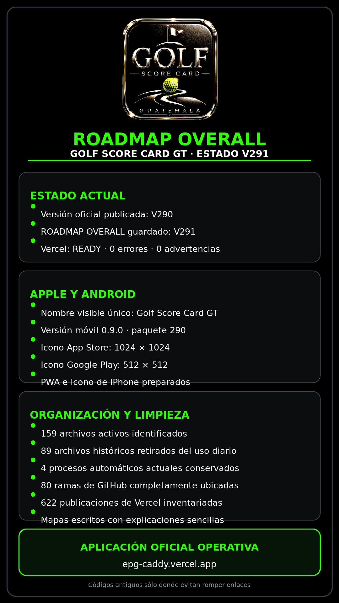

Warning: truncated output (original token count: 161452)
Total output lines: 4562

## R242 · Organizador 48H muestra sólo tarjetas Live activas · 9 de octubre de 2026

- `api/event-administration.js`: los accesos 48H sin Score Card real dejan de devolverse como tarjetas visibles; sólo pasan grupos con `current_snapshot.players` válido.
- `event-administration-ui.js`: Administración filtra `GRUPOS INVITADOS 48H` antes de pintar, elimina `SIN TARJETA LIVE AÚN` y conserva el título por primer jugador registrado, por ejemplo `CHINITO`.
- `live.html` y `event-administration-ui.js`: aíslan las capas de scroll de la tarjeta Live compartida y de la tarjeta Live 48H abierta desde Organizador para que la gráfica superior no reciba interferencia de contenido inferior.
- `test-r237-cross-environment-48h-invitations.mjs`, `test-r242-guest48h-only-live-groups.mjs` y `test-r242-live-scroll-layering.mjs`: actualizan el contrato para que LAB y Producción reflejen la misma tarjeta Live activa, no los accesos pendientes históricos y mantengan scroll/capas independientes.
- `release.json`, `index-grupal.html` y `service-worker.js`: identidad R242 y caché sincronizado.

## R241 · Reintento automático moderado cuando Neon está sin cuota · 9 de octubre de 2026

- `directory-auto-refresh.js`: el refresco automático de directorios administrativos pasa de 5 segundos a 60 segundos y agrega espera de 5 minutos cuando el backend devuelve `DATABASE_QUOTA_EXCEEDED`.
- `event-administration-ui.js`: el Organizador propaga el código de cuota agotada al monitor automático y muestra `REINTENTO EN 5 MIN · BASE DE DATOS SIN CUOTA`.
- `test-r172-directory-auto-refresh.mjs`: amplía el candado para exigir intervalo normal de 60 segundos y backoff de 300 segundos ante cuota agotada.
- `release.json`, `index-grupal.html` y `service-worker.js`: identidad R241 y caché sincronizado.
- Alcance: R241 reduce consumo/reintentos; no puede recuperar las listas hasta que Neon restaure cuota, plan o facturación del proyecto.

## R240 · Diagnóstico explícito de cuota Neon · 9 de octubre de 2026

- `api/_lib/service-errors.js`: clasifica errores de proveedor que llegan como HTTP 402/cuota agotada y los normaliza como `DATABASE_QUOTA_EXCEEDED`.
- `api/tournament-score-directory.js` y `api/event-administration.js`: dejan de esconder el 402 de Neon detrás de `TOURNAMENT_DIRECTORY_UNAVAILABLE` o `ADMIN_UNAVAILABLE`; responden 503 con código explícito para diagnóstico operativo.
- `event-administration-ui.js`: Organizador muestra `BASE DE DATOS SIN CUOTA · NEON 402 · ACTUALIZA EL PLAN O LA CUOTA` cuando el backend no puede leer la base por cuota.
- `test-r240-database-quota-diagnostics.mjs` y `scripts/build-manual-lab.mjs`: agregan regresión obligatoria para impedir que el estado de cuota agotada vuelva a quedar como error genérico.
- `release.json`, `index-grupal.html` y `service-worker.js`: identidad R240 y caché sincronizado.

## R239 · Organizador vuelve a listar torneos y rondas · 9 de octubre de 2026

- `event-administration-ui.js`: se revierte el filtro que dejaba pasar sólo `tournament`; Administración vuelve a mostrar `tournament` y `private` de LAB/Producción bajo `TORNEOS Y RONDAS`, conservando Scores General/Categorías, compartir código, eliminar y la sección separada `GRUPOS INVITADOS 48H`.
- `event-administration-ui.js`: la consulta al directorio global vuelve a pedir `includeGroups:true` para que las rondas/grupos activos federados no desaparezcan de LAB ni Producción.
- `test-r185-round-delete-ui.mjs`, `test-r167-admin-share-feedback.mjs`, `test-r177-cross-device-admin.mjs` y `test-r181-global-groups-directory.mjs`: las regresiones ya no protegen el listado sólo de torneos; ahora exigen que las rondas/grupos privados ordinarios aparezcan junto con los torneos.
- `release.json`, `index-grupal.html` y `service-worker.js`: identidad R239 y caché sincronizado para entregar la corrección por ACTUALIZAR.
- `CONTROL_PROYECTO_SCIRE/INVENTARIOS_V311.lock.json`: resellado sin `package-lock.json` local transitorio para que Vercel valide las mismas 940 fuentes que el repositorio remoto.

## R238 · LAB espejo firmado de accesos 48h de Producción · 9 de octubre de 2026

- `api/event-administration.js`: LAB deja de depender de que la cookie local sirva en Producción para leer `GRUPOS INVITADOS 48H`; agrega la acción interna firmada `list-peer-guest48h` y usa `EVENT_ADMIN_PEER_SECRET` o `CRON_SECRET` para traer los accesos activos desde el ambiente dueño.
- `test-r237-cross-environment-48h-invitations.mjs`: amplía el candado para exigir ruta peer firmada, encabezado `Authorization: Bearer` y lectura directa de grants 48h del ambiente propietario.
- `test-r227-guest48h-organizer-groups.mjs`: actualiza el control heredado para aceptar imports extendidos y fechas de release R238 sin perder la verificación de grupos invitados.
- `release.json`, `index-grupal.html` y `service-worker.js`: identidad R238 y caché sincronizado para forzar actualización visible en LAB instalado, alias LAB y Producción.

## R230 · Access propietario sólo comparte app 48 horas · 8 de octubre de 2026

- `access.html`: el panel propietario queda reducido a una sola opción visible: `COMPARTIR APP 48 HORAS`; se retiran código para jugador, actividad anónima y textos de consulta.
- `test-r230-owner-access-48h-only.mjs`: nuevo candado para impedir que vuelvan opciones ajenas a la invitación 48h.
- `scripts/build-manual-lab.mjs`, `release.json`, `service-worker.js` e `index-grupal.html`: incorporan R230 al banco obligatorio, badge visible, meta release y caché PWA.

## R229 · Organizador abre tarjeta Live de grupos invitados 48h · 8 de octubre de 2026

- `event-administration-ui.js`: las tarjetas compactas de `GRUPOS INVITADOS 48H` ya no usan el nombre del grupo como identificador; muestran como título el primer jugador registrado en la Score Card.
- `event-administration-ui.js`: al tocar `ABRIR TARJETA LIVE`, Organizador abre una tarjeta digital completa tipo Live con 18 hoyos, nombres verdes en mayúsculas, `RESULTADOS ACUMULADOS` y `+/- POR HOYO`.
- `event-administration.html`: el diálogo de Organizador se amplía para tarjeta Live móvil, con tabla horizontal y sin el resumen de bullets como vista principal.
- `test-r229-organizer-guest48h-live-card.mjs`: nuevo candado para vista Live desde Organizador y título por primer jugador.
- `scripts/build-manual-lab.mjs`, `release.json`, `service-worker.js` e `index-grupal.html`: incorporan R229 al banco obligatorio, badge visible, meta release y caché PWA.

## R228 · Tarjeta Live 48h sin traslape y con resultados acumulados · 8 de octubre de 2026

- `live-view.js`: la tarjeta Live compartida por el invitado 48h deja de mostrar el título del grupo, mantiene campo/fecha/modalidad, cambia `+ / −` a `+/- POR HOYO` y agrega el separador `RESULTADOS ACUMULADOS` entre la tabla de 18 hoyos y los totales.
- `live.html`: corrige el montaje superior de la vista Live reservando espacio seguro para cerrar/menú; los nombres de jugadores quedan en mayúsculas, verdes y sin subrayado.
- `test-r228-live-48h-shared-card-layout.mjs`: nuevo candado para tarjeta Live 48h compartida, nombres, título eliminado, `RESULTADOS ACUMULADOS`, `+/- POR HOYO` y traslape superior.
- `scripts/build-manual-lab.mjs`, `release.json`, `service-worker.js` e `index-grupal.html`: incorporan R228 al banco obligatorio, badge visible, meta release y caché PWA.

## R227 · Grupos invitados 48h visibles en Organizador · 8 de octubre de 2026

- `api/_lib/app-access.js`: el feedback de invitados 48h ahora persiste filas independientes en `app_access_guest_groups`, una por dispositivo/grupo, sin perder el `current_snapshot` legacy del enlace.
- `index-grupal.html`: cada Score Card invitada genera un `guestGroupId` estable y sigue usando la tarjeta normal para registrar hasta seis jugadores y sus scores.
- `api/event-administration.js`: la acción `list` del Organizador devuelve `guestGroups` para propietario, mezclando LAB/Producción cuando el ambiente par responde.
- `event-administration-ui.js`: Organizador muestra la sección `GRUPOS INVITADOS 48H` con una tarjeta por grupo, jugadores, hoyos, gross/neto y vencimiento del enlace; el invitado 48h conserva Organizador bloqueado.
- `test-r227-guest48h-organizer-groups.mjs` y `test-r222-guest-48h-shared-link.mjs`: regresión permanente para múltiples grupos por enlace compartido y visualización en Organizador.
- `scripts/build-manual-lab.mjs`, `release.json`, `service-worker.js` e `index-grupal.html`: incorporan R227 al banco obligatorio, badge visible, meta release y caché PWA.
- `CONTROL_PROYECTO_SCIRE/01_DIRECTRICES_PEDIDOS_Y_ORDENES_PENDIENTES/REGISTRO_REINCIDENCIAS_CALIDAD.md`, `CONTROL_PROYECTO_SCIRE/MAPA_MAESTRO_DE_ARCHIVOS.md` y `CONTROL_PROYECTO_SCIRE/INVENTARIOS_V311.lock.json`: registran RC-141, mapa de archivos R227 y sello de inventario de la publicación.

## R226 · WhatsApp con código precargado y bloqueo robusto invitado 48h · 8 de octubre de 2026

- `whatsapp-invitations.js`: los enlaces fallback de invitación ahora incluyen `codigo=<CÓDIGO>` en la URL de Registro; el texto indica que el código ya va cargado y no depende de copiar/pegar desde WhatsApp.
- `personal-events.js`: al abrir `index-grupal.html?inicio=1&codigo=...`, el código se lee, se limpia de la barra del navegador, se precarga en el modal y se inspecciona automáticamente para preparar el Registro del torneo.
- `live-control.js` y `live-share.js`: cuando `COMPARTIR LIVE` sale desde la Score Card conectada a un torneo, comparte el stream de esa ronda/grupo, no el acceso viewer al torneo completo.
- `api/_lib/live-share.js`: el canje Live de un invitado queda limitado al `issuer_stream_id`; no puede listar otros grupos ni otros torneos en curso.
- `test-r226-whatsapp-entry-code-prefill.mjs` y `test-lab-code-entry.mjs`: regresión permanente para enlace con código precargado, autoinspección, guardas de panel invitado y Live limitado a la Score Card compartida.
- `scripts/build-manual-lab.mjs`, `release.json`, `service-worker.js` e `index-grupal.html`: incorporan R226 al banco obligatorio, badge visible, meta release y caché PWA.
- `test-lab-private-round-share-flow.mjs`: el gate de despliegue queda alineado con el texto R226 de WhatsApp y la URL `inicio=1&codigo=...`, para no volver al flujo de copiar/pegar manual.

## R225 · Invitado 48h sin Organizador y con Live permitido · 8 de octubre de 2026

- `guest-access.js`: el modo invitado 48h conserva `COMPARTIR LIVE` y bloquea sólo controles privados/propietarios.
- `shortcuts-ui.js`: el menú del invitado 48h no muestra `ORGANIZADOR` y bloquea accesos directos a administración, ID de torneo o creación de torneo.
- `live-control.js`: el invitado puede compartir Live de su ronda, pero no ve herramientas de organización de torneo dentro del panel Live.
- `event-administration.html`, `event-administration-ui.js` y `api/event-administration.js`: la ruta directa y la API de administración quedan bloqueadas para cookie invitada 48h; `remote-share` queda permitido para no romper `Compartir Live`.
- `test-r225-guest-48h-no-organizer-live-allowed.mjs` y `test-r18-owner-guest-24h-access.mjs`: regresión permanente para Live permitido y Organizador bloqueado.
- `release.json`, `service-worker.js` e `index-grupal.html`: publican identidad `20261008-R225`.

## R224 · Score Card pública sin botones propietarios de prueba 48h · 8 de octubre de 2026

- `index-grupal.html`: retira de la barra pública los botones `PRUEBA · 48 H` y `VER PRUEBA 48 H`, elimina la consulta propietaria `app-access?action=status` y deja la Score Card sin controles de laboratorio en Producción.
- `index-grupal.html`: al regresar a Registro desde una ronda activa, muestra `AGREGAR JUGADOR` si hay menos de seis; el nuevo jugador se registra en la misma hoja y entra desde el siguiente hoyo sin borrar scores existentes.
- `access.html`: conserva el panel privado autenticado para crear enlaces temporales de 48 horas y revisar actividad anónima; no vuelve a ser puerta de entrada de Registro.
- `test-r224-scorecard-no-48h-owner-controls.mjs`, `test-r224-registration-add-active-player.mjs`, `test-v263-compact-players-back-button.mjs`, `test-owner-invitation-ui.mjs`, `test-r18-owner-guest-24h-access.mjs`, `test-lab-account-gate.mjs`, `test-lab-r60-physical-matrix.mjs`, `test-manual-startup-sharing.mjs` y `test-v311-live-support-link.mjs`: bloquean que los controles propietarios vuelvan a aparecer en el scorecard y que Registro vuelva a impedir altas posteriores hasta seis.
- `scripts/build-manual-lab.mjs`: incorpora la regresión R224 al banco obligatorio.
- `release.json`, `service-worker.js` e `index-grupal.html`: publican identidad `20261008-R224`.

## R223 · Handicap negativo con tecla visible para Campeonato y A · 8 de octubre de 2026

- `index-grupal.html`: el campo HDCP de Registro cambia a captura textual con patrón `-?[0-9]*` y agrega una tecla visible `-` por jugador para no depender del teclado iPhone.
- `index-grupal.html`: el motor conserva el cálculo inverso de handicap negativo; un jugador con `-2` entrega golpes al campo y su neto aumenta en los hoyos correspondientes.
- `index-grupal.html`: la fila HDCP marca visualmente los golpes entregados con círculo amarillo punteado y la consulta de voz responde `entrega` cuando el jugador tiene handicap bajo cero.
- `test-r223-negative-handicap-campeonato-a.mjs`: valida Campeonato/A, tecla `-`, captura `-2`, distribución de golpes negativos y neto inverso.
- `scripts/build-manual-lab.mjs`: incorpora la regresión R223 al banco obligatorio.
- `release.json`, `service-worker.js` e `index-grupal.html`: publican identidad `20261008-R223`.

## R222 · Prueba de fuego 48h con cinco grupos visibles para organizador · 8 de octubre de 2026

- `api/_lib/app-access.js` y `api/app-access.js`: el enlace temporal ahora es compartido por 48 horas, admite hasta 5 aperturas controladas, conserva sesiones ya redimidas y se elimina al vencer.
- `guest-access.js`: la sesión invitada 48h queda aislada y sin botones de compartir, Live público, envío de tarjetas ni herramientas propietarias.
- `index-grupal.html`: el propietario tiene `PRUEBA · 48 H` para generar un solo enlace y `VER PRUEBA 48 H` para ver los grupos invitados por separado con jugadores, hoyos y totales de score card.
- `test-r222-guest-48h-shared-link.mjs`: valida enlace único 48h, cupo 5, purga por vencimiento, telemetría sin consumir cupos y tarjetas de grupo visibles para el propietario.
- `test-lab-r60-physical-matrix.mjs`: actualiza el candado físico para reconocer `PRUEBA · 48 H` como la invitación opcional vigente sin bloquear entrada libre.
- `test-owner-invitation-ui.mjs`: actualiza la regresión del botón propietario a 48h y cubre que el nuevo botón `VER PRUEBA 48 H` no rompa el flujo de compartir.
- `CONTROL_PROYECTO_SCIRE/INVENTARIOS_V311.lock.json`: resella el inventario R222 con el ajuste del gate físico.
- `release.json`, `service-worker.js` e `index-grupal.html`: publican identidad `20261008-R222`.

## R221 · Compartir Live de directorio usa enlace público y gate de paridad · 8 de octubre de 2026

- Regresión física reportada en Producción: al pulsar `COMPARTIR LIVE` sobre un evento LAB de directorio, aparecía `NO SE PUDO VALIDAR EL ACCESO LIVE`, mientras LAB abría el modal de código.
- `live-hub.js`: si Scores viene de `directory_lab_*` o `directory_production_*`, el botón ya no intenta generar un código privado con cookie del otro ambiente; comparte el enlace público Live del dominio dueño del evento.
- `test-lab-code-entry.mjs`: bloquea que el flujo de Scores de directorio vuelva a usar validación privada para compartir.
- `CONTROL_PROYECTO_SCIRE/ARQUITECTURA_PARIDAD_LAB_PRODUCCION.json` y `test-r221-lab-production-architecture-parity.mjs`: agregan gate 360 de paridad LAB/Producción para release, PWA/cache, entrada pública, acceso personal, directorios, Live, base aislada, permisos y documentación.
- `test-v353-live-hub.mjs`: mantiene prohibido exponer el nombre interno en LIVE, pero permite el dominio técnico canónico `epg-caddy.vercel.app` necesario para paridad de enlaces públicos.
- `scripts/build-manual-lab.mjs`, `release.json`, `service-worker.js` e `index-grupal.html`: integran el gate y publican identidad `20261008-R221`.

## R220 · Compartir Live usa relay remoto y evita SIN CONEXIÓN · 8 de octubre de 2026

- Regresión física reportada en iPhone: al pulsar `COMPARTIR LIVE` en Scores General, aparecía `SIN CONEXIÓN · CONSERVANDO LOS ÚLTIMOS SCORES`.
- `live-share.js`: cuando el torneo pertenece a otro ambiente (`source` distinto al dominio actual), ya no llama directo cross-origin a `/api/personal-events`; usa el relay same-origin `/api/event-administration` con `action:'remote-share'`.
- `test-lab-code-entry.mjs`: agrega regresión para producción compartiendo un evento LAB y exige payload `remote-share` sin caer en `NETWORK_ERROR`.
- `release.json`, `service-worker.js` e `index-grupal.html`: identidad visible/cache en `20261008-R220`.

## R219 · Compartir Live acciona desde directorio LAB · 8 de octubre de 2026

- Regresión física reportada en iPhone: `COMPARTIR LIVE` aparece en Scores General, pero al tocarlo no abre el modal ni genera código cuando el torneo viene del directorio LAB.
- `live-hub.js`: agrega descriptor para `directory_lab_<eventId>` / `directory_production_<eventId>` y pasa a `GSCOneUseLive.share()` el `eventId`, `eventKind` y `source` reales.
- `live-share.js`: acepta eventos source-aware y llama `GSCPersonalEvents.request('share-code', {eventId,eventKind,source})` sin exigir `publisherSecret` legacy.
- `test-lab-code-entry.mjs`: reproduce `directory_lab` sin publisher legacy y exige enlace `/code-entry.html?visitor=1#code=...`.
- `release.json`, `service-worker.js` e `index-grupal.html`: identidad visible/cache en `20261008-R219`.

## R218 · Compartir Live vuelve a funcionar en Scores personales · 8 de octubre de 2026

- Regresión reportada en iPhone: tras R217, el botón `COMPARTIR LIVE` visible en Scores General no accionaba.
- `live-share.js`: la ruta personal de torneo usa `GSCPersonalEvents.request('share-code')` sin exigir `publisherSecret`; la exigencia de publisher queda sólo para enlaces LIVE legacy.
- `live-hub.js`: el botón de Scores se habilita cuando el evento personal existe, no únicamente cuando hay stream publisher local.
- `test-lab-code-entry.mjs`: agrega regresión para compartir desde Scores personales sin publisher legacy y bloquea que el botón dependa sólo del secreto LIVE.
- `release.json`, `service-worker.js` e `index-grupal.html`: identidad visible/cache en `20261008-R218`.

## R217 · WhatsApp de codigo de un solo uso abre con codigo precargado · 8 de octubre de 2026

- Problema fisico: el mensaje de WhatsApp para invitado mostraba un codigo largo de un solo uso separado del enlace; en iPhone/WhatsApp no era practico seleccionarlo sin copiar todo el mensaje.
- `live-share.js`: el enlace compartido ahora incluye `#code=...` y el texto indica tocar el enlace y luego ENTRAR; el codigo queda como respaldo, no como accion principal.
- `code-entry.js`: al abrir el enlace, precarga el codigo en el campo, limpia el fragmento visible y no redime hasta que el invitado toque ENTRAR.
- `test-lab-code-entry.mjs`: bloquea la regresion, exige enlace con codigo precargado y confirma que abrir el enlace no consume el codigo.
- `release.json`, `service-worker.js` e `index-grupal.html`: identidad visible/cache en `20261008-R217`.

## R216 · Scores de torneo sin panel global de grupos/rondas activos · 8 de octubre de 2026

- Pedido visual del propietario: en Scores General, Scores por Categoría y Buscar Jugador se elimina el bloque blanco de grupos/rondas activos, incluyendo lista global, nombres de grupos y hora de actualización.
- `live-hub.html` retira el panel `global-live-directory`; `live-hub.js` deja de refrescar esa lista desde la pantalla de Scores.
- Se conservan botones de Scores, búsqueda, filtros, favoritos y tablas; `test-r216-live-hub-no-global-directory-panel.mjs` bloquea la reaparición del panel.
- Cierre de despliegue: se repara el blob remoto de `index-grupal.html` y este commit vuelve a incluir ROADMAPS e inventario en la misma modificación para cumplir los gates de Vercel.

## R215 · No purgar torneos locales por lista remota vacia · 8 de octubre de 2026

- Sintoma fisico: el telefono quedo sin torneos visibles despues de respuestas de Produccion/LAB con directorio remoto vacio o sin el evento esperado.
- `personal-events.js`: `sync()` ya no convierte `removedEvents` de la accion `list` en borrado fisico local; una ausencia remota transitoria no elimina ronda activa, archivo local, hub ni codigos guardados.
- Seguridad conservada: `purgeDeletedEvents()` sigue disponible para eliminaciones explicitas y la limpieza de streams se conserva separada.
- Regresion: `test-r215-personal-list-no-local-purge.mjs` reproduce lista vacia + torneo local existente y exige que no haya evento `gsc-events-removed`; `test-event-total-purge.mjs` mantiene la purga explicita.
- Release: `release.json`, `index-grupal.html`, `service-worker.js` y cache suben a `20261008-R215` para forzar descarga del cliente corregido.
- Archivos: `personal-events.js`, `test-r215-personal-list-no-local-purge.mjs`, `scripts/build-manual-lab.mjs`, `release.json`, `index-grupal.html`, `service-worker.js`, `CONTROL_PROYECTO_SCIRE/01_DIRECTRICES_PEDIDOS_Y_ORDENES_PENDIENTES/REGISTRO_REINCIDENCIAS_CALIDAD.md`, `ROADMAP_OVERALL.md`, `ROADMAP_A_DETALLE.md` e `CONTROL_PROYECTO_SCIRE/INVENTARIOS_V311.lock.json`.

## R214 · Reparar gate de entrega tras eliminar 403 textual · 8 de octubre de 2026

- `test-update-delivery-control.mjs` y `test-personal-storage-access.mjs`: el recorte de prueba de `manualAppNavigation` ya no depende de `authorizedPersonalNavigation`, y la navegacion personal sin membresia inmediata carga shell en vez de 403 textual.
- `service-worker.js`, `index-grupal.html` y `release.json`: release visible y cache suben a `20261008-R214` para forzar instalacion nueva con la correccion R213 completa.
- Alcance: no cambia reglas de torneo ni APIs privadas; desbloquea el build para publicar el parche que evita la pantalla negra `Acceso personal no autorizado`.
- Cierre de publicacion: `release.json` queda en `R214-NO-RAW-PERSONAL-403` e inventario resellado para que Vercel no bloquee el despliegue por sello viejo.
- `scripts/inventory-gate.mjs`: en Vercel valida exclusivamente fuentes versionadas para que dependencias generadas durante `install` no cambien falsamente el digest.
- Cierre atomico: ROADMAPS e inventario viajan juntos en el ultimo commit para cumplir el gate remoto antes de aliasar LAB y Produccion.
- `scripts/rebuild-inventory-pdfs.py`: usa la misma lista de fuentes que el gate bajo `VERCEL=1` al resellar desde el arbol versionado.

## R213 · Eliminar pantalla cruda de acceso personal no autorizado · 8 de octubre de 2026

- Sintoma fisico: Produccion mostro una pantalla negra con texto plano `Acceso personal no autorizado` al abrir la Score Card asignada.
- Archivos modificados: `service-worker.js`, `middleware.js`, `index-grupal.html`, `release.json`, `test-live-share-middleware.mjs`, `test-lab-update-recovery.mjs`, `CONTROL_PROYECTO_SCIRE/INVENTARIOS_V311.lock.json`.
- Correccion: la navegacion personal carga el shell de la app; las APIs siguen validando membresia antes de leer/publicar datos privados.
- Control: pruebas de middleware y recuperacion de update actualizadas para bloquear regresion de pantalla 403 textual.

## R212 · Navegacion de Score Card asignada sin cuenta explicita · 8 de octubre de 2026

- Fallo fisico reportado sobre Produccion R211: despues de ingresar codigo, el telefono quedo en pagina negra con texto plano `Acceso personal no autorizado`.
- Causa raiz: la navegacion a `/index-grupal.html?personalEvent=...` podia llegar sin `personalAccount`; `middleware.js` exigia igualdad contra cuenta ausente y devolvia 403 antes de dejar que la Score Card cargara.
- Correccion: `middleware.js` ahora consulta `/api/personal-events` como antes, pero si la sesion vigente autoriza el evento y falta `personalAccount`, redirige a la misma Score Card completando `personalAccount` y `manual_action=personal-scorecard`. Los visores sin jugadores se redirigen al monitor `live-hub.html`.
- Regresion: `test-live-share-middleware.mjs` cubre tarjeta asignada sin cuenta, redireccion reparada, visor read-only al hub y mantiene 403 cuando hay cuenta explicita incorrecta.
- Release: `release.json`, `index-grupal.html` y `service-worker.js` sincronizados como `20261008-R212`.
- Cierre de despliegue: se resella `INVENTARIOS_V311.lock.json` sobre el HEAD remoto exacto para incluir el parche cliente vigente en `personal-events.js`.
- Estado: pendiente regenerar inventario, gates y despliegue LAB/Produccion.

## R211 · Codigo de torneo no queda sombreado por sesion de codigo · 8 de octubre de 2026

- Fallo fisico reportado sobre Produccion R210: el modal `INGRESE EL CODIGO` con codigo `D50F9059FD` respondio `NO SE PUDO PREPARAR EL EVENTO · REINTENTA`.
- Causa raiz: R210 recuperaba sesiones de codigo vencidas, pero una `gsc_code_session` todavia valida podia quedar primero que la identidad de Score Card y bloquear `join-code` antes de crear/usarse el dispositivo que debe recibir la membresia del grupo.
- Correccion: `resolveEventIdentity()` para `inspect-tournament-code` y `join-code` usa el dispositivo vigente si existe; si no existe y la accion es entrada segura por codigo de torneo, crea `gsc_event_device` antes de consultar la sesion de codigo. `list/read` priorizan dispositivo cuando ya existe y conservan sesiones de visor cuando no hay dispositivo.
- Regresion: `test-lab-device-event-identity.mjs` cubre sesion de codigo valida coexistente, sesion de codigo valida sin dispositivo, sesion vencida, inspeccion sin consumo, consumo solo al unir y lectura aislada por dispositivo.
- Cierre de despliegue: el primer commit remoto R211 fallo por lock de inventario no coincidente y el segundo por no tocar ROADMAPS junto al lock. Este commit registra ROADMAPS y lock en la misma modificacion.
- Estado: candidato R211 sobre la linea activa R210 de Produccion; gates y despliegue pendientes.

## R210 · redeploy con GSC_ENVIRONMENT production en Produccion · 8 de octubre de 2026

- R209 estaba correcto en codigo, pero el proyecto Produccion no tenia `GSC_ENVIRONMENT`; por eso seguia evaluando como preview generico.
- Accion operativa: se agrego `GSC_ENVIRONMENT=production` en el proyecto `epg-caddy` para targets production y preview.
- Release: R210 fuerza redeploy para cargar esa variable nueva en runtime.
- Verificacion esperada: Produccion deja de responder `PERSONAL_ACCESS_NOT_ENABLED`.

## R209 · Produccion aliasada requiere GSC_ENVIRONMENT production · 8 de octubre de 2026

- R208 fallo el test porque la regla era demasiado amplia: un preview con flag de Produccion no debe activarse sin declarar que sirve Produccion.
- Correccion: `personalAccessEnabled` usa `GSC_ENVIRONMENT=production` para permitir que un deployment tecnico preview, aliasado al dominio publico de Produccion, use `GSC_PERSONAL_ACCESS_PRODUCTION_READY`.
- El comportamiento previo se conserva: preview sin `GSC_ENVIRONMENT=production` no se activa con el flag de Produccion.
- Estado: candidato R209 para build, alias y verificacion directa del endpoint Produccion.

## R208 · backend acepta READY de Produccion aunque Vercel sea preview · 8 de octubre de 2026

- R207 cargo el release, pero Produccion seguia devolviendo `PERSONAL_ACCESS_NOT_ENABLED`.
- Causa raiz de codigo: `personalAccessEnabled` solo usaba `GSC_PERSONAL_ACCESS_PRODUCTION_READY` cuando `VERCEL_ENV==='production'`; el dominio publico estaba aliasado a un deployment de rama con `VERCEL_ENV=preview`.
- Correccion: el backend habilita acceso personal si esta activo `GSC_PERSONAL_ACCESS_PRODUCTION_READY` o `GSC_PERSONAL_ACCESS_LAB_READY`, independientemente del target tecnico.
- Estado: candidato R208 para publicar y verificar endpoint de Produccion.

## R207 · Produccion activa acceso personal en deployments publicados por alias · 8 de octubre de 2026

- Reproduccion fisica: en Produccion R206 el codigo `9FCE819496` devuelve `CODIGO INCORRECTO O TORNEO VENCIDO`.
- Diagnostico real: el endpoint de Produccion respondia `PERSONAL_ACCESS_NOT_ENABLED`; la app reintentaba LAB y terminaba mostrando `LIVE_JOIN_CODE_INVALID`.
- Correccion operativa: `GSC_PERSONAL_ACCESS_PRODUCTION_READY` queda aplicado a `production` y `preview`, porque los alias publicos apuntan a deployments de rama.
- Release: R207 fuerza redeploy para que Produccion cargue la variable en runtime.

## R206 · score card asignada conserva respuesta join-code · 8 de octubre de 2026

- Reproduccion fisica R205: el iPhone muestra `VERSIÓN R205`, pero al ingresar el codigo queda otra vez en `SCORE CARD ASIGNADA · NO SE PUDO PREPARAR EL EVENTO`.
- Causa raiz final: `index-grupal.html` llamaba `openAssignedCard({eventId,eventKind})` y descartaba `membership`, `configuration`, `source` y `accountCode` devueltos por `join-code`; por eso el fallback de R205 nunca tenia datos.
- Correccion: la llamada conserva el resultado completo de join-code; el flujo de grupo conectado tambien usa la respuesta de join-code si el read inmediato falla.
- Estado: candidato R206 para publicar en LAB y Produccion.

## R205 · badge visible sincronizado con release · 8 de octubre de 2026

- Motivo: el build R204 avanzo hasta `build-manual-lab`, pero `test-update-delivery-control.mjs` bloqueo porque el primer badge visible seguia en `VERSIÓN R201` mientras el release declarado era R204.
- Correccion: se sincroniza el badge HTML estatico con R205, junto con metadata, service worker, release e inventario.
- Alcance funcional conservado: recuperacion de score card asignada desde join-code cuando el read inmediato falla.
- Estado: candidato R205 para despliegue LAB/PROD.

## R204 · inventario sellado para score card asignada · 8 de octubre de 2026

- Motivo: R203 paso proyecto y ROADMAP, pero `inventory-gate` bloqueo el build porque el sello no reflejaba los archivos activos posteriores al fix.
- Accion: se recalcula `CONTROL_PROYECTO_SCIRE/INVENTARIOS_V311.lock.json` junto con codigo, ROADMAPS y versionado en la misma modificacion.
- Alcance funcional conservado: score card asignada por codigo de torneo usa fallback de join-code cuando el read inmediato aun no responde.
- Estado: candidato R204 para publicar en LAB y PROD.

## R203 · commit atomico score card asignada y ROADMAPS · 8 de octubre de 2026

- Ajuste de publicación: el gate exige que codigo, ROADMAPS y versionado viajen en la misma modificacion; R202 quedo documentado pero separado por commits.
- Correccion funcional incluida: join-code entrega cuenta/membresia y la apertura de score card usa esos datos como respaldo cuando el read inmediato todavia no esta listo.
- Alcance: no borra scores, no recrea el torneo y mantiene el codigo consumido por el mismo dispositivo.
- Estado: candidato de build atomico para publicar en LAB y PROD.

## R202 · score card asignada recupera preparación tras join-code · 8 de octubre de 2026

- Reproducción física del usuario en LAB R201: el código LAB `6D5ECEC172` avanzó hasta `SCORE CARD ASIGNADA`, pero falló con `NO SE PUDO PREPARAR EL EVENTO · REINTENTA`.
- Causa raíz: el backend consumía el código y creaba la membresía, pero la lectura inmediata podía quedar sin sesión/membresía visible para el cliente; el cliente descartaba el resultado de join-code y no podía preparar la tarjeta asignada.
- Corrección: `joinPersonalTournamentCode` devuelve `accountCode` y `membership`; `openAssignedCard` usa esos datos como recuperación si el `read` inmediato falla y ya existe configuración de torneo.
- Release: R202 fuerza caché nueva sobre R201 para que iPhone reciba el fallback sin borrar scores ni membresías existentes.
- Estado: pendiente build Vercel posterior al gate ROADMAP.

## R201 · ingreso de torneo LAB desde Producción sobre Stableford R200 · 7 de octubre de 2026

- Causa raíz: el R200 vivo de Stableford preservaba el retry cruzado sólo para `LIVE_JOIN_CODE_INVALID`; al ingresar un código LAB desde Producción, el endpoint local devolvía `PERSONAL_ACCESS_NOT_ENABLED` y el cliente no saltaba al ambiente par.
- Corrección: `personal-events.js` reintenta el ambiente par para `LIVE_JOIN_CODE_INVALID` y `PERSONAL_ACCESS_NOT_ENABLED`.
- Release: `index-grupal.html`, `service-worker.js` y `release.json` suben a R201 para forzar instalación visible sin perder Stableford R200.
- Estado: gates dirigidos, build y publicación R201 pendientes.

## R200 · Stableford sin HDCP, Gross y Puntos · 7 de octubre de 2026

- Tarjetas Stableford Global y Personal: sin HCP, HDCP ni Neto. Gross blanco; todos los puntos verdes.
- RESULTADOS muestra VUELTA IN, VUELTA OUT y VUELTA COMPLETA con Gross y Puntos.
- Regresión: `test-card-artifacts.mjs` y `test-lab-r60-card-mode-purity.mjs`; conservan resultados de Medal Play, Match Play, Four Ball y Universales.
- Integración sobre R199 para conservar el ingreso cruzado Producción/LAB.
- Archivos: `card-artifacts.js`, `test-card-artifacts.mjs`, `test-lab-r60-card-mode-purity.mjs`, `index-grupal.html`, `service-worker.js`, `release.json`, ambos ROADMAPS, `GOLF_SCORE_CARD_GT_PENDING_MATRIX.md`, `CONTROL_PROYECTO_SCIRE/MAPA_MAESTRO_DE_ARCHIVOS.md`, `REGISTRO_REINCIDENCIAS_CALIDAD.md`, `INVENTARIOS_V311.lock.json`.
- Estado: tarjeta real comprobada en la aplicación LAB; build combinado R200 publicado.

## R196 · Texto de WhatsApp de tarjetas digitales · 7 de octubre de 2026

- Regresión: `test-lab-r60-card-share-mode-labels.mjs` verifica el texto de tres líneas en tarjetas compartidas y bloquea los rótulos anteriores.
- Al compartir cualquier tarjeta digital, el texto queda en tres líneas: `Score Card`, el campo y la fecha.
- Se aplica a tarjetas Globales, personales, del historial y envíos a jugadores; se omiten torneo, modalidad, nombres de destinatarios y SHA-256.
- El título de compartir también queda como `Score Card`.

## R195 · Corrección de tarjeta digital Medal Play · 7 de octubre de 2026

- En ambas vueltas, la fila verde muestra `PAR` una sola vez al inicio; se eliminan los totales y la `E` de esa fila.
- Se conservan los dígitos de hoyo sin rótulos adicionales y el encabezado central `RESULTADOS`.
- Los subtotales quedan como `VUELTA IN`, `VUELTA OUT` y `VUELTA COMPLETA`.
- Prueba de regresión: `test-card-artifacts.mjs`; estado de publicación se registra tras completar los despliegues LAB y Producción.

## R194 · QuickType en nombres: retirar transformación a mayúsculas · 7 de octubre de 2026

- La prueba física R193 seguía fallando aun después de actualizar el alias del Laboratorio.
- Causa raíz confirmada: reglas CSS de `.new-round-card input` y `.stableford-player-grid input` aplicaban `text-transform: uppercase` al nombre. WebKit documenta que QuickType deja de insertar candidatos en inputs con esa transformación.
- Corrección: sólo los campos de nombre de Registro y Stableford usan `text-transform: none`; las demás entradas mantienen su formato.
- Regresión `test-r194-ios-quicktype-uppercase-style.mjs` bloquea la regresión CSS; la prueba R193 valida además la persistencia del valor final.
- Estado: CSS Y PRUEBAS DIRIGIDAS PASS; BUILD INTEGRAL/PREVIEW R194 PENDIENTES; NUEVA PRUEBA IPHONE PENDIENTE; PRODUCCIÓN INTACTA.
- Recuperación de entrega R194: el control remoto detectó que el HTML se había transmitido incompleto; se restauró el archivo íntegro, se recalculó el sello desde las 924 fuentes y se relanza el build LAB. No cambia el comportamiento de la corrección.

## R193 · QuickType: aceptar y guardar la sustitución del teclado iOS · 7 de octubre de 2026

- R192 no pasó la prueba real del usuario: al tocar la palabra sugerida en iPhone, el campo no la aceptó.
- Se quitó `inputmode="text"` y `autocomplete="name"` de los nombres para dejar el teclado de texto estándar de iOS con autocorrección.
- En `beforeinput` se detecta `insertReplacementText` y se guarda el valor final en la siguiente tarea, después de que WebKit aplica la sugerencia; no se rerenderiza el campo. Aplica a Registro y Stableford.
- Regresión `test-r193-ios-quicktype-replacement.mjs`: simula evento previo a sustitución, aplicación posterior de la sugerencia y persistencia del texto final.
- Estado: REGRESIÓN Y BUILD PENDIENTES; VISTA PREVIA R193 POR GENERAR; ESPERANDO NUEVA PRUEBA FÍSICA; PRODUCCIÓN INTACTA.

## R192 · Teclado y dictado nativo del iPhone en Registro · 7 de octubre de 2026

- Causa corregida: el manejador delegado tenía un `return` truncado y no ignoraba limpiamente eventos que no pertenecían a los campos editables.
- Los nombres de Registro y Stableford declaran `autocorrect`, `spellcheck`, `autocapitalize`, `inputmode=text` y el teclado siguiente para habilitar QuickType y dictado nativo de iOS.
- El Registro conserva el texto de `insertReplacementText` literalmente, guarda el borrador al recibirlo y aplaza el analizador de frases hasta terminar la composición/dictado.
- `test-r192-ios-keyboard-entry.mjs` reproduce sugerencia, tildes, composición/dictado y persistencia; conserva el analizador de frases completas autorizado.
- La captura de micrófono propia de la página sigue bloqueada. Dictado nativo iPhone, revisión iPhone físico y publicación permanecen pendientes de aceptación física.
- Archivos R192: `index-grupal.html`, `release.json`, `service-worker.js`, `scripts/build-manual-lab.mjs`, `test-r192-ios-keyboard-entry.mjs`, `test-v355-ios-audio-dictation.mjs`, `GOLF_SCORE_CARD_GT_PENDING_MATRIX.md`, ambos ROADMAPS, `CONTROL_PROYECTO_SCIRE/01_DIRECTRICES_PEDIDOS_Y_ORDENES_PENDIENTES/REGISTRO_REINCIDENCIAS_CALIDAD.md` e `INVENTARIOS_V311.lock.json`.

## R191 · Código de torneo válido entre LAB y Producción · 7 de octubre de 2026
- Inspección y registro prueban primero el ambiente actual y, solo ante `LIVE_JOIN_CODE_INVALID`, consultan el ambiente par.
- La sesión del dispositivo se establece en el ambiente dueño del código mediante credenciales incluidas; el origen del torneo se conserva para registro, sincronización y lecturas posteriores.
- CORS admite credenciales únicamente entre `epg-caddy.vercel.app` y `golf-sc-gt-lab.vercel.app`; los demás orígenes siguen rechazados.
- Versión R191 sincronizada en `index-grupal.html`, `release.json` y `service-worker.js`.
- Regresión: `test-r191-cross-environment-tournament-entry.mjs` valida rechazo local, reintento remoto, sesión de dispositivo, persistencia del ambiente, lectura posterior y límites CORS.
- Archivos de esta entrega: `api/_lib/cors.js`, `personal-events.js`, `index-grupal.html`, `release.json`, `service-worker.js`, `test-r191-cross-environment-tournament-entry.mjs`, `scripts/build-manual-lab.mjs`, `GOLF_SCORE_CARD_GT_PENDING_MATRIX.md`, `ROADMAP_OVERALL.md`, `ROADMAP_A_DETALLE.md`, `CONTROL_PROYECTO_SCIRE/INVENTARIOS_V311.lock.json`.

## R190 · Cambio de campo desde Registro y código de ingreso del torneo · 7 de octubre de 2026
- Publicación offline R190: `index-grupal.html` y `service-worker.js` coinciden con `release.json` (`20261007-R190`).

- Regresión R190: el test incluye la declaración `async` completa de la función que verifica, evitando compilar un fragmento inválido.

- Control de versión R190: `index-grupal.html` y `release.json` publican `20261007-R190`.

- Registro de esta actualización R190: `ROADMAP_OVERALL.md`, `ROADMAP_A_DETALLE.md` y `CONTROL_PROYECTO_SCIRE/INVENTARIOS_V311.lock.json`.

- `index-grupal.html`: Registro mantiene los campos seleccionables al editar la ronda activa. Al confirmar, guarda el campo, recalcula el neto con el campo elegido, conserva gross y descarta el cierre oficial anterior para regenerarlo correctamente.
- `personal-events.js`: la confirmación de torneo ya no muestra `CONTINUAR AL SCORE CARD`; el botón queda como `CÓDIGO INGRESO`, copia el código y no navega ni asigna una tarjeta. Regresar desde WhatsApp tampoco abre una Score Card automáticamente. El flujo de grupos privados se conserva.
- Regresiones: `test-lab-edit-round-mode.mjs` verifica campo/modalidad, persistencia y renovación del resultado; `test-organizer-tournament-entry.mjs` comprueba el botón de ingreso, copia sin navegación y que el flujo de grupos privados siga intacto.
- Archivos de esta entrega: `index-grupal.html`, `personal-events.js`, `test-lab-edit-round-mode.mjs`, `test-organizer-tournament-entry.mjs`, `release.json`, `GOLF_SCORE_CARD_GT_PENDING_MATRIX.md`, `CONTROL_PROYECTO_SCIRE/MAPA_MAESTRO_DE_ARCHIVOS.md`, `CONTROL_PROYECTO_SCIRE/01_DIRECTRICES_PEDIDOS_Y_ORDENES_PENDIENTES/REGISTRO_REINCIDENCIAS_CALIDAD.md`, `CONTROL_PROYECTO_SCIRE/INVENTARIOS_V311.lock.json`, `ROADMAP_A_DETALLE.md`, `ROADMAP_OVERALL.md`.
- Pruebas de torneo/registro en build: estados de publicación se informan con sus despliegues correspondientes.

## R187 · Scores Torneo conectado a la Score Card activa · 7 de octubre de 2026

- `shortcuts-ui.js`, `index-grupal.html` y `live-hub.js`: Scores Torneo abre exclusivamente el evento asociado a la tarjeta activa; desde otras pantallas primero vuelve a esa tarjeta. Si no hay evento, no abre el directorio general. El catálogo global permanece en Administración de grupos y torneos.
- Se conserva íntegra la entrega R185 de administración/eliminación y retorno de actualización. Release nuevo R187 evita reutilizar R185 y R186.
- Aceptación: `CONTROL_PROYECTO_SCIRE/ACEPTACION_R187_SCORES_TORNEO_SCOPE.md`; pruebas de recuperación, aislamiento, catálogo global y administración.
- Integración canónica: controles `fix-v366-integrated-main` commit `46555c8a1cd230ba7020ec733ddcf204207230c6` incluidos junto con R185 y el ajuste R187; G0-12 permanente preservada.
- Archivos añadidos/ajustados en esta integración: `AGENTS.md`, `GOLF_SCORE_CARD_GT_PENDING_MATRIX.md`, `CONTROL_PROYECTO_SCIRE/01_DIRECTRICES_PEDIDOS_Y_ORDENES_PENDIENTES/MATRIZ_GATE_0_PROYECTO.md`, `CONTROL_PROYECTO_SCIRE/01_DIRECTRICES_PEDIDOS_Y_ORDENES_PENDIENTES/MATRIZ_GATE_0_PROYECTO.json`, `scripts/project-quality-gate.mjs`, `test-global-public-entry-policy.mjs`, `test-lab-deployment-gate.mjs`, `vercel.json` y `CONTROL_PROYECTO_SCIRE/INVENTARIOS_V311.lock.json`.
- Estado: build integral, Gates de proyecto/roadmap/inventario/release y regresiones R181/R163/R185 PASS. Preview y revisión pública Playwright de cuatro transiciones pendientes; Producción sin cambios por R187.

## R185 · 6 de octubre de 2026 · Eliminación de rondas y actualización al regresar

- Archivos: `app-update.js`, `service-worker.js`, `event-administration-ui.js`, `api/event-administration.js`, `api/_lib/event-administration.js`, `test-event-administration.mjs`, `test-r185-round-delete-ui.mjs`, `test-update-delivery-control.mjs`, `scripts/build-manual-lab.mjs` y `CONTROL_PROYECTO_SCIRE/INVENTARIOS_V311.lock.json`.
- LAB: cada ronda global tiene ELIMINAR RONDA con dos confirmaciones. API local/remota valida origen, ID, tipo y autoridad; elimina únicamente el stream seleccionado mediante el purgado existente. Cancelar no escribe; doble toque no duplica la petición.
- ACTUALIZAR: las páginas sin meta consultan la versión aprobada del controlador activo con respaldo acotado para controladores antiguos. La actualización completa regresa a Administración; una instalación incompleta no redirige.
- Pruebas locales de actualización y interfaz PASS. El build ejecuta además la prueba SQL de permisos, doble confirmación, ronda independiente/asociada, aislamiento de hermanos y destino remoto; estado y commit quedan en los registros del despliegue.

## R183 · 6 de octubre de 2026 · Simplificación de tarjetas de administración

- Archivos: `event-administration-ui.js`, `test-event-administration.mjs`, `test-r167-admin-share-feedback.mjs` y `CONTROL_PROYECTO_SCIRE/INVENTARIOS_V311.lock.json`.
- Se retiran de las tarjetas las líneas de tipo/origen y la nota de autorización. Se conservan nombre, Scores general/categorías, ID/código y acciones.
- Verificación del candidato: sintaxis y renderizado dirigido PASS; regresión R167 actualizada al texto aprobado. Despliegue LAB/Producción pendiente.

## R183 · 6 de octubre de 2026 · Simplificación de tarjetas de administración

- Archivos: `event-administration-ui.js`, `test-event-administration.mjs` y `CONTROL_PROYECTO_SCIRE/INVENTARIOS_V311.lock.json`.
- Se retiran de las tarjetas las líneas de tipo/origen y la nota de autorización. Se conservan nombre, Scores general/categorías, ID/código y acciones.
- Verificación del candidato: sintaxis y renderizado dirigido PASS. Despliegue LAB/Producción pendiente.

## R183 · 6 de octubre de 2026 · Simplificación de tarjetas de administración

- Archivos: `event-administration-ui.js` y `test-event-administration.mjs`.
- Se retiran de las tarjetas de torneos y grupos las líneas de tipo/origen y la nota de autorización para Scores/eliminación. Se conservan el nombre, Scores general y categorías, el ID/código y las acciones existentes.
- Verificación del candidato: sintaxis de ambos archivos y prueba dirigida del renderizado PASS. Despliegue LAB/Producción pendiente; no se declara publicado.

<!-- 2026-10-06 R178: ELIMINAR TORNEO usa texto rojo en ID de Torneos; ambos recorridos muestran CONFIRMA ELIMINAR antes de enviar el borrado. Verificación: test-event-administration.mjs, confirmación única y ausencia de petición previa. -->
## R178 · Locución de resultado par como EVEN · 6 de octubre de 2026

- Cuando el resultado relativo al par es cero, el audio dice “EVEN”. Las locuciones de resultados sobre y bajo el par se conservan.
- Archivos de esta corrección: `index-grupal.html`, `service-worker.js`, `test-lab-player-points-audio.mjs` y `CONTROL_PROYECTO_SCIRE/INVENTARIOS_V311.lock.json`.
- Conserva el punto de corte `línea 185` y la activación `23 de agosto de 2026, 17:05:00, hora de Guatemala`.

# ROADMAP OVERALL

## R174 · 6 octubre 2026 · Recuperación de Scores de torneo federado en LAB

- Reproducción física desde Organizador en LAB: la ficha Santa delfina enlazó a `directory_production_36c43fd8-594e-40e3-af6d-13bfd1863f20`; el monitor quedó en `NO SE PUDO COMPROBAR TU PARTICIPACIÓN · REINTENTA` y `NINGÚN TORNEO EN CURSO`.
- Causa: `live-hub.js` esperaba que `GSCPersonalEvents.sync()` terminara correctamente antes de procesar `directoryEvent`. Un fallo de participación local abortaba el arranque aunque el torneo federado estuviera disponible.
- Corrección mínima: la sincronización local se vuelve recuperable, se continúa con la lectura de torneo federado; su vista ya no presenta el aviso de membresía local. Los grupos privados permanecen fuera del directorio público.
- R174 · regresión física del enlace directo: la selección dependía de que el ID ya estuviera en `registeredDirectory`; con directorio vacío/parcial el ID de invitación no abría Scores. `resolveDirectoryEventToken` ahora valida y resuelve el ID `directory_{lab|production}_{uuid}` aun sin entrada precargada. `npm run scores:r174-directory-gate` PASS para lista vacía, torneo listado e ID inválido. Preview y lectura de datos reales pendientes; Producción intacta. Archivos: `live-hub.js`, `test-r174-directory-event-fallback.mjs, test-r167-admin-share-feedback.mjs`.
- Regresión: `test-r174-directory-event-fallback.mjs`; ejecutar con `npm run scores:r174-directory-gate`. verifica que el rechazo de identidad no aborte y que la selección del torneo quede alcanzable. Resultado local: PASS. Producción sin cambios. Primera construcción Preview bloqueada por ROADMAP GATE: el commit del sello de inventario no incluyó ambos ROADMAPS. Este commit vuelve a registrar ambos ROADMAPS junto con los tres PDFs y su lock, regenerados después de este asiento; ROADMAP GATE e INVENTORY GATE locales pasan. Sellado regenerado desde el checkout completo y contenido final de ambos ROADMAPS. Preview y lectura real de scores siguen pendientes.

## R144 · 30 septiembre 2026, 00:42 Guatemala · acceso Neon recuperado; publicación bloqueada

- Proyecto Neon recuperado desde captura IMG/82EFA0E8: `bold-block-51864691`; get_branch confirmó main `br-late-wind-avhgi9s3`. LAB existente `br-bold-bar-avzn813n`; candidato nuevo hijo exclusivamente LAB `br-small-mouse-av0f24o9` / `lab-live-oneuse-r144-20260930`, endpoint `ep-fragrant-pine-av6xi8hy`. No escrituras en main.
- Esquema de códigos aplicado únicamente al candidato; columna mode aditiva presente. Conector Neon: ocho solicitudes simultáneas de la sentencia CTE de consumo; una inserción y siete resultados vacíos; consulta independiente sessions=1. PASS de concurrencia SQL real, no equivale a aplicación desplegada.
- `test-live-share-neon.mjs`: prueba explícita de endpoint candidato, nunca DATABASE_URL. Ejecución local hacia Neon BLOQUEADA por DNS EAI_AGAIN; verificación CTE realizada mediante conector. Suite completa remota pendiente.
- Vercel `deploy_to_vercel`: respuesta real Tool not found, aun anunciado en catálogo. Sin credencial CLI disponible. Configuración DATABASE_URL del proyecto Vercel actual no comprobada. Nueva API sigue desactivada en remoto; no entrega ni enlace nuevo ni commit de publicación. Próxima acción: habilitar vía de configuración/despliegue Vercel y verificar LAB completo.
- Archivos de recuperación: `test-live-share-neon.mjs`, `CONTROL_PROYECTO_SCIRE/EVIDENCIAS_LIVE_R144/NEON_Y_PUBLICACION.md`, `CONTROL_PROYECTO_SCIRE/EVIDENCIAS_LIVE_R144/ESTADO.md`, `CONTROL_PROYECTO_SCIRE/CONTINUIDAD_MAESTRA_LAB.md`, `CONTROL_PROYECTO_SCIRE/INVENTARIOS_V311.lock.json`, `ROADMAP_OVERALL.md`, `ROADMAP_A_DETALLE.md`.

## R144 · 29 septiembre 2026, 23:03 Guatemala · COMPARTIR LIVE de primer uso

Última orden expresa del propietario 22:35: al tocar COMPARTIR LIVE dar un código, enviarlo y quemarlo al primer uso, como Ronda Particular. Sustituye para esta operación la propuesta de verificación telefónica/aprobación del organizador. No requiere proveedor SMS, cuenta nueva ni intervención del organizador.

- `api/live-share.js`, `api/_lib/live-share.js`: endpoint separado, validación de tarjeta inscrita autenticada, código aleatorio legible 12 caracteres, hash y vencimiento, consumo/sesión en una sentencia, cookie HttpOnly/Secure, permisos de lectura, revocación y límite de intentos. No devuelve claves del escritor o viewerToken heredado; no proxy a Producción. Enlace anterior sin usar puede ser consumido por quien lo abra primero: no se afirma prueba de identidad ni control del teléfono.
- `live-share.js`: diálogo con código, enlace/mensaje preparado para WhatsApp, compartir/copia alternativos, sesión del receptor y limpieza de fragmento; X/Escape y foco conservado. No se afirma entrega del mensaje.
- `live-hub.js`, `live-hub.html`, `private-rounds.js`, `index-grupal.html`, `scores-ui.css`, `service-worker.js`, `middleware.js`: integración en ambas pantallas existentes, destino directo, invitados sin botón, favoritos propios, detalle con evento real, nulos seguros, ayuda fija. Alta/publicación oficial y accesos privados existentes conservados.
- Se retiran los cuatro archivos locales de la propuesta no conectada de verificación por teléfono: personal-access.js, personal-access-lab.sql y sus dos pruebas; historial de esta propuesta en R144 anterior ya no es requisito vigente.
- `test-live-share-postgres.mjs`, `test-live-share-handler.mjs`, `test-live-share-middleware.mjs`, `test-live-share-browser.cjs`, `scripts/live-share-test-server.mjs`, `scripts/build-manual-lab.mjs`, `package.json`: SQL real local, primer consumo único, revocación, ámbito del evento, read-only, límite de intentos, aislamiento, regresión y navegador contra API real/base local aislada. PASS; PGlite de una conexión no sustituye prueba multi-conexión Neon. Build completo PASS, capturas 390×844 revisadas.
- Evidencia versionable en `CONTROL_PROYECTO_SCIRE/EVIDENCIAS_LIVE_R144/`: sólo fixtures de prueba y log de build, sin credenciales reales.
- Pendiente exclusivo de servicio: base LAB aislada identificada/configurada y revisión de deployment real. Health del LAB publicado devuelve 401 ACCESS_REQUIRED; no se pudo comprobar aislamiento. Flag GSC_LIVE_SHARE_LAB_READY deniega antes de DDL hasta verificación. Proveedor telefónico ya no bloquea. Sin commit de entrega, push, despliegue ni escritura remota. Producción y remoto LAB R143 intactos, confirmado por git ls-remote.
- Archivos registrados: `CONTROL_PROYECTO_SCIRE/01_DIRECTRICES_PEDIDOS_Y_ORDENES_PENDIENTES/MATRIZ_LIVE_CODIGO_UN_SOLO_USO_R144.md`, `CONTROL_PROYECTO_SCIRE/01_DIRECTRICES_PEDIDOS_Y_ORDENES_PENDIENTES/PEND_LIVE_018_GOLF_SCORE_CARD_GT_LIVE.md`, `CONTROL_PROYECTO_SCIRE/01_DIRECTRICES_PEDIDOS_Y_ORDENES_PENDIENTES/REGISTRO_REINCIDENCIAS_CALIDAD.md`, `CONTROL_PROYECTO_SCIRE/CONTINUIDAD_MAESTRA_LAB.md`, `CONTROL_PROYECTO_SCIRE/EVIDENCIAS_LIVE_R144/`, `CONTROL_PROYECTO_SCIRE/INVENTARIOS_V311.lock.json`, `CONTROL_PROYECTO_SCIRE/MAPA_MAESTRO_DE_ARCHIVOS.md`, `ROADMAP_A_DETALLE.md`, `ROADMAP_OVERALL.md`, `api/_lib/live-share.js`, `api/live-share.js`, `api/live.js`, `index-grupal.html`, `live-hub.html`, `live-hub.js`, `live-share.js`, `middleware.js`, `package.json`, `private-rounds.js`, `scores-ui.css`, `scores-ui.js`, `scripts/build-manual-lab.mjs`, `scripts/live-share-test-server.mjs`, `service-worker.js`, `test-lab-global-operational-audit.mjs`, `test-lab-medal-monitor.mjs`, `test-lab-no-production-proxy.mjs`, `test-lab-r60-production-refresh.mjs`, `test-lab-shortcuts-navigation.mjs`, `test-lab-tournament-navigation.mjs`, `test-live-share-browser.cjs`, `test-live-share-handler.mjs`, `test-live-share-middleware.mjs`, `test-live-share-postgres.mjs`, `test-manual-no-assistant.mjs`, `test-private-scores-browser.cjs`, `test-scores-ui-browser.cjs`, `test-scores-ui.mjs`.

## R144 · 30 septiembre 2026 · candidato local en curso, NO entregado

- Base recuperada: LAB R143 `013f046c44bd3b793ac86c5f02abb034c589badd`; matriz aprobada `Matriz_Acceso_Ronda_y_Torneo.md`, versión 4 de Library, 30 septiembre 2026. Producción no modificada; sin push, despliegue ni migración remota.
- Scores compartido en Torneos y Ronda Particular: título 20.25 px, logo horizontal original 145 px, metadatos reales 16 px, tabla compacta, favoritos personales y detalle por doble toque con 18 G/N en dos filas de nueve. Ausentes = —; X/Escape cierran sin cambiar filtro. Búsqueda actualiza tabla; favoritos caducados se pueden quitar.
- Regresión heredada ajustada a aprobaciones vigentes (CREAR EVENTO, GENERAL/CATEGORÍA y actualización explícita), sin retirar verificaciones de cálculo, navegación o funciones retiradas. Build técnico completo repetido tras integración de cuatro regresiones nuevas: PASS.
- Revisión Firefox 390×844: GENERAL, CATEGORÍA, estrella independiente, favorito con 18 posiciones y X/Escape PASS, sin errores JS. Evidencia local temporal `/tmp/golf-mobile-detail.png`, `/tmp/golf-mobile-favorites.png`; fixture demo identificado, no datos reales. Ronda Particular revisada mediante fixture de API aislado; no equivale a prueba de backend real.
- API LAB sin DATABASE_URL falla cerrada y no usa proxy a Producción; prueba de cero llamadas upstream PASS.
- Base de permisos personales y esquema SQL preparados, NO conectados ni aplicados: roles, caducidad, revocación, cookie HttpOnly, hashes, consumo en una sentencia CTE. Test unitario valida contrato SQL, NO certifica concurrencia real.
- Bloqueo preciso: la matriz deja pendiente selección/configuración del proveedor de verificación telefónica. No existe prueba de control del teléfono implementada, ni se ha verificado una base LAB aislada para estas tablas. Conector Neon no está asociado a un proyecto: list_branches exige project_id; repositorio/mapa no lo documentan y no hay NEON_API_KEY ni VERCEL_TOKEN local. NO activar códigos personales, sesiones, permisos o compartir LIVE como completos; el flujo heredado sigue activo en LAB remoto R143.
- Pendientes obligatorios: proveedor y prueba real, integración server/client de autorizaciones y enlace LIVE sin bearer compartido, restricción de compartir a inscritos, concurrencia y regresión end-to-end contra base LAB aislada; luego build/gates/revisión visual integral, commit y despliegue exclusivamente LAB. Sin certificación integral ni nueva entrega.
- Archivos del bloque: `scores-ui.js`, `scores-ui.css`, `index-grupal.html`, `live-hub.html`, `live-hub.js`, `private-rounds.js`, `service-worker.js`, `api/live.js`, `api/_lib/personal-access.js`, `sql/personal-access-lab.sql`, `test-scores-ui.mjs`, `test-scores-ui-browser.cjs`, `test-personal-access.mjs`, `test-lab-no-production-proxy.mjs`, `test-lab-private-rounds.mjs`, `scripts/build-manual-lab.mjs`, `test-lab-medal-monitor.mjs`, `test-lab-r60-production-refresh.mjs`, `test-manual-no-assistant.mjs`, `test-lab-tournament-navigation.mjs`, `test-lab-shortcuts-navigation.mjs`, `test-lab-global-operational-audit.mjs`, `CONTROL_PROYECTO_SCIRE/MAPA_MAESTRO_DE_ARCHIVOS.md`, `CONTROL_PROYECTO_SCIRE/CONTINUIDAD_MAESTRA_LAB.md`, `CONTROL_PROYECTO_SCIRE/INVENTARIOS_V311.lock.json`.

## R140 · 29 septiembre 2026 · nombres limpios en Ronda Particular

- `private-rounds.js`: cada fila muestra sólo el nombre del jugador; se retira el texto SCORES ACTUALIZADOS. El mensaje compartido contiene únicamente Ronda [nombre] y el código en la segunda línea, sin etiqueta. Se conservan columnas, cálculo, refresco automático y diseño.
- `live-hub.html`: botones TORNEOS REGISTRADOS y RONDAS PARTICULARES con la misma clase, tamaño y fuente; cada botón abre su lista. Se retira ELIGE UN TORNEO · PUEDES GUARDAR HASTA 5 y CREAR RONDA PRIVADA de Torneos; la creación sigue en la tarjeta.
- Corrección basada en capturas IMG_5319/IMG_5322; release y caché R140 para entregar la misma corrección en iPhone. Prueba dirigida de rondas particulares y matriz de release. Rollback LAB R139 dpl_9eTW16V8vUB5gU8fHGNF5ndcTJP9.

## R139 · 29 septiembre 2026 · Ronda Particular con nombre, código y grupos

- Alcance exclusivo: MI RONDA → RONDA PARTICULAR; creación por nombre y código compartible; RONDAS PARTICULARES en Torneos con lista, selección y código obligatorio. Se conservan diseño, botones y funciones existentes.
- `private-rounds.js`: diálogo de creación, código, ingreso y tabla Nombre | HDCP | Hoyo | Gross | Neto | +/−; actualización cada 10 segundos. +/− es neto contra par de los hoyos jugados; 79 − 14 = 65, contra par 72 resulta −7.
- `api/live.js`: tablas independientes `live_private_rounds`, `live_private_streams`, `live_private_events`, inicialización aditiva desde esquema LIVE vigente; código verificado para la ronda seleccionada, secretos sólo después de validación. Torneos, incluidos clientes anteriores, no pueden listar ni unir esas rondas.
- `live-control.js`: pertenencia y cola privateStream separadas; escritor oficial publica cambios y correcciones sin sustituir el LIVE existente; reintento online y conflicto de revisión. Creador sin tarjeta iniciada se conecta al persistir el Registro.
- Evidencia: `test-lab-private-rounds.mjs`, diálogo existente, recuperación de actualización y matriz de release. Pruebas antiguas V352/V353 fallan en supuestos previos (middleware idéntico a HEAD y fixture demo renombrado); no se declara PASS integral. Navegador local no disponible; comprobación en despliegue pendiente.
- Rollback: LAB R138 `dpl_6XBceK6sXkEqW3K94GynTNfKjJWq`, remoto `6c41fd91ce52cb9a79a86fae72ce25ecfc6235b2`; tablas nuevas no alteran datos anteriores. Maestro `epg-caddy` intacto.

## R137 · 29 septiembre 2026 · ronda privada separada de Torneos (candidato local)

- `live-hub.html` muestra CREAR TORNEO y CREAR RONDA PRIVADA en botones consecutivos. La ronda privada abre Registro conservando jugadores existentes y sin crear un torneo.
- `index-grupal.html` incorpora MI RONDA debajo de VER RONDAS GUARDADAS para regresar a la tarjeta y ver los scores del grupo; la ruta privada elimina el torneo del borrador antes de iniciar.
- `live-control.js` impide enviar una ronda sin torneo a un torneo pendiente. `live-hub.js` enruta la acción privada sin agregarla a la lista de torneos. `test-lab-round-create-modal.mjs` protege estas reglas.
- `release.json` e `index-grupal.html` avanzan a R137; `CONTROL_PROYECTO_SCIRE/INVENTARIOS_V311.lock.json` sella las fuentes actualizadas. `CONTROL_PROYECTO_SCIRE/MAPA_MAESTRO_DE_ARCHIVOS.md` registra las rutas operativas.
- Estado: pruebas dirigidas PASS; revisión de navegador y publicación LAB pendientes. Producción intacta.

## R136 · 29 septiembre 2026 · acciones de CREAR EVENTO y Registro

- El botón `EVENTO` del Registro ahora dice `CREAR EVENTO` y conserva su navegación a Torneos.
- El Registro general deja de ofrecer `VER RONDA ANTERIOR`; su reactivación desde esa pantalla también se eliminó. `VER RONDAS GUARDADAS` permanece disponible.
- Se retiró `+ JUGADOR` y su editor de altas posteriores. El editor de una ronda existente sólo muestra los jugadores ya registrados y rechaza altas por dictado; el registro inicial conserva su capacidad normal de jugadores.
- El portal de Torneos deja de generar el mensaje `ELIGE UNA FUNCIÓN O UN TORNEO`; la función limpia el estado al abrir el portal y conserva las opciones de torneos y resultados.
- Regresión: `test-lab-tournament-navigation.mjs` comprueba que la función del portal no vuelva a emitir ese mensaje.
- Regresión: `test-lab-round-create-modal.mjs`, `test-lab-tournament-navigation.mjs`, `test-v263-compact-players-back-button.mjs`, `test-v253-live-previous-round.mjs` y `test-v304-homogeneous-registration-actions.mjs`.
- Archivos: `index-grupal.html`, `live-hub.js`, `release.json`, las cinco pruebas anteriores, ambos ROADMAPS, `CONTROL_PROYECTO_SCIRE/MAPA_MAESTRO_DE_ARCHIVOS.md`, `CONTROL_PROYECTO_SCIRE/01_DIRECTRICES_PEDIDOS_Y_ORDENES_PENDIENTES/PEND_LIVE_018_GOLF_SCORE_CARD_GT_LIVE.md` e `INVENTARIOS_V311.lock.json`.
- PASS: pruebas dirigidas, build integral LAB, calidad, ROADMAP e inventario. Revisión visual en navegador y Preview siguen pendientes.
- Alcance LAB R136. Producción intacta.

## R135 · 29 septiembre 2026 · compatibilidad al vincular Friends

- Las capturas posteriores a R134 confirmaron que “Cuates” se crea, pero Torneos aún no recibe tarjetas. Causa: la unión automática usaba la acción LIVE nueva `join_tournament_by_id`, que puede no existir en el backend al que el entorno LAB deriva la llamada.
- El torneo guarda también su código de unión. Si la unión por ID no está disponible, la tarjeta intenta la acción compatible `join_tournament` con ese código; se conservan reintentos y jugadores registrados. La API protege también la acción por ID con la validación de origen de la app.
- PASS: prueba Friends, navegación TORNEOS y sincronía de release; build LAB completo; calidad, matriz de release y ROADMAP. Inventario y Preview actualizados/verificados al cerrar candidato. Producción intacta. Revisión automática de navegador y recorrido real completos pendientes.
- Archivos: `api/live.js`, `index-grupal.html`, `live-control.js`, `live-hub.js`, `release.json`, `service-worker.js`, `test-lab-round-create-modal.mjs`, `ROADMAP_OVERALL.md`, `ROADMAP_A_DETALLE.md`, `CONTROL_PROYECTO_SCIRE/MAPA_MAESTRO_DE_ARCHIVOS.md`, `CONTROL_PROYECTO_SCIRE/01_DIRECTRICES_PEDIDOS_Y_ORDENES_PENDIENTES/PEND_LIVE_018_GOLF_SCORE_CARD_GT_LIVE.md`, `CONTROL_PROYECTO_SCIRE/01_DIRECTRICES_PEDIDOS_Y_ORDENES_PENDIENTES/REGISTRO_REINCIDENCIAS_CALIDAD.md` e inventario LAB.

## R133 · 29 septiembre 2026 · conservar jugadores al crear ronda Friends

- Se corrigió el retorno de `CREAR RONDA`: ya no llama a la ruta destructiva que limpia el borrador y la tarjeta activa.
- Registro recupera primero los jugadores del borrador; si no existe, los de la tarjeta activa o el archivo más reciente. Sólo crea una ronda vacía al confirmar INICIAR RONDA.
- Regresión en `test-lab-round-create-modal.mjs` protege la ruta de retorno, el guardado del roster y el inicio automático sin borrar jugadores. Preview pendiente de publicar y verificar; Producción intacta.
- Archivos: `live-hub.js`, `index-grupal.html`, `release.json`, `service-worker.js`, `test-lab-round-create-modal.mjs`, ambos ROADMAPS, registro de reincidencias e inventario LAB. Release LAB R133.

## R132 · 28 septiembre 2026 · conexión de Friends y lista directa

- Al confirmar la ronda creada en Torneos, el Registro configura el torneo para conectar automáticamente la tarjeta cuando la ronda queda guardada; el grupo y sus jugadores se publican en el evento Friends.
- Al tocar ese evento en Torneos, se muestra directamente la lista `NOMBRE · HDCP · HOYO · GROSS · NETO · +/-`, en la tipografía compartida con las tarjetas y todo en mayúsculas: mejor score primero y, en empate, el hoyo actual más avanzado. Esta vista compacta sólo aplica a rondas creadas desde `CREAR RONDA`.
- Pruebas: `test-lab-round-create-modal.mjs` verifica la unión de grupo, selección de ronda, lista compacta y orden score/hoyo; pruebas de navegación y resumen LIVE existentes también pasan.
- Archivos: `live-control.js`, `live-hub.js`, `live-hub.html`, `index-grupal.html`, `release.json`, `service-worker.js`, `test-lab-round-create-modal.mjs`, `test-lab-medal-monitor.mjs`, `ROADMAP_OVERALL.md`, `ROADMAP_A_DETALLE.md`, `CONTROL_PROYECTO_SCIRE/01_DIRECTRICES_PEDIDOS_Y_ORDENES_PENDIENTES/REGISTRO_REINCIDENCIAS_CALIDAD.md` y `CONTROL_PROYECTO_SCIRE/INVENTARIOS_V311.lock.json`. Release LAB R132; Producción no se modifica.
- Pendientes de verificación: build/gates integrales, deployment Preview actualizado y recorrido real Score→Friends con datos y regreso a Score preservando jugadores.

## R131 · 28 septiembre 2026 · alta de ronda desde TORNEOS

- En Laboratorio, `CREAR RONDA` abre una ventana modal sólo cuando se pulsa. El jugador escribe el nombre del evento y confirma con `OK`.
- La app registra el evento como torneo LIVE, conserva sus credenciales de organización para incorporar grupos y, tras `OK`, abre el Registro de Score existente con el torneo seleccionado.
- El botón existente `EVENTO` en Inicio abre TORNEOS y conserva el registro en curso; el nombre sólo se solicita desde `CREAR RONDA`.
- Se valida nombre vacío, cupo completo, Escape/cierre, alta, error 42703 y salto al Registro; el test `test-lab-round-create-modal.mjs` forma parte del build LAB.
- Archivos: `live-hub.html`, `live-hub.js`, `index-grupal.html`, `release.json`, `service-worker.js`, `test-lab-round-create-modal.mjs`, `test-lab-update-recovery.mjs`, `test-lab-r60-production-refresh.mjs`, `test-manual-no-assistant.mjs`, `test-lab-shortcuts-navigation.mjs`, `scripts/build-manual-lab.mjs`, `database/005_live_tournament_mode.sql`, `CONTROL_PROYECTO_SCIRE/INVENTARIOS_V311.lock.json` y ambos ROADMAPS. Release LAB: R131.
- `test-lab-update-recovery.mjs` ahora proporciona el stub de red que requiere el Service Worker al probar una copia aprobada; no altera comportamiento del producto y permite ejecutar el build LAB completo.
- Los controles `test-lab-r60-production-refresh.mjs` y `test-manual-no-assistant.mjs` ahora leen `release.json` y aceptan el release fallback versionado del Service Worker, en vez de fijar R128.20.
- `test-lab-shortcuts-navigation.mjs` valida el botón `EVENTO` existente como ruta a Torneos en lugar de exigir un CTA redundante `CENTRO DE TORNEOS`.
- `test-lab-global-operational-audit.mjs` aplica el mismo contrato para que la auditoría global confirme la acción existente `EVENTO`→TORNEOS.
- El servidor falló porque Neon carece de `live_tournaments.mode` (API 42703/503). Migración `8b5d6fc9-33fd-4bec-8a54-b244bcfa57a6` preparada y probada en rama temporal `br-withered-cell-av876aco`; la rama compartida objetivo es `br-late-wind-avhgi9s3`. Aplicar requiere aprobación del propietario. Producción web no se desplegó.
- Pendiente: aprobación/aplicación de migración; después verificar en deployment LAB la creación, torneo en lista y acceso al Registro.

## LAB 20-sep-2026 · gate de QA alineado con perfil actual sin micrófono/AI

- El gate ROADMAP deja de ejecutar bancos V354–V362 de dictado/AI retirados y usa el perfil técnico actual mediante `scripts/build-manual-lab.mjs`.
- La nueva protección exige ausencia de entradas de micrófono/AI, conserva voz local de resultados, cálculo, persistencia, modalidades, cierre, historial, manual y paridad de pantallas.
- Se evita que una prueba obsoleta falle por `api/voice-health.js`, módulo retirado del perfil LAB actual.
- Archivos exactos: `.github/workflows/roadmap-gate.yml`, `ROADMAP_OVERALL.md` y `ROADMAP_A_DETALLE.md`.

## LAB 20-sep-2026 · cambio de modalidad con scores existentes

- Se elimina el bloqueo que impedía cambiar modalidad cuando la ronda ya tenía scores registrados.
- Los scores existentes se conservan al cambiar entre modalidades compatibles; la validación propia de cantidad de jugadores de cada modalidad permanece activa.
- El flujo editado persiste la nueva modalidad mediante `round.mode=draftRoundMode` sin borrar `player.holes`.
- Prueba permanente actualizada: `test-lab-edit-round-mode.mjs`, que exige cambio de modalidad con scores conservados y prohíbe el mensaje de bloqueo anterior.
- Archivos funcionales y de QA del cambio: `index-grupal.html` y `test-lab-edit-round-mode.mjs`.
- Producción permanece intacta; alcance exclusivo LAB hasta certificación integral.

## V407-R29 · envío de Tarjeta Digital compatible con el toque de iPhone · 12 de septiembre de 2026

- Causa raíz física: `ENVIAR TARJETA DIGITAL` generaba el PNG con una espera asíncrona antes de llamar a `navigator.share`; Safari perdía la activación transitoria del toque y no abría la hoja nativa.
- La tarjeta PNG se prepara al finalizar la ronda. El toque posterior llama inmediatamente a compartir con el archivo ya listo, conservando la activación exigida por iPhone.
- El estado `TARJETA LISTA PARA ENVIAR`, cancelación o error queda visible fuera de `artifactActions`, que permanece oculto.
- Prueba dirigida: `test-v397-card-in-out-back-contract.mjs` ejecuta el caso Universales y demuestra que `navigator.share` comienza dentro del mismo toque. Estado automático PASS; prueba física iPhone y publicación pendientes.
- Archivos exactos: `index-grupal.html`, `service-worker.js`, `test-v397-card-in-out-back-contract.mjs`, `test-v365-active-round-empty-recovery.mjs`, `test-v406-r2-professional-design.mjs`, `test-v406-r23-visible-version.mjs`, `test-v406-r4-mobile-controls.mjs`, `test-v406-r5-simple-tournament-live.mjs`, `test-v407-r1-premium-visual-system.mjs`, `test-v407-r25-round-controls.mjs`, `test-v407-r7-ios-scroll.mjs`, `test-v407-r9-manual-update.mjs`, `CONTROL_PROYECTO_SCIRE/CONTINUIDAD_MAESTRA_LAB.md`, `CONTROL_PROYECTO_SCIRE/INVENTARIOS_V311.lock.json`, `CONTROL_PROYECTO_SCIRE/01_DIRECTRICES_PEDIDOS_Y_ORDENES_PENDIENTES/REGISTRO_REINCIDENCIAS_CALIDAD.md`, `ROADMAP_OVERALL.md` y `ROADMAP_A_DETALLE.md`.

## V407-R24D LAB · recuperación de instalaciones R8 y aislamiento al desplazarse · 9 de septiembre de 2026

- Corrige el FAIL físico donde `golf-sc-gt-lab.vercel.app` seguía mostrando R8 y ACTUALIZAR no actuaba: el middleware sustituía `service-worker.js` y los manifiestos por `access.html`.
- Esos tres recursos técnicos quedan públicos; la aplicación, los datos y las APIs privadas conservan el control de acceso.
- `ACTUALIZADO` deja de ser fijo cuando no existe una versión pendiente, evitando que cubra `CONTROL MANUAL · UNIVERSALES`; `ACTUALIZAR` disponible conserva visibilidad, verde, habilitación y pulso.
- Pruebas permanentes: `test-v407-r24c-public-pwa-bootstrap.mjs` y `test-v407-r24c-update-scroll-isolation.mjs`. MAIN permanece intacta.
- Continuidad 10 de septiembre de 2026: se regeneran los tres inventarios desde el árbol limpio `a2d1d9a5ebdd36435daed6c34a0c8ff61561612a`; el candado confirma 450 fuentes y conserva MAIN sin cambios.

## V407-R24 LAB · WhatsApp privado y transición de ronda · 9 de septiembre de 2026

- Registro General y Stableford incluyen WhatsApp opcional con `🇬🇹 +502` predeterminado y código internacional editable; el dato se conserva en el perfil y no se publica en LIVE ni en la tarjeta digital. Los bancos Stableford anteriores quedan alineados con la entrada enriquecida.
- `FINALIZAR RONDA` guarda la tarjeta oficial en Historial y habilita su envío; `NUEVA RONDA` archiva la ronda actual y abre un registro vacío en todas las modalidades.
- En cualquier pantalla superpuesta se oculta `ACTUALIZADO`, evitando que cubra `ATRÁS` u otras acciones móviles. Sólo Preview LAB; Main permanece intacta.
- El inventario se sella contra el árbol remoto LAB dentro del mismo cambio documental requerido por el despliegue.
- Los simuladores Stableford anteriores interpretan la ausencia del nuevo campo como WhatsApp opcional vacío.
- En móvil, WhatsApp ocupa una fila completa y reserva al número un ancho mínimo utilizable.

# V407-R23B · enlace LIVE privado abre como sólo lectura · 9 de septiembre de 2026

- Corrige únicamente la frontera de acceso del visor compartido: `/live.html`, `live-view.js` y `match-play.js` pueden cargar sin sesión propietaria.
- `/api/live` continúa privado para crear, publicar y revocar; el middleware deja pasar exclusivamente `POST action=read`, que `api/live.js` valida con el token secreto, caducidad, revocación y límite de consultas.
- `test-v352-live.mjs` impide que el visor vuelva al formulario propietario y que una acción de escritura quede expuesta.

## V407-R23 · compartir directo e invitación transportable · 9 de septiembre de 2026

- Desde una Score Card activa, tocar LIVE ejecuta directamente `quickShareGroup()` y abre la hoja nativa de compartir para elegir WhatsApp; no muestra ninguna pantalla intermedia. La regla común cubre General, Universales, Stableford, Match Play y Four Ball.
- La invitación propietaria de 24 horas viaja como texto completo con `/access.html?invite=TOKEN`; WhatsApp conserva el token. `access.html` acepta query y el formato fragmento anterior, elimina el token visible y canjea exclusivamente por POST. Un GET de previsualización no consume la invitación.
- No cambia scores, ronda activa, persistencia, controles de ACTUALIZAR ni privacidad.

## V407-R22 · LIVE abre la ronda activa en todas las modalidades · 9 de septiembre de 2026

- Publicado en Producción desde commit `90c25514a83b5c407e00ecc4f02ad4f2c9de3ef8`, despliegue `dpl_3T4Fu3Y59uzUzUXytU5FGn5b7ka2`, estado READY; rollback inmediato: `1ad4197bc5f2f8a923b94f3f5eac4a562ccfaafe`.
- `live-control.js` separa el visor público de los controles del propietario. Al tocar LIVE desde cualquier ronda activa abre directamente la administración de esa Score Card; sin ronda conserva el Centro LIVE público.
- Aplica por `currentSnapshot()` a General, Universales, Stableford, Match Play y Four Ball, sin depender de jugadores, campo, hoyo o ronda particular.
- `test-v406-r5-simple-tournament-live.mjs` bloquea permanentemente el regreso al menú genérico cuando existe una ronda. Los bancos LIVE, categorías, Universales y compartir grupo permanecen PASS.
- `index-grupal.html` y `service-worker.js` avanzan sólo la identidad de entrega a R22 para sustituir `live-control.js` almacenado, sin alterar scores, persistencia, invitaciones 24 h ni la función de ACTUALIZAR.

## V407-R10 · tecla ACTUALIZADO activa · 8 de septiembre de 2026

- Cambio puntual: `ACTUALIZADO` permanece oscuro cuando R10 está vigente, pero ya no queda deshabilitado; tocarlo fuerza una recarga real del mismo enlace sin borrar la ronda. No cambia ninguna gráfica ni otra función. MAIN intacta.

## V407-R9 · actualización manual real de la pantalla inicial · 8 de septiembre de 2026

- `IMG_3140(1).jpeg` rechaza R8: el botón verde no sustituía la pantalla anterior.
- R9 usa una identidad nueva para que R8 detecte la publicación; al tocar, conserva la ronda, retira únicamente el worker/caché viejo y recarga el mismo enlace desde red.
- Vigente muestra `ACTUALIZADO` oscuro; sólo una versión distinta muestra `ACTUALIZAR` verde/parpadeante. El worker deja de promover o navegar automáticamente.
- Archivos: `index-grupal.html`, `service-worker.js`, `test-v407-r9-manual-update.mjs`, bancos de versión relacionados, `audit-project.mjs`, continuidad, reincidencias y ambos ROADMAPS. MAIN permanece intacta.

## V407-R8 · un solo scroll iPhone y actualización siempre verificable · 8 de septiembre de 2026

- El acceso instalado histórico `golf-sc-gt-lab.vercel.app` queda como espejo permanente del canónico `epg-caddy.vercel.app`; `vercel.legacy-mirror.json` conserva la configuración que entrega la misma pantalla y el mismo service worker R8 sin pedir cambio de enlace.
- La pantalla principal deja de ser un overlay fijo desplazable: `#setupOverlay` entra al flujo del documento y el iPhone usa un único scroll nativo.
- `ACTUALIZAR` permanece habilitado y parpadeando aun en la versión vigente; cada toque fuerza verificación/promoción de caché sin borrar la sesión.
- El `activate` del service worker migra automáticamente el cliente iPhone activo V407-R6 hacia R8 una sola vez; evita recargas múltiples, no congela el scroll y no depende del sondeo que falló físicamente en `IMG_3136.jpeg`.
- Evidencia de rechazo: `IMG_3134.jpeg`, V407-R6, botón gris y congelamiento intermitente reportado físicamente.
- Archivos exactos: `index-grupal.html`, `service-worker.js`, `test-v407-r7-ios-scroll.mjs`, `test-v365-active-round-empty-recovery.mjs`, `test-v406-r2-professional-design.mjs`, `test-v406-r23-visible-version.mjs`, `test-v406-r4-mobile-controls.mjs`, `test-v406-r5-simple-tournament-live.mjs`, `test-v407-r1-premium-visual-system.mjs`, `CONTROL_PROYECTO_SCIRE/01_DIRECTRICES_PEDIDOS_Y_ORDENES_PENDIENTES/REGISTRO_REINCIDENCIAS_CALIDAD.md`, `CONTROL_PROYECTO_SCIRE/INVENTARIOS_V311.lock.json`, `ROADMAP_OVERALL.md` y `ROADMAP_A_DETALLE.md`.

## V407-R7 · scroll iPhone y actualización visible · 8 de septiembre de 2026

- Corrige el atasco intermitente del desplazamiento en iPhone: elimina la mutación de estilos durante cada `touchstart`, separa el desplazamiento de overlays y página, y publica una nueva identidad de caché para que V407-R6 muestre `ACTUALIZAR` parpadeando.
- Integra sin sobrescribir el cambio concurrente `39bb130`: un solo bloque `MODALIDADES` y la acción `COMPARTE LIVE`.
- Candado reproducible: `test-v407-r7-ios-scroll.mjs` queda incorporado en `audit-project.mjs`.
- Archivos exactos V407-R7: `index-grupal.html`, `service-worker.js`, `audit-project.mjs`, `test-v407-r7-ios-scroll.mjs`, `test-v406-r4-mobile-controls.mjs`, `test-v406-r2-professional-design.mjs`, `test-v407-r1-premium-visual-system.mjs`, `test-v406-r5-simple-tournament-live.mjs`, `test-v261-registration-stableford-modality.mjs`, `test-v329-skins.mjs`, `test-v330-side-games.mjs`, `test-v406-r23-visible-version.mjs`, `test-v365-active-round-empty-recovery.mjs`, `CONTROL_PROYECTO_SCIRE/01_DIRECTRICES_PEDIDOS_Y_ORDENES_PENDIENTES/REGISTRO_REINCIDENCIAS_CALIDAD.md`, `CONTROL_PROYECTO_SCIRE/INVENTARIOS_V311.lock.json`, `ROADMAP_OVERALL.md` y `ROADMAP_A_DETALLE.md`.

## V407-R6 PRODUCCIÓN · enlace estable y actualización instalada · 8 de septiembre de 2026

- Se publica el árbol V407-R6 ya verificado en el enlace estable de Producción para que las instalaciones existentes detecten la nueva versión y habiliten `ACTUALIZAR`, sin exigir al usuario cambiar de enlace ni reinstalar la aplicación.
- El rollback conserva como referencia el commit de Producción V406-R24 `4009f79f50987f8bf105189bce9c5e90b2857363`.

## V407-R4 · encabezado fuera de la barra del iPhone · 8 de septiembre de 2026

La Pantalla Principal respeta el área segura superior; logo e información bajan debajo de la barra del iPhone. El bloque derecho se acerca al centro y versión/ACTUALIZADO se separan del borde. Evidencias de origen: `IMG_3120(1).png`, `IMG_3121(1).png` e `IMG_3122.png`. `CONTROL_PROYECTO_SCIRE/CONTINUIDAD_MAESTRA_LAB.md` registra el corte R4. Producción intacta.

## V407-R3 · Pantalla 4 · Tarjeta Digital premium · 8 de septiembre de 2026

- `index-grupal.html`: Tarjeta Digital usa encabezado centrado, tres acciones equivalentes, metadatos 4×1 en escritorio y 2×2 en móvil, guía de desplazamiento y contenedor de tabla con ancho controlado de 1360 px.
- Los accesos flotantes ajenos quedan ocultos mientras la Tarjeta Digital está abierta; `ACTUALIZADO` permanece visible por orden del propietario.
- La revisión física del primer Preview R3 rechazó `INSTALAR APP` sobre la tarjeta y un metadato vacío; el candidato final oculta ese acceso y muestra `RONDA CASUAL` cuando no existe torneo.
- `service-worker.js` identifica el candidato R3; los contratos V365, V405, V406 y V407 se alinean sin cambiar cálculo, persistencia, cierre ni envío.
- Archivos exactos del corte: `index-grupal.html`, `service-worker.js`, `test-v407-r1-premium-visual-system.mjs`, `test-v365-active-round-empty-recovery.mjs`, `test-v405-registration-clear-final-mobile.mjs`, `test-v406-r2-professional-design.mjs`, `test-v406-r23-visible-version.mjs`, `test-v406-r4-mobile-controls.mjs`, `test-v406-r5-simple-tournament-live.mjs`, `CONTROL_PROYECTO_SCIRE/01_DIRECTRICES_PEDIDOS_Y_ORDENES_PENDIENTES/REGISTRO_REINCIDENCIAS_CALIDAD.md`, `CONTROL_PROYECTO_SCIRE/INVENTARIOS_V311.lock.json`, `ROADMAP_OVERALL.md` y `ROADMAP_A_DETALLE.md`.
- Rollback: regresar al commit V407-R2 en `lab/premium-ui-v407`. Producción permanece intacta.

## V407-R1 · sistema visual premium y simétrico · 8 de septiembre de 2026

Archivos de trazabilidad y regresión actualizados: `CONTROL_PROYECTO_SCIRE/01_DIRECTRICES_PEDIDOS_Y_ORDENES_PENDIENTES/REGISTRO_REINCIDENCIAS_CALIDAD.md`, `test-v406-r23-visible-version.mjs` y `test-v406-r5-simple-tournament-live.mjs`.

Vistas WhatsApp preservadas individualmente: `previews/whatsapp-cards-v406-r24/01_RONDA_NORMAL.html`, `previews/whatsapp-cards-v406-r24/02_STABLEFORD.html`, `previews/whatsapp-cards-v406-r24/03_MATCH_PLAY.html`, `previews/whatsapp-cards-v406-r24/04_FOUR_BALL.html`, `previews/whatsapp-cards-v406-r24/05_SCORE_CARD_PRACTICA.html`, `previews/whatsapp-cards-v406-r24/06_SKINS.html`, `previews/whatsapp-cards-v406-r24/07_WOLF.html`, `previews/whatsapp-cards-v406-r24/08_VEGAS.html`, `previews/whatsapp-cards-v406-r24/09_DOTS.html`, `previews/whatsapp-cards-v406-r24/10_TORNEO_LIVE.html` y `previews/whatsapp-cards-v406-r24/index.html`.

- `index-grupal.html` incorpora una retícula visual única para Registro, cabecera, herramientas, información del campo, resumen, acciones inferiores, Historial, Tarjeta Digital y paneles: negro/grafito, bordes discretos, verde limitado, radios coherentes, alturas táctiles homogéneas y espaciado respirable.
- En móvil, la cabecera se ordena en dos columnas, las cuatro herramientas forman una fila simétrica, las primeras cuatro acciones se distribuyen 2×2, NUEVA RONDA ocupa una línea completa y las tres acciones secundarias conservan exactamente la misma altura.
- `service-worker.js` identifica la caché V407-R1. `test-v407-r1-premium-visual-system.mjs` bloquea regresiones de simetría y geometría. Producción permanece intacta hasta revisión visual y aprobación del propietario.
- Control Manual hereda la misma superficie grafito, navegación ANTERIOR–HOYO–SIGUIENTE proporcionada, campos homogéneos y ENTER principal de 56 px.
- Corrección RC-084: Control Manual elimina las seis columnas rígidas, usa retícula adaptable con controles de 54–64 px y conserva sin cambios la paleta original negro, verde neón, blanco y rojo funcional. Se prohíbe aceptar como evidencia móvil una captura de escritorio recortada.
- `test-v260-round-points-player-return.mjs` conserva el contrato de seis columnas de General/Stableford, pero sustituye la medida rígida obsoleta por validación explícita de la retícula adaptable de escritorio y móvil.

## V406-R24 · Previsualización física de tarjetas WhatsApp · 8 de septiembre de 2026

- Se incorpora `previews/whatsapp-cards-v406-r24/` con un índice y diez tarjetas de muestra generadas por el constructor oficial de artefactos: Ronda Normal, Stableford, Match Play, Four Ball, Score Card · Práctica, Skins, Wolf, Vegas, Dots y Torneo Live.
- Las páginas son exclusivamente de revisión visual en LAB; no cambian cálculo, persistencia, envío, Production ni el cierre oficial de rondas.

## V406-R4 · Controles móviles sin traslape · 7 de septiembre de 2026

- LIVE, REGLAS, AI ∞ y Support pasan a una barra estructural debajo del encabezado.
- Registro nombra explícitamente los selectores vacíos CATEGORÍA y MARCAS.
- ATRÁS, BORRAR SCORES y + JUGADOR comparten una fila compacta.
- El banco visual temporal usa 67 participantes repartidos 7/6/24/11/7/7/5; test-v406-r4-mobile-controls.mjs conserva el candado de regresión.

- V406-R3 renueva exclusivamente el identificador publicado y la caché PWA para que los accesos instalados con V406-R2 detecten la actualización y activen el botón `ACTUALIZAR`; no modifica rondas, scores ni persistencia.

## V406-R2 LAB candidato · Diseño profesional, categorías y TORNEO LIVE · 7 de septiembre de 2026

- Se agregó `gsc-design-system.css` como hoja canónica exclusiva de TORNEO LIVE: espaciado, radios, superficies, foco, alturas táctiles y tipografía legible. Registro quedó consolidado dentro de su hoja histórica, sin una capa externa de sobrescrituras.
- Registro móvil conserva `NOMBRE → CATEGORÍA → HDCP → MARCAS`, pero distribuye cada jugador en dos líneas para evitar truncamiento: Nombre y Categoría arriba; Handicap y Marcas abajo.
- TORNEO LIVE reduce ruido en móvil, prioriza las pestañas de Clasificación/Mi Tablero, oculta instrucciones permanentes y simplifica columnas secundarias.
- La Vista detallada reúne dinámicamente a todos los jugadores que realmente tenga la categoría —por ejemplo 14, 20, 22 o 30— con hoyos 1–18 e indicadores Gross/Neto/resultado, más IN/OUT/TOTAL. No fija ni rellena una cantidad. Mezcla los foursomes y reordena toda la categoría de líder a peor resultado en cada actualización; el grupo sólo queda como referencia secundaria. Es visualización LIVE de sólo lectura; no crea otra tarjeta, archivo, PDF ni historial.
- `test-v406-tournament-categories.mjs` usa 30 jugadores como escenario visual de la categoría más poblada, comprueba además cantidades variables, mezcla de foursomes, orden líder→peor, 18 hoyos, IN/OUT/TOTAL y capacidad total de 100 participantes.
- Se agregó `test-v406-r2-professional-design.mjs` como candado contra el regreso a controles diminutos o la retícula comprimida.
- Capacidad comercial protegida: hasta 6 jugadores por tarjeta/grupo y máximo 100 jugadores activos por torneo. `api/live.js` bloquea el torneo dentro de la misma transacción tanto al publicar como al unir un grupo y rechaza al jugador 101 con `409 LIVE_TOURNAMENT_CAPACITY_REACHED`.
- `DATABASE_ARCHITECTURE.md` formaliza que categorías, clasificación y detalle son proyecciones de sólo lectura sobre snapshots LIVE; no crean tablas, tarjetas ni un segundo escritor.
- La cabecera de cada categoría muestra automáticamente fecha de Guatemala, nombre del torneo y modalidad; la categoría domina visualmente. Su clasificación inmediata usa `POS · NOMBRE · HDCP · MARCAS · GROSS · NETO · +/−` y el detalle por hoyo queda debajo.

## V406-R1 LAB candidato · Categorías y TORNEO LIVE · 7 de septiembre de 2026

- Registro incorpora `CATEGORÍA` inmediatamente después de `NOMBRE`, antes de `HDCP`, para cada jugador.
- Catálogo: Campeonato, A, B, C, D, Femenina, Senior y S.Senior; obligatorio cuando existe torneo y opcional fuera de torneo.
- La categoría viaja dentro del jugador por ronda, persistencia, snapshot oficial, tarjeta digital y LIVE.
- TORNEO LIVE crea un índice interno por categoría, permite llamar una clasificación aislada y buscar por jugador, grupo o categoría.
- `MI TABLERO` conserva una selección personal de jugadores de distintas categorías para el caso familiar o grupo de predilección.
- La pantalla principal no recibe controles adicionales; el análisis masivo queda en la página independiente TORNEO LIVE.
- Se separó `ATRÁS` de `ACTUALIZAR` en el Registro móvil. MAIN/Producción permanece congelado.

## V405-R4 LAB estable · cierre de prueba ACTUALIZAR y Toolbar apagada · 7 de septiembre de 2026

- Retira la identificación temporal R3 y publica `V405-R4-LAB-STABLE-20260907` con caché `v405-r4-lab-stable`.
- Evidencia física del propietario: `ACTUALIZAR` detectó sin refresco, se mostró verde/parpadeante y, al pulsarlo, instaló R3 y volvió a oscuro.
- Evidencia física del propietario: `BORRAR TODO` funcionó correctamente en Registro iPhone.
- Configuración Vercel del proyecto `epg-caddy`: Toolbar `Off` en Preview/Preproducción y Producción conservada en `Default`; requiere este deployment LAB nuevo para entrar en vigor.
- MAIN permanece intacta.

## V405-R3 LAB · prueba física del parpadeo ACTUALIZAR · 7 de septiembre de 2026

- `index-grupal.html`: identificación `V405-R3-LAB-UPDATE-BLINK-TEST-20260907` para que V405-R2 detecte automáticamente la actualización y active el botón verde/parpadeante.
- `service-worker.js`: caché `v405-r3-update-blink-test`.
- `test-v365-active-round-empty-recovery.mjs`: fija ambos identificadores y conserva detección automática, `persist()` y actualización en el mismo dominio.
- Prueba temporal sólo en LAB; no cambia lógica, sesión, jugadores, scores, historial, voz ni MAIN.

## V332 · moneda dual y matriz completa de seguimiento

El propietario exige que Skins, Wolf, Vegas y Dots permitan elegir antes de la ronda una de dos monedas: **quetzales (`Q`/`GTQ`) o dólares (`$`/`USD`)**. Cada juego presenta dos casillas de radio mutuamente excluyentes; elegir una desmarca la otra. La moneda queda guardada en la configuración y viaja sin conversión por pantalla, voz, snapshot, corrección, tarjeta Global/personal, Historial, sincronización, restauración y liquidación. El valor es opcional para el grupo y nunca altera Gross, Neto ni el resultado deportivo.

V332 homologa la arquitectura visible de los cuatro juegos para que un jugador sin experiencia no reciba sólo un saldo final. La matriz común incluye estado y hoyos resueltos/pendientes, unidades o puntos acumulados, carry abierto, registros, dinero bruto movido, neto exacto a liquidar, líder o empate, saldos individuales y quién paga a quién. Cada juego añade su riesgo útil: mayor pozo Skins; exposición del Wolf por rival y hoyo; mayor cambio y riesgo máximo por duelo Vegas; e impacto de un punto por jugador en Dots. La tarjeta final conserva los mismos acumulados para auditoría.

Los bancos `test-v329-skins.mjs` y `test-v330-side-games.mjs` verifican las ocho casillas Q/$, exclusividad nativa, normalización de moneda, símbolos, métricas, cero-suma, persistencia, corrección y artefactos. La auditoría integral aprobó **89 paquetes**, **325 fuentes** y tres inventarios PDF sellados en V332. El corte visible es `V332-DUAL-CURRENCY-MATRIX-20260826` y la copia instalable usa `gscg-mobile-v332-dual-currency-matrix`. Producción permanece intacta; falta publicar el Preview y aprobar la prueba física en iPhone antes de cualquier montaje.

Archivos exactos V332: `skins.js`, `wolf.js`, `vegas.js`, `dots.js`, `index-grupal.html`, `card-artifacts.js`, `test-v329-skins.mjs`, `test-v330-side-games.mjs`, `service-worker.js`, los bancos que fijan build/caché, `scripts/update-inventory-v328.py`, `ROADMAP_OVERALL.md`, `ROADMAP_A_DETALLE.md`, `GOLF_SCORE_CARD_GT_PENDING_MATRIX.md`, `CONTROL_PROYECTO_SCIRE/01_DIRECTRICES_PEDIDOS_Y_ORDENES_PENDIENTES/COLA_DE_PENDIENTES.md`, `CONTROL_PROYECTO_SCIRE/01_DIRECTRICES_PEDIDOS_Y_ORDENES_PENDIENTES/PEND_DID_017_FICHAS_MODALIDADES_PARA_APRENDER.md`, `CONTROL_PROYECTO_SCIRE/MAPA_MAESTRO_DE_ARCHIVOS.md` y `CONTROL_PROYECTO_SCIRE/INVENTARIOS_V311.lock.json`.

## V331 · matriz investigada de apuestas y lenguaje operativo

La prueba física de **V330-R3 quedó aprobada en iPhone**: al tocar `WOLF`, únicamente Wolf permaneció verde, `RONDA NORMAL` se desmarcó y la configuración correcta se abrió. El defecto de selección doble queda cerrado; Producción continúa intacta y `PEND-SKI-006` sigue abierto para validar el funcionamiento completo de cada juego.

El nuevo `PEND-DID-017` exige una ficha independiente por cada modalidad y esquema: Ronda Normal, Stableford, Match Play, Four Ball, Práctica, Skins, Wolf, Vegas, Dots y variantes que cambian el cálculo. Cada hoja deberá ser comprensible a los 10 años, funcionar impresa en blanco y negro, incluir un ejemplo aritmético completo, estrategia, estados, acumulados, liquidación y glosario. La edad define sólo la claridad didáctica: el dinero permanece siempre dentro del alcance general de cada hoja y cada grupo decide si lo liquida o juega únicamente con puntos/unidades. La especificación vive en `CONTROL_PROYECTO_SCIRE/01_DIRECTRICES_PEDIDOS_Y_ORDENES_PENDIENTES/PEND_DID_017_FICHAS_MODALIDADES_PARA_APRENDER.md`.

V331 sustituye la presentación mínima de apuestas por una matriz operativa investigada. Wolf elimina la duplicidad confusa `Solo base`/`Lone` y conserva tres decisiones comprensibles: **Con pareja**, **Lobo solitario** y **Lobo ciego**. Registra si el Wolf sale primero o último, multiplicadores configurables, tope monetario por rival/hoyo, riesgo del Wolf, decisiones y scores pendientes, acumulados, unidades netas, dinero movido y liquidación. Vegas explica cómo 4 y 5 forman 45, maneja correctamente scores de 10 o más —10 y 4 forman 104—, permite acordar qué ocurre si ambas parejas hacen birdie y muestra por hoyo números, volteos, águilas, topes, puntos movidos y saldos. Dots define cada término en español, mantiene apagadas las variantes que pueden duplicar eventos, separa puntos positivos/negativos, manuales/automáticos y muestra el detalle de cada hoyo.

Las reglas universales no se inventan: las diferencias reales entre grupos quedan configurables y rotuladas. La base investigada utiliza 18Birdies y Wolf Golf Scorecard para Wolf; Mashie, 18Birdies y Golf Digest para Vegas; 18Birdies, MyScorecard y SCGA para Dots/Junk; USGA se conserva como autoridad del hándicap y score deportivo. El dinero nunca modifica el score oficial.

Archivos exactos V331: `wolf.js`, `vegas.js`, `dots.js`, `index-grupal.html`, `card-artifacts.js`, `test-v330-side-games.mjs`, `service-worker.js`, `scripts/update-inventory-v328.py`, `ROADMAP_OVERALL.md`, `ROADMAP_A_DETALLE.md`, `GOLF_SCORE_CARD_GT_PENDING_MATRIX.md`, `CONTROL_PROYECTO_SCIRE/01_DIRECTRICES_PEDIDOS_Y_ORDENES_PENDIENTES/COLA_DE_PENDIENTES.md`, `CONTROL_PROYECTO_SCIRE/MAPA_MAESTRO_DE_ARCHIVOS.md`, `CONTROL_PROYECTO_SCIRE/INVENTARIOS_V311.lock.json` y los bancos que fijan el identificador de build/caché. El corte visible es `V331-RESEARCHED-SIDE-GAMES-20260826` y la copia instalable usa `gscg-mobile-v331-researched-side-games`.

## V330 · Skins, Wolf, Vegas, Dots y seis jugadores

**Hotfix V330-R3 después de rechazo físico:** la captura real de iPhone demostró que al elegir `WOLF` todavía podían quedar verdes `RONDA NORMAL` y `WOLF`. V330-R2 queda rechazada. R3 incorpora un único escritor visual para las siete opciones, limpia configuraciones laterales múltiples heredadas, desmarca las otras seis antes de reconstruir la pantalla y vuelve a validar después del render. La caché instalable sube a `gscg-mobile-v330-side-games-r3`; `test-v330-side-games.mjs` simula exactamente el toque WOLF y exige `false` en Normal, Match Play, Four Ball, Skins, Vegas y Dots, con `true` únicamente en Wolf.

**Pendientes registrados:** `PEND-UBI-015` separa la detección automática del campo por GPS de clima/tráfico y de las distancias al green; `PEND-RSG-016` define la sincronización versionada de Reglas de Golf desde fuentes oficiales. Se crean las especificaciones `CONTROL_PROYECTO_SCIRE/01_DIRECTRICES_PEDIDOS_Y_ORDENES_PENDIENTES/PEND_UBI_015_DETECCION_CAMPO_POR_GPS.md` y `CONTROL_PROYECTO_SCIRE/01_DIRECTRICES_PEDIDOS_Y_ORDENES_PENDIENTES/PEND_RSG_016_SINCRONIZACION_REGLAS_GOLF.md`, y se actualizan `CONTROL_PROYECTO_SCIRE/01_DIRECTRICES_PEDIDOS_Y_ORDENES_PENDIENTES/COLA_DE_PENDIENTES.md`, `GOLF_SCORE_CARD_GT_PENDING_MATRIX.md` y `CONTROL_PROYECTO_SCIRE/MAPA_MAESTRO_DE_ARCHIVOS.md`.

**Voz pospuesta y registrada:** `PEND-VOZ-003` incorpora tres observaciones físicas nuevas sin declararlas implementadas: matriz obligatoria para respuestas estudiadas, profundas y formales; corrección del corte observado en la quinta conversación; y avisos bilaterales exactos `ESCUCHANDO` / `RESPONDIENDO` en rojo parpadeante. Por orden del propietario, la ejecución vuelve primero a la configuración y prueba de SKINS, WOLF, VEGAS y DOTS.

El **26 de agosto de 2026** `PEND-SKI-006` pasa de diseño a implementación comprobable. `skins.js`, `wolf.js`, `vegas.js` y `dots.js` son motores puros conectados al score oficial, no menús de respuestas fijas. La ventana de opciones se divide en dos columnas —modalidades existentes a la izquierda y juegos nuevos a la derecha— y la pantalla principal de la tarjeta conserva su formato.

Skins opera Gross/Neto para dos a seis jugadores con unidad monetaria, carry, división o anulación de empates. Wolf rota decisiones para tres a seis jugadores y no permite cierre con hoyos sin pareja/Solo/Lone/Blind. Vegas trabaja con cuatro o seis jugadores; la variante de seis usa tres parejas y comparaciones par a par. Dots permite activar y valorar eventos antes de jugar, mantiene apagadas por defecto las reglas de grupo `Amigo`, izquierda y derecha, y separa el saldo económico del score deportivo. Match Play y Four Ball se amplían a las parejas Verde, Oro y Azul.

El cierre, corrección oficial, tarjetas Global/personales, Historial, consultas, sincronización y restauración conservan los cuatro resultados en el snapshot firmado. `test-v329-skins.mjs` y `test-v330-side-games.mjs` cubren empates, X, límites, multiplicadores, tres parejas, cero-suma, bloqueo de cierre Wolf, corrección, artefactos, voz y persistencia. El banco local y el build real de Vercel aprobaron los 89 paquetes, el inventario de 322 fuentes, cero vulnerabilidades y la puerta viva de Reglas con modelo, búsqueda web, seis fuentes oficiales y `scoreChanged:false`. El Preview `dpl_4k5V9rFwkVXVwuRwktBjtgG4arAv` quedó `READY` desde el commit remoto `ea18aafb214731d44b41ea069fe27228407f9f47`. Producción permanece intacta; faltan revisión visual/táctil y ronda física en iPhone.

Referencias profesionales consultadas: BirdieBet y Squabbit para Vegas; Wiz Golf, FLOG, Squabbit y Golf Monthly para Wolf; The 1st Tee para Dots. Las variantes que no son universales quedan rotuladas como reglas de grupo o adaptación Golf Score Card GT.

Archivos funcionales V329/V330: `skins.js`, `wolf.js`, `vegas.js`, `dots.js`, `match-play.js`, `four-ball.js`, `index-grupal.html`, `round-closure.js`, `card-artifacts.js`, `card-library.js`, `historical-analytics.js`, `master-data-sync.js`, `account-backup.js`, `service-worker.js`, `scripts/build-mobile-web.mjs`, `vercel.json`, `audit-project.mjs`, `test-v329-skins.mjs` y `test-v330-side-games.mjs`. La documentación, mapa, ambos ROADMAP, tres inventarios PDF y su sello se actualizan antes de Preview.

## V328-R2 · Centro de Reglas de Golf oficial con respaldo básico sin conexión

El **26 de agosto de 2026** comienza la ejecución funcional de `PEND-REG-001`. La misma AI UNIVERSAL ∞ incorpora un acceso global `REGLAS`, acepta situaciones por teclado o micrófono, conserva campo y modalidad como contexto y consulta el modelo avanzado mediante `/api/golf-rules`. La herramienta limita técnicamente la Web a los dominios oficiales `usga.org` y `randa.org`, exige una fuente oficial visible y usa la edición Rules of Golf 2023 con las clarificaciones vigentes; el corte comprobado es 1 de julio de 2026. No se copia el reglamento completo ni se afirma una alianza, licencia de marca o API privada.

La consulta se aísla de todos los escritores locales: dentro de REGLAS no se ejecutan órdenes de score y la respuesta nunca aplica penalidades, concede hoyos ni cierra rondas. `test-v328-official-golf-rules.mjs` cubre 15 situaciones y comprueba dominios, contexto, texto/voz y `scoreChanged:false`. El Preview V328-R1 (`dpl_3Sa4NnueMXBqB2kCm69WdwhH83bv`) quedó `READY` con 86 paquetes, puerta viva aprobada y árbol remoto exacto `f0de0f6328c34ed2788faf1009ba04a19f47e6c1`. `test-v328-live-official-rules.mjs` se ejecuta dentro de cada build Vercel y exige una llamada real del modelo, búsqueda web efectiva, al menos una fuente USGA/The R&A y cero cambio de score.

V328-R2 agrega `golf-rules-offline.js`: guarda únicamente respuestas que ya aprobaron el filtro oficial, retiene hasta 24 entradas durante 90 días, conserva tokens normalizados en vez de la pregunta completa, exige coincidencia suficiente y modalidad compatible, muestra la fecha y nunca inventa si no existe una respuesta adecuada. `test-v328-offline-official-rules.mjs` comprueba fuente, privacidad, límite, caducidad, cruces negativos, integración PWA y cero escritura. Con este paquete la auditoría maestra sube a 87 paquetes más la puerta viva de Vercel. El manual visible y sus dos PDF conservan 74 páginas, página 73 actualizada, 2160 × 4320 px y 300 dpi; el control visual completo debe aprobar antes de entregar. `PEND-REG-001` continúa abierto sólo para voz física y una eventual integración comercial/licenciada; no se declara alianza oficial.

Archivos exactos V328: `api/golf-rules.js`, `audit-project.mjs`, `index-grupal.html`, `service-worker.js`, `manual.html`, `scripts/update-manual-page-73.py`, `docs/manual/v311/manual-pages-17-35.json`, `docs/manual/v311/page-73.png`, `docs/manual/v311/Manual_Golf_Score_Card_GT_COMPLETO.pdf`, `docs/manual/v311/Manual_de_Funciones_Golf_Score_Card_GT_01-16.pdf`, `test-v328-official-golf-rules.mjs`, `test-v327-tool-followup-no-silence.mjs`, `test-v326-no-silent-conversation.mjs`, `test-v325-ideal-microphone-timings.mjs`, `test-v324-real-traffic.mjs`, `test-v323-long-multitopic-context.mjs`, `test-v322-real-sustained-caddie.mjs`, `test-v312-general-caddie.mjs`, `test-v307-match-arrows-format.mjs`, `test-v305-history-navigation-zero-error.mjs`, `test-v304-homogeneous-registration-actions.mjs`, `test-v290-brand-icons-cleanup.mjs`, `test-v284-native-package-generation.mjs`, `test-v281-pwa-installation.mjs`, `test-v280-local-history-insights.mjs`, `test-v279-local-card-library.mjs`, `test-v278-card-image-pdf-export.mjs`, `test-v277-official-round-corrections.mjs`, `test-v276-manual-hole-navigation.mjs`, `test-v275-stable-live-voice-turns.mjs`, `test-v274-complete-courses-voice-operations.mjs`, `test-v272-definitive-operational-release.mjs`, `test-stableford-ui.mjs`, `CONTROL_PROYECTO_SCIRE/01_DIRECTRICES_PEDIDOS_Y_ORDENES_PENDIENTES/COLA_DE_PENDIENTES.md`, `GOLF_SCORE_CARD_GT_PENDING_MATRIX.md`, `GOLF_SCORE_CARD_GT_GRUPAL_MANUAL_MAESTRO.md`, `CONTROL_PROYECTO_SCIRE/MAPA_MAESTRO_DE_ARCHIVOS.md`, `CONTROL_PROYECTO_SCIRE/INVENTARIOS_V311.lock.json`, `ROADMAP_OVERALL.md` y `ROADMAP_A_DETALLE.md`. Los tres inventarios PDF externos se regeneran y verifican antes del build.

Archivos adicionales del cierre V328-R1: `test-v328-live-official-rules.mjs` agrega la puerta real y `vercel.json` la vuelve obligatoria. Archivos adicionales V328-R2: `golf-rules-offline.js`, `test-v328-offline-official-rules.mjs`, `test-v321-ai-universal-infinity.mjs`, `service-worker.js`, `index-grupal.html`, `audit-project.mjs`, `scripts/update-manual-page-73.py`, `docs/manual/v311/manual-pages-17-35.json`, los artefactos de manual, `scripts/update-inventory-v328.py`, los cuatro documentos de control, el candado y ambos ROADMAP.

## Actualización de control V327-R1-PEND · cola completa y ejecución permanente

El **26 de agosto de 2026** el propietario ordena agregar y adaptar todos los pendientes, continuar sin solicitar autorizaciones intermedias y montar cada versión cuando esté realmente probada. La instrucción no elimina las puertas de calidad: un solo `FAIL` conserva Producción intacta y ninguna licencia, credencial, contrato o integración externa puede simularse. Las reglas permanentes 22–26 prohíben trasladarle trabajo técnico que las herramientas puedan resolver, dejarlo adivinando la siguiente acción, simular trabajo en segundo plano o exigirle mensajes repetidos de `sigue`; todo reporte debe cerrar con una asignación inequívoca.

La cola vigente distingue lo entregado de lo abierto y agrega los faltantes expresamente acordados: hándicap oficial ASOGOLF/GHIN con índice interno separado; campos mundiales con datos oficiales; GPS deportivo por hoyo; Skins, Wolf, Vegas, Amigo, izquierda/derecha y Dots con unidad en quetzales; Apple Watch primero y Wear OS después; nube, cuentas, seguridad, estadísticas avanzadas, monetización y certificación integral. Permanecen además USGA/Reglas de Golf, clima completo en artefactos, Guía Rápida, tráfico comparado y AI UNIVERSAL ∞.

V327-R1 ya aprobó en Preview 85 paquetes, 310 fuentes, 44 llamadas reales, 24 materias, ocho turnos con memoria, 550 transiciones herramienta→voz y cero errores 5xx. La puerta inmediata sigue siendo una conversación física prolongada en iPhone; sólo después de su PASS se permite montar y continuar automáticamente con el siguiente pendiente ejecutable.

Archivos exactos V327-R1-PEND: `CONTROL_PROYECTO_SCIRE/01_DIRECTRICES_PEDIDOS_Y_ORDENES_PENDIENTES/DIRECTRICES_MANDATORIAS.md`, `CONTROL_PROYECTO_SCIRE/01_DIRECTRICES_PEDIDOS_Y_ORDENES_PENDIENTES/COLA_DE_PENDIENTES.md`, `GOLF_SCORE_CARD_GT_PENDING_MATRIX.md`, `CONTROL_PROYECTO_SCIRE/MAPA_MAESTRO_DE_ARCHIVOS.md`, `CONTROL_PROYECTO_SCIRE/INVENTARIOS_V311.lock.json`, `ROADMAP_OVERALL.md` y `ROADMAP_A_DETALLE.md`. También se regeneran y verifican `Inventario_Golf_Score_Card_GT_OVERALL_V311.pdf`, `Inventario_Golf_Score_Card_GT_A_DETALLE_V311.pdf` e `Inventario_Golf_Score_Card_GT_POR_IMAGENES_Y_RUBROS_V311.pdf`.

## Corrección controlada V327 · la herramienta siempre regresa a la voz

La prueba física rechazó V326-R2 después de aproximadamente seis preguntas: una investigación sobre una persona conocida en Colima y una consulta de tráfico podían completar su API con HTTP 200, pero el teléfono quedaba rojo escuchando sin pronunciar el resultado. No era un vocabulario temático reducido: `search_live_web` sí recibió la consulta y devolvió datos; el corte estaba en la transición asíncrona `herramienta → segunda respuesta → audio` de Realtime en iPhone.

V327 conserva la AI universal sin catálogo y corrige cuatro estados: `speech_stopped` mantiene el guardián hasta la transcripción final; un `output_audio_buffer.stopped` tardío y sin identificador ya no desautoriza el audio final antes de que empiece; la reproducción conserva un guardián de 60 segundos hasta su cierre; y una herramienta cuyo canal se perdió produce recuperación visible en vez de regresar en silencio. `api/voice-health.js` registra únicamente eventos técnicos permitidos, número de turno, etapa y tiempo —nunca preguntas, transcripciones, nombres, ubicaciones ni claves— para que una nueva anomalía física sea diagnosticable.

El banco dirigido ejecuta 550 secuencias herramienta→voz, 100 eventos de privacidad, 30 turnos bilaterales y las rutas anteriores. La consulta directa `El Pulté Golf → Pradera Concepción` devolvió una ruta real válida de 15 km y aproximadamente 33 minutos en el instante de prueba; un destino que sólo diga `Concepción` debe provocar una sola pregunta breve de aclaración. Producción continúa intacta y V327 no queda autorizada para montaje hasta terminar la regresión completa, desplegar Preview y aprobar otra conversación física prolongada en iPhone.

Archivos exactos V327: `index-grupal.html`, `api/_lib/traffic.js`, `api/universal-ai.js`, `api/voice-health.js`, `service-worker.js`, `audit-project.mjs`, `test-v327-tool-followup-no-silence.mjs`, `test-v326-no-silent-conversation.mjs`, `test-v325-ideal-microphone-timings.mjs`, `test-v324-real-traffic.mjs`, `test-v323-long-multitopic-context.mjs`, `test-v322-real-sustained-caddie.mjs`, `test-v312-general-caddie.mjs`, `test-stableford-ui.mjs`, `test-v272-definitive-operational-release.mjs`, `test-v274-complete-courses-voice-operations.mjs`, `test-v275-stable-live-voice-turns.mjs`, `test-v276-manual-hole-navigation.mjs`, `test-v277-official-round-corrections.mjs`, `test-v278-card-image-pdf-export.mjs`, `test-v279-local-card-library.mjs`, `test-v280-local-history-insights.mjs`, `test-v281-pwa-installation.mjs`, `test-v284-native-package-generation.mjs`, `test-v290-brand-icons-cleanup.mjs`, `test-v304-homogeneous-registration-actions.mjs`, `test-v305-history-navigation-zero-error.mjs`, `test-v307-match-arrows-format.mjs`, `CONTROL_PROYECTO_SCIRE/01_DIRECTRICES_PEDIDOS_Y_ORDENES_PENDIENTES/COLA_DE_PENDIENTES.md`, `GOLF_SCORE_CARD_GT_PENDING_MATRIX.md`, `GOLF_SCORE_CARD_GT_GRUPAL_MANUAL_MAESTRO.md`, `CONTROL_PROYECTO_SCIRE/MAPA_MAESTRO_DE_ARCHIVOS.md`, `CONTROL_PROYECTO_SCIRE/INVENTARIOS_V311.lock.json`, `ROADMAP_OVERALL.md` y `ROADMAP_A_DETALLE.md`.

## Control de entrega V326-R1 · redespliegue para cargar tráfico

El usuario confirmó que la credencial de tráfico podría haber quedado habilitada. El despliegue V326 original no se reutiliza para aprobarla porque las variables de entorno se fijan al construir cada deployment. Se provocó un redespliegue sin modificar el código funcional; el primer intento quedó correctamente bloqueado por `ROADMAP GATE` al no registrar el movimiento en ambos ROADMAPS. V326-R1 registra ese intento, conserva producción V322 intacta y ordena construir de nuevo Preview antes de ejecutar la ruta real El Pulté → colonia Oakland zona 10 para mañana a las 12:30 PM.

La aprobación continúa prohibida hasta que el nuevo Preview devuelva ETA, duración sin tráfico, demora, distancia y hora de cálculo desde Google Maps Routes, y hasta completar la conversación física prolongada en iPhone. Archivos exactos V326-R1: `ROADMAP_OVERALL.md`, `ROADMAP_A_DETALLE.md` y `CONTROL_PROYECTO_SCIRE/INVENTARIOS_V311.lock.json`.

La primera construcción documentada de V326-R1 confirmó que `GOOGLE_MAPS_API_KEY` ya estaba presente en Preview: el test de ausencia recibió `TRAFFIC_ROUTE_UNAVAILABLE` en vez de `TRAFFIC_NOT_CONFIGURED`. El bloqueo pertenecía al aislamiento del test, que pasaba una cadena vacía y permitía por error el fallback hacia la credencial real. Se sustituyó únicamente ese valor inyectado por espacio en blanco, que se recorta a vacío sin consultar la red; la lógica funcional de tráfico permanece idéntica.

## Corrección controlada V326 · ningún turno puede quedar rojo y mudo

La prueba física en iPhone rechazó V325: después de preguntas sobre tráfico futuro y consumo eléctrico, el micrófono permanecía rojo y abierto sin producir una reacción. Los registros confirmaron que WebRTC sí abría, pero el cierre del turno no alcanzaba las herramientas ni la respuesta. La causa fue `semantic_vad` con urgencia baja sin un límite temporal anterior a `speech_stopped`; el watchdog existente comenzaba demasiado tarde y no podía recuperar ese estado.

V326 usa para conversación un `server_vad` independiente con umbral 0.2, prefijo de 700 ms y 2,200 ms de silencio. Es más paciente que las órdenes de la aplicación, que conservan 1,000 ms, pero siempre posee un final determinista. Un guardián de entrada se renueva con los deltas parciales y, si no existe ningún evento durante 15 segundos, desmonta la captura atascada y apaga el rojo con una instrucción visible; mantiene un límite duro de 90 segundos por turno. Un segundo guardián recupera a los 30 segundos una respuesta del modelo que no haya comenzado. Los cálculos estables y aproximados, como el consumo eléctrico de un aire acondicionado, se responden directamente con supuestos en vez de abrir una búsqueda web innecesaria.

`test-v326-no-silent-conversation.mjs` ejecuta la máquina de temporizadores y comprueba recuperación real de estado, además de 30 alternancias entre conversación y órdenes. V325 queda rechazada y V326 continúa sin autorización de montaje hasta repetir las dos preguntas exactas y una conversación física prolongada en iPhone. Tráfico tampoco queda aprobado mientras Preview responda `TRAFFIC_NOT_CONFIGURED` y falte la comparación simultánea en Guatemala.

Archivos exactos V326: `index-grupal.html`, `service-worker.js`, `audit-project.mjs`, `test-v326-no-silent-conversation.mjs`, `test-v325-ideal-microphone-timings.mjs`, `test-v324-real-traffic.mjs`, `test-v323-long-multitopic-context.mjs`, `test-v322-real-sustained-caddie.mjs`, `test-v312-general-caddie.mjs`, `test-stableford-ui.mjs`, `test-v272-definitive-operational-release.mjs`, `test-v274-complete-courses-voice-operations.mjs`, `test-v275-stable-live-voice-turns.mjs`, `test-v276-manual-hole-navigation.mjs`, `test-v277-official-round-corrections.mjs`, `test-v278-card-image-pdf-export.mjs`, `test-v279-local-card-library.mjs`, `test-v280-local-history-insights.mjs`, `test-v281-pwa-installation.mjs`, `test-v284-native-package-generation.mjs`, `test-v290-brand-icons-cleanup.mjs`, `test-v304-homogeneous-registration-actions.mjs`, `test-v305-history-navigation-zero-error.mjs`, `test-v307-match-arrows-format.mjs`, `GOLF_SCORE_CARD_GT_GRUPAL_MANUAL_MAESTRO.md`, `GOLF_SCORE_CARD_GT_PENDING_MATRIX.md`, `CONTROL_PROYECTO_SCIRE/MAPA_MAESTRO_DE_ARCHIVOS.md`, `CONTROL_PROYECTO_SCIRE/INVENTARIOS_V311.lock.json`, `ROADMAP_OVERALL.md` y `ROADMAP_A_DETALLE.md`.

## Integración controlada V325 · tiempos ideales del micrófono bilateral

V325 separa por intención los tiempos de escucha. Las órdenes de registro, navegación y score conservan `server_vad` con umbral 0.2, prefijo de 700 ms y 1,000 ms de silencio para respuesta rápida. AI UNIVERSAL ∞ cambia a `semantic_vad` con urgencia baja, por lo que una pausa natural no corta automáticamente la idea. La sesión valida el perfil confirmado antes de responder, serializa cambios concurrentes y vuelve al perfil operativo cuando detecta una acción propia de la tarjeta.

La conversación conserva micrófono vivo durante la respuesta, interrupción confirmada después de 250 ms y ocho caracteres, protección de eco por 1,800 ms, reescucha inmediata, watchdog de diez segundos y cierre únicamente tras 30 minutos completos sin actividad. La prueba V325 compila el JavaScript completo y simula 30 alternancias conversación/orden. Esto no sustituye la conversación física prolongada en iPhone; el corte sigue sin autorización de montaje. También quedan registrados como pendientes el enlace oficial/autorizado con USGA y Reglas de Golf, la modalidad Skins y Apple Watch/Wear OS.

Archivos exactos V325: `index-grupal.html`, `service-worker.js`, `audit-project.mjs`, `test-v325-ideal-microphone-timings.mjs`, `test-v324-real-traffic.mjs`, `test-v323-long-multitopic-context.mjs`, `test-v322-real-sustained-caddie.mjs`, `test-v312-general-caddie.mjs`, `test-stableford-ui.mjs`, `test-v272-definitive-operational-release.mjs`, `test-v274-complete-courses-voice-operations.mjs`, `test-v275-stable-live-voice-turns.mjs`, `test-v276-manual-hole-navigation.mjs`, `test-v277-official-round-corrections.mjs`, `test-v278-card-image-pdf-export.mjs`, `test-v279-local-card-library.mjs`, `test-v280-local-history-insights.mjs`, `test-v281-pwa-installation.mjs`, `test-v284-native-package-generation.mjs`, `test-v290-brand-icons-cleanup.mjs`, `test-v304-homogeneous-registration-actions.mjs`, `test-v305-history-navigation-zero-error.mjs`, `test-v307-match-arrows-format.mjs`, `CONTROL_PROYECTO_SCIRE/01_DIRECTRICES_PEDIDOS_Y_ORDENES_PENDIENTES/COLA_DE_PENDIENTES.md`, `GOLF_SCORE_CARD_GT_PENDING_MATRIX.md`, `GOLF_SCORE_CARD_GT_GRUPAL_MANUAL_MAESTRO.md`, `CONTROL_PROYECTO_SCIRE/MAPA_MAESTRO_DE_ARCHIVOS.md`, `CONTROL_PROYECTO_SCIRE/INVENTARIOS_V311.lock.json`, `ROADMAP_OVERALL.md` y `ROADMAP_A_DETALLE.md`.

## Integración controlada V324 · tráfico real dentro de AI UNIVERSAL ∞

V324 incorpora tráfico vehicular actual y proyectado a la misma conversación universal. Una consulta por voz o texto se clasifica como tráfico, obtiene origen escrito o GPS efímero, exige destino suficiente y llama desde servidor a Google Maps Routes con `TRAFFIC_AWARE_OPTIMAL`. La respuesta separa los datos del proveedor —ETA, duración sin tráfico y distancia— de la clasificación de congestión derivada. No muestra mapa, no devuelve coordenadas y no afirma integración con Waze.

La prueba V324 cubre salida inmediata y futura, huso horario, ETA, demora, distancia, privacidad, origen faltante, destino faltante, credencial ausente, proveedor caído, timeout, solicitud automática de GPS, función de modelo en dos pasos, texto, voz y continuidad recuperable. Este corte es código candidato: permanece expresamente sin aprobación de montaje hasta activar credencial/facturación y completar en Guatemala la comparación simultánea contra Waze y la conversación prolongada en iPhone.

Archivos exactos V324: `api/_lib/traffic.js`, `api/traffic.js`, `api/universal-ai.js`, `index-grupal.html`, `service-worker.js`, `audit-project.mjs`, `test-v324-real-traffic.mjs`, `test-v323-long-multitopic-context.mjs`, `test-v322-real-sustained-caddie.mjs`, `test-v321-ai-universal-infinity.mjs`, `test-v312-general-caddie.mjs`, `test-stableford-ui.mjs`, `test-v272-definitive-operational-release.mjs`, `test-v274-complete-courses-voice-operations.mjs`, `test-v275-stable-live-voice-turns.mjs`, `test-v276-manual-hole-navigation.mjs`, `test-v277-official-round-corrections.mjs`, `test-v278-card-image-pdf-export.mjs`, `test-v279-local-card-library.mjs`, `test-v280-local-history-insights.mjs`, `test-v281-pwa-installation.mjs`, `test-v284-native-package-generation.mjs`, `test-v290-brand-icons-cleanup.mjs`, `test-v304-homogeneous-registration-actions.mjs`, `test-v305-history-navigation-zero-error.mjs`, `test-v307-match-arrows-format.mjs`, `CONTROL_PROYECTO_SCIRE/01_DIRECTRICES_PEDIDOS_Y_ORDENES_PENDIENTES/COLA_DE_PENDIENTES.md`, `GOLF_SCORE_CARD_GT_PENDING_MATRIX.md`, `GOLF_SCORE_CARD_GT_GRUPAL_MANUAL_MAESTRO.md`, `CONTROL_PROYECTO_SCIRE/MAPA_MAESTRO_DE_ARCHIVOS.md`, `CONTROL_PROYECTO_SCIRE/INVENTARIOS_V311.lock.json`, `ROADMAP_OVERALL.md` y `ROADMAP_A_DETALLE.md`.

## Corrección operativa V323 · conversación multitema prolongada

V323 corrige una pérdida de contexto reproducida en producción: la comunicación continuaba, pero al turno 15 AI UNIVERSAL ∞ ya no recordaba una clave expresamente indicada al inicio. El límite efectivo era de 8 intercambios para texto y sólo 3 para el contexto compartido con voz. Ahora texto, voz y servidor conservan hasta 80 mensajes —40 intercambios completos—, suficiente para la nueva prueba de 30 temas y 63 mensajes sin perder `ORQUÍDEA 47`.

La prueba `test-v323-long-multitopic-context.mjs` reproduce cambios consecutivos entre lluvia, salud, viajes, medicamentos, golf, tecnología, cocina, filosofía, ciencias, idiomas y otros temas; exige que el primer dato siga disponible en la última pregunta, valida la misma memoria en texto y voz, y comprueba el descarte controlado únicamente al superar 80 mensajes.

Archivos V323: `api/universal-ai.js`, `index-grupal.html`, `service-worker.js`, `audit-project.mjs`, `test-v323-long-multitopic-context.mjs`, `test-v322-real-sustained-caddie.mjs`, `test-v312-general-caddie.mjs`, `test-stableford-ui.mjs`, `test-v272-definitive-operational-release.mjs`, `test-v274-complete-courses-voice-operations.mjs`, `test-v275-stable-live-voice-turns.mjs`, `test-v276-manual-hole-navigation.mjs`, `test-v277-official-round-corrections.mjs`, `test-v278-card-image-pdf-export.mjs`, `test-v279-local-card-library.mjs`, `test-v280-local-history-insights.mjs`, `test-v281-pwa-installation.mjs`, `test-v284-native-package-generation.mjs`, `test-v290-brand-icons-cleanup.mjs`, `test-v304-homogeneous-registration-actions.mjs`, `test-v305-history-navigation-zero-error.mjs`, `test-v307-match-arrows-format.mjs`, `CONTROL_PROYECTO_SCIRE/MAPA_MAESTRO_DE_ARCHIVOS.md`, `CONTROL_PROYECTO_SCIRE/INVENTARIOS_V311.lock.json`, `ROADMAP_OVERALL.md` y `ROADMAP_A_DETALLE.md`.

## Corrección operativa V322 · conversación sostenida y recuperación comprobable

V322 integra sin perder la AI UNIVERSAL ∞ de V321 la corrección del fallo observado en iPhone: el micrófono ya no se cierra tres segundos después de una respuesta ni destruye una sesión WebRTC sana al tocarlo nuevamente. La escucha permanece activa entre turnos y sólo se apaga después de 30 minutos completos sin actividad. Si falta una transcripción final, Inicio y Tarjeta salen del estado bloqueado y regresan a `● ESCUCHANDO`.

La investigación web dispone de 40 segundos en servidor y 45 segundos en cliente. Éxito, timeout, proveedor no disponible o respuesta vacía producen siempre una salida utilizable; un fallo recuperable no apaga el transporte de voz ni deja al usuario sin respuesta. `test-v322-real-sustained-caddie.mjs` simula 24 turnos consecutivos, reapertura, cierre reglamentario y los distintos resultados del servicio; la auditoría maestra conserva además las 200 áreas y las modalidades completas.

Archivos: `index-grupal.html`, `api/research.js`, `service-worker.js`, `audit-project.mjs`, `test-v322-real-sustained-caddie.mjs`, `test-v321-ai-universal-infinity.mjs`, `test-v312-general-caddie.mjs`, los candados de build/caché, `CONTROL_PROYECTO_SCIRE/MAPA_MAESTRO_DE_ARCHIVOS.md`, `CONTROL_PROYECTO_SCIRE/INVENTARIOS_V311.lock.json`, `ROADMAP_OVERALL.md` y `ROADMAP_A_DETALLE.md`.

## Actualización operativa V321 · AI UNIVERSAL ∞

AI UNIVERSAL ∞ queda integrada mediante API de modelo avanzado, con voz y texto, contexto temporal compartido, búsqueda Web para datos cambiantes, idioma automático, respuesta escrita y hablada, separación entre órdenes locales y consultas generales, y controles `ESCUCHAR`, `DETENER`, `REPETIR`, `SILENCIAR` y `CONTINUAR`. Las 200 áreas verificadas son pruebas, nunca una lista límite. El Manual conserva la portada como primera página y documenta la función en la página 73.

Revisión final publicada: el índice y el encabezado del visor nombran la página 73 como **AI UNIVERSAL ∞**, y la prueba V321 bloquea cualquier regreso al título anterior.

| Archivo | Registro V321 |
|---|---|
| `api/universal-ai.js` | Endpoint real de AI UNIVERSAL ∞ con Responses API, modelo avanzado, contexto, Web, fuentes y `store:false`. |
| `api/session-grupal.js` | Realtime conserva Golf y habilita detección automática del idioma hablado. |
| `index-grupal.html` | Panel AI ∞, teclado, respuestas escritas, contexto voz-texto, clasificación orden/pregunta y cinco controles. |
| `service-worker.js` | Caché V321 para entregar inmediatamente la integración. |
| `audit-project.mjs` | Incorpora la batería obligatoria V321. |
| `test-v321-ai-universal-infinity.mjs` | Verifica API real, 200 áreas sin lista cerrada, texto, voz, contexto, Web y controles. |
| `test-v267-one-operational-line.mjs` | Alinea el contrato de transcripción con idioma automático. |
| `test-v271-realtime-prompt-limit.mjs` | Conserva el límite Realtime con idioma automático. |
| `test-v312-general-caddie.mjs` | Amplía la verificación universal a idioma automático y caché V321. |
| `test-stableford-ui.mjs` | Alinea el build esperado con V321. |
| `test-v272-definitive-operational-release.mjs` | Alinea el build esperado con V321. |
| `test-v274-complete-courses-voice-operations.mjs` | Alinea el build esperado con V321. |
| `test-v275-stable-live-voice-turns.mjs` | Alinea el build esperado con V321. |
| `test-v276-manual-hole-navigation.mjs` | Alinea el build esperado con V321. |
| `test-v277-official-round-corrections.mjs` | Alinea el build esperado con V321. |
| `test-v278-card-image-pdf-export.mjs` | Alinea el build esperado con V321. |
| `test-v279-local-card-library.mjs` | Alinea el build esperado con V321. |
| `test-v280-local-history-insights.mjs` | Alinea el build esperado con V321. |
| `test-v281-pwa-installation.mjs` | Alinea la caché instalable esperada con V321. |
| `test-v284-native-package-generation.mjs` | Alinea el paquete web esperado con V321. |
| `test-v290-brand-icons-cleanup.mjs` | Alinea el build esperado con V321. |
| `test-v304-homogeneous-registration-actions.mjs` | Alinea el build esperado con V321. |
| `test-v305-history-navigation-zero-error.mjs` | Alinea el build esperado con V321. |
| `test-v307-match-arrows-format.mjs` | Alinea el build esperado con V321. |
| `GOLF_SCORE_CARD_GT_GRUPAL_MANUAL_MAESTRO.md` | Registra la especificación y estado operativo de AI UNIVERSAL ∞. |
| `MANUAL_COBERTURA_FUNCIONAL_V311.md` | Ubica AI UNIVERSAL ∞ en la página 73 y su prueba técnica. |
| `docs/manual/v311/manual-pages-17-35.json` | Explicación para un niño de diez años: voz, texto, órdenes, contexto y límites reales. |
| `scripts/update-manual-page-73.py` | Genera la página 73 V321 sin alterar portada ni páginas anteriores. |
| `docs/manual/v311/page-73.png` | Imagen 4K verificada de AI UNIVERSAL ∞. |
| `docs/manual/v311/Manual_Golf_Score_Card_GT_COMPLETO.pdf` | Manual completo actualizado; portada primero y página 73 AI UNIVERSAL ∞. |
| `docs/manual/v311/Manual_de_Funciones_Golf_Score_Card_GT_01-16.pdf` | Alias PDF completo actualizado con el mismo orden correcto. |
| `test-v311-manual-semantic-coverage.mjs` | Exige la explicación V321 y los cinco controles en el Manual. |
| `CONTROL_PROYECTO_SCIRE/INVENTARIOS_V311.lock.json` | Sello de inventario recalculado sobre las fuentes V321. |

## Golf Score Card GT

Este es el mapa general y sencillo del proyecto. El nombre comercial único es **Golf Score Card GT**.

Los nombres `EPG-CADDY`, `epg-caddy`, `EPGCaddy` y `com.epgcaddy.app` sólo permanecen como códigos internos antiguos porque cambiarlos rompería enlaces, publicaciones o la identidad futura de las apps. No se muestran como nombre comercial al consumidor.

## Estado actual

- Corte consolidado de este inventario: **V311 · 25 de agosto de 2026**.
- Código oficial GitHub en `main`: `e938fd4d1f1815fdfac3a4babc68c3beedfd96c5`.
- Vercel: **READY**.
- Publicación Vercel vigente: `dpl_FkfVRcQVUK8AnWdgtW5gU6eG9KEh`.
- Aplicación oficial: https://epg-caddy.vercel.app/
- Errores de publicación actuales: **0**.
- Advertencias actuales: **0**.
- Auditoría maestra: **PASS · 69 paquetes**.

## Aplicación Apple y Android

- Nombre visible: **Golf Score Card GT**.
- Identidad técnica compartida: `com.epgcaddy.app`.
- Versión móvil preparada: `0.9.0`.
- Número de paquete preparado: `290`.
- Paquete para iPhone: preparado para Xcode y futura firma.
- Paquete para Android: preparado para Android Studio y futura firma.
- Compras y suscripciones: ruta preparada con RevenueCat.
- Icono App Store: 1024 × 1024.
- Icono Google Play: 512 × 512.
- Iconos PWA: 512 × 512 y 192 × 192.
- Icono de acceso directo Apple: 180 × 180.

## Organización actual

- Archivos activos rastreados en Git al corte V311: **197**.
- Base visual original V292: **160 archivos activos** distribuidos en nueve páginas.
- Continuación documentada después de crear la base visual: **V294 a V311**.
- Corte solicitado para revisión: **desde la línea 160 hacia abajo se considera nuevo**.
- Archivos de la colección `ROADMAP_IMAGES`: **22**.
- Archivos históricos retirados del uso diario: **89**.
- Procesos automáticos actuales conservados: **4**.
- Ramas GitHub inventariadas: **80**.
- Ramas ya incluidas en main: **70**.
- Ramas con cambios propios conservadas: **9**.
- Publicaciones Vercel de la base visual histórica: **622**; los despliegues V306-V311 quedan identificados en la continuación documental.
- Base central preparada: **22 grupos de información**.
- Nombres internos de guardado en el teléfono identificados: **14**.

## Limpieza completada

- Retirados 88 procesos automáticos históricos.
- Retirado un script antiguo V112.
- Todo permanece recuperable en el historial de GitHub.
- El nombre visible EPG Caddy fue sustituido por Golf Score Card GT.
- README, documentación, PWA, Apple, Android y procesos actuales usan la marca oficial.
- Los iconos oficiales quedaron centralizados dentro de `assets/official-logos/`.
- La instalación de Vercel quedó sin errores ni advertencias.

## Mapas detallados

- [ROADMAP A DETALLE · Directorio visual en nueve páginas](ROADMAP_A_DETALLE.md)
- [Mapa de todos los archivos](CONTROL_PROYECTO_SCIRE/MAPA_MAESTRO_DE_ARCHIVOS.md)
- [Mapa de GitHub, Vercel, Apple, Android y datos](CONTROL_PROYECTO_SCIRE/MAPA_MAESTRO_INFRAESTRUCTURA.md)
- [Inventario de publicaciones Vercel](CONTROL_PROYECTO_SCIRE/INVENTARIO_DESPLIEGUES_VERCEL.md)
- [Índice de logos oficiales](assets/official-logos/README.md)

## Imágenes línea por línea

- [01 · Archivos activos](ROADMAP_IMAGES/01_ARCHIVOS_ACTIVOS_COMPLETO.png)
- [02 · Archivos retirados](ROADMAP_IMAGES/02_ARCHIVOS_RETIRADOS_COMPLETO.png)
- [03 · Infraestructura e IDs](ROADMAP_IMAGES/03_INFRAESTRUCTURA_COMPLETO.png)
- [04 · Ramas GitHub](ROADMAP_IMAGES/04_RAMAS_GITHUB_COMPLETO.png)
- [05A · Vercel · publicaciones 1 a 78](ROADMAP_IMAGES/05_VERCEL_01_A_COMPLETO.png)
- [05B · Vercel · publicaciones 79 a 156](ROADMAP_IMAGES/05_VERCEL_01_B_COMPLETO.png)
- [06A · Vercel · publicaciones 157 a 234](ROADMAP_IMAGES/06_VERCEL_02_A_COMPLETO.png)
- [06B · Vercel · publicaciones 235 a 312](ROADMAP_IMAGES/06_VERCEL_02_B_COMPLETO.png)
- [07A · Vercel · publicaciones 313 a 390](ROADMAP_IMAGES/07_VERCEL_03_A_COMPLETO.png)
- [07B · Vercel · publicaciones 391 a 468](ROADMAP_IMAGES/07_VERCEL_03_B_COMPLETO.png)
- [08A · Vercel · publicaciones 469 a 545](ROADMAP_IMAGES/08_VERCEL_04_A_COMPLETO.png)
- [08B · Vercel · publicaciones 546 a 622](ROADMAP_IMAGES/08_VERCEL_04_B_COMPLETO.png)
- [Índice de la colección visual](ROADMAP_IMAGES/README.md)

## Punto de corte del directorio

- Punto de activación original: **línea 183**.
- Registro vigente después de instalar el candado: **línea 185**.
- Activación de seguimiento obligatorio: **23 de agosto de 2026, 17:05:00, hora de Guatemala**.
- Desde este punto, cualquier creación, modificación, cambio de nombre, movimiento o eliminación se registra directamente y dentro de la misma versión en **ROADMAP OVERALL** y **ROADMAP A DETALLE**.

## Registro obligatorio V294 · Candado técnico

| Archivo o modificación | Qué quedó registrado |
|---|---|
| `.github/workflows/ios-build.yml` | La construcción de iPhone exige primero ambos ROADMAPS. |
| `.github/workflows/ios-testflight.yml` | La preparación para TestFlight exige primero ambos ROADMAPS. |
| `.github/workflows/mobile-native-package.yml` | El paquete Apple/Android se bloquea si los ROADMAPS están incompletos. |
| `.github/workflows/roadmap-gate.yml` | Nuevo control automático obligatorio en GitHub. |
| `.github/workflows/stableford-tournament-pass.yml` | Las pruebas de Stableford exigen primero ambos ROADMAPS. |
| `CONTROL_PROYECTO_SCIRE/01_DIRECTRICES_PEDIDOS_Y_ORDENES_PENDIENTES/DIRECTRICES_MANDATORIAS.md` | Norma permanente, línea de corte y hora de activación. |
| `CONTROL_PROYECTO_SCIRE/MAPA_MAESTRO_DE_ARCHIVOS.md` | Códigos y archivos del directorio actualizados. |
| `ROADMAP_IMAGES/ROADMAP_A_DETALLE_01.png` | Página visual 1 de 9. |
| `ROADMAP_IMAGES/ROADMAP_A_DETALLE_02.png` | Página visual 2 de 9. |
| `ROADMAP_IMAGES/ROADMAP_A_DETALLE_03.png` | Página visual 3 de 9. |
| `ROADMAP_IMAGES/ROADMAP_A_DETALLE_04.png` | Página visual 4 de 9. |
| `ROADMAP_IMAGES/ROADMAP_A_DETALLE_05.png` | Página visual 5 de 9. |
| `ROADMAP_IMAGES/ROADMAP_A_DETALLE_06.png` | Página visual 6 de 9. |
| `ROADMAP_IMAGES/ROADMAP_A_DETALLE_07.png` | Página visual 7 de 9. |
| `ROADMAP_IMAGES/ROADMAP_A_DETALLE_08.png` | Página visual 8 de 9. |
| `ROADMAP_IMAGES/ROADMAP_A_DETALLE_09.png` | Página visual 9 de 9. |
| `audit-project.mjs` | La auditoría maestra ejecuta primero el candado. |
| `package.json` | Agrega el comando `roadmap:gate`. |
| `scripts/roadmap-gate.mjs` | Comprueba que cada cambio aparezca en ambos ROADMAPS. |

## Refuerzo técnico V295 · Publicación también bloqueada

| Archivo o modificación | Qué quedó registrado |
|---|---|
| `vercel.json` | Vercel ejecuta obligatoriamente el candado antes de publicar. |
| `scripts/roadmap-gate.mjs` | Si Vercel no puede identificar los cambios, la publicación queda bloqueada por seguridad. |
| `CONTROL_PROYECTO_SCIRE/01_DIRECTRICES_PEDIDOS_Y_ORDENES_PENDIENTES/DIRECTRICES_MANDATORIAS.md` | La publicación de Vercel se incorpora a la norma permanente. |
| `CONTROL_PROYECTO_SCIRE/MAPA_MAESTRO_DE_ARCHIVOS.md` | Registra los códigos y explicaciones actualizados. |
| `ROADMAP_A_DETALLE.md` | Guarda el refuerzo dentro del directorio detallado. |
| `ROADMAP_OVERALL.md` | Guarda el refuerzo dentro de este resumen general. |

## Ajuste de publicación V296 · Salida Vercel

| Archivo o modificación | Qué quedó registrado |
|---|---|
| `vercel.json` | Conserva el candado y señala correctamente la carpeta que Vercel debe publicar. |
| `CONTROL_PROYECTO_SCIRE/MAPA_MAESTRO_DE_ARCHIVOS.md` | Actualiza el código y la explicación del ajuste. |
| `ROADMAP_A_DETALLE.md` | Guarda el ajuste dentro del directorio detallado. |
| `ROADMAP_OVERALL.md` | Guarda el ajuste dentro de este resumen general. |

## Actualización operativa V297 · Icono cromado 3D neón y micrófono compacto

Autorización recibida el **24 de agosto de 2026** para instalar como icono oficial la versión cuadrada cromada, con relieve profundo, apariencia de metal troquelado y verde neón muy saturado. También se reduce 50 % el diámetro visible del micrófono de registro y se coloca una figura clara de micrófono en el centro. No cambia su funcionamiento ni su área cómoda de toque.

| Archivo o modificación | Qué queda registrado |
|---|---|
| `7B1C43A7-EB8A-43CB-B03E-0CAE9273F2A2.jpeg` | Fuente cuadrada histórica actualizada con el logo autorizado, conservando su nombre técnico. |
| `assets/logo.png` | Fuente operativa de 1024 × 1024 para los paquetes Apple y Android. |
| `assets/official-logos/README.md` | Identifica la nueva versión cromada 3D como oficial. |
| `assets/official-logos/golf-score-card-gt-app-store-1024.png` | Icono preparado para App Store. |
| `assets/official-logos/golf-score-card-gt-apple-touch-180.png` | Icono preparado para el acceso directo de iPhone y iPad. |
| `assets/official-logos/golf-score-card-gt-google-play-512.png` | Icono preparado para Google Play. |
| `assets/official-logos/golf-score-card-gt-official-master-1254.jpeg` | Copia maestra oficial en máxima medida. |
| `assets/official-logos/golf-score-card-gt-pwa-192.png` | Icono pequeño de la aplicación instalable. |
| `assets/official-logos/golf-score-card-gt-pwa-512.png` | Icono grande de la aplicación instalable. |
| `index-grupal.html` | Micrófono de registro 50 % más pequeño, con símbolo central claro para el usuario nuevo. |
| `mobile-release.json` | Número de paquete preparado actualizado a V297. |
| `service-worker.js` | Caché renovada para entregar el icono V297 y retirar el anterior. |
| `test-v290-brand-icons-cleanup.mjs` | Comprobación operativa alineada con el paquete y la caché V297. |
| `CONTROL_PROYECTO_SCIRE/MAPA_MAESTRO_DE_ARCHIVOS.md` | Códigos, tamaños y explicaciones de los archivos actualizados. |
| `ROADMAP_A_DETALLE.md` | Registro detallado obligatorio de esta modificación. |
| `ROADMAP_OVERALL.md` | Registro general obligatorio de esta modificación. |

## Actualización operativa V298 · Instrucciones de registro para newbies

Autorización recibida el **24 de agosto de 2026** para sustituir únicamente los textos situados arriba del micrófono por una guía más grande, alineada a la izquierda y ordenada: **DICTA O ESCRIBE, 1-NOMBRE, 2-HDCP, 3-MARCAS, DE CADA JUGADOR, 4-OK**. El micrófono y el registro conservan exactamente su funcionamiento.

| Archivo o modificación | Qué queda registrado |
|---|---|
| `index-grupal.html` | Muestra la guía para usuarios nuevos en el orden autorizado, a la izquierda y con letra mayor. |
| `mobile-release.json` | Número de paquete preparado actualizado a V298. |
| `service-worker.js` | Caché V298 para entregar inmediatamente las instrucciones nuevas. |
| `test-v290-brand-icons-cleanup.mjs` | Comprueba el texto, orden, alineación, tamaño, paquete y caché V298. |
| `CONTROL_PROYECTO_SCIRE/MAPA_MAESTRO_DE_ARCHIVOS.md` | Actualiza códigos, tamaños y explicaciones sencillas. |
| `ROADMAP_A_DETALLE.md` | Registro detallado obligatorio de V298. |
| `ROADMAP_OVERALL.md` | Registro general obligatorio de V298. |

## Corrección operativa V299 · Logo completo dentro del iPhone

Corrección solicitada el **24 de agosto de 2026** después de comprobar la aplicación instalada en iPhone. Se elimina únicamente el exceso de ancho del logo superior y se respeta el espacio de seguridad de la barra del teléfono. El texto para newbies, el micrófono y todas las funciones permanecen iguales.

| Archivo o modificación | Qué queda registrado |
|---|---|
| `index-grupal.html` | Limita el logo al 100 % del espacio disponible y lo baja debajo de la barra superior del iPhone. |
| `mobile-release.json` | Número de paquete preparado actualizado a V299. |
| `service-worker.js` | Caché V299 para entregar inmediatamente la corrección del logo. |
| `test-v290-brand-icons-cleanup.mjs` | Comprueba el ancho del logo, el espacio seguro, el paquete y la caché V299. |
| `CONTROL_PROYECTO_SCIRE/MAPA_MAESTRO_DE_ARCHIVOS.md` | Actualiza códigos, tamaños y explicaciones sencillas. |
| `ROADMAP_A_DETALLE.md` | Registro detallado obligatorio de V299. |
| `ROADMAP_OVERALL.md` | Registro general obligatorio de V299. |

## Documentación operativa V300 · Compendio final para el usuario

El **24 de agosto de 2026** se crea el compendio final de funciones reales para el consumidor. Está escrito con palabras sencillas, usa los nombres visibles de los botones y separa expresamente las funciones disponibles de las que todavía siguen en preparación. No modifica la aplicación ni reabre funciones ya aprobadas.

| Archivo o modificación | Qué queda registrado |
|---|---|
| `COMPENDIO_FINAL_FUNCIONES_USUARIO.md` | Manual amigable que explica desde la selección del campo hasta la tarjeta final, historial, correcciones, respaldo e instalación. |
| `CONTROL_PROYECTO_SCIRE/MAPA_MAESTRO_DE_ARCHIVOS.md` | Agrega el compendio al inventario y actualiza las explicaciones de ambos ROADMAPS. |
| `ROADMAP_A_DETALLE.md` | Registra a detalle la creación documental V300. |
| `ROADMAP_OVERALL.md` | Registra esta creación dentro del resumen general. |

## Actualización operativa V301 · Modalidades claras y torneo opcional

El **24 de agosto de 2026** se cierra el vacío de orientación de la pantalla principal. La ruta que ya funcionaba como ronda general ahora tiene una opción visible llamada **RONDA NORMAL**; la modalidad rápida cambia su nombre comercial a **SCORE CARD - PRÁCTICA**. El registro de torneo se identifica como opcional y permite guardar una des…91452 tokens truncated…pp y continuar. Se añade validación visible previa, estado creando y bloqueo de doble toque. Torneo usa request con identidad preparada, no reinicializa un formulario ya abierto, impide doble envío y muestra código aunque sync no encuentre el evento. El nombre lleno pero validado vacío de IMG_5651 no ha sido reproducido exactamente en iPhone; no se declara causa definitiva del dispositivo.

Permiso operativo: Neon LAB verificó device:910e8ee4-d017-4e17-b998-fc7ee82305b5 sin grant; se emitió autorización individual de un uso, ID f8caa489-d079-42a8-833a-43e8a1c1bb45, vence 3 octubre 2026 15:25 Guatemala, ligada sólo a ese dispositivo. No se registra el secreto en repositorio. PROD no contenía esa identidad.

Pruebas dirigidas PASS: nombre/creador conservados, borrador incompleto, datos requeridos, doble toque, código ante sync fallido y compartir/cancelación/continuar. Browser sobre B4 creó QA CREAR MI RONDA 20261002 sin permiso y entregó código; no certifica B5 ni iPhone. Banco integral B5, Preview y entrega pendientes al escribir. Riesgos: duplicados, borrador perdido, permisos ampliados y código omitido; controles negativos en banco. Rollback de código a 31c4e557; sin rollback de datos.

Archivos registrados dentro de esta versión:
- `index-grupal.html` · corrección, prueba o registro R24-B5.
- `live-hub.js` · corrección, prueba o registro R24-B5.
- `personal-events.js` · corrección, prueba o registro R24-B5.
- `shortcuts-ui.js` · corrección, prueba o registro R24-B5.
- `release.json` · corrección, prueba o registro R24-B5.
- `service-worker.js` · corrección, prueba o registro R24-B5.
- `scripts/build-manual-lab.mjs` · corrección, prueba o registro R24-B5.
- `test-lab-private-round-share-flow.mjs` · corrección, prueba o registro R24-B5.
- `test-lab-registration-private-rounds-entry.mjs` · corrección, prueba o registro R24-B5.
- `test-lab-registration-return-state.mjs` · corrección, prueba o registro R24-B5.
- `test-r24-event-creation-feedback.mjs` · corrección, prueba o registro R24-B5.
- `ROADMAP_OVERALL.md` · corrección, prueba o registro R24-B5.
- `ROADMAP_A_DETALLE.md` · corrección, prueba o registro R24-B5.
- `CONTROL_PROYECTO_SCIRE/ACEPTACION_R147_2_4_24.md` · corrección, prueba o registro R24-B5.
- `CONTROL_PROYECTO_SCIRE/CONTINUIDAD_MAESTRA_LAB.md` · corrección, prueba o registro R24-B5.
- `CONTROL_PROYECTO_SCIRE/MANUAL_TAREAS_R147_2.md` · corrección, prueba o registro R24-B5.
- `CONTROL_PROYECTO_SCIRE/MAPA_MAESTRO_DE_ARCHIVOS.md` · corrección, prueba o registro R24-B5.
- `CONTROL_PROYECTO_SCIRE/MATRIZ_ACEPTACION_SCORES_R147_2_4_1.md` · corrección, prueba o registro R24-B5.
- `CONTROL_PROYECTO_SCIRE/01_DIRECTRICES_PEDIDOS_Y_ORDENES_PENDIENTES/REGISTRO_REINCIDENCIAS_CALIDAD.md` · corrección, prueba o registro R24-B5.
- `CONTROL_PROYECTO_SCIRE/INVENTARIOS_V311.lock.json` · corrección, prueba o registro R24-B5.

- `test-lab-tournament-navigation.mjs` · fixture conserva roster completo y usa helper validado por banco B5.

### R24-B5 · corrección adicional de prueba real · 2026-10-02
Preview ac941a1: ronda creada sin autorización, código MJQGB9XDBS y regreso al registro. La prueba detectó pérdida del nombre visible al volver y rechazo de torneo tras preflight autorizado. Se captura el DOM del registro antes de evaluar el grupo y se conserva la identidad validada en la llamada interna a Live. Regresión de identidad: proveedor distinto no puede reemplazar al dispositivo autenticado. Verificación de nuevo Preview y publicación todavía PENDIENTES; no se declara prueba de iPhone ni de todos los botones.

R24-B5 · 15:53 Guatemala: segundo Preview ad0f947 reprodujo pérdida del borrador incompleto al regresar y error400 de torneo autorizado. persistDraftState guardaba sólo draftPlayers completos; ahora guarda/restaura manualRows sin fabricar handicap/categoría/marcas ni asignarlos al evento. La copia de petición interna ahora preserva method y headers heredados de IncomingMessage además de la identidad validada. Regresión usa headers heredados y proveedor con otra identidad. Preview final pendiente; no promoción de un candidato con FAIL.

Orden15:54 Guatemala: pantalla principal y Scores usan MI GRUPO / SCORES MI GRUPO (ID DE MI GRUPO y compartir grupo); CREAR MI RONDA conserva el nombre solicitado15:19. Etiquetas sin modificar IDs, destinos, asignaciones ni datos.

Orden15:55–15:56 sustituye la excepción anterior: CREAR MI GRUPO, MI GRUPO, SCORES MI GRUPO; función particular usa grupo en formularios, resultado y código compartido. Claves técnicas y datos existentes no cambian.

Orden16:09: SCORES MI GRUPO debe abrir18 scores al doble clic. Prueba8666516 detectó botón buscando evento privado desde tarjeta de torneo y mensaje oculto: nueva vista del grupo actual toma snapshot del escritor oficial, conserva asignación y enlaza detalle18 mediante GSCScoresUI.bindRows. Torneo creado por OK código F3FGF4DXZ8; grupo sin permiso código SS8ESQXKEA; copiar verificado pegando; regreso preserva registro incompleto y tarjeta Gross5/Net4. Preview final de Scores pendiente.

### R24-B5 · verificación final de creación y detalle · 2 octubre 2026 16:20 Guatemala
Orden16:13: doble clic/doble toque abre los18 hoyos por jugador en Mi Grupo, Torneos, General, Favoritos y Categorías. Preview ca145942 READY dpl_9RR69PCfmqKeMiAEDecM7Foty6qM. Navegador Chrome real: Registro completo QA GRUPO18 HOYOS/Senior/HCP14/Blancas → OK → revisar → iniciar → teclado5 → SCORES MI GRUPO → dobleclic: tablas1–9/10–18, Gross5/Neto4, cierre conserva tarjeta. General del torneo F3FGF4DXZ8: acceso por código y dobleclic18 PASS; CategoríaSenior dobleclic18 PASS; favorito★ → MIS FAVORITOS → dobleclic18 PASS. Creación particular sin permiso SS8ESQXKEA y torneo autorizado F3FGF4DXZ8 ya comprobadas en8666516; copia pegada y continuidad del borrador comprobadas. Banco integral final build-manual-lab PASS, sin cambios funcionales posteriores. No se declara prueba física de iPhone, WhatsApp enviado ni totalidad de botones. Actualización del dispositivo sigue manual. Entrega de este árbol a LAB/Producción autorizada previamente; estado de despliegue se comprobará tras mover referencias.

### R24-B6 · 2026-10-02 16:28 Guatemala · principal MI GRUPO
IMG_5656 confirmó etiqueta GRUPO PARTICULAR incorrecta en registrationJoinRound. Se corrige a MI GRUPO; destino de ingreso por código permanece. CREAR MI GRUPO y SCORES MI GRUPO ya estaban operativos. Error escapó por verificar creación y scores sin exigir nombre exacto de modalidad; test-r24-event-creation-feedback.mjs exige ahora MI GRUPO en ese botón. Archivos: index-grupal.html, test-r24-event-creation-feedback.mjs, release.json, service-worker.js; B6 permite actualización manual después de B5. Sin cambio de motor, datos ni autorización. Rollback8a05fd1.

Orden16:29: fecha automática Guatemala, sin calendario. live-hub.html hubRoundDate y personal-events.js personalRoundDate pasan a texto readonly; mantienen valor automático actual. No nueva pantalla ni selección de fecha al crear.

### R24-B7 · 2 octubre 2026 · accesos Scores del menú

Orden expresa 17:09 Guatemala: SCORES TORNEO, SCORES MI GRUPO, SCORES GENERAL, MIS FAVORITOS y SCORES CATEGORÍAS en el menú. Se mantienen destinos existentes y se agrega acceso al snapshot oficial del grupo actual desde tarjeta y retorno desde hub. No modifica cálculos, permisos ni datos. B6 conservado como base 98a8631; publicación pendiente de banco integral y navegador B7. B6 navegador real: OK, INICIAR RONDA, entrada5, Scores Mi Grupo, doble clic y detalle18 Gross5/Neto4 comprobados; no certifica iPhone.

Archivos de esta versión:
- `index-grupal.html` · menú Scores B7, regresión, release o control correspondiente.
- `release.json` · menú Scores B7, regresión, release o control correspondiente.
- `service-worker.js` · menú Scores B7, regresión, release o control correspondiente.
- `shortcuts-ui.js` · menú Scores B7, regresión, release o control correspondiente.
- `test-lab-global-operational-audit.mjs` · menú Scores B7, regresión, release o control correspondiente.
- `test-lab-shortcuts-navigation.mjs` · menú Scores B7, regresión, release o control correspondiente.
- `test-menu-scorecard-tournament-sync.mjs` · menú Scores B7, regresión, release o control correspondiente.
- `ROADMAP_OVERALL.md` · menú Scores B7, regresión, release o control correspondiente.
- `ROADMAP_A_DETALLE.md` · menú Scores B7, regresión, release o control correspondiente.
- `CONTROL_PROYECTO_SCIRE/ACEPTACION_R147_2_4_24.md` · menú Scores B7, regresión, release o control correspondiente.
- `CONTROL_PROYECTO_SCIRE/CONTINUIDAD_MAESTRA_LAB.md` · menú Scores B7, regresión, release o control correspondiente.
- `CONTROL_PROYECTO_SCIRE/MAPA_MAESTRO_DE_ARCHIVOS.md` · menú Scores B7, regresión, release o control correspondiente.
- `CONTROL_PROYECTO_SCIRE/INVENTARIOS_V311.lock.json` · menú Scores B7, regresión, release o control correspondiente.

- `test-lab-r60-physical-matrix.mjs` · exige los cinco nombres exactos del menú ordenados para B7.

- `scripts/manual-screen-parity-gate.mjs` · control de nombres del menú actualizado a la orden B7; resto del banco conservado.

### R24-B8 · 2 octubre 2026 17:22 Guatemala · Scores agrupados
Orden más reciente: todos los Scores juntos; SCORES POR CATEGORÍA y MIS FAVORITOS. Sección SCORES exclusiva con cinco accesos contiguos: TORNEO, MI GRUPO, GENERAL, POR CATEGORÍA y FAVORITOS. Buscar y otras funciones fuera del bloque. Destinos y permisos sin cambio. B7 READY ambos dominios: dpl_pPbsZqWJFaWKshMfCTWx3CCFVyVi / dpl_3VNVqkBvxTAWjNSbosqxxPb4H8GY. Navegador real verificó cinco rutas, detalle18, retorno5/4 y ACTUALIZAR preservando registro. LAB creó QA LAB B7 CODIGO y devolvió código64WHBJ8RHF; Preview no configurado para API personal. No se declara iPhone ni WhatsApp enviado. B8 pendiente Preview y publicación.
- `shortcuts-ui.js` · agrupación, nombre, release, regresión o control B8.
- `index-grupal.html` · agrupación, nombre, release, regresión o control B8.
- `service-worker.js` · agrupación, nombre, release, regresión o control B8.
- `release.json` · agrupación, nombre, release, regresión o control B8.
- `test-lab-shortcuts-navigation.mjs` · agrupación, nombre, release, regresión o control B8.
- `test-lab-global-operational-audit.mjs` · agrupación, nombre, release, regresión o control B8.
- `test-lab-r60-physical-matrix.mjs` · agrupación, nombre, release, regresión o control B8.
- `scripts/manual-screen-parity-gate.mjs` · agrupación, nombre, release, regresión o control B8.
- `ROADMAP_OVERALL.md` · agrupación, nombre, release, regresión o control B8.
- `ROADMAP_A_DETALLE.md` · agrupación, nombre, release, regresión o control B8.
- `CONTROL_PROYECTO_SCIRE/ACEPTACION_R147_2_4_24.md` · agrupación, nombre, release, regresión o control B8.
- `CONTROL_PROYECTO_SCIRE/CONTINUIDAD_MAESTRA_LAB.md` · agrupación, nombre, release, regresión o control B8.
- `CONTROL_PROYECTO_SCIRE/MAPA_MAESTRO_DE_ARCHIVOS.md` · agrupación, nombre, release, regresión o control B8.
- `CONTROL_PROYECTO_SCIRE/INVENTARIOS_V311.lock.json` · agrupación, nombre, release, regresión o control B8.

### R24-B9 · 2 octubre 2026 · Cursor de hoyo, títulos fijos y eliminación visible
Reporte del propietario IMG_5660/5661: comenzó hoyo1, detalle mostraba5–8; nombres de torneos permiten selección iOS; eliminación oculta. SQL de solo lectura LAB br-small-mouse-av0f24o9 confirmó stream de Santa Delfina con hoyos5–8 en origen, no desplazamiento de render. Causa reproducida: roundManualEntry restablecía el hoyo visible para la ronda nueva, pero conservaba activePlayerId y roundScoreKeypadState del hoyo previo. B9 limpia estado al confirmar nueva ronda, sincroniza cursor/render y restablece1 al borrar scores. Regresión prev5→nueva1/10 y cursor desincronizado PASS. No reindexar rondas válidas que comiencen en otro hoyo. Recuperación específica registrada como audit42 LAB: conserva snapshot íntegro antes de cambio, roundId exacto y Gross por jugador. API autenticada devuelve manifiesto; cliente aplica una sola vez 5–8→1–4, recalcula con motor oficial y vuelve a publicar. Rechaza otra ronda, Gross distinto o destinos ocupados. No hay reindexación genérica. Aplicación real en dispositivo del propietario pendiente de actualización.
Títulos estáticos de Scores/torneos y descendientes de botones sin selección/callout iOS; campos editables conservan selección. Eliminación visible en listado de torneos, Scores de evento, grupos particulares con autoridad devuelta por API existente; lleva al mismo diálogo con nombre/motivo/comprobante, sin ampliar permisos ni eliminar automáticamente. Historial añade ELIMINAR RONDA visible y conserva pulsación prolongada. Rollback B8 aed466dee4cd4e796f9485dcdc21bc8608ac09c4. Banco integral/navegador/publicación pendientes al registrar.
- `index-grupal.html` · cursor, títulos, eliminación, prueba, release o control B9.
- `live-hub.js` · cursor, títulos, eliminación, prueba, release o control B9.
- `live-hub.html` · cursor, títulos, eliminación, prueba, release o control B9.
- `scores-ui.css` · cursor, títulos, eliminación, prueba, release o control B9.
- `personal-events.js` · cursor, títulos, eliminación, prueba, release o control B9.
- `private-rounds.js` · cursor, títulos, eliminación, prueba, release o control B9.
- `event-administration-ui.js` · cursor, títulos, eliminación, prueba, release o control B9.
- `test-scores-ui.mjs` · cursor, títulos, eliminación, prueba, release o control B9.
- `test-v398-manual-opening-hole.mjs` · cursor, títulos, eliminación, prueba, release o control B9.
- `release.json` · cursor, títulos, eliminación, prueba, release o control B9.
- `service-worker.js` · cursor, títulos, eliminación, prueba, release o control B9.
- `ROADMAP_OVERALL.md` · cursor, títulos, eliminación, prueba, release o control B9.
- `ROADMAP_A_DETALLE.md` · cursor, títulos, eliminación, prueba, release o control B9.
- `CONTROL_PROYECTO_SCIRE/ACEPTACION_R147_2_4_24.md` · cursor, títulos, eliminación, prueba, release o control B9.
- `CONTROL_PROYECTO_SCIRE/CONTINUIDAD_MAESTRA_LAB.md` · cursor, títulos, eliminación, prueba, release o control B9.
- `CONTROL_PROYECTO_SCIRE/MAPA_MAESTRO_DE_ARCHIVOS.md` · cursor, títulos, eliminación, prueba, release o control B9.
- `CONTROL_PROYECTO_SCIRE/01_DIRECTRICES_PEDIDOS_Y_ORDENES_PENDIENTES/REGISTRO_REINCIDENCIAS_CALIDAD.md` · cursor, títulos, eliminación, prueba, release o control B9.
- `CONTROL_PROYECTO_SCIRE/INVENTARIOS_V311.lock.json` · cursor, títulos, eliminación, prueba, release o control B9.

- `api/personal-events.js` · manifiesto de recuperación auditada limitado al evento autorizado.
- `live-control.js` · consulta de recuperación al montar ronda propia ya vinculada.

- `test-lab-tournament-navigation.mjs` · fixture actualizado con renderer real y prueba de botón visible sólo para autoridad.

## R148 · 2 octubre 2026 · numeración correlativa
Orden IMG_5663: versión visible sencilla R148; siguientes publicaciones R149, R150 y sucesivas, sin puntos ni sufijos visibles. release.json, meta y fallback SW sincronizados. Se conserva toda la funcionalidad aprobada B9. Fuente/base 63407a28f37ecfa8b4d61904d22594fdd336d025; rollback a esa base. Prueba: recuperación de actualización, banco integral y navegador real con tarjeta conservada. No se declara prueba física de iPhone.
- `index-grupal.html` · numeración correlativa o registro/sello R148.
- `service-worker.js` · numeración correlativa o registro/sello R148.
- `release.json` · numeración correlativa o registro/sello R148.
- `ROADMAP_OVERALL.md` · numeración correlativa o registro/sello R148.
- `ROADMAP_A_DETALLE.md` · numeración correlativa o registro/sello R148.
- `CONTROL_PROYECTO_SCIRE/CONTINUIDAD_MAESTRA_LAB.md` · numeración correlativa o registro/sello R148.
- `CONTROL_PROYECTO_SCIRE/MAPA_MAESTRO_DE_ARCHIVOS.md` · numeración correlativa o registro/sello R148.
- `CONTROL_PROYECTO_SCIRE/01_DIRECTRICES_PEDIDOS_Y_ORDENES_PENDIENTES/DIRECTRICES_MANDATORIAS.md` · numeración correlativa o registro/sello R148.
- `CONTROL_PROYECTO_SCIRE/INVENTARIOS_V311.lock.json` · numeración correlativa o registro/sello R148.

- `test-update-delivery-control.mjs` · fixture independiente del sufijo B; conserva prueba de identidad distinta con etiqueta visible igual en R148.

- `test-lab-registration-private-rounds-entry.mjs` · exige etiqueta R seguida únicamente de entero, según orden R148.

### R148 · ingreso tardío al grupo con tarjeta en curso
Orden18:24 Guatemala: entrar aunque la ronda esté empezada. Botón ENTRAR A MI GRUPO desde tarjeta, directorio y código propios; vinculación en el mismo objeto de ronda sin nueva tarjeta, sin borrar hoyos, sin reiniciar reloj. Backend conserva acceso nominativo/cupo/estado activo y rechaza campo/modalidad incompatibles. Al cambiar de evento se crea stream independiente, nunca se reutiliza uno vinculado a otro grupo. Scores Mi Grupo vinculado abre todos los competidores del evento; sin vínculo conserva la vista del grupo local. Posiciones usan el motor existente por resultado/puntos y hoyos efectivamente completados, sin imputar scores a hoyos no jugados. Prueba nueva verifica ingreso con hoyos1/2 existentes, identidad/fecha/reloj conservados, publicación, rechazo de tarjeta cerrada y posiciones antes/después de nuevo score. Banco y navegador sobre último alcance pendientes.
- `index-grupal.html` · ingreso tardío, conservación o regresión R148.
- `personal-events.js` · ingreso tardío, conservación o regresión R148.
- `live-control.js` · ingreso tardío, conservación o regresión R148.
- `api/_lib/personal-event-access.js` · ingreso tardío, conservación o regresión R148.
- `test-r148-late-group-join.mjs` · ingreso tardío, conservación o regresión R148.
- `test-event-directory-code.mjs` · ingreso tardío, conservación o regresión R148.
- `scripts/build-manual-lab.mjs` · ingreso tardío, conservación o regresión R148.

- `test-r24-event-creation-feedback.mjs` · ejecución real del dispatcher Mi Grupo: evento privado actual abre competidores; selección vieja/torneo/sin vínculo conserva tarjeta local.

## R149 · recuperación exacta desde Scores · 2 octubre 2026
Navegador R148 detectó fallo: ENTRAR AL SCORE CARD DEL TORNEO desde grupo ya vinculado abría Registro al cambiar innecesariamente el espacio de almacenamiento. La ronda original mantiene Gross9/Neto7, hoyos1/2 y reloj. openAssignedCard ahora detecta y verifica evento/grupo/modalidad/roster/cuenta actuales y vuelve por round_return sin cambiar namespace ni crear tarjeta. Si no hay ronda compatible sigue el flujo asignado original; cuenta diferente nunca reutiliza tarjeta. R148 pasó integral y late join; este regreso no pasó y por eso se corrige en publicación consecutiva R149. Rollback 1cac88bff1544206856903f4396eb73dfff2f1e5. Prueba VM positiva/negativa y navegador del mismo grupo/score antes y después.
- `personal-events.js` · recuperación, versión, regresión o registro R149.
- `index-grupal.html` · recuperación, versión, regresión o registro R149.
- `release.json` · recuperación, versión, regresión o registro R149.
- `service-worker.js` · recuperación, versión, regresión o registro R149.
- `test-r148-late-group-join.mjs` · recuperación, versión, regresión o registro R149.
- `ROADMAP_OVERALL.md` · recuperación, versión, regresión o registro R149.
- `ROADMAP_A_DETALLE.md` · recuperación, versión, regresión o registro R149.
- `CONTROL_PROYECTO_SCIRE/CONTINUIDAD_MAESTRA_LAB.md` · recuperación, versión, regresión o registro R149.
- `CONTROL_PROYECTO_SCIRE/MAPA_MAESTRO_DE_ARCHIVOS.md` · recuperación, versión, regresión o registro R149.
- `CONTROL_PROYECTO_SCIRE/INVENTARIOS_V311.lock.json` · recuperación, versión, regresión o registro R149.

## R150 · 2 octubre 2026 · Scores juntos e ingreso al grupo por código
Orden IMG_5666: SCORES MI GRUPO y SCORES TORNEO en la primera fila, uno a la par del otro; abajo INGRESAR A / GRUPO en dos líneas. Mantiene el directorio de grupos y la vinculación de la tarjeta comenzada. Seleccionar un grupo siempre solicita su código, también al creador: no rellena ni salta el campo con un código guardado. La API existente valida código y evento seleccionado antes de asignar; no cambia permisos ni motor de scores. Regresión ejecuta selección, código incorrecto y válido, visitante/creador, sin alterar scores/reloj. Causa del desvío visual: botón agregado antes de los dos Scores en grid de dos columnas. Control permanente: orden DOM probado y geometría revisada en navegador real. Base/rollback 7ffe48952ed88625f16fe57709138ba77266d5ac. Banco integral y navegador del despliegue nuevo pendientes al registrar.
- `index-grupal.html` · disposición, código obligatorio, regresión o registro R150.
- `personal-events.js` · disposición, código obligatorio, regresión o registro R150.
- `service-worker.js` · disposición, código obligatorio, regresión o registro R150.
- `release.json` · disposición, código obligatorio, regresión o registro R150.
- `test-r150-group-entry.mjs` · disposición, código obligatorio, regresión o registro R150.
- `scripts/build-manual-lab.mjs` · disposición, código obligatorio, regresión o registro R150.
- `ROADMAP_OVERALL.md` · disposición, código obligatorio, regresión o registro R150.
- `ROADMAP_A_DETALLE.md` · disposición, código obligatorio, regresión o registro R150.
- `CONTROL_PROYECTO_SCIRE/CONTINUIDAD_MAESTRA_LAB.md` · disposición, código obligatorio, regresión o registro R150.
- `CONTROL_PROYECTO_SCIRE/MAPA_MAESTRO_DE_ARCHIVOS.md` · disposición, código obligatorio, regresión o registro R150.
- `CONTROL_PROYECTO_SCIRE/01_DIRECTRICES_PEDIDOS_Y_ORDENES_PENDIENTES/REGISTRO_REINCIDENCIAS_CALIDAD.md` · disposición, código obligatorio, regresión o registro R150.
- `CONTROL_PROYECTO_SCIRE/INVENTARIOS_V311.lock.json` · disposición, código obligatorio, regresión o registro R150.

## R151 · 2 octubre 2026 · reingreso por código con escritor ya vinculado
Navegador LAB R150: código incorrecto se rechazó correctamente; código válido en el mismo grupo perdió la vinculación de publicación y mostró error. Causa: join-code limpiaba stream_id aunque roster/grupo fueran iguales y cliente reutilizaba conexión cacheada sin volver a enlazar. Corrección: conserva stream_id solamente para roster/grupo exactos; grupo distinto obliga nueva vinculación. Ingreso explícito marca connected:false y fuerza revalidación/enlace autenticado por el escritor existente antes de publicar. No amplía permisos ni borra scores. Pruebas SQL de reingreso y cambio de grupo; VM de conexión cacheada y reingreso explícito. Rollback c3ddc3b86e1008fd5593b886996c40d1844cc7d1. La entrega R150 pasó ACTUALIZAR en navegador LAB conservando Gross9/Neto7/hoyo3; IMG_5667 del propietario permanece R147.2.4.24 pese a aviso ACTUALIZADO, no se declara actualización de su dispositivo. Enlace manual directo de recuperación entregado. Banco y reingreso real R151 pendientes al registrar.
- `api/_lib/personal-event-access.js` · reingreso, conservación del escritor, prueba o control R151.
- `live-control.js` · reingreso, conservación del escritor, prueba o control R151.
- `index-grupal.html` · reingreso, conservación del escritor, prueba o control R151.
- `release.json` · reingreso, conservación del escritor, prueba o control R151.
- `service-worker.js` · reingreso, conservación del escritor, prueba o control R151.
- `test-event-directory-code.mjs` · reingreso, conservación del escritor, prueba o control R151.
- `test-r150-group-entry.mjs` · reingreso, conservación del escritor, prueba o control R151.
- `ROADMAP_OVERALL.md` · reingreso, conservación del escritor, prueba o control R151.
- `ROADMAP_A_DETALLE.md` · reingreso, conservación del escritor, prueba o control R151.
- `CONTROL_PROYECTO_SCIRE/CONTINUIDAD_MAESTRA_LAB.md` · reingreso, conservación del escritor, prueba o control R151.
- `CONTROL_PROYECTO_SCIRE/MAPA_MAESTRO_DE_ARCHIVOS.md` · reingreso, conservación del escritor, prueba o control R151.
- `CONTROL_PROYECTO_SCIRE/01_DIRECTRICES_PEDIDOS_Y_ORDENES_PENDIENTES/REGISTRO_REINCIDENCIAS_CALIDAD.md` · reingreso, conservación del escritor, prueba o control R151.
- `CONTROL_PROYECTO_SCIRE/INVENTARIOS_V311.lock.json` · reingreso, conservación del escritor, prueba o control R151.

- `test-lab-device-event-identity.mjs` · proveedor auth explícitamente devuelve401 en fixture de DB aislada; no exige red ni sesión real para comprobar identidad de dispositivo R151.

R151 · continuidad del acceso antiguo confirmado por IMG_5668(1): Vercel dpl_5ixVz7iWWvN1ZmrQMD4J7xjmTPT8, rama lab/r146-entry-open-24h-invites-20260930, commit8a05fd110c64d5bf51add1534b8cdece4d964bb5, alias golf-sc-gt-lab-git-lab-r146-entry-ope-6b36ee-epgcaddys-projects.vercel.app. Actualizar esa rama al mismo árbol verificado que main para conservar origen y datos locales del acceso del propietario. No redirigir a otro origen ni borrar storage. Confirmar READY y ACTUALIZAR en ese alias; no afirmar actualización del iPhone sin evidencia.

Control de destino persistido también en `CONTROL_PROYECTO_SCIRE/01_DIRECTRICES_PEDIDOS_Y_ORDENES_PENDIENTES/MATRIZ_GATE_0_PROYECTO.md` y `CONTROL_PROYECTO_SCIRE/01_DIRECTRICES_PEDIDOS_Y_ORDENES_PENDIENTES/MATRIZ_GATE_0_PROYECTO.json`: origen instalado y rama obligatorios; alias secundario no sustituye entrega.

## R152 · eliminación con una sola confirmación · 2 de octubre de 2026

Pedido IMG_5672: retirar captura de nombre y motivo. ELIMINAR abre únicamente CONFIRMAR ELIMINAR, identifica el evento seleccionado y muestra ELIMINAR; X cancela. Un clic envía la eliminación y cierra al éxito. Nombre y motivo del comprobante se completan internamente; API conserva autorización y validación del evento, comprobante y cierre atómico. Error queda visible y habilita reintento. Prueba VM de apertura sin mutación, clic único y éxito/error; banco integral y revisión en navegador requeridos. Rollback R151 e99f87ca21003d428f4261c0c9b367b5cafdef53. Publicación autorizada en producción, alias estable LAB y origen instalado obligatorio de la matriz. R151 previo verificado READY en los tres destinos, actualización original R147→R151 y scores1/2 preservados; propietario confirmó Listo.
- `event-administration-ui.js` · control o modificación R152.
- `test-event-administration.mjs` · control o modificación R152.
- `index-grupal.html` · control o modificación R152.
- `release.json` · control o modificación R152.
- `service-worker.js` · control o modificación R152.
- `ROADMAP_OVERALL.md` · control o modificación R152.
- `ROADMAP_A_DETALLE.md` · control o modificación R152.
- `CONTROL_PROYECTO_SCIRE/CONTINUIDAD_MAESTRA_LAB.md` · control o modificación R152.
- `CONTROL_PROYECTO_SCIRE/MAPA_MAESTRO_DE_ARCHIVOS.md` · control o modificación R152.
- `CONTROL_PROYECTO_SCIRE/INVENTARIOS_V311.lock.json` · control o modificación R152.
- `CONTROL_PROYECTO_SCIRE/01_DIRECTRICES_PEDIDOS_Y_ORDENES_PENDIENTES/REGISTRO_REINCIDENCIAS_CALIDAD.md` · control o modificación R152.

## R153 · retirar reportes de eliminación de la pantalla · 2 de octubre de 2026

Pedido IMG_5673: eliminar visualización de todos los reportes residuales de eliminación. Se retira la sección COMPROBANTES DE ELIMINACIÓN del HTML y el renderizado de recibos del controlador: históricos y futuros no aparecen. Se conserva confirmación simple R152, listado de eventos vigentes y API de autorización. No purga datos de auditoría. Rollback R152 8bf0150439325f5fb52581f78a049cbc3a11e710. Publicar en producción y ambos destinos LAB obligatorios. Prueba administrativa existente y navegador real sin sección ni reportes.
- `event-administration-ui.js` · modificación o control R153.
- `event-administration.html` · modificación o control R153.
- `index-grupal.html` · modificación o control R153.
- `release.json` · modificación o control R153.
- `service-worker.js` · modificación o control R153.
- `ROADMAP_OVERALL.md` · modificación o control R153.
- `ROADMAP_A_DETALLE.md` · modificación o control R153.
- `CONTROL_PROYECTO_SCIRE/CONTINUIDAD_MAESTRA_LAB.md` · modificación o control R153.
- `CONTROL_PROYECTO_SCIRE/MAPA_MAESTRO_DE_ARCHIVOS.md` · modificación o control R153.
- `CONTROL_PROYECTO_SCIRE/INVENTARIOS_V311.lock.json` · modificación o control R153.
- `CONTROL_PROYECTO_SCIRE/01_DIRECTRICES_PEDIDOS_Y_ORDENES_PENDIENTES/REGISTRO_REINCIDENCIAS_CALIDAD.md` · modificación o control R153.

## R154 · Scores torneo: directorio activo y títulos · 2 de octubre de 2026

Pedido IMG_5675: SCORES TORNEO muestra exclusivamente todos los torneos en curso del directorio del servidor; sin crear, ingresar, gestionar o grupos particulares. Vacío exacto NINGÚN TORNEO EN CURSO. Selección abre Scores torneo y sus opciones SCORES GENERAL, SCORES POR CATEGORÍA y MIS FAVORITOS. Los títulos elegidos persisten después de refrescar scores. SCORES MI GRUPO conserva su título en la apertura y los refrescos. Botón de la tarjeta abre el directorio incluso sin torneo asociado; el retorno conserva tarjeta/cuenta. API activeOnly filtra finalizados sin cambiar el directorio usado por otros flujos ni los permisos del servidor. Pruebas dirigidas: ocho torneos sin límite local de cinco; exclusión de finalizado; mensaje vacío; títulos y retorno. IMG_5676 confirma disposición R150 de los dos Scores juntos y entrada al grupo debajo, sin nueva orden de modificación. Rollback R153 bb60704a2b650ac592e08fad963a57f9b2d96754. Entrega autorizada a producción, LAB estable y origen instalado obligatorio de la matriz; no afirmar prueba física de iPhone.
- `api/personal-events.js` · modificación o control R154.
- `live-hub.js` · modificación o control R154.
- `live-hub.html` · modificación o control R154.
- `index-grupal.html` · modificación o control R154.
- `private-rounds.js` · modificación o control R154.
- `scores-ui.js` · modificación o control R154.
- `shortcuts-ui.js` · modificación o control R154.
- `release.json` · modificación o control R154.
- `service-worker.js` · modificación o control R154.
- `test-event-directory-code.mjs` · modificación o control R154.
- `test-lab-tournament-navigation.mjs` · modificación o control R154.
- `test-menu-scorecard-tournament-sync.mjs` · modificación o control R154.
- `ROADMAP_OVERALL.md` · modificación o control R154.
- `ROADMAP_A_DETALLE.md` · modificación o control R154.
- `CONTROL_PROYECTO_SCIRE/CONTINUIDAD_MAESTRA_LAB.md` · modificación o control R154.
- `CONTROL_PROYECTO_SCIRE/MAPA_MAESTRO_DE_ARCHIVOS.md` · modificación o control R154.
- `CONTROL_PROYECTO_SCIRE/INVENTARIOS_V311.lock.json` · modificación o control R154.
- `CONTROL_PROYECTO_SCIRE/01_DIRECTRICES_PEDIDOS_Y_ORDENES_PENDIENTES/REGISTRO_REINCIDENCIAS_CALIDAD.md` · modificación o control R154.
- `test-lab-registration-private-rounds-entry.mjs` · prueba de separación de grupos y directorio de torneos R154.
- `scripts/manual-screen-parity-gate.mjs` · nombre RONDAS GUARDADAS alineado con opción del menú; paridad operativa conservada R154.

Ampliación expresa 20:01: BUSCAR JUGADOR se retira del menú principal y se muestra junto a General/Categorías/Favoritos en el torneo seleccionado. Su título BUSCAR JUGADOR persiste. CREAR TORNEO es exclusivamente la acción y el diálogo de creación; ningún título de Scores usa esa etiqueta. Pruebas y contratos de menú actualizados: `test-lab-shortcuts-navigation.mjs`, `test-lab-global-operational-audit.mjs`.

## R155 · comprobación visible de Buscar jugador en torneo · 2 de octubre de 2026

Recorrido real R154 detectó regla heredada en scores-ui.css que ocultaba hubShowIndividual aun después de retirar la regla HTML. Se retira esa regla; Buscar jugador se muestra entre opciones de torneo seleccionado, permanece fuera del menú principal. Scores Torneo vacío comprobado en origen instalado sin Crear torneo, Grupos particulares u opciones ajenas. General/Categorías/Favoritos/Búsqueda se revisan en demo identificado; no se afirma prueba física iPhone ni torneo de usuario inexistente. Selección de texto bloqueada por CSS en títulos/botones y campos de entrada conservados. Actualización LAB estable comprobada con tarjeta QA R148 scores hoyos1/2 preservados. Rollback R154 aa0f1f39a6c51d7640bb2c5e7d433e44ff919c7e. Publicación autorizada en los tres destinos de matriz.
- `scores-ui.css` · modificación o control R155.
- `release.json` · modificación o control R155.
- `service-worker.js` · modificación o control R155.
- `index-grupal.html` · modificación o control R155.
- `ROADMAP_OVERALL.md` · modificación o control R155.
- `ROADMAP_A_DETALLE.md` · modificación o control R155.
- `CONTROL_PROYECTO_SCIRE/CONTINUIDAD_MAESTRA_LAB.md` · modificación o control R155.
- `CONTROL_PROYECTO_SCIRE/MAPA_MAESTRO_DE_ARCHIVOS.md` · modificación o control R155.
- `CONTROL_PROYECTO_SCIRE/01_DIRECTRICES_PEDIDOS_Y_ORDENES_PENDIENTES/REGISTRO_REINCIDENCIAS_CALIDAD.md` · modificación o control R155.
- `CONTROL_PROYECTO_SCIRE/INVENTARIOS_V311.lock.json` · modificación o control R155.
- `test-lab-tournament-navigation.mjs` · modificación o control R155.

### R155 · pertenencia real y salida de grupo
Sin pertenencia real: **NO PERTENECES A NINGÚN GRUPO**. La tarjeta individual no se presenta como grupo. **SALIR DEL GRUPO** junto a **INGRESAR A GRUPO** desvincula únicamente el stream propio y su roster, conserva jugadores, scores y temporizador, y permite volver a entrar con código. API niega salida de otra cuenta y conserva administración del creador. Pruebas VM y base real: PASS.
- `api/personal-events.js` · modificación y prueba R155.
- `api/live.js` · modificación y prueba R155.
- `live-control.js` · modificación y prueba R155.
- `private-rounds.js` · modificación y prueba R155.
- `test-r24-event-creation-feedback.mjs` · modificación y prueba R155.
- `test-event-directory-code.mjs` · modificación y prueba R155.
- `test-r155-private-group-exit.mjs` · modificación y prueba R155.
- `scripts/build-manual-lab.mjs` · modificación y prueba R155.

## R156 · 2 octubre 2026 · ingreso y compartición de torneo

 main a7502ebcf7930d4b612b13d97b0b9f171a3fa96e; capturas IMG_7E674602 y IMG_8968AFF0 (WhatsApp), IMG_5687 (Organizador), IMG_5688/5689 (administración); órdenes de 2 octubre 2026 20:58–21:15 Guatemala.

Alcance: CREAR TORNEO únicamente en Organizador. TORNEO en Modalidad pide código directamente y conserva API oficial join-code. Compartir usa una URL en el texto para impedir duplicación por Web Share. Ruta /torneo/NOMBRE con evento/código en fragmento; identidad estable independiente del nombre para conservar enlaces anteriores. La API valida acceso antes de preparar Registro y el nombre mostrado viene del servidor. La invitación no concede edición hasta join-code. ID DE TORNEO dentro de Organizador; comprobación de rol y evento antes de compartir. Controles administrativos agrupados en details cerrados; login propietario oculto sólo con owner:true. Sin alteración de permisos de las APIs ni motor de scores.

Aceptación: código inválido no conecta; código válido conserva snapshot; no directorio en ingreso torneo; privados conservan selección y código; nombre actualizado en nuevos enlaces y destino actual en viejos; jugador sin controles de compartir; cancelación conserva recuperación; Administración principal muestra eventos y Eliminar, permisos secundarios cerrados.

Riesgos: permisos expuestos, enlace dirigido a otro evento, nombre antiguo, doble URL, pérdida de tarjeta, scripts relativos bajo ruta personalizada. Controles: identidad/evento validado por API; nombre remoto; fragmento no enviado al servidor y borrado de dirección al consumir; redirect a ruta principal; regresión de tarjeta/reloj y grupos privados.

Plan: test-r156-tournament-invitation.mjs, test-lab-private-round-share-flow.mjs, test-organizer-tournament-entry.mjs, banco scripts/build-manual-lab.mjs, puertas de proyecto/ROADMAP/inventarios; navegación móvil real sobre Preview antes de publicar. No se declara prueba física de iPhone.

Rollback: a7502eb; no migraciones ni eliminación de datos. No cambiar orígenes existentes para conservar almacenamiento.

Dominio solicitado: golf-score-card.vercel.app responde HTTP200, título Create Next App; no forma parte de los dominios de EPG CADDY en la cuenta epgcaddys-projects. Asignación no comprobada y no realizada. URLs de este árbol usan el origen existente; no enviar enlaces con dominio solicitado hasta confirmación efectiva.

Evidencia local: banco completo y ambas puertas project-quality PASS. Chromium local ausente; intento de instalación devuelve archivo no ZIP y termina fallo. No se simula navegador ni iPhone. Preview remoto pendiente.

Archivos de esta versión:
- `event-administration-ui.js` · implementación, prueba o control R156.
- `event-administration.html` · implementación, prueba o control R156.
- `index-grupal.html` · implementación, prueba o control R156.
- `personal-events.js` · implementación, prueba o control R156.
- `shortcuts-ui.js` · implementación, prueba o control R156.
- `vercel.json` · implementación, prueba o control R156.
- `release.json` · implementación, prueba o control R156.
- `service-worker.js` · implementación, prueba o control R156.
- `scripts/build-manual-lab.mjs` · implementación, prueba o control R156.
- `test-lab-private-round-share-flow.mjs` · implementación, prueba o control R156.
- `test-lab-registration-private-rounds-entry.mjs` · implementación, prueba o control R156.
- `test-organizer-tournament-entry.mjs` · implementación, prueba o control R156.
- `test-r156-tournament-invitation.mjs` · implementación, prueba o control R156.
- `ROADMAP_OVERALL.md` · implementación, prueba o control R156.
- `ROADMAP_A_DETALLE.md` · implementación, prueba o control R156.
- `CONTROL_PROYECTO_SCIRE/ACEPTACION_R156_INVITACIONES.md` · implementación, prueba o control R156.
- `CONTROL_PROYECTO_SCIRE/CONTINUIDAD_MAESTRA_LAB.md` · implementación, prueba o control R156.
- `CONTROL_PROYECTO_SCIRE/MAPA_MAESTRO_DE_ARCHIVOS.md` · implementación, prueba o control R156.
- `CONTROL_PROYECTO_SCIRE/INVENTARIOS_V311.lock.json` · implementación, prueba o control R156.
- `CONTROL_PROYECTO_SCIRE/01_DIRECTRICES_PEDIDOS_Y_ORDENES_PENDIENTES/REGISTRO_REINCIDENCIAS_CALIDAD.md` · implementación, prueba o control R156.

### R156 · cierre local y bloqueo de entrega
Revisión automática rechazó git push de fix/r156-tournament-invitation al repositorio canónico. No se ha eludido por otro transporte. Preview/navegador público pendientes y Producción sin promoción. Falta autorización explícita del propietario para subir esta rama. La descarga local de Chromium falló como ZIP incompleto; no prueba de navegador ni iPhone.
- `test-tournament-code-round-binding.mjs` · exige ocultar la superficie histórica de código de torneo en tarjeta, también al creador; Organizador conserva compartir, grupos privados conservan contrato.

### R156 · autorización de subida · 2 octubre 2026 21:23 Guatemala
El propietario autorizó explícitamente la subida. El conector GitHub confirmó propietario EPGCADDY, mismo ID de la cuenta conectada, permisos admin/push en EPGCADDY/EPG-CADDY. Se levanta el bloqueo de autorización; Preview y navegador siguen pendientes, sin promoción de Producción.

### R156 · Preview verificado y bloqueo de acceso · 2 octubre 2026
Código remoto c62703f163dbc1e6d79aa891cc5fcb5246a88b70; árbol ec39bc22b803dfb1eadc249cb81347fd014e65b4. Deployment LAB Preview dpl_BgM3nDGx2qukM6VaEQpuMm1rz3NB READY, https://golf-sc-gt-k3mgbvv32-epgcaddys-projects.vercel.app. Acceso temporal obtenido mediante el conector oficial de Vercel; protección conservada.
Navegador Chrome real: R156 ACTUALIZADO; Crear torneo e ID de torneo dentro de Organizador; Administración con PERMISOS ADMINISTRATIVOS cerrado; Modalidad TORNEO abre un único campo después de registrar jugadores; código inválido rechazado y borrador conservado. /torneo/CMI con evento/código de prueba conserva fragmento al redirigir, abre INVITACIÓN AL TORNEO y rechaza código inválido; después borra el fragmento de la dirección. Evidencia: CONTROL_PROYECTO_SCIRE/EVIDENCIA_R156_ADMINISTRACION.jpg. No es prueba física de iPhone.
BLOQUEADO para flujo válido completo: Preview muestra NINGÚN TORNEO EN CURSO; dispositivo de prueba sin autorización de Organizador. El formulario seguro de acceso fue enviado y el sitio respondió CORREO O CONTRASEÑA INCORRECTOS. No se repite ni se registran credenciales. Siguiente intervención indispensable: propietario completa su acceso en el navegador de revisión; luego agente crea evento de prueba, verifica invitación/código válidos y promoción sólo al cerrar pendientes. Producción/main/origen instalado continúan R155. Dominio golf-score-card.vercel.app sin asignar; no se afirma PASS integral ni publicación.
Este punto de recuperación sólo añade documentación, sello y evidencia; implementación idéntica al código c62703f probado.

### R156 · código e invitación válidos · 2 octubre 2026
El propietario suministró el código de un torneo de prueba. Se levantó el bloqueo de la prueba de receptor sin repetir acceso de propietario. En Chrome real sobre c62703f: Modalidad → TORNEO → código válido devolvió LISTO y asignó evento; confirmación oficial → INICIAR RONDA abrió tarjeta de PRUEBA R156, categoría A, HDCP 10, Blancas, torneo JAJAJA en El Pulté. Ruta /torneo/JAJAJA con identidad estable mostró JAJAJA, INVITACIÓN AL TORNEO y REGISTRAR MIS JUGADORES; fragmento consumido y eliminado. Evidencia CONTROL_PROYECTO_SCIRE/EVIDENCIA_R156_TORNEO_VALIDO.jpg; no se guarda código de acceso en archivos ni capturas públicas.
Defecto de navegación detectado: después de código válido se devolvía a Registro con datos ya validados y exigía otro OK. Cambio incremental en openAssignedPersonalScoreCard: presentar directamente REVISAR ANTES DE EMPEZAR para la asignación general. Se conserva escritor único startConfirmedRound y botón INICIAR RONDA; no se inicia ni sustituye tarjeta automáticamente. Regresión VM en test-r156-tournament-invitation.mjs valida membresía, jugadores/campo y ausencia de inicio automático. Banco completo y nueva revisión Preview antes de promover. Acceso de propietario para compartir desde su dispositivo y dominio nuevo continúan pendientes; Producción intacta.
Archivos de este ajuste: index-grupal.html, test-r156-tournament-invitation.mjs, CONTROL_PROYECTO_SCIRE/EVIDENCIA_R156_TORNEO_VALIDO.jpg, CONTROL_PROYECTO_SCIRE/ACEPTACION_R156_INVITACIONES.md, CONTROL_PROYECTO_SCIRE/CONTINUIDAD_MAESTRA_LAB.md, CONTROL_PROYECTO_SCIRE/MAPA_MAESTRO_DE_ARCHIVOS.md, CONTROL_PROYECTO_SCIRE/INVENTARIOS_V311.lock.json, CONTROL_PROYECTO_SCIRE/01_DIRECTRICES_PEDIDOS_Y_ORDENES_PENDIENTES/REGISTRO_REINCIDENCIAS_CALIDAD.md, ROADMAP_A_DETALLE.md, ROADMAP_OVERALL.md.

### R156 · cierre técnico de receptor · 2 octubre 2026
Commit de código e8955c43e46e1f6d914c26349a87ca834a8aca6e, LAB Preview dpl_6CjRn8zDrxshGV2w1dLVRXW7Vtoi READY, https://golf-sc-gt-co5nn8c5k-epgcaddys-projects.vercel.app. Chrome real en origen limpio: invitación válida al torneo de prueba JAJAJA → REGISTRAR MIS JUGADORES → PRUEBA R156 FINAL, A, HDCP 10, Blancas → TORNEO con código preparado → ENTRAR → REVISAR ANTES DE EMPEZAR, sin OK repetido → INICIAR RONDA → RONDA EN CURSO vinculada a JAJAJA. Nombre y campo remoto comprobados; código consumido desaparece de la dirección. Captura de confirmación: CONTROL_PROYECTO_SCIRE/EVIDENCIA_R156_CONFIRMACION_FINAL.jpg. Banco completo /tmp/r156-confirmation-integral.log terminó exit0 PASS. GATES de calidad, ROADMAP y sello825 PASS antes de este cierre documental. No se declara iPhone físico, cambio remoto de nombre desde rol propietario ni nuevo dominio asignado.
Pendientes de entrega: aceptación/autorización expresa de publicación de este resultado concreto y decisión/asignación del nombre de dominio. Producción, main y origen instalado continúan R155. PR46 contiene el resultado; no merge automático. Siguiente propietario: autorizar publicación de R156 con origen existente, o indicar que se espera asignación de dominio. Después de autorización, agente actualiza main y rama del origen instalado al mismo árbol, comprueba ambas aplicaciones y versiones, y registra resultado/rollback.
Archivos de cierre: CONTROL_PROYECTO_SCIRE/EVIDENCIA_R156_CONFIRMACION_FINAL.jpg, CONTROL_PROYECTO_SCIRE/ACEPTACION_R156_INVITACIONES.md, CONTROL_PROYECTO_SCIRE/CONTINUIDAD_MAESTRA_LAB.md, CONTROL_PROYECTO_SCIRE/MAPA_MAESTRO_DE_ARCHIVOS.md, CONTROL_PROYECTO_SCIRE/INVENTARIOS_V311.lock.json, ROADMAP_A_DETALLE.md, ROADMAP_OVERALL.md. Implementación idéntica a e8955c4; sólo documentación y evidencia.

### R156 · PUBLICADA · 3 octubre 2026 Guatemala
El propietario autorizó publicar R156 conservando el dominio actual mediante K a las 02:47:49 Guatemala. PR46 integrado: df65a482686b43e3d8d86cf30de1e83b3a885e08; árbol f48f72b9687c6761601728ee7599e515dac12acf, idéntico al candidato aprobado 4efb62d. main y lab/r146-entry-open-24h-invites-20260930 apuntan al mismo commit, sin forzar referencias.
Despliegues READY: Producción EPG dpl_4NGy5Yb7rQHgP3ZutZLfLxxJCJ7T; LAB principal dpl_HJ61oEpCuxxrfs9yLXVpyxGkrDa9; LAB origen instalado dpl_DzoR4CBXgE1qa8BhSBYGWnrxDYL5; EPG rama instalada dpl_AhnpXtQgnaS8jwSNzbjrgKG4FeRx. Los cuatro orígenes devolvieron HTTP200 release.json R156. Chrome real en https://epg-caddy.vercel.app/index-grupal.html?inicio=1 muestra R156 ACTUALIZADO; menú principal sin Crear torneo duplicado y Organizador contiene CREAR TORNEO e ID DE TORNEO. Evidencia auténtica: CONTROL_PROYECTO_SCIRE/EVIDENCIA_R156_PRODUCCION.jpg.
Observabilidad del despliegue EPG: dos registros etiquetados error son DEP0169 de url.parse en /api/account HTTP200 y /api/app-access HTTP401 de dispositivo sin sesión; no demuestran fallo de invitaciones. No se declara ausencia universal de errores. Flujo válido completo comprobado antes de merge sobre e8955c4, código idéntico al publicado; banco integral PASS y puertas PASS. No se declara iPhone físico ni edición remota del nombre por propietario.
Entrega funcional COMPLETA. Dominio golf-score-card.vercel.app permanece pendiente de asignación; no bloqueó esta publicación expresamente autorizada con el dominio actual. No cambian orígenes ni almacenamiento. Rollback de código R155: a7502ebcf7930d4b612b13d97b0b9f171a3fa96e; restaurar mediante commit de reversión y mantener ambas ramas alineadas, sin borrar datos. Este cierre añade documentación, captura y sello, sin modificar implementación. Próxima acción del propietario: ninguna para esta entrega.

## R157 · centrado móvil, controles uniformes y Registro de jugadores · 3 octubre 2026

Paneles centrados cuando caben, scroll seguro cuando son largos; MENÚ arriba derecha y X arriba izquierda con mismas medidas. REGISTRO DE JUGADORES inmediatamente debajo de Manual conserva borrador, ronda y retorno. Administración tiene menú común incluso en diálogo nativo. 28 comprobaciones Chromium local 430×932 PASS; fixtures QA, no prueba física ni revisión integral 67/67. El propietario ordenó detener ampliación y publicar hasta este alcance. Preview/publicación pendiente al registrar. Rollback R156 416d7658c6fb.

- `CONTROL_PROYECTO_SCIRE/01_DIRECTRICES_PEDIDOS_Y_ORDENES_PENDIENTES/REGISTRO_REINCIDENCIAS_CALIDAD.md` · modificación, evidencia o control R157.
- `CONTROL_PROYECTO_SCIRE/ACEPTACION_R157_NAVEGACION.md` · modificación, evidencia o control R157.
- `CONTROL_PROYECTO_SCIRE/CONTINUIDAD_MAESTRA_LAB.md` · modificación, evidencia o control R157.
- `CONTROL_PROYECTO_SCIRE/EVIDENCIAS_R157_BROWSER/430x932-administracion.png` · modificación, evidencia o control R157.
- `CONTROL_PROYECTO_SCIRE/EVIDENCIAS_R157_BROWSER/430x932-correccion.png` · modificación, evidencia o control R157.
- `CONTROL_PROYECTO_SCIRE/EVIDENCIAS_R157_BROWSER/430x932-crear-grupo.png` · modificación, evidencia o control R157.
- `CONTROL_PROYECTO_SCIRE/EVIDENCIAS_R157_BROWSER/430x932-detalle-18.png` · modificación, evidencia o control R157.
- `CONTROL_PROYECTO_SCIRE/EVIDENCIAS_R157_BROWSER/430x932-estadisticas.png` · modificación, evidencia o control R157.
- `CONTROL_PROYECTO_SCIRE/EVIDENCIAS_R157_BROWSER/430x932-grupo-vacio.png` · modificación, evidencia o control R157.
- `CONTROL_PROYECTO_SCIRE/EVIDENCIAS_R157_BROWSER/430x932-historial.png` · modificación, evidencia o control R157.
- `CONTROL_PROYECTO_SCIRE/EVIDENCIAS_R157_BROWSER/430x932-id-torneo.png` · modificación, evidencia o control R157.
- `CONTROL_PROYECTO_SCIRE/EVIDENCIAS_R157_BROWSER/430x932-instalar.png` · modificación, evidencia o control R157.
- `CONTROL_PROYECTO_SCIRE/EVIDENCIAS_R157_BROWSER/430x932-menu.png` · modificación, evidencia o control R157.
- `CONTROL_PROYECTO_SCIRE/EVIDENCIAS_R157_BROWSER/430x932-organizador.png` · modificación, evidencia o control R157.
- `CONTROL_PROYECTO_SCIRE/EVIDENCIAS_R157_BROWSER/430x932-registro.png` · modificación, evidencia o control R157.
- `CONTROL_PROYECTO_SCIRE/EVIDENCIAS_R157_BROWSER/430x932-respaldo.png` · modificación, evidencia o control R157.
- `CONTROL_PROYECTO_SCIRE/EVIDENCIAS_R157_BROWSER/430x932-stableford-registro.png` · modificación, evidencia o control R157.
- `CONTROL_PROYECTO_SCIRE/EVIDENCIAS_R157_BROWSER/430x932-tarjeta-four_ball.png` · modificación, evidencia o control R157.
- `CONTROL_PROYECTO_SCIRE/EVIDENCIAS_R157_BROWSER/430x932-tarjeta-general.png` · modificación, evidencia o control R157.
- `CONTROL_PROYECTO_SCIRE/EVIDENCIAS_R157_BROWSER/430x932-tarjeta-match_play.png` · modificación, evidencia o control R157.
- `CONTROL_PROYECTO_SCIRE/EVIDENCIAS_R157_BROWSER/430x932-tarjeta-stableford.png` · modificación, evidencia o control R157.
- `CONTROL_PROYECTO_SCIRE/EVIDENCIAS_R157_BROWSER/430x932-tarjeta-universales.png` · modificación, evidencia o control R157.
- `CONTROL_PROYECTO_SCIRE/EVIDENCIAS_R157_BROWSER/evidence.json` · modificación, evidencia o control R157.
- `CONTROL_PROYECTO_SCIRE/INVENTARIOS_V311.lock.json` · modificación, evidencia o control R157.
- `CONTROL_PROYECTO_SCIRE/MAPA_MAESTRO_DE_ARCHIVOS.md` · modificación, evidencia o control R157.
- `ROADMAP_A_DETALLE.md` · modificación, evidencia o control R157.
- `ROADMAP_OVERALL.md` · modificación, evidencia o control R157.
- `event-administration.html` · modificación, evidencia o control R157.
- `index-grupal.html` · modificación, evidencia o control R157.
- `release.json` · modificación, evidencia o control R157.
- `scripts/build-manual-lab.mjs` · modificación, evidencia o control R157.
- `scripts/review-r157-mobile-layout.mjs` · modificación, evidencia o control R157.
- `service-worker.js` · modificación, evidencia o control R157.
- `shortcuts-ui.js` · modificación, evidencia o control R157.
- `test-r157-uniform-navigation.mjs` · modificación, evidencia o control R157.

## R158 · Scores mi grupo, navegación e identificación · 3 octubre 2026
Tabla continua de grupo, todos los integrantes, doble toque18, cierres uniformes en todas las ramas Scores localizadas, identificación de pertenencia actual en Inicio y Score Card. Evidencia Chromium móvil con QA, no iPhone físico. Sin cambio de datos ni permisos. Rollback main R157 d0ff81d1b653.
- `CONTROL_PROYECTO_SCIRE/01_DIRECTRICES_PEDIDOS_Y_ORDENES_PENDIENTES/REGISTRO_REINCIDENCIAS_CALIDAD.md` · implementación, control o evidencia R158.
- `CONTROL_PROYECTO_SCIRE/ACEPTACION_R158_SCORES.md` · implementación, control o evidencia R158.
- `CONTROL_PROYECTO_SCIRE/CONTINUIDAD_MAESTRA_LAB.md` · implementación, control o evidencia R158.
- `CONTROL_PROYECTO_SCIRE/EVIDENCIAS_R158_SCORES/390-grupo-referencia.png` · implementación, control o evidencia R158.
- `CONTROL_PROYECTO_SCIRE/EVIDENCIAS_R158_SCORES/390-grupo.png` · implementación, control o evidencia R158.
- `CONTROL_PROYECTO_SCIRE/EVIDENCIAS_R158_SCORES/430-grupo-referencia.png` · implementación, control o evidencia R158.
- `CONTROL_PROYECTO_SCIRE/EVIDENCIAS_R158_SCORES/430-grupo.png` · implementación, control o evidencia R158.
- `CONTROL_PROYECTO_SCIRE/EVIDENCIAS_R158_SCORES/evidence.json` · implementación, control o evidencia R158.
- `CONTROL_PROYECTO_SCIRE/INVENTARIOS_V311.lock.json` · implementación, control o evidencia R158.
- `CONTROL_PROYECTO_SCIRE/MAPA_MAESTRO_DE_ARCHIVOS.md` · implementación, control o evidencia R158.
- `ROADMAP_A_DETALLE.md` · implementación, control o evidencia R158.
- `ROADMAP_OVERALL.md` · implementación, control o evidencia R158.
- `code-entry.html` · implementación, control o evidencia R158.
- `code-entry.js` · implementación, control o evidencia R158.
- `index-grupal.html` · implementación, control o evidencia R158.
- `live-hub.html` · implementación, control o evidencia R158.
- `live-hub.js` · implementación, control o evidencia R158.
- `live-view.js` · implementación, control o evidencia R158.
- `live.html` · implementación, control o evidencia R158.
- `private-rounds.js` · implementación, control o evidencia R158.
- `release.json` · implementación, control o evidencia R158.
- `scores-ui.css` · implementación, control o evidencia R158.
- `scores-ui.js` · implementación, control o evidencia R158.
- `scripts/build-manual-lab.mjs` · implementación, control o evidencia R158.
- `scripts/review-r158-scores.mjs` · implementación, control o evidencia R158.
- `service-worker.js` · implementación, control o evidencia R158.
- `shortcuts-ui.js` · implementación, control o evidencia R158.
- `test-lab-private-rounds.mjs` · implementación, control o evidencia R158.
- `test-r158-group-scores.mjs` · implementación, control o evidencia R158.
- `test-r24-event-creation-feedback.mjs` · implementación, control o evidencia R158.

- `test-manual-startup-sharing.mjs` · R158 actualiza mock de render de identificación, conserva negativo de arranque.

## R159 · invitación y código en dos mensajes WhatsApp · 3 octubre 2026
Base canónica R158 8c92f66. Sustituye propuesta retirada PR49: el propietario aclaró copia dentro del mensaje WhatsApp y aprobó alternativa de código aislado. Primer mensaje: GOLF SCORE CARD GT + Te han invitado a participar en la ronda de NOMBRE DEL CREADOR. Torneo emplea el torneo de NOMBRE DEL CREADOR. Segundo payload exactamente el código; sin etiqueta, título, URL ni texto adicional. Envíos separados, cada uno bajo toque del propietario, al mismo contacto seleccionado por él en WhatsApp. No automatizar mensajes ni afirmar entrega real al resolverse Web Share. Cancelación conserva origen y reintento; segunda acción bloqueada antes de primera; doble toque no duplica.
Se modifica exclusivamente compartir código de participación de grupos/torneos. Copia preexistente en aplicación conserva sus handlers; Scores LIVE de sólo lectura conserva su contrato independiente. Grupo recoge nombre de creador y lo guarda mediante configuration existente, sin nueva API ni migración. Torneo usa creatorName canónico; eventos antiguos pueden completar nombre al compartir sin inventarlo.
Riesgos: pérdida del segundo mensaje, envío a contactos distintos, cancelación, falta de nombre, portapapeles, estilos heredados. Controles: dos acciones visibles; indicación mismo contacto; payload text únicamente en segundo; sin cierre después del primero; fallback wa.me por cada mensaje; fallos visibles. La herramienta no ve el destinatario que selecciona WhatsApp ni confirma entrega.
Pruebas: test-r159-whatsapp-two-messages.mjs, integración test-lab-private-round-share-flow.mjs y test-r24-event-creation-feedback.mjs PASS; scripts/build-manual-lab.mjs exit0 PASS. Chromium local con mocks explícitos de navigator.share y APIs QA verifica 390/430, payloads exactos, cancelación/reintento, origen conservado, ausencia de overflow/errores y capturas 2160×4320. No prueba física iPhone ni envío WhatsApp real. Primera captura detectó controles sin estilo; corrección scoped en scores-ui.css y nueva revisión antes de candidato.
Rollback R158 por reversión sin borrar datos. Producción/main y LAB instalado permanecen R158; subir rama autorizada por propietario, Preview real y publicación pendientes.

- `CONTROL_PROYECTO_SCIRE/01_DIRECTRICES_PEDIDOS_Y_ORDENES_PENDIENTES/REGISTRO_REINCIDENCIAS_CALIDAD.md` · implementación, control o evidencia R159 de dos mensajes.
- `CONTROL_PROYECTO_SCIRE/ACEPTACION_R159_DOS_MENSAJES.md` · implementación, control o evidencia R159 de dos mensajes.
- `CONTROL_PROYECTO_SCIRE/CONTINUIDAD_MAESTRA_LAB.md` · implementación, control o evidencia R159 de dos mensajes.
- `CONTROL_PROYECTO_SCIRE/EVIDENCIAS_R159_DOS_MENSAJES/390-private.png` · implementación, control o evidencia R159 de dos mensajes.
- `CONTROL_PROYECTO_SCIRE/EVIDENCIAS_R159_DOS_MENSAJES/390-tournament.png` · implementación, control o evidencia R159 de dos mensajes.
- `CONTROL_PROYECTO_SCIRE/EVIDENCIAS_R159_DOS_MENSAJES/430-private.png` · implementación, control o evidencia R159 de dos mensajes.
- `CONTROL_PROYECTO_SCIRE/EVIDENCIAS_R159_DOS_MENSAJES/430-tournament.png` · implementación, control o evidencia R159 de dos mensajes.
- `CONTROL_PROYECTO_SCIRE/EVIDENCIAS_R159_DOS_MENSAJES/evidence.json` · implementación, control o evidencia R159 de dos mensajes.
- `CONTROL_PROYECTO_SCIRE/INVENTARIOS_V311.lock.json` · implementación, control o evidencia R159 de dos mensajes.
- `CONTROL_PROYECTO_SCIRE/MAPA_MAESTRO_DE_ARCHIVOS.md` · implementación, control o evidencia R159 de dos mensajes.
- `ROADMAP_A_DETALLE.md` · implementación, control o evidencia R159 de dos mensajes.
- `ROADMAP_OVERALL.md` · implementación, control o evidencia R159 de dos mensajes.
- `index-grupal.html` · implementación, control o evidencia R159 de dos mensajes.
- `live-hub.html` · implementación, control o evidencia R159 de dos mensajes.
- `personal-events.js` · implementación, control o evidencia R159 de dos mensajes.
- `private-rounds.js` · implementación, control o evidencia R159 de dos mensajes.
- `release.json` · implementación, control o evidencia R159 de dos mensajes.
- `scores-ui.css` · implementación, control o evidencia R159 de dos mensajes.
- `scripts/build-manual-lab.mjs` · implementación, control o evidencia R159 de dos mensajes.
- `scripts/review-r159-whatsapp-two-messages.mjs` · implementación, control o evidencia R159 de dos mensajes.
- `service-worker.js` · implementación, control o evidencia R159 de dos mensajes.
- `test-lab-private-round-share-flow.mjs` · implementación, control o evidencia R159 de dos mensajes.
- `test-lab-private-rounds.mjs` · implementación, control o evidencia R159 de dos mensajes.
- `test-r159-whatsapp-two-messages.mjs` · implementación, control o evidencia R159 de dos mensajes.
- `test-r24-event-creation-feedback.mjs` · implementación, control o evidencia R159 de dos mensajes.
- `whatsapp-invitations.js` · implementación, control o evidencia R159 de dos mensajes.

## R160 · código pendiente y título de administración · 3 octubre 2026
Base R159 publicada 6a955e8d558d12e6df142ff2e92c4b28da25e19d. El propietario confirmó en IMG_5699 que esperaba ambos mensajes con un envío; no había tocado el segundo botón. R159 no enviaba automáticamente: cada share necesita un nuevo toque. R160 aclara SON DOS ENVÍOS antes de salir y destaca FALTA ENVIAR EL CÓDIGO al preparar el primero; enfoca la segunda acción y conserva la recuperación por 45 minutos en el mismo origen, incluso si la app se recarga durante el share. El segundo payload sigue siendo exclusivamente el código. No automatiza WhatsApp ni afirma entrega. Cancelar el primero limpia recuperación; cancelar el segundo conserva reintento; cierre explícito descarta pendiente. Sin tocar cuentas, scores, APIs, permisos, copia existente o LIVE.
IMG_5697 fija el nombre ADMINISTRAR TORNEOS Y GRUPOS. Se cambia título HTML, H1 y ambos accesos (Menú y Organizador), conservando destino y funciones administrativas.
Aceptación: ambos payloads exactos; cero share automático; código recuperable tras primera preparación/recarga repetida; cancelación, caducidad y cierre controlados; título y menú coinciden; navegador móvil 390/430 sin overflow/errores. Evidencia local con fixtures QA declarados; recepción WhatsApp/iPhone sin verificar. Rollback R159 mediante reversión sin borrar datos. Preview y publicación aún pendientes de ejecución/verificación; autorización previa del propietario para la tarea permanece.

- `CONTROL_PROYECTO_SCIRE/01_DIRECTRICES_PEDIDOS_Y_ORDENES_PENDIENTES/REGISTRO_REINCIDENCIAS_CALIDAD.md` · implementación, control o evidencia R160.
- `CONTROL_PROYECTO_SCIRE/ACEPTACION_R160_WHATSAPP.md` · implementación, control o evidencia R160.
- `CONTROL_PROYECTO_SCIRE/CONTINUIDAD_MAESTRA_LAB.md` · implementación, control o evidencia R160.
- `CONTROL_PROYECTO_SCIRE/EVIDENCIAS_R160_WHATSAPP/390-administrar.png` · implementación, control o evidencia R160.
- `CONTROL_PROYECTO_SCIRE/EVIDENCIAS_R160_WHATSAPP/390-private.png` · implementación, control o evidencia R160.
- `CONTROL_PROYECTO_SCIRE/EVIDENCIAS_R160_WHATSAPP/390-tournament.png` · implementación, control o evidencia R160.
- `CONTROL_PROYECTO_SCIRE/EVIDENCIAS_R160_WHATSAPP/430-administrar.png` · implementación, control o evidencia R160.
- `CONTROL_PROYECTO_SCIRE/EVIDENCIAS_R160_WHATSAPP/430-private.png` · implementación, control o evidencia R160.
- `CONTROL_PROYECTO_SCIRE/EVIDENCIAS_R160_WHATSAPP/430-tournament.png` · implementación, control o evidencia R160.
- `CONTROL_PROYECTO_SCIRE/EVIDENCIAS_R160_WHATSAPP/evidence.json` · implementación, control o evidencia R160.
- `CONTROL_PROYECTO_SCIRE/INVENTARIOS_V311.lock.json` · implementación, control o evidencia R160.
- `CONTROL_PROYECTO_SCIRE/MAPA_MAESTRO_DE_ARCHIVOS.md` · implementación, control o evidencia R160.
- `ROADMAP_A_DETALLE.md` · implementación, control o evidencia R160.
- `ROADMAP_OVERALL.md` · implementación, control o evidencia R160.
- `event-administration.html` · implementación, control o evidencia R160.
- `index-grupal.html` · implementación, control o evidencia R160.
- `release.json` · implementación, control o evidencia R160.
- `scripts/review-r160-whatsapp-resume.mjs` · implementación, control o evidencia R160.
- `service-worker.js` · implementación, control o evidencia R160.
- `shortcuts-ui.js` · implementación, control o evidencia R160.
- `test-r159-whatsapp-two-messages.mjs` · implementación, control o evidencia R160.
- `whatsapp-invitations.js` · implementación, control o evidencia R160.

Orden adicional 3 octubre 17:19 Guatemala: eliminar acceso administrativo del Menú principal, porque está en ORGANIZADOR. Se conserva sólo allí con ADMINISTRAR TORNEOS Y GRUPOS y el destino existente. Prueba Menú sin administración → Organizador con administración → pantalla correspondiente.
- `test-r157-uniform-navigation.mjs` · regresión R160: administración sólo en Organizador.

Orden adicional 3 octubre 17:22 Guatemala, IMG_5701/5702: TORNEO en Modalidad abre sin teclado, como MI GRUPO. Se elimina enfoque automático de input en ambas entradas de código de torneo; el diálogo conserva foco accesible en Cerrar. El toque manual en el input sigue permitiendo escribir/pegar. Regresión comprueba no enfoque automático y edición por toque; teclado nativo iPhone no verificable en Chromium.
- `personal-events.js` · R160, torneo sin enfoque automático del código.
- `test-r156-tournament-invitation.mjs` · R160, torneo sin enfoque automático del código.

Orden adicional 3 octubre 17:27 Guatemala: texto exacto por tipo: GOLF SCORE CARD GT + Te ha invitado a participar en el torneo NOMBRE DEL TORNEO. Para mi grupo: Te ha invitado a participar en el grupo de NOMBRE DEL CREADOR. El organizador comparte nombre canónico del torneo, no nombre del creador. Campo editable NOMBRE DEL TORNEO para esa invitación; recuperación conserva dicho nombre. Segundo mensaje sólo código. Sustituye redacción previa de ronda/torneo de creador.
- `test-lab-private-round-share-flow.mjs` · R160, redacción exacta por grupo/torneo.
- `scripts/review-r159-whatsapp-two-messages.mjs` · R160, redacción exacta por grupo/torneo.

## R161 · mensaje único y Scores directos · 3 octubre 2026
Base y rollback R160 main94f33470af4555878d23a1eb555763481d490e45. Orden17:51: un solo mensaje WhatsApp, invitación en primeras líneas, dos líneas en blanco, código únicamente al final. Sustituye dos envíos R159/R160: un share text sin URL/title; cancela/reintenta sin perder origen, bloqueo doble toque, se retira recuperación de segundo envío anterior. No afirma entrega real ni copia con toque dentro de WhatsApp.
Score Card SCORES TORNEO abre evento de la tarjeta actual validando membresía y publicando por escritor oficial; shortcut scores conserva evento exacto y evita portal Family intermedio. Menú SCORES TORNEO conserva directory=1 y selección de otros eventos. Sin código/membresía no accede a datos privados. No cambia motor, voz, permisos, roster o scores.
Aceptación: mensaje exacto una llamada, dos líneas vacías y código final; cancela/error/doble toque; vínculo de tarjeta actual, otros torneos sólo directorio explícito, retorno conserva tarjeta. Pruebas dirigidas y Chromium QA; WhatsApp real/iPhone no verificados. Publicación pendiente del banco y Preview.
- `index-grupal.html` · implementación, prueba o evidencia R161.
- `live-hub.js` · implementación, prueba o evidencia R161.
- `whatsapp-invitations.js` · implementación, prueba o evidencia R161.
- `test-menu-scorecard-tournament-sync.mjs` · implementación, prueba o evidencia R161.
- `test-r159-whatsapp-two-messages.mjs` · implementación, prueba o evidencia R161.
- `test-lab-private-round-share-flow.mjs` · implementación, prueba o evidencia R161.
- `scripts/review-r161.mjs` · implementación, prueba o evidencia R161.
- `release.json` · implementación, prueba o evidencia R161.
- `service-worker.js` · implementación, prueba o evidencia R161.
- `ROADMAP_OVERALL.md` · implementación, prueba o evidencia R161.
- `ROADMAP_A_DETALLE.md` · implementación, prueba o evidencia R161.
- `CONTROL_PROYECTO_SCIRE/CONTINUIDAD_MAESTRA_LAB.md` · implementación, prueba o evidencia R161.
- `CONTROL_PROYECTO_SCIRE/MAPA_MAESTRO_DE_ARCHIVOS.md` · implementación, prueba o evidencia R161.
- `CONTROL_PROYECTO_SCIRE/01_DIRECTRICES_PEDIDOS_Y_ORDENES_PENDIENTES/REGISTRO_REINCIDENCIAS_CALIDAD.md` · implementación, prueba o evidencia R161.
- `CONTROL_PROYECTO_SCIRE/INVENTARIOS_V311.lock.json` · implementación, prueba o evidencia R161.
- `CONTROL_PROYECTO_SCIRE/ACEPTACION_R161.md` · implementación, prueba o evidencia R161.
- `CONTROL_PROYECTO_SCIRE/EVIDENCIAS_R161/evidence.json` · implementación, prueba o evidencia R161.
- `CONTROL_PROYECTO_SCIRE/EVIDENCIAS_R161/390-private.png` · implementación, prueba o evidencia R161.
- `CONTROL_PROYECTO_SCIRE/EVIDENCIAS_R161/390-tournament.png` · implementación, prueba o evidencia R161.
- `CONTROL_PROYECTO_SCIRE/EVIDENCIAS_R161/390-administrar.png` · implementación, prueba o evidencia R161.
- `CONTROL_PROYECTO_SCIRE/EVIDENCIAS_R161/430-private.png` · implementación, prueba o evidencia R161.
- `CONTROL_PROYECTO_SCIRE/EVIDENCIAS_R161/430-tournament.png` · implementación, prueba o evidencia R161.
- `CONTROL_PROYECTO_SCIRE/EVIDENCIAS_R161/430-administrar.png` · implementación, prueba o evidencia R161.

Ampliación17:53: instrucción Copia y pega el código en la pantalla inicial de registro; inmediatamente enlace absoluto del mismo origen a /index-grupal.html?inicio=1; después MODALIDAD / TORNEO o MI GRUPO / Código; dos líneas vacías y código real al final. Una llamada share text, sin URL separada duplicada.

Validación local R161: banco completo scripts/build-manual-lab.mjs exit0; pruebas dirigidas e integración PASS; Chromium QA 390/430 confirma mensaje único, enlace Registro, código final, TORNEO sin autofocus, scores directos Family y directorio separado, errors[]. Imágenes2160×4320,300dpi. WhatsApp recibido/iPhone físico NO VERIFICADOS; Preview y publicación pendientes.

## R162 · ID de torneo persistente y códigos de un uso · 3 octubre 2026
Orden del propietario IMG_5711/IMG_5712: Organizador conserva ID para compartir participantes y Administrar mantiene eliminación. Base/rollback main8372ca1cbe28e3f538c3982e415a592ae05e898f. Se muestra código por torneo activo del creador; copia, WhatsApp y actualización de códigos. Fuente canónica servidor: gsc_tournament_entry_codes, pendiente recuperable en cualquier dispositivo de la misma cuenta, separado por evento. Sólo organizador propietario puede emitir/recuperar. Al ingresar una cuenta el código queda consumido y no admite otra; reintento de cuenta ya admitida es idempotente para conservar escritor/roster. Validación de campo/modalidad/capacidad antes de consumo; claim y membresía en un único SQL atómico. MI GRUPO conserva contrato anterior. Códigos originales de torneos también pasan por consumo al ingresar. No modifica scores, motor, voz, permisos administrativos ni eliminación.
Riesgos: ingreso repetido por reenvío, pérdida de código, acceso ajeno, consumo tras error; pruebas PostgreSQL de segunda cuenta rechazada, pendiente estable, nuevo código distinto, error de campo sin consumo, permiso/aislamiento/cierre y navegador móvil390/430 con copy/share/recarga y administración. Rollback mediante reversión de código sin borrar datos ni tabla adicional. Migración aditiva CREATE TABLE IF NOT EXISTS en ensurePersonalAccess. No afirma iPhone físico o entrega WhatsApp. Publicación PENDIENTE hasta gates, banco completo, Preview y deployments READY.
- `CONTROL_PROYECTO_SCIRE/01_DIRECTRICES_PEDIDOS_Y_ORDENES_PENDIENTES/REGISTRO_REINCIDENCIAS_CALIDAD.md` · implementación/control/evidencia R162.
- `CONTROL_PROYECTO_SCIRE/ACEPTACION_R162.md` · implementación/control/evidencia R162.
- `CONTROL_PROYECTO_SCIRE/CONTINUIDAD_MAESTRA_LAB.md` · implementación/control/evidencia R162.
- `CONTROL_PROYECTO_SCIRE/EVIDENCIAS_R162/390-ids.png` · implementación/control/evidencia R162.
- `CONTROL_PROYECTO_SCIRE/EVIDENCIAS_R162/430-ids.png` · implementación/control/evidencia R162.
- `CONTROL_PROYECTO_SCIRE/EVIDENCIAS_R162/evidence.json` · implementación/control/evidencia R162.
- `CONTROL_PROYECTO_SCIRE/INVENTARIOS_V311.lock.json` · implementación/control/evidencia R162.
- `CONTROL_PROYECTO_SCIRE/MAPA_MAESTRO_DE_ARCHIVOS.md` · implementación/control/evidencia R162.
- `ROADMAP_A_DETALLE.md` · implementación/control/evidencia R162.
- `ROADMAP_OVERALL.md` · implementación/control/evidencia R162.
- `api/_lib/personal-event-access.js` · implementación/control/evidencia R162.
- `api/personal-events.js` · implementación/control/evidencia R162.
- `event-administration-ui.js` · implementación/control/evidencia R162.
- `event-administration.html` · implementación/control/evidencia R162.
- `index-grupal.html` · implementación/control/evidencia R162.
- `personal-events.js` · implementación/control/evidencia R162.
- `release.json` · implementación/control/evidencia R162.
- `scripts/build-manual-lab.mjs` · implementación/control/evidencia R162.
- `scripts/review-r162.mjs` · implementación/control/evidencia R162.
- `service-worker.js` · implementación/control/evidencia R162.
- `test-r162-single-use-tournament-code.mjs` · implementación/control/evidencia R162.

### Recuperación R162 · publicación bloqueada por auto-review
Commit local probado19eb9647a74ce135368d4a99d4b1e78daca358b4; rama fix/r162-tournament-single-use-ids, origen https://github.com/EPGCADDY/EPG-CADDY.git. Banco completo /tmp/r162-bank-final.log exit0; pruebas PostgreSQL (8 intentos,1 ingreso) y navegador390/430 ID/admin PASS; quality/roadmap/inventory PASS antes de commit. Dos git push rechazados automáticamente; no subida ni Preview ni actualización de main/LAB/Producción. Conector GitHub comprobó repo1317852363 público, propietario311247547 igual al usuario autenticado, permisos admin/push. Segundo rechazo exige autorización explícita del usuario para divulgar código y documentación al repo público. No eludir por API, otro transporte ni repositorio. Acción indispensable del propietario: autorizar subida de R162 al repositorio público EPGCADDY/EPG-CADDY. Tras autorización, agente sube rama, verifica Preview, merge autorizado y deployments, incluyendo origen LAB instalado sin cambiar almacenamiento. Fuentes iniciales: capturas IMG_5711/IMG_5712 vistas en chat; iPhone físico y entrega WhatsApp no certificados. Rollback8372ca1cbe28e3f538c3982e415a592ae05e898f. Ejecución DETENIDA tras guardar recuperación.

### Ampliación R162 · código antes o después del registro · 3 octubre18:36
Orden: MODALIDAD/TORNEO debe permitir pegar código sin jugadores y registrar después; se conserva la ruta jugadores primero. API inspect-tournament-code valida evento activo/código/cuenta sin consumir, sin otorgar membresía ni ver Scores. Conserva nombre/campo/modalidad en borrador; OK completa validación del roster y realiza join-code atómico antes de confirmación. INICIAR RONDA sigue siendo el único escritor de nueva tarjeta. Código inválido/usado/cerrado conserva registro anterior; consulta previa no quema el código. Prueba PostgreSQL verifica consumed_at nulo tras inspección; Chromium390/430 recorre pre-código→roster→OK→inicio oficial y jugadores→código, sin errores. Banco completo /tmp/r162-preregistration-bank.log exit0. No iPhone físico ni entrega WhatsApp. Bloqueo de publicación por autorización pública sigue vigente; no se vuelve a intentar subida sin autorización explícita.
- `api/_lib/personal-event-access.js` · inspección previa sin membresía/consumo.
- `api/personal-events.js` · acción inspect-tournament-code.
- `personal-events.js` · diálogo antes de jugadores y join al confirmar.
- `index-grupal.html` · dos rutas, persistencia y escritor oficial.
- `scripts/review-r162.mjs` · revisión de ambas rutas.
- `test-r162-single-use-tournament-code.mjs` · inspección no consume.
- `CONTROL_PROYECTO_SCIRE/EVIDENCIAS_R162/evidence.json` · navegador ambas rutas PASS.
- `CONTROL_PROYECTO_SCIRE/INVENTARIOS_V311.lock.json` · sello actualizado.

## R163 · Directorio global de torneos activos y código copiable · 3 octubre 2026
SCORES TORNEO reúne todos los torneos activos de cada entorno de la plataforma, sin filtrar por organizador o cuenta y sin límite artificial de 100. Cada tarjeta mantiene su origen; abrirla presenta el torneo elegido en SCORES GENERAL, SCORES POR CATEGORÍA, BUSCAR JUGADOR y MIS FAVORITOS, leyendo sólo el entorno de origen. Es una federación de lectura, sin sincronizar ni escribir entre bases. La respuesta permitida excluye hashes, credenciales, teléfonos y campos ajenos al score. WhatsApp conserva instrucciones en el primer mensaje y ofrece COMPARTIR SOLO EL CÓDIGO y COPIAR SOLO EL CÓDIGO por separado.
Aceptación local: fixtures PostgreSQL con 20 torneos activos por entorno y 20 organizadores por lado producen los 40 torneos en ambos directorios; cada torneo devuelve sus Scores correctos y campos privados ausentes. Pruebas integradas cubren los cuatro destinos del torneo seleccionado, copia del código, grupo/torneo, cancelación y fallback. Banco completo LAB, quality, roadmap e inventario PASS. Chromium local PASS a 390 y 430 px para grupo y torneo: la invitación se comparte primero, el código después y copiar toma sólo el código; cancelación y reintento PASS. Revisión en deployments LAB/PROD y WhatsApp físico siguen pendientes. Rollback a main c0a2005670dfafe129d77c0c44ba38c1207e2302 (R162); sin migración ni cambio de DB.
- `api/tournament-score-directory.js` · lista y lectura pública, origen fijo y campos de score permitidos.
- `live-hub.js` · menú reunido y lectura por entorno de origen.
- `whatsapp-invitations.js` · invitación y código en mensajes separados, copiar código.
- `test-r163-cross-environment-tournament-scores.mjs` · prueba PostgreSQL EPG/Family y privacidad de campos.
- `test-lab-private-round-share-flow.mjs` · integración R163 de invitación separada y copia del código.
- `test-lab-registration-private-rounds-entry.mjs` · control de directorio global y exclusión de rondas privadas.
- `test-lab-tournament-navigation.mjs` · control de destinos General, Categoría, búsqueda y Favoritos.
- `test-lab-deployment-gate.mjs` · salida determinista de pruebas de etapas del deploy.
- `scripts/project-quality-gate.mjs` · emisión síncrona de PASS/FAIL para evitar truncar evidencia al salir.
- `test-r159-whatsapp-two-messages.mjs` · cambio R163: botón copia sólo el código y envío aislado.
- `scripts/review-r159-whatsapp-two-messages.mjs`, `CONTROL_PROYECTO_SCIRE/EVIDENCIAS_R163_WHATSAPP/evidence.json`, `CONTROL_PROYECTO_SCIRE/EVIDENCIAS_R163_WHATSAPP/{390,430}-{private,tournament}.png` · Chromium local PASS ambos modos y anchos; sin entrega real a WhatsApp ni certificación de iPhone.
- `CONTROL_PROYECTO_SCIRE/EVIDENCIAS_R163_WHATSAPP/390-private.png`, `CONTROL_PROYECTO_SCIRE/EVIDENCIAS_R163_WHATSAPP/390-tournament.png`, `CONTROL_PROYECTO_SCIRE/EVIDENCIAS_R163_WHATSAPP/430-private.png`, `CONTROL_PROYECTO_SCIRE/EVIDENCIAS_R163_WHATSAPP/430-tournament.png` · capturas exigidas por el gate de archivos.
- `scores-ui.css` · mantiene ocultos los botones de compartir/copiar código hasta que se complete el primer envío.
- `scripts/build-manual-lab.mjs`, `index-grupal.html`, `service-worker.js`, `release.json` · integración R163.

### R163 · reparación del gate de despliegue · 4 de octubre de 2026
El hotfix público de Scores autoriza únicamente POST de lectura en el directorio; `middleware.js` y `test-live-share-middleware.mjs` lo documentan y cubren con regresión. El primer build posterior fue rechazado porque esta misma modificación no incluía ambos roadmaps. Este commit registra el hotfix en `ROADMAP_A_DETALLE.md`, `ROADMAP_OVERALL.md` y renueva `CONTROL_PROYECTO_SCIRE/INVENTARIOS_V311.lock.json`. Estado: pendiente repetir los gates y confirmar despliegues READY; la pantalla pública aún muestra el listado parcial.

## R164 · Scores global conserva el entorno de origen · 4 de octubre de 2026
La comprobación pública R163 mostró Producción con dos torneos y Lab vacío, aunque ambos POST devolvían HTTP 200. Causa: el directorio descartaba la respuesta del entorno consultado cuando su etiqueta `source` coincidía con la del solicitante. R164 asigna el origen según el endpoint remoto y combina por entorno + ID; la regresión simula deliberadamente esa etiqueta incorrecta y comprueba 40 torneos, apertura desde su entorno y exclusión de datos privados. Estado: espera build y prueba pública en ambos alias.
- `api/tournament-score-directory.js` · corregida atribución y combinación de torneos del entorno remoto.
- `test-r163-cross-environment-tournament-scores.mjs` · fixture remoto etiqueta mal su origen; exige 20 torneos por entorno y lectura desde el entorno correcto.
- `ROADMAP_A_DETALLE.md`, `ROADMAP_OVERALL.md` · registro R164 en ambas hojas.
- `CONTROL_PROYECTO_SCIRE/INVENTARIOS_V311.lock.json` · sello actualizado para las fuentes R164.

## R165 · Scores Torneo detecta Lab por Host · 4 de octubre de 2026
La pantalla Lab seguía vacía después de R164 porque el entorno podía clasificarse como Producción y llamar su propio directorio como si fuera el par. R165 detecta el alias recibido por `Host`/`X-Forwarded-Host`, con `VERCEL_URL` y `VERCEL_BRANCH_URL` como respaldo, y elige el API del otro entorno. La prueba cubre ambos dominios estables y URLs de deployment, listado federado y apertura por origen. Estado: implementación preparada; Preview y confirmación visual pública pendientes.
- `api/tournament-score-directory.js` · clasificación por dominio recibido y URL de deployment; selección del alias del otro entorno para list/read.
- `test-r163-cross-environment-tournament-scores.mjs` · regresión para alias Lab/Producción, URL de deployment, directorio de ambos lados, lectura y privacidad.
- `ROADMAP_A_DETALLE.md`, `ROADMAP_OVERALL.md` · registro R165.
- `CONTROL_PROYECTO_SCIRE/INVENTARIOS_V311.lock.json` · sello actualizado.

## R166 · Recuperación del dueño en eventos legacy · 4 de octubre de 2026
Causa: Administración lista eventos por `owner_account_id`; la pantalla ID de torneo y SCORES MI GRUPO dependían de una fila adicional en `gsc_personal_members`. Un evento legacy podía aparecer como administrable mientras su código no aparecía y su dueño veía “NO PERTENECES A NINGÚN GRUPO”.
Corrección candidata: `personal-events.list` incluye el evento del dueño aun si falta su fila de membresía; `personalMember` reconstruye el rol `organizer` sólo al coincidir el dueño persistido con la cuenta actual. Los demás usuarios todavía requieren membresía válida y los escritores oficiales mantienen su control de membresía.
Pruebas dirigidas: R162 PostgreSQL conserva ID single-use y rechaza otra cuenta; `test-personal-event-permissions.mjs` recupera los scores publicados del dueño con la fila legacy ausente y conserva denegación a terceros; R158 Scores mi grupo y event administration PASS; `git diff --check` PASS; Gate 0 PASS sobre main 72dd08b.
Estado: candidato R166 en rama Preview; Producción intacta. Build LAB detectó fallback de service worker e identificador HTML desfasados en R163; ambos se alinearon a R166 y se repite el banco completo. Revisión de interfaz con Family, código copiable/WhatsApp, scores de grupo, usuario ajeno, regreso, cierres y persistencia pendiente.
Verificación física de `golf-sc-gt-lab`: el grupo QA se creó, copió su código, apareció en Administración y su score persistió tras recargar. Se detectó que el enlace Atrás de Administración ignoraba `returnTo` y perdía el contexto de grupo; corregido y cubierto en `test-event-administration.mjs`. El Preview corregido aún falla ROADMAP/INVENTORY, y faltan las otras dos aplicaciones y el directorio de torneos con sesión de propietario.
- `api/_lib/personal-event-access.js` · recupera membresía organizadora sintética sólo desde `owner_account_id`.
- `api/personal-events.js` · lista al dueño con `LEFT JOIN`; no expone eventos a otras cuentas.
- `test-r162-single-use-tournament-code.mjs` · cubre ausencia de fila, lista y código del creador.
- `test-personal-event-permissions.mjs` · cubre acceso del dueño a scores existentes y denegación a terceros.
- `CONTROL_PROYECTO_SCIRE/ACEPTACION_R166.md` · criterios y evidencia de la corrección.
- `CONTROL_PROYECTO_SCIRE/01_DIRECTRICES_PEDIDOS_Y_ORDENES_PENDIENTES/REGISTRO_REINCIDENCIAS_CALIDAD.md` · prevención de la discrepancia entre autoridad administrativa y membresía.
- `index-grupal.html`, `service-worker.js`, `release.json` · identificadores R166 consistentes para actualización instalada y build visible.
- `ROADMAP_OVERALL.md`, `ROADMAP_A_DETALLE.md` · registro doble de R166.

### R166 · manifiesto de release común a LAB y Producción
`release.json` usa identificador neutral `20261004-R166`; los proyectos conservan la misma versión R166 en ambos entornos.

### R166 · regeneración del sello después del ajuste de release
`ROADMAP_OVERALL.md`, `ROADMAP_A_DETALLE.md` y `CONTROL_PROYECTO_SCIRE/INVENTARIOS_V311.lock.json` quedan sincronizados con el manifiesto común R166.

### R166 · identificador común en la aplicación y caché instalada
`service-worker.js` y `index-grupal.html` usan el mismo identificador neutral que `release.json`; prueba `test-lab-registration-private-rounds-entry.mjs` valida el acuerdo.

## R167 · Administración: WhatsApp visible, confirmación de copia y retiro de permisos
Orden 4 octubre 18:50 Guatemala: retirar permisos administrativos, permisos de tarjetas y ventanas de generar/revocar. Causa del cuadro fuera de vista: Administración no cargaba scores-ui.css, único propietario del position:fixed/inset/z-index de scores-detail-backdrop. Copia informaba en status fuera de vista; ahora confirma junto al botón sólo después de writeText resuelto y muestra error local. Solicitud de código y permisos de servidor se conservan. Regresión VM PASS; Preview/navegador y publicación pendientes. QA explícito antes/después usa archivos baseline R166 capturados, APIs simuladas y share simulado; no acredita WhatsApp real/iPhone ni igualdad de bases aisladas. Rollback f23728439a73a5087e051f837049ac1dcd8cca6f.
- `event-administration.html` · modificación/control R167.
- `event-administration-ui.js` · modificación/control R167.
- `test-event-administration.mjs` · modificación/control R167.
- `test-r167-admin-share-feedback.mjs` · modificación/control R167.
- `scripts/fixtures` · modificación/control R167.
- `scripts/fixtures/r167-admin-browser.html` · modificación/control R167.
- `scripts/build-manual-lab.mjs` · modificación/control R167.
- `index-grupal.html` · modificación/control R167.
- `service-worker.js` · modificación/control R167.
- `release.json` · modificación/control R167.
- `ROADMAP_OVERALL.md` · modificación/control R167.
- `ROADMAP_A_DETALLE.md` · modificación/control R167.
- `CONTROL_PROYECTO_SCIRE/MAPA_MAESTRO_DE_ARCHIVOS.md` · modificación/control R167.
- `CONTROL_PROYECTO_SCIRE/01_DIRECTRICES_PEDIDOS_Y_ORDENES_PENDIENTES/REGISTRO_REINCIDENCIAS_CALIDAD.md` · modificación/control R167.
- `CONTROL_PROYECTO_SCIRE/INVENTARIOS_V311.lock.json` · modificación/control R167.
- `test-r156-tournament-invitation.mjs` · actualiza expectativa heredada de permisos al retiro ordenado R167; build remoto anterior se detuvo en esta expectativa, no se promovió.
R167 QA: el fixture se ejecuta después del parser y omite auth-gate.js sólo en datos simulados porque su ruta de prueba no es Administración. La aplicación conserva auth-gate.js sin cambio.
R167 navegador QA detectó X raíz sobre X del cuadro WhatsApp: raíz con z-index 2147483001 superaba backdrop 11000; ocultar sólo main>[data-gsc-close] mientras #gscWhatsAppInvitation existe. event-administration.html y test-r167-admin-share-feedback.mjs agregan control permanente. Antes posición static top820/bottom1664; después fixed top0/bottom844 en viewport844; confirmación de copia visible. Envíos QA separados verificados; clipboard virtual de CUA no permite leer el portapapeles nativo, no se acredita lectura física.

## R168 · 2026-10-04 · X funcional desde Scores compartidos

- Orden: revisar X de pantallas principales y ramificaciones, con pulsación y destino comprobado.
- Fallo reproducido en navegador real de Producción: /live-hub.html?demo=1&shared=1; pulsar Cerrar Scores conserva la tabla.
- Causa: showTournamentPortal activa un directorio que renderTournamentShelf oculta cuando shared=1.
- Corrección mínima: Cerrar Scores en shared=1 o display=1 usa hubBack; returnTo autorizado conserva precedencia. Directorio normal conserva regreso a lista.
- Evidencia adicional: Family real en Producción contiene Jimmy hoyo 4, gross 20, neto 16, EVEN; X por directorio funciona. General, Categoría, Buscar y Favoritos con detalle de 18 scores cerraron sin salir de la rama.
- Regresión: ejecutar handler de cierre con matriz shared/display/directorio/returnTo y negar destinos externos. Navegador Preview y publicación se registran tras verificar.
- REINTENTAR pertenece al comprobador de actualización; SIN SEÑAL pertenece al polling de Scores. No constituyen confirmación de actualización.
- Límite: no se certifica iPhone nativo ni todas las ramas privadas sin una sesión autorizada y datos disponibles.

- Control permanente: `test-r168-scores-close.mjs`, integrado en `scripts/build-manual-lab.mjs`; corrección en `live-hub.js`.

## R169 · 2026-10-04 · Cierre uniforme y posición de Administración

- `shortcuts-ui.js`: X compartida con marco verde de 2 px y área de 54 × 54 px, posición fija común en pantallas y ventanas internas; conserva cada acción de cierre.
- Administración: eliminar margen vertical automático que alejaba título y lista de la navegación.
- Validación: `test-r157-uniform-navigation.mjs`, `test-r158-group-scores.mjs`, `test-r168-scores-close.mjs` y revisión del navegador publicado; no declarar revisión física de iPhone ni sincronización de datos.
- Pendiente demostrado: bases LAB/Producción separadas y acceso seguro rechazado con CORREO O CONTRASEÑA INCORRECTOS; la publicación no migra registros.

## R170 · 2026-10-04 · Participación en torneo explícita

- `index-grupal.html` y `private-rounds.js`: Scores Torneo sin pertenencia abre ventana SCORES TORNEO con NO PERTENECES A NINGÚN TORNEO y X común.
- `live-hub.js` y `live-hub.html`: misma indicación en directorio del Menú, conservando listado global. Fallo de red no equivale a ausencia de participación.
- `test-r158-group-scores.mjs`: casos de tarjeta sin evento, otro grupo y torneo sin jugadores; revisión de navegador antes de publicar.
- Persisten bloqueos de sincronización de registros LAB/Producción y revisión privada autenticada; no declarar 100% físico de iPhone.

- R170: Administración vacía indica falta de eventos administrables en este entorno; no afirma ausencia de torneos públicos. La sincronización de registros permanece pendiente.

## R171 · 2026-10-04 · Directorio global único en Administración y Scores
- `api/event-administration.js` identifica el entorno de su lista autorizada; no altera autorización ni base de datos.
- `event-administration-ui.js` reúne los torneos públicos de `/api/tournament-score-directory` con los grupos/eventos administrables locales, deduplicando por entorno, tipo e ID. Eventos públicos no autorizados no reciben códigos ni acciones de borrado. Error o lista parcial no equivale a vacío.
- `live-hub.js`: VER SCORES abre exactamente el torneo seleccionado por entorno/ID.
- `test-r167-admin-share-feedback.mjs`: cuarenta torneos en dos entornos, ID repetido entre entornos, grupo privado local, autoridad local, códigos ajenos excluidos y fallo de identidad. Revisión en navegador de ambas listas y apertura de cada torneo antes de publicar.
- Pendiente/BLOQUEADO: grupos privados de otras cuentas/orígenes no se exponen públicamente ni se migran. No declarar sincronización privada ni 100% de revisión nativa iPhone.

## R172 — directorio automático (2026-10-05)
Administración y Scores consultan el directorio global cada 5 segundos mientras la pantalla está visible y al recuperar visibilidad o conexión. Las consultas tienen límite de 8 segundos, no se superponen y preservan la lista conocida ante errores o respuestas parciales; Administración conserva el detalle abierto y Scores mantiene la selección cuando no hay cambios. La llegada se verificó con `scripts/fixtures/r172-auto-directory.html`, sin crear torneos reales, y con `test-r172-directory-auto-refresh.mjs`.

## R172 — corrección de inventario y compilación (2026-10-05)
Se recalculó `sourceDigest` sobre los SHA de Git de los 905 archivos activos. La huella anterior no correspondía al árbol comprometido y hacía fallar INVENTORY GATE. Vercel también detectó una expresión inválida en `index-grupal.html`; se restauró el límite `Math.min(18, Number(maxHole)||18)`. Los tres PDF permanecen sellados en `INVENTARIOS_V311.lock.json`.

R172 — Se restauró íntegramente el historial anterior desde main y se conservaron únicamente las anotaciones de esta versión.

## R172 — archivos incluidos en la consolidación (2026-10-05)
La puerta de hoja de ruta registra el alcance integrado en main:
- `CONTROL_PROYECTO_SCIRE/01_DIRECTRICES_PEDIDOS_Y_ORDENES_PENDIENTES/REGISTRO_REINCIDENCIAS_CALIDAD.md`
- `CONTROL_PROYECTO_SCIRE/INVENTARIOS_V311.lock.json`
- `CONTROL_PROYECTO_SCIRE/MAPA_MAESTRO_DE_ARCHIVOS.md`
- `ROADMAP_A_DETALLE.md`
- `ROADMAP_OVERALL.md`
- `directory-auto-refresh.js`
- `event-administration-ui.js`
- `event-administration.html`
- `index-grupal.html`
- `live-hub.html`
- `live-hub.js`
- `release.json`
- `scripts/build-manual-lab.mjs`
- `scripts/fixtures/r172-auto-directory.html`
- `service-worker.js`
- `test-r172-directory-auto-refresh.mjs`

## R173 · origen visible y alcance de ID · 4 octubre 2026
Fuente/base y rollback: main c2532f3c94f2e9ebbf4bc64f96803de5bef0e246 (R172). Reproducción en Producción: Family tiene data-event-source=lab y Santa delfina=production, pero ambas tarjetas mostraban únicamente TORNEO. El directorio público es federado; los códigos de un uso siguen perteneciendo al organizador y a la base de origen. Alcance mínimo: mostrar LABORATORIO/PRODUCCIÓN por tarjeta y explicar el acceso a ID/gestión cuando la fila es sólo pública; ID DE TORNEO indica el ambiente devuelto por su API de lista autorizada. No migra datos ni amplía permisos. Aceptación: origen visible correcto, mismo ID en dos bases conserva dos filas, ningún código o acción ajena aparece, Scores abre el origen elegido, lista y regreso conservados. Riesgos: cliente instalado R155 observado; no certificar su actualización ni códigos de la cuenta del propietario sin acceso real. Plan: regresiones de directorio/códigos, banco LAB y recorrido en Preview READY con datos públicos reales. Estado al registrar: corrección local aplicada; Preview y publicación pendientes.
Archivos: `event-administration-ui.js`, `api/personal-events.js`, `personal-events.js`, `test-r167-admin-share-feedback.mjs`, `test-r162-single-use-tournament-code.mjs`, `index-grupal.html`, `service-worker.js`, `release.json`, `ROADMAP_OVERALL.md`, `ROADMAP_A_DETALLE.md`, `CONTROL_PROYECTO_SCIRE/MAPA_MAESTRO_DE_ARCHIVOS.md`, `CONTROL_PROYECTO_SCIRE/01_DIRECTRICES_PEDIDOS_Y_ORDENES_PENDIENTES/REGISTRO_REINCIDENCIAS_CALIDAD.md`, `CONTROL_PROYECTO_SCIRE/INVENTARIOS_V311.lock.json`.

## R173 · código incluido en la primera invitación · 5 octubre 2026
Causa comprobada en `whatsapp-invitations.js`: la primera invitación omitía el código y prometía un segundo mensaje; compartir/copiar sólo código estaba oculto hasta completar el primero. Corrección mínima: la primera invitación contiene CÓDIGO DE INGRESO y su valor; compartir/copiar sólo código queda visible desde el inicio. La confirmación indica preparar/completar envío en WhatsApp, nunca entrega al destinatario. Regresiones: `test-r159-whatsapp-two-messages.mjs`, `test-lab-private-round-share-flow.mjs`; invitaciones de grupo/torneo, payload exacto, fallback wa.me, cancelación/reintento, copia y regreso a Score Card. Banco `scripts/build-manual-lab.mjs` completo PASS técnico el 5 octubre; no equivale a navegador ni iPhone físico. Bloqueo real de publicación/verificación: LAB y Producción responden 402 DEPLOYMENT_DISABLED y muestran Deployment Paused; dashboard del equipo marca Overdue y Payment failed. Facturación requiere acción del titular, sin reintentos ciegos de despliegue. R173 permanece candidato local sin aprobación de recorrido real ni publicación. Rollback/base: c2532f3c94f2e9ebbf4bc64f96803de5bef0e246.

## R173 · corrección del test bajo el entorno Vercel · 5 octubre 2026
Preview de LAB construyó las puertas de calidad, roadmap e inventario; Vercel dio FAIL en `test-r162-single-use-tournament-code.mjs`: el test esperaba que el host de Producción ignorara `VERCEL_PROJECT_ID=LAB`, aunque la aplicación prioriza el ID del proyecto. Corrección del test: simular explícitamente el ID del proyecto correspondiente a cada hostname y restaurar el entorno tras cada llamada; localhost sigue la identidad real del proyecto. Reproducción local corregida PASS. Es un test no determinista respecto al entorno, no una divergencia de inventario ni una alteración de datos. Reejecutar banco completo y Preview antes de publicación. LAB/PROD reactivados: `/release.json` responde HTTP 200, ambos muestran R172; R173 aún no publicado.
R173 Preview follow-up: second Vercel failure was the helper's localhost assertion omitting `GSC_ENVIRONMENT=lab`; it now derives expected source from `tournamentDirectoryEnvironment` and simulates/restores both environment variables per hostname. Directed test passes under LAB, Production simulation, and default local environment.
R173 follow-up 2: Preview confirmó que R162 duplicaba el mapeo de entorno ya cubierto por `test-r163-cross-environment-tournament-scores.mjs`; se retiró esa aserción redundante de R162. R162 queda en autorización/ciclo de vida del código; R163 verifica LAB/PROD con variables y hosts. Ambos dirigidos PASS local y con GSC_ENVIRONMENT=lab.

## R173-B1 · etiqueta visible sincronizada · 5 octubre 2026
La captura real de LAB/Producción mostró `VERSIÓN R155` pese a que Vercel servía `release.json` R173: el HTML conservaba el texto inicial de `appReleaseBadge` en R155. Corrección: etiqueta inicial `VERSIÓN R173`, meta y Service Worker con build `20261005-R173-B1`; la etiqueta pública continúa siendo R173 y el sufijo B1 fuerza a las instalaciones aprobadas en R173 a reconocer la compilación corregida. `test-update-delivery-control.mjs` ahora exige que el badge inicial, el meta y release.json coincidan antes de ejecutar scripts. Validación dirigida y recuperación LAB PASS; Preview/deploy del build B1 pendientes.

R173-B1 CI follow-up · Causas del PR #71 corregidas antes de publicar: test V305 exigía openCardLibraryButton y el encabezado MIS RONDAS GUARDADAS aunque la UI vigente usa sólo controles Setup/Stableford y título RONDAS GUARDADAS; Stableford test exigía micrófonos retirados por R11 y una etiqueta sin tilde; el job macOS descargaba todas las refs y chocaba con ramas LAB/lab. Se alinearon pruebas al contrato vigente, se acentuó SÚPER SENIOR y el checkout nativo ahora toma SHA del PR con historial mínimo y fetch explícito de base. PASS local dirigido; nueva ejecución remota pendiente.
R173-B1 CI follow-up 2 · `test-v304-homogeneous-registration-actions.mjs` y `test-v305-registration-guides-parser-truth.mjs` aún exigían la etiqueta sin tilde `SUPER`; se alinearon con la etiqueta visible `SÚPER SENIOR · AMARILLAS`. Dirigidas V304, V305 parser e historial y Stableford UI PASS.

## R173-B1 CI follow-up 3 · 5 octubre 2026
El gate `test-v307-match-arrows-format.mjs` quedó desfasado: buscaba `· MEDAL PLAY` dentro de `generalMatchDetail`, aunque la implementación vigente devuelve sólo el nombre del juego lateral en mayúsculas. Se ajusta la expectativa al contrato actual; no cambia interfaz ni lógica. Falta confirmar el nuevo resultado remoto de CI.

## R173-B1 CI follow-up · 5 octubre 2026
El control V307 tenía una segunda expectativa obsoleta: `matchSymbol` ahora representa el empate con `=` accesible además de las flechas de victoria/derrota. El test se alinea al comportamiento vigente; no cambia la aplicación. CI remoto pendiente.

## R173-B1 CI follow-up · 5 octubre 2026 · matriz de categorías
El diagnóstico R80 detectó que la tarjeta global de juego general imprimía sólo el nombre del jugador. Se corrigió `strokeHalf` para incluir categoría y nombre con el mismo formato accesible que las demás modalidades. CI remoto pendiente.

## R173-B1 CI follow-up · 5 octubre 2026 · dependencias
El gate completo ejecutaba `build-manual-lab.mjs`, que invoca `test-r163-cross-environment-tournament-scores.mjs` y necesita `@electric-sql/pglite`; el workflow no instalaba dependencias. Se añade instalación reproducible de la versión fijada en `package.json` antes de los gates y se amplía el límite a 10 minutos. CI remoto pendiente.

## R173-B1 CI follow-up · 5 octubre 2026 · paquete móvil
El paquete nativo falló porque `scripts/build-mobile-web.mjs` todavía copiaba `voice-assistant.js`, retirado y sin referencias desde la aplicación o el Service Worker. Se elimina esa entrada obsoleta del conjunto de recursos; CI móvil pendiente.

## R173-B1 · WhatsApp de ID de grupo vuelve a Score Card · 5 octubre 2026

- `index-grupal.html`: compartir el ID del grupo abre `wa.me` en la misma pestaña con `location.assign`; se elimina la pestaña `_blank` que dejaba Safari en blanco al regresar desde WhatsApp.
- `test-r159-whatsapp-two-messages.mjs`: regresión sobre el handler exacto: copia W2RE4FG8GH, codifica el mensaje FRIENDS, navega en la pestaña actual y no llama `window.open`.
- Estado: cambio y control registrados en rama aislada `codex/r173-whatsapp-same-tab-preview`; prueba remota, Preview y recorrido físico iPhone PENDIENTES. Producción intacta.
- Control de secuencia CI: ambas hojas de ruta se actualizaron en un único commit para satisfacer la puerta `roadmap-gate`.

R173 WhatsApp same-tab test follow-up · 6 octubre 2026
CI de f1dcc40 confirmó todos los gates hasta la regresión nueva, que esperaba los dos caracteres `\\n` aunque el handler produce el salto de línea real. La expectativa se corrigió para verificar `Grupo FRIENDS`, salto de línea y `Código: W2RE4FG8GH`. No cambia el comportamiento de la aplicación.

R173 WhatsApp same-tab test follow-up · 6 octubre 2026
CI de f1dcc40 confirmó los gates de código; la regresión añadida esperaba los dos caracteres `\\n` aunque el handler produce un salto de línea real. Se corrigió la expectativa para comprobar el texto de invitación con su salto de línea real. Se vuelve a sellar el inventario de fuentes.

## R174 · Registro inicial sin excepción en navegador web · 6 octubre 2026

- Reproducción en navegador real de Producción y LAB: la consola mostraba `TypeError: Cannot read properties of undefined (reading 'standalone')` al iniciar `openSetup()`; el flujo se detenía en `showInstallControl()` antes de abrir Registro.
- Causa exacta: `standaloneApp()` concatenaba `.matchesigator.standalone` después de `matchMedia()`.
- Corrección mínima: consultar `matchMedia(...).matches` y `navigator?.standalone` como condiciones seguras e independientes; conservar detección nativa, PWA y Safari instalado.
- Regresión `test-r174-standalone-registration-detection.mjs`: navegador normal, matchMedia ausente, PWA, iOS standalone y contenedor nativo; integrada en `scripts/build-manual-lab.mjs`.
- Release/cache: `index-grupal.html`, `release.json`, `service-worker.js` quedan alineados en R174.
- Datos: no se crean ni eliminan torneos o rondas. Scores público en ambas bases no mostró torneos activos; publicación sujeta a puertas de calidad y revisión física obligatorias.
- Archivos: `index-grupal.html`, `release.json`, `service-worker.js`, `test-r174-standalone-registration-detection.mjs`, `scripts/build-manual-lab.mjs`, ambos ROADMAPS, mapa maestro e inventario V311.

## R175 · Entrada libre y autorización única de Organizador · 6 octubre 2026

Reproducción real en LAB: desde Organizador, “SOY EL PROPIETARIO · INICIAR SESIÓN” abría el formulario “Bienvenido” de correo y contraseña; Producción tenía una sesión persistente y no mostraba el desvío al cargar. La causa fue una rama de navegación explícita desde el diálogo y la apertura automática de auth-gate al faltar sesión. Corrección: quitar ese botón y que una sesión ausente no abra la pantalla de cuenta en la ruta normal; el formulario opcional sigue accesible sólo con `?account=1`. Organizador conserva un solo código de autorización; la Score Card, Registro y Scores no requieren correo ni contraseña.

Prueba permanente: `test-lab-account-gate.mjs` confirma que el arranque sin sesión no lanza el formulario, que la ruta opcional explícita sigue disponible y que Organizador no ofrece el desvío a cuenta pero conserva el código. La identidad y permisos de torneos siguen en sus APIs. Sin cambios ni borrados de rondas, grupos o torneos.

Archivos: api/_lib/event-lifecycle.js, api/live.js, api/tournament-score-directory.js, scripts/build-manual-lab.mjs, test-event-lifecycle.mjs, test-r175-event-expiry-directory-recovery.mjs, auth-gate.js, personal-events.js, test-lab-account-gate.mjs, index-grupal.html, release.json, service-worker.js, CONTROL_PROYECTO_SCIRE/MAPA_MAESTRO_DE_ARCHIVOS.md, CONTROL_PROYECTO_SCIRE/CONTINUIDAD_MAESTRA_LAB.md, CONTROL_PROYECTO_SCIRE/01_DIRECTRICES_PEDIDOS_Y_ORDENES_PENDIENTES/REGISTRO_REINCIDENCIAS_CALIDAD.md, CONTROL_PROYECTO_SCIRE/INVENTARIOS_V311.lock.json, ROADMAP_A_DETALLE.md, ROADMAP_OVERALL.md. LAB/Producción permanecen sin publicar hasta Preview READY, pruebas del banco y recorrido automatizado verificado.

R175 · corrección del empaquetado del candidato · 6 octubre 2026
El primer Preview de R175 se detuvo porque la última modificación no incluía los dos ROADMAPS; el gate lo comprobó en el log de Vercel. Este commit actualiza juntos ambos ROADMAPS y regenera el sello de inventario. El código del candidato no cambia en este follow-up; los previews y la prueba visual siguen pendientes.

R175 · etiqueta inicial de release en Score Card · 6 octubre 2026
La suite del Preview detectó que `index-grupal.html` conservaba el texto inicial `VERSIÓN R174` aunque su meta y `release.json` ya eran R175. Se corrigió sólo la etiqueta estática a R175; la prueba de entrega exige concordancia antes de JavaScript. Previews pendientes de reconstrucción.

R175 · regresión de acceso libre corregida · 6 octubre 2026
El nuevo Preview encontró sintaxis inválida en las expresiones regulares de `test-lab-account-gate.mjs`. Se corrigió la extracción de `init()` y se hizo explícita la aserción que rechaza abrir el formulario por ausencia de sesión; la prueba no modifica el comportamiento de la app.

## R176 · Reabrir la PWA en Registro · 6 octubre 2026

- Causa: iOS puede reactivar la página viva desde segundo plano sin volver a ejecutar `pwa-launch.html`; `pageshow`, `focus` y `visibilitychange` restauraban la Score Card, pero `ensurePrincipalEntry()` no abría Registro si había una ronda recuperable.
- Corrección: sólo en la instalación PWA y tras una transición real a segundo plano, regresar a Registro de jugadores, guardar la tarjeta activa y conservar roster y scores. El acceso web normal y el arranque de ronda vacía no cambian.
- Regresión integrada en `test-lab-registration-return-state.mjs`: conserva jugadores/scores y niega el desvío para web, estado no reanudado y ronda vacía.
- R176 en rama aislada basada en el Preview R175. LAB/Producción no promovidos; validar gates, Preview y recorrido de iPhone antes de cierre.
- Archivos: `index-grupal.html`, `test-lab-registration-return-state.mjs`, ambos ROADMAPS.

## R177 · Administración e ID de torneos federados · 6 de octubre de 2026

La lista de Administración ahora consulta los eventos administrables del ambiente actual y del ambiente par, identifica cada evento por ambiente + tipo + ID y conserva grupos privados junto con torneos. La consulta remota revalida la misma cuenta en el servidor dueño; compartir y eliminar se reenvían sólo a LAB o Producción mediante rutas fijas y vuelven a comprobar permisos en ese ambiente. La identidad local exclusiva de un dispositivo no se convierte en una cuenta compartida: para sincronizar equipos distintos se necesita la sesión de cuenta/propietario reconocida por ambos ambientes. Los eventos ajenos del directorio público siguen en consulta solamente y no reciben código ni capacidad de borrado.

- api/event-administration.js · lista federada autenticada, reenvío seguro de código y eliminación a la base propietaria.
- api/personal-events.js · permite al organizador compartir un grupo activo aun si todavía no tiene jugadores asignados; sigue siendo código de lectura de un solo uso.
- event-administration-ui.js · muestra grupos y torneos de los dos ambientes, controles de compartir/eliminar autorizados y accesos de Scores General/Categorías; las acciones usan ambiente + tipo + ID.
- personal-events.js · ID DE TORNEOS enumera torneos activos administrables de ambos ambientes, genera y presenta el código, permite copiar, WhatsApp y eliminar con confirmación.
- live-hub.js · conserva la vista General/Categorías al abrir Scores desde Administración.
- test-r177-cross-device-admin.mjs · controla lista y acciones federadas, cookie de cuenta, separación de ambientes, IDs repetidos y accesos Scores.
- scripts/build-manual-lab.mjs · integra la regresión R177 al banco de laboratorio.
- index-grupal.html, release.json, service-worker.js · identificador común R177 y caché renovada.
- ROADMAP_OVERALL.md, ROADMAP_A_DETALLE.md, MAPA_MAESTRO_DE_ARCHIVOS.md, CONTINUIDAD_MAESTRA_LAB.md, registro de reincidencias e inventario V311 · registro versionado y sello de fuentes.

Estado: candidato R177. Debe pasar pruebas del repositorio, CI, Preview READY y recorrido de navegador en ambos alias. No se declara publicado ni se mezclan bases; la autorización de Producción previa permanece sujeta a cero FAIL y evidencia.

R177 test alignment: test-r167-admin-share-feedback.mjs ahora valida shareEvent, códigos y controles bloqueados para filas públicas sin autoridad; la prueba de IDs homónimos conserva la identidad ambiente+tipo+ID.

R177 CI follow-up 2: el mensaje vacío de ID DE TORNEOS conserva la expectativa R156 «NO TIENES TORNEOS» y ahora especifica que se consultaron los dos ambientes autorizados.

### R177 · Ajuste federado de administración
Se corrigió el relay de compartir/eliminar para reenviar la sesión autenticada al ambiente propietario (LAB/Producción), donde cada acción vuelve a validar permisos. Este ajuste queda reflejado en el gate y en los tres previews antes de promoción.

R177 prueba de regresión: el harness de eliminación inicializa el ambiente local para validar el borrado del evento seleccionado; el test federado cubre por separado el relay remoto.

R177 compatibilidad: código de solo lectura disponible para torneo activo antes de asignar jugadores; el test confirma que no crea cupos ni acceso de escritura.

R177 verificación del código viewer: el test valida el evento desde la sesión autenticada creada al canjear el código, sin confiar en datos del cliente.

## R178 · 6 octubre 2026 · Recuperación de administración de torneos heredados

- La administración detecta el torneo heredado creado en este dispositivo mediante su clave de organizador y registra propiedad para la cuenta autenticada solo si la clave coincide con el hash persistido del torneo. El reclamo permanece válido para torneos vencidos y rechaza registros revocados; no amplía permisos a otros eventos.
- Score Card y Administración muestran `ELIMINAR TORNEO`; los grupos conservan `ELIMINAR GRUPO`. La clave se verifica en servidor; no se concede propiedad por cuenta o coincidencia de nombre.
- Archivos R178: `CONTROL_PROYECTO_SCIRE/01_DIRECTRICES_PEDIDOS_Y_ORDENES_PENDIENTES/REGISTRO_REINCIDENCIAS_CALIDAD.md`, `CONTROL_PROYECTO_SCIRE/INVENTARIOS_V311.lock.json`, `ROADMAP_A_DETALLE.md`, `ROADMAP_OVERALL.md`, `api/_lib/event-administration.js`, `api/event-administration.js`, `event-administration-ui.js`, `index-grupal.html`, `personal-events.js`, `release.json`, `service-worker.js`, `test-event-administration.mjs`, `test-r167-admin-share-feedback.mjs`.
- Conserva el candado activo: punto de corte `línea 185`; activación `23 de agosto de 2026, 17:05:00, hora de Guatemala`. Pruebas locales de propiedad, etiqueta y flujos federados pasan. El Preview de Vercel anterior falló porque los archivos de roadmap se transmitieron truncados; esta revisión restaura los originales completos y completa los registros exigidos por el gate.

R178 · 6 octubre 2026 · Clic de eliminar siempre abre confirmación
El botón público de Administración estaba disabled cuando no se reconocía autoridad. Ahora abre CONFIRMA ELIMINAR con nombre, pregunta y CANCELAR; sólo confirmar envía delete/remote-delete y el servidor conserva la validación de permisos. No se elimina al abrir o cancelar. Pruebas: test-event-administration.mjs, test-r167-admin-share-feedback.mjs, test-r177-cross-device-admin.mjs.

## R179 · 6 octubre 2026 · Directorio global y códigos de torneos

- ID DE TORNEOS y Administración consultan todos los torneos activos de LAB y producción, sin filtro por creador, dispositivo o campo, sin límite fijo de lista. Cada fila conserva origen e ID, muestra el código de ingreso vigente y lo comparte.
- Escritor de códigos compartido con el flujo existente: conserva códigos pendientes y reemplaza los consumidos. El código de ingreso no concede organización ni eliminación; las autorizaciones del servidor se conservan. Botón rojo y CONFIRMA ELIMINAR de R178 conservados.
- Pruebas: test-r178-global-tournament-ids.mjs, test-r177-cross-device-admin.mjs, test-r167-admin-share-feedback.mjs, test-event-directory-code.mjs y test-personal-event-permissions.mjs PASS.
- Archivos: `api/_lib/personal-event-access.js`, `api/tournament-score-directory.js`, `event-administration-ui.js`, `personal-events.js`, `test-r178-global-tournament-ids.mjs`, `index-grupal.html`, `service-worker.js`, `release.json`.

- Navegador móvil: `tests/r179-global-tournament-browser.mjs` PASS: 120 códigos idénticos en ambos listados, dos ambientes, identidad sin torneos propios, botón rojo, confirmación y cero errores JS. El directorio marca lista parcial si falta un origen o código.

- R179 ajuste de compilación: `test-r156-tournament-invitation.mjs` valida la lista global en una identidad ajena. `whatsapp-invitations.js` y `test-r159-whatsapp-two-messages.mjs` conservan el origen LAB/producción en la invitación compartida y lo prueban.

## R180 · 6 octubre 2026 · Reabrir Score Card instalado

- Causa: pwa-launch enviaba inicio=1 y source=pwa; directHome forzaba Registro aun con tarjeta activa. Se elimina inicio del arranque y se recupera la tarjeta en PWA y accesos antiguos instalados. El enlace web normal mantiene Registro; nueva_ronda explícita sigue creando borrador.
- Archivos: `index-grupal.html`, `pwa-launch.html`, `service-worker.js`, `release.json`, `test-v368-canonical-home-entry.mjs`, `tests/r180-installed-card-resume.mjs`, `ROADMAP_OVERALL.md`, `ROADMAP_A_DETALLE.md`, `CONTROL_PROYECTO_SCIRE/01_DIRECTRICES_PEDIDOS_Y_ORDENES_PENDIENTES/REGISTRO_REINCIDENCIAS_CALIDAD.md`, `CONTROL_PROYECTO_SCIRE/INVENTARIOS_V311.lock.json`.
- Prueba guardada tests/r180-installed-card-resume.mjs: navegador móvil, cerrar página y reabrir, Friends con jugador y scores de hoyos 1/2; acceso antiguo, standalone, web, dispositivo vacío y nueva ronda. PASS local. Datos de prueba aislados; no se altera el torneo real ni se reclama prueba física iPhone.
- Rollback: commit 5a3d33823896385adcb32e74514bce52df23b3e1, deployments R179 de ambos ambientes.

## R181 · 6 octubre 2026 · Organizador libre para torneos y grupos globales

- El directorio público de Organizador agrega todos los grupos vigentes de LAB y Producción junto a los torneos activos; no filtra por creador, dispositivo, campo, ciudad o sesión administrativa. La opción includeGroups conserva el contrato de los demás listados exclusivos de torneos.
- Códigos compartibles de grupos, identidad source+kind+id, navegación pública de Scores de grupos del otro entorno y estado LISTO aun si la API administrativa deniega sesión. Los endpoints de eliminación y escritura conservan sus controles existentes; esto libera el listado, los códigos y la consulta. Rondas exclusivamente locales sin publicación no son inventadas ni declaradas sincronizadas.
- Archivos: `api/_lib/personal-event-access.js`, `api/tournament-score-directory.js`, `event-administration-ui.js`, `live-hub.js`, `test-r181-global-groups-directory.mjs`, `tests/r181-global-groups-browser.mjs`, `test-r177-cross-device-admin.mjs`, `scripts/build-manual-lab.mjs`, `index-grupal.html`, `service-worker.js`, `release.json`, `ROADMAP_OVERALL.md`, `ROADMAP_A_DETALLE.md`, `CONTROL_PROYECTO_SCIRE/01_DIRECTRICES_PEDIDOS_Y_ORDENES_PENDIENTES/REGISTRO_REINCIDENCIAS_CALIDAD.md`, `CONTROL_PROYECTO_SCIRE/INVENTARIOS_V311.lock.json`.
- Pruebas: test-r181-global-groups-directory.mjs (base real PGlite, códigos de grupo aceptados desde otra identidad, lectura pública y peer de grupos, 101 streams sin corte, datos de WhatsApp excluidos); tests/r181-global-groups-browser.mjs (120 eventos, 60 grupos, API admin 403, sin login, compartir, confirmar/cancelar, Scores peer, cero errores JS). Banco de despliegue incluye permanentemente el test DB. R180 reapertura con scores, R177 federación y permisos de escritor mantienen PASS.
- Rollback: commit 064f82e0f26dcf52b654405ca0450b317a5d31b3; LAB dpl_5PYRJw9Cgt2yHEY5aZvbBRCPH6Eo y Producción dpl_2aNxqL7GsEKZs9334tsEh2WR5GxV.

## R182 · Invitación de torneo por WhatsApp abre el Registro precargado · 6 de octubre de 2026

El enlace de torneo ahora identifica el evento por ID y código, conserva el origen LAB/Producción y al tocarlo abre directamente el Registro con torneo, campo y modalidad preparados. El metadato y distintivo visibles en index-grupal.html coinciden con R182. El fallback del Service Worker también coincide con release.json. La API valida el evento antes de cargar su configuración; el usuario sigue confirmando jugadores antes de entrar. Los grupos mantienen su flujo.

Archivos: whatsapp-invitations.js, personal-events.js, test-r159-whatsapp-two-messages.mjs, test-r156-tournament-invitation.mjs, test-lab-private-round-share-flow.mjs, scripts/review-r159-whatsapp-two-messages.mjs, scripts/review-r161.mjs, release.json, service-worker.js, index-grupal.html, CONTROL_PROYECTO_SCIRE/ACEPTACION_R182_WHATSAPP_TORNEO.md, CONTROL_PROYECTO_SCIRE/01_DIRECTRICES_PEDIDOS_Y_ORDENES_PENDIENTES/REGISTRO_REINCIDENCIAS_CALIDAD.md, CONTROL_PROYECTO_SCIRE/MAPA_MAESTRO_DE_ARCHIVOS.md, ROADMAP_OVERALL.md, ROADMAP_A_DETALLE.md, CONTROL_PROYECTO_SCIRE/INVENTARIOS_V311.lock.json.

Evidencia local: pruebas R159, R156 y R24 PASS; validación sintáctica JS PASS. Preview, navegador móvil, WhatsApp/iPhone real y publicación pendientes. Producción permanece R181.
## R180 · 6 octubre 2026 · Alta directa y directorio global activo

- Crear torneo abre el formulario directamente; la lista del dispositivo muestra los cinco torneos guardados y permite quitar su referencia local para liberar espacio. El directorio de grupos y rondas activas consulta LAB y producción, indica el origen y reporta si falta un ambiente. Se conserva la autorización de propietario para compartir y eliminar torneos.
- Pruebas dirigidas: `test-lab-round-create-modal.mjs`, `test-lab-registration-return-state.mjs`, `test-tournament-organizer-permissions.mjs`, `test-event-administration.mjs` y `test-v353-live-hub.mjs` PASS.
- Archivos: `api/live.js`, `api/personal-events.js`, `live-hub.html`, `live-hub.js`, `index-grupal.html`, `release.json`, `service-worker.js`, `test-lab-round-create-modal.mjs`, `test-lab-registration-return-state.mjs`, `test-tournament-organizer-permissions.mjs` y `test-v353-live-hub.mjs` and `CONTROL_PROYECTO_SCIRE/INVENTARIOS_V311.lock.json`.

## R181 · 6 octubre 2026 · Eliminación definitiva y directorio completo

- Pedido autorizado: eliminar físicamente torneos y rondas, manualmente o por expiración, sin archivo ni reaparición en ID, Administrador o Score Card. La purga incluye grupos, scores, historial, tarjetas centrales asociadas, códigos, sesiones, permisos, accesos y referencias locales confirmadas por el servidor; conserva las rondas y perfiles ajenos al evento eliminado. Los eventos eliminados nunca se restauran.
- Directorio de metadatos publicados: LAB + producción, sin filtros por cuenta, campo o dispositivo ni topes de 50 torneos/500 grupos; incluye rondas particulares e independientes. Si falta un ambiente se indica lista incompleta y se reintenta. La eliminación sigue exigiendo autoridad del evento. No se afirma sincronización de dispositivos desconectados.
- Verificación indispensable añadida: `test-event-total-purge.mjs` comprueba SQL físico manual/expiración y limpieza del archivo local, Score Card, favoritos, códigos y cola de sincronización; `test-tournament-organizer-permissions.mjs` comprueba 61 torneos/511 grupos y federación sin recursión.
- Archivos relacionados: `api/_lib/event-lifecycle.js`, `api/_lib/event-administration.js`, `api/event-administration.js`, `api/live.js`, `api/personal-events.js`, `api/tournament-score-directory.js`, `event-administration-ui.js`, `personal-events.js`, `index-grupal.html`, `release.json`, `service-worker.js`, `test-event-administration.mjs`, `test-event-lifecycle.mjs`, `test-event-total-purge.mjs`, `test-r175-event-expiry-directory-recovery.mjs`, `test-tournament-organizer-permissions.mjs`, `scripts/build-manual-lab.mjs`, `ROADMAP_OVERALL.md`, `ROADMAP_A_DETALLE.md`, `CONTROL_PROYECTO_SCIRE/INVENTARIOS_V311.lock.json`.

- Ajuste de contrato solicitado en `test-personal-event-permissions.mjs`: los nombres e IDs del directorio global son visibles sin pertenencia; las pruebas de lectura/escritura protegida, códigos y revocación se conservan.

- `test-live-official-flow.mjs`: un enlace físicamente eliminado devuelve LIVE_LINK_INVALID; no conserva un registro revocado para responder con su estado anterior. La limpieza local también consulta streams independientes.

- Dependencias directas del borrado: `master-data-sync.js` identifica el evento en la cola central y `api/sync.js` impide recrearlo tras su eliminación, con bloqueo compartido frente a borrado concurrente. Pruebas: `test-master-data-sync.mjs`, `test-sync-api.mjs`, `test-sync-auth.mjs` y `test-event-total-purge.mjs`.

- Verificación publicada: el panel global de `api/live.js` debe incluir también streams privados independientes, igual que Administrador. Se unifican ambos tipos sin límite ni filtro por cuenta.

- Corrección indispensable de publicación: una consulta global devolvió HTTP 500 / XX000 durante peticiones simultáneas. `api/_lib/event-lifecycle.js` instala las funciones de purga una sola vez, en una transacción con bloqueo advisory y comprobación de versión; evita redefinirlas mientras otros clientes borran o consultan. `api/tournament-score-directory.js` registra el diagnóstico SQL si vuelve a fallar.

### R181 · Corrección de concurrencia acreditada
- Evidencia publicada: PostgreSQL XX000: tuple concurrently updated al redefinir funciones personales durante consultas simultáneas.
- api/_lib/personal-event-access.js: instala las mismas funciones de permisos una vez por versión, con bloqueo transaccional y doble comprobación; conserva sus decisiones de acceso.
- test-event-total-purge.mjs: verifica que repetir la inicialización no reescribe funciones instaladas.
- release.json y CONTROL_PROYECTO_SCIRE/INVENTARIOS_V311.lock.json: actualización de fecha e inventario de publicación.

## R184 · Integración de borrado permanente sin perder R182/R183 · 6 octubre 2026
Base vigente 4a493a7; incorpora la corrección acreditada 27c8ae4. Las publicaciones divergentes habían retirado la purga y reinstalado redefiniciones concurrentes. Integración incremental conserva invitaciones WhatsApp preconfiguradas, reapertura de Score Card, Scores privados sin truncar y tarjetas de Administración sin metadatos; restaura purga física, limpieza local y bloqueo de restauración. Pruebas de permisos, expiración, borrado y directorio obligatorias. Rollback de código: 4a493a7 (LAB) y 5bf0e96 (PROD), sin restaurar datos borrados.
- `ROADMAP_A_DETALLE.md` · integración/corrección/verificación R184 directamente vinculada a los pedidos.
- `ROADMAP_OVERALL.md` · integración/corrección/verificación R184 directamente vinculada a los pedidos.
- `api/_lib/event-administration.js` · integración/corrección/verificación R184 directamente vinculada a los pedidos.
- `api/_lib/event-lifecycle.js` · integración/corrección/verificación R184 directamente vinculada a los pedidos.
- `api/_lib/personal-event-access.js` · integración/corrección/verificación R184 directamente vinculada a los pedidos.
- `api/event-administration.js` · integración/corrección/verificación R184 directamente vinculada a los pedidos.
- `api/live.js` · integración/corrección/verificación R184 directamente vinculada a los pedidos.
- `api/personal-events.js` · integración/corrección/verificación R184 directamente vinculada a los pedidos.
- `api/sync.js` · integración/corrección/verificación R184 directamente vinculada a los pedidos.
- `api/tournament-score-directory.js` · integración/corrección/verificación R184 directamente vinculada a los pedidos.
- `event-administration-ui.js` · integración/corrección/verificación R184 directamente vinculada a los pedidos.
- `index-grupal.html` · integración/corrección/verificación R184 directamente vinculada a los pedidos.
- `live-hub.html` · integración/corrección/verificación R184 directamente vinculada a los pedidos.
- `live-hub.js` · integración/corrección/verificación R184 directamente vinculada a los pedidos.
- `master-data-sync.js` · integración/corrección/verificación R184 directamente vinculada a los pedidos.
- `personal-events.js` · integración/corrección/verificación R184 directamente vinculada a los pedidos.
- `release.json` · integración/corrección/verificación R184 directamente vinculada a los pedidos.
- `scripts/build-manual-lab.mjs` · integración/corrección/verificación R184 directamente vinculada a los pedidos.
- `service-worker.js` · integración/corrección/verificación R184 directamente vinculada a los pedidos.
- `test-event-administration.mjs` · integración/corrección/verificación R184 directamente vinculada a los pedidos.
- `test-event-lifecycle.mjs` · integración/corrección/verificación R184 directamente vinculada a los pedidos.
- `test-event-total-purge.mjs` · integración/corrección/verificación R184 directamente vinculada a los pedidos.
- `test-lab-registration-return-state.mjs` · integración/corrección/verificación R184 directamente vinculada a los pedidos.
- `test-lab-round-create-modal.mjs` · integración/corrección/verificación R184 directamente vinculada a los pedidos.
- `test-live-official-flow.mjs` · integración/corrección/verificación R184 directamente vinculada a los pedidos.
- `test-personal-event-permissions.mjs` · integración/corrección/verificación R184 directamente vinculada a los pedidos.
- `test-r175-event-expiry-directory-recovery.mjs` · integración/corrección/verificación R184 directamente vinculada a los pedidos.
- `test-tournament-organizer-permissions.mjs` · integración/corrección/verificación R184 directamente vinculada a los pedidos.
- `test-v353-live-hub.mjs` · integración/corrección/verificación R184 directamente vinculada a los pedidos.
- `CONTROL_PROYECTO_SCIRE/INVENTARIOS_V311.lock.json` · integración/corrección/verificación R184 directamente vinculada a los pedidos.
- `CONTROL_PROYECTO_SCIRE/MAPA_MAESTRO_DE_ARCHIVOS.md` · integración/corrección/verificación R184 directamente vinculada a los pedidos.
- `CONTROL_PROYECTO_SCIRE/01_DIRECTRICES_PEDIDOS_Y_ORDENES_PENDIENTES/REGISTRO_REINCIDENCIAS_CALIDAD.md` · integración/corrección/verificación R184 directamente vinculada a los pedidos.

R185 paridad mandatoria: RELEASE_UPDATE_MATRIX.md; scripts/release-matrix-gate.mjs; scripts/deployment-parity-gate.mjs; index-grupal.html; release.json; service-worker.js. Identidad R185 única, mismo SHA y contenido servido verificado antes del cierre.

## R188 · Administración muestra solo torneos · 7 de octubre de 2026

- `event-administration-ui.js`: la lista local y global filtra grupos privados y rondas; consulta el directorio de torneos sin grupos y conserva SCORES General, Categorías, ID/código, compartir y eliminar.
- `test-r185-round-delete-ui.mjs`: regresión confirma que grupos y rondas quedan fuera, y que las opciones de torneo permanecen.
- `release.json`, `index-grupal.html` y `service-worker.js`: identifican la entrega R188 para que ACTUALIZAR descargue el cambio.
- Comprobación enfocada: PASS local. El primer build LAB identificó este registro de roadmap como requisito; se agrega antes del siguiente build.

Inventario sellado contra el árbol Git R188; el registro se actualiza de forma atómica con ambos roadmaps.
Se ajusta `test-r181-global-groups-directory.mjs`: conserva la prueba del directorio y lectura de grupos para las funciones de grupo, y verifica que Administración solo reciba torneos.
Se actualiza `test-r167-admin-share-feedback.mjs`: conserva los 40 torneos globales, excluye el grupo privado de la tarjeta local y valida sus permisos restantes.
Se ajusta `test-r177-cross-device-admin.mjs`: el relay de grupo privado sigue cubierto; la tarjeta de Administración se valida con un torneo y los grupos se excluyen de la lista.

## R188-B1 · borrado de torneo sin sesión propietaria vigente · 7 octubre 2026

Una cookie de código caducada ya no bloquea una identidad de dispositivo válida. La API sigue comprobando que esa identidad sea creadora u organizadora autorizada del torneo. `test-event-administration.mjs` valida el borrado desde la confirmación única y mantiene el rechazo de terceros; `test-lab-device-event-identity.mjs` mantiene espectador en solo lectura. El primer build detectó un escape incorrecto de cookie, corregido. Gates y publicación pendientes.
## R197 · Recuperación de ingreso a torneo con sesión vencida · 8 de octubre de 2026

- Causa: el endpoint de identidad priorizaba una sesión de código vencida y no creaba una identidad de dispositivo cuando no existía una cookie de dispositivo válida. El alta al código se interrumpía antes de preparar el evento.
- Corrección: los rechazos de sesión de código inválida, vencida o revocada permiten usar una identidad de dispositivo válida; durante la acción `identity`, si no existe una, se crea una nueva. El código de torneo no se consume al inspeccionarlo y los permisos del evento siguen limitados por su API.
- Regresión: `test-lab-device-event-identity.mjs` reproduce sesión vencida sin cookie de dispositivo y verifica la inspección de un código recién emitido sin consumirlo ni autorizar a terceros. La prueba del código reportado por el propietario se ejecutó aparte en LAB y no se guarda en el repositorio.
- Estado: REGRESIÓN DIRIGIDA PASS; gates integrales y publicación LAB/Producción pendientes.
- Archivos: `api/personal-events.js`, `api/_lib/account-auth.js`, `test-lab-device-event-identity.mjs`, `scripts/build-manual-lab.mjs`, `index-grupal.html`, `service-worker.js`, `release.json`, `GOLF_SCORE_CARD_GT_PENDING_MATRIX.md`, ambos ROADMAPS, `REGISTRO_REINCIDENCIAS_CALIDAD.md` e `INVENTARIOS_V311.lock.json`.

## R198 · Recuperar ingreso al inspeccionar código con sesión de cuenta vencida · 8 de octubre de 2026

- Evidencia: el propietario confirmó que R197 funciona en LAB, pero R197 en Producción muestra `NO SE PUDO PREPARAR EL EVENTO · REINTENTA` al inspeccionar el código `6D5ECEC172`.
- Causa: el frontend puede conservar identidad de cuenta en memoria y omitir la acción `identity`; ante `ACCOUNT_UNAUTHORIZED` durante `inspect-tournament-code`, la API rechazaba antes de preparar el evento.
- Corrección acotada: crear identidad segura de dispositivo al recibir `ACCOUNT_UNAUTHORIZED` únicamente en `identity` o inspección del código. Si hay sesión de código inválida/vencida/revocada, permitir el mismo fallback de lectura. No se consume el código ni se concede membresía; `join-code` y las comprobaciones de permisos permanecen intactas.
- Regresión: `test-lab-device-event-identity.mjs` verifica inspección con cuenta vencida sin cookie de dispositivo, código no consumido y denegación a terceros.
- Estado: regresión dirigida PASS; gates, revisión LAB y confirmación física R198 pendientes.
- Archivos: `api/personal-events.js`, `test-lab-device-event-identity.mjs`, `index-grupal.html`, `service-worker.js`, `release.json`, ambos ROADMAPS, `GOLF_SCORE_CARD_GT_PENDING_MATRIX.md`, `REGISTRO_REINCIDENCIAS_CALIDAD.md` e `INVENTARIOS_V311.lock.json`.

## R199 · ingreso cruzado Producción/LAB consume código con identidad segura · 8 octubre 2026

- Defecto observado: en Producción R198 el código `6D5ECEC172` seguía mostrando `NO SE PUDO PREPARAR EL EVENTO · REINTENTA`. La API de Producción respondió `LIVE_JOIN_CODE_INVALID`; el código mostrado en la tarjeta pertenecía a LAB.
- Causa raíz: el cliente sí reintentaba el código en el otro ambiente, pero la llamada final `join-code` podía llegar al ambiente dueño sin cookie same-site persistida. R198 cubría la inspección segura, pero no el consumo/unión del código en ese mismo contexto.
- Corrección: `resolveEventIdentity()` permite crear una identidad de dispositivo segura también en `join-code` cuando no hay sesión de cuenta válida. La membresía sigue dependiendo de poseer el código, de la configuración campo/modalidad y de capacidad; sólo se consume el código dentro de la unión oficial.
- Control permanente: `test-lab-device-event-identity.mjs` ahora reproduce inspección sin consumir y unión sin cookie previa; confirma cookie de dispositivo nueva, consumo de código de un solo uso y rechazo a terceros. `test-r191-cross-environment-tournament-entry.mjs` conserva el reintento Producción→LAB.
- Estado: regresión dirigida PASS local; despliegue LAB y Producción R199 pendiente.

## R216 · Scores de torneo sin panel global de grupos/rondas activos · 8 octubre 2026

- Pedido visual del propietario: en Scores General, Scores por Categoría y Buscar Jugador se elimina el bloque blanco de grupos/rondas activos, incluyendo lista global, nombres de grupos y hora de actualización.
- `live-hub.html` retira el panel `global-live-directory`; `live-hub.js` deja de refrescar esa lista desde la pantalla de Scores. Se conservan los botones Scores General, Scores por Categoría, Buscar Jugador, Mis Favoritos, búsqueda, filtros y tablas.
- `test-r216-live-hub-no-global-directory-panel.mjs` bloquea la reaparición de esos textos y confirma que las vistas de Scores siguen presentes.
- Identidad de entrega sincronizada: `release.json`, `service-worker.js` e `index-grupal.html` pasan a R216.

## R231 · Tarjeta Live invitado 48h más legible · 8 octubre 2026

- `live.html` y `event-administration.html`: los dígitos de la tarjeta Live suben 25%, las etiquetas de resultados acumulados pasan a verde y los acumulados se muestran más grandes y saturados.
- `live-view.js` y `event-administration-ui.js`: la tarjeta abierta muestra sólo el nombre del jugador sobre la tabla; se elimina el texto HCP/marcas que quedaba en blanco junto a cada jugador, todos los dígitos de la fila NETO y el acumulado NETO quedan en verde, y se aplica la misma nomenclatura de Score Card en GROSS: birdie/eagle/albatross con círculo y bogey/doble/triple bogey con cuadro.
- `event-administration-ui.js`: las tarjetas compactas de `GRUPOS INVITADOS 48H` quedan únicamente con el nombre del primer jugador y el botón `ABRIR TARJETA LIVE`.
- `access.html`: al crear o tocar el enlace de invitación 48h se abre WhatsApp mediante `wa.me` con el texto armado, sin seleccionar, copiar ni pegar manualmente.
- `test-r230-owner-access-48h-only.mjs` y `test-r231-live-card-readability.mjs` quedan en el banco de laboratorio para bloquear el regreso de textos pequeños, HCP/marcas visibles, tarjetas compactas con metadatos sobrantes y el flujo manual de copiar/pegar en Access.

## R232 · enlace 48h clicable en WhatsApp · 8 octubre 2026

- `access.html`: el mensaje de WhatsApp para `COMPARTIR APP 48 HORAS` ya no dice EPG, deja de enviar `\n` como texto literal; arma el mensaje con saltos reales y deja la URL sola en su propia línea para que WhatsApp la muestre como enlace tocable.
- `live-view.js` y `event-administration-ui.js`: en `RESULTADOS ACUMULADOS` la etiqueta del acumulado relativo vuelve a ser sólo `+/-`; `+/- POR HOYO` queda únicamente en la fila de la tabla por hoyo.
- `live.html`: cachea `live-view.js?v=20261008-R232` para distribuir la tarjeta Live actualizada.
- `test-r230-owner-access-48h-only.mjs`: agrega regresión contra el texto EPG y contra el `\n` literal pegado al enlace; exige el formato de líneas con `join("\n")`.
- `release.json`, `index-grupal.html` y `service-worker.js`: identidad visible R232 y caché nueva para distribuir la corrección.

## R233 · etiqueta +/- acumulado en Live · 8 octubre 2026

- `live-view.js` y `event-administration-ui.js`: en `RESULTADOS ACUMULADOS`, el cuadro relativo queda como `+/- ACUMULADO` para distinguirlo de la fila `+/- POR HOYO`.
- `live.html`, `release.json`, `index-grupal.html` y `service-worker.js`: identidad visible R233 y cache renovada para distribuir la tarjeta actualizada.
- `event-administration.html`: el botón `X` del Organizador queda fijo, tocable y fuera del contenido para poder cerrar sin traslapes.
- `test-r231-live-card-readability.mjs`: bloquea que el acumulado relativo regrese a `+/-` o `+/- POR HOYO`, y valida el cierre fijo del Organizador.
- R233-CIERRE-ORGANIZADOR: corrección de cierre incluida antes de publicar.
- `event-administration.html`: conserva scroll táctil del Organizador y de la tarjeta Live invitada con `touch-action` y `-webkit-overflow-scrolling`.

## R237 · invitaciones 48h visibles también en LAB · 9 octubre 2026

- `api/event-administration.js`: el Organizador expone accesos 48h aunque todavía no exista snapshot/tarjeta Live del invitado; además conserva la mezcla cruzada LAB/Producción para que las invitaciones creadas en Producción aparezcan en laboratorio.
- `event-administration-ui.js`: las filas 48h se muestran como `ACCESO COMPARTIDO 48H`, indican si vienen de LAB o Producción y dejan visible el estado `SIN TARJETA LIVE AÚN` hasta que haya snapshot.
- `release.json`, `index-grupal.html` y `service-worker.js`: identidad R237 y caché actualizada para distribuir la corrección.
- `test-r237-cross-environment-48h-invitations.mjs`, `test-r229-organizer-guest48h-live-card.mjs` y `test-r231-live-card-readability.mjs`: regresiones para bloquear que LAB vuelva a ocultar invitaciones 48h de Producción o que exija tarjeta Live antes de listarlas.
- R237-INVENTARIO: `CONTROL_PROYECTO_SCIRE/INVENTARIOS_V311.lock.json` queda sellado con 940 fuentes después de agregar el banco `test-r237-cross-environment-48h-invitations.mjs`.

## R238-B1 · build acepta espejo firmado 48h · 9 octubre 2026

- `test-r177-cross-device-admin.mjs`: actualiza la regresión histórica LAB/Producción para esperar dos lecturas peer: `list-local` con cookie para torneos y `list-peer-guest48h` con `Authorization` para accesos 48h. Esto mantiene el bloqueo de administración cruzada y permite compilar R238 con el espejo firmado real.
- `test-r223-negative-handicap-campeonato-a.mjs`, `test-r224-scorecard-no-48h-owner-controls.mjs` y `test-r226-whatsapp-entry-code-prefill.mjs`: permiten releases del 08 o 09 de octubre para que R238 no quede bloqueado por fechas fijas heredadas.
- `CONTROL_PROYECTO_SCIRE/INVENTARIOS_V311.lock.json`: resellado después del ajuste de compuerta para que Vercel publique R238 sin inventario viejo.

## R243 Guest 48h Score Card Voice
- Se unifica la voz local femenina de resultados entre Score Card normal y Score Card invitado 48h mediante device-closures.js.
- Regresion obligatoria: test-r243-guest48h-scorecard-shared-female-voice.mjs valida selector compartido, carga de invitado y conservacion de controles de audio.

- R243 final: commit de despliegue mantiene ROADMAPS en la misma modificacion para gate Vercel; voz femenina compartida Score Card normal/invitado 48h validada.

## R244 · resultados acumulados del grupo en Live compartido · 9 octubre 2026

- `live-view.js`: la tarjeta Live compartida agrega al pie `RESULTADOS DEL GRUPO` con `NOMBRE`, `HOYO`, `GROSS`, `NETO` y `+/-`, acumulando desde el primer hoyo capturado hasta el hoyo actual o final.
- `event-administration-ui.js` y `live.html`: el Organizador 48h y la vista compartida usan el mismo resumen grupal y estilos compactos.
- `test-r244-live-shared-group-results.mjs`: regresion obligatoria para bloquear que el resumen grupal desaparezca.

## R245 · handicap plus y colores Live profesionales · 9 octubre 2026

- `index-grupal.html`: la tecla de Registro pasa a `+`; un handicap escrito como `+2` se muestra así al jugador, pero opera internamente como plus handicap: el jugador entrega golpes al campo en los índices HDCP más fáciles.
- `index-grupal.html`: los tiros entregados al campo se marcan con círculo rojo en la fila HDCP; `+2` marca HDCP 17 y 18, `+3` marca HDCP 16, 17 y 18.
- `test-r223-negative-handicap-campeonato-a.mjs`: queda como candado de handicap plus para captura `+2`, display `+2`, neto inverso y distribución oficial en los índices altos.
- `test-r244-live-shared-group-results.mjs` y `test-lab-live-mode-summary.mjs`: bloquean que Live duplique acumulados por jugador y validan rojo para `+` y verde para `-` en resultados por hoyo y acumulados del grupo.
- R245-Sello: ROADMAPS e inventario se resellan juntos para que Vercel valide la publicación remota del mismo árbol.
